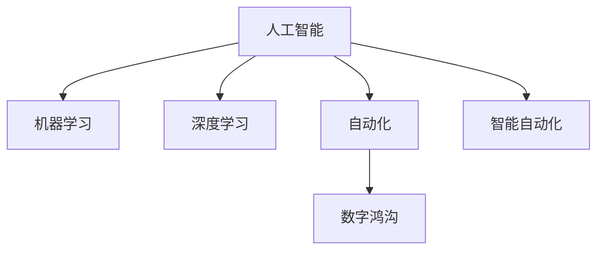

                 

# AI对社会结构的潜在影响探讨

## 1. 背景介绍

在过去几十年中，人工智能（AI）技术的发展已经在多个领域产生了深远的影响。从医疗保健到金融服务，再到交通运输，AI技术的应用几乎渗透到了社会的每一个角落。然而，随着AI技术的不断进步，它对社会结构的影响也越来越显著。本文旨在探讨AI技术对社会结构的潜在影响，包括其对劳动力市场、教育体系、伦理道德、以及个人隐私等方面的影响。

### 1.1 问题由来

AI技术在近年来取得了显著的进展，尤其是在深度学习和机器学习领域。这些技术的发展不仅推动了各种智能化应用的出现，同时也对社会的各个方面产生了深远的影响。AI技术不仅改变了人类的工作方式，还影响了人们的日常生活和社会互动方式。因此，理解AI技术对社会结构的影响，对于制定有效的政策和管理措施至关重要。

### 1.2 问题核心关键点

AI对社会结构的影响涉及多个方面，包括劳动力市场、教育体系、伦理道德、以及个人隐私等。这些影响不仅涉及技术层面的变化，还涉及社会、经济和文化层面的深层次变化。理解这些影响，有助于我们更好地应对AI技术带来的挑战和机遇。

## 2. 核心概念与联系

### 2.1 核心概念概述

为了深入探讨AI对社会结构的影响，本节将介绍几个关键概念：

- **人工智能（AI）**：指通过计算机程序实现的一系列自动化任务，包括感知、理解、学习、推理等能力。
- **机器学习（ML）**：指让计算机通过数据学习规律和模式，从而完成特定任务的过程。
- **深度学习（DL）**：指通过多层神经网络模拟人脑的神经元网络，实现高级模式识别和决策能力。
- **自动化**：指通过AI技术自动完成某些任务，减少人力成本和提升效率。
- **智能自动化**：指具有学习能力和适应性，能够根据环境和需求进行调整的自动化系统。
- **数字鸿沟**：指不同社会群体之间在数字技术获取和使用上的差距。

这些概念之间的关系可以通过以下Mermaid流程图来展示：



这个流程图展示了AI技术的核心组成及其对社会的影响路径：

1. **人工智能** 是基础，包含了机器学习和深度学习等技术手段。
2. **自动化** 通过AI技术实现任务的自动化，提高效率和生产力。
3. **智能自动化** 在自动化的基础上加入学习能力和适应性，进一步提升系统的智能水平。
4. **数字鸿沟** 指不同社会群体在获取和使用AI技术上的不平衡，可能加剧社会不平等。

## 3. 核心算法原理 & 具体操作步骤

### 3.1 算法原理概述

AI对社会结构的影响，很大程度上取决于其算法的原理和操作。本节将详细探讨AI算法的基本原理和具体操作步骤。

**3.1.1 算法原理概述**

AI算法的基本原理是通过数据学习规律和模式，从而完成特定的任务。常见的AI算法包括：

- **监督学习（Supervised Learning）**：指使用带有标签的数据进行训练，以预测新的标签。
- **无监督学习（Unsupervised Learning）**：指在没有标签的情况下，通过数据的内在结构进行学习。
- **强化学习（Reinforcement Learning）**：指通过与环境的交互，学习如何在特定环境下完成任务。

这些算法在不同的应用场景中有着不同的优势和限制。在社会结构的影响方面，监督学习可以用于预测和决策，无监督学习可以用于数据分析和模式发现，强化学习可以用于优化和策略制定。

**3.1.2 算法步骤详解**

AI算法的具体操作步骤包括以下几个步骤：

1. **数据收集和预处理**：从不同来源收集数据，并进行清洗和预处理，以确保数据的质量和可用性。
2. **模型选择和设计**：根据任务需求选择合适的算法模型，并对其进行设计和调整。
3. **训练和验证**：使用训练数据对模型进行训练，并通过验证数据进行评估和调整。
4. **部署和应用**：将训练好的模型部署到实际应用场景中，进行实时或批量处理。

### 3.2 算法优缺点

AI算法在实现自动化和智能化方面具有显著的优势，但也存在一些潜在的缺点：

**优点：**

- **高效性**：通过算法自动处理大量数据，大幅提升效率和生产力。
- **精确性**：AI算法能够精确地预测和决策，减少人为错误。
- **可扩展性**：算法可以轻松应用于不同的场景和任务，具有较高的灵活性。

**缺点：**

- **数据依赖性**：算法的性能很大程度上取决于数据的质量和数量，数据偏差可能导致算法偏见。
- **解释性不足**：AI算法的决策过程往往是"黑箱"，难以解释其内部的工作机制。
- **伦理和道德问题**：AI算法可能被用于不道德或有害的行为，需要严格监管。

### 3.3 算法应用领域

AI算法在多个领域都有广泛的应用，包括：

- **医疗保健**：通过AI算法进行疾病诊断、治疗方案推荐等。
- **金融服务**：使用AI算法进行风险评估、信用评分等。
- **交通运输**：利用AI算法进行自动驾驶、路线规划等。
- **教育**：AI算法可以用于个性化教育、自动化评分等。

## 4. 数学模型和公式 & 详细讲解 & 举例说明

### 4.1 数学模型构建

AI算法通常使用数学模型进行描述和分析。本节将介绍几种常见的数学模型及其构建方法。

**4.1.1 监督学习模型**

监督学习模型通常使用线性回归、逻辑回归、决策树、支持向量机等算法。以线性回归为例，其数学模型可以表示为：

$$
y = \theta^T x + b
$$

其中，$y$ 表示输出，$x$ 表示输入特征，$\theta$ 表示模型参数，$b$ 表示截距。

**4.1.2 无监督学习模型**

无监督学习模型通常使用聚类、降维、关联规则等算法。以K-means聚类为例，其数学模型可以表示为：

$$
\min_{\mu, c} \sum_{i=1}^{n} \min_{k=1,...,K} ||x_i - \mu_k||^2
$$

其中，$\mu_k$ 表示第$k$个聚类的中心，$c$ 表示每个样本的聚类标签。

**4.1.3 强化学习模型**

强化学习模型通常使用Q-learning、策略梯度等算法。以Q-learning为例，其数学模型可以表示为：

$$
Q(s,a) \leftarrow (1-\alpha)Q(s,a) + \alpha(r + \gamma \max Q(s',a'))
$$

其中，$s$ 表示状态，$a$ 表示动作，$r$ 表示奖励，$Q(s,a)$ 表示状态动作值，$\alpha$ 表示学习率，$\gamma$ 表示折扣因子。

### 4.2 公式推导过程

上述数学模型的推导过程涉及较多的数学和统计学知识，本文仅简要介绍一些关键概念。

- **线性回归**：通过最小化误差平方和，求解最优参数$\theta$。
- **K-means聚类**：通过迭代计算质心和聚类中心，逐步优化聚类结果。
- **Q-learning**：通过迭代更新Q值，优化策略函数。

### 4.3 案例分析与讲解

以医疗诊断为例，说明AI算法在实际应用中的具体实现：

**案例背景**：某医院利用AI算法进行癌症诊断。

**数据收集**：收集医院的历史病例数据，包括病人的年龄、性别、症状等。

**模型选择**：选择支持向量机（SVM）算法进行模型构建。

**训练和验证**：使用训练数据对模型进行训练，并通过验证数据进行评估和调整。

**部署和应用**：将训练好的模型部署到医院的诊断系统中，用于实时诊断和处理新病例。

## 5. 项目实践：代码实例和详细解释说明

### 5.1 开发环境搭建

在进行AI算法实践前，我们需要准备好开发环境。以下是使用Python进行TensorFlow开发的环境配置流程：

1. 安装Anaconda：从官网下载并安装Anaconda，用于创建独立的Python环境。

2. 创建并激活虚拟环境：
```bash
conda create -n tf-env python=3.8 
conda activate tf-env
```

3. 安装TensorFlow：根据CUDA版本，从官网获取对应的安装命令。例如：
```bash
conda install tensorflow -c conda-forge -c pytorch
```

4. 安装NumPy、Pandas、scikit-learn等必要的工具包：
```bash
pip install numpy pandas scikit-learn matplotlib
```

完成上述步骤后，即可在`tf-env`环境中开始AI算法实践。

### 5.2 源代码详细实现

以下是一个简单的Python代码示例，用于实现线性回归算法：

```python
import numpy as np

def linear_regression(X, y, learning_rate, num_epochs):
    m, n = X.shape
    theta = np.zeros(n)
    X = np.hstack((np.ones((m, 1)), X))  # Add bias term
    for epoch in range(num_epochs):
        hypothesis = np.dot(X, theta)
        loss = np.sum((hypothesis - y) ** 2) / (2 * m)
        theta -= learning_rate * (1 / m) * np.dot(X.T, hypothesis - y)
    return theta

# 示例数据
X = np.array([[1, 2], [2, 3], [3, 4], [4, 5], [5, 6]])
y = np.array([2, 3, 4, 5, 6])
learning_rate = 0.01
num_epochs = 1000

theta = linear_regression(X, y, learning_rate, num_epochs)
print('theta:', theta)
```

### 5.3 代码解读与分析

让我们再详细解读一下关键代码的实现细节：

**linear_regression函数**：
- **输入**：$X$ 为输入特征矩阵，$y$ 为输出标签，$learning_rate$ 为学习率，$num_epochs$ 为迭代次数。
- **实现**：首先添加偏置项，然后在每次迭代中计算预测值、损失函数，并更新参数$\theta$。
- **输出**：返回最优的参数$\theta$。

**示例数据**：
- **$X$**：输入特征矩阵。
- **$y$**：输出标签。
- **$learning_rate$**：学习率，控制参数更新的步长。
- **$num_epochs$**：迭代次数，控制算法训练的周期。

**运行结果展示**：
- **$\theta$**：返回的最优参数。

## 6. 实际应用场景

### 6.1 智能交通

AI算法在智能交通领域有着广泛的应用。通过AI技术，可以实现交通流量监测、交通信号优化、自动驾驶等。

**智能交通系统**：
- **流量监测**：利用摄像头和传感器监测交通流量，实时调整交通信号灯。
- **信号优化**：通过AI算法优化交通信号灯的时序，提高交通效率。
- **自动驾驶**：利用AI算法进行路径规划和决策，实现自动驾驶汽车。

### 6.2 智慧医疗

AI算法在医疗领域的应用同样广泛。通过AI技术，可以实现疾病诊断、治疗方案推荐、医疗影像分析等。

**智慧医疗系统**：
- **疾病诊断**：利用AI算法进行疾病诊断，提高诊断准确性。
- **治疗方案推荐**：通过分析患者数据，推荐个性化的治疗方案。
- **医疗影像分析**：利用AI算法分析医学影像，辅助医生进行诊断。

### 6.3 个性化推荐

AI算法在电子商务和媒体内容推荐中有着广泛的应用。通过AI技术，可以实现个性化推荐、广告投放优化等。

**个性化推荐系统**：
- **推荐算法**：利用AI算法分析用户行为数据，进行个性化推荐。
- **广告投放**：通过AI算法优化广告投放策略，提高广告效果。
- **内容生成**：利用AI算法生成个性化内容，满足用户需求。

### 6.4 未来应用展望

随着AI技术的不断进步，其在社会结构中的影响将越来越显著。未来，AI技术将在以下几个方面进一步发展：

- **多模态融合**：将语音、图像、文本等多模态数据进行融合，提升AI系统的智能水平。
- **自适应学习**：通过AI算法实现自适应学习，增强系统的适应性和泛化能力。
- **联邦学习**：通过分布式计算，实现数据隐私保护和高效学习。
- **可解释性**：通过AI算法实现决策过程的可解释性，增强系统的可信度。

## 7. 工具和资源推荐

### 7.1 学习资源推荐

为了帮助开发者系统掌握AI技术，以下推荐一些优质的学习资源：

1. **Deep Learning Specialization by Andrew Ng**：斯坦福大学开设的深度学习课程，涵盖深度学习的基础理论、算法和应用。
2. **TensorFlow官方文档**：TensorFlow的官方文档，包含丰富的教程和示例，适合入门和进阶学习。
3. **Python Data Science Handbook**：由Jake VanderPlas所著，全面介绍Python在数据科学中的应用，包括机器学习、数据处理等。
4. **Kaggle平台**：数据科学竞赛平台，提供丰富的数据集和实战项目，适合练习和提高。
5. **Coursera**：在线教育平台，提供多门人工智能相关课程，涵盖从基础到高级的内容。

通过这些资源的学习实践，相信你一定能够快速掌握AI技术的精髓，并用于解决实际问题。

### 7.2 开发工具推荐

高效的开发离不开优秀的工具支持。以下是几款用于AI算法开发的常用工具：

1. **TensorFlow**：由Google主导开发的深度学习框架，适合大规模工程应用。
2. **PyTorch**：由Facebook主导开发的深度学习框架，灵活动态的计算图，适合快速迭代研究。
3. **Scikit-learn**：Python的机器学习库，提供丰富的算法实现和评估工具。
4. **Keras**：基于TensorFlow和Theano的高级神经网络API，适合快速原型开发。
5. **Jupyter Notebook**：交互式笔记本环境，方便代码调试和实验记录。

合理利用这些工具，可以显著提升AI算法的开发效率，加快创新迭代的步伐。

### 7.3 相关论文推荐

AI技术的发展离不开学界的持续研究。以下是几篇奠基性的相关论文，推荐阅读：

1. **Deep Blue: A Self-Training Method for Zero-Shot Learning**：提出一种基于自监督学习的零样本学习方法，通过优化噪声自编码器进行训练。
2. **ImageNet Classification with Deep Convolutional Neural Networks**：提出卷积神经网络（CNN）架构，应用于大规模图像分类任务。
3. **AlphaGo Zero**：提出基于强化学习的AlphaGoZero，通过自我对弈进行学习和优化。
4. **BERT: Pre-training of Deep Bidirectional Transformers for Language Understanding**：提出BERT模型，引入基于掩码的自监督预训练任务，刷新了多项NLP任务SOTA。
5. **Towards a Unified Theory of Neural Net Synchronization**：提出神经网络同步理论，探讨神经网络中信息传播的规律。

这些论文代表了大数据、深度学习和强化学习等前沿技术的进展，推动了AI技术的发展和应用。

## 8. 总结：未来发展趋势与挑战

### 8.1 研究成果总结

AI技术在多个领域的应用已经取得显著进展，但仍面临一些挑战和限制：

- **数据质量**：AI算法的效果很大程度上取决于数据的质量和数量，数据偏差可能导致算法偏见。
- **可解释性**：AI算法的决策过程往往是"黑箱"，难以解释其内部的工作机制。
- **伦理和道德问题**：AI算法可能被用于不道德或有害的行为，需要严格监管。

### 8.2 未来发展趋势

未来，AI技术的发展将呈现以下几个趋势：

- **自动化和智能化**：通过AI算法实现自动化和智能化，提高生产效率和社会服务水平。
- **跨领域应用**：AI技术将在更多领域得到应用，如金融、医疗、教育等，带来更广泛的社会影响。
- **联邦学习**：通过分布式计算，实现数据隐私保护和高效学习。
- **多模态融合**：将语音、图像、文本等多模态数据进行融合，提升AI系统的智能水平。

### 8.3 面临的挑战

尽管AI技术取得了显著进展，但仍面临一些挑战和限制：

- **数据质量**：AI算法的效果很大程度上取决于数据的质量和数量，数据偏差可能导致算法偏见。
- **可解释性**：AI算法的决策过程往往是"黑箱"，难以解释其内部的工作机制。
- **伦理和道德问题**：AI算法可能被用于不道德或有害的行为，需要严格监管。

### 8.4 研究展望

未来，AI技术的研究方向可能集中在以下几个方面：

- **多模态融合**：将语音、图像、文本等多模态数据进行融合，提升AI系统的智能水平。
- **自适应学习**：通过AI算法实现自适应学习，增强系统的适应性和泛化能力。
- **联邦学习**：通过分布式计算，实现数据隐私保护和高效学习。
- **可解释性**：通过AI算法实现决策过程的可解释性，增强系统的可信度。

## 9. 附录：常见问题与解答

**Q1：AI算法在实际应用中需要注意哪些问题？**

A: AI算法在实际应用中需要注意以下几个问题：

1. **数据质量**：AI算法的效果很大程度上取决于数据的质量和数量，数据偏差可能导致算法偏见。
2. **可解释性**：AI算法的决策过程往往是"黑箱"，难以解释其内部的工作机制。
3. **伦理和道德问题**：AI算法可能被用于不道德或有害的行为，需要严格监管。

**Q2：如何提高AI算法的可解释性？**

A: 提高AI算法的可解释性可以通过以下几个方法：

1. **可视化技术**：通过可视化技术展示算法的决策过程和特征重要性。
2. **简化模型**：通过简化模型结构，降低模型的复杂度，使其更易于理解和解释。
3. **可解释性算法**：使用可解释性算法，如LIME、SHAP等，帮助解释模型输出。

**Q3：如何避免AI算法的偏见？**

A: 避免AI算法的偏见可以通过以下几个方法：

1. **数据清洗**：通过数据清洗，去除数据中的偏见和噪声。
2. **多样性训练**：使用多样化的数据集进行训练，避免模型对单一数据源的依赖。
3. **公平性约束**：在算法设计中引入公平性约束，避免对特定群体的歧视。

通过上述方法，可以最大限度地避免AI算法的偏见，提高其公平性和可信度。

**Q4：未来AI技术的发展方向有哪些？**

A: 未来AI技术的发展方向可能集中在以下几个方面：

1. **多模态融合**：将语音、图像、文本等多模态数据进行融合，提升AI系统的智能水平。
2. **自适应学习**：通过AI算法实现自适应学习，增强系统的适应性和泛化能力。
3. **联邦学习**：通过分布式计算，实现数据隐私保护和高效学习。
4. **可解释性**：通过AI算法实现决策过程的可解释性，增强系统的可信度。

这些方向的发展将推动AI技术在更多领域的深入应用，带来更广泛的社会影响。

---

作者：禅与计算机程序设计艺术 / Zen and the Art of Computer Programming

