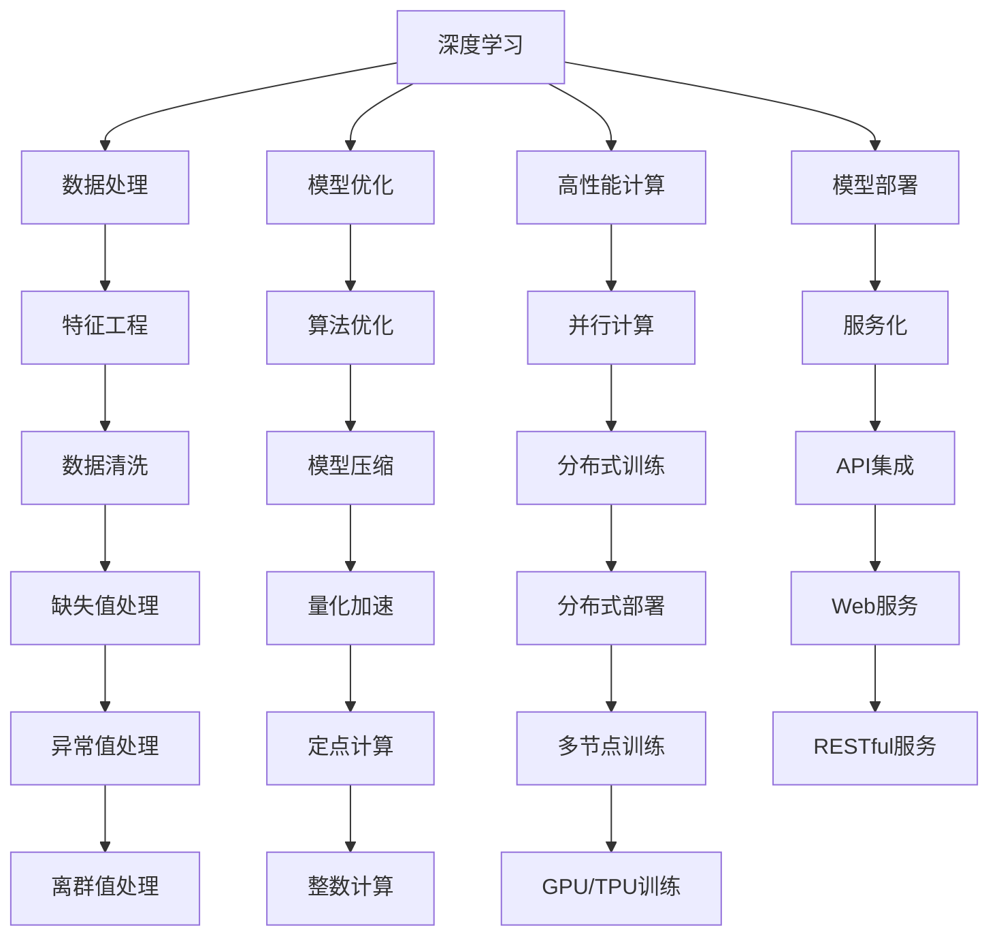

                 

# AI工程原理与项目实战

> 关键词：AI工程, 深度学习, 机器学习, 数据处理, 计算机视觉, 自然语言处理, 模型优化, 高性能计算, 人工智能项目

## 1. 背景介绍

### 1.1 问题由来

随着人工智能技术的快速发展，深度学习和机器学习在各个行业领域得到了广泛应用。AI工程不仅涉及理论知识，还包括项目实施、模型优化、高性能计算等实践技能。本文旨在全面阐述AI工程的原理与实践，帮助读者系统掌握从理论到应用的全过程。

### 1.2 问题核心关键点

AI工程的核心在于如何将理论知识转化为实际应用，涵盖数据预处理、模型构建、训练优化、模型部署等多个环节。在实际应用中，AI工程需要解决以下核心问题：

- 如何高效处理大规模数据？
- 如何选择和构建高效的模型？
- 如何快速训练和优化深度学习模型？
- 如何部署和优化AI模型性能？
- 如何在不同场景下应用AI技术？

这些核心问题直接关系到AI项目的成败和应用效果，本文将围绕这些问题展开系统讨论。

### 1.3 问题研究意义

掌握AI工程的原理与实践，对于推动人工智能技术的实际应用具有重要意义：

1. 提升项目实施效率：系统掌握AI工程流程，能够大幅提升项目开发效率，缩短开发周期。
2. 优化模型性能：深入理解AI工程原理，能够选择和使用更加高效、准确的模型，提升模型性能。
3. 降低技术门槛：AI工程方法论和工具推荐，能够帮助更多开发者快速上手AI项目，减少技术门槛。
4. 促进跨领域应用：AI工程的实践技能和工具推荐，适用于计算机视觉、自然语言处理、语音识别等多个领域，促进AI技术在更多场景下的应用。
5. 推动产业升级：AI工程的技术和方法论，能够加速各行各业的数字化转型，提升产业竞争力。

## 2. 核心概念与联系

### 2.1 核心概念概述

为更好地理解AI工程原理与实践，本节将介绍几个核心概念：

- 深度学习(Deep Learning)：基于神经网络模型的一种机器学习方法，能够处理复杂非线性关系。
- 机器学习(Machine Learning)：通过数据训练模型，使其具备预测和决策能力。
- 数据处理(Data Processing)：包括数据清洗、特征工程、数据增强等，是数据驱动型AI项目的基础。
- 高性能计算(High Performance Computing, HPC)：使用高性能硬件和算法优化技术，加速模型训练和推理。
- 分布式计算(Distributed Computing)：将计算任务分布到多个计算节点上并行处理，提高计算效率。
- 模型优化(Model Optimization)：通过算法和硬件优化，提升模型的计算效率和推理性能。
- 模型部署(Model Deployment)：将训练好的模型集成到实际应用中，提供服务。

这些概念之间的逻辑关系可以通过以下Mermaid流程图来展示：



这个流程图展示了一些关键概念及其之间的联系：

1. 深度学习基于数据处理和特征工程构建模型。
2. 高性能计算和模型优化提升模型性能。
3. 分布式计算和模型部署使AI模型能够高效地应用于实际场景。

这些概念共同构成了AI工程的体系框架，使得AI技术的实施更加高效、可靠。

## 3. 核心算法原理 & 具体操作步骤

### 3.1 算法原理概述

AI工程的核心算法原理主要涉及以下几个方面：

- 数据预处理与特征工程：通过数据清洗、归一化、特征选择等技术，准备高质量的数据集。
- 深度学习模型构建与训练：使用深度神经网络模型进行特征提取和模式学习，在标注数据上训练优化模型。
- 模型评估与优化：通过交叉验证、超参数调优等技术评估模型性能，并针对性能瓶颈进行优化。
- 高性能计算与分布式训练：利用GPU、TPU等高性能硬件，以及分布式训练技术，加速模型训练过程。
- 模型部署与优化：将训练好的模型封装为服务接口，部署到生产环境，并进行性能优化和监控。

### 3.2 算法步骤详解

AI工程的实施通常包括以下关键步骤：

**Step 1: 数据预处理与特征工程**

1. 数据收集：根据项目需求，收集数据集。包括数据格式、质量、来源等要素。
2. 数据清洗：处理缺失值、异常值、重复值等数据问题，保证数据质量。
3. 特征选择与工程：提取和构造关键特征，使用技术如PCA、One-Hot编码等提升数据表达能力。

**Step 2: 深度学习模型构建与训练**

1. 选择模型：根据任务类型选择合适的深度学习模型，如CNN、RNN、Transformer等。
2. 设计架构：设计模型的网络层数、激活函数、损失函数等关键参数。
3. 训练模型：使用GPU/TPU等高性能硬件，优化训练过程，控制超参数如学习率、批大小等。

**Step 3: 模型评估与优化**

1. 性能评估：使用测试集进行模型评估，计算准确率、召回率、F1值等指标。
2. 调参优化：根据评估结果，调整超参数，使用网格搜索、随机搜索等技术寻找最优参数组合。
3. 模型融合：使用集成学习、模型融合等方法提升模型性能。

**Step 4: 高性能计算与分布式训练**

1. 分布式计算：使用分布式框架如PyTorch Distributed、TensorFlow Distributed等，实现并行训练。
2. 计算加速：使用GPU/TPU、量化加速、混合精度训练等技术提升训练速度。
3. 模型压缩：使用剪枝、量化、蒸馏等技术减少模型大小，提高推理速度。

**Step 5: 模型部署与优化**

1. 服务化封装：使用Flask、TorchServe等框架，将模型封装为API接口。
2. 部署优化：部署到云平台如AWS、Azure、Google Cloud等，进行性能监控和优化。
3. 实时处理：使用流处理框架如Kafka、Flink等，实现实时数据流处理。

### 3.3 算法优缺点

AI工程的算法原理和方法具有以下优点：

- 高效性：利用高性能计算和分布式训练，大幅提升模型训练和推理效率。
- 鲁棒性：通过特征选择和模型优化，提升模型对数据变化的适应能力。
- 可扩展性：使用分布式计算和模型服务化，支持大规模数据处理和实时应用。

同时，这些方法也存在一些局限性：

- 数据依赖性：依赖高质量标注数据，获取高质量数据成本较高。
- 计算资源需求高：高性能硬件和分布式计算资源要求较高。
- 模型复杂度：深度学习模型复杂度高，调试和优化难度大。
- 技术门槛高：需要掌握多种技术栈和工具，学习曲线较陡峭。

### 3.4 算法应用领域

AI工程的应用领域非常广泛，涵盖多个领域：

- 计算机视觉：如图像分类、目标检测、图像生成等任务。
- 自然语言处理：如文本分类、情感分析、机器翻译等任务。
- 语音识别：如语音识别、情感分析、语音生成等任务。
- 推荐系统：如个性化推荐、广告投放等任务。
- 自动驾驶：如环境感知、路径规划、决策等任务。
- 智能家居：如语音交互、场景感知等任务。

## 4. 数学模型和公式 & 详细讲解 & 举例说明

### 4.1 数学模型构建

AI工程中的数学模型主要涉及以下几个方面：

- 深度学习模型的数学表示：如卷积神经网络(CNN)、循环神经网络(RNN)、变压器(Transformer)等。
- 优化算法的数学表示：如梯度下降、Adam、SGD等。
- 损失函数的设计：如交叉熵损失、均方误差损失等。

以卷积神经网络(CNN)为例，其数学表示如下：

$$
y = W^{(1)}x + b^{(1)}
$$

其中 $x$ 为输入数据，$W^{(1)}$ 为卷积核权重，$b^{(1)}$ 为偏置项。

### 4.2 公式推导过程

以下是卷积神经网络(CNN)的公式推导过程：

**卷积层公式**：

$$
y_{i,j} = W_{f,i} * x_{m,n} + b_{f}
$$

其中 $y_{i,j}$ 为卷积层的输出，$W_{f,i}$ 为卷积核权重，$x_{m,n}$ 为输入数据，$b_{f}$ 为偏置项。

**池化层公式**：

$$
y_{i,j} = \max_{r,s} x_{i+r,j+s}
$$

其中 $y_{i,j}$ 为池化层的输出，$x_{i+r,j+s}$ 为池化窗口内的最大值。

**全连接层公式**：

$$
y = W^{(3)}x + b^{(3)}
$$

其中 $y$ 为全连接层的输出，$W^{(3)}$ 为权重矩阵，$x$ 为前一层的输出，$b^{(3)}$ 为偏置项。

### 4.3 案例分析与讲解

以图像分类任务为例，使用卷积神经网络进行模型构建和训练。

1. 数据预处理：使用ImageNet数据集，进行数据清洗和归一化处理。
2. 模型构建：设计一个包含卷积层、池化层和全连接层的CNN模型。
3. 训练模型：使用GPU训练模型，优化超参数，计算损失函数。
4. 模型评估：使用测试集进行评估，计算准确率和损失函数。
5. 模型优化：使用梯度下降优化算法，调整学习率，提升模型性能。

## 5. 项目实践：代码实例和详细解释说明

### 5.1 开发环境搭建

在进行AI工程实践前，我们需要准备好开发环境。以下是使用Python进行PyTorch开发的环境配置流程：

1. 安装Anaconda：从官网下载并安装Anaconda，用于创建独立的Python环境。

2. 创建并激活虚拟环境：
```bash
conda create -n pytorch-env python=3.8 
conda activate pytorch-env
```

3. 安装PyTorch：根据CUDA版本，从官网获取对应的安装命令。例如：
```bash
conda install pytorch torchvision torchaudio cudatoolkit=11.1 -c pytorch -c conda-forge
```

4. 安装各类工具包：
```bash
pip install numpy pandas scikit-learn matplotlib tqdm jupyter notebook ipython
```

完成上述步骤后，即可在`pytorch-env`环境中开始AI工程实践。

### 5.2 源代码详细实现

这里我们以图像分类任务为例，给出使用Transformers库对卷积神经网络进行构建和训练的PyTorch代码实现。

```python
import torch
import torch.nn as nn
import torchvision.transforms as transforms
import torchvision.datasets as datasets

# 定义卷积神经网络模型
class CNNModel(nn.Module):
    def __init__(self):
        super(CNNModel, self).__init__()
        self.conv1 = nn.Conv2d(3, 64, kernel_size=3, stride=1, padding=1)
        self.pool = nn.MaxPool2d(kernel_size=2, stride=2)
        self.fc1 = nn.Linear(64 * 28 * 28, 512)
        self.fc2 = nn.Linear(512, 10)

    def forward(self, x):
        x = self.conv1(x)
        x = torch.relu(x)
        x = self.pool(x)
        x = x.view(-1, 64 * 28 * 28)
        x = self.fc1(x)
        x = torch.relu(x)
        x = self.fc2(x)
        return x

# 加载数据集
train_dataset = datasets.CIFAR10(root='./data', train=True, transform=transforms.ToTensor(), download=True)
test_dataset = datasets.CIFAR10(root='./data', train=False, transform=transforms.ToTensor(), download=True)

# 定义数据处理
train_loader = torch.utils.data.DataLoader(train_dataset, batch_size=64, shuffle=True)
test_loader = torch.utils.data.DataLoader(test_dataset, batch_size=64, shuffle=False)

# 定义模型
model = CNNModel()
model.to('cuda')

# 定义损失函数和优化器
criterion = nn.CrossEntropyLoss()
optimizer = torch.optim.Adam(model.parameters(), lr=0.001)

# 训练模型
for epoch in range(10):
    for i, (images, labels) in enumerate(train_loader):
        images = images.to('cuda')
        labels = labels.to('cuda')
        optimizer.zero_grad()
        outputs = model(images)
        loss = criterion(outputs, labels)
        loss.backward()
        optimizer.step()

# 模型评估
correct = 0
total = 0
with torch.no_grad():
    for images, labels in test_loader:
        images = images.to('cuda')
        labels = labels.to('cuda')
        outputs = model(images)
        _, predicted = torch.max(outputs.data, 1)
        total += labels.size(0)
        correct += (predicted == labels).sum().item()

print('Accuracy of the network on the 10000 test images: %d %%' % (100 * correct / total))
```

### 5.3 代码解读与分析

让我们再详细解读一下关键代码的实现细节：

**CNNModel类**：
- `__init__`方法：初始化卷积核权重、池化窗口、全连接层权重等参数。
- `forward`方法：定义模型的前向传播过程，包括卷积、池化、全连接等操作。

**数据加载**：
- `CIFAR10`类：加载CIFAR-10数据集，并使用`ToTensor`转换数据格式。
- `DataLoader`类：创建数据加载器，将数据集划分为训练集和测试集，并进行批处理。

**模型定义**：
- 使用`torch.nn.Module`定义CNN模型，包含卷积层、池化层和全连接层。

**损失函数和优化器**：
- `CrossEntropyLoss`类：定义交叉熵损失函数，用于分类任务的评估。
- `Adam`类：定义Adam优化器，用于模型参数的优化。

**模型训练**：
- 在每个epoch内，对训练集进行迭代，前向传播计算损失函数，反向传播更新模型参数。
- 使用`zero_grad`清除梯度，`backward`计算梯度，`step`更新模型参数。

**模型评估**：
- 在测试集上计算准确率，评估模型性能。
- 使用`with torch.no_grad`避免对模型参数进行梯度计算，加速评估过程。

可以看到，PyTorch使得AI工程的实现变得简洁高效。开发者可以将更多精力放在模型设计、优化和调试上，而不必过多关注底层的实现细节。

## 6. 实际应用场景

### 6.1 智能推荐系统

智能推荐系统是AI工程的一个重要应用场景，通过分析用户的历史行为数据，推荐个性化的内容，提升用户体验。具体实现如下：

1. 数据收集：收集用户的浏览历史、评分、评论等数据。
2. 特征工程：提取用户特征、物品特征，构造特征向量。
3. 模型构建：选择基于协同过滤、深度学习等方法的推荐模型。
4. 训练优化：使用分布式训练和模型优化技术，提升模型性能。
5. 部署服务：使用Flask、TorchServe等框架，将模型部署为API服务。

### 6.2 自动驾驶

自动驾驶系统需要实时处理大量的传感器数据，进行环境感知、路径规划和决策。具体实现如下：

1. 数据收集：收集车辆传感器数据、地图数据等。
2. 特征工程：提取车辆位置、速度、方向等信息，构造特征向量。
3. 模型构建：选择基于深度学习的感知和决策模型。
4. 训练优化：使用分布式计算和模型优化技术，提升模型性能。
5. 部署服务：使用流处理框架如Kafka、Flink等，实现实时数据流处理。

### 6.3 金融风控

金融风控系统需要对大量交易数据进行实时分析，识别异常交易和风险。具体实现如下：

1. 数据收集：收集交易数据、用户行为数据等。
2. 特征工程：提取交易金额、时间、地点等信息，构造特征向量。
3. 模型构建：选择基于深度学习的异常检测和分类模型。
4. 训练优化：使用分布式训练和模型优化技术，提升模型性能。
5. 部署服务：使用Flink、Spark等框架，实现实时数据流处理。

## 7. 工具和资源推荐

### 7.1 学习资源推荐

为了帮助开发者系统掌握AI工程的原理与实践，这里推荐一些优质的学习资源：

1. 《深度学习》系列书籍：由著名深度学习专家Ian Goodfellow、Yoshua Bengio、Aaron Courville撰写，全面介绍了深度学习的基本概念和算法。
2. Coursera《深度学习专项课程》：由斯坦福大学Andrew Ng教授讲授，涵盖深度学习的基础理论和实践技巧。
3. TensorFlow官方文档：提供了详细的TensorFlow框架文档和代码示例，帮助开发者快速上手。
4. PyTorch官方文档：提供了详细的PyTorch框架文档和代码示例，帮助开发者快速上手。
5. Kaggle竞赛平台：提供了大量的数据集和竞赛题目，帮助开发者实践和提高。

通过对这些资源的学习实践，相信你一定能够快速掌握AI工程的精髓，并用于解决实际的AI项目问题。

### 7.2 开发工具推荐

高效的开发离不开优秀的工具支持。以下是几款用于AI工程开发的常用工具：

1. PyTorch：基于Python的开源深度学习框架，灵活动态的计算图，适合快速迭代研究。

2. TensorFlow：由Google主导开发的开源深度学习框架，生产部署方便，适合大规模工程应用。

3. Jupyter Notebook：Python编程的交互式开发环境，支持多语言的代码实现和实时调试。

4. Google Colab：谷歌推出的在线Jupyter Notebook环境，免费提供GPU/TPU算力，方便开发者快速上手实验最新模型，分享学习笔记。

5. PyCharm：专业的Python开发环境，支持代码调试、版本控制、代码重构等功能。

6. Anaconda：Python环境管理工具，支持虚拟环境创建和管理，方便开发者环境部署。

合理利用这些工具，可以显著提升AI工程的开发效率，加快创新迭代的步伐。

### 7.3 相关论文推荐

AI工程的发展源于学界的持续研究。以下是几篇奠基性的相关论文，推荐阅读：

1. AlexNet: ImageNet Classification with Deep Convolutional Neural Networks：提出卷积神经网络AlexNet，在ImageNet数据集上取得了突破性性能。

2. ResNet: Deep Residual Learning for Image Recognition：提出残差网络ResNet，解决了深度神经网络训练中的梯度消失问题，提升了模型深度和性能。

3. Inception: GoogLeNet for Real-Time Image Recognition and Visual Search：提出Inception网络，通过多尺度卷积提升了模型表达能力。

4. VGG: Very Deep Convolutional Networks for Large-Scale Image Recognition：提出VGG网络，通过多层次卷积提升了模型准确率。

5. RNNs for Sequence Modeling：提出循环神经网络RNN，适用于时间序列数据的建模和预测。

6. Transformers for Sequence-to-Sequence Learning：提出Transformer网络，适用于自然语言处理中的序列建模和生成。

这些论文代表了大规模AI工程的算法发展脉络。通过学习这些前沿成果，可以帮助研究者把握学科前进方向，激发更多的创新灵感。

## 8. 总结：未来发展趋势与挑战

### 8.1 总结

本文对AI工程的原理与实践进行了全面系统的介绍。首先阐述了AI工程的理论基础和实践技能，明确了从数据预处理到模型部署的完整流程。其次，从模型构建到部署优化，详细讲解了AI工程的各个环节，给出了具体的代码实现和案例分析。同时，本文还广泛探讨了AI工程在各个行业领域的应用前景，展示了AI工程技术的广阔前景。

通过本文的系统梳理，可以看到，AI工程是推动人工智能技术实际应用的重要手段，其系统性、科学性和实用性对AI技术的落地具有重要意义。掌握AI工程的原理与实践，能够加速AI技术的普及和应用，推动各行各业的数字化转型。

### 8.2 未来发展趋势

展望未来，AI工程的发展趋势如下：

1. 深度学习技术不断演进：深度学习模型将向更深、更宽、更复杂的方向发展，处理能力将进一步提升。

2. 高性能计算硬件升级：GPU、TPU等硬件加速设备将不断升级，提升模型训练和推理速度。

3. 分布式计算技术优化：分布式训练和分布式推理技术将不断优化，提升系统扩展性和性能。

4. 模型压缩和优化技术进步：模型压缩、量化、剪枝等技术将不断进步，降低模型存储和计算成本。

5. 实时处理和大数据处理能力增强：流处理和大数据处理技术将不断提升，支持实时数据流和海量数据处理。

6. 自动化机器学习技术发展：自动化机器学习(AutoML)技术将不断发展，提升模型开发和调优的效率。

### 8.3 面临的挑战

尽管AI工程取得了显著进展，但在实现大规模应用时，仍面临以下挑战：

1. 数据质量依赖高：高质量标注数据的获取成本较高，数据标注和清洗过程复杂。

2. 模型复杂度高：深度学习模型的参数量和计算量较大，训练和推理资源需求高。

3. 分布式计算复杂度：分布式计算和并行训练技术复杂，难以实现高效并行。

4. 模型鲁棒性不足：模型对数据分布变化的适应能力较差，泛化性能有待提升。

5. 模型可解释性不足：深度学习模型“黑盒”特性，难以解释内部工作机制和决策逻辑。

### 8.4 研究展望

未来的研究需要在以下几个方面寻求新的突破：

1. 探索低资源和无监督学习：在资源受限和无监督数据情况下，开发高效学习算法。

2. 研究高效和可解释的模型：开发高效模型压缩技术，提升模型可解释性。

3. 结合多模态数据和知识图谱：将文本、图像、知识图谱等不同模态数据结合，提升模型性能。

4. 引入博弈论和决策理论：结合博弈论和决策理论，优化AI系统行为和策略。

5. 考虑伦理和安全问题：在模型设计和训练过程中，考虑伦理和安全问题，确保模型行为合规、安全。

## 9. 附录：常见问题与解答

**Q1: 数据预处理中，数据清洗和特征工程的作用是什么？**

A: 数据清洗和特征工程是AI工程的重要环节。数据清洗旨在处理缺失值、异常值、重复值等数据问题，保证数据质量。特征工程通过提取和构造关键特征，提升数据表达能力，为模型学习提供更丰富的信息。数据预处理和特征工程是模型训练的前提，直接影响模型的性能。

**Q2: 深度学习模型的常见类型有哪些？**

A: 深度学习模型的常见类型包括卷积神经网络(CNN)、循环神经网络(RNN)、长短期记忆网络(LSTM)、变压器(Transformer)等。这些模型在图像识别、自然语言处理、语音识别等领域有广泛应用。

**Q3: 分布式计算和分布式训练的优势是什么？**

A: 分布式计算和分布式训练能够将计算任务分散到多个计算节点上并行处理，提高计算效率。具体优势包括：
1. 提高计算速度：通过并行计算，加速模型训练和推理。
2. 提升模型性能：通过大规模数据和模型并行训练，提升模型泛化能力。
3. 降低单节点计算负担：将计算任务分散到多个节点上，减少单个节点的计算负担。

**Q4: 模型压缩和优化技术的进展是什么？**

A: 模型压缩和优化技术包括剪枝、量化、蒸馏等方法，旨在减小模型大小和提升推理速度。近年来，模型压缩和优化技术取得了显著进展，如使用剪枝技术减少模型参数量，使用量化技术将模型转化为定点计算，使用蒸馏技术将大模型压缩为小模型。这些技术提升了模型的计算效率和推理性能，降低了存储和计算成本。

**Q5: AI工程在实际应用中的难点是什么？**

A: AI工程在实际应用中的难点主要包括以下几个方面：
1. 数据获取和标注成本高：高质量标注数据获取成本较高，数据标注和清洗过程复杂。
2. 模型复杂度和计算资源需求高：深度学习模型的参数量和计算量较大，训练和推理资源需求高。
3. 分布式计算技术复杂：分布式计算和并行训练技术复杂，难以实现高效并行。
4. 模型鲁棒性不足：模型对数据分布变化的适应能力较差，泛化性能有待提升。
5. 模型可解释性不足：深度学习模型“黑盒”特性，难以解释内部工作机制和决策逻辑。

合理应对这些挑战，积极探索新的方法和技术，将使AI工程在更多领域得到广泛应用，带来更深刻的社会和经济影响。

