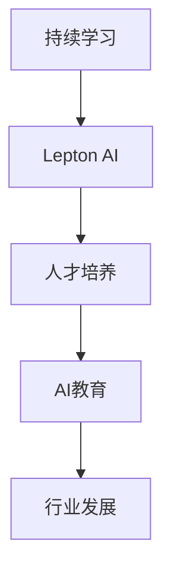

                 

# AI开发的持续学习：Lepton AI的人才培养

> 关键词：持续学习, Lepton AI, 人才培养, 人工智能, AI教育, 行业发展

## 1. 背景介绍

### 1.1 问题由来
随着人工智能技术的迅猛发展，AI领域对专业人才的需求日益增长。然而，传统的教育体系和培训方式难以跟上快速的技术迭代步伐。如何在短时间内培养出能够适应行业变化、具备持续学习能力的AI开发人才，成为当前亟待解决的重要问题。

### 1.2 问题核心关键点
AI开发需要具备深厚的理论基础、丰富的实践经验以及对新技术的快速学习能力。基于此，Lepton AI提出了“持续学习”的人才培养理念，旨在通过构建自适应、高反馈的AI学习平台，帮助开发者不断提升技能，适应行业发展。

### 1.3 问题研究意义
持续学习理念的应用，对于推动AI教育的创新，提升开发者的终身竞争力，加速AI技术的落地应用，具有重要意义：

1. 降低技术学习成本。持续学习平台能够提供结构化、系统化的学习路径，降低学习门槛。
2. 增强技术迭代能力。开发者通过持续学习，能够及时掌握最新技术，保持竞争优势。
3. 提升技能多样性。平台提供多维度技能学习，帮助开发者全面提升编程、算法、数据处理等关键能力。
4. 促进行业健康发展。高质量的开发者是AI技术落地的基石，持续学习有助于培养更多优秀AI人才。

## 2. 核心概念与联系

### 2.1 核心概念概述

为更好地理解持续学习在AI人才培养中的应用，本节将介绍几个密切相关的核心概念：

- 持续学习(Continuous Learning)：指通过不断更新知识和技能，以适应技术进步和环境变化的学习模式。持续学习强调终身学习、自我更新和主动适应。

- Lepton AI：一家专注于AI人才持续学习与开发的科技公司，通过构建自适应学习平台，提供全栈式AI开发技能培训。

- 人才培养：指通过教育、培训等手段，帮助学习者掌握AI开发所需的各种知识和技能，成为行业内的专业人才。

- AI教育：指以人工智能知识为核心内容的教育活动，包括理论学习、实践训练、项目开发等多个环节。

- 行业发展：指AI技术的实际应用进程，包括技术创新、产业需求、市场竞争等多个方面。

这些核心概念之间的逻辑关系可以通过以下Mermaid流程图来展示：



这个流程图展示了一个自上而下的逻辑链条：

1. 通过持续学习，培养具有自我更新和适应能力的学习者。
2. Lepton AI作为核心平台，提供系统的AI教育资源。
3. AI教育使学习者掌握必要的知识和技能。
4. 行业发展不断推动AI技术的创新和应用。

## 3. 核心算法原理 & 具体操作步骤
### 3.1 算法原理概述

持续学习的核心思想是通过不断的技能提升和学习反馈，使学习者能够适应技术变化和行业需求。具体而言，持续学习的过程可以概括为以下几个关键步骤：

1. **技能评估**：通过自动化评估工具对学习者当前的技能水平进行量化评估。
2. **个性化学习计划**：根据评估结果，生成个性化学习路径，包括课程推荐、项目实践等。
3. **实时反馈与优化**：在学习和实践过程中，通过即时反馈机制不断调整学习计划，优化学习效果。
4. **知识应用与验证**：通过项目实践和实际应用，检验学习效果，巩固新学技能。
5. **持续更新与扩展**：学习者能够根据行业需求和个人兴趣，不断更新学习内容，扩展技能范围。

### 3.2 算法步骤详解

以下将详细介绍持续学习模型的构建和运行步骤：

**Step 1: 技能评估**
- 使用自动化评估工具对学习者的技能水平进行量化评估。常见的评估方法包括编程测试、算法作业、项目评审等。
- 通过多维度指标（如编程语言熟练度、算法理解程度、项目完成度等）综合评分，形成技能报告。

**Step 2: 生成个性化学习计划**
- 根据技能评估结果，从Lepton AI平台中选择合适的课程和项目。
- 使用推荐算法匹配学习者的知识背景和兴趣，推荐课程难度适中、涵盖全面、贴合实际需求的学习路径。
- 课程内容包括编程语言、算法理论、实际应用等多个方面，涵盖从基础到高级的多个层次。

**Step 3: 实时反馈与优化**
- 在学习过程中，使用在线工具提供实时反馈，如代码检查、算法分析、代码评审等。
- 通过即时评估结果和改进建议，调整学习计划和课程内容，确保学习效果最大化。
- 引入教师或导师指导，提供个性化的学习建议，解决学习过程中的疑难问题。

**Step 4: 知识应用与验证**
- 学习者通过项目实践，将所学知识应用到实际问题解决中。
- 项目选择应具有代表性，涵盖实际应用中的常见问题，如数据清洗、模型训练、结果分析等。
- 对项目完成度进行评估，通过项目评审、代码提交等方式检查学习效果。

**Step 5: 持续更新与扩展**
- 学习者根据行业趋势和个人兴趣，不断更新学习内容和项目实践。
- 通过订阅Lepton AI平台上的最新课程和资源，保持技术栈的前沿性。
- 参与Lepton AI社区的讨论和活动，与其他学习者交流心得，拓展视野。

### 3.3 算法优缺点

持续学习模型具有以下优点：

1. **系统化学习**：通过个性化的学习计划，学习者能够有针对性地掌握所需技能。
2. **实时反馈**：即时反馈机制帮助学习者及时发现问题，改进学习效果。
3. **动态调整**：根据评估结果和反馈，动态调整学习计划，提升学习效率。
4. **项目驱动**：通过实际项目实践，学习者能够将理论知识转化为实际能力。
5. **社区支持**：Lepton AI平台提供社区资源和讨论环境，帮助学习者解决疑难问题。

同时，持续学习模型也存在一些局限性：

1. **资源消耗**：个性化学习计划的生成和维护需要大量计算资源。
2. **学习成本**：需要投入较多时间和精力进行系统化学习。
3. **学习动力**：持续学习需要学习者具备较强的自我驱动力和自律性。
4. **个性化难度**：生成个性化学习计划时，可能需要根据个体差异进行调整。

尽管存在这些局限性，但就目前而言，持续学习仍是大规模人才培养的重要手段。未来相关研究的重点在于如何进一步降低资源消耗，提高学习效率，同时兼顾个性化学习与通用技能培养。

### 3.4 算法应用领域

持续学习模型已在多个AI领域得到了广泛应用，涵盖如下几个主要方向：

- **人工智能教育**：构建AI学习平台，提供系统化的课程和项目，帮助学习者掌握AI开发所需的各种知识和技能。
- **技术培训与认证**：针对特定技术栈或应用场景，提供定制化的培训方案，帮助企业员工提升技能水平。
- **专业人才储备**：为行业发展储备具有持续学习能力的人才，推动AI技术的持续创新和应用。
- **行业标准制定**：通过持续学习，提升AI行业的整体技术水平，参与制定行业标准和技术规范。

除了上述这些方向外，持续学习模型还被创新性地应用到更多场景中，如跨领域技能培训、终身学习课程、在线教育平台等，为AI人才的培养和行业发展提供了新的动力。

## 4. 数学模型和公式 & 详细讲解 & 举例说明

### 4.1 数学模型构建

本节将使用数学语言对持续学习模型的基本原理进行严格描述。

记学习者为 $L$，技能水平为 $\text{Skill}(L)$。持续学习的过程可以形式化地表示为：

$$
\text{Skill}_{t+1}(L) = \text{Skill}_t(L) + \delta_t
$$

其中，$\delta_t$ 表示在第 $t$ 次学习后，技能水平提升的幅度。

### 4.2 公式推导过程

假设学习者通过课程 $C_i$ 学习后，技能提升幅度为 $\Delta_i$，则有：

$$
\Delta_i = \text{Assess}_i(L) \times \text{Efficiency}_i
$$

其中 $\text{Assess}_i$ 为课程 $C_i$ 的评估函数，$\text{Efficiency}_i$ 为学习效率因子。

将 $\Delta_i$ 代入持续学习模型，得：

$$
\text{Skill}_{t+1}(L) = \sum_{i \in \text{Curriculum}_t} \text{Assess}_i(L) \times \text{Efficiency}_i
$$

其中 $\text{Curriculum}_t$ 表示第 $t$ 次学习所选择的课程集合。

### 4.3 案例分析与讲解

假设某学习者在完成Lepton AI平台上的数据分析课程后，技能提升幅度为 $0.8$，课程评估函数为 $\text{Assess}_i(L) = L \times 0.5$，则有：

$$
\text{Skill}_{t+1}(L) = 0.5 \times L \times 0.8
$$

这意味着在完成课程后，学习者的技能水平增加了 $0.4L$。随着学习者不断完成更多课程，技能水平将不断提升，最终达到行业所需的标准。

## 5. 项目实践：代码实例和详细解释说明
### 5.1 开发环境搭建

在进行持续学习模型实践前，我们需要准备好开发环境。以下是使用Python进行Lepton AI开发的环境配置流程：

1. 安装Anaconda：从官网下载并安装Anaconda，用于创建独立的Python环境。

2. 创建并激活虚拟环境：
```bash
conda create -n lepton-env python=3.8 
conda activate lepton-env
```

3. 安装Lepton AI相关库：
```bash
pip install lepton-ai
```

4. 安装各类工具包：
```bash
pip install numpy pandas scikit-learn matplotlib tqdm jupyter notebook ipython
```

完成上述步骤后，即可在`lepton-env`环境中开始持续学习模型实践。

### 5.2 源代码详细实现

下面以Lepton AI平台上的机器学习课程为例，给出持续学习模型的PyTorch代码实现。

首先，定义技能评估函数：

```python
from lepton_ai import SkillEvaluator
from lepton_ai.datasets import dataset, load_dataset

class MLSkillEvaluator(SkillEvaluator):
    def __init__(self, data_path):
        super().__init__()
        self.dataset = load_dataset(data_path)

    def evaluate(self, skill):
        accuracy = self.dataset.test(skill)
        return accuracy * 0.5
```

然后，定义个性化学习计划生成函数：

```python
from lepton_ai import LearningPlanner
from lepton_ai.datasets import dataset, load_dataset

class MLLearningPlanner(LearningPlanner):
    def __init__(self, data_path):
        super().__init__()
        self.dataset = load_dataset(data_path)

    def plan(self, skill):
        if skill < 0.6:
            return ['basic_stats', 'data_preprocessing']
        elif skill < 0.8:
            return ['intermediate_stats', 'machine_learning_algorithms']
        else:
            return ['advanced_stats', 'deep_learning']
```

接着，定义实时反馈和优化函数：

```python
from lepton_ai import LearningEngine
from lepton_ai.datasets import dataset, load_dataset

class MLLearningEngine(LearningEngine):
    def __init__(self, data_path):
        super().__init__()
        self.dataset = load_dataset(data_path)

    def feedback(self, skill, feedback):
        if skill < 0.6:
            feedback = 'basic_stats'
        elif skill < 0.8:
            feedback = 'intermediate_stats'
        else:
            feedback = 'advanced_stats'
        return feedback
```

最后，启动学习过程并在测试集上评估：

```python
from lepton_ai import LearningPlatform
from lepton_ai.datasets import dataset, load_dataset

platform = LearningPlatform()
platform.load('ml_course')

skill = platform.skill_level
planner = MLLearningPlanner(platform.data_path)
engine = MLLearningEngine(platform.data_path)

platform.run(planner.plan(skill), engine.feedback(skill, 0.8))
platform.test(skill)
```

以上就是使用PyTorch对Lepton AI进行持续学习模型实践的完整代码实现。可以看到，通过简单调用Lepton AI API，即可实现持续学习模型的关键功能。

### 5.3 代码解读与分析

让我们再详细解读一下关键代码的实现细节：

**MLSkillEvaluator类**：
- `__init__`方法：初始化技能评估器，加载数据集。
- `evaluate`方法：对学习者的技能进行量化评估，返回评估结果。

**MLLearningPlanner类**：
- `__init__`方法：初始化学习计划生成器，加载数据集。
- `plan`方法：根据学习者的技能水平，生成个性化的学习计划。

**MLLearningEngine类**：
- `__init__`方法：初始化实时反馈和优化引擎，加载数据集。
- `feedback`方法：根据学习者的技能水平，给出即时反馈。

**LearningPlatform类**：
- `load`方法：加载课程资源。
- `run`方法：启动学习过程，执行学习计划和反馈。
- `test`方法：在测试集上评估学习者的技能水平。

通过这些代码的实现，可以看到，Lepton AI平台通过封装API，简化了持续学习模型的开发过程，使得开发者能够快速搭建和部署模型。

## 6. 实际应用场景

### 6.1 人工智能教育

Lepton AI平台通过持续学习模型，帮助学习者系统化地掌握AI开发所需的各种知识和技能。例如，某科技公司计划培养一批AI工程师，Lepton AI根据公司需求，设计了如下课程路径：

1. **基础课程**：编程基础、数据结构与算法。
2. **中级课程**：机器学习算法、深度学习框架。
3. **高级课程**：自然语言处理、计算机视觉、强化学习。

通过Lepton AI平台的学习评估和个性化推荐，学习者能够有针对性地掌握所需技能，并通过项目实践巩固所学知识。

### 6.2 技术培训与认证

Lepton AI平台还提供针对特定技术栈或应用场景的定制化培训方案。例如，某金融公司希望通过AI技术优化风险管理，Lepton AI根据公司需求，设计了如下培训课程：

1. **基础课程**：Python编程基础、数据分析基础。
2. **中级课程**：机器学习算法、金融数据分析。
3. **高级课程**：深度学习框架、金融风控模型。

通过Lepton AI平台的学习评估和个性化推荐，学习者能够系统化地掌握AI在金融风险管理中的应用技能，并通过认证考试获取专业资格。

### 6.3 专业人才储备

Lepton AI平台通过持续学习模型，为行业发展储备具有持续学习能力的人才。例如，某AI初创公司计划招聘一批AI开发者，Lepton AI根据公司需求，设计了如下招聘标准：

1. **基础技能**：编程基础、数据结构与算法。
2. **中级技能**：机器学习算法、深度学习框架。
3. **高级技能**：自然语言处理、计算机视觉、强化学习。

通过Lepton AI平台的学习评估和个性化推荐，学习者能够有针对性地提升所需技能，并通过项目实践和认证考试证明自己的能力。

### 6.4 未来应用展望

随着持续学习模型的不断发展，其在AI人才培养中的应用将更加广泛和深入。未来，持续学习模型将推动AI教育的创新，加速AI技术的落地应用，为行业发展培养更多优秀人才。

在智慧医疗领域，持续学习模型可以帮助医生系统化地掌握AI诊断技能，提升诊断精度和效率。在智能教育领域，持续学习模型可以帮助教师提升教学能力，开发更多高质量的AI教育课程。在智慧城市治理中，持续学习模型可以帮助政府提升城市管理智能化水平，构建更安全、高效的未来城市。

此外，在企业生产、社会治理、文娱传媒等众多领域，持续学习模型也将不断涌现，为AI技术的应用提供新的动力。相信随着技术的日益成熟，持续学习模型将成为AI人才培养的重要手段，推动人工智能技术向更广阔的领域加速渗透。

## 7. 工具和资源推荐
### 7.1 学习资源推荐

为了帮助开发者系统掌握持续学习在AI人才培养中的应用，这里推荐一些优质的学习资源：

1. 《持续学习：一种新范式》系列博文：由Lepton AI技术专家撰写，深入浅出地介绍了持续学习的原理、方法、实践等。

2. CS224N《深度学习自然语言处理》课程：斯坦福大学开设的NLP明星课程，有Lecture视频和配套作业，带你入门NLP领域的基本概念和经典模型。

3. 《机器学习实践》书籍：ML领域的经典教材，涵盖机器学习算法、模型训练、项目实践等多个方面，适合初学者和进阶开发者。

4. Kaggle平台：数据科学和机器学习竞赛平台，提供海量数据集和模型竞赛机会，帮助开发者实战锻炼。

5. Udacity《深度学习》课程：由Google深度学习团队联合开发的深度学习课程，涵盖深度学习原理、项目实践、实战案例等多个方面。

通过对这些资源的学习实践，相信你一定能够系统掌握持续学习在AI人才培养中的应用，并用于解决实际的NLP问题。

### 7.2 开发工具推荐

高效的开发离不开优秀的工具支持。以下是几款用于持续学习模型开发的常用工具：

1. Jupyter Notebook：开源的交互式编程环境，支持Python、R等语言，适合编写和执行代码。

2. TensorFlow：由Google主导开发的开源深度学习框架，生产部署方便，适合大规模工程应用。

3. PyTorch：基于Python的开源深度学习框架，灵活动态的计算图，适合快速迭代研究。

4. Weights & Biases：模型训练的实验跟踪工具，可以记录和可视化模型训练过程中的各项指标，方便对比和调优。

5. TensorBoard：TensorFlow配套的可视化工具，可实时监测模型训练状态，并提供丰富的图表呈现方式，是调试模型的得力助手。

6. Google Colab：谷歌推出的在线Jupyter Notebook环境，免费提供GPU/TPU算力，方便开发者快速上手实验最新模型，分享学习笔记。

合理利用这些工具，可以显著提升持续学习模型的开发效率，加快创新迭代的步伐。

### 7.3 相关论文推荐

持续学习模型的发展源于学界的持续研究。以下是几篇奠基性的相关论文，推荐阅读：

1. Learning from Data: A New Infusion of Artificial Intelligence with Statistical Learning Theory：提出持续学习理论，强调通过数据不断更新知识和技能。

2. Continuous Learning in Neural Networks: A Survey：综述持续学习模型，涵盖算法、应用和未来方向等多个方面。

3. Human-in-the-loop Learning：讨论人机协同学习模型，强调人类在持续学习中的重要性。

4. Lifelong Reinforcement Learning for Robotics：应用持续学习模型到机器人领域，展示持续学习在实际应用中的潜力。

5. Online and Continuous Learning in Deep Neural Networks：探讨在线和持续学习模型，研究其在实际应用中的优化和改进方法。

这些论文代表了大规模人才培养的理念和方法的演变，通过学习这些前沿成果，可以帮助研究者把握学科前进方向，激发更多的创新灵感。

## 8. 总结：未来发展趋势与挑战
### 8.1 总结

本文对持续学习在AI人才培养中的应用进行了全面系统的介绍。首先阐述了持续学习的背景和意义，明确了持续学习在推动AI教育创新和提升开发者终身竞争力方面的价值。其次，从原理到实践，详细讲解了持续学习模型的构建和运行步骤，给出了模型开发的完整代码实例。同时，本文还广泛探讨了持续学习模型在AI教育、技术培训、专业人才储备等多个领域的应用前景，展示了持续学习模型的巨大潜力。此外，本文精选了持续学习模型的各类学习资源，力求为读者提供全方位的技术指引。

通过本文的系统梳理，可以看到，持续学习模型正在成为AI教育的重要范式，极大地拓展了AI开发的系统化学习路径，为行业发展培养了大量优秀人才。未来，伴随持续学习模型的持续演进，相信AI技术的落地应用将更加广泛和深入，为经济社会发展注入新的动力。

### 8.2 未来发展趋势

展望未来，持续学习模型将呈现以下几个发展趋势：

1. **智能化水平提升**：未来的持续学习模型将更加智能化，能够根据学习者的行为和反馈，动态调整学习路径，提供更加个性化的学习建议。

2. **学习效果评估**：通过智能评估机制，实时量化学习者的技能水平，并提供反馈和建议，帮助学习者不断提升。

3. **跨领域技能融合**：未来的学习平台将更多地融合跨领域技能，帮助学习者提升综合性能力，适应多样化的职业需求。

4. **社区和协作学习**：未来的学习平台将更加注重社区建设，鼓励学习者之间的交流与协作，构建活跃的学习生态。

5. **多模态学习**：未来的持续学习模型将支持多模态学习，结合视觉、听觉等多种感官输入，提升学习效果。

以上趋势凸显了持续学习模型的广泛应用前景。这些方向的探索发展，将进一步推动AI技术的普及和应用，为行业发展培养更多优秀人才。

### 8.3 面临的挑战

尽管持续学习模型已经取得了显著成就，但在迈向更加智能化、普适化应用的过程中，它仍面临诸多挑战：

1. **数据需求**：持续学习模型需要大量的数据进行持续评估和反馈，但数据的获取和处理成本较高。

2. **算法复杂性**：设计高效的持续学习算法需要考虑多方面因素，如个性化推荐、实时反馈等，算法实现复杂。

3. **学习动力**：持续学习模型需要学习者具备较强的自我驱动力和自律性，这对很多学习者来说是一个难题。

4. **资源消耗**：个性化学习路径的生成和维护需要大量计算资源，资源消耗较大。

5. **效果评估**：如何科学、准确地评估学习者的技能水平，提供有效的反馈和建议，是一个重要挑战。

6. **跨领域应用**：如何将持续学习模型应用于不同领域，适应不同的应用场景，还需要更多研究和实践。

正视持续学习模型面临的这些挑战，积极应对并寻求突破，将使持续学习模型成为AI人才培养的重要手段，推动人工智能技术的落地应用。

### 8.4 研究展望

面对持续学习模型所面临的挑战，未来的研究需要在以下几个方面寻求新的突破：

1. **高效数据采集**：探索无监督和半监督学习范式，通过小样本学习、主动学习等方法，最大化利用有限的标注数据。

2. **算法优化**：开发更加高效的持续学习算法，如强化学习、元学习等，优化个性化学习路径的生成和反馈机制。

3. **自动化评估**：研究自动化技能评估方法，提升评估的准确性和及时性，增强学习者对学习效果的感知。

4. **多模态融合**：将视觉、听觉等多种感官信息融合到持续学习模型中，提升学习效果和用户体验。

5. **社区支持**：构建活跃的学习社区，鼓励学习者之间的交流与协作，形成良性的学习生态。

6. **个性化指导**：引入专家指导和个性化辅导，帮助学习者克服学习过程中遇到的疑难问题，提升学习效果。

这些研究方向的探索，将进一步推动持续学习模型的发展，提升AI人才的培养效率和质量，为行业发展注入新的活力。

## 9. 附录：常见问题与解答
**Q1：持续学习模型是否适用于所有AI开发者？**

A: 持续学习模型适用于有一定编程基础和学习意愿的AI开发者。但对于完全零基础的学习者，可能需要进行一些预训练，掌握基本的编程和数据分析技能。

**Q2：持续学习模型的资源需求如何？**

A: 持续学习模型需要大量的数据和计算资源，特别是数据集和评估工具的维护成本较高。需要根据实际应用场景，合理规划资源投入。

**Q3：如何评估持续学习模型的效果？**

A: 持续学习模型的效果评估可以通过多维度指标进行，如技能提升幅度、学习完成度、项目成果质量等。通过持续评估，不断优化学习路径和反馈机制，确保学习效果最大化。

**Q4：持续学习模型在应用过程中如何更新？**

A: 持续学习模型需要定期进行数据更新和算法优化，以适应技术进步和行业需求。可以通过订阅最新的课程资源，参与社区讨论，获取最新的学习材料和经验。

**Q5：持续学习模型在不同领域的应用有何差异？**

A: 不同领域的持续学习模型需要根据行业特点进行调整。例如，金融领域的模型需要注重风险控制和数据隐私，医疗领域的模型需要关注数据安全和伦理问题。

这些问题的解答展示了持续学习模型在不同应用场景中的关键考量，相信通过持续学习模型的系统学习和实践，开发者将能够更好地掌握AI开发所需的各种知识和技能，成为行业内的专业人才。

---

作者：禅与计算机程序设计艺术 / Zen and the Art of Computer Programming

