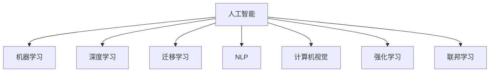

                 

# AI技术在实际应用中的挑战

## 1. 背景介绍

### 1.1 问题由来
人工智能（AI）技术的飞速发展为各行各业带来了革命性的变化。AI技术在医疗、金融、交通、教育等众多领域得到了广泛应用，显著提升了生产力、改善了用户体验，甚至创造了全新的行业生态。然而，在实际应用中，AI技术也面临许多挑战和问题，这些问题如果得不到有效解决，可能会制约AI技术的普及和发展。本文将系统分析AI技术在实际应用中的主要挑战，并探讨应对这些挑战的策略。

### 1.2 问题核心关键点
AI技术在实际应用中的核心挑战主要集中在以下几个方面：数据质量与标注、模型复杂度与可解释性、资源消耗与训练效率、模型泛化能力与安全性、人机交互与用户接受度、跨领域应用与通用性。

## 2. 核心概念与联系

### 2.1 核心概念概述

为更好地理解AI技术在实际应用中的挑战，本节将介绍几个密切相关的核心概念：

- **人工智能（Artificial Intelligence, AI）**：利用计算机系统模拟人类智能行为，包括感知、学习、推理、规划等能力。
- **机器学习（Machine Learning, ML）**：使计算机通过数据学习模式，并应用于特定任务的一种AI技术。
- **深度学习（Deep Learning, DL）**：一种基于多层神经网络的技术，通过多层次的特征提取，实现对复杂数据的建模。
- **迁移学习（Transfer Learning）**：将在一个任务上学到的知识，迁移到另一个相关任务上，以提高在新任务上的性能。
- **自然语言处理（Natural Language Processing, NLP）**：使计算机能够理解和处理人类语言的技术，包括语音识别、文本分析、机器翻译等。
- **计算机视觉（Computer Vision, CV）**：使计算机能够理解和分析图像和视频的技术，包括物体识别、人脸识别、图像生成等。
- **强化学习（Reinforcement Learning, RL）**：通过试错学习，使计算机在环境中不断调整策略，以优化特定任务。
- **联邦学习（Federated Learning）**：一种分布式机器学习方法，通过各端设备协作训练，保护数据隐私的同时提升模型性能。

这些核心概念之间的逻辑关系可以通过以下Mermaid流程图来展示：



这个流程图展示了AI技术的核心概念及其之间的关系：

1. **人工智能**：是所有AI技术的基础。
2. **机器学习和深度学习**：是实现人工智能的主要技术手段。
3. **迁移学习**：通过知识迁移，提高模型在新任务上的性能。
4. **自然语言处理和计算机视觉**：是AI在语言和视觉领域的具体应用。
5. **强化学习和联邦学习**：是处理复杂交互和分布式数据环境下的AI技术。

这些概念共同构成了AI技术的核心框架，决定了AI在实际应用中的表现和潜力。

## 3. 核心算法原理 & 具体操作步骤

### 3.1 算法原理概述

AI技术在实际应用中的挑战主要体现在数据、模型、计算和应用场景等多个方面。以下是这些挑战的详细分析及对应的解决策略：

### 3.2 算法步骤详解

#### 3.2.1 数据质量与标注

**挑战**：
- 数据质量：数据中存在噪声、缺失、错误等，影响模型性能。
- 数据标注：高质量标注数据获取成本高，且标注质量不稳定。

**解决策略**：
- **数据清洗**：使用数据清洗技术去除噪声、处理缺失值和异常值。
- **半监督学习**：利用少量标注数据和大量无标注数据进行联合训练，提升模型性能。
- **主动学习**：通过模型反馈，主动选择最有价值的样本进行标注。
- **无监督学习**：在不依赖标注数据的情况下，学习数据的内在结构和特征。

#### 3.2.2 模型复杂度与可解释性

**挑战**：
- 模型复杂度：大型复杂模型难以解释，且在生产环境中不易维护。
- 模型可解释性：黑箱模型难以理解其决策过程，不透明性增加了应用风险。

**解决策略**：
- **简化模型**：使用模型压缩、剪枝等技术简化模型，提高可解释性。
- **可解释性AI**：通过模型可视化、特征重要性分析等手段，提高模型可解释性。
- **决策树和规则**：使用决策树、规则等可解释性强的模型，简化复杂模型。

#### 3.2.3 资源消耗与训练效率

**挑战**：
- 计算资源：训练大型深度学习模型需要大量的计算资源，成本高昂。
- 训练效率：深度学习模型训练时间长，且易过拟合，影响训练效率。

**解决策略**：
- **分布式训练**：使用分布式训练技术，加速模型训练。
- **模型加速**：使用量化、剪枝、模型压缩等技术，优化模型计算效率。
- **自动化超参数优化**：使用自动化超参数优化算法，减少手动调参工作量。

#### 3.2.4 模型泛化能力与安全性

**挑战**：
- 泛化能力：模型在新场景下泛化能力不足，难以应对复杂环境。
- 安全性：模型可能引入偏见、误判等问题，影响应用安全性。

**解决策略**：
- **迁移学习**：通过迁移学习，增强模型在未知场景下的泛化能力。
- **对抗训练**：通过对抗样本训练，提高模型鲁棒性，避免误判。
- **公平性和偏见检测**：使用公平性检测工具，减少模型偏见，提升应用安全性。

#### 3.2.5 人机交互与用户接受度

**挑战**：
- 用户接受度：复杂AI系统不易被用户接受，使用体验差。
- 人机交互：AI系统缺乏良好的人机交互设计，用户体验差。

**解决策略**：
- **用户界面设计**：使用友好的人机交互设计，提升用户使用体验。
- **自然语言处理**：使用自然语言处理技术，改善人机交互体验。
- **增强现实和虚拟现实**：使用增强现实和虚拟现实技术，提升交互互动性。

#### 3.2.6 跨领域应用与通用性

**挑战**：
- 跨领域应用：AI技术在特定领域表现好，跨领域应用效果差。
- 通用性：AI技术缺乏通用性，难以应对多样化场景。

**解决策略**：
- **通用AI**：开发通用AI技术，支持多种任务和领域。
- **领域适应**：通过领域自适应技术，提升模型在不同领域的表现。
- **多模态学习**：使用多模态学习技术，增强模型对复杂场景的理解能力。

### 3.3 算法优缺点

**优点**：
- **数据利用率高**：AI技术能够高效利用数据，提升模型性能。
- **应用范围广**：AI技术可以应用于众多领域，提升生产效率，改善用户体验。
- **自动化能力强**：AI技术能够实现自动化决策，减少人工干预。

**缺点**：
- **数据依赖性强**：AI模型依赖高质量数据，数据获取和标注成本高。
- **模型复杂度高**：大型复杂模型训练和部署成本高，易出现过拟合等问题。
- **可解释性差**：黑箱模型难以解释其决策过程，增加了应用风险。

### 3.4 算法应用领域

AI技术在实际应用中广泛涉及以下领域：

- **医疗**：AI技术在医疗影像分析、疾病预测、个性化治疗等方面得到广泛应用。
- **金融**：AI技术在风险评估、欺诈检测、智能投顾等方面得到广泛应用。
- **制造**：AI技术在智能制造、质量检测、供应链优化等方面得到广泛应用。
- **零售**：AI技术在客户分析、库存管理、推荐系统等方面得到广泛应用。
- **教育**：AI技术在智能教育、自动批改、智能推荐等方面得到广泛应用。
- **交通**：AI技术在智能交通、无人驾驶、交通安全等方面得到广泛应用。
- **能源**：AI技术在能源管理、智能电网、智能监控等方面得到广泛应用。
- **安全**：AI技术在网络安全、视频监控、行为分析等方面得到广泛应用。

以上领域只是冰山一角，AI技术在更多领域的应用前景广阔，未来将有望进一步扩展。

## 4. 数学模型和公式 & 详细讲解 & 举例说明

### 4.1 数学模型构建

本节将使用数学语言对AI技术在实际应用中的挑战进行更加严格的刻画。

**数据标注**：
- 假设有$N$个样本，每个样本$x_i$的标注为$y_i \in \{0,1\}$，目标是最小化交叉熵损失函数：
$$
\mathcal{L}(\theta) = -\frac{1}{N} \sum_{i=1}^N [y_i\log \hat{y}_i + (1-y_i)\log(1-\hat{y}_i)]
$$
其中$\theta$为模型参数，$\hat{y}_i$为模型预测值。

**模型复杂度与可解释性**：
- 简化模型：假设模型包含$L$个参数，目标是最小化模型参数量：
$$
\min_{\theta} \| \theta \|
$$

**资源消耗与训练效率**：
- 分布式训练：假设模型分布在$m$个节点上，每个节点有$n$个样本，目标是最小化通信开销：
$$
\min_{\theta} \sum_{i=1}^m \sum_{j=1}^n \| \theta \|
$$

**模型泛化能力与安全性**：
- 迁移学习：假设源任务$T_s$和目标任务$T_t$，目标是最小化两个任务的损失差异：
$$
\min_{\theta} \mathcal{L}_s(\theta) + \lambda \mathcal{L}_t(\theta)
$$

**人机交互与用户接受度**：
- 用户界面设计：假设用户接受度为$u$，目标是最小化用户反馈：
$$
\min_{\theta} \sum_{i=1}^N u_i \mathcal{L}(\theta)
$$

**跨领域应用与通用性**：
- 多模态学习：假设数据包含$m$种模态，目标是最小化多模态损失函数：
$$
\min_{\theta} \sum_{i=1}^m \mathcal{L}_i(\theta)
$$

### 4.2 公式推导过程

**数据标注**：
- 交叉熵损失函数的梯度：
$$
\frac{\partial \mathcal{L}}{\partial \theta} = -\frac{1}{N} \sum_{i=1}^N [y_i - \hat{y}_i]
$$
其中$\hat{y}_i = \frac{\exp(\theta^T x_i)}{\sum_{j=1}^N \exp(\theta^T x_j)}$。

**模型复杂度与可解释性**：
- 简化模型的目标函数：
$$
\min_{\theta} \frac{1}{N} \sum_{i=1}^N \| \theta \|
$$

**资源消耗与训练效率**：
- 分布式训练的目标函数：
$$
\min_{\theta} \sum_{i=1}^m \sum_{j=1}^n \| \theta \|
$$

**模型泛化能力与安全性**：
- 迁移学习的目标函数：
$$
\min_{\theta} \mathcal{L}_s(\theta) + \lambda \mathcal{L}_t(\theta)
$$

**人机交互与用户接受度**：
- 用户界面设计的目标函数：
$$
\min_{\theta} \sum_{i=1}^N u_i \mathcal{L}(\theta)
$$

**跨领域应用与通用性**：
- 多模态学习的目标函数：
$$
\min_{\theta} \sum_{i=1}^m \mathcal{L}_i(\theta)
$$

### 4.3 案例分析与讲解

**案例1：医疗影像分析**
- **挑战**：医疗影像数据量大且噪声多，标注成本高。
- **解决策略**：使用半监督学习和主动学习，减少标注需求。

**案例2：智能投顾**
- **挑战**：金融市场数据复杂多变，模型泛化能力不足。
- **解决策略**：通过迁移学习和对抗训练，提升模型泛化能力。

**案例3：无人驾驶**
- **挑战**：环境复杂多变，人机交互设计困难。
- **解决策略**：使用增强现实和虚拟现实技术，提升人机交互体验。

**案例4：智能制造**
- **挑战**：生产数据量大且分布不均匀，资源消耗大。
- **解决策略**：使用分布式训练和模型压缩，优化资源消耗。

**案例5：智能教育**
- **挑战**：教育数据多样化，通用性差。
- **解决策略**：使用多模态学习和通用AI技术，增强模型跨领域能力。

## 5. 项目实践：代码实例和详细解释说明

### 5.1 开发环境搭建

在进行AI项目实践前，我们需要准备好开发环境。以下是使用Python进行TensorFlow和Keras开发的开发环境配置流程：

1. 安装Anaconda：从官网下载并安装Anaconda，用于创建独立的Python环境。

2. 创建并激活虚拟环境：
```bash
conda create -n tf-env python=3.8 
conda activate tf-env
```

3. 安装TensorFlow和Keras：
```bash
conda install tensorflow=2.7.0 keras=2.6.0
```

4. 安装各类工具包：
```bash
pip install numpy pandas scikit-learn matplotlib tqdm jupyter notebook ipython
```

完成上述步骤后，即可在`tf-env`环境中开始项目实践。

### 5.2 源代码详细实现

这里我们以图像分类任务为例，给出使用TensorFlow和Keras对卷积神经网络（CNN）进行训练的PyTorch代码实现。

首先，定义CNN模型：

```python
from tensorflow.keras.models import Sequential
from tensorflow.keras.layers import Conv2D, MaxPooling2D, Flatten, Dense

model = Sequential()
model.add(Conv2D(32, (3, 3), activation='relu', input_shape=(64, 64, 3)))
model.add(MaxPooling2D((2, 2)))
model.add(Conv2D(64, (3, 3), activation='relu'))
model.add(MaxPooling2D((2, 2)))
model.add(Flatten())
model.add(Dense(128, activation='relu'))
model.add(Dense(10, activation='softmax'))

model.compile(optimizer='adam', loss='categorical_crossentropy', metrics=['accuracy'])
```

然后，定义数据集并加载：

```python
from tensorflow.keras.datasets import cifar10
from tensorflow.keras.utils import to_categorical

(x_train, y_train), (x_test, y_test) = cifar10.load_data()
x_train = x_train / 255.0
x_test = x_test / 255.0
y_train = to_categorical(y_train)
y_test = to_categorical(y_test)
```

接着，定义训练和评估函数：

```python
def train_model(model, x_train, y_train, batch_size, epochs):
    model.fit(x_train, y_train, batch_size=batch_size, epochs=epochs, validation_data=(x_test, y_test))

def evaluate_model(model, x_test, y_test, batch_size):
    score = model.evaluate(x_test, y_test, batch_size=batch_size)
    print('Test loss:', score[0])
    print('Test accuracy:', score[1])

train_model(model, x_train, y_train, batch_size=128, epochs=50)
evaluate_model(model, x_test, y_test, batch_size=128)
```

最后，启动训练流程并在测试集上评估：

```python
train_model(model, x_train, y_train, batch_size=128, epochs=50)
evaluate_model(model, x_test, y_test, batch_size=128)
```

以上就是使用TensorFlow和Keras对CNN进行图像分类任务训练的完整代码实现。可以看到，得益于Keras的强大封装，我们可以用相对简洁的代码完成CNN模型的加载和训练。

### 5.3 代码解读与分析

让我们再详细解读一下关键代码的实现细节：

**CNN模型定义**：
- `Sequential`模型：定义模型的层次结构。
- `Conv2D`层：卷积层，提取图像特征。
- `MaxPooling2D`层：池化层，减少特征维度。
- `Flatten`层：将多维特征展平。
- `Dense`层：全连接层，输出分类结果。

**数据集加载**：
- `cifar10.load_data()`：加载CIFAR-10数据集，包含60000个32x32彩色图像，共10个类别。
- `x_train /= 255.0`和`x_test /= 255.0`：将像素值归一化到0-1之间。
- `y_train = to_categorical(y_train)`和`y_test = to_categorical(y_test)`：将标签转换为独热编码。

**训练和评估函数**：
- `train_model(model, x_train, y_train, batch_size, epochs)`：训练模型，使用训练集进行前向传播和后向传播。
- `evaluate_model(model, x_test, y_test, batch_size)`：评估模型，使用测试集进行前向传播计算损失和准确率。

**训练流程**：
- `train_model(model, x_train, y_train, batch_size=128, epochs=50)`：定义训练参数，使用CIFAR-10数据集训练模型50个epoch。
- `evaluate_model(model, x_test, y_test, batch_size=128)`：在测试集上评估模型，输出测试损失和准确率。

可以看到，TensorFlow和Keras使得CNN模型的训练代码实现变得简洁高效。开发者可以将更多精力放在模型改进、数据处理等高层逻辑上，而不必过多关注底层的实现细节。

当然，工业级的系统实现还需考虑更多因素，如模型的保存和部署、超参数的自动搜索、更灵活的任务适配层等。但核心的训练范式基本与此类似。

## 6. 实际应用场景

### 6.1 智能制造

AI技术在智能制造领域的应用场景广泛，从生产计划优化到质量检测，从供应链管理到智能监控，AI技术均展现了其巨大的潜力。

**应用场景**：
- **生产计划优化**：使用机器学习预测生产需求，优化生产计划，提高生产效率。
- **质量检测**：使用计算机视觉技术检测产品缺陷，减少人工检测成本，提高产品质量。
- **供应链管理**：使用智能算法优化供应链流程，降低库存成本，提升供应链效率。
- **智能监控**：使用机器学习分析生产数据，提前发现潜在问题，预防生产事故。

**技术挑战**：
- **数据获取难度大**：生产数据量大且分布不均匀，数据采集成本高。
- **模型复杂度高**：生产环境复杂多变，模型泛化能力不足。
- **实时性要求高**：生产决策需要实时响应，计算资源消耗大。

**解决策略**：
- **数据增强**：使用数据增强技术，提升数据多样性，减少过拟合风险。
- **分布式训练**：使用分布式训练技术，优化计算资源，提升训练效率。
- **模型压缩**：使用模型压缩技术，简化模型计算，提高实时性。

### 6.2 医疗影像分析

AI技术在医疗影像分析领域的应用前景广阔，特别是在疾病诊断、治疗方案推荐等方面，AI技术展现了其卓越的性能。

**应用场景**：
- **疾病诊断**：使用计算机视觉技术分析医学影像，辅助医生进行疾病诊断。
- **治疗方案推荐**：使用机器学习分析病历数据，推荐最适合的治疗方案。
- **患者监测**：使用智能算法监测患者状态，及时发现异常，预防病情恶化。

**技术挑战**：
- **数据标注难度大**：医学影像数据量大且标注成本高。
- **模型复杂度高**：医学影像复杂多变，模型泛化能力不足。
- **可解释性差**：医生需要理解AI的诊断过程，提高可解释性。

**解决策略**：
- **半监督学习**：使用半监督学习技术，减少标注需求。
- **对抗训练**：使用对抗训练技术，提升模型鲁棒性。
- **可解释性AI**：使用可解释性AI技术，提高模型的可解释性。

### 6.3 智能投顾

AI技术在金融领域的应用广泛，特别是在风险评估、欺诈检测、智能投顾等方面，AI技术展现了其显著的优势。

**应用场景**：
- **风险评估**：使用机器学习分析金融数据，评估金融风险。
- **欺诈检测**：使用深度学习技术分析交易数据，检测异常行为。
- **智能投顾**：使用AI技术分析市场数据，推荐投资策略。

**技术挑战**：
- **数据获取难度大**：金融数据量大且复杂，数据采集成本高。
- **模型复杂度高**：金融市场复杂多变，模型泛化能力不足。
- **安全性要求高**：金融数据敏感，模型安全性要求高。

**解决策略**：
- **迁移学习**：使用迁移学习技术，减少标注需求。
- **对抗训练**：使用对抗训练技术，提升模型鲁棒性。
- **数据脱敏**：使用数据脱敏技术，保护数据隐私。

## 7. 工具和资源推荐

### 7.1 学习资源推荐

为了帮助开发者系统掌握AI技术在实际应用中的挑战，这里推荐一些优质的学习资源：

1. **《深度学习》课程**：斯坦福大学开设的深度学习课程，涵盖深度学习基础、神经网络、卷积神经网络、生成对抗网络等内容。

2. **《机器学习》书籍**：Tom Mitchell的经典著作，全面介绍了机器学习的基本概念和算法。

3. **Kaggle平台**：一个数据科学竞赛平台，提供大量公开数据集和算法竞赛，是学习和实践AI技术的绝佳平台。

4. **Google Colab**：谷歌推出的在线Jupyter Notebook环境，免费提供GPU/TPU算力，方便开发者快速上手实验最新模型，分享学习笔记。

5. **Coursera平台**：提供大量高质量在线课程，涵盖计算机科学、数据科学、人工智能等领域，是学习AI技术的优质平台。

通过学习这些资源，相信你一定能够快速掌握AI技术在实际应用中的挑战，并用于解决实际的AI问题。

### 7.2 开发工具推荐

高效的开发离不开优秀的工具支持。以下是几款用于AI项目开发的常用工具：

1. **TensorFlow**：由Google主导开发的开源深度学习框架，生产部署方便，适合大规模工程应用。
2. **Keras**：一个高层次的深度学习API，易于使用且功能强大。
3. **PyTorch**：基于Python的开源深度学习框架，灵活动态的计算图，适合快速迭代研究。
4. **Jupyter Notebook**：一个交互式的笔记本环境，方便进行代码调试和数据可视化。
5. **Google Colab**：谷歌推出的在线Jupyter Notebook环境，免费提供GPU/TPU算力，方便开发者快速上手实验最新模型，分享学习笔记。

合理利用这些工具，可以显著提升AI项目的开发效率，加快创新迭代的步伐。

### 7.3 相关论文推荐

AI技术在实际应用中的挑战研究源于学界的持续研究。以下是几篇奠基性的相关论文，推荐阅读：

1. **《ImageNet Classification with Deep Convolutional Neural Networks》**：提出AlexNet模型，首次在ImageNet数据集上取得优异性能。
2. **《Rethinking the Inception Architecture for Computer Vision》**：提出Inception模块，显著提升了卷积神经网络的性能。
3. **《Convolutional Neural Networks for Visual Recognition》**：提出VGG模型，成为计算机视觉领域的经典模型。
4. **《ResNet: Deep Residual Learning for Image Recognition》**：提出ResNet模型，解决了深度神经网络退化的问题。
5. **《Attention is All You Need》**：提出Transformer模型，开启了自然语言处理的预训练大模型时代。

这些论文代表了大语言模型在实际应用中的研究进展，对理解AI技术的挑战和突破具有重要意义。

## 8. 总结：未来发展趋势与挑战

### 8.1 总结

本文对AI技术在实际应用中的挑战进行了全面系统的介绍。首先阐述了AI技术在医疗、金融、制造、教育、交通、能源、安全等多个领域的应用前景和实际效果，明确了AI技术带来的巨大价值。其次，从数据质量与标注、模型复杂度与可解释性、资源消耗与训练效率、模型泛化能力与安全性、人机交互与用户接受度、跨领域应用与通用性等多个方面，详细分析了AI技术在实际应用中的主要挑战。最后，结合具体案例，探讨了应对这些挑战的解决策略。

通过本文的系统梳理，可以看到，AI技术在实际应用中面临诸多挑战，需要在数据、模型、计算和应用场景等多个环节进行全面优化，才能真正实现AI技术在各行各业中的大规模落地。未来，伴随AI技术的不断发展和完善，相信AI技术必将在更多领域得到广泛应用，带来更多的创新和突破。

### 8.2 未来发展趋势

展望未来，AI技术在实际应用中将呈现以下几个发展趋势：

1. **自动化程度提高**：自动化技术将进一步提升，实现从数据收集、数据处理到模型训练、模型部署的全流程自动化。
2. **跨领域应用普及**：AI技术将在更多领域得到应用，特别是在医疗、金融、教育、交通、制造等领域，提升生产效率和服务质量。
3. **通用AI技术发展**：通用AI技术将逐渐成熟，支持多种任务和领域的自动化决策。
4. **多模态融合**：多模态学习技术将进一步发展，提升AI系统对复杂场景的理解能力。
5. **可解释性增强**：可解释性AI技术将进一步发展，提升AI系统的可解释性和可信度。
6. **隐私保护加强**：隐私保护技术将进一步发展，保护用户数据隐私和安全。
7. **跨领域知识整合**：跨领域知识整合技术将进一步发展，提升AI系统的智能化和创造力。
8. **实时性提升**：分布式训练和模型压缩技术将进一步发展，提升AI系统的实时性和响应速度。

这些趋势凸显了AI技术的巨大潜力和发展方向，相信未来AI技术将在更多领域得到广泛应用，带来更多的创新和突破。

### 8.3 面临的挑战

尽管AI技术在实际应用中取得了显著成就，但仍面临许多挑战：

1. **数据依赖性强**：AI模型依赖高质量数据，数据获取和标注成本高。
2. **模型复杂度高**：大型复杂模型训练和部署成本高，易出现过拟合等问题。
3. **可解释性差**：黑箱模型难以解释其决策过程，增加了应用风险。
4. **资源消耗大**：AI模型计算资源消耗大，难以满足大规模实时应用的需求。
5. **安全性问题**：AI模型可能引入偏见、误判等问题，影响应用安全性。
6. **用户接受度低**：复杂AI系统不易被用户接受，使用体验差。
7. **跨领域应用难**：AI技术在特定领域表现好，跨领域应用效果差。

这些挑战凸显了AI技术在实际应用中的复杂性和不确定性，需要进一步研究和解决。

### 8.4 研究展望

面对AI技术在实际应用中的挑战，未来的研究需要在以下几个方面寻求新的突破：

1. **数据获取与标注技术**：研究高效数据采集和标注方法，降低数据获取成本，提升数据质量。
2. **模型压缩与加速技术**：研究模型压缩、剪枝等技术，提升模型计算效率，降低资源消耗。
3. **可解释性AI技术**：研究模型可视化、特征重要性分析等手段，提升模型的可解释性，增加用户信任。
4. **隐私保护技术**：研究数据脱敏、差分隐私等技术，保护用户数据隐私和安全。
5. **多模态融合技术**：研究多模态学习技术，提升AI系统对复杂场景的理解能力。
6. **跨领域应用技术**：研究通用AI技术，支持多种任务和领域的自动化决策。
7. **实时性提升技术**：研究分布式训练和模型压缩技术，提升AI系统的实时性和响应速度。

这些研究方向将引领AI技术的进一步发展和完善，为AI技术在更多领域的大规模落地奠定基础。

## 9. 附录：常见问题与解答

**Q1：什么是深度学习？**

A: 深度学习是一种基于多层神经网络的技术，通过多层次的特征提取，实现对复杂数据的建模。

**Q2：如何提高AI模型的泛化能力？**

A: 可以通过迁移学习、对抗训练、数据增强等技术，提高AI模型的泛化能力。

**Q3：AI技术在实际应用中面临哪些挑战？**

A: AI技术在实际应用中面临数据质量与标注、模型复杂度与可解释性、资源消耗与训练效率、模型泛化能力与安全性、人机交互与用户接受度、跨领域应用与通用性等挑战。

**Q4：AI技术在医疗影像分析中面临哪些挑战？**

A: AI技术在医疗影像分析中面临数据标注难度大、模型复杂度高、可解释性差等挑战。

**Q5：AI技术在智能制造中面临哪些挑战？**

A: AI技术在智能制造中面临数据获取难度大、模型复杂度高、实时性要求高等挑战。

通过本文的系统梳理，可以看到，AI技术在实际应用中面临诸多挑战，需要在数据、模型、计算和应用场景等多个环节进行全面优化，才能真正实现AI技术在各行各业中的大规模落地。未来，伴随AI技术的不断发展和完善，相信AI技术必将在更多领域得到广泛应用，带来更多的创新和突破。

