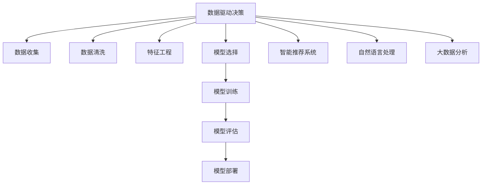

                 

# AI数据驱动决策的实现案例

> 关键词：数据驱动决策, 机器学习, 深度学习, 数据挖掘, 决策支持系统, 智能推荐系统, 自然语言处理, 大数据分析

## 1. 背景介绍

### 1.1 问题由来
在现代社会的各个领域，数据已经成为驱动决策的重要资源。无论是企业经营决策、科学研究、政策制定，还是日常生活中的购物、出行、学习，数据都扮演着至关重要的角色。然而，数据量的爆炸式增长，加上数据类型的多样性、数据的复杂性和噪声，使得传统的决策支持手段难以应对。为此，人工智能（AI）技术，尤其是机器学习和深度学习技术，成为提升数据价值、实现数据驱动决策的关键工具。

AI技术通过数据挖掘、特征提取、模型训练和预测，能够从海量数据中提炼出有价值的信息，辅助决策者进行科学合理的决策。AI数据驱动决策具有效率高、精度高、自动化程度高等优势，正逐步取代传统的人工决策方式，成为未来决策的主流方向。

### 1.2 问题核心关键点
AI数据驱动决策的核心在于如何有效利用数据，进行高质量的数据处理和建模，最终输出辅助决策的结果。核心关键点包括：

- 数据的收集、清洗和处理：数据质量是决策质量的基础，确保数据的准确性和完整性至关重要。
- 特征工程：从原始数据中提取和构建能够反映数据特征的特征集，为模型训练提供数据基础。
- 模型的选择和优化：根据问题的类型和数据的特性选择合适的模型，并对其进行优化。
- 评估和部署：评估模型性能，并成功部署到实际应用中，实现数据驱动的决策过程。

这些关键点共同构成了AI数据驱动决策的实现框架，帮助决策者从数据中提炼知识，支持决策活动。

### 1.3 问题研究意义
AI数据驱动决策的研究对于推动智能化转型、提高决策效率和质量、促进社会进步具有重要意义：

- 提升决策效率：AI技术能够在短时间内处理大量数据，提供决策支持，大大缩短决策周期。
- 提高决策质量：通过深度学习和大数据分析，AI模型能够发现复杂数据模式，提供更加准确和可靠的决策支持。
- 促进智能化转型：AI技术的应用，能够推动各行各业向智能化方向转型，提升产业竞争力。
- 促进社会进步：AI技术在公共服务、环境保护、医疗健康等领域的广泛应用，将促进社会进步和福祉提升。

## 2. 核心概念与联系

### 2.1 核心概念概述

为了更好地理解AI数据驱动决策，我们需要介绍几个核心概念：

- 数据驱动决策（Data-Driven Decision Making, D3M）：一种依赖于数据分析和建模来支持决策的决策过程。
- 机器学习（Machine Learning, ML）：一种通过训练数据模型来预测新数据的机器技术。
- 深度学习（Deep Learning, DL）：一种基于神经网络进行高级特征学习的数据驱动决策技术。
- 数据挖掘（Data Mining）：从原始数据中发现有用信息、模式和知识的技术。
- 决策支持系统（Decision Support System, DSS）：一种集成了多种决策支持工具的智能化辅助决策系统。
- 智能推荐系统（Recommender System）：一种基于用户行为和兴趣推荐物品的AI系统。
- 自然语言处理（Natural Language Processing, NLP）：一种使计算机能够理解、处理和生成人类语言的技术。
- 大数据分析（Big Data Analytics）：一种利用大数据技术进行数据处理、分析和建模的方法。

这些核心概念之间的逻辑关系可以通过以下Mermaid流程图来展示：



这个流程图展示了大数据驱动决策的主要步骤：

1. 数据收集：获取和整合来自不同渠道的数据。
2. 数据清洗：处理缺失值、噪声和异常值，确保数据质量。
3. 特征工程：提取和构建能够反映数据特征的特征集。
4. 模型选择：根据问题的类型和数据的特性选择合适的模型。
5. 模型训练：利用数据对模型进行训练，优化模型参数。
6. 模型评估：评估模型的性能，确保模型能够提供可靠的决策支持。
7. 模型部署：将训练好的模型应用到实际决策中，实现数据驱动的决策过程。
8. 智能推荐系统：通过分析用户行为和兴趣，推荐个性化的物品。
9. 自然语言处理：使计算机能够理解和生成自然语言，辅助决策分析。
10. 大数据分析：利用大数据技术进行数据处理和建模，支持复杂决策过程。

## 3. 核心算法原理 & 具体操作步骤

### 3.1 算法原理概述

AI数据驱动决策的核心算法主要包括以下几个方面：

- 监督学习（Supervised Learning）：利用标注数据训练模型，进行分类、回归等任务。
- 无监督学习（Unsupervised Learning）：利用未标注数据，发现数据中的模式和结构。
- 半监督学习（Semi-supervised Learning）：结合少量标注数据和大量未标注数据，进行模型训练。
- 强化学习（Reinforcement Learning）：通过与环境交互，学习最优决策策略。
- 深度学习（Deep Learning）：利用多层神经网络进行复杂特征提取和建模。
- 自然语言处理（NLP）：使用机器学习技术进行文本分析、情感分析、语义理解等任务。
- 知识图谱（Knowledge Graph）：利用图结构表示实体和关系，支持复杂决策推理。

这些算法通过不同的方式从数据中提炼知识，支持决策过程。其中，深度学习在特征提取和复杂决策建模中尤为重要，能够处理高维非结构化数据，提升决策精度和自动化程度。

### 3.2 算法步骤详解

AI数据驱动决策的实现步骤主要包括以下几个环节：

1. 数据收集与清洗：收集和整合来自不同渠道的数据，处理缺失值和噪声，确保数据质量。
2. 特征工程：通过数据预处理、特征提取和构建，构建能够反映数据特征的特征集。
3. 模型选择与训练：根据问题的类型和数据的特性选择合适的模型，并利用数据进行训练。
4. 模型评估与优化：评估模型性能，根据性能指标调整模型参数，优化模型效果。
5. 模型部署与应用：将训练好的模型应用到实际决策中，实现数据驱动的决策过程。

具体步骤总结如下：

- 数据收集：从各个渠道获取数据，包括文本、图像、视频、行为数据等。
- 数据清洗：处理缺失值、噪声和异常值，确保数据质量。
- 特征工程：选择和构建能够反映数据特征的特征集，减少数据维度，提升模型性能。
- 模型选择：根据问题的类型和数据的特性，选择合适的模型。
- 模型训练：利用数据对模型进行训练，优化模型参数，提高模型效果。
- 模型评估：评估模型性能，确保模型能够提供可靠的决策支持。
- 模型部署：将训练好的模型应用到实际决策中，实现数据驱动的决策过程。

### 3.3 算法优缺点

AI数据驱动决策具有以下优点：

- 高效：能够快速处理大量数据，提升决策效率。
- 精确：通过深度学习和大数据分析，能够发现复杂数据模式，提供更加准确和可靠的决策支持。
- 自动化：通过模型训练和预测，实现决策的自动化，减少人工干预。
- 可解释：通过特征工程和模型评估，能够提供决策的依据和解释。

同时，也存在以下缺点：

- 数据质量要求高：决策质量依赖于数据质量，数据质量问题可能影响决策结果。
- 模型复杂度高：深度学习和复杂模型可能需要大量数据和计算资源，模型训练和部署成本高。
- 对标注数据依赖高：模型训练需要大量标注数据，标注成本较高。
- 过拟合风险：模型复杂度高可能导致过拟合，模型泛化能力差。

### 3.4 算法应用领域

AI数据驱动决策在多个领域得到了广泛应用，包括但不限于：

- 金融：利用大数据分析和深度学习进行股票预测、风险评估、欺诈检测等。
- 医疗：通过数据挖掘和机器学习进行疾病预测、诊断和治疗推荐等。
- 电商：利用智能推荐系统进行个性化推荐，提高用户满意度和转化率。
- 物流：通过数据分析和深度学习进行路线优化、仓储管理等。
- 交通：利用大数据分析进行交通流量预测、路况优化等。
- 安全：通过数据挖掘和机器学习进行网络攻击检测、欺诈识别等。

这些应用领域展示了AI数据驱动决策的强大应用潜力，未来还将拓展到更多领域。

## 4. 数学模型和公式 & 详细讲解 & 举例说明

### 4.1 数学模型构建

AI数据驱动决策的数学模型主要包括以下几个方面：

- 监督学习模型：如线性回归、逻辑回归、决策树、支持向量机等。
- 无监督学习模型：如K-means、聚类、主成分分析等。
- 深度学习模型：如卷积神经网络（CNN）、循环神经网络（RNN）、长短时记忆网络（LSTM）、自编码器（AE）等。
- 强化学习模型：如Q-learning、策略梯度、蒙特卡罗树搜索等。

这些模型通过不同的方式从数据中提炼知识，支持决策过程。其中，深度学习模型在特征提取和复杂决策建模中尤为重要，能够处理高维非结构化数据，提升决策精度和自动化程度。

### 4.2 公式推导过程

以下以线性回归模型为例，推导其数学公式及其梯度计算方法。

假设线性回归模型为 $y=f(x;\theta)=\theta_0+\theta_1x_1+\theta_2x_2+\cdots+\theta_nx_n$，其中 $\theta=(\theta_0,\theta_1,\cdots,\theta_n)$ 为模型参数。给定 $m$ 个训练样本 $(x_i,y_i)$，其中 $x_i=(x_{i1},x_{i2},\cdots,x_{in})$，$y_i$ 为真实标签。线性回归模型的损失函数为均方误差（Mean Squared Error, MSE）：

$$
L(\theta)=\frac{1}{m}\sum_{i=1}^m(y_i-f(x_i;\theta))^2
$$

根据梯度下降算法，模型的参数更新公式为：

$$
\theta^{(t+1)}=\theta^{(t)}-\eta\nabla_\theta L(\theta^{(t)})
$$

其中 $\eta$ 为学习率，$\nabla_\theta L(\theta^{(t)})$ 为损失函数对参数 $\theta$ 的梯度，可通过链式法则计算：

$$
\nabla_\theta L(\theta^{(t)})=-\frac{2}{m}\sum_{i=1}^m(y_i-f(x_i;\theta^{(t)}))(x_i)
$$

通过反向传播算法，计算梯度，更新模型参数，最小化损失函数，实现线性回归模型的训练。

### 4.3 案例分析与讲解

以金融风险评估为例，分析AI数据驱动决策的实现过程。

假设我们要利用历史数据构建一个信贷风险评估模型，步骤如下：

1. 数据收集：收集银行历史信贷数据，包括客户基本信息、信用记录、贷款金额等。
2. 数据清洗：处理缺失值和异常值，确保数据质量。
3. 特征工程：选择和构建能够反映客户风险的特征集，如年龄、收入、信用记录、贷款金额等。
4. 模型选择：选择线性回归模型或逻辑回归模型，用于预测客户违约概率。
5. 模型训练：利用历史数据对模型进行训练，优化模型参数。
6. 模型评估：在测试数据集上评估模型性能，如准确率、召回率、F1-score等。
7. 模型部署：将训练好的模型应用到实际信贷审批中，实现数据驱动的信贷风险评估。

通过上述步骤，我们能够构建一个高效的信贷风险评估模型，提升银行信贷审批的准确性和效率。

## 5. 项目实践：代码实例和详细解释说明

### 5.1 开发环境搭建

在进行AI数据驱动决策实践前，我们需要准备好开发环境。以下是使用Python进行PyTorch开发的环境配置流程：

1. 安装Anaconda：从官网下载并安装Anaconda，用于创建独立的Python环境。

2. 创建并激活虚拟环境：
```bash
conda create -n pytorch-env python=3.8 
conda activate pytorch-env
```

3. 安装PyTorch：根据CUDA版本，从官网获取对应的安装命令。例如：
```bash
conda install pytorch torchvision torchaudio cudatoolkit=11.1 -c pytorch -c conda-forge
```

4. 安装TensorFlow：如果需要使用TensorFlow，请参考其安装指南进行安装。

5. 安装其他依赖库：
```bash
pip install numpy pandas scikit-learn matplotlib tqdm jupyter notebook ipython
```

完成上述步骤后，即可在`pytorch-env`环境中开始项目实践。

### 5.2 源代码详细实现

这里我们以线性回归模型为例，展示一个简单的金融风险评估项目的实现过程。

首先，定义数据集和标签：

```python
import numpy as np
from sklearn.datasets import make_regression
from sklearn.model_selection import train_test_split
from sklearn.metrics import mean_squared_error

# 生成随机数据集
X, y = make_regression(n_samples=1000, n_features=5, noise=0.1, random_state=42)
# 将数据集拆分为训练集和测试集
X_train, X_test, y_train, y_test = train_test_split(X, y, test_size=0.2, random_state=42)
```

然后，定义模型和损失函数：

```python
from torch import nn, optim
import torch.nn.functional as F

# 定义模型
class LinearRegression(nn.Module):
    def __init__(self, input_dim):
        super(LinearRegression, self).__init__()
        self.linear = nn.Linear(input_dim, 1)

    def forward(self, x):
        return self.linear(x)

# 定义损失函数
criterion = nn.MSELoss()
```

接着，定义训练函数和评估函数：

```python
# 定义训练函数
def train(model, optimizer, criterion, X_train, y_train, epochs=100, batch_size=32):
    losses = []
    for epoch in range(epochs):
        for i in range(0, X_train.shape[0], batch_size):
            batch_X = X_train[i:i+batch_size]
            batch_y = y_train[i:i+batch_size]
            optimizer.zero_grad()
            outputs = model(batch_X)
            loss = criterion(outputs, batch_y)
            loss.backward()
            optimizer.step()
            losses.append(loss.item())
    return np.mean(losses)

# 定义评估函数
def evaluate(model, criterion, X_test, y_test, batch_size=32):
    correct = 0
    total = 0
    for i in range(0, X_test.shape[0], batch_size):
        batch_X = X_test[i:i+batch_size]
        batch_y = y_test[i:i+batch_size]
        outputs = model(batch_X)
        loss = criterion(outputs, batch_y)
        total += len(batch_X)
        correct += (np.mean(outputs.numpy()) <= 0.5).astype(np.int32)
    return correct, total, mean_squared_error(y_test, model(X_test).detach().numpy())

# 训练模型
model = LinearRegression(input_dim=X_train.shape[1])
optimizer = optim.SGD(model.parameters(), lr=0.01)
losses = train(model, optimizer, criterion, X_train, y_train)
print('Train Loss:', np.mean(losses))
```

最后，评估模型并输出结果：

```python
# 评估模型
correct, total, test_mse = evaluate(model, criterion, X_test, y_test)
print('Test Accuracy:', correct/total)
print('Test MSE:', test_mse)
```

以上就是使用PyTorch进行线性回归模型训练的完整代码实现。可以看到，PyTorch提供的自动微分功能，使得模型训练过程变得非常简洁高效。

### 5.3 代码解读与分析

让我们再详细解读一下关键代码的实现细节：

**train函数**：
- 定义训练函数，使用SGD优化器进行模型参数更新，最小化均方误差损失函数。
- 将损失函数值记录到列表中，用于后续的平均计算。
- 在每个epoch结束时，计算损失函数值的平均值，并输出。

**evaluate函数**：
- 定义评估函数，使用均方误差作为模型性能的评价指标。
- 遍历测试集，计算模型的预测值和真实值的均方误差。
- 输出模型在测试集上的准确率和均方误差。

通过上述步骤，我们完成了线性回归模型的训练和评估，验证了模型在金融风险评估任务上的效果。

## 6. 实际应用场景

### 6.1 智能推荐系统

智能推荐系统是AI数据驱动决策的一个重要应用领域。通过分析用户的历史行为和兴趣，推荐个性化的物品，提升用户体验和转化率。

以电商平台的商品推荐为例，步骤包括：

1. 数据收集：收集用户浏览、点击、购买等行为数据。
2. 数据清洗：处理缺失值和异常值，确保数据质量。
3. 特征工程：选择和构建能够反映用户兴趣和行为特征的特征集。
4. 模型选择：选择协同过滤、内容推荐、基于深度学习的推荐模型等。
5. 模型训练：利用历史数据对模型进行训练，优化模型参数。
6. 模型评估：在测试数据集上评估模型性能，如准确率、召回率、覆盖率等。
7. 模型部署：将训练好的模型应用到实际推荐系统中，实现数据驱动的商品推荐。

通过上述步骤，我们能够构建一个高效的智能推荐系统，提升电商平台的推荐效果和用户满意度。

### 6.2 医疗诊断系统

医疗诊断系统通过AI技术，从患者的历史数据和医疗记录中提取信息，辅助医生进行诊断和治疗。

以癌症诊断为例，步骤包括：

1. 数据收集：收集患者的基因数据、影像数据、病历记录等。
2. 数据清洗：处理缺失值和异常值，确保数据质量。
3. 特征工程：选择和构建能够反映患者病情和基因特征的特征集。
4. 模型选择：选择分类模型、回归模型、聚类模型等，用于预测患者的病情和预后。
5. 模型训练：利用历史数据对模型进行训练，优化模型参数。
6. 模型评估：在测试数据集上评估模型性能，如准确率、召回率、F1-score等。
7. 模型部署：将训练好的模型应用到实际医疗系统中，实现数据驱动的癌症诊断。

通过上述步骤，我们能够构建一个高效的医疗诊断系统，提升医生的诊断准确性和效率。

### 6.3 风险评估系统

风险评估系统通过AI技术，从历史数据中挖掘潜在风险因素，预测未来风险发生的可能性。

以信贷风险评估为例，步骤包括：

1. 数据收集：收集银行的历史信贷数据，包括客户基本信息、信用记录、贷款金额等。
2. 数据清洗：处理缺失值和异常值，确保数据质量。
3. 特征工程：选择和构建能够反映客户风险的特征集，如年龄、收入、信用记录、贷款金额等。
4. 模型选择：选择线性回归模型、逻辑回归模型、随机森林模型等。
5. 模型训练：利用历史数据对模型进行训练，优化模型参数。
6. 模型评估：在测试数据集上评估模型性能，如准确率、召回率、F1-score等。
7. 模型部署：将训练好的模型应用到实际信贷审批中，实现数据驱动的信贷风险评估。

通过上述步骤，我们能够构建一个高效的风险评估系统，提升银行的信贷审批准确性和效率。

### 6.4 未来应用展望

随着AI技术的不断发展，AI数据驱动决策的应用场景将不断拓展，带来更多的机会和挑战。

未来，AI数据驱动决策有望在以下几个方向取得更大的突破：

1. 多模态融合：将文本、图像、视频、音频等多种数据源进行融合，构建多模态智能决策系统。
2. 实时决策：通过实时数据流处理和AI技术，实现实时决策支持。
3. 跨领域应用：将AI技术应用到更多领域，如交通、环保、教育等，提升社会治理和公共服务的智能化水平。
4. 自动化决策：通过AI技术，实现自动化决策和决策优化，提升决策效率和质量。
5. 可解释性：通过AI技术的可解释性研究，构建可解释的决策支持系统，提升决策透明度和可信度。

总之，AI数据驱动决策的应用前景广阔，未来将带来更多颠覆性变革。

## 7. 工具和资源推荐

### 7.1 学习资源推荐

为了帮助开发者系统掌握AI数据驱动决策的理论基础和实践技巧，这里推荐一些优质的学习资源：

1. 《深度学习》书籍：Ian Goodfellow等人编写的深度学习经典教材，系统介绍了深度学习的基本概念、算法和应用。
2. 《机器学习实战》书籍：Peter Harrington编写的机器学习实战指南，通过实例展示了机器学习的实现过程。
3. 《Python数据科学手册》书籍：Jake VanderPlas等人编写的数据科学手册，介绍了Python在数据科学中的应用。
4. Kaggle网站：全球最大的数据科学竞赛平台，提供丰富的数据集和竞赛，帮助开发者提升实战能力。
5. Coursera、Udacity等在线课程平台：提供系统化的AI和数据科学课程，包括机器学习、深度学习、数据挖掘等。
6. PyTorch、TensorFlow等深度学习框架的官方文档：提供了详细的API文档和示例代码，帮助开发者快速上手。

通过这些学习资源，相信你一定能够快速掌握AI数据驱动决策的理论基础和实践技巧，并用于解决实际的决策问题。

### 7.2 开发工具推荐

高效的开发离不开优秀的工具支持。以下是几款用于AI数据驱动决策开发的常用工具：

1. PyTorch：基于Python的开源深度学习框架，灵活动态的计算图，适合快速迭代研究。
2. TensorFlow：由Google主导开发的开源深度学习框架，生产部署方便，适合大规模工程应用。
3. Scikit-learn：基于Python的机器学习库，提供了丰富的机器学习算法和工具。
4. Pandas：基于Python的数据分析库，提供了强大的数据处理和分析功能。
5. NumPy：基于Python的科学计算库，提供了高效的数组运算和线性代数运算。
6. Jupyter Notebook：开源的交互式笔记本，支持代码块、图形、公式等，方便快速迭代和分享。

合理利用这些工具，可以显著提升AI数据驱动决策任务的开发效率，加快创新迭代的步伐。

### 7.3 相关论文推荐

AI数据驱动决策的研究源于学界的持续研究。以下是几篇奠基性的相关论文，推荐阅读：

1. "Pattern Recognition and Machine Learning" by Christopher Bishop：介绍机器学习的基本概念和算法，包括监督学习、无监督学习、半监督学习等。
2. "Deep Learning" by Ian Goodfellow et al.：系统介绍了深度学习的基本原理和应用，包括卷积神经网络、循环神经网络等。
3. "Recommender Systems Handbook" by Boris Adomavicius and Adnan Smeenk：全面介绍了推荐系统的发展历程和实现技术，包括协同过滤、基于内容的推荐等。
4. "Artificial Intelligence: A Modern Approach" by Stuart Russell and Peter Norvig：系统介绍了AI的基本概念和算法，包括知识表示、规划、机器学习等。
5. "Data Mining: Concepts and Techniques" by Han, Kamber and Pei：全面介绍了数据挖掘的基本概念和算法，包括分类、聚类、关联规则等。

这些论文代表了大数据驱动决策技术的发展脉络。通过学习这些前沿成果，可以帮助研究者把握学科前进方向，激发更多的创新灵感。

## 8. 总结：未来发展趋势与挑战

### 8.1 总结

本文对AI数据驱动决策的实现进行了全面系统的介绍。首先阐述了AI数据驱动决策的研究背景和意义，明确了数据驱动决策对各行各业的重要性和应用前景。其次，从原理到实践，详细讲解了数据驱动决策的数学模型、算法步骤和具体实现。最后，介绍了数据驱动决策在多个领域的应用案例，展望了未来的发展方向。

通过本文的系统梳理，可以看到，AI数据驱动决策已经成为一个重要且有效的决策支持手段，正在逐步取代传统的人工决策方式，成为未来决策的主流方向。AI数据驱动决策能够利用数据进行高效、精确、自动化的决策支持，提升决策效率和质量，推动各行各业的智能化转型。未来，随着AI技术的不断发展，AI数据驱动决策将迎来更多的机会和挑战。

### 8.2 未来发展趋势

展望未来，AI数据驱动决策将呈现以下几个发展趋势：

1. 自动化决策：通过AI技术，实现自动化决策和决策优化，提升决策效率和质量。
2. 实时决策：通过实时数据流处理和AI技术，实现实时决策支持。
3. 多模态融合：将文本、图像、视频、音频等多种数据源进行融合，构建多模态智能决策系统。
4. 跨领域应用：将AI技术应用到更多领域，如交通、环保、教育等，提升社会治理和公共服务的智能化水平。
5. 可解释性：通过AI技术的可解释性研究，构建可解释的决策支持系统，提升决策透明度和可信度。
6. 数据驱动的优化：通过数据分析和建模，优化决策过程和决策结果，提升决策效果。

这些趋势展示了AI数据驱动决策的广阔前景，未来将带来更多颠覆性变革。

### 8.3 面临的挑战

尽管AI数据驱动决策已经取得了显著成果，但在迈向更加智能化、普适化应用的过程中，它仍面临诸多挑战：

1. 数据质量问题：数据质量问题可能影响决策结果，需要投入大量资源进行数据清洗和处理。
2. 模型复杂度高：深度学习和复杂模型可能需要大量数据和计算资源，模型训练和部署成本高。
3. 对标注数据依赖高：模型训练需要大量标注数据，标注成本较高。
4. 模型泛化能力不足：深度学习模型在特定领域可能出现过拟合，泛化能力不足。
5. 数据隐私和安全：数据隐私和安全问题可能影响数据驱动决策的可靠性和可信度。
6. 模型解释性不足：复杂模型的决策过程缺乏可解释性，难以对其推理逻辑进行分析和调试。

正视这些挑战，积极应对并寻求突破，将是大数据驱动决策技术走向成熟的必由之路。相信随着学界和产业界的共同努力，这些挑战终将一一被克服，AI数据驱动决策必将在构建人机协同的智能决策系统中发挥越来越重要的作用。

### 8.4 研究展望

面对大数据驱动决策所面临的种种挑战，未来的研究需要在以下几个方面寻求新的突破：

1. 无监督和半监督学习：摆脱对大规模标注数据的依赖，利用无监督和半监督学习，最大化利用非结构化数据。
2. 参数高效和计算高效的模型：开发更加参数高效和计算高效的模型，减少过拟合风险和计算资源消耗。
3. 多模态数据融合：将文本、图像、视频、音频等多种数据源进行融合，构建多模态智能决策系统。
4. 跨领域应用：将AI技术应用到更多领域，如交通、环保、教育等，提升社会治理和公共服务的智能化水平。
5. 数据隐私和安全：开发数据隐私保护和安全技术，确保数据驱动决策的可靠性和可信度。
6. 模型解释性研究：研究可解释的模型和决策过程，提升决策的透明度和可信度。

这些研究方向的探索，必将引领AI数据驱动决策技术迈向更高的台阶，为构建安全、可靠、可解释、可控的智能决策系统铺平道路。面向未来，大数据驱动决策技术还需要与其他人工智能技术进行更深入的融合，如知识表示、因果推理、强化学习等，多路径协同发力，共同推动自然语言理解和智能交互系统的进步。

## 9. 附录：常见问题与解答

**Q1：AI数据驱动决策的实现需要哪些步骤？**

A: AI数据驱动决策的实现主要包括以下几个步骤：

1. 数据收集与清洗：收集和整合来自不同渠道的数据，处理缺失值和噪声，确保数据质量。
2. 特征工程：选择和构建能够反映数据特征的特征集，减少数据维度，提升模型性能。
3. 模型选择与训练：根据问题的类型和数据的特性，选择合适的模型，并利用数据进行训练，优化模型参数。
4. 模型评估与优化：评估模型性能，根据性能指标调整模型参数，优化模型效果。
5. 模型部署与应用：将训练好的模型应用到实际决策中，实现数据驱动的决策过程。

这些步骤共同构成了AI数据驱动决策的实现框架，帮助决策者从数据中提炼知识，支持决策活动。

**Q2：如何构建一个高效的智能推荐系统？**

A: 构建一个高效的智能推荐系统，主要包括以下几个步骤：

1. 数据收集：收集用户浏览、点击、购买等行为数据。
2. 数据清洗：处理缺失值和异常值，确保数据质量。
3. 特征工程：选择和构建能够反映用户兴趣和行为特征的特征集。
4. 模型选择：选择协同过滤、内容推荐、基于深度学习的推荐模型等。
5. 模型训练：利用历史数据对模型进行训练，优化模型参数。
6. 模型评估：在测试数据集上评估模型性能，如准确率、召回率、覆盖率等。
7. 模型部署：将训练好的模型应用到实际推荐系统中，实现数据驱动的商品推荐。

通过上述步骤，我们能够构建一个高效的智能推荐系统，提升用户体验和转化率。

**Q3：如何构建一个高效的医疗诊断系统？**

A: 构建一个高效的医疗诊断系统，主要包括以下几个步骤：

1. 数据收集：收集患者的基因数据、影像数据、病历记录等。
2. 数据清洗：处理缺失值和异常值，确保数据质量。
3. 特征工程：选择和构建能够反映患者病情和基因特征的特征集。
4. 模型选择：选择分类模型、回归模型、聚类模型等，用于预测患者的病情和预后。
5. 模型训练：利用历史数据对模型进行训练，优化模型参数。
6. 模型评估：在测试数据集上评估模型性能，如准确率、召回率、F1-score等。
7. 模型部署：将训练好的模型应用到实际医疗系统中，实现数据驱动的癌症诊断。

通过上述步骤，我们能够构建一个高效的医疗诊断系统，提升医生的诊断准确性和效率。

**Q4：AI数据驱动决策在实际应用中面临哪些挑战？**

A: AI数据驱动决策在实际应用中面临以下挑战：

1. 数据质量问题：数据质量问题可能影响决策结果，需要投入大量资源进行数据清洗和处理。
2. 模型复杂度高：深度学习和复杂模型可能需要大量数据和计算资源，模型训练和部署成本高。
3. 对标注数据依赖高：模型训练需要大量标注数据，标注成本较高。
4. 模型泛化能力不足：深度学习模型在特定领域可能出现过拟合，泛化能力不足。
5. 数据隐私和安全：数据隐私和安全问题可能影响数据驱动决策的可靠性和可信度。
6. 模型解释性不足：复杂模型的决策过程缺乏可解释性，难以对其推理逻辑进行分析和调试。

这些挑战需要从数据质量、模型复杂度、标注成本、泛化能力、隐私安全、模型解释性等多个方面进行综合考虑和优化。

**Q5：如何提升AI数据驱动决策的模型性能？**

A: 提升AI数据驱动决策的模型性能，主要包括以下几个方面：

1. 数据质量：确保数据质量，处理缺失值和异常值，减少数据噪声。
2. 特征工程：选择和构建能够反映数据特征的特征集，减少数据维度，提升模型性能。
3. 模型选择：根据问题的类型和数据的特性，选择合适的模型。
4. 模型训练：利用数据对模型进行训练，优化模型参数，提高模型效果。
5. 模型评估：评估模型性能，根据性能指标调整模型参数，优化模型效果。
6. 模型部署：将训练好的模型应用到实际决策中，实现数据驱动的决策过程。

通过上述步骤，我们可以提升AI数据驱动决策的模型性能，支持更加科学合理的决策活动。

**Q6：AI数据驱动决策的应用前景如何？**

A: AI数据驱动决策的应用前景广阔，未来将带来更多颠覆性变革：

1. 自动化决策：通过AI技术，实现自动化决策和决策优化，提升决策效率和质量。
2. 实时决策：通过实时数据流处理和AI技术，实现实时决策支持。
3. 多模态融合：将文本、图像、视频、音频等多种数据源进行融合，构建多模态智能决策系统。
4. 跨领域应用：将AI技术应用到更多领域，如交通、环保、教育等，提升社会治理和公共服务的智能化水平。
5. 可解释性：通过AI技术的可解释性研究，构建可解释的决策支持系统，提升决策透明度和可信度。
6. 数据驱动的优化：通过数据分析和建模，优化决策过程和决策结果，提升决策效果。

这些应用前景展示了AI数据驱动决策的广阔前景，未来将带来更多颠覆性变革。

**Q7：AI数据驱动决策如何实现跨领域应用？**

A: 实现AI数据驱动决策的跨领域应用，主要包括以下几个方面：

1. 数据收集：收集各个领域的相关数据，包括文本、图像、视频、行为数据等。
2. 数据清洗：处理缺失值和异常值，确保数据质量。
3. 特征工程：选择和构建能够反映数据特征的特征集，减少数据维度，提升模型性能。
4. 模型选择：根据各个领域的特点，选择合适的模型，如分类模型、回归模型、聚类模型等。
5. 模型训练：利用各个领域的历史数据对模型进行训练，优化模型参数。
6. 模型评估：在测试数据集上评估模型性能，如准确率、召回率、覆盖率等。
7. 模型部署：将训练好的模型应用到各个领域的实际决策中，实现数据驱动的决策支持。

通过上述步骤，我们可以将AI数据驱动决策应用到更多的领域，提升社会治理和公共服务的智能化水平。

总之，AI数据驱动决策的应用前景广阔，未来将带来更多颠覆性变革。通过数据驱动决策，我们能够从数据中提炼知识，支持决策活动，提升决策效率和质量，推动各行各业的智能化转型。

---

作者：禅与计算机程序设计艺术 / Zen and the Art of Computer Programming

