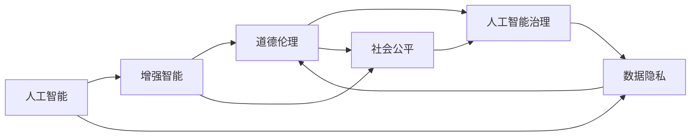

                 

# AI时代的人类增强：道德和社会的平衡

> 关键词：人工智能,增强智能,道德伦理,社会公平,人工智能治理,数据隐私

## 1. 背景介绍

### 1.1 问题由来

随着人工智能(AI)技术的迅猛发展，智能增强的浪潮正在席卷各行各业。AI技术在医疗、教育、交通、金融等领域的应用，为人类带来了前所未有的便利和效率。然而，这些技术的应用也引发了广泛的伦理道德和社会公平问题。如何平衡AI的进步与人类社会的可持续发展，成为摆在科技和政策面前的重大挑战。

本文将深入探讨AI时代人类增强的道德和社会的平衡问题。首先，我们将介绍AI技术的核心概念和原理，其次，通过实际案例分析，讨论AI在社会应用中的道德风险。最后，从治理角度提出策略，以期为AI技术在更广泛领域的应用提供指导。

## 2. 核心概念与联系

### 2.1 核心概念概述

为了理解AI时代人类增强的道德和社会的平衡问题，我们需要理解以下几个核心概念：

- **人工智能(AI)**：利用算法、数据和计算能力，使计算机系统具有类似于人类智能的能力。包括感知、理解、学习、推理和决策等多种智能类型。
- **增强智能(AI Augmentation)**：通过AI技术增强人类的感知、认知和决策能力，实现更高效、准确和智能化的工作和生活。
- **道德伦理(Moral Ethics)**：指导人类行为和决策的原则和规范，涉及公正、责任、尊重和关怀等基本价值。
- **社会公平(Social Equity)**：保障所有个体和群体在社会资源、机会和权力上的平等和公正，避免不平等和歧视。
- **人工智能治理(AI Governance)**：通过法律、政策、标准和实践，管理和引导AI技术的发展，确保其安全、透明和负责任。
- **数据隐私(Data Privacy)**：保护个人和机构的数据安全，防止未经授权的数据收集和使用。

### 2.2 核心概念原理和架构的 Mermaid 流程图



这个流程图展示了AI、增强智能、道德伦理、社会公平、人工智能治理和数据隐私这些核心概念之间的逻辑关系。AI通过增强智能技术，提升人类能力，但同时也带来道德伦理和社会公平的挑战。

## 3. 核心算法原理 & 具体操作步骤

### 3.1 算法原理概述

AI技术的核心算法原理包括机器学习、深度学习、自然语言处理等。其中，增强智能的实现主要依赖于深度学习模型，通过大量数据训练，学习到高层次的特征表示和决策策略。

以自然语言处理为例，常见的深度学习模型包括RNN、LSTM、GRU、Transformer等。这些模型通过循环神经网络、卷积神经网络和自注意力机制等技术，学习语言的语义、语法和上下文信息，从而实现文本分类、语言翻译、问答等任务。

### 3.2 算法步骤详解

以下是使用Transformer模型进行文本分类的典型步骤：

1. **数据预处理**：将原始文本转换为模型所需的格式，包括分词、标记化、编码等。
2. **模型训练**：使用标注数据训练模型，优化模型参数，使其能够准确预测文本类别。
3. **模型评估**：使用测试数据评估模型性能，调整超参数和模型结构，提升模型准确率。
4. **模型部署**：将训练好的模型集成到实际应用中，进行推理预测。

### 3.3 算法优缺点

增强智能算法具有以下优点：
- **高效性**：能够自动化处理大量数据，提高工作效率。
- **精准性**：通过大量数据训练，可以提升决策的准确性和可靠性。
- **可扩展性**：模型可以通过扩展数据和优化算法，持续提升性能。

但其缺点也显而易见：
- **复杂性**：深度学习模型复杂度高，训练和调参难度大。
- **依赖数据**：模型性能依赖于数据质量，数据偏差可能导致偏见和歧视。
- **安全性**：黑盒模型缺乏可解释性，可能导致难以理解和控制其行为。

### 3.4 算法应用领域

增强智能算法广泛应用于医疗诊断、智能客服、教育辅助、交通监控等领域。以下是几个典型案例：

- **医疗诊断**：通过分析医疗影像和病历，辅助医生进行诊断和治疗。
- **智能客服**：通过自然语言处理技术，实现自动应答和问题解决，提升客户体验。
- **教育辅助**：通过智能推荐系统和自适应学习技术，个性化教育方案，提升学习效果。
- **交通监控**：通过图像识别技术，实时监测交通流量和违法行为，提高交通管理效率。

## 4. 数学模型和公式 & 详细讲解 & 举例说明

### 4.1 数学模型构建

以Transformer模型为例，其数学模型构建主要包括以下几个步骤：

1. **输入编码器**：将输入文本转换为向量表示。
2. **自注意力机制**：计算输入文本中各个词语的注意力权重。
3. **多头自注意力**：通过多个头的自注意力机制，捕捉不同层次的语义信息。
4. **全连接层**：将注意力机制的输出进行线性变换和激活函数处理。
5. **输出解码器**：对全连接层的输出进行解码，得到模型预测结果。

### 4.2 公式推导过程

以下是Transformer模型的核心公式推导：

$$
h_t = ATF(x_t) + h_{t-1}
$$

其中，$h_t$ 表示时间步$t$的隐藏状态，$x_t$ 表示时间步$t$的输入向量，$A$ 表示自注意力机制，$T$ 表示全连接层，$F$ 表示前向传播函数，$h_{t-1}$ 表示时间步$t-1$的隐藏状态。

### 4.3 案例分析与讲解

以情感分析为例，以下是使用Transformer模型进行情感分类的过程：

1. **数据预处理**：将原始文本分词，并转换为数字向量。
2. **模型训练**：使用标注数据训练模型，最小化交叉熵损失。
3. **模型评估**：使用测试数据评估模型性能，调整超参数。
4. **模型部署**：将训练好的模型集成到实际应用中，对新文本进行情感分析。

## 5. 项目实践：代码实例和详细解释说明

### 5.1 开发环境搭建

以下是使用Python和PyTorch搭建文本分类模型的环境配置流程：

1. 安装Anaconda：从官网下载并安装Anaconda，用于创建独立的Python环境。
2. 创建并激活虚拟环境：
```bash
conda create -n pytorch-env python=3.8 
conda activate pytorch-env
```

3. 安装PyTorch：根据CUDA版本，从官网获取对应的安装命令。例如：
```bash
conda install pytorch torchvision torchaudio cudatoolkit=11.1 -c pytorch -c conda-forge
```

4. 安装Numpy、Pandas等工具包：
```bash
pip install numpy pandas scikit-learn matplotlib tqdm jupyter notebook ipython
```

完成上述步骤后，即可在`pytorch-env`环境中开始模型开发。

### 5.2 源代码详细实现

以下是使用PyTorch和Transformer模型进行文本分类的代码实现：

```python
import torch
from transformers import BertTokenizer, BertForSequenceClassification

# 加载数据集
tokenizer = BertTokenizer.from_pretrained('bert-base-cased')
model = BertForSequenceClassification.from_pretrained('bert-base-cased', num_labels=2)

# 预处理输入数据
inputs = tokenizer.encode(texts, add_special_tokens=True, padding='max_length', truncation=True, max_length=128)

# 前向传播
with torch.no_grad():
    outputs = model(inputs)
    logits = outputs[0]

# 输出预测结果
predictions = torch.argmax(logits, dim=1)
```

### 5.3 代码解读与分析

以下是关键代码的实现细节：

- **数据预处理**：使用BertTokenizer将原始文本转换为模型所需的数字向量，并进行长度限制和填充。
- **模型加载**：加载预训练的BertForSequenceClassification模型，并设置输出层为二分类。
- **前向传播**：将输入数据进行模型前向传播，得到模型预测的logits。
- **结果输出**：将logits进行argmax操作，得到最终的二分类预测结果。

## 6. 实际应用场景

### 6.1 智能医疗

在智能医疗领域，增强智能技术能够大幅提升疾病诊断和治疗的效率和准确性。例如，通过分析医疗影像和病历数据，辅助医生进行快速准确的诊断和治疗。

### 6.2 教育辅助

在教育领域，增强智能技术能够提供个性化的学习方案，提升学习效果。通过智能推荐系统和自适应学习技术，学生能够获得更贴合自身需求的学习资源和建议。

### 6.3 交通管理

在交通管理领域，增强智能技术能够实现智能交通信号控制和违法行为监测，提高道路通行效率和安全水平。通过图像识别技术，实时监测交通流量和违法行为，优化交通管理策略。

### 6.4 未来应用展望

未来，增强智能技术将在更多领域得到广泛应用，为社会带来深远影响：

1. **智慧城市**：通过智能传感器和数据分析，实现智能交通、能源管理、公共安全等城市功能的提升。
2. **农业智能化**：通过图像识别和智能推荐，优化农业生产流程，提高农作物产量和质量。
3. **金融科技**：通过智能算法和大数据分析，提供智能投资、风险控制和客户服务，提升金融服务效率和客户体验。

## 7. 工具和资源推荐

### 7.1 学习资源推荐

以下是一些有助于理解AI时代人类增强的道德和社会的平衡问题的学习资源：

1. **《人工智能伦理与社会》课程**：多门大学开设的AI伦理课程，如斯坦福大学的CS561、CMU的10708等，系统讲解AI伦理和政策。
2. **《AI：伦理、社会与人类》书籍**：斯坦福大学AI伦理教授的专著，系统介绍AI伦理和社会影响。
3. **AI伦理工作坊和研讨会**：如ACM SIGAI的AI伦理专题会议，邀请专家学者分享最新研究成果和应用案例。
4. **AI伦理相关论文**：如《AI伦理理论框架》等，系统阐述AI伦理的理论基础和实践指导。

### 7.2 开发工具推荐

以下是一些常用的AI开发工具：

1. **PyTorch**：基于Python的深度学习框架，支持动态计算图和丰富的模型库。
2. **TensorFlow**：由Google主导开发的深度学习框架，支持静态和动态计算图，适用于大规模工程应用。
3. **Transformers库**：HuggingFace开发的NLP工具库，支持多种预训练模型，简化模型开发流程。
4. **Jupyter Notebook**：交互式开发环境，支持Python和R等多种语言，方便数据处理和模型调试。
5. **Google Colab**：免费的Jupyter Notebook环境，支持GPU和TPU算力，方便研究实验。

### 7.3 相关论文推荐

以下是一些关于AI时代人类增强的道德和社会的平衡问题的经典论文：

1. **《AI伦理框架：原理与实践》**：提出AI伦理的理论框架，涵盖隐私保护、责任归属、公平性等方面。
2. **《AI对人类影响的伦理考量》**：分析AI技术对人类社会、文化和心理的影响，提出伦理应对策略。
3. **《人工智能与公平性：挑战与机遇》**：探讨AI技术在提升社会公平性方面的潜力和挑战。
4. **《AI治理：法律、政策和标准》**：介绍AI治理的框架和策略，保障AI技术的健康发展。
5. **《数据隐私与AI伦理》**：分析数据隐私在AI应用中的重要性，提出隐私保护的具体措施。

## 8. 总结：未来发展趋势与挑战

### 8.1 研究成果总结

AI时代人类增强的道德和社会的平衡问题，是一个复杂的跨学科课题。通过本文的系统梳理，我们可以看出，AI技术在提升人类能力的同时，也带来了诸多伦理和社会问题。解决这些问题需要科技、法律、伦理和政策等多方面的共同努力。

### 8.2 未来发展趋势

未来，AI技术将在更广泛领域得到应用，为人类带来巨大的发展机遇。但同时也需要关注以下趋势：

1. **AI伦理的普及**：随着AI技术的普及，AI伦理知识的普及也显得尤为重要。社会各界需要加强对AI伦理的认知和理解。
2. **公平性问题的重视**：AI技术的应用需要特别关注公平性问题，避免算法偏见和不平等现象。
3. **透明度和可解释性**：AI模型的黑盒特性需要透明和可解释，以便于监管和公众监督。
4. **隐私保护的加强**：AI技术的应用需要严格保护用户隐私，避免数据滥用和泄露。
5. **安全性和鲁棒性**：AI模型的安全性需要加强，避免恶意攻击和操纵。

### 8.3 面临的挑战

尽管AI技术带来了诸多发展机遇，但其应用也面临诸多挑战：

1. **伦理争议**：AI技术的决策过程和结果可能引发伦理争议，需要多方参与讨论和决策。
2. **技术瓶颈**：AI技术的复杂性和不确定性，可能导致技术开发和应用过程中的瓶颈。
3. **数据质量**：AI技术依赖大量数据，数据质量直接影响模型效果，数据偏见可能带来不良影响。
4. **法律法规滞后**：AI技术的发展速度快于法律法规的制定和更新，存在法律空白和监管不足的问题。
5. **社会接受度**：AI技术的应用需要公众的广泛接受和信任，如何建立社会共识，需要持续努力。

### 8.4 研究展望

未来，AI技术的发展需要从多个方面进行探索和创新：

1. **伦理框架的完善**：建立系统的AI伦理框架，涵盖隐私保护、责任归属、公平性等方面。
2. **公平性算法的研究**：开发公平性算法，减少算法偏见和不平等现象，提升AI应用的公平性。
3. **透明性和可解释性技术**：研究透明性和可解释性技术，提升AI模型的可解释性，增强公众信任。
4. **隐私保护技术**：开发隐私保护技术，保障用户数据安全，避免数据滥用和泄露。
5. **AI治理机制的建立**：建立AI治理机制，包括法律、政策、标准和实践，保障AI技术的健康发展。

通过这些研究方向，我们有望解决AI技术在应用过程中面临的伦理和公平性问题，使其更好地服务于人类社会的发展。

## 9. 附录：常见问题与解答

**Q1：AI技术的伦理问题如何解决？**

A: AI技术的伦理问题需要多方面的努力来解决：
1. **法律和政策**：制定和完善相关法律法规，保障AI技术的应用符合伦理规范。
2. **技术改进**：开发透明、可解释、公平的AI技术，避免偏见和歧视。
3. **公众教育**：提高公众对AI技术的认知和理解，建立社会共识。
4. **多方参与**：政府、企业、学术界、公众多方共同参与，制定伦理标准和规范。

**Q2：AI技术如何保障数据隐私？**

A: AI技术保障数据隐私需要多方面的措施：
1. **数据匿名化**：通过数据匿名化和脱敏，保护用户隐私。
2. **数据加密**：对敏感数据进行加密存储和传输，防止数据泄露。
3. **访问控制**：对数据访问进行严格控制，防止未经授权的访问和使用。
4. **隐私保护技术**：开发隐私保护技术，如差分隐私、联邦学习等，保障数据隐私。

**Q3：AI技术的公平性问题如何解决？**

A: AI技术的公平性问题需要系统性的解决：
1. **数据集多样性**：确保训练数据集的多样性，避免数据偏见。
2. **公平性算法**：开发公平性算法，减少算法偏见和不平等现象。
3. **公平性评估**：定期评估AI模型的公平性，发现和纠正问题。
4. **多方参与**：政府、企业、学术界、公众多方共同参与，制定公平性标准和规范。

**Q4：AI技术如何提升社会公平性？**

A: AI技术提升社会公平性需要多方面的努力：
1. **公平性算法**：开发公平性算法，减少算法偏见和不平等现象。
2. **数据共享**：推动数据共享和开放，确保公平性算法有足够的数据支持。
3. **政策支持**：政府出台相关政策，支持AI技术在社会公平性方面的应用。
4. **多方参与**：政府、企业、学术界、公众多方共同参与，制定公平性标准和规范。

---

作者：禅与计算机程序设计艺术 / Zen and the Art of Computer Programming

