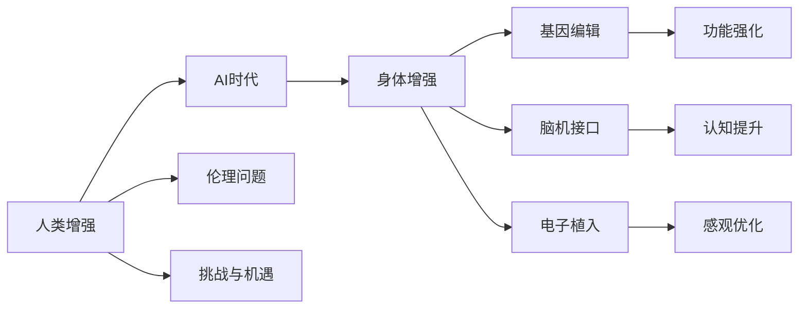

                 

# AI时代的人类增强：道德考虑与身体增强的未来发展机遇挑战趋势

在AI技术的飞速发展中，人类增强逐渐成为热门话题。本文将探讨AI时代下身体增强的现状、未来发展机遇和面临的挑战，并从道德层面进行深入讨论。

## 1. 背景介绍

### 1.1 人类增强与AI结合的背景

随着科技的进步，人类增强技术在AI时代焕发出新的活力。AI技术的融入，使得增强技术不再局限于物理实现，而是扩展到了数字化、软件化的层面。这种变化，不仅带来了医疗、运动、教育等多个领域的变革，也引发了关于人类增强的伦理和社会问题的广泛讨论。

### 1.2 身体增强技术的现状

当前，身体增强技术主要包括基因编辑、脑机接口、电子植入等方法。这些技术通过改造人体或与人体进行交互，实现功能强化和性能提升。在AI的辅助下，这些技术在实际应用中取得了一定的成果。

## 2. 核心概念与联系

### 2.1 核心概念概述

- **人类增强(Human Augmentation)**：通过技术手段提升人类在身体、心理、智能等方面的能力。
- **AI时代**：以人工智能为核心驱动力的时代，AI技术在各个领域的应用逐渐普及。
- **身体增强**：通过基因编辑、脑机接口、电子植入等技术，改造和优化人体功能。
- **伦理问题**：在使用增强技术时，涉及到的道德和法律问题。
- **挑战与机遇**：增强技术在提升能力的同时，也面临技术、经济、社会等多方面的挑战与机遇。

### 2.2 核心概念原理和架构的 Mermaid 流程图



## 3. 核心算法原理 & 具体操作步骤

### 3.1 算法原理概述

在AI时代，身体增强技术主要通过基因编辑、脑机接口和电子植入三种方式实现。其中，基因编辑技术通过修改基因序列，实现功能性增强；脑机接口技术通过读取和解析大脑信号，实现与外部设备的交互；电子植入技术通过在身体内植入电子装置，直接提升人体功能。

### 3.2 算法步骤详解

#### 基因编辑

1. **基因识别**：通过高通量测序等手段，确定需要编辑的基因序列。
2. **基因编辑**：使用CRISPR-Cas9等技术，精准修改基因序列。
3. **功能验证**：对编辑后的基因进行功能验证，确保增强效果。

#### 脑机接口

1. **信号采集**：使用EEG、fMRI等技术，采集大脑信号。
2. **信号解析**：通过机器学习算法，解析大脑信号，提取有价值的信息。
3. **交互实现**：将解析结果转化为控制信号，实现与外部设备的交互。

#### 电子植入

1. **设备设计**：根据增强需求，设计适合的电子植入设备。
2. **植入手术**：通过微创手术，将设备植入人体。
3. **功能调整**：根据植入后反馈，调整设备参数，确保增强效果。

### 3.3 算法优缺点

#### 基因编辑

**优点**：
- 功能永久性增强。
- 可以改善遗传性疾病，延长寿命。

**缺点**：
- 技术难度高，成本昂贵。
- 存在基因伦理问题，如基因隐私、基因歧视等。

#### 脑机接口

**优点**：
- 可穿戴性高，易于操作。
- 无需手术，安全性高。

**缺点**：
- 信号解析难度大，准确性有待提升。
- 使用过程中需要持续佩戴设备，有一定的不便。

#### 电子植入

**优点**：
- 效果显著，可实时调整。
- 技术成熟，风险较低。

**缺点**：
- 需要手术植入，存在一定风险。
- 设备体积和成本较高。

### 3.4 算法应用领域

- **医疗领域**：如心脏病治疗、癌症基因检测、精神疾病治疗等。
- **运动领域**：如提高运动性能、预防运动损伤、增强体能训练效果等。
- **教育领域**：如提高认知能力、增强记忆力、促进语言学习等。

## 4. 数学模型和公式 & 详细讲解 & 举例说明

### 4.1 数学模型构建

**基因编辑模型**：

$$
\text{Effectiveness} = \alpha \cdot \text{Gene Alteration} + \beta \cdot \text{Functional Validation}
$$

其中，$\alpha$ 和 $\beta$ 为权重系数，表示基因编辑和功能验证对增强效果的影响。

**脑机接口模型**：

$$
\text{Interaction Accuracy} = \gamma \cdot \text{Signal Acquisition} + \delta \cdot \text{Signal Parsing} + \epsilon \cdot \text{Interactive Device}
$$

其中，$\gamma$、$\delta$ 和 $\epsilon$ 分别表示信号采集、解析和设备对交互准确性的影响。

**电子植入模型**：

$$
\text{Enhancement Effect} = \mu \cdot \text{Implant Design} + \nu \cdot \text{Surgical Procedure} + \xi \cdot \text{Adjustment Feedback}
$$

其中，$\mu$、$\nu$ 和 $\xi$ 分别表示植入设计、手术过程和反馈调整对增强效果的影响。

### 4.2 公式推导过程

以基因编辑模型为例，假设基因编辑的效果由两个因素决定：基因序列的修改和功能的验证。

1. **基因序列修改**：
   $$
   \text{Gene Alteration} = f(\text{Gene Editing Technology}, \text{Target Gene})
   $$
   其中，$f$ 为函数关系，表示技术对基因序列的修改效果。

2. **功能验证**：
   $$
   \text{Functional Validation} = g(\text{Gene Editing Outcome}, \text{Validation Test})
   $$
   其中，$g$ 为函数关系，表示验证测试对基因编辑效果的影响。

综合以上两个因素，得到增强效果的模型：
$$
\text{Effectiveness} = \alpha \cdot f(\text{Gene Editing Technology}, \text{Target Gene}) + \beta \cdot g(\text{Gene Editing Outcome}, \text{Validation Test})
$$

### 4.3 案例分析与讲解

以基因编辑技术在心脏病治疗中的应用为例：

1. **基因识别**：确定导致心脏病的基因序列。
2. **基因编辑**：使用CRISPR-Cas9技术，修改特定基因序列。
3. **功能验证**：通过动物实验和临床试验，验证基因编辑的效果，确保无副作用。

## 5. 项目实践：代码实例和详细解释说明

### 5.1 开发环境搭建

在项目实践中，我们首先需要搭建好开发环境。这里以Python为例，介绍环境搭建的步骤：

1. 安装Python：
   ```
   sudo apt-get update
   sudo apt-get install python3
   ```

2. 安装相关库：
   ```
   pip install numpy scipy pandas matplotlib scikit-learn
   ```

3. 准备数据：
   - 基因序列数据
   - 功能验证结果

### 5.2 源代码详细实现

以下是一个简单的基因编辑模型代码实现：

```python
import numpy as np

def gene_editing_effectiveness(alpha, beta, gene_alteration, functional_validation):
    effectiveness = alpha * gene_alteration + beta * functional_validation
    return effectiveness

# 基因编辑效果
gene_alteration = np.random.normal(0.5, 0.1, 100)  # 生成100个随机基因编辑效果
# 功能验证结果
functional_validation = np.random.normal(0.8, 0.1, 100)  # 生成100个随机功能验证结果

# 权重系数
alpha = 0.7
beta = 0.3

# 计算增强效果
effectiveness = gene_editing_effectiveness(alpha, beta, gene_alteration, functional_validation)
print(effectiveness)
```

### 5.3 代码解读与分析

- 代码实现了基因编辑模型，计算增强效果。
- 生成100个随机基因编辑效果和功能验证结果，用于模拟实际数据。
- 设置权重系数，控制基因编辑和功能验证的影响。
- 最终输出增强效果的平均值。

## 6. 实际应用场景

### 6.1 医疗领域

在医疗领域，基因编辑和电子植入技术有广泛的应用前景。

- **心脏病治疗**：通过基因编辑，修复导致心脏病的基因，防止疾病发展。
- **癌症基因检测**：利用基因编辑技术，对癌基因进行编辑和检测，早期发现癌症。
- **精神疾病治疗**：通过脑机接口技术，读取和解析大脑信号，进行精神疾病的诊断和治疗。

### 6.2 运动领域

运动领域是电子植入技术的重要应用场景，可以有效提升运动员的表现。

- **提高运动性能**：通过植入电子设备，实时监测和调整运动员的身体状态，提升运动表现。
- **预防运动损伤**：利用电子植入技术，提前预测运动损伤，及时采取措施，避免受伤。
- **增强体能训练效果**：通过脑机接口技术，引导运动员进行高效的体能训练，提升体能水平。

### 6.3 教育领域

教育领域是脑机接口技术的潜在应用场景，可以显著提升学生的学习效果。

- **提高认知能力**：通过脑机接口技术，读取和解析大脑信号，指导学习，提高认知能力。
- **增强记忆力**：利用基因编辑技术，增强大脑的记忆功能，提升学习效率。
- **促进语言学习**：通过电子植入技术，实时反馈语言学习情况，优化学习路径。

## 7. 工具和资源推荐

### 7.1 学习资源推荐

1. **《基因编辑技术概论》**：介绍了基因编辑技术的基本原理和应用案例。
2. **《脑机接口技术》**：涵盖了脑机接口技术的现状和未来发展趋势。
3. **《人类增强伦理》**：探讨了人类增强技术在伦理、法律和社会方面的问题。

### 7.2 开发工具推荐

1. **Python**：开源、跨平台，适合科学计算和数据分析。
2. **Jupyter Notebook**：交互式开发环境，支持代码执行和结果展示。
3. **RStudio**：R语言的开发环境，适用于数据分析和统计建模。

### 7.3 相关论文推荐

1. **《CRISPR-Cas9基因编辑技术》**：介绍了CRISPR-Cas9技术的原理和应用。
2. **《脑机接口技术发展现状》**：总结了脑机接口技术的最新进展。
3. **《人类增强技术的伦理挑战》**：探讨了人类增强技术的伦理问题。

## 8. 总结：未来发展趋势与挑战

### 8.1 研究成果总结

在AI时代，人类增强技术的发展迅猛，取得了显著的成果。基因编辑、脑机接口、电子植入等技术的应用，显著提升了人类在医疗、运动、教育等方面的能力。

### 8.2 未来发展趋势

未来，人类增强技术将呈现出以下发展趋势：

1. **跨学科融合**：与人工智能、生物医学等多学科进行深度融合，实现更广泛的应用。
2. **智能化提升**：利用AI技术优化增强效果，实现智能化的增强目标。
3. **伦理和法律规范**：制定相关的伦理和法律规范，确保技术的安全性和公正性。

### 8.3 面临的挑战

人类增强技术在发展过程中也面临诸多挑战：

1. **技术难度高**：基因编辑、脑机接口等技术难度较大，需要大量的研发投入。
2. **伦理问题复杂**：增强技术涉及的伦理问题复杂多样，需要多方协调。
3. **安全性问题**：增强技术的安全性问题亟需解决，确保用户安全。

### 8.4 研究展望

未来的研究可以从以下几个方面进行：

1. **技术创新**：推动技术突破，降低技术成本，提升应用效果。
2. **伦理规范**：制定伦理规范，确保技术的公平性和可接受性。
3. **社会普及**：加强技术普及教育，提高公众对增强技术的认知和接受度。

## 9. 附录：常见问题与解答

### Q1：基因编辑技术如何实现精准编辑？

**A**：基因编辑技术通过CRISPR-Cas9系统实现精准编辑。CRISPR-Cas9系统包含两个主要组件：Cas9酶和RNA向导。RNA向导可以精确识别目标基因序列，Cas9酶则进行切割和修复。通过设计和优化RNA向导，可以实现对特定基因的精准编辑。

### Q2：脑机接口技术面临的主要挑战是什么？

**A**：脑机接口技术面临的主要挑战包括信号解析的准确性和实时性。当前，脑机接口技术的信号解析算法仍需进一步优化，以提高解析的准确性和实时性。同时，设备的便携性和安全性也是需要重点考虑的问题。

### Q3：电子植入技术有哪些潜在的风险？

**A**：电子植入技术的潜在风险包括手术风险、设备故障和信号干扰。手术风险与植入位置和手术操作有关，设备故障可能导致植入失败，信号干扰可能影响植入设备的正常工作。

---

作者：禅与计算机程序设计艺术 / Zen and the Art of Computer Programming

