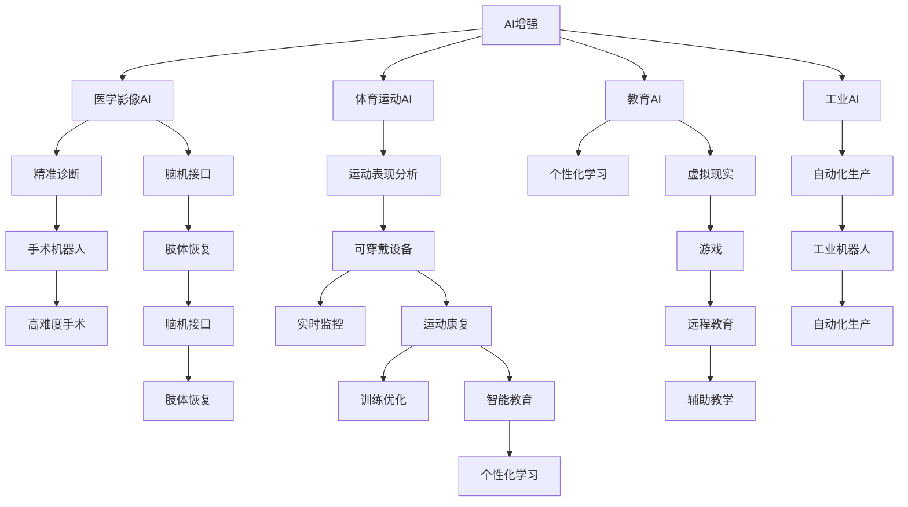

                 

# AI时代的人类增强：道德考虑和身体增强的未来

在人工智能飞速发展的时代，人类增强技术正逐渐成为热门话题。这其中，AI在医学、体育、娱乐等领域的广泛应用，带来了前所未有的可能性。然而，伴随着技术的进步，道德与伦理问题也随之浮现，如何平衡科技与道德，成为值得深思的话题。本文将围绕人类增强的核心概念，探讨其在AI时代的应用前景与伦理挑战，提出相应的道德考量。

## 1. 背景介绍

### 1.1 人类增强技术的发展
人类增强技术，指的是通过科技手段提升人体的各种机能，包括但不限于运动能力、认知能力、感官能力等。AI在计算机视觉、自然语言处理、机器人控制等领域的突破，为人类增强提供了强有力的技术支撑。医学影像AI、医疗机器人、可穿戴设备、脑机接口等技术的飞速发展，正逐渐将这些技术从科幻小说变为现实。

### 1.2 人类增强技术的现实应用
近年来，人体增强技术在各个领域得到广泛应用，并逐渐与AI技术深度融合，形成了多个富有潜力的应用场景。

- **医疗领域**：医学影像AI技术可用于精准诊断，手术机器人可用于高难度手术，脑机接口技术可用于肢体恢复。
- **体育领域**：体育运动AI可用于运动表现分析、训练优化，可穿戴设备可用于实时监控健康状况。
- **娱乐领域**：虚拟现实、增强现实技术可用于游戏、培训、模拟等。
- **教育领域**：智能教育平台可用于个性化学习、远程教育、辅助教学。
- **工业领域**：工业机器人可用于自动化生产、质量检测、维护保养。

这些应用不仅提高了人类的生活水平，还带来了前所未有的经济效益。然而，技术的进步也带来了一些问题，尤其是伦理与道德问题，需要引起重视。

## 2. 核心概念与联系

### 2.1 核心概念概述
- **AI增强**：利用AI技术提升人类身体或认知机能，涵盖医学、体育、教育等多个领域。
- **道德考量**：涉及科技伦理、隐私保护、数据安全、公平性等问题的考量。
- **公平性**：确保技术应用对所有群体均等、公正，不造成歧视或不平等。
- **隐私保护**：保护用户数据，避免个人信息泄露或滥用。
- **安全性**：确保AI增强技术的安全性，防止技术滥用或事故发生。
- **社会接受度**：确保技术被社会广泛接受，不引发公众反感或抵触。

这些概念之间的关系可以通过以下Mermaid流程图来展示：



这个流程图展示了AI增强技术在多个领域的应用路径，并通过不同的应用场景展示了其对伦理与道德的影响。

## 3. 核心算法原理 & 具体操作步骤

### 3.1 算法原理概述
AI增强技术涉及多种算法，包括机器学习、深度学习、自然语言处理等。这些算法通过数据训练，实现对人体机能的优化和提升。其中，机器学习算法通过对大量数据的学习，识别出模式和规律，从而实现对人体机能的增强。深度学习算法通过构建复杂模型，实现对人体机能的深度优化。自然语言处理算法通过理解和分析语义，实现对人类行为的增强。

### 3.2 算法步骤详解
1. **数据收集**：收集人体机能相关数据，如运动轨迹、生理指标、脑电波等。
2. **模型训练**：利用机器学习或深度学习算法，对收集到的数据进行训练，构建优化模型。
3. **模型测试**：通过测试数据集对模型进行验证，确保模型的准确性和可靠性。
4. **模型应用**：将训练好的模型应用于实际场景，如体育训练、医疗诊断等。
5. **效果评估**：对模型效果进行评估，根据反馈调整模型参数，优化模型性能。

### 3.3 算法优缺点
**优点**：
- **精准度**：AI增强技术可以通过大量数据训练，实现对人类机能的精准优化。
- **效率高**：AI技术可以快速处理大量数据，实现对人体机能的实时优化。
- **个性化**：通过算法模型，可以实现对个体差异的个性化调整，提升用户体验。

**缺点**：
- **数据隐私**：数据收集和处理过程中可能涉及个人隐私，存在泄露风险。
- **技术滥用**：技术容易被滥用，导致医疗事故或安全事故。
- **公平性**：技术应用可能存在不公平，导致不同群体间的不平等。

### 3.4 算法应用领域
AI增强技术在医疗、体育、教育等多个领域都有广泛应用。

- **医疗领域**：AI影像技术可用于精准诊断，手术机器人可用于高难度手术。
- **体育领域**：体育运动AI可用于运动表现分析、训练优化，可穿戴设备可用于实时监控健康状况。
- **教育领域**：智能教育平台可用于个性化学习、远程教育、辅助教学。
- **娱乐领域**：虚拟现实、增强现实技术可用于游戏、培训、模拟等。
- **工业领域**：工业机器人可用于自动化生产、质量检测、维护保养。

## 4. 数学模型和公式 & 详细讲解 & 举例说明

### 4.1 数学模型构建
以医学影像AI为例，其核心模型为卷积神经网络(CNN)，用于从医学影像中提取特征，实现精准诊断。模型的输入为医学影像，输出为诊断结果，中间层为特征提取层和分类层。模型的训练数据集为大量带有标签的医学影像，模型的输出与标签进行比较，计算误差，并通过反向传播算法更新模型参数。

### 4.2 公式推导过程
以医学影像分类为例，模型的输出公式为：
$$
y = \text{softmax}(Wx + b)
$$
其中 $x$ 为输入的医学影像，$W$ 为权重矩阵，$b$ 为偏置向量，$y$ 为输出结果。模型的损失函数为交叉熵损失函数：
$$
\mathcal{L}(y, \hat{y}) = -\sum_{i=1}^n y_i \log \hat{y_i}
$$
其中 $y$ 为真实标签，$\hat{y}$ 为模型预测结果。

### 4.3 案例分析与讲解
以运动表现分析为例，AI增强技术可以通过收集运动员的运动数据，如速度、力量、姿势等，利用深度学习算法构建运动分析模型，实现对运动员运动表现的实时评估和优化。模型可以通过大量数据训练，识别出运动员的优点和不足，并提供个性化训练方案，提升运动员的训练效果。

## 5. 项目实践：代码实例和详细解释说明

### 5.1 开发环境搭建

开发AI增强项目需要以下几个步骤：

1. **安装Python**：
```bash
sudo apt-get update
sudo apt-get install python3
```

2. **安装深度学习框架**：
```bash
pip install tensorflow
pip install keras
```

3. **准备数据集**：
需要准备相关的数据集，如医学影像、运动轨迹等。

### 5.2 源代码详细实现

以下是一个简单的医学影像分类模型的实现示例：

```python
import tensorflow as tf
from tensorflow.keras import layers, models

# 构建模型
model = models.Sequential([
    layers.Conv2D(32, (3, 3), activation='relu', input_shape=(256, 256, 1)),
    layers.MaxPooling2D((2, 2)),
    layers.Conv2D(64, (3, 3), activation='relu'),
    layers.MaxPooling2D((2, 2)),
    layers.Conv2D(128, (3, 3), activation='relu'),
    layers.MaxPooling2D((2, 2)),
    layers.Flatten(),
    layers.Dense(128, activation='relu'),
    layers.Dense(1, activation='sigmoid')
])

# 编译模型
model.compile(optimizer='adam', loss='binary_crossentropy', metrics=['accuracy'])

# 训练模型
model.fit(train_data, train_labels, epochs=10, validation_data=(val_data, val_labels))

# 测试模型
test_loss, test_acc = model.evaluate(test_data, test_labels)
print('Test accuracy:', test_acc)
```

### 5.3 代码解读与分析

**数据预处理**：
数据预处理是AI增强项目中非常重要的一环。需要根据具体数据类型进行不同的处理方式。例如，对于医学影像数据，需要进行归一化、旋转、裁剪等处理，以提高模型的准确性。

**模型构建**：
模型的构建需要根据具体任务进行设计。卷积神经网络是常见的用于图像分类的模型，可以通过增加或减少层数、调整滤波器数量等方式进行优化。

**模型训练**：
模型训练需要使用大量的训练数据和合适的学习率。可以通过设置early stopping、学习率衰减等策略，避免过拟合，提高模型泛化能力。

**模型评估**：
模型评估需要使用测试数据集，计算准确率、精确率、召回率等指标，以评估模型的性能。

## 6. 实际应用场景

### 6.1 医疗领域

AI增强技术在医疗领域的应用前景广阔，涵盖了精准诊断、手术辅助、远程医疗等多个方面。

- **精准诊断**：通过医学影像AI技术，医生可以快速、准确地进行疾病诊断，提高诊断效率和准确性。
- **手术辅助**：通过手术机器人技术，医生可以更加精确地进行手术操作，减少手术风险。
- **远程医疗**：通过可穿戴设备，医生可以实时监控患者的健康状况，提供远程医疗服务。

### 6.2 体育领域

AI增强技术在体育领域的应用同样广泛，涵盖了运动表现分析、训练优化、比赛预测等多个方面。

- **运动表现分析**：通过运动AI技术，教练可以实时监控运动员的运动数据，分析其表现，制定个性化训练方案。
- **训练优化**：通过运动AI技术，教练可以优化训练计划，提升运动员的运动能力。
- **比赛预测**：通过AI技术，可以对比赛结果进行预测，提供数据分析支持。

### 6.3 教育领域

AI增强技术在教育领域的应用同样重要，涵盖了智能教育平台、个性化学习、远程教育等多个方面。

- **智能教育平台**：通过智能教育平台，教师可以实时监控学生的学习状况，提供个性化辅导。
- **个性化学习**：通过AI技术，可以根据学生的学习情况，提供个性化的学习方案，提升学习效果。
- **远程教育**：通过AI技术，可以进行远程教育，提高教育资源的覆盖率。

### 6.4 未来应用展望

未来，AI增强技术的应用前景更加广阔，将涵盖更多领域，带来更多的可能性。

- **脑机接口**：通过脑机接口技术，可以实现对大脑信号的实时监控，辅助治疗脑部疾病。
- **虚拟现实**：通过虚拟现实技术，可以进行沉浸式学习、训练、娱乐等。
- **智能家居**：通过智能家居设备，可以实时监控人体健康状况，提供个性化服务。
- **工业自动化**：通过工业机器人技术，可以实现自动化生产、质量检测等，提高生产效率。

## 7. 工具和资源推荐

### 7.1 学习资源推荐

1. **《深度学习》课程**：斯坦福大学李飞飞教授的深度学习课程，涵盖了深度学习的基本概念和算法。
2. **《机器学习》课程**：斯坦福大学Andrew Ng教授的机器学习课程，介绍了机器学习的基本原理和应用。
3. **Kaggle竞赛**：Kaggle是一个数据科学竞赛平台，可以参与各类数据竞赛，积累实战经验。
4. **OpenAI API**：OpenAI提供了丰富的API接口，可以方便地使用AI技术。
5. **Coursera课程**：Coursera是一个在线学习平台，提供了各类深度学习和AI相关的课程。

### 7.2 开发工具推荐

1. **Jupyter Notebook**：Jupyter Notebook是一个交互式编程工具，可以方便地进行数据处理和模型训练。
2. **TensorFlow**：TensorFlow是一个深度学习框架，提供了丰富的API接口，可以方便地进行模型训练和部署。
3. **Keras**：Keras是一个高级深度学习框架，提供了简单易用的API接口，可以快速构建和训练模型。
4. **PyTorch**：PyTorch是一个深度学习框架，提供了动态图机制，适合进行复杂模型的训练和推理。
5. **TensorBoard**：TensorBoard是TensorFlow的可视化工具，可以实时监控模型训练状态，提供详细的图表和分析。

### 7.3 相关论文推荐

1. **《深度学习》论文**：深度学习领域的经典论文，介绍了深度学习的基本概念和算法。
2. **《机器学习》论文**：机器学习领域的经典论文，介绍了机器学习的基本原理和应用。
3. **《医疗影像AI》论文**：介绍医疗影像AI技术的应用和算法。
4. **《运动表现分析》论文**：介绍运动表现分析技术的应用和算法。
5. **《智能教育平台》论文**：介绍智能教育平台的应用和算法。

## 8. 总结：未来发展趋势与挑战

### 8.1 研究成果总结

AI增强技术的发展，为人类提供了更多的可能性，但也带来了诸多挑战。如何平衡科技与道德，是一个亟待解决的问题。

- **精准度**：AI增强技术可以通过大量数据训练，实现对人类机能的精准优化。
- **效率高**：AI技术可以快速处理大量数据，实现对人体机能的实时优化。
- **个性化**：通过算法模型，可以实现对个体差异的个性化调整，提升用户体验。

### 8.2 未来发展趋势

未来，AI增强技术将涵盖更多领域，带来更多的可能性。

- **精准医疗**：通过AI技术，可以实现精准诊断和治疗，提高医疗水平。
- **智能教育**：通过AI技术，可以提供个性化教育，提升教育水平。
- **智能家居**：通过智能家居设备，可以实时监控人体健康状况，提供个性化服务。
- **工业自动化**：通过工业机器人技术，可以实现自动化生产、质量检测等，提高生产效率。

### 8.3 面临的挑战

AI增强技术的发展也面临诸多挑战，需要引起重视。

- **数据隐私**：数据收集和处理过程中可能涉及个人隐私，存在泄露风险。
- **技术滥用**：技术容易被滥用，导致医疗事故或安全事故。
- **公平性**：技术应用可能存在不公平，导致不同群体间的不平等。

### 8.4 研究展望

未来，如何平衡科技与道德，确保AI增强技术的安全和公平，将是重要的研究方向。

- **隐私保护**：制定严格的数据隐私保护机制，确保用户数据安全。
- **伦理规范**：制定AI伦理规范，确保技术应用的公平性和安全性。
- **法规监管**：制定相关法规，确保技术应用的合法性和合规性。
- **社会接受度**：通过宣传和教育，提高社会对AI增强技术的接受度。

## 9. 附录：常见问题与解答

**Q1：什么是AI增强？**

A: AI增强指的是通过AI技术提升人体的各种机能，涵盖医学、体育、教育等多个领域。

**Q2：AI增强技术有哪些应用场景？**

A: AI增强技术在医疗、体育、教育、娱乐、工业等多个领域都有广泛应用。

**Q3：AI增强技术面临哪些挑战？**

A: AI增强技术面临数据隐私、技术滥用、公平性等问题。

**Q4：如何平衡科技与道德？**

A: 制定隐私保护机制、伦理规范、法规监管等措施，确保AI增强技术的安全和公平。

**Q5：未来AI增强技术的发展趋势是什么？**

A: 未来AI增强技术将涵盖更多领域，带来更多的可能性。

作者：禅与计算机程序设计艺术 / Zen and the Art of Computer Programming

