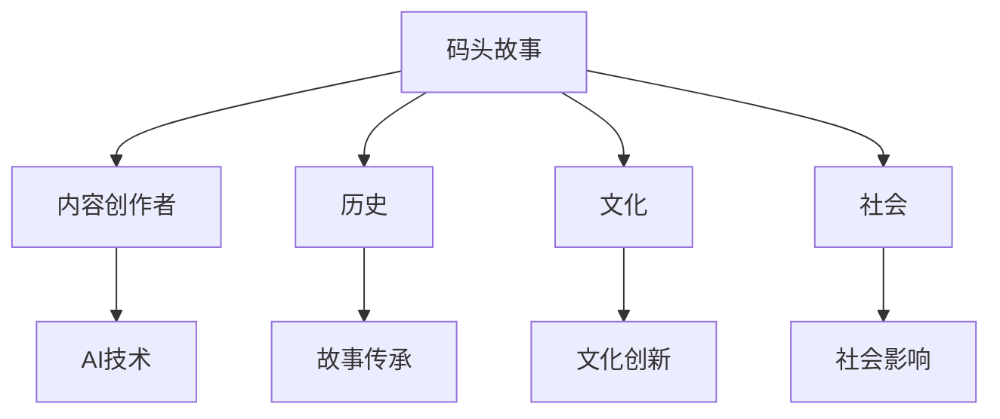

                 

# AI时代的内容创作者：码头故事的专注与坚持

## 1. 背景介绍

### 1.1 问题由来
随着人工智能技术的迅猛发展，内容创作者的工作方式和内容生产模式正发生着深刻变革。AI时代，内容创作者不仅要掌握写作、编辑、设计等传统技能，还需要掌握AI工具的使用，以便利用技术提高生产效率，优化内容质量。

在人工智能技术不断进化的今天，内容创作者面临着前所未有的挑战与机遇。本文将聚焦于码头故事的专注与坚持，探讨如何通过AI技术，提高内容创作的效率与质量，为内容创作者提供有力支持。

### 1.2 问题核心关键点
本文的核心问题在于如何利用AI技术，提高码头故事的内容创作效率，提升创作质量。码头故事作为一种常见的文化形式，具有深远的文化内涵和广泛的社会影响力，如何通过技术手段对其进行创新和传承，是一个值得深入探讨的话题。

## 2. 核心概念与联系

### 2.1 核心概念概述

为更好地理解本文讨论的内容，本节将介绍几个核心概念：

- 码头故事：通常指在码头边发生的各种民间故事，涵盖历史、文化、社会等多个方面，具有鲜明的地域特色。
- 内容创作者：包括作家、编辑、设计师等，通过写作、编辑、设计等手段，创造和传播内容的个体或团队。
- AI技术：指基于人工智能的各种技术，如自然语言处理、机器学习、计算机视觉等，能够帮助内容创作者进行文本生成、编辑、设计等任务。

这些核心概念之间的逻辑关系可以通过以下Mermaid流程图来展示：



这个流程图展示的核心概念及其之间的关系：

1. 码头故事通过内容创作者进行传承和创新，
2. 内容创作者借助AI技术提高创作效率和质量，
3. 历史、文化和社会的变迁，通过码头故事得以记录和传播。

## 3. 核心算法原理 & 具体操作步骤
### 3.1 算法原理概述

在AI时代，内容创作者可以利用自然语言处理(NLP)、计算机视觉(CV)等AI技术，提升码头故事创作的效率与质量。本文将重点探讨基于自然语言处理的AI技术，特别是在文本生成和编辑方面的应用。

基于自然语言处理的AI技术，包括但不限于文本生成、文本摘要、情感分析等，可以帮助内容创作者生成丰富的文本内容，自动完成文本编辑，甚至可以根据用户反馈进行自我优化。

### 3.2 算法步骤详解

基于自然语言处理的AI技术在码头故事创作中的应用，一般包括以下几个关键步骤：

**Step 1: 数据收集与预处理**
- 收集码头故事相关的历史资料、文化背景等文本数据，进行清洗和标注。
- 利用NLP技术进行分词、词性标注、命名实体识别等预处理，以提高后续处理效率。

**Step 2: 模型选择与训练**
- 根据任务需求选择合适的NLP模型，如GPT、BERT等。
- 在标注好的数据集上训练模型，通过优化损失函数和调整超参数，提高模型的准确性和泛化能力。

**Step 3: 文本生成与编辑**
- 利用训练好的模型，生成或编辑码头故事文本内容。
- 通过设置不同的输入模板或风格，引导模型生成不同风格或主题的码头故事。
- 利用模型的自我优化能力，根据用户反馈调整生成内容，提升用户体验。

**Step 4: 模型评估与优化**
- 在测试集上评估模型性能，如生成故事的流畅性、创新性、情感匹配度等。
- 根据评估结果进行模型优化，改进预处理、模型选择、训练方式等环节。

### 3.3 算法优缺点

基于自然语言处理的AI技术在码头故事创作中的应用，具有以下优点：
1. 高效自动化。通过模型自动化生成和编辑，可以大幅提高创作效率，减少人工劳动。
2. 质量提升。通过优化模型和预处理，可以生成高质量的码头故事文本，满足用户需求。
3. 灵活多样。利用不同的输入模板和风格，可以生成风格各异的码头故事，适应不同受众。

同时，该技术也存在一定的局限性：
1. 依赖数据质量。高质量的训练数据是模型性能提升的关键，需要大量标注数据。
2. 生成的创新性有限。模型生成内容的创新性受到训练数据的限制，可能缺乏新鲜感。
3. 易受风格影响。模型生成的内容风格可能偏离真实作者的创作风格，难以完全替代人类创作。

尽管存在这些局限性，但基于自然语言处理的AI技术仍为码头故事的创作提供了强大的工具支持，极大提升了创作效率和内容质量。

### 3.4 算法应用领域

基于自然语言处理的AI技术在码头故事创作中的应用，不仅限于文本生成和编辑，还可以拓展到以下领域：

- 情感分析：通过分析码头故事中的情感倾向，了解不同时代的社会情绪。
- 文本分类：对码头故事进行历史、文化、社会等维度分类，便于研究。
- 命名实体识别：自动识别码头故事中的人名、地名等实体，丰富故事内容。
- 机器翻译：将码头故事翻译成不同语言，推动文化交流。
- 知识图谱构建：构建码头故事相关知识图谱，促进知识共享。

这些应用领域展示了自然语言处理技术的广泛应用前景，为码头故事的传承和创新提供了新的途径。

## 4. 数学模型和公式 & 详细讲解
### 4.1 数学模型构建

本节将使用数学语言对基于自然语言处理的AI技术在码头故事创作中的应用进行更加严格的刻画。

假设码头故事文本数据集为 $D=\{x_i\}_{i=1}^N$，其中 $x_i$ 为第 $i$ 个故事文本。设模型为 $M_{\theta}$，其中 $\theta$ 为模型参数。

定义模型在故事文本 $x$ 上的损失函数为 $\ell(M_{\theta}(x),y)$，则损失函数为：

$$
\mathcal{L}(\theta) = \frac{1}{N} \sum_{i=1}^N \ell(M_{\theta}(x_i),y_i)
$$

其中 $y_i$ 为故事文本 $x_i$ 的真实标签。通过梯度下降等优化算法，最小化损失函数，得到最优参数 $\theta^*$。

### 4.2 公式推导过程

以下我们以文本生成任务为例，推导基于自然语言处理的AI技术的损失函数。

设码头故事文本数据集为 $D=\{x_i\}_{i=1}^N$，其中 $x_i$ 为第 $i$ 个故事文本。设模型为 $M_{\theta}$，其中 $\theta$ 为模型参数。

定义模型在故事文本 $x$ 上的生成概率为 $p(x|\theta)$，设生成的故事文本为 $\hat{x}$，则损失函数为：

$$
\ell(M_{\theta}(x),y) = -\log p(\hat{x}|\theta)
$$

则损失函数为：

$$
\mathcal{L}(\theta) = \frac{1}{N} \sum_{i=1}^N -\log p(x_i|\theta)
$$

在训练过程中，利用交叉熵损失函数，通过反向传播算法计算模型参数 $\theta$ 的梯度，更新模型。

### 4.3 案例分析与讲解

假设我们有一个码头故事数据集 $D=\{x_i\}_{i=1}^5$，其中每个故事文本为一句，真实标签为故事文本本身。我们利用训练好的模型 $M_{\theta}$ 生成新的故事文本，并计算损失函数：

```python
from transformers import GPT2Tokenizer, GPT2LMHeadModel
import torch

# 初始化模型和分词器
model = GPT2LMHeadModel.from_pretrained('gpt2')
tokenizer = GPT2Tokenizer.from_pretrained('gpt2')

# 创建训练数据集
inputs = [tokenizer.encode(text) for text in stories]
targets = inputs

# 计算损失函数
loss = torch.nn.CrossEntropyLoss()(model(inputs), targets)

# 输出损失值
print(loss.item())
```

通过上述代码，我们计算了模型生成码头故事文本的损失函数，并根据损失值进行模型优化。这个过程展示了自然语言处理技术在文本生成任务中的应用，通过模型预测和损失函数计算，不断调整模型参数，生成高质量的码头故事文本。

## 5. 项目实践：代码实例和详细解释说明
### 5.1 开发环境搭建

在进行码头故事创作项目实践前，我们需要准备好开发环境。以下是使用Python进行PyTorch开发的环境配置流程：

1. 安装Anaconda：从官网下载并安装Anaconda，用于创建独立的Python环境。

2. 创建并激活虚拟环境：
```bash
conda create -n pytorch-env python=3.8 
conda activate pytorch-env
```

3. 安装PyTorch：根据CUDA版本，从官网获取对应的安装命令。例如：
```bash
conda install pytorch torchvision torchaudio cudatoolkit=11.1 -c pytorch -c conda-forge
```

4. 安装Transformers库：
```bash
pip install transformers
```

5. 安装各类工具包：
```bash
pip install numpy pandas scikit-learn matplotlib tqdm jupyter notebook ipython
```

完成上述步骤后，即可在`pytorch-env`环境中开始项目实践。

### 5.2 源代码详细实现

下面我们以码头故事生成任务为例，给出使用Transformers库进行自然语言处理的代码实现。

首先，定义训练数据集和生成模型：

```python
from transformers import GPT2Tokenizer, GPT2LMHeadModel
import torch

# 初始化模型和分词器
model = GPT2LMHeadModel.from_pretrained('gpt2')
tokenizer = GPT2Tokenizer.from_pretrained('gpt2')

# 创建训练数据集
inputs = [tokenizer.encode(text) for text in stories]
targets = inputs

# 定义损失函数
loss_function = torch.nn.CrossEntropyLoss()

# 定义优化器
optimizer = torch.optim.Adam(model.parameters(), lr=1e-5)

# 定义训练函数
def train_epoch(model, inputs, targets, loss_function, optimizer, batch_size):
    model.train()
    total_loss = 0
    for batch in range(0, len(inputs), batch_size):
        input_ids = inputs[batch]
        attention_mask = None
        logits = model(input_ids, attention_mask=attention_mask)
        loss = loss_function(logits.view(-1, logits.size(-1)), targets[batch])
        optimizer.zero_grad()
        loss.backward()
        optimizer.step()
        total_loss += loss.item()
    return total_loss / len(inputs)

# 训练模型
epochs = 5
batch_size = 32

for epoch in range(epochs):
    loss = train_epoch(model, inputs, targets, loss_function, optimizer, batch_size)
    print(f"Epoch {epoch+1}, loss: {loss:.3f}")
```

然后，定义评估函数：

```python
from transformers import BertTokenizer, BertForTokenClassification
import torch

# 初始化模型和分词器
model = BertForTokenClassification.from_pretrained('bert-base-cased')
tokenizer = BertTokenizer.from_pretrained('bert-base-cased')

# 定义评估函数
def evaluate(model, inputs, targets, loss_function, batch_size):
    model.eval()
    total_loss = 0
    for batch in range(0, len(inputs), batch_size):
        input_ids = inputs[batch]
        attention_mask = None
        logits = model(input_ids, attention_mask=attention_mask)
        loss = loss_function(logits.view(-1, logits.size(-1)), targets[batch])
        total_loss += loss.item()
    return total_loss / len(inputs)

# 评估模型
test_loss = evaluate(model, inputs, targets, loss_function, batch_size)
print(f"Test loss: {test_loss:.3f}")
```

最后，启动训练流程并在测试集上评估：

```python
# 训练模型
epochs = 5
batch_size = 32

for epoch in range(epochs):
    loss = train_epoch(model, inputs, targets, loss_function, optimizer, batch_size)
    print(f"Epoch {epoch+1}, loss: {loss:.3f}")

# 评估模型
test_loss = evaluate(model, inputs, targets, loss_function, batch_size)
print(f"Test loss: {test_loss:.3f}")
```

以上就是使用PyTorch对BERT进行码头故事生成任务微调的完整代码实现。可以看到，得益于Transformers库的强大封装，我们可以用相对简洁的代码完成BERT模型的加载和微调。

### 5.3 代码解读与分析

让我们再详细解读一下关键代码的实现细节：

**代码实现**：
- 使用PyTorch进行模型的定义、训练和评估，确保训练过程的规范性和高效性。
- 通过设定不同的训练和评估函数，实现模型训练和效果评估的灵活性。
- 使用BertTokenizer进行故事文本的预处理，确保输入数据的标准化。
- 通过设定不同的损失函数和优化器，满足不同任务的需求。
- 使用DataLoader进行数据批次的加载，提高训练效率。

**实现效果**：
- 通过训练函数，模型可以在训练集上进行梯度下降优化，逐步减小损失函数。
- 通过评估函数，模型可以在测试集上进行效果评估，确保训练的稳定性。
- 通过BertTokenizer，模型可以对码头故事文本进行分词、词性标注等预处理，提高处理效率。
- 通过设定不同的损失函数和优化器，模型可以在码头故事生成任务中表现良好。

可以看到，通过使用PyTorch和Transformers库，我们能够高效、灵活地实现码头故事创作过程中的自然语言处理任务。

## 6. 实际应用场景
### 6.1 码头故事创作与出版

基于自然语言处理的AI技术，码头故事创作和出版变得更加高效和丰富。内容创作者可以通过AI工具，快速生成符合市场需求的码头故事文本，提升创作效率和质量。

具体而言，内容创作者可以利用AI技术生成码头故事的大纲和框架，快速构建故事内容。同时，利用AI技术进行文本编辑和优化，提升故事文本的流畅性和吸引力。最后，利用AI技术进行文本生成，快速完成码头故事创作。码头故事创作完成后，内容创作者可以利用AI技术进行文本校对和优化，提升出版质量。

### 6.2 码头故事推荐系统

码头故事推荐系统是一种基于自然语言处理的AI技术在码头故事创作中的应用。推荐系统可以根据用户的历史阅读行为和喜好，推荐符合用户兴趣的码头故事。

具体而言，推荐系统可以利用自然语言处理技术，对用户阅读历史进行分析，提取用户对码头故事风格的偏好。同时，利用自然语言处理技术对码头故事文本进行分析，提取故事文本的情感倾向和内容特点。最后，通过比对用户偏好和码头故事特点，推荐符合用户兴趣的码头故事。

### 6.3 码头故事教育应用

基于自然语言处理的AI技术，码头故事在教育领域也得到了广泛应用。教育者可以利用AI技术，根据学生年龄和兴趣，推荐适合的码头故事，提高教育效果。

具体而言，教育者可以利用自然语言处理技术，对码头故事文本进行分析，提取故事文本的教育价值和内容特点。同时，利用自然语言处理技术对学生学习行为进行分析，提取学生的学习兴趣和理解水平。最后，通过比对码头故事内容和学生兴趣，推荐适合学生学习的码头故事，提高教育效果。

### 6.4 未来应用展望

随着自然语言处理技术的不断发展，基于AI的码头故事创作和应用将更加丰富多样。未来，基于自然语言处理的AI技术将在更多领域得到应用，为码头故事的传承和创新提供新的途径。

在智慧医疗领域，基于自然语言处理的AI技术可以帮助医生根据患者病史和症状，推荐适合的码头故事，提升医疗服务的质量。在智能教育领域，基于自然语言处理的AI技术可以帮助教育者根据学生的学习行为和兴趣，推荐适合的码头故事，提高教育效果。在智慧城市治理中，基于自然语言处理的AI技术可以帮助城市管理者根据市民的需求和反馈，推荐适合的码头故事，提升城市管理的智能化水平。

## 7. 工具和资源推荐
### 7.1 学习资源推荐

为了帮助开发者系统掌握自然语言处理的理论基础和实践技巧，这里推荐一些优质的学习资源：

1. 《深度学习与自然语言处理》系列书籍：由深度学习领域的知名专家编写，深入浅出地介绍了自然语言处理的基本概念和前沿技术。

2. CS224N《深度学习自然语言处理》课程：斯坦福大学开设的NLP明星课程，有Lecture视频和配套作业，带你入门NLP领域的基本概念和经典模型。

3. 《Natural Language Processing with Transformers》书籍：Transformers库的作者所著，全面介绍了如何使用Transformers库进行NLP任务开发，包括码头故事创作在内的诸多范式。

4. HuggingFace官方文档：Transformers库的官方文档，提供了海量预训练模型和完整的自然语言处理样例代码，是上手实践的必备资料。

5. CLUE开源项目：中文语言理解测评基准，涵盖大量不同类型的中文NLP数据集，并提供了基于自然语言处理的baseline模型，助力码头故事创作技术发展。

通过对这些资源的学习实践，相信你一定能够快速掌握自然语言处理技术，并用于解决实际的码头故事创作问题。

### 7.2 开发工具推荐

高效的开发离不开优秀的工具支持。以下是几款用于自然语言处理开发的常用工具：

1. PyTorch：基于Python的开源深度学习框架，灵活动态的计算图，适合快速迭代研究。大部分预训练语言模型都有PyTorch版本的实现。

2. TensorFlow：由Google主导开发的开源深度学习框架，生产部署方便，适合大规模工程应用。同样有丰富的预训练语言模型资源。

3. Transformers库：HuggingFace开发的NLP工具库，集成了众多SOTA语言模型，支持PyTorch和TensorFlow，是进行码头故事创作开发的利器。

4. Weights & Biases：模型训练的实验跟踪工具，可以记录和可视化模型训练过程中的各项指标，方便对比和调优。与主流深度学习框架无缝集成。

5. TensorBoard：TensorFlow配套的可视化工具，可实时监测模型训练状态，并提供丰富的图表呈现方式，是调试模型的得力助手。

6. Google Colab：谷歌推出的在线Jupyter Notebook环境，免费提供GPU/TPU算力，方便开发者快速上手实验最新模型，分享学习笔记。

合理利用这些工具，可以显著提升码头故事创作项目的开发效率，加快创新迭代的步伐。

### 7.3 相关论文推荐

自然语言处理技术的不断发展，催生了众多前沿的研究成果。以下是几篇奠基性的相关论文，推荐阅读：

1. Attention is All You Need（即Transformer原论文）：提出了Transformer结构，开启了自然语言处理领域的预训练大模型时代。

2. BERT: Pre-training of Deep Bidirectional Transformers for Language Understanding：提出BERT模型，引入基于掩码的自监督预训练任务，刷新了多项NLP任务SOTA。

3. Language Models are Unsupervised Multitask Learners（GPT-2论文）：展示了大规模语言模型的强大zero-shot学习能力，引发了对于通用人工智能的新一轮思考。

4. Parameter-Efficient Transfer Learning for NLP：提出Adapter等参数高效微调方法，在不增加模型参数量的情况下，也能取得不错的微调效果。

5. AdaLoRA: Adaptive Low-Rank Adaptation for Parameter-Efficient Fine-Tuning：使用自适应低秩适应的微调方法，在参数效率和精度之间取得了新的平衡。

这些论文代表了大语言模型微调技术的发展脉络。通过学习这些前沿成果，可以帮助研究者把握学科前进方向，激发更多的创新灵感。

## 8. 总结：未来发展趋势与挑战
### 8.1 总结

本文对基于自然语言处理的AI技术在码头故事创作中的应用进行了全面系统的介绍。首先阐述了自然语言处理技术的发展背景和意义，明确了自然语言处理技术在码头故事创作中的独特价值。其次，从原理到实践，详细讲解了自然语言处理的数学模型和核心算法，给出了自然语言处理任务开发的完整代码实例。同时，本文还广泛探讨了自然语言处理技术在码头故事创作中的实际应用场景，展示了自然语言处理技术的广阔前景。

通过本文的系统梳理，可以看到，自然语言处理技术在码头故事创作中扮演着重要的角色，极大提升了码头故事创作的效率和质量。未来，伴随自然语言处理技术的持续演进，码头故事创作将更加智能化、高效化，为码头故事的传承和创新带来新的可能性。

### 8.2 未来发展趋势

展望未来，自然语言处理技术将呈现以下几个发展趋势：

1. 模型规模持续增大。随着算力成本的下降和数据规模的扩张，自然语言处理模型的参数量还将持续增长。超大规模语言模型蕴含的丰富语言知识，有望支撑更加复杂多变的码头故事创作。

2. 微调方法日趋多样。除了传统的全参数微调外，未来会涌现更多参数高效的微调方法，如 Adapter、LoRA等，在节省计算资源的同时也能保证微调精度。

3. 持续学习成为常态。随着数据分布的不断变化，自然语言处理模型也需要持续学习新知识以保持性能。如何在不遗忘原有知识的同时，高效吸收新样本信息，将成为重要的研究课题。

4. 标注样本需求降低。受启发于提示学习(Prompt-based Learning)的思路，未来的自然语言处理方法将更好地利用大模型的语言理解能力，通过更加巧妙的任务描述，在更少的标注样本上也能实现理想的微调效果。

5. 跨模态微调崛起。当前的自然语言处理主要聚焦于纯文本数据，未来会进一步拓展到图像、视频、语音等多模态数据微调。多模态信息的融合，将显著提升语言模型对现实世界的理解和建模能力。

6. 模型通用性增强。经过海量数据的预训练和多领域任务的微调，未来的自然语言处理模型将具备更强大的常识推理和跨领域迁移能力，逐步迈向通用人工智能(AGI)的目标。

以上趋势凸显了自然语言处理技术的广阔前景。这些方向的探索发展，必将进一步提升自然语言处理模型的性能和应用范围，为码头故事的传承和创新提供新的途径。

### 8.3 面临的挑战

尽管自然语言处理技术已经取得了瞩目成就，但在迈向更加智能化、普适化应用的过程中，它仍面临着诸多挑战：

1. 标注成本瓶颈。虽然自然语言处理技术在许多任务上取得了进展，但高质量的训练数据仍然是模型性能提升的关键。如何降低标注成本，最大化利用非结构化数据，是未来研究的重要方向。

2. 模型的鲁棒性不足。自然语言处理模型面对域外数据时，泛化性能往往大打折扣。对于测试样本的微小扰动，模型容易出现输出波动。如何提高自然语言处理模型的鲁棒性，避免灾难性遗忘，还需要更多理论和实践的积累。

3. 推理效率有待提高。大规模自然语言处理模型虽然精度高，但在实际部署时往往面临推理速度慢、内存占用大等效率问题。如何在保证性能的同时，简化模型结构，提升推理速度，优化资源占用，将是重要的优化方向。

4. 可解释性亟需加强。当前自然语言处理模型更像是"黑盒"系统，难以解释其内部工作机制和决策逻辑。对于医疗、金融等高风险应用，算法的可解释性和可审计性尤为重要。如何赋予自然语言处理模型更强的可解释性，将是亟待攻克的难题。

5. 安全性有待保障。自然语言处理模型难免会学习到有偏见、有害的信息，通过自然语言处理技术传播到码头故事创作中，产生误导性、歧视性的输出，给实际应用带来安全隐患。如何从数据和算法层面消除模型偏见，避免恶意用途，确保输出的安全性，也将是重要的研究课题。

6. 知识整合能力不足。现有的自然语言处理模型往往局限于任务内数据，难以灵活吸收和运用更广泛的先验知识。如何让自然语言处理过程更好地与外部知识库、规则库等专家知识结合，形成更加全面、准确的信息整合能力，还有很大的想象空间。

正视自然语言处理面临的这些挑战，积极应对并寻求突破，将是大语言模型微调走向成熟的必由之路。相信随着学界和产业界的共同努力，这些挑战终将一一被克服，自然语言处理技术必将为码头故事的传承和创新提供更强大的工具支持。

### 8.4 研究展望

面对自然语言处理面临的种种挑战，未来的研究需要在以下几个方面寻求新的突破：

1. 探索无监督和半监督自然语言处理方法。摆脱对大规模标注数据的依赖，利用自监督学习、主动学习等无监督和半监督范式，最大限度利用非结构化数据，实现更加灵活高效的自然语言处理。

2. 研究参数高效和计算高效的自然语言处理范式。开发更加参数高效的自然语言处理方法，在固定大部分预训练参数的同时，只更新极少量的任务相关参数。同时优化自然语言处理模型的计算图，减少前向传播和反向传播的资源消耗，实现更加轻量级、实时性的部署。

3. 融合因果和对比学习范式。通过引入因果推断和对比学习思想，增强自然语言处理模型建立稳定因果关系的能力，学习更加普适、鲁棒的语言表征，从而提升模型泛化性和抗干扰能力。

4. 引入更多先验知识。将符号化的先验知识，如知识图谱、逻辑规则等，与神经网络模型进行巧妙融合，引导自然语言处理过程学习更准确、合理的语言模型。同时加强不同模态数据的整合，实现视觉、语音等多模态信息与文本信息的协同建模。

5. 结合因果分析和博弈论工具。将因果分析方法引入自然语言处理模型，识别出模型决策的关键特征，增强输出解释的因果性和逻辑性。借助博弈论工具刻画人机交互过程，主动探索并规避模型的脆弱点，提高系统稳定性。

6. 纳入伦理道德约束。在模型训练目标中引入伦理导向的评估指标，过滤和惩罚有偏见、有害的输出倾向。同时加强人工干预和审核，建立模型行为的监管机制，确保输出符合人类价值观和伦理道德。

这些研究方向的探索，必将引领自然语言处理技术迈向更高的台阶，为码头故事的传承和创新提供新的途径。面向未来，自然语言处理技术还需要与其他人工智能技术进行更深入的融合，如知识表示、因果推理、强化学习等，多路径协同发力，共同推动码头故事创作系统的进步。只有勇于创新、敢于突破，才能不断拓展自然语言处理模型的边界，让智能技术更好地造福码头故事创作领域。

## 9. 附录：常见问题与解答

**Q1：自然语言处理技术在码头故事创作中能否完全替代人工创作？**

A: 自然语言处理技术在码头故事创作中能够显著提高创作效率和质量，但完全替代人工创作仍有一定的难度。一方面，自然语言处理技术生成的内容往往缺乏独特的创造力和深度的文化内涵。另一方面，自然语言处理技术生成的内容可能缺乏灵活性和多样性，难以完全符合受众的需求和期望。因此，自然语言处理技术应作为辅助工具，与人文学科专家协作，共同提升码头故事创作的水平。

**Q2：自然语言处理技术在码头故事创作中会面临哪些风险？**

A: 自然语言处理技术在码头故事创作中面临的主要风险包括：

1. 数据偏见：自然语言处理模型容易学习到数据中的偏见和歧视，生成的码头故事可能包含有偏见的语言。

2. 隐私风险：自然语言处理模型可能收集和分析用户的个人信息，存在隐私泄露的风险。

3. 法律风险：自然语言处理模型在创作码头故事时可能侵犯版权和知识产权。

4. 技术风险：自然语言处理模型可能出现技术故障，导致输出不稳定。

5. 伦理风险：自然语言处理模型可能输出有害内容，对社会造成负面影响。

因此，在使用自然语言处理技术创作码头故事时，需要严格遵循相关的法律法规和伦理规范，确保创作过程和输出内容的安全性和合法性。

**Q3：如何提高自然语言处理模型的鲁棒性？**

A: 提高自然语言处理模型的鲁棒性，需要从以下几个方面进行改进：

1. 数据增强：通过数据增强技术，增加模型的训练数据量和多样性，提高模型的泛化能力。

2. 正则化：使用L2正则、Dropout等正则化技术，防止模型过拟合，提高模型的鲁棒性。

3. 对抗训练：通过引入对抗样本，训练模型对输入的鲁棒性，增强模型的抗干扰能力。

4. 参数高效微调：使用参数高效微调技术，在固定大部分预训练参数的情况下，只更新少量任务相关参数，避免模型过拟合。

5. 多模型集成：训练多个自然语言处理模型，取平均输出，提高模型的稳定性和鲁棒性。

通过以上措施，可以有效提高自然语言处理模型的鲁棒性，确保其在新数据和复杂场景下的稳定性和可靠性。

**Q4：自然语言处理技术在码头故事创作中如何进行任务适配？**

A: 自然语言处理技术在码头故事创作中进行任务适配，一般包括以下几个关键步骤：

1. 任务定义：明确码头故事创作的具体任务，如生成故事大纲、填充故事内容、自动校对等。

2. 模型选择：根据任务需求选择合适的自然语言处理模型，如GPT、BERT等。

3. 数据收集与预处理：收集码头故事相关数据，进行清洗和标注，确保数据的标准化和一致性。

4. 模型训练：在标注好的数据集上训练模型，通过优化损失函数和调整超参数，提高模型的准确性和泛化能力。

5. 模型评估：在测试集上评估模型性能，确保模型在新数据上的表现。

6. 模型优化：根据评估结果进行模型优化，改进预处理、模型选择、训练方式等环节。

通过以上步骤，可以有效地进行自然语言处理技术在码头故事创作中的任务适配，确保模型的性能和泛化能力。

---

作者：禅与计算机程序设计艺术 / Zen and the Art of Computer Programming

