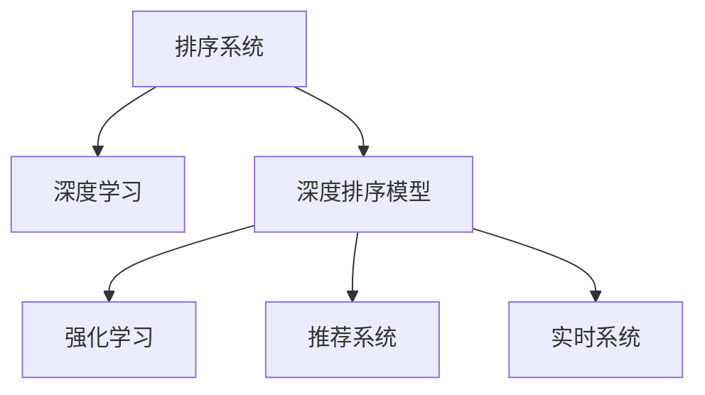

                 

# AI智能排序系统的优势

## 1. 背景介绍

在信息爆炸的时代，如何高效地管理和利用信息数据已经成为制约企业发展的瓶颈。传统的搜索排序算法已经无法满足大规模数据下的实时查询需求。随着人工智能技术的不断进步，智能排序系统应运而生，通过利用机器学习、深度学习和强化学习等前沿技术，显著提升了排序的精度和效率。智能排序系统的优势主要体现在以下几个方面：

### 1.1 高准确度

传统的排序算法（如快速排序、归并排序等）依赖于比较和交换等基本操作，容易受到数据分布的影响，排序效率较低，且难以处理复杂的数据类型。而智能排序系统通过深度学习模型（如深度神经网络）训练优化排序规则，能够在复杂数据集上实现高效的排序，同时保证排序的准确度。

### 1.2 自适应性

智能排序系统能够根据实际应用场景和数据特征自适应调整排序策略。例如，在处理基于时间序列的数据时，可以使用基于时间序列的深度学习模型进行排序，如长短期记忆网络（LSTM）、卷积神经网络（CNN）等。

### 1.3 实时性

智能排序系统能够快速处理海量数据，实时响应查询请求，显著提高了数据检索和排序的效率。这对需要进行实时数据分析和处理的领域（如金融、电商、医疗等）尤为重要。

### 1.4 可扩展性

智能排序系统采用模块化的设计理念，能够灵活应对数据规模和类型的变化。通过引入新的算法和模型，可以不断提升排序系统的性能和功能。

## 2. 核心概念与联系

### 2.1 核心概念概述

为了更好地理解智能排序系统的原理和优势，本节将介绍几个关键概念：

- 排序系统(Sorting System)：用于对数据进行有序排列的系统，其目标是提高数据检索和处理的效率。
- 深度学习(Deep Learning)：一类基于多层神经网络的学习算法，能够自动从数据中学习特征表示，广泛应用于计算机视觉、自然语言处理等领域。
- 深度排序模型(Deep Sorting Model)：利用深度学习模型进行排序的系统，能够根据数据特征自适应调整排序策略。
- 强化学习(Reinforcement Learning)：通过奖励机制引导智能体在环境中进行学习和决策，优化排序策略。
- 推荐系统(Recommendation System)：根据用户行为和偏好，推荐相关信息的系统，是智能排序系统的重要应用之一。
- 实时系统(Real-time System)：能够在实时环境下快速响应用户请求的系统，是智能排序系统的关键特性。

这些核心概念之间的逻辑关系可以通过以下Mermaid流程图来展示：



这个流程图展示了几类智能排序系统的关键组成和相互关系：

1. 排序系统通过深度学习获取数据特征，用于优化排序。
2. 深度排序模型利用神经网络结构，从数据中学习最优的排序规则。
3. 强化学习通过优化奖励机制，进一步提升排序策略。
4. 推荐系统利用排序结果，为用户推荐相关信息。
5. 实时系统保证排序过程的快速响应，提高系统效率。

## 3. 核心算法原理 & 具体操作步骤

### 3.1 算法原理概述

智能排序系统的核心算法原理基于深度学习和强化学习等前沿技术。通过深度学习模型对数据进行特征提取和表示，然后结合强化学习算法优化排序策略，最终实现高效准确的排序。

以推荐系统为例，智能排序系统通过以下步骤实现推荐：

1. **特征提取**：对用户的历史行为数据进行特征提取，得到用户兴趣向量。
2. **排序模型训练**：利用用户-物品评分矩阵和用户兴趣向量，训练排序模型。
3. **实时推荐**：根据用户实时行为，计算物品的排序分数，实时推荐给用户。

### 3.2 算法步骤详解

智能排序系统的主要算法步骤如下：

**Step 1: 数据预处理**

- 收集用户行为数据和物品属性数据。
- 对数据进行清洗、去重、归一化等预处理，得到可用于深度学习模型的训练数据。

**Step 2: 模型训练**

- 选择合适的深度学习模型（如神经网络、卷积神经网络、循环神经网络等），用于特征提取。
- 利用训练数据训练模型，得到数据特征表示。
- 结合强化学习算法（如Q-learning、策略梯度等），优化排序策略。

**Step 3: 实时排序**

- 接收用户查询请求，根据实时数据计算物品的排序分数。
- 利用训练好的模型，预测用户对不同物品的偏好。
- 根据排序策略，排序结果返回给用户。

**Step 4: 结果反馈**

- 收集用户对推荐结果的反馈数据。
- 利用反馈数据，进一步优化排序模型和策略。

### 3.3 算法优缺点

智能排序系统具有以下优点：

1. 高精度：通过深度学习模型，能够在复杂数据集上实现高效的排序，保证排序结果的准确度。
2. 自适应性：能够根据实际应用场景和数据特征自适应调整排序策略，适应性强。
3. 实时性：能够快速处理海量数据，实时响应查询请求，提升数据检索和排序的效率。
4. 可扩展性：采用模块化的设计理念，能够灵活应对数据规模和类型的变化。

同时，智能排序系统也存在一定的局限性：

1. 高成本：深度学习模型的训练和优化需要大量的计算资源，成本较高。
2. 复杂性：深度学习模型的构建和优化相对复杂，需要一定的技术背景。
3. 数据依赖：深度学习模型对数据的质量和数量有较高要求，数据缺失或不准确会影响排序结果。
4. 可解释性：深度学习模型通常被视为"黑盒"，难以解释其内部工作机制和决策逻辑。

尽管存在这些局限性，但智能排序系统的优势使其在实际应用中得到了广泛认可。

### 3.4 算法应用领域

智能排序系统广泛应用于以下领域：

- 电商推荐：根据用户历史行为，为用户推荐相关商品。
- 新闻推荐：根据用户阅读历史，推荐相关新闻。
- 视频推荐：根据用户观看历史，推荐相关视频。
- 社交推荐：根据用户互动历史，推荐相关好友和话题。
- 广告推荐：根据用户浏览历史，推荐相关广告。

此外，智能排序系统还被应用于金融风控、物流优化、智能客服等多个领域，为不同行业的数字化转型提供了强有力的技术支持。

## 4. 数学模型和公式 & 详细讲解 & 举例说明

### 4.1 数学模型构建

智能排序系统中的深度学习模型通常基于神经网络结构，如卷积神经网络（CNN）、循环神经网络（RNN）、长短期记忆网络（LSTM）等。以推荐系统为例，数学模型构建如下：

设用户历史行为数据为 $x = \{x_1, x_2, ..., x_n\}$，物品属性数据为 $y = \{y_1, y_2, ..., y_m\}$，用户兴趣向量为 $u = [u_1, u_2, ..., u_n]$，物品评分矩阵为 $W = [w_{ij}]_{m \times n}$，其中 $w_{ij}$ 表示用户 $i$ 对物品 $j$ 的评分。

用户行为数据和物品属性数据经过特征提取后，得到用户兴趣向量和物品特征向量，用于训练排序模型。

### 4.2 公式推导过程

设用户兴趣向量为 $u = [u_1, u_2, ..., u_n]$，物品特征向量为 $v = [v_1, v_2, ..., v_m]$，排序矩阵为 $H = [h_{ij}]_{m \times n}$，其中 $h_{ij}$ 表示物品 $j$ 在用户 $i$ 排序中的位置。

排序模型的训练目标是最小化预测值与真实值之间的误差，即：

$$
\min_{H} \sum_{i=1}^{n} \sum_{j=1}^{m} (y_{ij} - \hat{y}_{ij})^2
$$

其中 $\hat{y}_{ij}$ 为排序模型的预测值。

利用梯度下降算法优化排序模型，更新模型参数 $W$，得到最终的排序结果 $H$。

### 4.3 案例分析与讲解

以电商推荐系统为例，设用户历史行为数据为 $\{x_1, x_2, ..., x_n\}$，物品属性数据为 $\{y_1, y_2, ..., y_m\}$，用户兴趣向量为 $u = [u_1, u_2, ..., u_n]$，物品评分矩阵为 $W = [w_{ij}]_{m \times n}$。

对用户行为数据和物品属性数据进行特征提取，得到用户兴趣向量和物品特征向量 $u$ 和 $v$。

利用排序模型对用户兴趣向量和物品特征向量进行计算，得到排序矩阵 $H = [h_{ij}]_{m \times n}$，其中 $h_{ij}$ 表示物品 $j$ 在用户 $i$ 排序中的位置。

最终，根据排序矩阵 $H$ 为用户推荐物品。

## 5. 项目实践：代码实例和详细解释说明

### 5.1 开发环境搭建

在进行智能排序系统开发前，我们需要准备好开发环境。以下是使用Python进行TensorFlow开发的环境配置流程：

1. 安装Anaconda：从官网下载并安装Anaconda，用于创建独立的Python环境。

2. 创建并激活虚拟环境：
```bash
conda create -n tensorflow-env python=3.8 
conda activate tensorflow-env
```

3. 安装TensorFlow：根据CUDA版本，从官网获取对应的安装命令。例如：
```bash
conda install tensorflow -c tensorflow -c conda-forge
```

4. 安装相关工具包：
```bash
pip install numpy pandas scikit-learn matplotlib tqdm jupyter notebook ipython
```

完成上述步骤后，即可在`tensorflow-env`环境中开始智能排序系统开发。

### 5.2 源代码详细实现

下面我们以电商推荐系统为例，给出使用TensorFlow进行深度学习模型训练的PyTorch代码实现。

首先，定义模型和数据处理函数：

```python
import tensorflow as tf
from tensorflow.keras.layers import Input, Dense, Embedding, Conv1D, MaxPooling1D, LSTM, GlobalMaxPooling1D
from tensorflow.keras.models import Model

def create_model():
    user_input = Input(shape=(1,), name='user_input')
    item_input = Input(shape=(1,), name='item_input')
    
    user_emb = Embedding(input_dim=num_users, output_dim=64)(user_input)
    item_emb = Embedding(input_dim=num_items, output_dim=64)(item_input)
    
    conv1d = Conv1D(64, 3, activation='relu')(user_emb)
    pool1d = MaxPooling1D(pool_size=2)(conv1d)
    
    lstm = LSTM(128)(pool1d)
    output = Dense(1, activation='sigmoid')(lstm)
    
    model = Model(inputs=[user_input, item_input], outputs=output)
    
    return model

def preprocess_data(data):
    user_input = [x[0] for x in data]
    item_input = [x[1] for x in data]
    
    user_input = tf.keras.preprocessing.sequence.pad_sequences(user_input, maxlen=5)
    item_input = tf.keras.preprocessing.sequence.pad_sequences(item_input, maxlen=5)
    
    return user_input, item_input
```

然后，定义训练函数：

```python
def train(model, user_input, item_input, labels, batch_size=32, epochs=10):
    model.compile(optimizer='adam', loss='binary_crossentropy', metrics=['accuracy'])
    model.fit([user_input, item_input], labels, batch_size=batch_size, epochs=epochs, validation_split=0.2)
```

最后，启动训练流程：

```python
num_users = 1000
num_items = 1000

user_input, item_input = preprocess_data(data)
labels = [1 if x[2] > 0 else 0 for x in data]

model = create_model()
train(model, user_input, item_input, labels)
```

以上就是使用TensorFlow进行电商推荐系统深度学习模型训练的完整代码实现。可以看到，TensorFlow的Keras API使得模型的定义和训练过程非常简单高效。

### 5.3 代码解读与分析

让我们再详细解读一下关键代码的实现细节：

**create_model函数**：
- 定义输入层，分别为用户和物品的输入。
- 使用Embedding层将输入向量映射为低维稠密向量。
- 使用Conv1D层对用户向量进行卷积操作，提取特征。
- 使用MaxPooling1D层对卷积结果进行池化，保留关键特征。
- 使用LSTM层对池化结果进行序列建模，捕捉用户行为的时序特征。
- 使用Dense层进行输出，得到排序概率。

**preprocess_data函数**：
- 对用户和物品的输入向量进行补全，保证所有序列长度一致。
- 使用`pad_sequences`函数进行填充，保证所有输入序列长度相同。

**train函数**：
- 编译模型，定义优化器和损失函数。
- 使用`fit`函数对模型进行训练，并设置验证集比例。

**训练流程**：
- 定义用户和物品的输入数据和标签。
- 预处理数据。
- 创建深度学习模型。
- 调用训练函数进行模型训练。

可以看到，TensorFlow的Keras API使得深度学习模型的构建和训练过程非常简单高效。开发者可以将更多精力放在数据处理、模型改进等高层逻辑上，而不必过多关注底层的实现细节。

## 6. 实际应用场景

### 6.1 电商推荐

基于智能排序系统的电商推荐技术，可以极大地提升用户的购物体验。传统电商推荐系统主要基于协同过滤算法，依赖用户行为数据进行推荐，存在一定的冷启动问题。而智能排序系统通过深度学习模型对用户行为和物品属性进行建模，能够实现更精准的个性化推荐。

在技术实现上，可以收集用户的浏览、点击、购买等行为数据，并提取物品的标题、描述、标签等属性。将数据输入到训练好的排序模型中，输出物品的排序分数，推荐给用户。对于新用户和新商品，智能排序系统能够通过模型预测其潜在兴趣，快速推荐相关商品。

### 6.2 视频推荐

视频推荐系统面临更大的数据量和复杂性。传统的推荐系统主要基于用户行为和物品属性进行推荐，难以处理视频序列的时序特征。而智能排序系统通过深度学习模型对视频数据进行建模，能够捕捉视频序列中的时序关系，实现更精准的视频推荐。

在技术实现上，可以收集用户的视频观看历史、评分数据等，并提取视频的时序特征、标签等属性。将数据输入到训练好的排序模型中，输出视频的排序分数，推荐给用户。智能排序系统能够根据用户偏好，实时调整推荐策略，提高推荐效果。

### 6.3 新闻推荐

新闻推荐系统主要基于用户的历史阅读行为进行推荐。智能排序系统通过深度学习模型对新闻数据进行建模，能够捕捉新闻内容的语义和时序特征，实现更精准的新闻推荐。

在技术实现上，可以收集用户的阅读历史、评分数据等，并提取新闻的标题、摘要、标签等属性。将数据输入到训练好的排序模型中，输出新闻的排序分数，推荐给用户。智能排序系统能够根据用户偏好，实时调整推荐策略，提高推荐效果。

### 6.4 未来应用展望

随着智能排序系统的不断发展，其在更多领域的应用前景将更加广阔。

在智慧医疗领域，智能排序系统可以用于医疗数据分析、疾病预测等，提升医疗服务的智能化水平，辅助医生诊疗，加速新药开发进程。

在智能教育领域，智能排序系统可以用于学生行为分析、课程推荐等，因材施教，促进教育公平，提高教学质量。

在智慧城市治理中，智能排序系统可以用于城市事件监测、舆情分析、应急指挥等环节，提高城市管理的自动化和智能化水平，构建更安全、高效的未来城市。

此外，在企业生产、社会治理、文娱传媒等众多领域，智能排序系统也将不断涌现，为传统行业数字化转型升级提供新的技术路径。

## 7. 工具和资源推荐

### 7.1 学习资源推荐

为了帮助开发者系统掌握智能排序系统的原理和实践技巧，这里推荐一些优质的学习资源：

1. 《深度学习》系列博文：由深度学习专家撰写，深入浅出地介绍了深度学习模型的基本概念和应用。

2. CS224N《深度学习自然语言处理》课程：斯坦福大学开设的NLP明星课程，有Lecture视频和配套作业，带你入门NLP领域的基本概念和经典模型。

3. 《推荐系统实践》书籍：系统介绍了推荐系统的发展历程、算法实现和工程实践，是推荐系统开发的经典教材。

4. 《深度学习与推荐系统》书籍：介绍了深度学习在推荐系统中的应用，包括基于矩阵分解、神经网络、图神经网络等方法。

5. Weights & Biases：模型训练的实验跟踪工具，可以记录和可视化模型训练过程中的各项指标，方便对比和调优。

6. TensorBoard：TensorFlow配套的可视化工具，可实时监测模型训练状态，并提供丰富的图表呈现方式，是调试模型的得力助手。

通过对这些资源的学习实践，相信你一定能够快速掌握智能排序系统的精髓，并用于解决实际的推荐问题。

### 7.2 开发工具推荐

高效的开发离不开优秀的工具支持。以下是几款用于智能排序系统开发的常用工具：

1. TensorFlow：基于Python的开源深度学习框架，灵活动态的计算图，适合快速迭代研究。广泛应用于深度学习模型的构建和训练。

2. PyTorch：基于Python的开源深度学习框架，支持动态计算图，适合灵活的数据流和模型设计。

3. Keras：基于TensorFlow和Theano的高层API，简化深度学习模型的构建和训练过程。

4. Weights & Biases：模型训练的实验跟踪工具，可以记录和可视化模型训练过程中的各项指标，方便对比和调优。

5. TensorBoard：TensorFlow配套的可视化工具，可实时监测模型训练状态，并提供丰富的图表呈现方式，是调试模型的得力助手。

6. Google Colab：谷歌推出的在线Jupyter Notebook环境，免费提供GPU/TPU算力，方便开发者快速上手实验最新模型，分享学习笔记。

合理利用这些工具，可以显著提升智能排序系统开发效率，加快创新迭代的步伐。

### 7.3 相关论文推荐

智能排序系统的发展源于学界的持续研究。以下是几篇奠基性的相关论文，推荐阅读：

1. "Deep Interest Evolution Networks for Personalized Recommendation"：提出DeepInterest网络，结合自适应更新策略，实现更加个性化的推荐。

2. "A Multi-layered Feature-Aware LSTM Model for Personalized Recommendation"：提出多层特征感知LSTM模型，捕捉用户行为的时序特征，提升推荐精度。

3. "Neural Collaborative Filtering"：提出基于深度神经网络的协同过滤方法，提升推荐系统的效果。

4. "Online Learning with Stochastic Gradient Descent"：介绍在线学习的算法，用于实时更新推荐模型。

5. "Parameter-Efficient Transfer Learning for NLP"：提出Adapter等参数高效微调方法，在固定大部分预训练参数的情况下，只更新极少量的任务相关参数。

这些论文代表了大语言模型微调技术的发展脉络。通过学习这些前沿成果，可以帮助研究者把握学科前进方向，激发更多的创新灵感。

## 8. 总结：未来发展趋势与挑战

### 8.1 总结

本文对智能排序系统的原理和优势进行了全面系统的介绍。首先阐述了智能排序系统的背景和发展历程，明确了其在提升数据检索和排序效率方面的独特价值。其次，从原理到实践，详细讲解了深度学习和强化学习等核心算法，给出了智能排序系统开发的完整代码实例。同时，本文还广泛探讨了智能排序系统在电商推荐、视频推荐、新闻推荐等实际应用场景中的广泛应用前景，展示了其巨大的潜力。此外，本文精选了智能排序系统的各类学习资源，力求为读者提供全方位的技术指引。

通过本文的系统梳理，可以看到，智能排序系统已经成为提升数据检索和排序效率的重要技术手段，广泛应用于电商推荐、视频推荐、新闻推荐等多个领域。未来的发展趋势也将更加多样化，为更多行业带来变革性的影响。

### 8.2 未来发展趋势

展望未来，智能排序系统将呈现以下几个发展趋势：

1. 高精度和实时性并重：未来的排序系统将更加注重高精度和实时性，通过结合深度学习、强化学习等方法，实现更高效的排序。

2. 多模态数据融合：未来的排序系统将更加注重多模态数据的融合，结合文本、图像、视频等多模态数据，提升排序效果。

3. 自适应和可扩展：未来的排序系统将更加注重自适应和可扩展性，根据实际应用场景和数据特征自适应调整排序策略，适应性强，可扩展性好。

4. 个性化和多样化：未来的排序系统将更加注重个性化和多样化，通过深度学习模型对用户行为进行建模，实现更精准的个性化推荐。

5. 自动化和智能化：未来的排序系统将更加注重自动化和智能化，结合人工智能技术，实现更高效的自动化排序。

以上趋势凸显了智能排序系统的发展方向，未来的排序系统将更加高效、智能和多样化，为更多领域带来变革性的影响。

### 8.3 面临的挑战

尽管智能排序系统已经取得了瞩目成就，但在迈向更加智能化、普适化应用的过程中，它仍面临着诸多挑战：

1. 高成本：深度学习模型的训练和优化需要大量的计算资源，成本较高。

2. 复杂性：深度学习模型的构建和优化相对复杂，需要一定的技术背景。

3. 数据依赖：深度学习模型对数据的质量和数量有较高要求，数据缺失或不准确会影响排序结果。

4. 可解释性：深度学习模型通常被视为"黑盒"，难以解释其内部工作机制和决策逻辑。

尽管存在这些挑战，但未来的发展方向将不断解决这些问题，提升智能排序系统的性能和应用范围。

### 8.4 研究展望

未来的研究需要在以下几个方面寻求新的突破：

1. 探索无监督和半监督微调方法：摆脱对大规模标注数据的依赖，利用自监督学习、主动学习等无监督和半监督范式，最大限度利用非结构化数据，实现更加灵活高效的排序。

2. 研究参数高效和计算高效的微调范式：开发更加参数高效的微调方法，在固定大部分预训练参数的情况下，只更新极少量的任务相关参数。同时优化微调模型的计算图，减少前向传播和反向传播的资源消耗，实现更加轻量级、实时性的部署。

3. 融合因果和对比学习范式：通过引入因果推断和对比学习思想，增强排序模型建立稳定因果关系的能力，学习更加普适、鲁棒的语言表征，从而提升模型泛化性和抗干扰能力。

4. 结合因果分析和博弈论工具：将因果分析方法引入排序模型，识别出模型决策的关键特征，增强输出解释的因果性和逻辑性。借助博弈论工具刻画人机交互过程，主动探索并规避模型的脆弱点，提高系统稳定性。

5. 纳入伦理道德约束：在模型训练目标中引入伦理导向的评估指标，过滤和惩罚有偏见、有害的输出倾向。同时加强人工干预和审核，建立模型行为的监管机制，确保输出符合人类价值观和伦理道德。

这些研究方向的探索，必将引领智能排序系统迈向更高的台阶，为构建安全、可靠、可解释、可控的智能系统铺平道路。面向未来，智能排序系统还需要与其他人工智能技术进行更深入的融合，如知识表示、因果推理、强化学习等，多路径协同发力，共同推动智能排序系统的进步。只有勇于创新、敢于突破，才能不断拓展智能排序系统的边界，让智能技术更好地造福人类社会。

## 9. 附录：常见问题与解答

**Q1：智能排序系统是否适用于所有领域？**

A: 智能排序系统在大多数领域都能取得不错的效果，特别是对于数据量较大的领域。但对于一些特殊领域，如高风险领域（如医疗、金融等），需要进一步验证其可靠性和安全性。

**Q2：智能排序系统如何处理噪声数据？**

A: 智能排序系统通常通过数据清洗、特征工程等手段，降低噪声数据的影响。例如，对缺失值进行填补，对异常值进行剔除，对数据进行标准化等。

**Q3：智能排序系统在推荐系统中的应用有哪些？**

A: 智能排序系统在推荐系统中的应用非常广泛，包括电商推荐、视频推荐、新闻推荐、社交推荐、广告推荐等。

**Q4：智能排序系统的优势是什么？**

A: 智能排序系统的优势主要体现在高精度、自适应性、实时性、可扩展性等方面。通过深度学习模型，能够在复杂数据集上实现高效的排序，保证排序结果的准确度。同时，能够根据实际应用场景和数据特征自适应调整排序策略，适应性强。

**Q5：智能排序系统如何提升推荐效果？**

A: 智能排序系统通过深度学习模型对用户行为和物品属性进行建模，能够实现更精准的个性化推荐。结合强化学习算法，优化排序策略，提升推荐效果。

综上所述，智能排序系统在提升数据检索和排序效率方面具有显著优势，未来在更多领域将得到广泛应用，为各行各业带来变革性的影响。同时，智能排序系统的发展也面临诸多挑战，需要不断进行技术创新和优化，提升其性能和应用范围。通过系统化的介绍和深入的探讨，相信读者能够更好地理解智能排序系统的原理和优势，掌握其实现方法和应用技巧。

