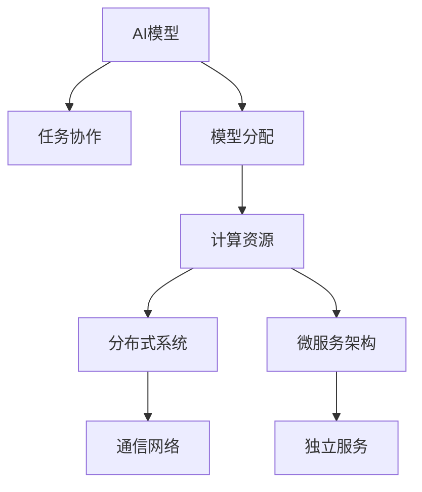

                 

## 1. 背景介绍

在当今的AI应用中，模型协作与分配已经成为了一个热门话题。无论是数据中心、云计算平台还是企业内部的微服务架构，如何有效分配计算资源和协调不同模型的工作，都是需要解决的重要问题。模型协作与分配的目标是最大化利用计算资源，提高模型处理效率，同时确保模型之间的协作性，避免计算冗余和资源浪费。

本文将详细探讨AI模型的任务协作与分配，从理论基础到实践应用，系统地介绍如何构建高效的模型协作体系，并在不同场景下优化模型性能。通过这篇文章，读者将深入理解模型协作与分配的原理、方法和实际应用，以及未来可能面临的挑战和机会。

## 2. 核心概念与联系

### 2.1 核心概念概述

在探讨AI模型的任务协作与分配之前，我们先简要介绍几个核心概念：

- **AI模型**：指用于解决特定问题的机器学习模型，包括深度学习、传统机器学习等。
- **任务协作**：指多个模型之间通过通信和信息共享，共同完成复杂的任务。
- **模型分配**：指在多个模型中分配计算资源，确保每个模型都能高效运行。
- **计算资源**：指用于模型训练和推理的计算硬件资源，包括CPU、GPU、TPU等。
- **分布式系统**：指多个计算节点通过网络连接，共同处理任务的系统。
- **微服务架构**：指将大系统分解为多个小服务的架构设计，每个服务独立运行，互不干扰。

这些概念之间的关系可以通过以下Mermaid流程图来展示：



这个流程图展示了一些关键概念之间的逻辑关系：

1. AI模型是任务协作和模型分配的基础。
2. 任务协作和模型分配通过通信网络实现。
3. 计算资源是任务协作和模型分配的执行环境。
4. 分布式系统和微服务架构为任务协作和模型分配提供了不同的实现方式。

## 3. 核心算法原理 & 具体操作步骤

### 3.1 算法原理概述

AI模型的任务协作与分配，本质上是一个多智能体系统的问题。其核心思想是通过合理分配计算资源，使得多个模型能够高效协作，共同完成更复杂的任务。任务协作和模型分配的算法通常基于以下几个原理：

- **任务分解**：将复杂任务分解为多个子任务，由不同的模型处理。
- **负载均衡**：根据模型的计算需求，合理分配计算资源，避免计算资源浪费。
- **通信协议**：通过通信协议，确保模型之间能够高效地交换信息，共同协作完成任务。
- **容错机制**：在模型之间建立容错机制，确保系统能够在单个模型失败的情况下继续运行。

### 3.2 算法步骤详解

基于以上原理，AI模型的任务协作与分配可以按照以下步骤进行：

**Step 1: 任务定义与模型选择**

- 定义需要协作完成的任务，明确任务的目标和需求。
- 根据任务需求，选择合适的AI模型。

**Step 2: 任务分解与模型分配**

- 将任务分解为多个子任务，每个子任务由一个或多个模型处理。
- 根据模型的计算需求，合理分配计算资源，确保每个模型能够高效运行。

**Step 3: 通信协议设计与实施**

- 设计模型之间的通信协议，确保模型之间能够高效地交换信息。
- 实施通信协议，实现模型之间的信息交换。

**Step 4: 容错机制建立**

- 建立容错机制，确保系统能够在单个模型失败的情况下继续运行。
- 在模型之间建立冗余机制，避免单一模型故障导致系统瘫痪。

**Step 5: 监控与优化**

- 实时监控系统的运行状态，及时发现和解决问题。
- 根据系统运行状态和任务需求，优化任务协作和模型分配策略。

### 3.3 算法优缺点

AI模型的任务协作与分配有以下优点：

1. 提高资源利用率。通过合理分配计算资源，可以最大化利用硬件资源，提高计算效率。
2. 提升任务处理能力。多个模型共同协作，可以处理更复杂的任务，提高任务处理能力。
3. 增强系统的容错性。通过建立容错机制，可以在模型失败的情况下，保证系统的稳定性。

同时，这种算法也存在一些缺点：

1. 设计和实现复杂。需要设计复杂的通信协议和容错机制，实现起来比较复杂。
2. 可能存在通信开销。多个模型之间通信需要耗费时间和带宽，可能会影响系统性能。
3. 需要解决模型之间的协同问题。模型之间需要协同工作，可能存在信息不一致和冲突。

### 3.4 算法应用领域

AI模型的任务协作与分配在多个领域都有广泛应用，包括但不限于：

- **数据中心**：多个模型共同处理大规模数据集，提升计算效率。
- **云计算平台**：利用多个模型处理不同任务，提高平台的多样性和灵活性。
- **企业微服务架构**：将不同功能的模型部署为独立的服务，提升系统的可维护性和可扩展性。
- **分布式机器学习**：多个模型在分布式系统中协同工作，加速模型训练和推理。
- **边缘计算**：在边缘设备上部署多个模型，减少数据传输，提高计算效率。

## 4. 数学模型和公式 & 详细讲解

### 4.1 数学模型构建

在AI模型的任务协作与分配中，数学模型的构建是至关重要的。我们可以使用数学模型来描述任务的分解、模型的分配和容错机制的建立。以下是一个简化的数学模型，用于描述任务协作与分配的原理：

设任务 $T$ 可以分解为 $n$ 个子任务 $T_1, T_2, \ldots, T_n$，每个子任务 $T_i$ 由模型 $M_i$ 处理。模型的计算需求为 $R_i$，分配的计算资源为 $R$，每个模型 $M_i$ 的计算资源需求为 $R_i$。任务协作与分配的目标是最小化计算资源分配误差 $\epsilon$，即：

$$
\min_{R_1, R_2, \ldots, R_n} \sum_{i=1}^n (R_i - R) \epsilon_i
$$

其中 $\epsilon_i$ 表示模型 $M_i$ 的计算资源分配误差。

### 4.2 公式推导过程

在上述数学模型中，我们需要使用优化算法来求解计算资源分配误差 $\epsilon$ 的最小值。常用的优化算法包括线性规划、整数规划等。以下是使用线性规划求解计算资源分配误差的步骤：

1. 将计算资源分配误差 $\epsilon_i$ 表示为模型 $M_i$ 的计算资源需求 $R_i$ 和分配的计算资源 $R$ 的函数：

$$
\epsilon_i = R_i - R
$$

2. 将任务协作与分配的目标转化为线性规划问题：

$$
\min_{R_1, R_2, \ldots, R_n} \sum_{i=1}^n (R_i - R)
$$

3. 使用线性规划求解上述问题，得到最优的计算资源分配方案 $R_1^*, R_2^*, \ldots, R_n^*$。

4. 根据最优的计算资源分配方案，计算每个模型的计算资源分配误差 $\epsilon_i^*$。

### 4.3 案例分析与讲解

以一个简单的分布式系统为例，说明如何应用数学模型来优化任务协作与分配：

假设有一个分布式系统，需要同时处理两个任务 $T_1$ 和 $T_2$。任务 $T_1$ 由模型 $M_1$ 处理，任务 $T_2$ 由模型 $M_2$ 处理。模型 $M_1$ 的计算资源需求为 $R_1 = 2$，模型 $M_2$ 的计算资源需求为 $R_2 = 3$。分配的计算资源为 $R = 5$。

根据上述数学模型，我们可以使用线性规划求解最优的计算资源分配方案 $R_1^*$ 和 $R_2^*$：

1. 构建线性规划模型：

$$
\min_{R_1, R_2} \sum_{i=1}^2 (R_i - 5)
$$

2. 求解上述线性规划问题，得到最优的计算资源分配方案 $R_1^* = 2, R_2^* = 3$。

3. 根据最优的计算资源分配方案，计算每个模型的计算资源分配误差 $\epsilon_i^*$：

$$
\epsilon_1^* = 2 - 5 = -3
$$
$$
\epsilon_2^* = 3 - 5 = -2
$$

在实际应用中，我们可以根据计算资源分配误差 $\epsilon_i^*$，调整模型的计算资源分配策略，使得每个模型都能高效地运行。

## 5. 项目实践：代码实例和详细解释说明

### 5.1 开发环境搭建

在进行任务协作与分配的开发实践之前，我们需要准备好开发环境。以下是使用Python进行任务协作与分配的开发环境配置流程：

1. 安装Anaconda：从官网下载并安装Anaconda，用于创建独立的Python环境。

2. 创建并激活虚拟环境：

```bash
conda create -n task_allocation python=3.8
conda activate task_allocation
```

3. 安装PyTorch：根据CUDA版本，从官网获取对应的安装命令。例如：

```bash
conda install pytorch torchvision torchaudio cudatoolkit=11.1 -c pytorch -c conda-forge
```

4. 安装TensorFlow：由Google主导开发的开源深度学习框架，生产部署方便，适合大规模工程应用。

5. 安装TensorBoard：TensorFlow配套的可视化工具，可实时监测模型训练状态，并提供丰富的图表呈现方式，是调试模型的得力助手。

6. 安装HuggingFace：提供多种预训练语言模型，支持任务的微调，是进行任务协作与分配的常用工具。

7. 安装Dask：用于分布式计算，可以在多个计算节点上并行处理任务，提高计算效率。

完成上述步骤后，即可在`task_allocation`环境中开始任务协作与分配的开发实践。

### 5.2 源代码详细实现

下面我们以分布式任务处理为例，给出使用PyTorch和Dask进行任务协作与分配的代码实现。

首先，定义分布式系统中的任务：

```python
from dask.distributed import Client, Task
import dask.array as da
import dask.dataframe as dd
import dask.delayed

# 定义任务函数
def task_function(data):
    # 在这里处理数据，返回处理结果
    return result

# 创建Dask客户端，连接多个计算节点
client = Client(n_workers=4)

# 定义任务数据
data = dd.from_pandas(df, npartitions=4)

# 定义任务，并提交到Dask系统
task = dask.delayed(task_function)(da.from_array(data, chunks=(1, 1)))
result = client.submit(task)
```

然后，使用Dask的管道机制，将任务数据传递给多个模型进行处理：

```python
# 定义模型
model1 = MyModel1()
model2 = MyModel2()

# 将任务数据传递给模型1和模型2进行处理
result1 = model1(result)
result2 = model2(result)

# 将模型1和模型2的结果进行合并
final_result = result1 + result2
```

最后，将最终结果传递给客户端，供用户使用：

```python
# 将最终结果传递给客户端
final_result = client.submit(final_result)

# 从客户端获取最终结果
final_result = client.gather(final_result)
```

以上就是使用PyTorch和Dask进行分布式任务协作与分配的完整代码实现。可以看到，Dask提供了一个高效的分布式计算框架，可以将任务数据在多个计算节点上并行处理，提高计算效率。

### 5.3 代码解读与分析

让我们再详细解读一下关键代码的实现细节：

**任务定义**：
- 首先定义一个任务函数 `task_function`，用于处理数据并返回处理结果。

**Dask客户端创建**：
- 使用 `dask.distributed.Client` 创建一个Dask客户端，连接多个计算节点，以支持分布式计算。

**任务数据定义**：
- 使用 `dask.dataframe.from_pandas` 将数据集转换为Dask数据帧，并将数据集分为多个分片，以支持并行处理。

**任务提交和结果获取**：
- 使用 `dask.delayed` 将任务函数 `task_function` 提交到Dask系统，并将结果存储在Dask任务中。
- 使用 `client.submit` 提交Dask任务，并使用 `client.gather` 从客户端获取最终结果。

可以看到，通过使用Dask，我们可以将任务数据在多个计算节点上并行处理，从而提高计算效率。

## 6. 实际应用场景

### 6.1 智能客服系统

基于任务协作与分配的智能客服系统，可以应用于多个客户咨询场景，提高客服效率和用户体验。

在智能客服系统中，多个模型可以共同处理客户的咨询请求，提升系统的响应速度和处理能力。例如，可以使用一个模型进行意图识别，另一个模型进行问题分类，最终将分类结果传递给相应的处理模型，生成个性化的回答。

### 6.2 金融舆情监测

金融舆情监测系统需要实时处理大量的市场数据和新闻信息，以便快速捕捉市场动态。通过任务协作与分配，可以有效地处理这些大数据，提高系统的实时性。

在金融舆情监测系统中，可以使用多个模型共同处理新闻信息和市场数据，提升系统的处理能力。例如，可以使用一个模型进行情感分析，另一个模型进行实体识别，最终将分析结果传递给决策模型，生成交易策略。

### 6.3 个性化推荐系统

个性化推荐系统需要处理海量的用户行为数据和物品信息，以便为用户推荐个性化的商品。通过任务协作与分配，可以高效地处理这些大数据，提高系统的推荐精度和速度。

在个性化推荐系统中，可以使用多个模型共同处理用户行为数据和物品信息，提升系统的推荐精度。例如，可以使用一个模型进行用户行为分析，另一个模型进行物品相似度计算，最终将分析结果传递给推荐模型，生成个性化的推荐结果。

### 6.4 未来应用展望

随着任务协作与分配技术的发展，未来将在更多领域得到应用，为传统行业带来变革性影响。

在智慧医疗领域，基于任务协作与分配的诊断系统，可以高效地处理海量的医学数据，提升诊断的准确性和速度。

在智能教育领域，基于任务协作与分配的智能助教系统，可以高效地处理学生作业和考试，提升教学质量。

在智慧城市治理中，基于任务协作与分配的城市管理系统，可以高效地处理城市数据，提升城市管理的自动化和智能化水平。

此外，在企业生产、社会治理、文娱传媒等众多领域，基于任务协作与分配的AI系统也将不断涌现，为经济社会发展注入新的动力。

## 7. 工具和资源推荐

### 7.1 学习资源推荐

为了帮助开发者系统掌握任务协作与分配的理论基础和实践技巧，这里推荐一些优质的学习资源：

1. 《分布式系统》系列书籍：深入浅出地介绍了分布式系统的基础知识，包括任务协作与分配的原理和实现。
2. 《机器学习实战》系列书籍：提供了大量的任务协作与分配实践案例，适合学习者动手实践。
3. 《深度学习基础》课程：斯坦福大学开设的深度学习课程，涵盖任务协作与分配的相关内容。
4. 《分布式机器学习》课程：由亚马逊AWS提供的机器学习课程，涵盖分布式任务协作与分配的实现方法。
5. 《Dask官方文档》：Dask的官方文档，提供了详细的API参考和示例代码，适合学习者快速上手。

通过对这些资源的学习实践，相信你一定能够快速掌握任务协作与分配的精髓，并用于解决实际的AI问题。

### 7.2 开发工具推荐

高效的开发离不开优秀的工具支持。以下是几款用于任务协作与分配开发的常用工具：

1. PyTorch：基于Python的开源深度学习框架，灵活动态的计算图，适合快速迭代研究。

2. TensorFlow：由Google主导开发的开源深度学习框架，生产部署方便，适合大规模工程应用。

3. Dask：用于分布式计算，可以在多个计算节点上并行处理任务，提高计算效率。

4. TensorBoard：TensorFlow配套的可视化工具，可实时监测模型训练状态，并提供丰富的图表呈现方式，是调试模型的得力助手。

5. Jupyter Notebook：交互式编程环境，适合学习者进行任务协作与分配的实验和开发。

6. Weights & Biases：模型训练的实验跟踪工具，可以记录和可视化模型训练过程中的各项指标，方便对比和调优。

合理利用这些工具，可以显著提升任务协作与分配的开发效率，加快创新迭代的步伐。

### 7.3 相关论文推荐

任务协作与分配的研究源于学界的持续研究。以下是几篇奠基性的相关论文，推荐阅读：

1. MapReduce: Simplified Data Processing on Large Clusters：提出了MapReduce计算模型，奠定了分布式计算的基础。

2. Hadoop: The Road to Large-Scale Data Processing：介绍了Hadoop分布式计算框架，提供了一种高效的分布式数据处理方式。

3. Storm: Distributed Realtime Computation System：提出了Storm分布式实时计算系统，适合处理大规模实时数据。

4. Apex：Amazon提供的分布式机器学习框架，支持大规模模型的训练和推理。

5. Ray：分布式计算框架，支持多种编程语言，适合大规模系统的开发。

这些论文代表了大规模分布式系统发展的脉络，通过学习这些前沿成果，可以帮助研究者把握学科前进方向，激发更多的创新灵感。

## 8. 总结：未来发展趋势与挑战

### 8.1 总结

本文对AI模型的任务协作与分配方法进行了全面系统的介绍。首先阐述了任务协作与分配的研究背景和意义，明确了任务协作与分配在提升系统效率和性能方面的独特价值。其次，从原理到实践，详细讲解了任务协作与分配的数学模型和关键步骤，给出了任务协作与分配任务开发的完整代码实例。同时，本文还广泛探讨了任务协作与分配方法在多个行业领域的应用前景，展示了任务协作与分配范式的巨大潜力。最后，本文精选了任务协作与分配技术的各类学习资源，力求为读者提供全方位的技术指引。

通过本文的系统梳理，可以看到，任务协作与分配在AI系统构建中扮演了重要的角色，极大地提升了系统的计算能力和处理效率。未来，伴随任务协作与分配技术的持续演进，相信AI系统将能够处理更复杂的任务，实现更高效、更智能的运行。

### 8.2 未来发展趋势

展望未来，任务协作与分配技术将呈现以下几个发展趋势：

1. 自动化程度提升。未来的任务协作与分配系统将具备更强的自适应能力，能够根据任务需求和资源状况，自动调整计算资源分配策略。

2. 边缘计算与云服务的结合。任务协作与分配将在边缘计算和云服务中得到广泛应用，实现计算资源的优化利用。

3. 分布式计算框架的集成。未来将出现更多的分布式计算框架，如Apex、Ray等，为任务协作与分配提供更丰富的选择。

4. 智能调度和优化。未来的任务协作与分配系统将具备智能调度和优化能力，能够根据任务特征和系统状态，动态调整计算资源分配和任务调度策略。

5. 跨平台兼容性增强。未来的任务协作与分配系统将具备更强的跨平台兼容性，支持多种计算平台和编程语言。

以上趋势凸显了任务协作与分配技术的广阔前景。这些方向的探索发展，必将进一步提升AI系统的性能和应用范围，为经济社会发展注入新的动力。

### 8.3 面临的挑战

尽管任务协作与分配技术已经取得了瞩目成就，但在迈向更加智能化、普适化应用的过程中，它仍面临诸多挑战：

1. 资源分配的优化。如何优化计算资源分配策略，最大化利用计算资源，仍是研究的重要方向。

2. 模型之间的协同问题。如何设计高效的通信协议，确保模型之间能够高效地交换信息，仍是一个技术难题。

3. 系统的可扩展性。如何在大规模系统中实现任务协作与分配，保证系统的稳定性和效率，仍需要更多的优化手段。

4. 数据隐私和安全。如何在任务协作与分配过程中保护数据隐私和安全，避免数据泄露和滥用，仍是一个亟待解决的问题。

5. 算法的复杂度。如何设计简单高效的算法，避免复杂的数学模型和复杂的实现，仍是一个需要不断探索的问题。

6. 模型的解释性。如何提高任务协作与分配模型的可解释性，使其更加透明和可信，仍是一个重要的研究方向。

这些挑战凸显了任务协作与分配技术在实际应用中的复杂性，但正是这些挑战，推动了任务协作与分配技术的发展和进步。相信随着研究者的不懈探索，这些挑战终将一一被克服，任务协作与分配技术将迎来更加广阔的应用前景。

### 8.4 研究展望

未来，任务协作与分配技术的研究将朝着以下几个方向展开：

1. 跨学科研究。任务协作与分配技术将与更多学科进行交叉，如计算机科学、运筹学、信息科学等，以推动技术的全面发展。

2. 多模态数据融合。未来的任务协作与分配系统将支持多模态数据的融合，如文本、图像、语音等，实现更全面的信息处理和分析。

3. 实时系统设计。未来的任务协作与分配系统将更加注重实时性，支持高并发和大流量的处理，提升系统的响应速度和处理能力。

4. 人工智能伦理。未来的任务协作与分配系统将更加注重伦理和道德，避免偏见和歧视，确保系统的公平性和公正性。

5. 人机协同。未来的任务协作与分配系统将更加注重人机协同，实现人机协作的智能化，提升系统的用户友好性和用户体验。

这些研究方向将进一步推动任务协作与分配技术的发展和进步，为构建更高效、更智能、更可靠的AI系统提供更多可能。相信随着技术的不断创新和优化，任务协作与分配技术将带来更加丰富的应用场景和更加广泛的社会价值。

## 9. 附录：常见问题与解答

**Q1：任务协作与分配是否适用于所有AI系统？**

A: 任务协作与分配在大多数AI系统中都能取得不错的效果，特别是对于需要并行处理的任务。但对于一些特定领域的任务，如医疗、法律等，仅依靠任务协作与分配可能难以适应。此时需要在特定领域语料上进一步预训练，再进行微调，才能获得理想效果。

**Q2：任务协作与分配如何应对多模态数据的处理？**

A: 多模态数据的处理是任务协作与分配面临的一个挑战。为了应对多模态数据的处理，可以设计多模态的任务协作与分配框架，将不同模态的数据转换为统一的格式，再进行任务分配和协作。例如，可以使用融合层将文本和图像数据进行融合，生成统一的特征向量，然后通过任务协作与分配框架进行优化。

**Q3：任务协作与分配中的通信开销如何降低？**

A: 任务协作与分配中的通信开销是一个重要问题。为了降低通信开销，可以采用分布式计算框架，如Dask，在多个计算节点上并行处理数据，减少通信的频率。同时，可以使用压缩技术对数据进行压缩，减少通信的数据量。

**Q4：任务协作与分配中的容错机制如何设计？**

A: 容错机制是任务协作与分配中的一个重要环节。为了设计高效的容错机制，可以采用冗余机制，将任务数据和计算结果进行冗余存储，避免单一节点故障导致系统瘫痪。同时，可以使用分布式共识算法，如Paxos、Raft等，确保系统的一致性和可靠性。

**Q5：任务协作与分配中的模型优化如何实现？**

A: 模型优化是任务协作与分配中的关键问题。为了实现高效的模型优化，可以采用分布式优化算法，如SGD、Adam等，并行更新模型参数。同时，可以使用自动化调参工具，如Hyperopt、Optuna等，自动寻找最优的模型参数。

以上是关于任务协作与分配的全面介绍，希望读者能够通过本文深入理解任务协作与分配的原理和实践，并在实际应用中灵活应用。相信随着任务协作与分配技术的不断发展和优化，AI系统将能够处理更加复杂和多样的任务，实现更高效、更智能的运行。

