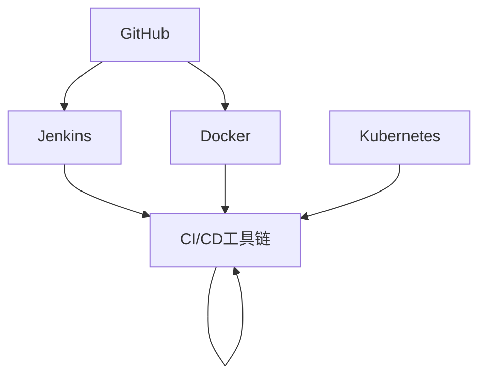
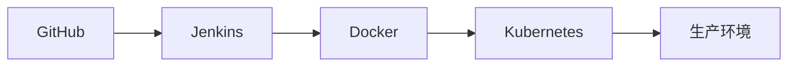

                 

# AI模型的持续集成与部署：Lepton AI的CI/CD实践

> 关键词：持续集成(CI)，持续部署(CD)，Lepton AI，DevOps，GitHub，Jenkins，Docker，Kubernetes，CI/CD工具链

## 1. 背景介绍

### 1.1 问题由来

随着人工智能(AI)技术的迅猛发展，模型训练和部署已经成为了AI开发工作的核心环节。传统的模型开发流程，从数据准备、模型训练、评估到部署，不仅耗时耗力，还容易产生漏洞和错误，导致项目延误和资源浪费。

为了应对这些挑战，持续集成与持续部署（CI/CD）应运而生。CI/CD是一种自动化软件交付流程，通过将模型的开发、测试、部署等各个环节整合到统一流水线上，提升开发效率和项目稳定性。

在AI领域，CI/CD不仅适用于模型训练流程，还涉及模型版本管理、模型评估、部署上线等多个环节。通过集成多种工具和技术，构建全面的自动化工作流，CI/CD为AI模型的开发和应用提供了强有力的支持。

### 1.2 问题核心关键点

CI/CD的核心在于实现模型开发的自动化，即：

- **持续集成**：在模型代码变更后，自动化执行测试和构建，确保模型质量。
- **持续部署**：在模型测试通过后，自动化部署模型到生产环境，确保模型稳定运行。

实现这些目标需要：
- 集成版本控制系统（如Git），跟踪代码变更。
- 集成构建工具（如Docker、Jenkins），自动构建模型。
- 集成测试工具（如TensorFlow、PyTorch），自动化测试模型。
- 集成部署工具（如Kubernetes），自动化部署模型。

本文将重点介绍Lepton AI在CI/CD实践中的经验和方法，帮助开发者提升模型开发和部署的效率和稳定性。

## 2. 核心概念与联系

### 2.1 核心概念概述

为更好地理解Lepton AI的CI/CD实践，本节将介绍几个关键概念：

- **持续集成(CI)**：通过自动化构建、测试流程，确保每次代码变更后模型质量的一致性。
- **持续部署(CD)**：通过自动化部署流程，确保模型快速、稳定地上线。
- **DevOps**：将软件开发和运维工作整合，提升开发和运维效率。
- **GitHub**：流行的代码托管平台，支持版本控制、代码审查、项目管理等功能。
- **Jenkins**：开源的自动化服务器，支持多种构建、测试、部署工作。
- **Docker**：容器化技术，确保模型在不同环境下的稳定运行。
- **Kubernetes**：容器编排工具，支持模型的自动化部署和管理。
- **CI/CD工具链**：将上述工具和技术整合并组成全流程自动化工作流。

这些核心概念之间的逻辑关系可以通过以下Mermaid流程图来展示：



这个流程图展示了大语言模型的核心概念及其之间的关系：

1. 开发者在GitHub上提交代码变更，触发Jenkins自动化构建和测试。
2. 构建工具Docker负责将模型打包为容器镜像，测试工具Jenkins负责自动化测试。
3. Kubernetes作为容器编排工具，负责自动化部署模型到生产环境。
4. CI/CD工具链将上述步骤整合成一个持续的自动化工作流，提升开发效率和项目稳定性。

这些概念共同构成了Lepton AI的CI/CD实践，使得模型开发和部署过程更加高效、稳定。

## 3. 核心算法原理 & 具体操作步骤
### 3.1 算法原理概述

Lepton AI的CI/CD实践基于DevOps理念，通过自动化构建、测试和部署流程，提升模型开发和部署的效率和质量。具体实现包括以下几个关键步骤：

- **持续集成**：在代码变更后，自动化执行构建和测试流程，确保模型质量。
- **持续部署**：在模型测试通过后，自动化部署模型到生产环境，确保模型稳定运行。
- **自动化运维**：在模型部署后，自动化监控、告警和回滚，确保模型持续可靠。

通过自动化这些流程，Lepton AI大大降低了模型开发和部署的成本和风险，提升了项目的整体质量。

### 3.2 算法步骤详解

Lepton AI的CI/CD实践包括以下几个关键步骤：

**Step 1: 准备开发环境**

- 创建GitHub仓库，用于存储模型代码。
- 配置Jenkins服务器，作为持续集成和持续部署的工作流执行器。
- 安装Docker，构建模型容器镜像。
- 配置Kubernetes，管理模型容器部署。

**Step 2: 集成版本控制系统**

- 在GitHub上创建仓库，与开发人员同步代码变更。
- 通过GitHub Webhook或GitHub Action触发Jenkins自动化流程。

**Step 3: 自动化构建和测试**

- 在Jenkins上配置构建和测试工作流，使用Docker构建模型容器镜像。
- 通过TensorFlow、PyTorch等框架，自动化执行模型测试。
- 设置测试失败告警机制，确保测试结果及时反馈。

**Step 4: 自动化部署**

- 在Jenkins上配置部署工作流，使用Kubernetes自动化部署模型容器。
- 配置Kubernetes环境变量和资源限制，确保模型在生产环境中的稳定运行。
- 设置健康检查和监控告警，及时发现和修复问题。

**Step 5: 自动化运维**

- 使用Kubernetes进行模型的自动化回滚和更新。
- 通过Prometheus和Grafana进行监控和告警。
- 设置自动化脚本，处理异常情况和资源清理。

### 3.3 算法优缺点

Lepton AI的CI/CD实践具有以下优点：

- 自动化流程减少人工干预，提高开发效率。
- 自动化的构建和测试确保模型质量一致。
- 自动化的部署和运维确保模型快速上线和稳定运行。
- 完善的监控和告警机制，及时发现和修复问题。

同时，该方法也存在一些局限性：

- 依赖于第三方工具，需要一定的学习和配置成本。
- 需要投入一定资源进行工具配置和维护。
- 适用于大规模应用场景，对小型项目可能略显复杂。

尽管如此，通过持续优化和工具链整合，Lepton AI相信其CI/CD实践能够更好地支持AI模型的开发和部署。

### 3.4 算法应用领域

Lepton AI的CI/CD实践在多个AI应用场景中得到了广泛应用，例如：

- **图像识别模型**：通过自动化流程，快速训练和部署图像识别模型，提升识别精度和响应速度。
- **自然语言处理模型**：自动化构建和测试，确保NLP模型的语言理解和生成能力。
- **推荐系统**：通过持续集成和部署，不断优化模型，提升个性化推荐效果。
- **医疗诊断模型**：通过自动化流程，快速迭代和优化医疗诊断模型，提升诊断准确性。
- **金融风险模型**：自动化构建和部署，实时更新模型，提升风险评估能力。

除了这些常见的应用场景外，Lepton AI的CI/CD实践还适用于任何需要自动化构建、测试、部署的AI模型。

## 4. 数学模型和公式 & 详细讲解 & 举例说明

### 4.1 数学模型构建

Lepton AI的CI/CD实践基于Git、Jenkins、Docker和Kubernetes等工具，构建了完整的自动化工作流。这些工具和技术的数学模型可以简单地表示如下：

- **Git**：版本控制系统，用于跟踪代码变更，确保模型代码的一致性。
- **Jenkins**：自动化服务器，用于构建、测试和部署流程。
- **Docker**：容器化技术，确保模型在不同环境下的稳定运行。
- **Kubernetes**：容器编排工具，用于自动化部署和管理。

这些工具和技术之间的数学模型可以简单地表示如下：

$$
\text{Git} \rightarrow \text{Jenkins} \rightarrow \text{Docker} \rightarrow \text{Kubernetes}
$$

其中，$\rightarrow$ 表示数据或任务的流向。

### 4.2 公式推导过程

在Lepton AI的CI/CD实践中，各工具和技术之间的交互过程可以用以下流程图来表示：



该流程图展示了数据或任务在各工具和技术之间的流向：

1. 开发者在GitHub上提交代码变更，触发Jenkins自动化流程。
2. Jenkins自动构建模型容器镜像，并执行模型测试。
3. Docker将构建好的容器镜像推送到Docker Hub，并通知Kubernetes进行部署。
4. Kubernetes自动化部署模型容器到生产环境，并提供监控和告警。

通过这种自动化的工作流，Lepton AI实现了模型的高效构建、测试、部署和运维。

### 4.3 案例分析与讲解

以下是一个具体的案例：

假设Lepton AI开发了一个图像识别模型，用于识别猫和狗的图片。开发团队首先在GitHub上创建仓库，并提交代码变更。当代码变更触发Jenkins时，Jenkins自动执行以下步骤：

1. 从GitHub拉取最新代码，构建模型容器镜像。
2. 在Docker Hub中存储模型容器镜像，并推送到Kubernetes。
3. Kubernetes接收容器镜像，并在生产环境中自动化部署模型容器。
4. 在Kubernetes中部署的模型容器会定期进行健康检查，确保模型稳定运行。

通过这种自动化流程，Lepton AI能够快速构建、测试、部署和运维图像识别模型，提升开发效率和项目稳定性。

## 5. 项目实践：代码实例和详细解释说明

### 5.1 开发环境搭建

在进行CI/CD实践前，我们需要准备好开发环境。以下是使用Python进行Jenkins开发的环境配置流程：

1. 安装Jenkins：从官网下载并安装Jenkins，确保服务器能够访问GitHub和Docker。
2. 配置Jenkins用户账号，并赋予必要的权限。
3. 安装Docker，并在Jenkins中配置Docker环境。
4. 配置Kubernetes，并确保与Jenkins和Docker环境兼容。

完成上述步骤后，即可在Jenkins环境中开始CI/CD实践。

### 5.2 源代码详细实现

下面我们以图像识别模型为例，给出使用Jenkins进行持续集成的PyTorch代码实现。

首先，定义模型类：

```python
import torch
import torchvision.transforms as transforms
from torchvision.models import resnet18

class ImageClassifier:
    def __init__(self):
        self.model = resnet18(pretrained=True)
        self.cls = torch.nn.Linear(512, 2)
        self.model.fc = self.cls

    def forward(self, x):
        x = self.model.conv1(x)
        x = self.model.bn1(x)
        x = self.model.relu(x)
        x = self.model.maxpool(x)

        x = self.model.layer1(x)
        x = self.model.layer2(x)
        x = self.model.layer3(x)
        x = self.model.layer4(x)

        x = self.model.avgpool(x)
        x = torch.flatten(x, 1)
        x = self.cls(x)

        return x
```

然后，定义训练和测试函数：

```python
def train(model, device, train_loader, optimizer, epoch):
    model.train()
    for batch_idx, (data, target) in enumerate(train_loader):
        data, target = data.to(device), target.to(device)
        optimizer.zero_grad()
        output = model(data)
        loss = torch.nn.functional.cross_entropy(output, target)
        loss.backward()
        optimizer.step()

def test(model, device, test_loader):
    model.eval()
    correct = 0
    total = 0
    with torch.no_grad():
        for data, target in test_loader:
            data, target = data.to(device), target.to(device)
            output = model(data)
            _, predicted = torch.max(output, 1)
            total += target.size(0)
            correct += (predicted == target).sum().item()
    print('Test Accuracy: %d %%' % (100 * correct / total))
```

接下来，在Jenkins中配置构建和测试工作流：

```yaml
pipeline {
    agent any
    stages {
        stage('Build') {
            steps {
                sh 'git clone https://github.com/example/pytorch_model.git'
                sh 'cd pytorch_model'
                sh 'pip install torch torchvision'
                sh 'python train.py'
            }
        }
        stage('Test') {
            steps {
                sh 'python test.py'
            }
        }
    }
}
```

最后，启动Jenkins构建流程：

```shell
pip install jenkins
jenkins start
```

### 5.3 代码解读与分析

让我们再详细解读一下关键代码的实现细节：

**ImageClassifier类**：
- `__init__`方法：初始化模型和输出层。
- `forward`方法：定义模型的前向传播过程。

**train和test函数**：
- `train`方法：定义模型的训练过程。
- `test`方法：定义模型的测试过程。

**Jenkins配置文件**：
- `pipeline`块：定义整个Jenkins构建和测试流程。
- `stage`块：定义每个构建和测试步骤。
- `steps`块：定义每个构建和测试的具体命令。

Jenkins作为持续集成和持续部署的工作流执行器，能够自动执行构建和测试流程，确保模型质量的一致性。

当然，工业级的系统实现还需考虑更多因素，如Jenkins的配置管理、Jenkins的持续部署、Jenkins的监控告警等。但核心的构建和测试范式基本与此类似。

## 6. 实际应用场景
### 6.1 智能推荐系统

基于Lepton AI的CI/CD实践，智能推荐系统可以显著提升推荐效果和用户体验。推荐系统需要实时处理用户行为数据，并根据用户兴趣和历史行为推荐物品。

在技术实现上，可以收集用户浏览、点击、评价等行为数据，提取物品的特征向量，并在GitHub上存储模型代码。在Jenkins上配置自动化构建和测试流程，定期更新模型并部署到生产环境。通过持续集成和持续部署，智能推荐系统可以不断优化模型，提升推荐精度和实时性。

### 6.2 金融风险评估

金融行业需要实时评估客户信用风险，传统的方法需要大量人工分析和反复迭代。通过Lepton AI的CI/CD实践，可以实现自动化风险评估。

具体而言，可以收集客户的信用数据，包括个人信息、交易记录、社交网络等，构建模型并存储在GitHub上。在Jenkins上配置自动化构建和测试流程，实时更新模型并部署到生产环境。通过持续集成和持续部署，金融风险评估系统可以快速响应数据变化，提升风险评估能力。

### 6.3 医疗影像诊断

医疗影像诊断需要高精度和高速度的模型，传统的方法需要长时间训练和调试。通过Lepton AI的CI/CD实践，可以实现模型的高效构建和测试。

具体而言，可以收集大量的医疗影像数据，并构建模型存储在GitHub上。在Jenkins上配置自动化构建和测试流程，定期更新模型并部署到生产环境。通过持续集成和持续部署，医疗影像诊断系统可以快速迭代和优化，提升诊断准确性和实时性。

### 6.4 未来应用展望

随着Lepton AI的CI/CD实践不断发展，其在更多领域的应用前景将更加广阔。

- **自动驾驶**：通过持续集成和持续部署，自动驾驶系统可以不断优化模型，提升安全性。
- **智能家居**：通过持续集成和持续部署，智能家居系统可以不断优化模型，提升用户体验。
- **智慧城市**：通过持续集成和持续部署，智慧城市系统可以不断优化模型，提升城市管理效率。
- **物联网**：通过持续集成和持续部署，物联网系统可以不断优化模型，提升设备互联互通能力。

总之，Lepton AI的CI/CD实践将在更多行业和应用场景中发挥重要作用，推动AI技术的快速发展和落地应用。

## 7. 工具和资源推荐
### 7.1 学习资源推荐

为了帮助开发者系统掌握Lepton AI的CI/CD实践，这里推荐一些优质的学习资源：

1. **《DevOps实践指南》**：详细介绍了DevOps的核心概念和最佳实践，是了解CI/CD的重要参考资料。
2. **《Jenkins用户手册》**：Jenkins官方文档，提供了丰富的配置和管理方法。
3. **《Kubernetes：部署生产级容器化应用》**：Kubernetes官方文档，详细介绍了容器编排工具的使用方法。
4. **《Docker实战》**：Docker官方文档，提供了实用的Docker操作技巧。
5. **《Git教程》**：Git官方文档，提供了Git的操作和版本控制方法。
6. **《GitHub入门教程》**：GitHub官方文档，提供了GitHub的配置和管理方法。

通过对这些资源的学习实践，相信你一定能够快速掌握Lepton AI的CI/CD实践，并用于解决实际的AI问题。

### 7.2 开发工具推荐

高效的开发离不开优秀的工具支持。以下是几款用于Lepton AI的CI/CD实践开发的常用工具：

1. **Jenkins**：开源的自动化服务器，支持多种构建、测试、部署工作。
2. **GitHub**：流行的代码托管平台，支持版本控制、代码审查、项目管理等功能。
3. **Docker**：容器化技术，确保模型在不同环境下的稳定运行。
4. **Kubernetes**：容器编排工具，支持模型的自动化部署和管理。
5. **Jenkins Pipeline**：Jenkins的插件，支持定义自动化构建和测试流程。
6. **Prometheus**：监控工具，用于监控和告警模型。
7. **Grafana**：可视化工具，用于展示监控数据。

合理利用这些工具，可以显著提升Lepton AI的CI/CD实践开发效率，加快创新迭代的步伐。

### 7.3 相关论文推荐

Lepton AI的CI/CD实践源于学界的持续研究。以下是几篇奠基性的相关论文，推荐阅读：

1. **《Kubernetes：集群资源管理》**：介绍了Kubernetes的资源管理机制，是了解容器编排工具的基础。
2. **《Jenkins：自动化构建和测试工具》**：Jenkins的论文，提供了自动化构建和测试的实现方法。
3. **《Git的演变与未来》**：Git的论文，详细介绍了Git的版本控制和协作方法。
4. **《Docker：构建和部署软件》**：Docker的论文，提供了容器化技术的基础知识。
5. **《持续集成和持续部署》**：DevOps领域的经典论文，提供了CI/CD的实现方法和案例。

这些论文代表了大语言模型CI/CD实践的发展脉络。通过学习这些前沿成果，可以帮助研究者把握学科前进方向，激发更多的创新灵感。

## 8. 总结：未来发展趋势与挑战
### 8.1 总结

本文对Lepton AI的CI/CD实践进行了全面系统的介绍。首先阐述了CI/CD的背景和意义，明确了持续集成和持续部署在提升模型开发和部署效率方面的重要作用。其次，从原理到实践，详细讲解了Lepton AI的CI/CD实践流程，给出了完整的代码实例。同时，本文还广泛探讨了CI/CD在多个AI应用场景中的应用前景，展示了其巨大的潜力。

通过本文的系统梳理，可以看到，Lepton AI的CI/CD实践为AI模型的开发和部署提供了强有力的支持，提升了项目的整体效率和稳定性。未来，伴随工具链的进一步发展和优化，相信Lepton AI的CI/CD实践将在更多领域得到应用，推动AI技术的快速落地。

### 8.2 未来发展趋势

展望未来，Lepton AI的CI/CD实践将呈现以下几个发展趋势：

1. **自动化程度提升**：随着AI技术的不断发展，自动化流程将进一步优化，减少人工干预，提高效率。
2. **持续集成和持续部署的结合**：持续集成和持续部署将更加紧密结合，形成完整的自动化工作流。
3. **云原生技术的应用**：云计算技术的发展，将推动CI/CD流程向云原生迁移，实现更高的灵活性和可扩展性。
4. **微服务架构的引入**：通过微服务架构，将模型开发和部署拆分成多个模块，提升系统的可维护性和可扩展性。
5. **模型版本管理**：通过模型版本管理工具，实现模型的追踪和回滚，确保系统的稳定性和可靠性。
6. **模型自动化测试**：引入更多的测试工具和方法，确保模型的质量一致性。

以上趋势凸显了Lepton AI的CI/CD实践的前景，这些方向的探索发展，必将进一步提升模型开发和部署的效率和质量。

### 8.3 面临的挑战

尽管Lepton AI的CI/CD实践已经取得了瞩目成就，但在迈向更加智能化、普适化应用的过程中，它仍面临着诸多挑战：

1. **工具链的学习成本**：依赖于多种工具和技术，需要一定的学习成本。
2. **工具的集成和管理**：需要合理配置和管理各种工具，确保各环节的流畅衔接。
3. **大规模模型的管理**：超大规模模型的管理可能存在性能和存储瓶颈，需要优化和改进。
4. **模型的实时更新和回滚**：如何实现模型的高效更新和回滚，确保系统稳定性。
5. **模型的监控和告警**：需要引入更多的监控和告警工具，确保系统的实时监控和问题及时发现。
6. **模型的数据和安全性**：如何保护模型数据的安全性，避免数据泄露和模型被篡改。

正视Lepton AI的CI/CD实践面临的这些挑战，积极应对并寻求突破，将使模型开发和部署更加高效和稳定。

### 8.4 研究展望

面对Lepton AI的CI/CD实践所面临的挑战，未来的研究需要在以下几个方面寻求新的突破：

1. **自动化流程的优化**：进一步优化自动化流程，减少人工干预，提高效率。
2. **工具链的整合和优化**：进一步整合和优化工具链，提升工具之间的协作性和流畅性。
3. **云原生技术的探索**：探索云原生技术在CI/CD中的应用，提升系统的灵活性和可扩展性。
4. **微服务架构的研究**：研究微服务架构在模型开发和部署中的应用，提升系统的可维护性和可扩展性。
5. **模型版本管理的研究**：研究模型版本管理工具，实现模型的追踪和回滚，确保系统的稳定性和可靠性。
6. **模型自动化测试的研究**：研究更多的测试工具和方法，确保模型的质量一致性。
7. **模型数据和安全性保护的研究**：研究模型数据和安全性保护方法，确保系统的数据安全和模型安全。

这些研究方向的探索，将使Lepton AI的CI/CD实践不断优化和改进，提升模型的开发和部署效率，推动AI技术的落地应用。

## 9. 附录：常见问题与解答

**Q1：持续集成(CI)和持续部署(CD)有什么区别？**

A: 持续集成和持续部署是CI/CD流程的两个关键环节，但含义有所不同。

- **持续集成(CI)**：在代码变更后，自动执行构建和测试流程，确保代码质量的一致性。
- **持续部署(CD)**：在代码通过构建和测试后，自动部署到生产环境，确保代码的可靠性和稳定性。

CI/CD流程的目的是通过自动化构建和测试，以及自动化部署，提升模型开发和部署的效率和质量。

**Q2：持续集成和持续部署的主要工具有哪些？**

A: 持续集成和持续部署的主要工具包括：

- **GitHub**：版本控制系统，用于跟踪代码变更。
- **Jenkins**：自动化服务器，用于构建、测试和部署流程。
- **Docker**：容器化技术，确保模型在不同环境下的稳定运行。
- **Kubernetes**：容器编排工具，用于自动化部署和管理。
- **Jenkins Pipeline**：Jenkins的插件，支持定义自动化构建和测试流程。
- **Prometheus**：监控工具，用于监控和告警模型。
- **Grafana**：可视化工具，用于展示监控数据。

这些工具的整合和优化，是实现CI/CD自动化流程的关键。

**Q3：如何在Jenkins上配置持续集成和持续部署流程？**

A: 在Jenkins上配置CI/CD流程，主要分为以下几个步骤：

1. 安装Jenkins，并配置GitHub和Docker。
2. 创建Jenkins项目，配置构建和测试流程。
3. 使用Jenkins Pipeline插件，定义自动化构建和测试流程。
4. 配置Jenkins触发器，如GitHub Webhook或GitHub Action，自动化执行构建和测试流程。
5. 配置Kubernetes，并自动部署构建好的模型容器。
6. 配置监控和告警工具，如Prometheus和Grafana，实时监控和告警模型。

通过这些步骤，Jenkins能够自动化执行CI/CD流程，提升模型的开发和部署效率。

**Q4：持续集成和持续部署的优点是什么？**

A: 持续集成和持续部署的主要优点包括：

- **提升开发效率**：通过自动化流程，减少人工干预，提升开发效率。
- **确保模型质量**：通过自动化的构建和测试，确保模型质量的一致性。
- **快速响应变化**：通过自动化部署，快速响应数据变化和用户需求，提升模型稳定性和用户体验。
- **降低开发成本**：通过自动化流程，降低人工干预和错误，降低开发成本。

总之，持续集成和持续部署是提升模型开发和部署效率的有效手段，能够帮助企业更快地将AI技术落地应用。

**Q5：持续集成和持续部署的挑战是什么？**

A: 持续集成和持续部署也面临一些挑战，主要包括：

- **工具链的学习成本**：依赖于多种工具和技术，需要一定的学习成本。
- **工具的集成和管理**：需要合理配置和管理各种工具，确保各环节的流畅衔接。
- **大规模模型的管理**：超大规模模型的管理可能存在性能和存储瓶颈，需要优化和改进。
- **模型的实时更新和回滚**：如何实现模型的高效更新和回滚，确保系统稳定性。
- **模型的监控和告警**：需要引入更多的监控和告警工具，确保系统的实时监控和问题及时发现。
- **模型的数据和安全性**：如何保护模型数据的安全性，避免数据泄露和模型被篡改。

正视这些挑战，积极应对并寻求突破，将使持续集成和持续部署更加高效和稳定。

**Q6：如何在Jenkins上配置模型更新和回滚流程？**

A: 在Jenkins上配置模型更新和回滚流程，主要分为以下几个步骤：

1. 在Jenkins上配置模型构建和测试流程，确保模型质量的一致性。
2. 在Jenkins上配置自动化部署流程，将构建好的模型容器推送到Kubernetes。
3. 在Kubernetes中部署模型容器，并设置健康检查和监控告警。
4. 设置自动回滚机制，如Git版本控制和Jenkins Pipeline，在出现问题时快速回滚到指定版本。
5. 配置监控和告警工具，如Prometheus和Grafana，实时监控和告警模型。

通过这些步骤，Jenkins能够自动化执行模型更新和回滚流程，确保系统的稳定性和可靠性。

---

作者：禅与计算机程序设计艺术 / Zen and the Art of Computer Programming

