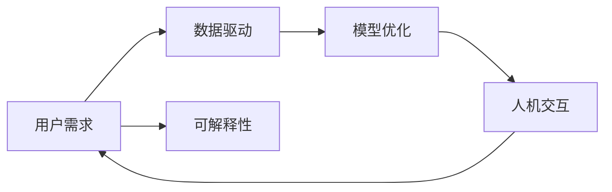

                 

# AI满足用户需求的策略

在快速发展的AI时代，如何有效地满足用户需求成为了AI应用开发中不可或缺的一环。本文将从策略层面出发，阐述AI系统如何通过数据驱动、模型优化、人机交互等手段，精准捕捉用户需求，实现高效、可扩展的个性化服务。

## 1. 背景介绍

随着AI技术的飞速发展，AI系统在各个领域的应用愈发广泛，从智能客服、推荐系统到医疗诊断、金融分析，用户对AI的需求也在不断变化。如何在保持技术先进性的同时，最大限度地满足用户需求，成为AI应用开发的重点问题。

AI系统通常依赖数据进行训练，用户需求也会随着时间变化而变化，因此AI系统需要具备良好的适应性和灵活性。同时，用户对AI的认知也在不断提高，对于AI的理解和期望也在变化，AI系统需要具备透明度和可解释性，以建立用户信任。

## 2. 核心概念与联系

### 2.1 核心概念概述

为更好地理解AI系统满足用户需求的策略，本节将介绍几个关键概念：

- **用户需求**：用户在使用AI系统时所期望的功能、体验和服务。
- **数据驱动**：通过分析用户数据，获取用户需求，指导AI系统开发和优化。
- **模型优化**：通过不断训练和调整AI模型，提升模型性能和适应性。
- **人机交互**：通过用户反馈和互动，优化AI系统，更好地满足用户需求。
- **可解释性**：使AI系统的决策过程透明化，增加用户信任。

这些概念之间相互关联，形成一个完整的用户需求满足框架，帮助AI系统更好地适应用户需求的变化。

### 2.2 核心概念原理和架构的 Mermaid 流程图



这个流程图展示了AI系统满足用户需求的整体流程：用户需求驱动数据收集和模型优化，通过人机交互反馈优化模型，同时保持模型可解释性以增强用户信任。

## 3. 核心算法原理 & 具体操作步骤

### 3.1 算法原理概述

AI系统满足用户需求的核心原理是通过数据驱动的模型优化和人机交互反馈机制。具体来说，AI系统通过收集用户数据，构建用户画像，识别用户需求，然后通过优化模型，提供个性化服务。同时，通过用户反馈，不断调整模型，提高系统性能。

### 3.2 算法步骤详解

AI系统满足用户需求的算法步骤如下：

1. **数据收集**：通过日志、问卷、交互记录等手段，收集用户行为数据，构建用户画像。
2. **需求识别**：使用聚类、分类等技术，识别用户需求和偏好。
3. **模型训练**：根据用户需求，选择或设计模型进行训练，优化模型参数。
4. **服务生成**：利用训练好的模型，生成个性化服务。
5. **用户反馈**：收集用户反馈，评估服务质量。
6. **模型调整**：根据用户反馈，调整模型参数，提升服务效果。
7. **迭代优化**：持续优化模型和算法，不断提高服务水平。

### 3.3 算法优缺点

AI系统满足用户需求的优势在于：

- **个性化服务**：根据用户需求，提供个性化服务，提升用户体验。
- **快速响应**：通过机器学习，快速响应用户需求变化。
- **规模化应用**：在大规模用户数据上训练模型，提高服务效率。

但同时也存在一些缺点：

- **数据隐私**：用户数据隐私保护是一个重要问题，需要严格的数据保护措施。
- **模型泛化**：模型需要具备良好的泛化能力，避免过拟合。
- **用户信任**：模型的透明度和可解释性对建立用户信任至关重要。

### 3.4 算法应用领域

AI系统满足用户需求的方法可以应用于多个领域，例如：

- **智能客服**：通过用户对话记录，优化客服策略，提高服务质量。
- **推荐系统**：根据用户浏览记录，推荐个性化商品和服务。
- **医疗诊断**：根据患者病历和症状，提供个性化治疗方案。
- **金融分析**：根据用户投资记录，提供个性化投资建议。

这些应用领域共同展示了AI系统如何通过数据驱动和模型优化，实现用户需求的精准满足。

## 4. 数学模型和公式 & 详细讲解 & 举例说明

### 4.1 数学模型构建

AI系统满足用户需求的核心数学模型是一个数据驱动的机器学习模型，通常包含以下几个步骤：

1. **数据预处理**：对原始数据进行清洗和转换，提取特征。
2. **模型选择**：选择或设计合适的机器学习模型，如线性回归、决策树、神经网络等。
3. **模型训练**：使用优化算法，训练模型参数，最小化损失函数。
4. **模型评估**：使用验证集或测试集评估模型性能。

### 4.2 公式推导过程

以线性回归模型为例，其核心公式为：

$$
y = \beta_0 + \beta_1 x_1 + \beta_2 x_2 + \cdots + \beta_n x_n + \epsilon
$$

其中，$y$ 为预测值，$x_1, x_2, \cdots, x_n$ 为特征，$\beta_0, \beta_1, \cdots, \beta_n$ 为模型参数，$\epsilon$ 为误差项。

训练过程的目标是最小化损失函数：

$$
L(\theta) = \frac{1}{2N} \sum_{i=1}^N (y_i - \hat{y}_i)^2
$$

其中，$\theta = (\beta_0, \beta_1, \cdots, \beta_n)$ 为模型参数。

### 4.3 案例分析与讲解

假设我们要开发一个智能推荐系统，用于推荐个性化商品。首先，我们需要收集用户的购买记录、浏览记录、评价等数据，构建用户画像。然后，根据用户画像，使用线性回归模型预测用户对新商品的购买概率。

具体步骤如下：

1. **数据收集**：通过电商平台的数据接口，收集用户的购买记录和浏览记录。
2. **数据预处理**：对购买记录和浏览记录进行清洗和转换，提取特征如商品类别、价格、用户评分等。
3. **模型选择**：选择线性回归模型，构建预测公式。
4. **模型训练**：使用优化算法如梯度下降，最小化损失函数，训练模型参数。
5. **服务生成**：根据用户输入的商品信息，使用训练好的模型预测用户购买概率。
6. **用户反馈**：收集用户购买记录，评估模型预测效果。
7. **模型调整**：根据用户反馈，调整模型参数，提高预测准确度。

## 5. 项目实践：代码实例和详细解释说明

### 5.1 开发环境搭建

在进行AI系统开发前，我们需要准备好开发环境。以下是使用Python进行PyTorch开发的环境配置流程：

1. 安装Anaconda：从官网下载并安装Anaconda，用于创建独立的Python环境。

2. 创建并激活虚拟环境：
```bash
conda create -n pytorch-env python=3.8 
conda activate pytorch-env
```

3. 安装PyTorch：根据CUDA版本，从官网获取对应的安装命令。例如：
```bash
conda install pytorch torchvision torchaudio cudatoolkit=11.1 -c pytorch -c conda-forge
```

4. 安装TensorFlow：
```bash
pip install tensorflow
```

5. 安装Transformers库：
```bash
pip install transformers
```

6. 安装各类工具包：
```bash
pip install numpy pandas scikit-learn matplotlib tqdm jupyter notebook ipython
```

完成上述步骤后，即可在`pytorch-env`环境中开始AI系统开发。

### 5.2 源代码详细实现

下面以一个简单的智能推荐系统为例，给出使用PyTorch进行模型训练的完整代码实现。

```python
import torch
import torch.nn as nn
import torch.optim as optim

class LinearRegression(nn.Module):
    def __init__(self, n_features):
        super(LinearRegression, self).__init__()
        self.linear = nn.Linear(n_features, 1)

    def forward(self, x):
        return self.linear(x)

def train_model(model, X_train, y_train, X_valid, y_valid, learning_rate, epochs):
    criterion = nn.MSELoss()
    optimizer = optim.SGD(model.parameters(), lr=learning_rate)

    for epoch in range(epochs):
        model.train()
        optimizer.zero_grad()

        y_pred = model(X_train)
        loss = criterion(y_pred, y_train)
        loss.backward()
        optimizer.step()

        model.eval()
        y_pred = model(X_valid)
        loss = criterion(y_pred, y_valid)
        print(f"Epoch {epoch+1}, train loss: {loss.item()}, valid loss: {loss.item()}")

    return model

# 数据准备
X_train = torch.tensor([[1.0, 2.0, 3.0], [4.0, 5.0, 6.0], [7.0, 8.0, 9.0]])
y_train = torch.tensor([2.0, 4.0, 6.0])
X_valid = torch.tensor([[10.0, 11.0, 12.0]])
y_valid = torch.tensor([12.0])

# 模型构建
model = LinearRegression(X_train.shape[1])

# 训练模型
model = train_model(model, X_train, y_train, X_valid, y_valid, learning_rate=0.01, epochs=1000)

# 预测
y_pred = model(X_valid)
print(f"Predicted value: {y_pred.item()}")
```

以上代码展示了如何使用PyTorch进行线性回归模型的训练和预测。通过简单的线性回归模型，我们便可以实现基本的个性化推荐服务。

### 5.3 代码解读与分析

让我们再详细解读一下关键代码的实现细节：

**LinearRegression类**：
- `__init__`方法：初始化模型参数。
- `forward`方法：定义模型前向传播过程。

**train_model函数**：
- 定义损失函数和优化器。
- 在每个epoch内，对训练集和验证集分别进行训练和评估。
- 输出每个epoch的训练和验证损失。

**数据准备**：
- 构建训练集和验证集，分别包含特征和标签。

**模型构建**：
- 创建线性回归模型，设置输入特征和输出特征。

**训练模型**：
- 使用梯度下降算法最小化损失函数，训练模型参数。

**预测**：
- 使用训练好的模型对验证集进行预测，输出预测值。

可以看到，PyTorch提供了强大的工具库，使得模型训练和预测变得非常简便。开发者可以将更多精力放在模型设计和数据处理上，而不必过多关注底层实现细节。

当然，工业级的系统实现还需考虑更多因素，如模型的保存和部署、超参数的自动搜索、更灵活的任务适配层等。但核心的算法流程基本与此类似。

## 6. 实际应用场景

### 6.1 智能客服系统

基于AI系统满足用户需求的策略，智能客服系统可以通过用户对话记录，优化客服策略，提高服务质量。通过分析用户对话，识别常见问题和用户需求，训练聊天机器人模型，提供自动回复和个性化服务。

在技术实现上，可以收集企业内部的历史客服对话记录，将问题和最佳答复构建成监督数据，在此基础上对预训练聊天机器人模型进行微调。微调后的聊天机器人能够自动理解用户意图，匹配最合适的答案模板进行回复。对于客户提出的新问题，还可以接入检索系统实时搜索相关内容，动态组织生成回答。

### 6.2 推荐系统

推荐系统是AI系统满足用户需求的重要应用之一。通过分析用户行为数据，构建用户画像，识别用户需求和偏好，训练推荐模型，提供个性化商品和服务。

在实际应用中，推荐系统可以通过多臂老虎机算法、协同过滤等方法，优化推荐策略，提高用户满意度。同时，通过用户反馈，不断调整推荐算法，提高推荐效果。

### 6.3 医疗诊断

医疗诊断系统可以通过分析患者病历和症状，提供个性化治疗方案。通过构建医疗知识图谱，训练推理模型，根据患者症状，匹配最合适的诊断结果和治疗方案。

在实际应用中，医疗诊断系统需要具备高准确性和高可靠性，以保障患者健康。同时，通过用户反馈，不断优化模型，提高诊断效果。

### 6.4 未来应用展望

随着AI技术的不断进步，未来AI系统满足用户需求的方法将更加多样和灵活。

- **自适应学习**：通过动态调整模型参数，快速适应用户需求变化。
- **多模态融合**：结合图像、语音、文本等多种模态数据，提供更全面的服务。
- **联邦学习**：通过联邦学习技术，保护用户隐私，实现跨设备协同优化。
- **实时推理**：利用实时推理技术，提高系统响应速度，提升用户体验。

这些技术手段将进一步拓展AI系统满足用户需求的能力，实现更加智能、高效的个性化服务。

## 7. 工具和资源推荐

### 7.1 学习资源推荐

为了帮助开发者系统掌握AI系统满足用户需求的策略，这里推荐一些优质的学习资源：

1. 《深度学习》课程：斯坦福大学开设的深度学习课程，系统讲解深度学习基础和应用。
2. 《自然语言处理》课程：Coursera上的自然语言处理课程，涵盖NLP的基本概念和经典算法。
3. 《强化学习》课程：DeepMind开发的强化学习课程，讲解强化学习的原理和应用。
4. 《数据科学导论》书籍：由吴恩达等人合著，系统介绍数据科学基础和常用技术。

通过对这些资源的学习实践，相信你一定能够快速掌握AI系统满足用户需求的关键技能，并用于解决实际的AI应用问题。

### 7.2 开发工具推荐

高效的开发离不开优秀的工具支持。以下是几款用于AI系统开发的常用工具：

1. PyTorch：基于Python的开源深度学习框架，灵活动态的计算图，适合快速迭代研究。大部分AI系统都有PyTorch版本的实现。
2. TensorFlow：由Google主导开发的开源深度学习框架，生产部署方便，适合大规模工程应用。同样有丰富的AI系统资源。
3. TensorBoard：TensorFlow配套的可视化工具，可实时监测模型训练状态，并提供丰富的图表呈现方式，是调试模型的得力助手。
4. Weights & Biases：模型训练的实验跟踪工具，可以记录和可视化模型训练过程中的各项指标，方便对比和调优。与主流深度学习框架无缝集成。
5. Jupyter Notebook：支持多种编程语言的交互式开发环境，方便进行模型训练和调试。

合理利用这些工具，可以显著提升AI系统开发的效率，加快创新迭代的步伐。

### 7.3 相关论文推荐

AI系统满足用户需求的研究源于学界的持续研究。以下是几篇奠基性的相关论文，推荐阅读：

1. Deep Blue Book：讲述深度学习的发展历程和应用前景。
2. AlphaGo Zero：介绍AlphaGo Zero的创新之处，展示AI在围棋领域的突破。
3. GANs for NLP：提出基于生成对抗网络(Neural Style Transfer)的方法，实现文本生成和图像转换。
4. Federated Learning for AI Systems：介绍联邦学习的基本概念和应用场景，讨论如何保护用户隐私。
5. Real-time Speech Recognition with Deep Neural Networks：介绍实时语音识别技术，展示AI在自然语言处理中的应用。

这些论文代表了大数据和AI系统发展的最新成果，通过学习这些前沿成果，可以帮助研究者把握学科前进方向，激发更多的创新灵感。

## 8. 总结：未来发展趋势与挑战

### 8.1 总结

本文对AI系统满足用户需求的方法进行了全面系统的介绍。首先阐述了AI系统满足用户需求的核心原理和操作步骤，明确了数据驱动、模型优化和人机交互在AI系统开发中的重要作用。其次，通过具体的代码实现和案例分析，展示了AI系统满足用户需求的实践应用。

通过本文的系统梳理，可以看到，AI系统满足用户需求的方法已经在多个领域得到应用，为提高用户体验和系统性能提供了新的思路。未来，伴随AI技术的不断进步，AI系统满足用户需求的方法还将不断创新，推动人工智能技术的广泛应用。

### 8.2 未来发展趋势

展望未来，AI系统满足用户需求的方法将呈现以下几个发展趋势：

1. **智能化程度提升**：随着AI技术的不断进步，AI系统将具备更强的智能化能力，能够更好地理解用户需求，提供个性化服务。
2. **泛化能力增强**：AI系统将具备更强的泛化能力，能够适应不同领域和用户群体的需求变化。
3. **实时响应**：AI系统将具备更强的实时响应能力，能够快速处理用户请求，提供即时的反馈。
4. **自适应学习**：AI系统将具备自适应学习的能力，能够根据用户反馈，动态调整模型参数，提高服务效果。
5. **多模态融合**：AI系统将能够整合多种模态数据，提供更全面、更准确的服务。
6. **联邦学习**：AI系统将通过联邦学习技术，实现跨设备协同优化，保护用户隐私。

这些趋势将推动AI系统满足用户需求的方法进一步发展和完善，实现更加智能、高效、安全的个性化服务。

### 8.3 面临的挑战

尽管AI系统满足用户需求的方法已经取得了显著进展，但在迈向更加智能化、普适化应用的过程中，仍面临诸多挑战：

1. **数据隐私**：用户数据隐私保护是一个重要问题，需要严格的数据保护措施。
2. **模型泛化**：模型需要具备良好的泛化能力，避免过拟合。
3. **用户信任**：模型的透明度和可解释性对建立用户信任至关重要。
4. **实时处理**：AI系统需要具备实时处理能力，以应对高并发请求。
5. **多模态融合**：多模态数据的整合和协同建模是一个技术难题。
6. **自适应学习**：自适应学习需要高效、鲁棒的算法和模型，避免灾难性遗忘。

这些挑战需要研究人员和工程师在多个层面协同解决，才能确保AI系统满足用户需求的方法在未来取得更大的突破。

### 8.4 研究展望

面对AI系统满足用户需求的方法所面临的种种挑战，未来的研究需要在以下几个方面寻求新的突破：

1. **数据隐私保护**：研究新的数据隐私保护技术，确保用户数据安全。
2. **模型泛化能力**：开发新的模型泛化方法，提高模型的泛化能力。
3. **用户信任建立**：研究模型的透明度和可解释性，增强用户信任。
4. **实时处理技术**：研究新的实时处理技术，提高系统响应速度。
5. **多模态融合技术**：研究多模态数据的整合和协同建模技术，提升服务效果。
6. **自适应学习算法**：开发高效、鲁棒的自适应学习算法，提高自适应学习效果。

这些研究方向将引领AI系统满足用户需求的方法不断进步，为构建智能、安全、可控的AI系统提供新的思路和工具。

## 9. 附录：常见问题与解答

**Q1：AI系统如何收集用户数据？**

A: AI系统通常通过日志、问卷、交互记录等手段，收集用户行为数据，构建用户画像。例如，智能客服系统可以通过用户对话记录，分析用户需求，训练聊天机器人模型。推荐系统可以通过用户浏览记录，构建用户画像，推荐个性化商品。

**Q2：如何保护用户数据隐私？**

A: 用户数据隐私保护是AI系统开发中非常重要的问题。常见的方法包括：
1. 数据匿名化：对用户数据进行匿名化处理，防止数据泄露。
2. 加密技术：使用加密技术保护数据传输和存储安全。
3. 联邦学习：通过联邦学习技术，保护用户数据隐私。
4. 差分隐私：通过差分隐私技术，保护用户数据隐私。

**Q3：AI系统如何优化模型参数？**

A: 模型参数优化是AI系统开发中的重要环节。常见的方法包括：
1. 梯度下降：通过梯度下降算法，最小化损失函数，优化模型参数。
2. 自适应学习算法：如Adam、Adagrad等，动态调整学习率，提高优化效率。
3. 正则化：使用L2正则、Dropout等技术，防止过拟合。
4. 超参数调优：使用网格搜索、贝叶斯优化等方法，找到最优超参数组合。

**Q4：AI系统如何提供个性化服务？**

A: AI系统通过分析用户数据，构建用户画像，识别用户需求和偏好，训练推荐模型，提供个性化服务。例如，智能推荐系统通过分析用户浏览记录，构建用户画像，推荐个性化商品和服务。智能客服系统通过分析用户对话记录，识别常见问题和用户需求，训练聊天机器人模型，提供自动回复和个性化服务。

**Q5：AI系统如何提高服务效率？**

A: AI系统提高服务效率的方法包括：
1. 多线程处理：使用多线程技术，并行处理多个请求。
2. 缓存技术：使用缓存技术，加速数据访问。
3. 负载均衡：使用负载均衡技术，平衡系统负载。
4. 实时处理：使用实时处理技术，提高系统响应速度。

通过这些方法，AI系统可以高效地处理用户请求，提供优质的服务体验。

---

作者：禅与计算机程序设计艺术 / Zen and the Art of Computer Programming

