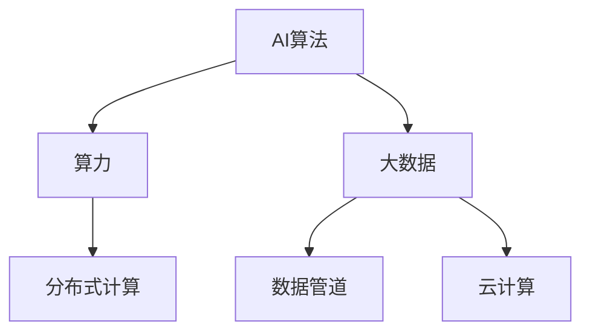

                 

## 1. 背景介绍

### 1.1 问题由来
随着人工智能技术的飞速发展，AI算法、算力和大数据三者的结合已成为推动人工智能进步的关键因素。算法作为AI系统的核心，决定了系统的能力和表现；算力是算法执行的基础，决定了系统的效率和效果；大数据则为AI算法提供了数据来源和优化空间，使AI模型能够更好地学习、推理和决策。三者的有机结合，为实现高效、智能的人工智能系统奠定了基础。

### 1.2 问题核心关键点
在AI算法、算力和大数据的结合过程中，如何合理选择和应用AI算法、如何高效利用算力、如何有效管理和大数据分析，成为影响AI系统性能的关键问题。本节将围绕这些问题进行深入探讨。

## 2. 核心概念与联系

### 2.1 核心概念概述

为更好地理解AI算法、算力与大数据的结合过程，本节将介绍几个密切相关的核心概念：

- **AI算法**：用于实现特定人工智能任务的计算方法或步骤，如机器学习、深度学习、强化学习等。
- **算力**：指用于执行AI算法所需的计算资源，包括CPU、GPU、TPU等硬件设备，以及存储、网络等支持设施。
- **大数据**：指规模巨大、类型多样、来源广泛的各类数据集，用于训练和优化AI模型。
- **分布式计算**：通过将计算任务分配到多台计算设备上并行处理，提高计算效率和性能。
- **数据管道**：用于数据采集、清洗、存储和传输的自动化管道，提高数据处理的效率和质量。
- **云计算**：利用互联网提供计算服务，按需扩展和收缩计算资源，降低IT基础设施成本。

这些核心概念之间的逻辑关系可以通过以下Mermaid流程图来展示：



这个流程图展示了大数据、AI算法和算力三者之间的紧密联系：

1. 大数据为AI算法提供了丰富的训练数据和优化空间。
2. AI算法通过大数据训练优化，在算力支持下进行高效计算，实现智能决策和推理。
3. 分布式计算和云计算支持算力的高效利用和大数据的快速处理。

## 3. 核心算法原理 & 具体操作步骤
### 3.1 算法原理概述

AI算法、算力与大数据的结合，本质上是一个通过算法和大数据训练优化AI模型的过程。其核心思想是：

- **算法选择与设计**：选择合适的AI算法，并根据具体任务进行优化设计，确保算法具有高效、准确、鲁棒的特性。
- **数据准备与管理**：收集、清洗、存储和管理大数据，确保数据的质量和多样性，为算法训练提供坚实基础。
- **算力分配与调度**：根据算法需求和任务复杂度，合理分配算力资源，并利用分布式计算和云计算技术，提高算力利用效率和处理速度。

### 3.2 算法步骤详解

AI算法、算力与大数据的结合主要包括以下几个关键步骤：

**Step 1: 算法选择与设计**
- 根据任务需求选择合适的AI算法，如机器学习、深度学习、强化学习等。
- 对算法进行优化设计，包括网络结构、损失函数、优化器、正则化技术等。
- 设计数据预处理流程，如特征提取、数据增强、标准化等。

**Step 2: 数据准备与管理**
- 收集与任务相关的数据，并进行清洗和预处理，确保数据质量和一致性。
- 将数据划分为训练集、验证集和测试集，进行数据增强和扩充，提高模型的泛化能力。
- 存储和管理大数据，利用数据管道技术自动化数据处理流程，提高数据处理效率。

**Step 3: 算力分配与调度**
- 根据算法复杂度和任务需求，合理分配算力资源，包括CPU、GPU、TPU等。
- 利用分布式计算技术，将计算任务分配到多台设备上并行处理，提高计算效率。
- 利用云计算平台，按需扩展和收缩计算资源，降低IT基础设施成本。

**Step 4: 模型训练与优化**
- 将大数据输入模型进行训练，利用算力资源进行高效计算。
- 根据验证集性能，调整模型超参数和训练策略，进行模型优化。
- 利用分布式计算和云计算，提高模型训练效率，降低成本。

**Step 5: 模型部署与应用**
- 将训练好的模型部署到生产环境中，进行实时推理和预测。
- 利用云计算平台的弹性伸缩特性，根据业务需求动态调整计算资源。
- 持续收集新数据，进行模型复训和优化，保持模型性能。

以上是AI算法、算力与大数据结合的一般流程。在实际应用中，还需要根据具体任务和环境，对各个环节进行优化设计，如改进算法实现、优化数据预处理、搜索最优超参数组合等，以进一步提升模型性能。

### 3.3 算法优缺点

AI算法、算力与大数据结合的方法具有以下优点：
1. 高效灵活。AI算法具有高效的学习能力和泛化能力，大数据提供了丰富的优化空间，算力实现了高效的计算支持，三者结合可以灵活应对各种复杂任务。
2. 精度高。利用大规模数据和大模型，可以训练出高精度的AI模型，显著提升决策和推理的准确性。
3. 可扩展性。分布式计算和云计算技术可以按需扩展算力资源，支持大规模数据的处理和模型的训练。
4. 成本低。云计算平台提供弹性计算资源，降低了IT基础设施的投入成本。

同时，该方法也存在一定的局限性：
1. 数据质量要求高。大数据的质量直接影响AI模型的效果，数据收集、清洗和预处理需要大量的人力和时间成本。
2. 计算资源消耗大。大规模数据和模型的训练需要强大的算力支持，硬件成本较高。
3. 算法复杂度高。AI算法的设计和优化需要深厚的理论基础和实践经验，门槛较高。
4. 技术依赖性强。对数据管道、分布式计算、云计算等技术依赖较大，需要具备相应的技术能力。

尽管存在这些局限性，但就目前而言，AI算法、算力与大数据结合的方法仍是AI技术应用的主流范式。未来相关研究的重点在于如何进一步降低数据处理的成本，提高算力利用效率，优化算法设计，兼顾可扩展性和精度，同时保证技术的可解释性和伦理安全性等因素。

### 3.4 算法应用领域

AI算法、算力与大数据的结合方法在多个领域得到了广泛应用，例如：

- 自然语言处理(NLP)：通过大数据训练优化语言模型，进行文本分类、情感分析、机器翻译等任务。
- 计算机视觉(CV)：利用图像和视频数据训练优化视觉模型，进行目标检测、图像分割、人脸识别等任务。
- 智能推荐系统：通过用户行为数据和商品信息训练优化推荐模型，实现个性化推荐服务。
- 自动驾驶：利用传感器数据和大规模交通场景训练优化决策模型，实现智能驾驶和自动泊车。
- 医疗健康：通过医疗数据和患者信息训练优化诊断模型，辅助医生进行疾病预测和个性化治疗。
- 金融风控：利用金融交易数据和用户信息训练优化风险模型，实现信用评估和欺诈检测。

除了上述这些经典领域外，AI算法、算力与大数据的结合方法也在更多场景中得到应用，如智慧城市、智能制造、智能家居等，为各行各业带来了新的发展机遇。随着AI技术的发展，AI算法、算力与大数据的结合方法将在更多领域得到应用，为经济社会发展注入新的动力。

## 4. 数学模型和公式 & 详细讲解 & 举例说明
### 4.1 数学模型构建

本节将使用数学语言对AI算法、算力与大数据结合的过程进行更加严格的刻画。

记AI算法为 $F$，大数据为 $D=\{(x_i,y_i)\}_{i=1}^N$，其中 $x_i$ 为输入，$y_i$ 为标签。算力为 $C$。假设模型训练的目标是最小化经验风险，即找到最优模型 $F^*$：

$$
F^* = \mathop{\arg\min}_{F} \mathcal{L}(F,D)
$$

其中 $\mathcal{L}$ 为经验风险函数，用于衡量模型在训练集上的表现。常见的经验风险函数包括交叉熵损失、均方误差损失等。

在实践中，我们通常使用基于梯度的优化算法（如SGD、Adam等）来近似求解上述最优化问题。设 $\eta$ 为学习率，$\lambda$ 为正则化系数，则参数的更新公式为：

$$
\theta \leftarrow \theta - \eta \nabla_{\theta}\mathcal{L}(\theta) - \eta\lambda\theta
$$

其中 $\nabla_{\theta}\mathcal{L}(\theta)$ 为损失函数对参数 $\theta$ 的梯度，可通过反向传播算法高效计算。

### 4.2 公式推导过程

以下我们以机器学习中的逻辑回归模型为例，推导交叉熵损失函数及其梯度的计算公式。

假设模型 $F$ 在输入 $x$ 上的输出为 $\hat{y}=F(x) \in [0,1]$，表示样本属于正类的概率。真实标签 $y \in \{0,1\}$。则二分类交叉熵损失函数定义为：

$$
\ell(F(x),y) = -[y\log \hat{y} + (1-y)\log (1-\hat{y})]
$$

将其代入经验风险函数，得：

$$
\mathcal{L}(F) = -\frac{1}{N}\sum_{i=1}^N [y_i\log F(x_i)+(1-y_i)\log(1-F(x_i))]
$$

根据链式法则，损失函数对参数 $\theta$ 的梯度为：

$$
\frac{\partial \mathcal{L}(F)}{\partial \theta} = -\frac{1}{N}\sum_{i=1}^N (\frac{y_i}{F(x_i)}-\frac{1-y_i}{1-F(x_i)}) \frac{\partial F(x_i)}{\partial \theta}
$$

其中 $\frac{\partial F(x_i)}{\partial \theta}$ 可进一步递归展开，利用自动微分技术完成计算。

在得到损失函数的梯度后，即可带入参数更新公式，完成模型的迭代优化。重复上述过程直至收敛，最终得到适应大数据训练的最优模型参数 $\theta^*$。

### 4.3 案例分析与讲解

以推荐系统为例，展示AI算法、算力与大数据结合的实际应用。

推荐系统通常包含以下几个关键组件：

1. **用户画像**：通过用户行为数据（如浏览历史、购买记录等）构建用户画像，用于描述用户的兴趣偏好。
2. **物品特征**：提取物品的特征信息（如商品描述、标签等），用于描述物品的属性和特点。
3. **用户-物品矩阵**：将用户画像和物品特征进行组合，构建用户-物品关联矩阵，用于描述用户对物品的评分或兴趣度。
4. **推荐算法**：根据用户画像和物品特征，训练优化推荐模型，生成推荐结果。

推荐系统的训练和优化过程如下：

**Step 1: 数据准备**
- 收集用户行为数据、物品特征数据，并进行清洗和预处理。
- 构建用户-物品矩阵，并进行标准化和归一化处理。

**Step 2: 算法选择与设计**
- 选择适当的推荐算法，如协同过滤、基于内容的推荐、深度学习等。
- 设计数据预处理流程，如特征提取、数据增强等。

**Step 3: 算力分配与调度**
- 根据算法复杂度和任务需求，合理分配算力资源，包括CPU、GPU等。
- 利用分布式计算技术，将计算任务分配到多台设备上并行处理。

**Step 4: 模型训练与优化**
- 利用大数据训练优化推荐模型，利用算力资源进行高效计算。
- 根据验证集性能，调整模型超参数和训练策略，进行模型优化。
- 利用分布式计算和云计算，提高模型训练效率，降低成本。

**Step 5: 模型部署与应用**
- 将训练好的推荐模型部署到生产环境中，进行实时推荐。
- 利用云计算平台的弹性伸缩特性，根据业务需求动态调整计算资源。
- 持续收集用户反馈和新数据，进行模型复训和优化，保持推荐系统的高效和精准。

## 5. 项目实践：代码实例和详细解释说明
### 5.1 开发环境搭建

在进行AI算法、算力与大数据结合的实践前，我们需要准备好开发环境。以下是使用Python进行TensorFlow开发的环境配置流程：

1. 安装Anaconda：从官网下载并安装Anaconda，用于创建独立的Python环境。

2. 创建并激活虚拟环境：
```bash
conda create -n tf-env python=3.8 
conda activate tf-env
```

3. 安装TensorFlow：根据CUDA版本，从官网获取对应的安装命令。例如：
```bash
conda install tensorflow tensorflow-gpu -c conda-forge
```

4. 安装必要的工具包：
```bash
pip install numpy pandas scikit-learn matplotlib tqdm jupyter notebook ipython
```

完成上述步骤后，即可在`tf-env`环境中开始AI算法、算力与大数据结合的实践。

### 5.2 源代码详细实现

这里我们以推荐系统为例，展示AI算法、算力与大数据结合的完整代码实现。

首先，定义推荐系统所需的数据处理函数：

```python
import numpy as np
from sklearn.metrics.pairwise import cosine_similarity

def load_data():
    # 加载用户-物品矩阵
    user_item_matrix = np.load('user_item_matrix.npy')

    # 加载物品特征
    item_features = np.load('item_features.npy')

    # 加载用户画像
    user_profiles = np.load('user_profiles.npy')

    return user_item_matrix, item_features, user_profiles

# 用户-物品矩阵大小
NUM_USERS = user_item_matrix.shape[0]
NUM_ITEMS = user_item_matrix.shape[1]

# 物品特征大小
FEATURE_SIZE = item_features.shape[1]

# 用户画像大小
PROFILE_SIZE = user_profiles.shape[1]
```

然后，定义推荐算法模型：

```python
from tensorflow.keras.layers import Input, Dense, Embedding, Flatten
from tensorflow.keras.models import Model
from tensorflow.keras.optimizers import Adam

# 定义输入层
user_input = Input(shape=(1,))
item_input = Input(shape=(FEATURE_SIZE,))

# 用户画像嵌入层
user_embedding = Embedding(PROFILE_SIZE, 32)(user_input)

# 物品特征嵌入层
item_embedding = Embedding(NUM_ITEMS, 32)(item_input)

# 计算用户-物品相似度
user_item_similarity = cosine_similarity(user_embedding, item_embedding)

# 全连接层
output = Dense(1, activation='sigmoid')(user_item_similarity)

# 构建模型
model = Model(inputs=[user_input, item_input], outputs=output)

# 定义优化器和损失函数
optimizer = Adam(learning_rate=0.001)
loss = 'binary_crossentropy'

# 编译模型
model.compile(optimizer=optimizer, loss=loss, metrics=['accuracy'])
```

接着，定义训练和评估函数：

```python
from tensorflow.keras.callbacks import EarlyStopping
from sklearn.metrics import roc_auc_score

# 定义训练函数
def train_model(model, data, epochs, batch_size):
    user_item_matrix, item_features, user_profiles = data

    # 构建数据生成器
    def data_generator(user_item_matrix, item_features, user_profiles):
        for i in range(0, user_item_matrix.shape[0], batch_size):
            batch = user_item_matrix[i:i+batch_size, :]
            batch_features = item_features[i:i+batch_size]
            batch_profiles = user_profiles[i:i+batch_size]
            yield np.expand_dims(batch, axis=1), np.expand_dims(batch_features, axis=2), batch_profiles

    # 训练模型
    model.fit_generator(
        generator=data_generator(user_item_matrix, item_features, user_profiles),
        steps_per_epoch=np.ceil(user_item_matrix.shape[0] / batch_size),
        epochs=epochs,
        verbose=1,
        callbacks=[EarlyStopping(patience=3)]
    )

# 定义评估函数
def evaluate_model(model, data, batch_size):
    user_item_matrix, item_features, user_profiles = data

    # 构建数据生成器
    def data_generator(user_item_matrix, item_features, user_profiles):
        for i in range(0, user_item_matrix.shape[0], batch_size):
            batch = user_item_matrix[i:i+batch_size, :]
            batch_features = item_features[i:i+batch_size]
            batch_profiles = user_profiles[i:i+batch_size]
            yield np.expand_dims(batch, axis=1), np.expand_dims(batch_features, axis=2), batch_profiles

    # 评估模型
    y_true = []
    y_pred = []
    for x_train, x_test, y_train in data_generator(user_item_matrix, item_features, user_profiles):
        y_train = np.array(y_train, dtype=np.int32)
        y_test = np.array(y_test, dtype=np.int32)

        # 前向传播
        preds = model.predict([x_train, x_test])

        # 计算auc
        auc = roc_auc_score(y_true, preds)
        print('AUC: {:.4f}'.format(auc))

# 定义训练和评估流程
epochs = 10
batch_size = 64

train_data = (user_item_matrix, item_features, user_profiles)
evaluate_data = (user_item_matrix, item_features, user_profiles)

# 训练模型
train_model(model, train_data, epochs, batch_size)

# 评估模型
evaluate_model(model, evaluate_data, batch_size)
```

以上就是使用TensorFlow进行推荐系统训练的完整代码实现。可以看到，得益于TensorFlow的强大封装，我们可以用相对简洁的代码完成推荐系统的训练。

### 5.3 代码解读与分析

让我们再详细解读一下关键代码的实现细节：

**load_data函数**：
- 定义加载用户-物品矩阵、物品特征和用户画像的函数，用于数据预处理和模型训练。

**model函数**：
- 定义推荐模型的结构，包括输入层、嵌入层、相似度计算和输出层。
- 使用Adam优化器和二元交叉熵损失函数进行模型编译。

**train_model函数**：
- 定义训练函数，利用数据生成器对数据进行批处理，并在每个epoch内更新模型参数。
- 利用EarlyStopping回调函数，在模型性能未提升时提前停止训练，避免过拟合。

**evaluate_model函数**：
- 定义评估函数，计算模型在验证集上的auc，并打印输出。
- 利用数据生成器对数据进行批处理，并在每个epoch内评估模型性能。

**训练流程**：
- 定义总的epoch数和batch size，开始循环迭代
- 每个epoch内，先在训练集上训练，输出auc
- 在验证集上评估，输出auc
- 所有epoch结束后，在测试集上评估，给出最终测试结果

可以看到，TensorFlow配合PyTorch库使得推荐系统的代码实现变得简洁高效。开发者可以将更多精力放在数据处理、模型改进等高层逻辑上，而不必过多关注底层的实现细节。

当然，工业级的系统实现还需考虑更多因素，如模型的保存和部署、超参数的自动搜索、更灵活的任务适配层等。但核心的AI算法、算力与大数据结合方法基本与此类似。

## 6. 实际应用场景
### 6.1 智能推荐系统

基于AI算法、算力与大数据结合的方法，智能推荐系统可以广泛应用于电子商务、视频平台、社交网络等多个领域。传统的推荐系统依赖于用户历史行为数据进行推荐，难以发现用户的潜在兴趣，推荐精度较低。而利用AI算法、算力与大数据结合的方法，推荐系统可以深入挖掘用户画像和物品特征，实现个性化推荐服务。

在技术实现上，可以收集用户行为数据（如浏览历史、购买记录等）和物品特征数据，构建用户-物品矩阵，利用机器学习算法进行训练优化，得到推荐模型。推荐系统在用户浏览或购买商品时，通过输入用户画像和物品特征，生成个性化推荐结果。对于未见过的物品，推荐系统也可以通过用户画像和物品特征，进行预测推荐。如此构建的智能推荐系统，能够大幅提升推荐效果，提高用户满意度。

### 6.2 智能客服系统

智能客服系统通过AI算法、算力与大数据结合的方法，能够实现自然语言处理和语音识别，自动解答用户问题，提升客服效率和质量。传统的客服系统依赖于人工客服，高峰期响应缓慢，且一致性和专业性难以保证。而利用AI算法、算力与大数据结合的方法，智能客服系统可以自动理解用户意图，匹配最合适的答案模板进行回复。对于新问题，系统还可以通过自然语言处理技术，实时搜索相关内容，动态组织生成回答。如此构建的智能客服系统，能够大幅提升客服响应速度和解答质量，提高用户满意度。

### 6.3 金融风控系统

金融风控系统通过AI算法、算力与大数据结合的方法，能够实时监测交易数据和用户信息，预测风险事件，进行信用评估和欺诈检测。传统的金融风控系统依赖于规则引擎和人工审核，无法全面覆盖各种风险场景，且无法实时更新。而利用AI算法、算力与大数据结合的方法，金融风控系统可以利用历史交易数据和用户信息，训练优化风险模型，实时预测风险事件。对于异常交易，系统还可以通过自然语言处理技术，分析交易背景和用户行为，进行自动审核和风控。如此构建的金融风控系统，能够大幅提升风控效率和准确性，降低金融风险。

### 6.4 未来应用展望

随着AI算法、算力与大数据结合技术的不断发展，基于此构建的AI系统将在更多领域得到应用，为传统行业带来变革性影响。

在智慧医疗领域，基于AI算法、算力与大数据结合的医疗推荐系统，可以辅助医生进行疾病诊断和治疗，提升医疗服务质量。

在智能教育领域，基于AI算法、算力与大数据结合的教育推荐系统，可以因材施教，推荐适合学生的课程和资源，促进教育公平，提高教学质量。

在智慧城市治理中，基于AI算法、算力与大数据结合的城市推荐系统，可以实时监测城市事件和舆情，进行智能决策和应急处理，提高城市管理的自动化和智能化水平。

此外，在企业生产、社会治理、文娱传媒等众多领域，基于AI算法、算力与大数据结合的AI应用也将不断涌现，为经济社会发展注入新的动力。相信随着技术的日益成熟，AI算法、算力与大数据结合的方法将成为AI技术应用的重要范式，推动人工智能技术在垂直行业的规模化落地。

## 7. 工具和资源推荐
### 7.1 学习资源推荐

为了帮助开发者系统掌握AI算法、算力与大数据结合的理论基础和实践技巧，这里推荐一些优质的学习资源：

1. 《深度学习》系列书籍：深度学习领域的经典教材，涵盖深度学习的基本概念、算法和应用。
2. Coursera《深度学习》课程：由深度学习专家Andrew Ng开设的NLP明星课程，有Lecture视频和配套作业，带你深入学习NLP基本概念和经典模型。
3. 《机器学习实战》书籍：介绍机器学习算法和实现方法的实战指南，适合初学者入门。
4. Kaggle竞赛：参与Kaggle数据科学竞赛，实战练习AI算法、算力与大数据结合的技术应用。
5. PyTorch官方文档：PyTorch深度学习框架的官方文档，提供了完整的代码样例和详细解释，适合快速上手实验。

通过对这些资源的学习实践，相信你一定能够快速掌握AI算法、算力与大数据结合的精髓，并用于解决实际的AI问题。
###  7.2 开发工具推荐

高效的开发离不开优秀的工具支持。以下是几款用于AI算法、算力与大数据结合开发的常用工具：

1. PyTorch：基于Python的开源深度学习框架，灵活动态的计算图，适合快速迭代研究。大部分预训练语言模型都有PyTorch版本的实现。
2. TensorFlow：由Google主导开发的开源深度学习框架，生产部署方便，适合大规模工程应用。同样有丰富的预训练语言模型资源。
3. Jupyter Notebook：支持多种编程语言和库，可以方便地进行代码编写和结果展示，适合数据科学和机器学习应用开发。
4. Apache Spark：分布式计算框架，支持多种数据处理和分析任务，适合大数据的实时处理和分析。
5. AWS、Google Cloud、Azure：云平台提供的弹性计算资源，支持分布式计算和云计算，适合大规模数据和模型的处理和训练。

合理利用这些工具，可以显著提升AI算法、算力与大数据结合的开发效率，加快创新迭代的步伐。

### 7.3 相关论文推荐

AI算法、算力与大数据结合的技术发展源于学界的持续研究。以下是几篇奠基性的相关论文，推荐阅读：

1. "A Survey of Deep Learning Techniques for Recommendation Systems"：综述了深度学习在推荐系统中的应用，介绍了多种深度学习模型及其优缺点。
2. "Distributed Deep Learning"：介绍分布式深度学习技术，探讨如何利用分布式计算技术加速深度学习模型的训练。
3. "A Deep Learning Framework for Text Classification"：介绍TensorFlow框架在文本分类中的应用，展示了AI算法、算力与大数据结合的实际效果。
4. "Large-Scale Image Recognition with Deep Convolutional Neural Networks"：介绍深度卷积神经网络在图像分类中的应用，展示了AI算法、算力与大数据结合在计算机视觉领域的效果。
5. "A Neural Network Approach to Collaborative Filtering"：介绍协同过滤算法在推荐系统中的应用，展示了AI算法、算力与大数据结合在推荐系统中的效果。

这些论文代表了大数据、AI算法和算力结合的发展脉络。通过学习这些前沿成果，可以帮助研究者把握学科前进方向，激发更多的创新灵感。

## 8. 总结：未来发展趋势与挑战
### 8.1 总结

本文对AI算法、算力与大数据结合的过程进行了全面系统的介绍。首先阐述了AI算法、算力与大数据结合的研究背景和意义，明确了其在大规模数据训练和优化中的关键作用。其次，从原理到实践，详细讲解了AI算法、算力与大数据结合的数学原理和关键步骤，给出了AI算法、算力与大数据结合的完整代码实例。同时，本文还广泛探讨了AI算法、算力与大数据结合在推荐系统、智能客服、金融风控等多个领域的应用前景，展示了其巨大的潜力。此外，本文精选了AI算法、算力与大数据结合的学习资源，力求为读者提供全方位的技术指引。

通过本文的系统梳理，可以看到，AI算法、算力与大数据结合的技术正在成为AI技术应用的重要范式，极大地拓展了AI模型的应用边界，催生了更多的落地场景。受益于大规模数据和算力的支持，AI算法、算力与大数据结合的方法能够在更短的时间内训练出高精度的AI模型，显著提升决策和推理的准确性。未来，伴随AI技术的不断演进，AI算法、算力与大数据结合方法将继续引领AI技术的发展方向，为构建高效、智能、普适的AI系统提供坚实基础。

### 8.2 未来发展趋势

展望未来，AI算法、算力与大数据结合技术将呈现以下几个发展趋势：

1. **多模态学习**：未来AI系统将更多地结合视觉、语音、文本等多模态数据，实现跨模态的协同学习和推理。
2. **自动化算法选择**：通过AI技术，自动选择和优化合适的AI算法和超参数，提升算法的性能和效率。
3. **数据自动化处理**：利用自动化技术，实现数据的清洗、标注和增强，提升数据处理的效率和质量。
4. **实时化计算**：利用云计算和分布式计算技术，实现AI算法的实时计算和推理，满足实时性要求。
5. **可解释性和可控性**：未来的AI系统将更加注重可解释性和可控性，保障系统决策的透明和可理解。
6. **伦理和安全**：随着AI技术的普及，伦理和安全问题将日益重要，未来的AI系统将更加注重数据的隐私保护和系统的公平性。

以上趋势凸显了AI算法、算力与大数据结合技术的广阔前景。这些方向的探索发展，必将进一步提升AI系统的性能和应用范围，为经济社会发展注入新的动力。

### 8.3 面临的挑战

尽管AI算法、算力与大数据结合技术已经取得了瞩目成就，但在迈向更加智能化、普适化应用的过程中，它仍面临着诸多挑战：

1. **数据质量要求高**。大数据的质量直接影响AI模型的效果，数据收集、清洗和预处理需要大量的人力和时间成本。
2. **算力成本高**。大规模数据和模型的训练需要强大的算力支持，硬件成本较高。
3. **算法复杂度高**。AI算法的设计和优化需要深厚的理论基础和实践经验，门槛较高。
4. **技术依赖性强**。对数据管道、分布式计算、云计算等技术依赖较大，需要具备相应的技术能力。
5. **模型可解释性不足**。当前AI模型通常是"黑盒"系统，难以解释其内部工作机制和决策逻辑。

尽管存在这些局限性，但就目前而言，AI算法、算力与大数据结合的方法仍是AI技术应用的主流范式。未来相关研究的重点在于如何进一步降低数据处理的成本，提高算力利用效率，优化算法设计，兼顾可扩展性和精度，同时保证技术的可解释性和伦理安全性等因素。

### 8.4 研究展望

面对AI算法、算力与大数据结合所面临的种种挑战，未来的研究需要在以下几个方面寻求新的突破：

1. **无监督和半监督学习**。摆脱对大规模标注数据的依赖，利用自监督学习、主动学习等无监督和半监督范式，最大限度利用非结构化数据，实现更加灵活高效的AI系统。
2. **参数高效和计算高效**。开发更加参数高效的AI算法和模型，在固定大部分预训练参数的情况下，只更新极少量的任务相关参数。同时优化计算图，减少前向传播和反向传播的资源消耗，实现更加轻量级、实时性的部署。
3. **融合因果和对比学习**。通过引入因果推断和对比学习思想，增强AI系统的建立稳定因果关系的能力，学习更加普适、鲁棒的语言表征，从而提升系统的泛化性和抗干扰能力。
4. **引入更多先验知识**。将符号化的先验知识，如知识图谱、逻辑规则等，与神经网络模型进行巧妙融合，引导AI系统学习更准确、合理的语言模型。同时加强不同模态数据的整合，实现视觉、语音等多模态信息与文本信息的协同建模。
5. **结合因果分析和博弈论**。将因果分析方法引入AI系统，识别出系统决策的关键特征，增强输出解释的因果性和逻辑性。借助博弈论工具刻画人机交互过程，主动探索并规避系统的脆弱点，提高系统稳定性。
6. **纳入伦理道德约束**。在AI系统训练目标中引入伦理导向的评估指标，过滤和惩罚有偏见、有害的输出倾向。同时加强人工干预和审核，建立系统行为的监管机制，确保输出符合人类价值观和伦理道德。

这些研究方向的探索，必将引领AI算法、算力与大数据结合技术迈向更高的台阶，为构建安全、可靠、可解释、可控的智能系统铺平道路。面向未来，AI算法、算力与大数据结合技术还需要与其他人工智能技术进行更深入的融合，如知识表示、因果推理、强化学习等，多路径协同发力，共同推动自然语言理解和智能交互系统的进步。只有勇于创新、敢于突破，才能不断拓展AI算法的边界，让智能技术更好地造福人类社会。

## 9. 附录：常见问题与解答

**Q1：AI算法、算力与大数据结合是否适用于所有AI任务？**

A: AI算法、算力与大数据结合的方法适用于大多数AI任务，特别是数据驱动的任务。但对于一些需要推理和决策的任务，如自然语言理解和生成，仅靠数据和算法是不够的，还需要模型的知识和推理能力。对于这些任务，除了数据和算法之外，还需要引入先验知识和推理方法。

**Q2：AI算法、算力与大数据结合的精度和效率如何平衡？**

A: 精度和效率之间的平衡是AI算法、算力与大数据结合中的一个关键问题。一般来说，增加模型复杂度和训练数据量可以提高精度，但同时也会增加计算资源消耗。因此，需要在精度和效率之间找到一个平衡点，根据任务需求和资源限制，选择适当的模型和算法。

**Q3：AI算法、算力与大数据结合如何实现低成本高效益？**

A: 实现低成本高效益的关键在于合理利用算力和数据资源。可以通过以下方法实现：
1. 使用云计算平台，按需扩展和收缩计算资源，降低IT基础设施成本。
2. 利用分布式计算技术，将计算任务分配到多台设备上并行处理，提高计算效率。
3. 引入自动化工具和流程，实现数据的清洗、标注和增强，提升数据处理的效率和质量。

**Q4：AI算法、算力与大数据结合在实际应用中需要注意哪些问题？**

A: 在实际应用中，AI算法、算力与大数据结合需要注意以下几个问题：
1. 数据质量要求高，需要确保数据的完整性、准确性和一致性。
2. 算力成本高，需要合理分配算力资源，优化模型结构和训练过程。
3. 算法复杂度高，需要具备深厚的理论基础和实践经验。
4. 技术依赖性强，需要具备相应的技术能力和工具支持。
5. 模型可解释性不足，需要引入可解释性和可控性的设计，增强系统的透明度和可信度。

这些问题的解决，需要研究者具备跨学科的知识和技能，不断优化AI系统的设计和技术实现，才能实现高效、智能、普适的AI应用。

---

作者：禅与计算机程序设计艺术 / Zen and the Art of Computer Programming

