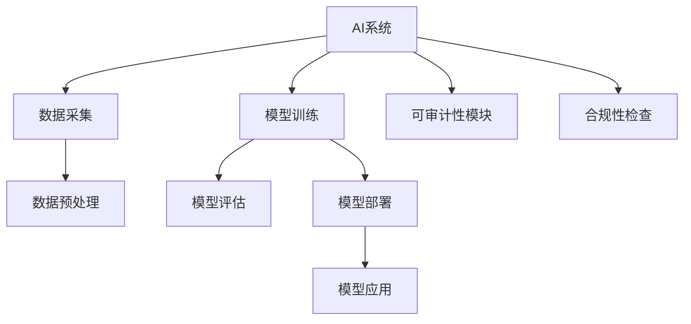

                 

# AI系统的可审计性与合规性设计

> 关键词：AI系统, 可审计性, 合规性, 数据隐私, 透明度, 可解释性

## 1. 背景介绍

随着人工智能(AI)技术的快速发展，其在医疗、金融、制造业、零售等多个领域的应用日益广泛。然而，AI系统的复杂性和黑箱性质也带来了新的挑战，如决策透明度不足、模型偏见、隐私泄露等问题。如何保障AI系统的可审计性和合规性，确保其应用的公平性、安全性和道德性，成为了一个重要的研究方向。

本博客将从可审计性和合规性的角度，对AI系统进行全面分析，并提出具体的技术和管理方案，以期为AI技术的负责任应用提供指导和参考。

## 2. 核心概念与联系

### 2.1 核心概念概述

在讨论AI系统的可审计性与合规性设计前，需要明确以下几个关键概念：

- **AI系统**：指使用机器学习、深度学习等技术构建的智能应用系统，如自然语言处理、计算机视觉、强化学习等。
- **可审计性(Auditability)**：指AI系统的决策过程、数据来源、模型训练等可以被透明地记录和追溯的能力，即系统的操作和结果能够被外部审查和验证。
- **合规性(Compliance)**：指AI系统在运行过程中需遵守的各种法律法规和行业标准，如数据保护法、反歧视法等。

### 2.2 核心概念原理和架构的 Mermaid 流程图



这个流程图展示了AI系统从数据采集、模型训练、评估和部署到应用的全过程，并强调了可审计性和合规性模块在整个流程中的作用。

## 3. 核心算法原理 & 具体操作步骤

### 3.1 算法原理概述

AI系统的可审计性和合规性设计，主要基于以下两个核心原理：

1. **数据透明度**：所有输入数据、模型参数、训练过程和输出结果都必须被记录和追溯，以供外部审查。
2. **合规性约束**：在AI系统的设计和运行过程中，需遵守相关的法律法规和行业标准，如数据隐私保护、反歧视等。

### 3.2 算法步骤详解

AI系统的可审计性和合规性设计，通常包括以下几个关键步骤：

1. **数据收集与标注**：
   - 确定数据收集的来源、格式、范围和频率。
   - 对数据进行预处理，包括去重、清洗、标准化等。
   - 对数据进行标注，定义明确的标注规则和标准。

2. **模型设计**：
   - 选择合适的算法和模型结构，进行超参数调优。
   - 对模型进行预训练和微调，以适应特定任务。
   - 对模型进行评估，包括准确率、召回率、F1值等指标。

3. **可审计性模块设计**：
   - 设计可审计性模块，记录数据输入、模型参数、训练日志和输出结果。
   - 确保日志和记录的完整性、准确性和可追溯性。
   - 设计日志的存储、访问和查询机制，方便外部审查。

4. **合规性检查**：
   - 根据行业标准和法律法规，对AI系统的数据使用、模型训练和应用进行合规性检查。
   - 使用合规性工具和框架，如GDPR合规工具、反歧视检测工具等。
   - 定期审计AI系统，确保其持续符合合规要求。

5. **透明度报告生成**：
   - 根据可审计性模块记录的数据，生成透明度报告。
   - 报告应包括数据来源、模型参数、训练过程、输出结果等关键信息。
   - 提供报告给相关利益方，包括监管机构、用户等。

### 3.3 算法优缺点

AI系统的可审计性和合规性设计的优点包括：

1. **增强信任**：通过透明化和可追溯性，增强用户和监管机构对AI系统的信任。
2. **降低风险**：避免数据泄露、模型偏见等潜在风险，提高AI系统的可靠性和安全性。
3. **促进公平**：通过合规性检查和透明度报告，确保AI系统的决策过程公平、公正。

其缺点主要体现在：

1. **技术复杂度**：设计和实现可审计性和合规性模块需要较高的技术门槛。
2. **资源消耗**：记录和存储日志、生成透明度报告等操作，会增加系统的资源消耗。
3. **隐私保护**：在收集和处理数据时，需严格遵守隐私保护法规，避免数据泄露。

### 3.4 算法应用领域

AI系统的可审计性和合规性设计，在多个领域都有广泛的应用，如：

- **医疗健康**：保障医疗数据的隐私和患者隐私权，确保AI辅助诊断系统的公平性和可靠性。
- **金融服务**：确保金融交易的透明性和合规性，避免模型偏见和数据泄露。
- **智能制造**：保障工业数据的安全性和合规性，确保AI预测和决策的透明性和可靠性。
- **智能客服**：记录和审查客户互动记录，确保AI客服系统的合规性和公正性。

## 4. 数学模型和公式 & 详细讲解 & 举例说明

### 4.1 数学模型构建

AI系统的可审计性和合规性设计，涉及多个数学模型和公式，以下以数据隐私保护为例进行详细讲解。

### 4.2 公式推导过程

假设有一组数据 $D=\{x_1,x_2,...,x_n\}$，其中 $x_i=(x_{i1},x_{i2},...,x_{im})$ 为 $m$ 维数据点。数据隐私保护的目标是确保数据在传输和存储过程中不被未授权者访问，使用差分隐私技术进行保护。差分隐私的数学定义为：

$$
\epsilon\text{-隐私保护} = \sum_{x\in\mathcal{X}}p(x)\log\frac{p(x)}{p'(x)} \leq \epsilon
$$

其中 $p$ 为原始数据分布，$p'$ 为经过隐私保护处理后的数据分布，$\epsilon$ 为隐私保护参数。

### 4.3 案例分析与讲解

以医疗数据隐私保护为例，假设医院希望使用AI系统对患者疾病进行预测，数据包含患者的年龄、性别、病历等敏感信息。为保护患者隐私，医院需对数据进行差分隐私处理，确保数据在处理后仍能被用于模型训练。具体步骤如下：

1. **数据预处理**：对患者数据进行匿名化，如去除身份证号码、住址等敏感信息。
2. **隐私保护处理**：使用Laplace机制或高斯机制对数据进行差分隐私处理。
3. **模型训练**：在差分隐私保护后的数据上训练AI模型。
4. **透明度报告**：生成差分隐私处理过程中的参数和日志，提供给监管机构审查。

## 5. 项目实践：代码实例和详细解释说明

### 5.1 开发环境搭建

在进行AI系统可审计性和合规性设计时，需要以下开发环境：

1. **Python**：主流编程语言，支持丰富的科学计算和数据处理库。
2. **Jupyter Notebook**：支持交互式编程和数据可视化。
3. **TensorFlow/Keras**：主流深度学习框架，支持模型的构建和训练。
4. **Pandas/Numpy**：数据处理和科学计算库。
5. **Flask/Django**：Web框架，支持Web服务的构建和部署。

### 5.2 源代码详细实现

以下是一个简单的AI系统可审计性设计的代码实现示例，使用TensorFlow和Flask实现：

```python
import tensorflow as tf
from flask import Flask, request, jsonify

# 创建Flask应用
app = Flask(__name__)

# 数据记录器
data_recorder = tf.keras.callbacks.CSVLogger('data.csv')

# 创建模型
model = tf.keras.Sequential([
    tf.keras.layers.Dense(64, activation='relu', input_shape=(100,)),
    tf.keras.layers.Dense(10, activation='softmax')
])

# 模型训练
model.compile(optimizer='adam', loss='categorical_crossentropy', metrics=['accuracy'])
model.fit(X_train, y_train, epochs=10, batch_size=32, callbacks=[data_recorder])

# 生成透明度报告
def generate_transparency_report(model, data_recorder):
    # 获取日志数据
    log_data = data_recorder.history
    # 生成透明度报告
    transparency_report = {
        'epoch': log_data['epoch'],
        'loss': log_data['loss'],
        'accuracy': log_data['accuracy']
    }
    return transparency_report

# 提供透明度报告API
@app.route('/transparency', methods=['GET'])
def transparency():
    report = generate_transparency_report(model, data_recorder)
    return jsonify(report)

# 运行Flask应用
if __name__ == '__main__':
    app.run(debug=True)
```

### 5.3 代码解读与分析

代码实现主要分为以下几个部分：

1. **环境搭建**：使用TensorFlow和Flask创建AI系统。
2. **数据记录**：使用CSVLogger记录模型训练的日志数据。
3. **模型训练**：定义并训练AI模型。
4. **透明度报告**：生成透明度报告，提供给用户和监管机构审查。
5. **Web服务**：使用Flask创建Web服务，提供透明度报告API。

通过此代码，可实现AI模型的可审计性设计，记录和提供模型的训练过程和结果。

### 5.4 运行结果展示

运行上述代码，即可在终端中看到模型训练的日志输出。同时，通过访问`http://localhost:5000/transparency`，可以获取透明度报告，供外部审查和验证。

## 6. 实际应用场景

### 6.1 医疗健康

在医疗健康领域，AI系统的可审计性和合规性设计尤为重要。医疗数据涉及患者隐私，任何数据泄露或不当使用都可能导致严重后果。因此，医疗AI系统必须严格遵守数据隐私保护法规，如HIPAA（健康保险可移植性和责任法案）。

### 6.2 金融服务

金融领域的数据隐私和安全问题同样重要。AI系统在金融交易、风险评估、欺诈检测等方面应用广泛，但其决策过程必须透明、合规。金融监管机构要求金融机构对其AI系统的数据使用和模型训练进行严格审查，以确保公平、公正和合规。

### 6.3 智能制造

在智能制造领域，AI系统用于预测设备维护、优化生产流程、自动化质检等任务。由于涉及大量企业内部数据，AI系统的可审计性和合规性设计至关重要。企业需确保数据的安全性和合规性，避免数据泄露和滥用。

### 6.4 智能客服

智能客服系统处理大量的客户咨询和反馈数据，涉及用户隐私和数据安全。AI系统的可审计性和合规性设计，确保了客户数据的保护和透明，提升了用户信任度。

## 7. 工具和资源推荐

### 7.1 学习资源推荐

1. **《数据隐私保护与差分隐私》**：详细讲解差分隐私技术的基本原理和应用案例。
2. **《机器学习中的可解释性》**：介绍可解释性技术在AI系统中的重要性及其实现方法。
3. **《数据隐私法律法规概览》**：总结各国数据隐私法律法规，帮助开发者了解合规性要求。
4. **Google TensorFlow Privacy API**：提供差分隐私和联邦学习的API，支持隐私保护技术的实现。
5. **Keras Explainer**：提供模型解释工具，帮助理解AI系统的决策过程。

### 7.2 开发工具推荐

1. **TensorFlow**：支持深度学习模型的构建和训练，提供差分隐私保护API。
2. **Keras**：提供简单易用的深度学习框架，支持模型解释和可解释性技术。
3. **Flask/Django**：提供Web服务框架，支持模型训练和透明度报告API的实现。
4. **PyTorch**：提供深度学习框架，支持可解释性技术和差分隐私保护。
5. **Pandas/Numpy**：提供数据处理和科学计算库，支持数据记录和透明度报告的生成。

### 7.3 相关论文推荐

1. **《差分隐私保护》**：研究差分隐私技术的理论基础和实际应用。
2. **《AI系统的可解释性》**：总结可解释性技术在AI系统中的实现方法。
3. **《数据隐私保护法规》**：总结各国数据隐私保护法律法规，帮助开发者了解合规性要求。
4. **《联邦学习》**：研究联邦学习在隐私保护和模型训练中的应用。
5. **《智能系统的可审计性》**：研究智能系统可审计性的实现方法和应用案例。

## 8. 总结：未来发展趋势与挑战

### 8.1 总结

AI系统的可审计性和合规性设计，是确保AI技术负责任应用的重要保障。通过数据透明度和合规性约束，AI系统能够实现决策透明、数据安全和公平公正，得到用户和监管机构的信任。本文从理论到实践，全面系统地介绍了AI系统的可审计性和合规性设计方法，提供了具体的技术和管理方案。

### 8.2 未来发展趋势

未来，AI系统的可审计性和合规性设计将呈现以下几个发展趋势：

1. **隐私保护技术创新**：差分隐私、联邦学习等隐私保护技术将不断进步，支持更加安全的AI系统设计。
2. **合规性框架完善**：各国和行业将不断完善AI系统的合规性框架，规范AI系统在各个领域的应用。
3. **模型透明化**：更多的模型解释和可解释性技术将被开发和应用，提升AI系统的透明度和可理解性。
4. **数据治理工具开发**：开发更多数据治理工具，帮助开发者对数据进行管理和保护。
5. **人工智能伦理建设**：加强AI伦理建设，推动AI技术在社会各领域的负责任应用。

### 8.3 面临的挑战

尽管AI系统的可审计性和合规性设计取得了一定的进展，但在实际应用中仍面临以下挑战：

1. **技术门槛高**：设计和实现可审计性和合规性模块需要较高的技术门槛，需要跨学科知识。
2. **资源消耗大**：记录和存储日志、生成透明度报告等操作，会增加系统的资源消耗，需要合理优化。
3. **隐私保护复杂**：隐私保护技术复杂，需在隐私保护和数据可用性之间找到平衡点。
4. **合规性监管难度大**：各国和行业对AI系统的合规性要求各异，需不断更新和调整合规性策略。
5. **伦理和公平性问题**：AI系统决策的公平性和伦理问题仍需进一步研究和解决。

### 8.4 研究展望

未来的研究需要在以下几个方面进行突破：

1. **隐私保护技术**：开发更加高效的隐私保护技术，支持更安全的AI系统设计。
2. **合规性框架**：完善AI系统的合规性框架，规范各行业的应用标准。
3. **模型透明化**：开发更多模型解释和可解释性技术，提升AI系统的透明度和可理解性。
4. **数据治理工具**：开发更多数据治理工具，帮助开发者对数据进行管理和保护。
5. **伦理和公平性**：加强AI伦理建设，推动AI技术在社会各领域的负责任应用。

## 9. 附录：常见问题与解答

**Q1: AI系统的可审计性设计是否适用于所有领域？**

A: AI系统的可审计性设计适用于大多数领域，但需根据具体应用场景进行适应性调整。例如，医疗领域需要特别关注患者隐私保护，金融领域需强调数据安全合规性。

**Q2: 如何平衡隐私保护和数据可用性？**

A: 在隐私保护和数据可用性之间找到平衡点，需要根据具体需求和数据特征进行设计。差分隐私、联邦学习等隐私保护技术可以提供一定程度的平衡。

**Q3: 如何确保AI系统的合规性？**

A: 需定期对AI系统进行合规性检查，使用合规性工具和框架，并根据行业标准和法律法规进行合规性调整。

**Q4: 如何提高AI系统的透明度？**

A: 记录和存储AI系统的数据输入、模型参数、训练过程和输出结果，定期生成透明度报告，并公开供外部审查。

**Q5: 如何处理AI系统的伦理和公平性问题？**

A: 在AI系统设计和应用过程中，需考虑伦理和公平性问题，确保模型决策的透明、公正和可解释性。

---

作者：禅与计算机程序设计艺术 / Zen and the Art of Computer Programming

