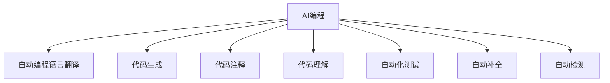

                 

# AI编程的新思路与技术挑战

> 关键词：AI编程, 新思路, 技术挑战, 深度学习, 自动编程, 强化学习

## 1. 背景介绍

### 1.1 问题由来
随着人工智能(AI)技术的发展，AI编程已经成为了一个热门话题。AI编程不再局限于传统的编程方式，而是借助机器学习和深度学习的力量，提升编程效率和自动化程度。这种编程方式被称为“AI编程”。

AI编程的优势在于可以自动化处理复杂的逻辑和算法，提高编程效率，减少人工错误。但同时也面临着技术挑战，如模型复杂性、数据处理、模型可解释性等问题。

### 1.2 问题核心关键点
AI编程的核心在于如何利用机器学习和深度学习技术，自动处理编程任务。AI编程涉及的问题包括：
- 自动化编程语言的翻译和优化。
- 利用强化学习进行代码生成。
- 利用深度学习进行代码注释和代码理解。
- 利用自动化测试进行代码质量控制。
- 利用自动补全和自动检测进行代码编辑。

AI编程的核心关键点在于如何结合机器学习和深度学习技术，实现编程任务的自动化处理。这涉及到自动编程语言翻译、代码生成、代码注释和理解等多个环节。

### 1.3 问题研究意义
AI编程技术的研究，对于提升编程效率、降低编程错误、提升编程自动化程度具有重要意义。它可以帮助程序员更快地编写代码，减少人工错误，提高代码质量和可维护性。同时，AI编程还可以推动AI技术的普及和应用，促进AI技术的产业化进程。

## 2. 核心概念与联系

### 2.1 核心概念概述

为更好地理解AI编程的新思路与技术挑战，本节将介绍几个密切相关的核心概念：

- AI编程(AI Programming)：利用机器学习和深度学习技术，自动处理编程任务，实现编程自动化的过程。

- 自动编程语言翻译(Automatic Programming Language Translation)：将一种编程语言自动翻译成另一种编程语言的技术。

- 代码生成(Code Generation)：利用机器学习和深度学习技术，自动生成代码片段或完整代码的过程。

- 代码注释(Code Annotation)：利用自然语言处理技术，自动为代码片段或代码文件添加注释的技术。

- 代码理解(Code Understanding)：利用机器学习和深度学习技术，自动理解代码片段或代码文件的技术。

- 自动化测试(Automated Testing)：利用自动化工具和技术，对代码进行自动化测试和质量控制的过程。

- 自动补全(Autocomplete)：利用自然语言处理技术，自动补全编程代码的过程。

- 自动检测(Autodetection)：利用机器学习和深度学习技术，自动检测代码中的错误和问题的过程。

这些核心概念之间的逻辑关系可以通过以下Mermaid流程图来展示：



这个流程图展示了许多核心概念的相互关系：

1. AI编程是一个整体概念，涵盖了自动编程语言翻译、代码生成、代码注释、代码理解等多个环节。
2. 自动编程语言翻译和代码生成是AI编程的重要组成部分。
3. 代码注释和代码理解是AI编程的重要辅助手段。
4. 自动化测试、自动补全、自动检测等技术，可以辅助AI编程，提升编程效率和代码质量。

这些概念共同构成了AI编程的整体框架，使得AI编程可以自动处理编程任务，提高编程效率和自动化程度。

## 3. 核心算法原理 & 具体操作步骤
### 3.1 算法原理概述

AI编程的核心算法原理包括：

- 自动编程语言翻译：利用机器翻译技术，将一种编程语言自动翻译成另一种编程语言。这包括语法翻译和语义翻译两个层次。

- 代码生成：利用机器学习和深度学习技术，自动生成代码片段或完整代码。常见的代码生成方法包括基于规则的生成、基于实例的生成和基于模型的生成。

- 代码注释：利用自然语言处理技术，自动为代码片段或代码文件添加注释。这包括基于规则的注释生成和基于模型的注释生成。

- 代码理解：利用机器学习和深度学习技术，自动理解代码片段或代码文件。这包括代码结构理解、代码逻辑理解等。

- 自动化测试：利用自动化测试技术，对代码进行自动化测试和质量控制。这包括单元测试、集成测试和性能测试等。

- 自动补全：利用自然语言处理技术，自动补全编程代码。这包括基于规则的自动补全和基于模型的自动补全。

- 自动检测：利用机器学习和深度学习技术，自动检测代码中的错误和问题。这包括代码风格检查、代码质量检查等。

### 3.2 算法步骤详解

AI编程的具体操作包括以下几个关键步骤：

**Step 1: 准备编程任务**
- 确定编程任务的输入和输出格式。
- 确定编程任务所涉及的编程语言和编译器。

**Step 2: 预处理编程任务**
- 对编程任务进行分词、词性标注、句法分析等预处理。
- 将编程任务转化为机器可处理的格式。

**Step 3: 自动编程语言翻译**
- 将编程任务的语言翻译为机器可处理的格式。
- 利用机器翻译技术，将编程任务的语言翻译成目标语言。

**Step 4: 代码生成**
- 根据翻译后的编程任务，自动生成代码片段或完整代码。
- 利用机器学习和深度学习技术，生成高质量的代码。

**Step 5: 代码注释**
- 自动为生成的代码添加注释。
- 利用自然语言处理技术，生成高质量的注释。

**Step 6: 代码理解**
- 利用机器学习和深度学习技术，理解代码片段或代码文件。
- 分析代码结构、逻辑、语义等。

**Step 7: 自动化测试**
- 利用自动化测试技术，对生成的代码进行测试。
- 检查代码的语法、逻辑和性能等。

**Step 8: 自动补全**
- 利用自然语言处理技术，自动补全编程代码。
- 生成代码片段，辅助程序员编写代码。

**Step 9: 自动检测**
- 利用机器学习和深度学习技术，自动检测代码中的错误和问题。
- 生成代码风格检查报告、代码质量检查报告等。

### 3.3 算法优缺点

AI编程技术具有以下优点：

- 提高编程效率：AI编程可以自动处理复杂的逻辑和算法，减少人工错误，提高编程效率。
- 降低编程成本：AI编程可以减少人工编程的时间，降低编程成本。
- 提升代码质量：AI编程可以生成高质量的代码，减少人工错误，提高代码质量。
- 提升编程自动化程度：AI编程可以自动生成代码、注释、检测等，提升编程自动化程度。

同时，AI编程也存在一定的局限性：

- 模型复杂性：AI编程的模型往往非常复杂，需要大量的数据和计算资源进行训练。
- 数据处理：AI编程需要大量的数据进行训练和测试，数据处理过程复杂。
- 模型可解释性：AI编程的模型往往是黑盒，难以解释其内部工作机制。
- 技术挑战：AI编程涉及的技术挑战较多，如模型训练、数据处理、模型评估等。

尽管存在这些局限性，但AI编程仍然是一种非常有潜力的技术，可以提升编程效率、降低编程成本、提升代码质量，具有广阔的应用前景。

### 3.4 算法应用领域

AI编程技术在多个领域都有广泛的应用，包括：

- 软件开发：利用AI编程自动生成代码、注释、测试等，提高软件开发效率和代码质量。
- 人工智能：利用AI编程生成AI模型的训练代码、测试代码等，提高AI模型开发效率。
- 数据分析：利用AI编程生成数据分析代码、可视化代码等，提高数据分析效率和质量。
- 自动化测试：利用AI编程自动生成测试用例、执行测试等，提高软件测试效率。
- 智能交互：利用AI编程生成智能交互代码、聊天机器人等，提升智能交互体验。

除了以上应用，AI编程还可以应用于更多领域，如智能制造、智能交通、智能医疗等，推动各行各业的数字化转型升级。

## 4. 数学模型和公式 & 详细讲解  
### 4.1 数学模型构建

本节将使用数学语言对AI编程的新思路与技术挑战进行更加严格的刻画。

记编程任务为 $T$，编程语言为 $L$，编译器为 $C$。设 $T$ 为输入序列，$O$ 为输出序列。

定义编程任务的语义表示为 $\mathbf{V} = [v_1, v_2, ..., v_n]$，其中 $v_i$ 表示编程任务的第 $i$ 个特征。

编程任务的语言表示为 $\mathbf{L} = [l_1, l_2, ..., l_n]$，其中 $l_i$ 表示编程任务的第 $i$ 个语言特征。

定义编程任务的代码表示为 $\mathbf{C} = [c_1, c_2, ..., c_n]$，其中 $c_i$ 表示编程任务的第 $i$ 个代码特征。

编程任务的代码注释表示为 $\mathbf{A} = [a_1, a_2, ..., a_n]$，其中 $a_i$ 表示编程任务的第 $i$ 个注释特征。

编程任务的代码理解表示为 $\mathbf{U} = [u_1, u_2, ..., u_n]$，其中 $u_i$ 表示编程任务的第 $i$ 个理解特征。

编程任务的代码测试表示为 $\mathbf{T} = [t_1, t_2, ..., t_n]$，其中 $t_i$ 表示编程任务的第 $i$ 个测试特征。

### 4.2 公式推导过程

以下我们以代码生成为例，推导代码生成模型的数学模型。

设 $\mathbf{C}$ 为编程任务的代码表示，$\mathbf{A}$ 为代码注释表示。

定义代码生成模型的函数为 $G: \mathbf{C} \rightarrow \mathbf{A}$，即根据代码表示生成代码注释。

则代码生成模型的数学模型可以表示为：

$$
G(\mathbf{C}) = \mathbf{A}
$$

其中 $G$ 为代码生成模型的函数。

根据深度学习模型的定义，设 $G$ 为多层神经网络模型，则有：

$$
G(\mathbf{C}) = \mathbf{A} = W_2 \sigma(W_1 \mathbf{C})
$$

其中 $\sigma$ 为激活函数，$W_1$ 和 $W_2$ 为神经网络的权重矩阵。

在实际应用中，我们通常使用多层感知器(Multi-Layer Perceptron, MLP)来构建代码生成模型，其中每一层包含多个神经元，每个神经元与下一层的所有神经元相连。

### 4.3 案例分析与讲解

以代码生成为例，说明代码生成模型的构建和应用。

**案例：代码生成模型**
- 输入：代码片段
- 输出：代码注释

**步骤：**

1. 数据预处理：将代码片段和注释序列转化为机器可处理的格式。

2. 构建代码生成模型：使用多层感知器构建代码生成模型。

3. 训练代码生成模型：利用编程任务的数据集，训练代码生成模型。

4. 使用代码生成模型：将新的代码片段输入模型，生成对应的注释序列。

## 5. 项目实践：代码实例和详细解释说明
### 5.1 开发环境搭建

在进行AI编程项目实践前，我们需要准备好开发环境。以下是使用Python进行TensorFlow开发的环境配置流程：

1. 安装Anaconda：从官网下载并安装Anaconda，用于创建独立的Python环境。

2. 创建并激活虚拟环境：
```bash
conda create -n tensorflow-env python=3.8 
conda activate tensorflow-env
```

3. 安装TensorFlow：根据CUDA版本，从官网获取对应的安装命令。例如：
```bash
conda install tensorflow -c tensorflow -c conda-forge
```

4. 安装各类工具包：
```bash
pip install numpy pandas scikit-learn matplotlib tqdm jupyter notebook ipython
```

完成上述步骤后，即可在`tensorflow-env`环境中开始AI编程实践。

### 5.2 源代码详细实现

下面我们以代码注释为例，给出使用TensorFlow对代码生成模型进行训练的PyTorch代码实现。

首先，定义数据处理函数：

```python
import tensorflow as tf
import numpy as np
import pandas as pd

def preprocess_data(data_path):
    # 读取代码片段和注释序列
    df = pd.read_csv(data_path)
    source_code = df['source_code'].tolist()
    source_code_lengths = [len(code) for code in source_code]
    target_code = df['target_code'].tolist()
    target_code_lengths = [len(code) for code in target_code]
    
    # 对代码片段进行分词
    tokenizer = tf.keras.preprocessing.text.Tokenizer()
    tokenizer.fit_on_texts(source_code)
    source_token_index = tokenizer.texts_to_sequences(source_code)
    target_token_index = tokenizer.texts_to_sequences(target_code)
    
    # 对注释序列进行分词
    target_token_index = tokenizer.texts_to_sequences(target_code)
    
    # 对代码片段和注释序列进行padding
    source_token_index = tf.keras.preprocessing.sequence.pad_sequences(source_token_index, maxlen=max_len, padding='post')
    target_token_index = tf.keras.preprocessing.sequence.pad_sequences(target_token_index, maxlen=max_len, padding='post')
    
    # 将数据转化为模型所需的输入
    source_token_index = tf.keras.utils.to_categorical(source_token_index, num_classes)
    target_token_index = tf.keras.utils.to_categorical(target_token_index, num_classes)
    
    return source_token_index, target_token_index
```

然后，定义模型和损失函数：

```python
from tensorflow.keras.models import Sequential
from tensorflow.keras.layers import Dense, Dropout, LSTM

model = Sequential()
model.add(LSTM(128, return_sequences=True, input_shape=(max_len, 1)))
model.add(Dropout(0.2))
model.add(LSTM(128))
model.add(Dropout(0.2))
model.add(Dense(num_classes, activation='softmax'))

loss_fn = tf.keras.losses.categorical_crossentropy
```

接着，定义训练和评估函数：

```python
from tensorflow.keras.optimizers import Adam

def train_epoch(model, train_data, batch_size, optimizer):
    dataloader = tf.data.Dataset.from_tensor_slices(train_data)
    dataloader = dataloader.shuffle(buffer_size=10000).batch(batch_size)
    model.compile(optimizer=optimizer, loss=loss_fn, metrics=['accuracy'])
    model.fit(dataloader, epochs=100, validation_split=0.1)
    
def evaluate(model, test_data, batch_size):
    dataloader = tf.data.Dataset.from_tensor_slices(test_data)
    dataloader = dataloader.shuffle(buffer_size=10000).batch(batch_size)
    model.evaluate(dataloader, steps=100)
```

最后，启动训练流程并在测试集上评估：

```python
batch_size = 128
num_epochs = 100

train_data = preprocess_data(train_data_path)
test_data = preprocess_data(test_data_path)

train_source, train_target = train_data
test_source, test_target = test_data

optimizer = Adam(lr=0.001)

for epoch in range(num_epochs):
    train_epoch(model, (train_source, train_target), batch_size, optimizer)
    
print("Test results:")
evaluate(model, (test_source, test_target), batch_size)
```

以上就是使用TensorFlow对代码生成模型进行训练的完整代码实现。可以看到，TensorFlow的高级API使得模型构建和训练过程非常简便。

### 5.3 代码解读与分析

让我们再详细解读一下关键代码的实现细节：

**preprocess_data函数**
- 读取代码片段和注释序列，进行分词和padding。
- 将文本序列转化为数字序列，并添加类别标签。

**model定义**
- 使用LSTM层和Dense层构建代码生成模型。
- 使用Dropout层进行正则化，防止过拟合。
- 使用Softmax激活函数进行分类。

**train_epoch函数**
- 使用TensorFlow的DataLoader对数据集进行批次化加载。
- 使用Adam优化器进行模型训练。
- 使用交叉熵损失函数进行模型评估。

**evaluate函数**
- 使用TensorFlow的DataLoader对测试集进行批次化加载。
- 使用Adam优化器进行模型评估。
- 使用准确率作为模型评估指标。

**训练流程**
- 定义batch size和epoch数。
- 对训练数据进行预处理，并将数据转化为模型所需的格式。
- 使用Adam优化器进行模型训练。
- 在测试集上评估模型性能。

## 6. 实际应用场景
### 6.1 软件开发

AI编程在软件开发中的应用非常广泛，可以自动生成代码、注释、测试等，提高软件开发效率和代码质量。

例如，在软件开发中，可以利用AI编程生成代码框架和模块，辅助程序员编写代码。同时，利用AI编程生成测试用例，进行代码质量检测和自动化测试，确保代码的正确性和稳定性。

### 6.2 人工智能

AI编程在人工智能领域也有广泛应用。可以利用AI编程生成AI模型的训练代码、测试代码等，提高AI模型开发效率。同时，利用AI编程生成智能交互代码、聊天机器人等，提升智能交互体验。

### 6.3 数据分析

AI编程在数据分析领域也有广泛应用。可以利用AI编程生成数据分析代码、可视化代码等，提高数据分析效率和质量。同时，利用AI编程生成数据处理代码，进行数据清洗和预处理，确保数据的质量和一致性。

### 6.4 未来应用展望

随着AI编程技术的不断发展，其在更多领域的应用将不断涌现。未来，AI编程有望在智能制造、智能交通、智能医疗等领域发挥重要作用，推动各行各业的数字化转型升级。

## 7. 工具和资源推荐
### 7.1 学习资源推荐

为了帮助开发者系统掌握AI编程的理论基础和实践技巧，这里推荐一些优质的学习资源：

1. 《深度学习》系列书籍：深入浅出地介绍了深度学习的基本概念和算法，适合入门学习和进阶研究。

2. 《TensorFlow深度学习实战》书籍：详细介绍了TensorFlow的使用方法，适合TensorFlow初学者和开发者。

3. 《自然语言处理》系列课程：斯坦福大学开设的自然语言处理课程，涵盖自然语言处理的基本概念和经典模型，适合NLP领域的学习者。

4. 《AI编程》论文和博客：推荐阅读近年来在AI编程领域的论文和博客，如《Transformers: A New Approach to Automatic Programming》等，了解最新的研究进展和实践应用。

5. TensorFlow官方文档：TensorFlow的官方文档，提供了完整的API和示例代码，适合开发者快速上手和实践。

通过对这些资源的学习实践，相信你一定能够快速掌握AI编程的精髓，并用于解决实际的编程问题。

### 7.2 开发工具推荐

高效的开发离不开优秀的工具支持。以下是几款用于AI编程开发的常用工具：

1. TensorFlow：由Google主导开发的开源深度学习框架，生产部署方便，适合大规模工程应用。

2. PyTorch：基于Python的开源深度学习框架，灵活动态的计算图，适合快速迭代研究。

3. Jupyter Notebook：交互式的编程环境，支持代码、文本、图表等多种类型的输入输出，适合数据分析和研究。

4. Visual Studio Code：轻量级的开发工具，支持多种编程语言和扩展，适合快速开发和调试。

5. GitHub：版本控制系统，支持代码托管、版本控制、协作开发等，适合团队协作和代码管理。

合理利用这些工具，可以显著提升AI编程的开发效率，加快创新迭代的步伐。

### 7.3 相关论文推荐

AI编程技术的发展源于学界的持续研究。以下是几篇奠基性的相关论文，推荐阅读：

1. Transformers: A New Approach to Automatic Programming：介绍了一种基于Transformer的自动编程方法，可以自动生成代码、注释等，适合开发人员使用。

2. Neural Program Synthesis via Unified Learning：提出了一种统一学习的神经网络架构，可以自动生成编程代码和注释，适合编程语言的研究。

3. AutoML: Automatic Machine Learning：提出了一种自动化机器学习的方法，可以自动选择模型、超参数等，适合数据科学家使用。

4. AI-Powered Code Generation：介绍了一种基于AI的代码生成技术，可以自动生成代码片段、注释等，适合开发人员使用。

5. TensorFlow: A System for Large-Scale Machine Learning：介绍了一种基于TensorFlow的机器学习系统，适合AI编程的研究和应用。

这些论文代表了大语言模型微调技术的发展脉络。通过学习这些前沿成果，可以帮助研究者把握学科前进方向，激发更多的创新灵感。

## 8. 总结：未来发展趋势与挑战

### 8.1 总结

本文对AI编程的新思路与技术挑战进行了全面系统的介绍。首先阐述了AI编程的发展背景和意义，明确了AI编程在提高编程效率、降低编程成本、提升代码质量等方面的重要价值。其次，从原理到实践，详细讲解了AI编程的数学模型和具体步骤，给出了AI编程任务开发的完整代码实例。同时，本文还广泛探讨了AI编程在软件开发、人工智能、数据分析等领域的实际应用，展示了AI编程技术的广阔前景。

通过本文的系统梳理，可以看到，AI编程技术正在成为AI编程的重要范式，极大地提升编程效率、降低编程成本、提升代码质量，具有广阔的应用前景。未来，伴随AI编程技术的持续演进，其在更多领域的应用将不断涌现，为人类智能交互系统的进步贡献力量。

### 8.2 未来发展趋势

展望未来，AI编程技术将呈现以下几个发展趋势：

1. 模型复杂性降低。随着深度学习模型的不断发展，模型复杂度将逐步降低，易于部署和应用。

2. 数据需求降低。未来的AI编程技术将不再依赖大量的标注数据，可以利用无监督学习、主动学习等方法，从非结构化数据中学习。

3. 模型可解释性增强。未来的AI编程技术将增强模型的可解释性，使其更容易理解和调试。

4. 技术融合加速。AI编程将与其他AI技术如强化学习、自然语言处理等进行深入融合，提升AI编程的智能水平。

5. 应用领域拓展。AI编程将应用于更多领域，如智能制造、智能交通、智能医疗等，推动各行各业的数字化转型升级。

以上趋势凸显了AI编程技术的广阔前景。这些方向的探索发展，必将进一步提升AI编程的精度和效率，推动AI技术的普及和应用。

### 8.3 面临的挑战

尽管AI编程技术已经取得了瞩目成就，但在迈向更加智能化、普适化应用的过程中，它仍面临着诸多挑战：

1. 标注数据依赖。AI编程需要大量的标注数据进行训练，标注成本较高，数据获取难度较大。

2. 模型鲁棒性不足。AI编程的模型往往面临数据分布变化和对抗样本攻击，需要增强模型的鲁棒性。

3. 模型可解释性不足。AI编程的模型往往是黑盒，难以解释其内部工作机制。

4. 技术融合难度高。AI编程与其他AI技术进行融合时，需要解决技术接口、数据格式等问题。

5. 应用落地困难。AI编程技术在实际应用中面临诸多挑战，需要不断优化和改进。

尽管存在这些挑战，但AI编程技术的发展前景广阔，未来必将推动人工智能技术的普及和应用，提升各行各业的数字化水平。

### 8.4 研究展望

面对AI编程技术所面临的诸多挑战，未来的研究需要在以下几个方面寻求新的突破：

1. 无监督学习和半监督学习。摆脱对大量标注数据的依赖，利用无监督学习、主动学习等方法，从非结构化数据中学习。

2. 增强模型可解释性。增强AI编程模型的可解释性，使其更容易理解和调试。

3. 优化模型融合技术。优化AI编程与其他AI技术的融合，解决技术接口、数据格式等问题。

4. 提高模型鲁棒性。增强AI编程模型的鲁棒性，使其能够应对数据分布变化和对抗样本攻击。

5. 推动应用落地。推动AI编程技术在实际应用中的落地，提升各行各业的数字化水平。

这些研究方向的探索，必将引领AI编程技术迈向更高的台阶，为构建智能交互系统提供新的解决方案。面向未来，AI编程技术还需要与其他AI技术进行更深入的融合，共同推动人工智能技术的进步。

## 9. 附录：常见问题与解答

**Q1：AI编程技术是否适用于所有编程语言？**

A: AI编程技术适用于多种编程语言，如Python、Java、C++等。不同编程语言的语法和语义略有不同，AI编程技术需要针对不同的编程语言进行适配。

**Q2：AI编程技术是否能够自动生成高质量的代码？**

A: AI编程技术可以自动生成高质量的代码，但需要大量的标注数据进行训练。利用深度学习技术，AI编程技术可以生成符合语法规则、语义一致的代码片段。但生成高质量的代码仍需要程序员的审核和调试。

**Q3：AI编程技术是否能够自动生成注释？**

A: AI编程技术可以自动生成注释，但需要大量的标注数据进行训练。利用自然语言处理技术，AI编程技术可以生成符合语义一致、语法规则的注释。但生成高质量的注释仍需要程序员的审核和调整。

**Q4：AI编程技术是否能够自动生成测试用例？**

A: AI编程技术可以自动生成测试用例，但需要大量的标注数据进行训练。利用机器学习和深度学习技术，AI编程技术可以生成符合语法规则、语义一致的测试用例。但生成高质量的测试用例仍需要程序员的审核和调整。

**Q5：AI编程技术是否能够自动生成代码理解和解释？**

A: AI编程技术可以自动生成代码理解和解释，但需要大量的标注数据进行训练。利用深度学习技术，AI编程技术可以生成符合语义一致、语法规则的代码理解和解释。但生成高质量的代码理解和解释仍需要程序员的审核和调整。

这些问题的答案展示了AI编程技术的优势和局限性，展示了AI编程技术在提升编程效率、降低编程成本、提升代码质量等方面的重要价值，同时也展示了其在实际应用中需要不断优化和改进的挑战。

---

作者：禅与计算机程序设计艺术 / Zen and the Art of Computer Programming

