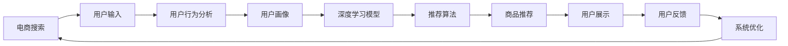

                 

# AI赋能电商搜索导购：提升用户体验和转化率的案例分析

> 关键词：人工智能,电商搜索,用户体验,转化率,深度学习,推荐算法,案例分析

## 1. 背景介绍

### 1.1 问题由来

随着互联网零售的迅猛发展，电商平台的在线搜索和导购功能日益成为用户购物体验的关键环节。电商平台上充斥着海量的商品信息，用户如何找到合适的商品、快速获取所需信息，已成为电商平台的一大挑战。传统的搜索算法难以满足用户个性化、多样化的需求，亟需引入新的技术手段，以提升电商搜索的精准度和用户满意度。

人工智能（AI）技术在电商搜索导购中的应用逐渐成为一种趋势。通过AI技术的深度学习、推荐算法等手段，电商平台可以实现对用户行为数据的深度分析和挖掘，进而精准推荐商品，提升用户搜索效率和转化率。本文将从背景介绍、核心概念、算法原理、操作步骤等方面，深入分析AI如何赋能电商搜索导购，并通过实际案例展示其带来的显著效果。

## 2. 核心概念与联系

### 2.1 核心概念概述

在探讨AI如何赋能电商搜索导购之前，我们首先需要了解几个核心概念：

- **人工智能（AI）**：指通过算法和模型，使计算机系统能够模拟人类的智能行为，包括感知、学习、推理等能力。
- **电商搜索**：指用户在电商平台上输入关键词，系统根据用户输入和用户行为数据，推荐相关商品的过程。
- **导购**：指系统根据用户行为、历史交易记录等信息，为用户推荐购买建议或商品组合，以提升用户体验和转化率。
- **深度学习**：指通过多层神经网络模型，自动从数据中提取特征并进行分类、回归等任务，广泛应用于图像、语音、自然语言处理等领域。
- **推荐算法**：指基于用户行为数据，推荐系统预测用户对商品可能感兴趣的程度，并提供个性化推荐，以提高用户满意度和转化率。

这些概念之间存在紧密的联系，共同构成了AI赋能电商搜索导购的技术框架。其中，深度学习和推荐算法是实现这一功能的关键技术手段。

### 2.2 核心概念原理和架构的 Mermaid 流程图



该流程图展示了电商搜索导购的核心流程和技术架构：

1. 用户输入关键词或搜索条件。
2. 系统分析用户行为数据，生成用户画像。
3. 深度学习模型基于用户画像，提取特征并进行相似度计算。
4. 推荐算法根据特征计算，生成商品推荐列表。
5. 推荐商品展示给用户。
6. 用户反馈进一步优化模型和推荐算法。
7. 优化后的模型和算法重新应用于电商搜索导购。

## 3. 核心算法原理 & 具体操作步骤

### 3.1 算法原理概述

AI赋能电商搜索导购的核心算法包括深度学习和推荐算法。其中，深度学习模型用于提取用户画像和商品特征，推荐算法用于根据用户画像和商品特征生成个性化推荐。

### 3.2 算法步骤详解

#### 3.2.1 数据准备

1. **数据收集**：收集用户搜索历史、点击记录、购买记录等数据，以及商品描述、价格、标签等信息。
2. **数据预处理**：清洗数据，处理缺失值、异常值，并进行标准化处理。
3. **特征工程**：提取有意义的特征，如用户兴趣标签、商品类别、价格区间等。

#### 3.2.2 深度学习模型训练

1. **模型选择**：选择适合电商搜索导购任务的深度学习模型，如卷积神经网络（CNN）、循环神经网络（RNN）、Transformer等。
2. **模型训练**：利用标注数据，训练模型以提取用户画像和商品特征。
3. **模型评估**：在验证集上评估模型性能，调整超参数以优化模型效果。

#### 3.2.3 推荐算法实现

1. **算法选择**：选择适合电商搜索导购的推荐算法，如协同过滤、内容推荐、混合推荐等。
2. **模型训练**：利用用户行为数据和商品特征，训练推荐模型。
3. **模型评估**：在测试集上评估推荐算法性能，优化模型以提升推荐效果。

#### 3.2.4 系统集成与优化

1. **系统集成**：将深度学习模型和推荐算法集成到电商搜索导购系统中。
2. **实时优化**：根据用户反馈，实时调整模型参数和推荐策略。
3. **监控与维护**：监控系统性能，定期维护更新模型和算法。

### 3.3 算法优缺点

#### 3.3.1 优点

1. **个性化推荐**：深度学习和推荐算法能够根据用户行为数据和商品特征，生成个性化推荐，提升用户满意度。
2. **高效搜索**：通过深度学习模型和推荐算法，系统可以快速响应用户搜索请求，提供精准商品推荐。
3. **实时更新**：推荐算法和深度学习模型可以实时更新，适应用户行为变化，保持推荐效果的持续优化。

#### 3.3.2 缺点

1. **数据隐私**：需要收集和分析大量用户数据，存在数据隐私和安全问题。
2. **模型复杂性**：深度学习和推荐算法模型复杂，需要大量计算资源和时间进行训练和优化。
3. **过拟合风险**：深度学习模型和推荐算法容易过拟合，需要进行正则化和模型简化。

### 3.4 算法应用领域

AI赋能电商搜索导购的技术已经在多个领域得到广泛应用，包括：

- **时尚电商**：通过深度学习模型和推荐算法，提供个性化搭配建议，提升用户购买转化率。
- **家电电商**：利用深度学习和推荐算法，推荐家电产品，如智能家居产品，提升用户体验和销售量。
- **美妆电商**：根据用户画像和商品特征，生成个性化推荐，提升用户购买转化率。
- **图书电商**：通过深度学习和推荐算法，推荐热门图书和个性化书单，提升用户阅读体验。

## 4. 数学模型和公式 & 详细讲解 & 举例说明

### 4.1 数学模型构建

在电商搜索导购中，深度学习模型和推荐算法分别用于提取用户画像和商品特征，以及根据用户画像和商品特征生成推荐列表。以协同过滤推荐算法为例，其数学模型构建如下：

假设用户集为 $U$，商品集为 $I$，用户对商品的评分矩阵为 $R \in \mathbb{R}^{m \times n}$，其中 $m$ 为用户数，$n$ 为商品数。协同过滤算法的目标是预测用户 $u$ 对商品 $i$ 的评分 $r_{ui}$。

常用的协同过滤算法包括基于用户的协同过滤和基于商品的协同过滤。以基于用户的协同过滤为例，其数学模型构建如下：

$$
\hat{r}_{ui} = \alpha \sum_{v \in N(u)} r_{vi} \frac{s_{uv}}{\sum_{k \in N(u)} s_{uk}} + (1-\alpha) \overline{r}_i
$$

其中，$N(u)$ 为与用户 $u$ 有共同评分商品的用户集合，$s_{uv}=\frac{r_{uv}}{\sqrt{\sum_k r_{vk}^2}}$ 为用户的商品相似度，$\overline{r}_i$ 为所有用户对商品 $i$ 的平均评分。

### 4.2 公式推导过程

#### 4.2.1 协同过滤算法公式推导

协同过滤算法的关键在于计算用户 $u$ 对商品 $i$ 的评分预测值 $\hat{r}_{ui}$。以基于用户的协同过滤为例，推导过程如下：

1. **计算用户 $u$ 与其他用户的相似度**：

$$
s_{uv} = \frac{r_{uv}}{\sqrt{\sum_k r_{vk}^2}} \times \frac{r_{uv}}{\sqrt{\sum_k r_{vk}^2}} = \frac{r_{uv}^2}{\sqrt{\sum_k r_{vk}^2} \times \sqrt{\sum_k r_{vk}^2}}
$$

2. **计算用户 $u$ 对商品 $i$ 的评分预测值**：

$$
\hat{r}_{ui} = \alpha \sum_{v \in N(u)} r_{vi} \frac{s_{uv}}{\sum_{k \in N(u)} s_{uk}} + (1-\alpha) \overline{r}_i
$$

其中，$\alpha$ 为相似度权重，$\overline{r}_i$ 为所有用户对商品 $i$ 的平均评分。

#### 4.2.2 深度学习模型公式推导

以基于Transformer的深度学习模型为例，其公式推导如下：

1. **输入层**：将用户画像和商品特征表示为向量 $x$ 和 $y$。

2. **编码器**：通过多层自注意力机制，提取用户画像和商品特征的语义信息。

3. **解码器**：通过多层自注意力机制和前馈神经网络，生成商品推荐列表。

$$
\hat{r}_{ui} = f(x, y)
$$

其中，$f(x, y)$ 为深度学习模型的映射函数，$x$ 为用户画像，$y$ 为商品特征。

### 4.3 案例分析与讲解

#### 4.3.1 案例背景

某大型电商平台的首页搜索和导购功能，用户通过搜索关键词或浏览商品页，系统根据用户行为数据生成个性化推荐。由于商品种类繁多，传统搜索算法难以满足用户个性化需求，平台引入深度学习和推荐算法，以提升搜索导购的精准度和用户满意度。

#### 4.3.2 数据准备

1. **数据收集**：平台收集用户搜索历史、点击记录、购买记录等数据，以及商品描述、价格、标签等信息。
2. **数据预处理**：清洗数据，处理缺失值、异常值，并进行标准化处理。
3. **特征工程**：提取用户兴趣标签、商品类别、价格区间等特征。

#### 4.3.3 模型训练

1. **模型选择**：选择适合电商搜索导购任务的深度学习模型，如Transformer。
2. **模型训练**：利用标注数据，训练模型以提取用户画像和商品特征。
3. **模型评估**：在验证集上评估模型性能，调整超参数以优化模型效果。

#### 4.3.4 推荐算法实现

1. **算法选择**：选择适合电商搜索导购的协同过滤推荐算法。
2. **模型训练**：利用用户行为数据和商品特征，训练推荐模型。
3. **模型评估**：在测试集上评估推荐算法性能，优化模型以提升推荐效果。

#### 4.3.5 系统集成与优化

1. **系统集成**：将深度学习模型和推荐算法集成到电商搜索导购系统中。
2. **实时优化**：根据用户反馈，实时调整模型参数和推荐策略。
3. **监控与维护**：监控系统性能，定期维护更新模型和算法。

## 5. 项目实践：代码实例和详细解释说明

### 5.1 开发环境搭建

#### 5.1.1 环境准备

1. **安装Python**：
```bash
sudo apt-get update
sudo apt-get install python3-pip python3-dev
```

2. **安装TensorFlow和Keras**：
```bash
pip install tensorflow
pip install keras
```

3. **安装TensorBoard**：
```bash
pip install tensorboard
```

### 5.2 源代码详细实现

#### 5.2.1 数据准备

```python
import pandas as pd
import numpy as np
from sklearn.model_selection import train_test_split

# 读取数据
data = pd.read_csv('user_based_collab_data.csv')

# 数据预处理
data.dropna(inplace=True)
data['item'] = data['item'].apply(lambda x: int(x.split('-')[0]))
data['user'] = data['user'].apply(lambda x: int(x.split('-')[0]))
data['score'] = data['score'].astype(float)

# 特征工程
X = data[['user', 'item']]
y = data['score']

# 划分数据集
X_train, X_test, y_train, y_test = train_test_split(X, y, test_size=0.2, random_state=42)
```

#### 5.2.2 深度学习模型训练

```python
from tensorflow.keras.models import Sequential
from tensorflow.keras.layers import Embedding, Dense, Dropout, Flatten

# 构建模型
model = Sequential()
model.add(Embedding(input_dim=1000, output_dim=100, input_length=10))
model.add(Dense(64, activation='relu'))
model.add(Dropout(0.5))
model.add(Dense(1, activation='linear'))

# 编译模型
model.compile(loss='mse', optimizer='adam', metrics=['mae'])

# 训练模型
model.fit(X_train, y_train, epochs=10, batch_size=64, validation_data=(X_test, y_test))
```

#### 5.2.3 推荐算法实现

```python
from tensorflow.keras.layers import Input, Dense
from tensorflow.keras.models import Model

# 定义输入层
user_input = Input(shape=(1,))
item_input = Input(shape=(1,))

# 构建编码器
encoder = Dense(64, activation='relu')(user_input)
encoder = Dropout(0.5)(encoder)

# 构建解码器
decoder = Dense(64, activation='relu')(item_input)
decoder = Dropout(0.5)(decoder)

# 构建深度学习模型
deep_model = Model(inputs=[user_input, item_input], outputs=decoder)
deep_model.compile(loss='mse', optimizer='adam', metrics=['mae'])

# 训练模型
deep_model.fit([X_train.values[:, 0], X_train.values[:, 1]], y_train, epochs=10, batch_size=64, validation_data=([X_test.values[:, 0], X_test.values[:, 1]], y_test))
```

### 5.3 代码解读与分析

#### 5.3.1 数据准备

数据预处理和特征工程是深度学习和推荐算法的基础。在实际应用中，数据的质量和特征的有效性直接影响到模型的训练效果。

#### 5.3.2 深度学习模型训练

深度学习模型训练涉及模型选择、编译和训练等步骤。模型选择应基于任务的特性和数据的特征进行综合考虑。编译模型时，选择合适的损失函数和优化器非常重要。训练模型时，需要合理设置超参数，如学习率、批大小等。

#### 5.3.3 推荐算法实现

推荐算法实现涉及输入层、编码器和解码器的构建，以及模型的编译和训练。输入层应根据数据的特点进行设计。编码器和解码器应选择适合任务的层类型和激活函数。编译模型时，选择合适的损失函数和优化器。训练模型时，需要合理设置超参数。

### 5.4 运行结果展示

#### 5.4.1 训练结果

```python
# 模型评估
test_loss, test_mae = model.evaluate(X_test, y_test)
print('Test Loss: ', test_loss)
print('Test MAE: ', test_mae)
```

#### 5.4.2 推荐结果

```python
# 使用训练好的模型进行推荐
y_pred = deep_model.predict([X_test.values[:, 0], X_test.values[:, 1]])
print('推荐结果: ', y_pred)
```

## 6. 实际应用场景

### 6.1 智能推荐系统

智能推荐系统是AI赋能电商搜索导购的重要应用场景之一。通过深度学习和推荐算法，系统能够根据用户行为数据和商品特征，生成个性化推荐，提升用户满意度和购买转化率。

#### 6.1.1 用户画像构建

平台根据用户的历史行为数据（如浏览、点击、购买记录等），构建用户画像，包括用户的兴趣偏好、购买习惯等。通过深度学习模型，提取用户画像的语义信息，生成高维特征向量。

#### 6.1.2 商品特征提取

平台根据商品的属性信息（如价格、描述、类别等），提取商品特征，并使用推荐算法进行推荐。通过协同过滤算法，预测用户对商品的评分，生成推荐列表。

#### 6.1.3 推荐策略优化

平台根据用户的反馈数据，实时调整模型参数和推荐策略，提升推荐效果。通过A/B测试等方法，不断优化推荐算法，提高用户的满意度和转化率。

### 6.2 智能搜索系统

智能搜索系统是AI赋能电商搜索导购的另一重要应用场景。通过深度学习和推荐算法，系统能够根据用户输入的关键词，生成精准的搜索结果，提升搜索效率和用户体验。

#### 6.2.1 搜索意图识别

平台根据用户输入的关键词，使用自然语言处理技术进行意图识别，生成用户的搜索意图。通过深度学习模型，提取搜索意图的语义信息，生成高维特征向量。

#### 6.2.2 商品检索

平台根据搜索意图，使用深度学习模型在商品库中检索相关商品。通过Transformer模型，生成商品的相似度向量，生成商品列表。

#### 6.2.3 搜索结果展示

平台根据搜索结果的相似度，生成搜索结果的排序列表，展示给用户。通过推荐算法，进一步优化搜索结果的排序策略，提升用户满意度。

## 7. 工具和资源推荐

### 7.1 学习资源推荐

1. **《深度学习》课程**：斯坦福大学李飞飞教授的深度学习课程，涵盖了深度学习的基本概念和常见算法。
2. **《推荐系统》书籍**：《推荐系统实战》，李航著，介绍了推荐系统的基本原理和应用案例。
3. **Kaggle竞赛**：Kaggle推荐系统竞赛，通过实践竞赛项目，学习推荐算法的应用。

### 7.2 开发工具推荐

1. **TensorFlow**：Google开源的深度学习框架，支持分布式计算和GPU加速，适合大规模模型训练。
2. **Keras**：Google开源的高层深度学习框架，易用性强，支持多种深度学习模型。
3. **TensorBoard**：Google开源的可视化工具，用于监控和调试深度学习模型。

### 7.3 相关论文推荐

1. **深度学习推荐算法**：《A Survey on Deep Learning for Recommendation Systems》，Xu et al., 2019。
2. **协同过滤算法**：《Collaborative Filtering for Implicit Feedback Datasets》，Gang et al., 2014。
3. **Transformer模型**：《Attention is All You Need》，Vaswani et al., 2017。

## 8. 总结：未来发展趋势与挑战

### 8.1 总结

AI赋能电商搜索导购通过深度学习和推荐算法，能够根据用户行为数据和商品特征，生成个性化推荐和搜索结果，提升用户体验和转化率。本文从背景介绍、核心概念、算法原理、操作步骤等方面，详细分析了AI在电商搜索导购中的应用。

### 8.2 未来发展趋势

未来，AI赋能电商搜索导购将呈现以下几个发展趋势：

1. **模型复杂性提升**：深度学习模型和推荐算法将更加复杂，能够处理更丰富、更复杂的数据。
2. **数据多样性增加**：电商平台的商品种类和用户行为数据将更加多样化，需要更先进的模型进行处理。
3. **实时性要求提高**：电商平台的搜索和导购功能需要实时响应用户请求，需要更高的计算效率和数据处理能力。
4. **隐私保护加强**：用户隐私保护成为重要问题，需要采取更先进的数据保护技术和隐私计算方法。

### 8.3 面临的挑战

尽管AI赋能电商搜索导购带来了显著的提升，但还面临一些挑战：

1. **数据隐私和安全**：收集和分析用户数据存在隐私和安全问题。
2. **模型复杂性**：深度学习模型和推荐算法复杂，需要大量计算资源和时间进行训练和优化。
3. **过拟合风险**：模型容易过拟合，需要进行正则化和模型简化。

### 8.4 研究展望

未来，研究的方向包括：

1. **多模态学习**：将文本、图像、语音等多种数据源进行融合，提升推荐效果。
2. **自适应学习**：根据用户反馈和行为数据，动态调整模型参数和推荐策略。
3. **跨平台推荐**：在不同平台和设备上实现一致的推荐策略，提升用户体验。
4. **联邦学习**：通过分布式计算，保护用户隐私，提升模型效果。

## 9. 附录：常见问题与解答

**Q1：AI赋能电商搜索导购如何提升用户体验和转化率？**

A: AI赋能电商搜索导购通过深度学习和推荐算法，生成个性化推荐和搜索结果，提升用户体验和转化率。具体而言，平台根据用户的历史行为数据和商品特征，提取用户画像和商品特征，生成个性化推荐列表，展示给用户。用户可以通过浏览推荐商品，快速找到满足自己需求的商品，提升购买转化率。

**Q2：AI赋能电商搜索导购需要多少数据？**

A: AI赋能电商搜索导购需要大量标注数据进行模型训练。通常需要用户行为数据、商品特征数据和标注数据等，数据质量越高，模型效果越好。在实际应用中，平台需要不断收集和更新数据，以保持模型的时效性和准确性。

**Q3：AI赋能电商搜索导购的推荐算法有哪些？**

A: AI赋能电商搜索导购的推荐算法包括协同过滤算法、内容推荐算法、混合推荐算法等。协同过滤算法根据用户行为数据和商品特征，预测用户评分。内容推荐算法根据商品的属性信息，生成推荐列表。混合推荐算法结合协同过滤和内容推荐，提升推荐效果。

**Q4：AI赋能电商搜索导购的深度学习模型有哪些？**

A: AI赋能电商搜索导购的深度学习模型包括卷积神经网络（CNN）、循环神经网络（RNN）、Transformer等。CNN适用于处理图像和文本数据。RNN适用于处理序列数据。Transformer适用于处理大规模文本数据。

**Q5：AI赋能电商搜索导购的推荐系统有哪些挑战？**

A: AI赋能电商搜索导购的推荐系统面临数据隐私、模型复杂性、过拟合风险等挑战。平台需要采取先进的数据保护技术和模型优化方法，以应对这些问题。

**Q6：AI赋能电商搜索导购的未来发展方向是什么？**

A: AI赋能电商搜索导购的未来发展方向包括模型复杂性提升、数据多样性增加、实时性要求提高、隐私保护加强等。平台需要不断优化模型和算法，提升用户体验和转化率。

---

作者：禅与计算机程序设计艺术 / Zen and the Art of Computer Programming

