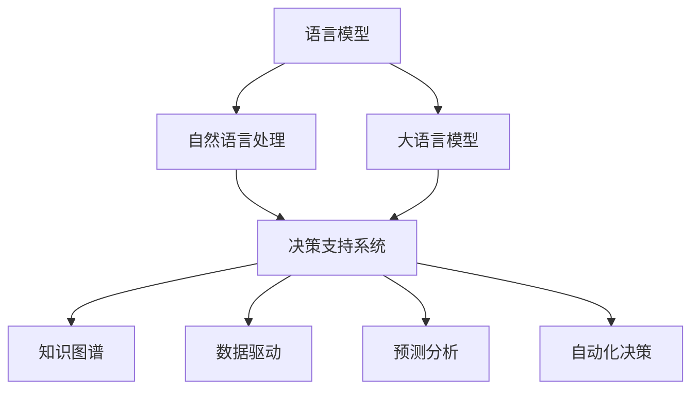

                 

# AI辅助决策：LLM在企业管理中的应用前景

> 关键词：
- 人工智能
- 语言模型
- 自然语言处理
- 企业管理
- 决策支持系统
- 知识图谱
- 数据驱动
- 预测分析
- 自动化决策

## 1. 背景介绍

### 1.1 问题由来

在当今快速变化的市场环境中，企业需要做出快速、精准的决策以保持竞争优势。传统的基于经验的决策方法往往无法适应复杂的商业环境，而数据驱动的决策支持系统（DSS）正成为企业提升决策效率的关键工具。然而，传统的DSS系统依赖于规则化和模式化的方法，难以应对结构化和非结构化数据的复杂混合，以及实时动态数据的变化。

语言模型（Language Model, LM）作为人工智能（AI）领域的核心技术，近年来在自然语言处理（Natural Language Processing, NLP）中取得了显著进展。大语言模型（Large Language Model, LLM），如GPT-3、BERT等，已经在文本生成、问答、翻译等多个领域展示了强大的能力。本文探讨了LLM在企业管理中的应用前景，特别是其作为决策辅助工具的可能性。

### 1.2 问题核心关键点

LLM在企业管理中的应用核心关键点在于以下几个方面：

- **数据处理能力**：LLM能够处理和分析大量的文本数据，识别其中的关键信息和模式。
- **上下文理解**：LLM在理解语境和上下文方面表现出色，能够更好地进行信息整合和推理。
- **多任务处理**：LLM能够同时处理多个任务，如市场分析、财务预测、客户服务等。
- **实时响应**：通过在线方式部署LLM，企业可以实现对市场变化的实时响应。
- **易用性和可扩展性**：LLM通常具有较高的易用性和可扩展性，易于集成到现有的企业系统中。

这些关键点使得LLM成为企业管理中潜在的强大工具，能够提升决策支持系统的智能化水平，辅助企业做出更优的商业决策。

### 1.3 问题研究意义

LLM在企业管理中的应用研究具有重要意义：

1. **提升决策效率**：通过智能化的决策支持，企业能够更快、更准确地响应市场变化，提升竞争优势。
2. **优化资源配置**：LLM能够分析内部和外部数据，帮助企业优化资源配置，提高运营效率。
3. **增强战略规划**：利用LLM进行市场分析、趋势预测，企业可以更有效地制定长期战略。
4. **客户服务自动化**：LLM可以自动化客户服务流程，提升客户满意度和忠诚度。
5. **风险管理**：LLM能够识别和管理潜在的商业风险，提供预警和建议。

## 2. 核心概念与联系

### 2.1 核心概念概述

为更好地理解LLM在企业管理中的应用，本节将介绍几个密切相关的核心概念：

- **语言模型**：以统计语言学为基础，通过学习大规模文本语料，预测给定前缀序列的下一个单词或句子概率的模型。
- **大语言模型**：具有数十亿甚至百亿参数的高级语言模型，如GPT-3、BERT等。
- **自然语言处理**：涉及计算机和人类语言交互的领域，包括语言理解、生成、信息提取等。
- **决策支持系统**：一种利用信息和数据，辅助企业决策的工具，包括规则系统、专家系统、数据仓库等。
- **知识图谱**：以语义关系为核心的知识表示方法，通过图结构组织和表示知识。
- **数据驱动**：利用数据分析和机器学习技术，支持决策的制定和优化。
- **预测分析**：基于历史数据和模型，预测未来事件和趋势。
- **自动化决策**：通过AI技术，实现部分或全部决策过程的自动化。

这些概念之间的逻辑关系可以通过以下Mermaid流程图来展示：



这个流程图展示了语言模型和大语言模型如何通过自然语言处理技术，辅助决策支持系统的构建，进一步与知识图谱、数据驱动、预测分析和自动化决策等概念相融合，形成完整的决策支持系统框架。

## 3. 核心算法原理 & 具体操作步骤

### 3.1 算法原理概述

LLM在企业管理中的应用，主要基于自然语言处理技术，通过文本数据挖掘、信息提取、情感分析等手段，辅助企业进行决策。具体来说，LLM可以用于：

- **市场分析**：通过分析市场报告、新闻、社交媒体等文本数据，识别市场趋势和机会。
- **财务预测**：利用历史财务数据和市场信息，预测企业的财务表现和风险。
- **客户服务**：通过处理客户反馈、客服记录等文本数据，提升客户满意度和忠诚度。
- **战略规划**：分析行业报告、竞争对手信息等，辅助制定长期战略规划。
- **风险管理**：通过分析市场动态和内部数据，识别潜在风险并制定应对措施。

这些应用场景的核心在于如何有效地从文本数据中提取信息，进行分析和推理，并生成可行的决策建议。

### 3.2 算法步骤详解

基于LLM的决策支持系统开发步骤如下：

1. **数据准备**：收集和整理与决策相关的文本数据，如市场报告、财务报表、客户反馈等。
2. **数据预处理**：清洗和规范化数据，去除噪音和无关信息，提取关键实体和关系。
3. **模型训练**：使用预训练的LLM模型，如GPT-3、BERT等，对数据进行微调，使其适应具体的决策任务。
4. **模型部署**：将训练好的模型部署到企业系统中，提供在线查询和分析服务。
5. **结果评估**：通过A/B测试、用户反馈等方式，评估模型的效果和用户体验，不断优化模型。

### 3.3 算法优缺点

使用LLM辅助企业管理决策具有以下优点：

- **数据处理能力强**：LLM能够处理和分析大量的文本数据，提取关键信息和模式。
- **上下文理解好**：LLM在理解语境和上下文方面表现出色，能够更好地进行信息整合和推理。
- **多任务处理能力强**：LLM能够同时处理多个任务，如市场分析、财务预测、客户服务等。
- **实时响应**：通过在线方式部署LLM，企业可以实现对市场变化的实时响应。
- **易用性和可扩展性强**：LLM通常具有较高的易用性和可扩展性，易于集成到现有的企业系统中。

同时，LLM在企业管理应用中也有一些局限性：

- **数据质量依赖**：模型的效果很大程度上依赖于数据的质量和完备性，低质量数据可能导致错误的决策。
- **模型复杂度高**：大语言模型的训练和推理复杂度高，需要高性能计算资源和专业知识。
- **隐私和安全问题**：企业管理涉及敏感信息，需要保护数据隐私和安全。
- **易受噪音影响**：LLM对文本噪音敏感，噪音数据可能影响模型的输出。

### 3.4 算法应用领域

LLM在企业管理中的应用领域广泛，具体包括：

1. **市场分析与趋势预测**：利用LLM分析市场报告、新闻、社交媒体等文本数据，识别市场趋势和机会，辅助企业制定市场策略。
2. **财务预测与管理**：利用LLM处理和分析历史财务数据和市场信息，预测企业的财务表现和风险，优化财务决策。
3. **客户服务与关系管理**：通过LLM处理客户反馈、客服记录等文本数据，提升客户满意度和忠诚度，优化客户关系管理。
4. **战略规划与决策支持**：利用LLM分析行业报告、竞争对手信息等，辅助制定长期战略规划，优化业务决策。
5. **风险管理与控制**：通过LLM分析市场动态和内部数据，识别潜在风险并制定应对措施，提升企业风险管理能力。

## 4. 数学模型和公式 & 详细讲解 & 举例说明

### 4.1 数学模型构建

假设企业管理中有一项决策任务，如预测下个季度的销售业绩。我们可以构建一个数学模型，利用LLM对相关文本数据进行处理和分析，得到预测结果。模型可以分为两个部分：

1. **文本数据表示**：将文本数据转换为数值向量，以便LLM进行处理。常用的表示方法包括TF-IDF、Word2Vec、BERT嵌入等。
2. **预测模型**：利用LLM的预测能力，对处理后的文本数据进行预测。常用的预测模型包括线性回归、逻辑回归、神经网络等。

### 4.2 公式推导过程

假设我们使用BERT嵌入表示文本数据，通过线性回归模型进行预测。模型公式为：

$$
y = \beta_0 + \beta_1 x_1 + \beta_2 x_2 + ... + \beta_n x_n + \epsilon
$$

其中，$y$ 为预测结果，$x_i$ 为文本数据的第 $i$ 个特征，$\beta_i$ 为特征系数，$\epsilon$ 为误差项。

对于文本数据的处理，BERT嵌入可以表示为：

$$
x_i = \text{BERT}(\text{text}_i)
$$

其中，$\text{text}_i$ 为文本数据的第 $i$ 个样本，$\text{BERT}(\text{text}_i)$ 为BERT模型输出的向量表示。

### 4.3 案例分析与讲解

以一个具体的市场分析案例为例，假设我们要预测某产品的市场接受度。首先，收集相关的市场报告、新闻、社交媒体等文本数据，进行数据清洗和预处理。然后，使用BERT嵌入将文本数据转换为数值向量。最后，利用线性回归模型，对处理后的文本数据进行预测，得到市场接受度的概率分布。

## 5. 项目实践：代码实例和详细解释说明

### 5.1 开发环境搭建

在进行LLM在企业管理中的应用实践前，我们需要准备好开发环境。以下是使用Python进行PyTorch开发的环境配置流程：

1. 安装Anaconda：从官网下载并安装Anaconda，用于创建独立的Python环境。
2. 创建并激活虚拟环境：
```bash
conda create -n pytorch-env python=3.8 
conda activate pytorch-env
```

3. 安装PyTorch：根据CUDA版本，从官网获取对应的安装命令。例如：
```bash
conda install pytorch torchvision torchaudio cudatoolkit=11.1 -c pytorch -c conda-forge
```

4. 安装Transformers库：
```bash
pip install transformers
```

5. 安装各类工具包：
```bash
pip install numpy pandas scikit-learn matplotlib tqdm jupyter notebook ipython
```

完成上述步骤后，即可在`pytorch-env`环境中开始应用实践。

### 5.2 源代码详细实现

这里我们以预测市场接受度为例，给出使用Transformers库对BERT模型进行微调的PyTorch代码实现。

首先，定义文本数据处理函数：

```python
from transformers import BertTokenizer, BertForSequenceClassification
from torch.utils.data import Dataset, DataLoader
from torch import nn, optim
from tqdm import tqdm
import torch.nn.functional as F

class MarketDataset(Dataset):
    def __init__(self, texts, labels, tokenizer):
        self.texts = texts
        self.labels = labels
        self.tokenizer = tokenizer
        self.max_len = 128
        
    def __len__(self):
        return len(self.texts)
    
    def __getitem__(self, item):
        text = self.texts[item]
        label = self.labels[item]
        
        encoding = self.tokenizer(text, return_tensors='pt', max_length=self.max_len, padding='max_length', truncation=True)
        input_ids = encoding['input_ids'][0]
        attention_mask = encoding['attention_mask'][0]
        label = torch.tensor(label, dtype=torch.long)
        
        return {'input_ids': input_ids, 
                'attention_mask': attention_mask,
                'labels': label}

# 定义市场接受度的标签
labels = [0, 1]  # 市场接受度低和高

# 创建dataset
tokenizer = BertTokenizer.from_pretrained('bert-base-cased')
train_dataset = MarketDataset(train_texts, train_labels, tokenizer)
dev_dataset = MarketDataset(dev_texts, dev_labels, tokenizer)
test_dataset = MarketDataset(test_texts, test_labels, tokenizer)
```

然后，定义模型和优化器：

```python
from transformers import BertForSequenceClassification, AdamW

model = BertForSequenceClassification.from_pretrained('bert-base-cased', num_labels=len(labels))

optimizer = AdamW(model.parameters(), lr=2e-5)
```

接着，定义训练和评估函数：

```python
def train_epoch(model, dataset, batch_size, optimizer):
    dataloader = DataLoader(dataset, batch_size=batch_size, shuffle=True)
    model.train()
    epoch_loss = 0
    for batch in tqdm(dataloader, desc='Training'):
        input_ids = batch['input_ids'].to(device)
        attention_mask = batch['attention_mask'].to(device)
        labels = batch['labels'].to(device)
        model.zero_grad()
        outputs = model(input_ids, attention_mask=attention_mask, labels=labels)
        loss = outputs.loss
        epoch_loss += loss.item()
        loss.backward()
        optimizer.step()
    return epoch_loss / len(dataloader)

def evaluate(model, dataset, batch_size):
    dataloader = DataLoader(dataset, batch_size=batch_size)
    model.eval()
    preds, labels = [], []
    with torch.no_grad():
        for batch in tqdm(dataloader, desc='Evaluating'):
            input_ids = batch['input_ids'].to(device)
            attention_mask = batch['attention_mask'].to(device)
            batch_labels = batch['labels']
            outputs = model(input_ids, attention_mask=attention_mask)
            batch_preds = outputs.logits.argmax(dim=1).to('cpu').tolist()
            batch_labels = batch_labels.to('cpu').tolist()
            for pred, label in zip(batch_preds, batch_labels):
                preds.append(pred)
                labels.append(label)
                
    return preds, labels

# 训练和评估模型
epochs = 5
batch_size = 16

device = torch.device('cuda') if torch.cuda.is_available() else torch.device('cpu')
model.to(device)

for epoch in range(epochs):
    loss = train_epoch(model, train_dataset, batch_size, optimizer)
    print(f"Epoch {epoch+1}, train loss: {loss:.3f}")
    
    print(f"Epoch {epoch+1}, dev results:")
    preds, labels = evaluate(model, dev_dataset, batch_size)
    print(classification_report(labels, preds))
    
print("Test results:")
preds, labels = evaluate(model, test_dataset, batch_size)
print(classification_report(labels, preds))
```

以上就是使用PyTorch对BERT进行市场接受度预测的完整代码实现。可以看到，得益于Transformers库的强大封装，我们可以用相对简洁的代码完成BERT模型的加载和微调。

### 5.3 代码解读与分析

让我们再详细解读一下关键代码的实现细节：

**MarketDataset类**：
- `__init__`方法：初始化文本、标签、分词器等关键组件。
- `__len__`方法：返回数据集的样本数量。
- `__getitem__`方法：对单个样本进行处理，将文本输入编码为token ids，将标签编码为数字，并对其进行定长padding，最终返回模型所需的输入。

**训练和评估函数**：
- 使用PyTorch的DataLoader对数据集进行批次化加载，供模型训练和推理使用。
- 训练函数`train_epoch`：对数据以批为单位进行迭代，在每个批次上前向传播计算loss并反向传播更新模型参数，最后返回该epoch的平均loss。
- 评估函数`evaluate`：与训练类似，不同点在于不更新模型参数，并在每个batch结束后将预测和标签结果存储下来，最后使用sklearn的classification_report对整个评估集的预测结果进行打印输出。

**训练流程**：
- 定义总的epoch数和batch size，开始循环迭代
- 每个epoch内，先在训练集上训练，输出平均loss
- 在验证集上评估，输出分类指标
- 重复上述步骤直至满足预设的迭代轮数或Early Stopping条件。

可以看到，PyTorch配合Transformers库使得BERT微调的代码实现变得简洁高效。开发者可以将更多精力放在数据处理、模型改进等高层逻辑上，而不必过多关注底层的实现细节。

当然，工业级的系统实现还需考虑更多因素，如模型的保存和部署、超参数的自动搜索、更灵活的任务适配层等。但核心的微调范式基本与此类似。

## 6. 实际应用场景

### 6.1 智能客服系统

基于LLM的决策支持系统，可以广泛应用于智能客服系统的构建。传统客服往往需要配备大量人力，高峰期响应缓慢，且一致性和专业性难以保证。使用LLM辅助的决策支持系统，可以7x24小时不间断服务，快速响应客户咨询，用自然流畅的语言解答各类常见问题。

在技术实现上，可以收集企业内部的历史客服对话记录，将问题和最佳答复构建成监督数据，在此基础上对预训练模型进行微调。微调后的模型能够自动理解用户意图，匹配最合适的答案模板进行回复。对于客户提出的新问题，还可以接入检索系统实时搜索相关内容，动态组织生成回答。如此构建的智能客服系统，能大幅提升客户咨询体验和问题解决效率。

### 6.2 金融舆情监测

金融机构需要实时监测市场舆论动向，以便及时应对负面信息传播，规避金融风险。传统的人工监测方式成本高、效率低，难以应对网络时代海量信息爆发的挑战。基于LLM的市场分析系统，可以自动监测金融市场动态，分析相关新闻、评论等信息，及时预警市场风险，辅助金融机构制定应对措施。

具体而言，可以收集金融领域相关的新闻、报道、评论等文本数据，并对其进行主题标注和情感标注。在此基础上对预训练语言模型进行微调，使其能够自动判断文本属于何种主题，情感倾向是正面、中性还是负面。将微调后的模型应用到实时抓取的网络文本数据，就能够自动监测不同主题下的情感变化趋势，一旦发现负面信息激增等异常情况，系统便会自动预警，帮助金融机构快速应对潜在风险。

### 6.3 个性化推荐系统

当前的推荐系统往往只依赖用户的历史行为数据进行物品推荐，无法深入理解用户的真实兴趣偏好。基于LLM的推荐系统，能够更好地挖掘用户行为背后的语义信息，从而提供更精准、多样的推荐内容。

在实践中，可以收集用户浏览、点击、评论、分享等行为数据，提取和用户交互的物品标题、描述、标签等文本内容。将文本内容作为模型输入，用户的后续行为（如是否点击、购买等）作为监督信号，在此基础上微调预训练语言模型。微调后的模型能够从文本内容中准确把握用户的兴趣点。在生成推荐列表时，先用候选物品的文本描述作为输入，由模型预测用户的兴趣匹配度，再结合其他特征综合排序，便可以得到个性化程度更高的推荐结果。

### 6.4 未来应用展望

随着LLM和微调方法的不断发展，基于微调范式将在更多领域得到应用，为传统行业带来变革性影响。

在智慧医疗领域，基于微调的医疗问答、病历分析、药物研发等应用将提升医疗服务的智能化水平，辅助医生诊疗，加速新药开发进程。

在智能教育领域，微调技术可应用于作业批改、学情分析、知识推荐等方面，因材施教，促进教育公平，提高教学质量。

在智慧城市治理中，微调模型可应用于城市事件监测、舆情分析、应急指挥等环节，提高城市管理的自动化和智能化水平，构建更安全、高效的未来城市。

此外，在企业生产、社会治理、文娱传媒等众多领域，基于大模型微调的人工智能应用也将不断涌现，为NLP技术带来全新的突破。相信随着预训练语言模型和微调方法的持续演进，LLM在企业管理中的应用前景将更加广阔，深刻影响人类的生产生活方式。

## 7. 工具和资源推荐

### 7.1 学习资源推荐

为了帮助开发者系统掌握LLM在企业管理中的应用理论基础和实践技巧，这里推荐一些优质的学习资源：

1. 《Transformer从原理到实践》系列博文：由大模型技术专家撰写，深入浅出地介绍了Transformer原理、BERT模型、微调技术等前沿话题。

2. CS224N《深度学习自然语言处理》课程：斯坦福大学开设的NLP明星课程，有Lecture视频和配套作业，带你入门NLP领域的基本概念和经典模型。

3. 《Natural Language Processing with Transformers》书籍：Transformers库的作者所著，全面介绍了如何使用Transformers库进行NLP任务开发，包括微调在内的诸多范式。

4. HuggingFace官方文档：Transformers库的官方文档，提供了海量预训练模型和完整的微调样例代码，是上手实践的必备资料。

5. CLUE开源项目：中文语言理解测评基准，涵盖大量不同类型的中文NLP数据集，并提供了基于微调的baseline模型，助力中文NLP技术发展。

通过对这些资源的学习实践，相信你一定能够快速掌握LLM在企业管理中的应用精髓，并用于解决实际的NLP问题。

### 7.2 开发工具推荐

高效的开发离不开优秀的工具支持。以下是几款用于LLM在企业管理中的应用开发的常用工具：

1. PyTorch：基于Python的开源深度学习框架，灵活动态的计算图，适合快速迭代研究。大部分预训练语言模型都有PyTorch版本的实现。

2. TensorFlow：由Google主导开发的开源深度学习框架，生产部署方便，适合大规模工程应用。同样有丰富的预训练语言模型资源。

3. Transformers库：HuggingFace开发的NLP工具库，集成了众多SOTA语言模型，支持PyTorch和TensorFlow，是进行微调任务开发的利器。

4. Weights & Biases：模型训练的实验跟踪工具，可以记录和可视化模型训练过程中的各项指标，方便对比和调优。与主流深度学习框架无缝集成。

5. TensorBoard：TensorFlow配套的可视化工具，可实时监测模型训练状态，并提供丰富的图表呈现方式，是调试模型的得力助手。

6. Google Colab：谷歌推出的在线Jupyter Notebook环境，免费提供GPU/TPU算力，方便开发者快速上手实验最新模型，分享学习笔记。

合理利用这些工具，可以显著提升LLM在企业管理中的应用开发效率，加快创新迭代的步伐。

### 7.3 相关论文推荐

LLM在企业管理中的应用研究源于学界的持续研究。以下是几篇奠基性的相关论文，推荐阅读：

1. Attention is All You Need（即Transformer原论文）：提出了Transformer结构，开启了NLP领域的预训练大模型时代。

2. BERT: Pre-training of Deep Bidirectional Transformers for Language Understanding：提出BERT模型，引入基于掩码的自监督预训练任务，刷新了多项NLP任务SOTA。

3. Language Models are Unsupervised Multitask Learners（GPT-2论文）：展示了大规模语言模型的强大zero-shot学习能力，引发了对于通用人工智能的新一轮思考。

4. Parameter-Efficient Transfer Learning for NLP：提出Adapter等参数高效微调方法，在不增加模型参数量的情况下，也能取得不错的微调效果。

5. Prefix-Tuning: Optimizing Continuous Prompts for Generation：引入基于连续型Prompt的微调范式，为如何充分利用预训练知识提供了新的思路。

6. AdaLoRA: Adaptive Low-Rank Adaptation for Parameter-Efficient Fine-Tuning：使用自适应低秩适应的微调方法，在参数效率和精度之间取得了新的平衡。

这些论文代表了大模型微调技术的发展脉络。通过学习这些前沿成果，可以帮助研究者把握学科前进方向，激发更多的创新灵感。

## 8. 总结：未来发展趋势与挑战

### 8.1 总结

本文对基于LLM的决策支持系统在企业管理中的应用进行了全面系统的介绍。首先阐述了LLM和微调技术的研究背景和意义，明确了微调在提升决策支持系统智能化水平，辅助企业做出更优商业决策方面的独特价值。其次，从原理到实践，详细讲解了LLM在企业管理中的应用原理和操作步骤，给出了微调任务开发的完整代码实例。同时，本文还广泛探讨了LLM在市场分析、财务预测、客户服务、战略规划、风险管理等多个领域的应用前景，展示了LLM在企业管理中的强大潜力。

通过本文的系统梳理，可以看到，基于LLM的决策支持系统为企业管理带来了全新的解决方案，能够显著提升决策效率和质量。未来，随着LLM和微调技术的不断发展，LLM在企业管理中的应用将更加广泛，推动企业迈向智能化转型。

### 8.2 未来发展趋势

展望未来，LLM在企业管理中的应用趋势主要体现在以下几个方面：

1. **模型规模持续增大**：随着算力成本的下降和数据规模的扩张，预训练语言模型的参数量还将持续增长。超大规模语言模型蕴含的丰富语言知识，有望支撑更加复杂多变的企业管理决策。

2. **微调方法日趋多样**：开发更加参数高效和计算高效的微调方法，如Prefix-Tuning、LoRA等，在固定大部分预训练参数的同时，只更新极少量的任务相关参数。同时优化微调模型的计算图，减少前向传播和反向传播的资源消耗，实现更加轻量级、实时性的部署。

3. **持续学习成为常态**：随着数据分布的不断变化，微调模型也需要持续学习新知识以保持性能。如何在不遗忘原有知识的同时，高效吸收新样本信息，将成为重要的研究课题。

4. **数据质量依赖减少**：探索无监督和半监督微调方法，摆脱对大规模标注数据的依赖，利用自监督学习、主动学习等无监督和半监督范式，最大限度利用非结构化数据，实现更加灵活高效的微调。

5. **多模态微调崛起**：将符号化的先验知识，如知识图谱、逻辑规则等，与神经网络模型进行巧妙融合，引导微调过程学习更准确、合理的语言模型。同时加强不同模态数据的整合，实现视觉、语音等多模态信息与文本信息的协同建模。

6. **知识图谱与LLM结合**：利用知识图谱与LLM结合，增强模型的推理和知识抽取能力，提升决策支持系统的智能化水平。

以上趋势凸显了LLM在企业管理中的应用前景。这些方向的探索发展，必将进一步提升LLM在企业管理中的应用效果，为构建智能决策支持系统铺平道路。

### 8.3 面临的挑战

尽管LLM在企业管理中的应用取得了显著进展，但在迈向更加智能化、普适化应用的过程中，它仍面临着诸多挑战：

1. **数据质量瓶颈**：模型的效果很大程度上依赖于数据的质量和完备性，低质量数据可能导致错误的决策。如何确保数据的质量和多样性，是亟待解决的问题。

2. **模型复杂度高**：大语言模型的训练和推理复杂度高，需要高性能计算资源和专业知识。如何降低模型复杂度，提高实时性，是应用推广的难点。

3. **隐私和安全问题**：企业管理涉及敏感信息，需要保护数据隐私和安全。如何确保模型的隐私性和安全性，是应用推广的挑战。

4. **易受噪音影响**：LLM对文本噪音敏感，噪音数据可能影响模型的输出。如何在噪声数据环境中保持模型稳定，是研究的重要方向。

5. **模型鲁棒性不足**：当前模型面对域外数据时，泛化性能往往大打折扣。如何提高模型的鲁棒性，避免灾难性遗忘，还需要更多理论和实践的积累。

6. **解释性不足**：LLM作为黑盒模型，难以解释其内部工作机制和决策逻辑。对于高风险应用，模型的可解释性和可审计性尤为重要。如何赋予LLM更强的可解释性，将是亟待攻克的难题。

7. **知识整合能力不足**：现有的LLM模型往往局限于任务内数据，难以灵活吸收和运用更广泛的先验知识。如何让LLM更好地与外部知识库、规则库等专家知识结合，形成更加全面、准确的信息整合能力，还有很大的想象空间。

这些挑战凸显了LLM在企业管理中的应用局限。只有积极应对并寻求突破，才能进一步推动LLM在企业管理中的应用发展。

### 8.4 研究展望

面对LLM在企业管理应用中面临的挑战，未来的研究需要在以下几个方面寻求新的突破：

1. **无监督和半监督微调方法**：探索无需大规模标注数据的微调方法，如自监督学习、主动学习等，最大限度利用非结构化数据，实现更加灵活高效的微调。

2. **参数高效和计算高效的微调范式**：开发更加参数高效和计算高效的微调方法，如Prefix-Tuning、LoRA等，在固定大部分预训练参数的同时，只更新极少量的任务相关参数。

3. **知识图谱与LLM结合**：利用知识图谱与LLM结合，增强模型的推理和知识抽取能力，提升决策支持系统的智能化水平。

4. **自适应学习与持续学习**：研究自适应学习和持续学习机制，使模型能够动态适应数据分布变化，保持性能稳定。

5. **多模态微调**：将符号化的先验知识，如知识图谱、逻辑规则等，与神经网络模型进行巧妙融合，引导微调过程学习更准确、合理的语言模型。同时加强不同模态数据的整合，实现视觉、语音等多模态信息与文本信息的协同建模。

6. **模型解释性**：研究如何赋予LLM更强的可解释性，提升模型决策的可理解性和可审计性，确保模型的透明度和可靠性。

这些研究方向的探索，必将引领LLM在企业管理中的应用向更高的台阶迈进，为构建智能决策支持系统提供新的技术和方法。面向未来，LLM在企业管理中的应用前景广阔，需要更多跨学科的协同合作，共同推动技术的创新和应用的落地。

## 9. 附录：常见问题与解答

**Q1：LLM在企业管理中的应用是否可以处理复杂的数据结构？**

A: 是的，LLM可以处理各种复杂的数据结构，包括表格数据、文本数据、图像数据等。通过自然语言处理技术，LLM能够将这些数据转化为可处理的数值向量，从而进行分析和推理。例如，利用表格数据生成自然语言摘要，通过文本数据预测财务表现等。

**Q2：LLM在企业管理中的应用是否需要大量的标注数据？**

A: 通常情况下，LLM在企业管理中的应用需要少量的标注数据，即可进行有效的微调。这是因为LLM已经在大规模无标签数据上进行过预训练，具备了较强的数据泛化能力。对于特定的决策任务，通过有标签数据的微调，即可实现较理想的性能。例如，市场分析任务通常只需要收集和标注少量的市场报告和新闻，即可进行有效的微调。

**Q3：LLM在企业管理中的应用是否需要高昂的计算资源？**

A: 是的，大规模语言模型的训练和推理需要高性能计算资源。尽管微调过程相比从头训练更加高效，但大语言模型的参数量依然很大，需要GPU/TPU等高性能设备支持。此外，模型的推理过程也需要占用一定的计算资源。因此，企业需要具备相应的计算资源，才能部署和使用LLM。

**Q4：LLM在企业管理中的应用是否会泄露企业的商业机密？**

A: 这取决于模型的设计和数据处理方式。如果企业能够有效地保护数据隐私，并确保模型只使用公开和匿名化的数据，则LLM的应用不会泄露商业机密。例如，市场分析系统可以采用数据脱敏技术，只使用公开的市场数据进行微调，避免敏感信息的泄露。

**Q5：LLM在企业管理中的应用是否需要人工干预？**

A: 是的，LLM在企业管理中的应用需要人工干预，特别是在模型训练和模型评估阶段。例如，在模型训练过程中，需要人工选择和标注数据集，设定训练参数，监控训练过程等。在模型评估阶段，需要人工进行数据集划分，设置评估指标，评估模型效果等。因此，人工干预是不可或缺的，但通过自动化工具和流程，可以提升人工干预的效率和质量。

**Q6：LLM在企业管理中的应用是否容易受到噪音影响？**

A: 是的，LLM对文本噪音敏感，噪音数据可能影响模型的输出。因此在数据预处理和清洗过程中，需要去除噪音数据，确保输入数据的纯净度。例如，在客户服务系统中，输入的客户反馈数据需要进行噪音过滤和预处理，以避免噪音数据影响模型的预测结果。

**Q7：LLM在企业管理中的应用是否能够处理多模态数据？**

A: 是的，LLM可以处理多模态数据，包括文本、图像、语音等。通过自然语言处理技术，LLM可以将多模态数据转化为统一的数值向量，进行分析和推理。例如，在智慧医疗领域，LLM可以将患者的文本病历和图像诊断结果结合，生成更加精准的诊断和治疗建议。

**Q8：LLM在企业管理中的应用是否能够提供实时响应？**

A: 是的，通过在线方式部署LLM，可以实现对市场变化的实时响应。例如，在金融舆情监测系统中，LLM可以实时监测网络舆情，分析市场动态，及时预警市场风险。在客户服务系统中，LLM可以实时响应客户的咨询，提供实时查询和分析服务。

---

作者：禅与计算机程序设计艺术 / Zen and the Art of Computer Programming

