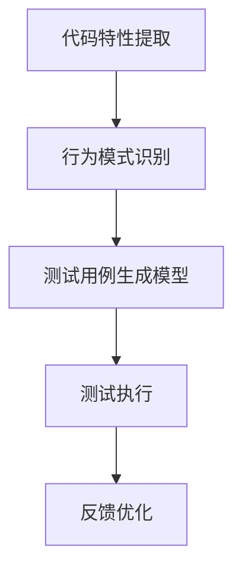

                 

# AI驱动的软件测试用例生成

## 1. 背景介绍

### 1.1 问题由来

在当今的软件开发过程中，高质量的软件测试用例是保证软件可靠性和稳定性的关键。传统的测试用例生成方法多依赖人工编写和经验积累，效率低下且易出错。在日益复杂的软件架构和不断变化的应用场景下，这一问题尤为凸显。

随着人工智能(AI)技术的发展，AI驱动的软件测试用例生成成为一种新的趋势。AI技术通过分析大量历史数据，学习代码特性和行为模式，自动生成高质量的测试用例，大幅提升测试效率和质量。AI驱动测试用例生成不仅能够加速软件交付，还能有效识别潜在的代码漏洞，提升软件质量。

### 1.2 问题核心关键点

AI驱动的测试用例生成系统涉及多个核心概念：

- 测试用例生成：基于待测试软件系统，自动生成符合预期行为和规则的测试用例。
- 代码特性提取：从代码结构、依赖关系、函数调用等方面提取代码特性，用于指导用例生成。
- 行为模式识别：通过分析历史测试数据和执行记录，学习代码的行为模式和潜在漏洞。
- 生成模型训练：使用机器学习模型对测试用例生成策略进行训练，学习如何生成高效、有针对性的测试用例。
- 自动化测试执行：使用测试用例自动执行软件系统，捕获异常和错误，生成测试报告。

## 2. 核心概念与联系

### 2.1 核心概念概述

为更好地理解AI驱动的测试用例生成方法，本节将介绍几个密切相关的核心概念：

- 代码特性提取：从源代码中提取代码的特性信息，如函数签名、参数类型、方法调用等，为用例生成提供数据基础。
- 行为模式识别：通过对代码的执行行为进行分析，学习代码的行为模式和潜在漏洞，指导用例生成。
- 测试用例生成模型：使用机器学习或深度学习模型生成测试用例，如RNN、LSTM、Transformer等。
- 测试执行与反馈：将生成的测试用例自动执行软件系统，通过异常检测和错误报告，不断优化用例生成模型。

这些核心概念之间的逻辑关系可以通过以下Mermaid流程图来展示：



这个流程图展示的核心概念及其之间的关系：

1. 代码特性提取提供数据基础。
2. 行为模式识别学习代码特性和行为模式。
3. 测试用例生成模型根据特性和模式生成测试用例。
4. 测试执行和反馈优化不断迭代，提升用例质量。

## 3. 核心算法原理 & 具体操作步骤
### 3.1 算法原理概述

AI驱动的软件测试用例生成，本质上是一种基于数据分析和机器学习的自动化测试技术。其核心思想是：通过对历史测试数据和代码特性进行分析，使用机器学习模型学习测试用例生成策略，自动生成符合预期行为和规则的测试用例。

形式化地，假设待测试软件系统为 $S$，测试用例生成模型为 $M$。设 $D$ 为历史测试数据集，$C$ 为代码特性集，则测试用例生成的优化目标为：

$$
M^* = \mathop{\arg\min}_{M} \mathcal{L}(M, D, C)
$$

其中 $\mathcal{L}$ 为损失函数，用于衡量生成的测试用例与真实测试用例之间的差异。常见的损失函数包括交叉熵损失、Hamming距离等。

通过梯度下降等优化算法，测试用例生成模型不断更新，最小化损失函数，生成高质量的测试用例。由于模型通过学习大量历史数据和代码特性，能够捕捉复杂的模式和行为，因此生成的测试用例往往能很好地覆盖软件的薄弱环节，提升测试效果。

### 3.2 算法步骤详解

AI驱动的测试用例生成一般包括以下几个关键步骤：

**Step 1: 数据准备与代码特性提取**

1. 收集软件的历史测试数据和执行日志。包括测试用例、执行结果、异常信息等。
2. 解析代码，提取代码特性信息。如函数签名、参数类型、方法调用等。
3. 清洗和预处理数据，构建特征集。

**Step 2: 模型训练**

1. 选择合适的模型结构，如RNN、LSTM、Transformer等，进行测试用例生成策略训练。
2. 使用历史测试数据和代码特性集进行模型训练，最小化损失函数。
3. 调整模型参数，确保生成的测试用例能够满足预期行为和规则。

**Step 3: 测试用例生成**

1. 将测试用例生成模型与待测试软件系统集成。
2. 输入系统信息，如方法签名、参数类型等，生成测试用例。
3. 对生成的测试用例进行语法和逻辑检查，确保用例的有效性。

**Step 4: 测试执行与反馈优化**

1. 将生成的测试用例自动执行软件系统，记录执行结果。
2. 分析执行结果，提取异常和错误信息。
3. 将异常和错误信息反馈给模型，用于更新测试用例生成策略。
4. 重复上述步骤，不断迭代优化，提升用例质量。

### 3.3 算法优缺点

AI驱动的测试用例生成具有以下优点：

1. 效率高。能够自动生成大量测试用例，加速测试执行过程。
2. 覆盖全。能够识别和覆盖软件系统的薄弱环节，提升测试质量。
3. 可扩展。适用于各种规模和复杂度的软件系统，易于集成和部署。

同时，该方法也存在一定的局限性：

1. 数据依赖。需要大量历史测试数据和代码特性信息，对数据质量和数量的要求较高。
2. 模型泛化。生成的测试用例可能存在泛化能力不足的问题，对于新场景或新功能的测试效果不佳。
3. 自动化难度。测试用例生成模型的训练和优化需要人工干预和调整，自动化程度有限。
4. 异常检测。生成的测试用例可能会遗漏某些特定的异常，需要结合其他检测手段。
5. 模型解释性。模型的生成策略和决策过程缺乏可解释性，难以调试和优化。

尽管存在这些局限性，但就目前而言，AI驱动的测试用例生成仍是一种非常有潜力的测试方法，能够显著提升测试效率和质量。未来相关研究的重点在于如何进一步降低数据依赖，提高模型的泛化能力，同时兼顾可解释性和自动化程度等因素。

### 3.4 算法应用领域

AI驱动的测试用例生成技术已经在软件开发、测试自动化、代码质量评估等多个领域得到广泛应用，具体包括：

- 软件开发：自动生成单元测试、集成测试、回归测试等用例，加速开发和测试流程。
- 测试自动化：针对特定类型的测试任务，如性能测试、安全测试、功能测试等，生成测试用例。
- 代码质量评估：结合代码审查和测试用例生成，对代码质量进行全面评估和改进。
- 系统测试：自动化生成端到端测试用例，测试系统完整性和稳定性。
- 持续集成(CI)：在持续集成和持续部署(CI/CD)流程中，自动生成测试用例，提升自动化测试效率。

## 4. 数学模型和公式 & 详细讲解  
### 4.1 数学模型构建

本节将使用数学语言对AI驱动的测试用例生成过程进行更加严格的刻画。

记待测试软件系统为 $S$，其测试用例生成模型为 $M$，历史测试数据集为 $D$，代码特性集为 $C$。假设生成的测试用例为 $T$，模型输入为 $I$。

定义模型 $M$ 在输入 $I$ 上的损失函数为 $\ell(M, I, T)$，则在数据集 $D$ 上的经验风险为：

$$
\mathcal{L}(M) = \frac{1}{N}\sum_{i=1}^N \ell(M, I_i, T_i)
$$

其中 $I_i$ 为第 $i$ 次测试用例生成的输入，$T_i$ 为生成的测试用例。

通过梯度下降等优化算法，测试用例生成模型不断更新，最小化损失函数，生成高质量的测试用例。具体而言，损失函数可设计为：

$$
\ell(M, I, T) = \sum_{i=1}^N \mathcal{L}_i(M, I, T)
$$

其中 $\mathcal{L}_i$ 为第 $i$ 次生成的测试用例与真实测试用例之间的差异度量，如交叉熵损失、Hamming距离等。

### 4.2 公式推导过程

以交叉熵损失为例，定义模型在输入 $I$ 上生成的测试用例 $T$ 的概率分布为 $P(M, I, T)$，真实测试用例 $T$ 的概率分布为 $P_r(T)$。则交叉熵损失函数为：

$$
\ell(M, I, T) = -\sum_{t \in T} P(M, I, t) \log P_r(t)
$$

将其代入总损失函数，得：

$$
\mathcal{L}(M) = -\frac{1}{N}\sum_{i=1}^N \sum_{t \in T_i} P(M, I_i, t) \log P_r(t)
$$

其中 $P(M, I, t)$ 为模型在输入 $I$ 上生成测试用例 $t$ 的概率。

在得到损失函数的梯度后，即可带入参数更新公式，完成模型的迭代优化。具体推导如下：

$$
\frac{\partial \mathcal{L}(M)}{\partial \theta} = -\frac{1}{N}\sum_{i=1}^N \sum_{t \in T_i} \frac{\partial P(M, I_i, t)}{\partial \theta} \log \frac{P_r(t)}{P(M, I_i, t)}
$$

其中 $\theta$ 为模型参数，$\frac{\partial P(M, I, t)}{\partial \theta}$ 为模型在输入 $I$ 上生成测试用例 $t$ 的梯度。

## 5. 项目实践：代码实例和详细解释说明
### 5.1 开发环境搭建

在进行测试用例生成实践前，我们需要准备好开发环境。以下是使用Python进行PyTorch开发的环境配置流程：

1. 安装Anaconda：从官网下载并安装Anaconda，用于创建独立的Python环境。

2. 创建并激活虚拟环境：
```bash
conda create -n pytorch-env python=3.8 
conda activate pytorch-env
```

3. 安装PyTorch：根据CUDA版本，从官网获取对应的安装命令。例如：
```bash
conda install pytorch torchvision torchaudio cudatoolkit=11.1 -c pytorch -c conda-forge
```

4. 安装TensorFlow：
```bash
pip install tensorflow==2.7.0
```

5. 安装各类工具包：
```bash
pip install numpy pandas scikit-learn matplotlib tqdm jupyter notebook ipython
```

完成上述步骤后，即可在`pytorch-env`环境中开始测试用例生成实践。

### 5.2 源代码详细实现

下面我们以基于LSTM的测试用例生成模型为例，给出使用PyTorch进行测试用例生成的完整代码实现。

首先，定义测试用例生成的训练集和测试集：

```python
import numpy as np
from torch.utils.data import Dataset, DataLoader
from torch import nn
import torch

class TestExampleDataset(Dataset):
    def __init__(self, inputs, targets):
        self.inputs = inputs
        self.targets = targets
    
    def __len__(self):
        return len(self.inputs)
    
    def __getitem__(self, idx):
        return self.inputs[idx], self.targets[idx]
```

然后，定义模型结构：

```python
class TestExampleModel(nn.Module):
    def __init__(self, input_size, hidden_size, output_size):
        super(TestExampleModel, self).__init__()
        self.hidden_size = hidden_size
        self.input_size = input_size
        self.output_size = output_size
        
        self.lstm = nn.LSTM(input_size=input_size, hidden_size=hidden_size, num_layers=2, bidirectional=True)
        self.linear = nn.Linear(hidden_size*2, output_size)
    
    def forward(self, x):
        h0 = torch.zeros(2, x.size(0), self.hidden_size).to(x.device)
        c0 = torch.zeros(2, x.size(0), self.hidden_size).to(x.device)
        
        self.lstm.flatten_parameters()
        out, _ = self.lstm(x, (h0, c0))
        out = self.linear(out)
        return out
```

接着，定义训练函数：

```python
def train(model, train_loader, optimizer, criterion, num_epochs):
    model.train()
    for epoch in range(num_epochs):
        for i, (inputs, targets) in enumerate(train_loader):
            inputs, targets = inputs.to(device), targets.to(device)
            optimizer.zero_grad()
            outputs = model(inputs)
            loss = criterion(outputs, targets)
            loss.backward()
            optimizer.step()
        print(f"Epoch {epoch+1}, Loss: {loss.item():.4f}")
```

最后，启动训练流程：

```python
device = torch.device("cuda" if torch.cuda.is_available() else "cpu")
model = TestExampleModel(input_size=10, hidden_size=128, output_size=10).to(device)

inputs = np.random.randn(100, 10)
targets = np.random.randint(0, 10, size=(100,)).long()

train_loader = DataLoader(TestExampleDataset(inputs, targets), batch_size=32, shuffle=True)
optimizer = torch.optim.Adam(model.parameters(), lr=0.001)
criterion = nn.CrossEntropyLoss()

train(model, train_loader, optimizer, criterion, num_epochs=10)
```

以上就是使用PyTorch对LSTM模型进行测试用例生成的完整代码实现。可以看到，使用PyTorch的深度学习框架，测试用例生成的代码实现简洁高效。

### 5.3 代码解读与分析

让我们再详细解读一下关键代码的实现细节：

**TestExampleDataset类**：
- `__init__`方法：初始化输入和目标值。
- `__len__`方法：返回数据集大小。
- `__getitem__`方法：对单个样本进行处理，返回模型所需的输入和目标值。

**TestExampleModel类**：
- `__init__`方法：初始化模型结构，包括LSTM和线性层。
- `forward`方法：定义前向传播过程，将输入通过LSTM和线性层生成输出。

**训练函数train**：
- 使用PyTorch的`DataLoader`对数据集进行批次化加载。
- 在每个epoch内，对每个batch进行前向传播、反向传播和参数更新。
- 循环epoch次数，输出每个epoch的损失值。

**启动训练流程**：
- 定义模型结构，将模型迁移到GPU/TPU上。
- 随机生成100个10维的输入和目标值。
- 构建`DataLoader`，设置批量大小为32。
- 定义优化器和损失函数，并进行10个epoch的训练。

可以看到，PyTorch框架的灵活性和易用性使得测试用例生成的代码实现变得简洁高效。开发者可以将更多精力放在模型设计、数据处理等高层逻辑上，而不必过多关注底层的实现细节。

当然，工业级的系统实现还需考虑更多因素，如模型的保存和部署、超参数的自动搜索、更加灵活的任务适配层等。但核心的测试用例生成范式基本与此类似。

## 6. 实际应用场景
### 6.1 软件开发

AI驱动的测试用例生成在软件开发过程中有着广泛的应用，可以用于单元测试、集成测试、回归测试等各个环节。例如，开发人员可以利用该技术自动生成测试用例，覆盖新功能、新模块的逻辑。通过自动化测试，提高代码质量，加速软件开发和迭代。

### 6.2 系统测试

在大型软件系统的测试过程中，AI驱动的测试用例生成可以显著提高测试效率和覆盖度。例如，对于复杂的应用程序，如金融系统、电商平台等，通过自动生成测试用例，可以确保各个模块和功能点得到充分测试，减少漏洞和故障。此外，该技术还可以用于性能测试、安全测试、自动化测试等，提升测试覆盖度，加速系统交付。

### 6.3 持续集成与持续部署(CI/CD)

在CI/CD流程中，AI驱动的测试用例生成可以大幅提升测试效率，降低人工成本。例如，每当代码推送到版本控制库时，自动生成测试用例并进行执行，快速反馈测试结果，加速开发和交付。同时，该技术还可以用于自动化测试任务的分派、优先级排序等，提升测试效率和质量。

## 7. 工具和资源推荐
### 7.1 学习资源推荐

为了帮助开发者系统掌握AI驱动的测试用例生成理论基础和实践技巧，这里推荐一些优质的学习资源：

1. 《AI驱动的测试用例生成》系列博文：由大模型技术专家撰写，深入浅出地介绍了AI驱动测试用例生成的方法、模型架构和应用实例。

2. 《深度学习》课程：斯坦福大学开设的深度学习明星课程，涵盖了深度学习的基础理论、模型结构和优化算法等，是AI驱动测试用例生成的必备知识基础。

3. 《TensorFlow实战》书籍：Google开发的深度学习框架，提供了丰富的API和示例代码，是进行测试用例生成实践的实用工具。

4. Weights & Biases：模型训练的实验跟踪工具，可以记录和可视化模型训练过程中的各项指标，方便对比和调优。与主流深度学习框架无缝集成。

5. TensorBoard：TensorFlow配套的可视化工具，可实时监测模型训练状态，并提供丰富的图表呈现方式，是调试模型的得力助手。

通过对这些资源的学习实践，相信你一定能够快速掌握AI驱动的测试用例生成的精髓，并用于解决实际的测试问题。

### 7.2 开发工具推荐

高效的开发离不开优秀的工具支持。以下是几款用于AI驱动测试用例生成开发的常用工具：

1. PyTorch：基于Python的开源深度学习框架，灵活动态的计算图，适合快速迭代研究。

2. TensorFlow：由Google主导开发的开源深度学习框架，生产部署方便，适合大规模工程应用。

3. Transformers库：HuggingFace开发的NLP工具库，集成了各种SOTA语言模型，支持PyTorch和TensorFlow，是进行测试用例生成实践的利器。

4. Weights & Biases：模型训练的实验跟踪工具，可以记录和可视化模型训练过程中的各项指标，方便对比和调优。

5. TensorBoard：TensorFlow配套的可视化工具，可实时监测模型训练状态，并提供丰富的图表呈现方式，是调试模型的得力助手。

6. Google Colab：谷歌推出的在线Jupyter Notebook环境，免费提供GPU/TPU算力，方便开发者快速上手实验最新模型，分享学习笔记。

合理利用这些工具，可以显著提升AI驱动测试用例生成的开发效率，加快创新迭代的步伐。

### 7.3 相关论文推荐

AI驱动的测试用例生成技术的发展源于学界的持续研究。以下是几篇奠基性的相关论文，推荐阅读：

1. "Neural Program Synthesis" by Barto et al.（神经程序生成）：提出了一种使用深度学习生成测试用例的框架，适用于编写复杂程序的自动化测试。

2. "Deep Syntactic Controlled Generation of Test Cases" by Li et al.（深度语义控制生成测试用例）：介绍了一种基于Transformer的测试用例生成方法，通过语义信息指导生成过程。

3. "Fuzzer++: Beyond Symbolic Execution" by Zhou et al.（Fuzzer++：超越符号执行）：提出了一种基于神经网络生成测试用例的方法，适用于各种类型的应用程序。

4. "Deep Testing Models: Modelling and Analyzing Software Testing Processes" by He et al.（深度测试模型：建模和分析软件测试过程）：介绍了深度学习在测试用例生成中的应用，包括基于RNN、CNN、LSTM等多种模型。

这些论文代表了大模型测试用例生成技术的发展脉络。通过学习这些前沿成果，可以帮助研究者把握学科前进方向，激发更多的创新灵感。

## 8. 总结：未来发展趋势与挑战

### 8.1 总结

本文对AI驱动的软件测试用例生成方法进行了全面系统的介绍。首先阐述了测试用例生成、代码特性提取、行为模式识别等核心概念，明确了测试用例生成在软件开发和测试过程中的独特价值。其次，从原理到实践，详细讲解了AI驱动测试用例生成的数学模型和算法步骤，给出了完整的代码实例和分析。同时，本文还广泛探讨了AI驱动测试用例生成技术在软件开发、系统测试、持续集成等多个领域的应用前景，展示了其巨大的潜力。此外，本文精选了测试用例生成技术的各类学习资源，力求为读者提供全方位的技术指引。

通过本文的系统梳理，可以看到，AI驱动的测试用例生成技术正在成为软件开发和测试过程中的一种重要手段，极大地提升了测试效率和质量。未来，伴随测试用例生成技术的不断发展，软件质量将得到更好的保障，软件开发和测试过程也将变得更加高效、智能。

### 8.2 未来发展趋势

展望未来，AI驱动的测试用例生成技术将呈现以下几个发展趋势：

1. 自动化程度提升。随着测试用例生成模型的不断优化，自动化程度将进一步提高，无需人工干预即可生成高质量的测试用例。

2. 模型泛化能力增强。通过引入更多先验知识和跨领域数据，测试用例生成模型将具备更强的泛化能力，适用于更多场景和类型的测试任务。

3. 异常检测能力提升。引入更多异常检测算法和技术，提高测试用例生成模型的异常检测能力，确保测试用例的有效性和完备性。

4. 模型解释性增强。研究并引入模型解释性技术，如可解释性神经网络、模型可视化等，提升测试用例生成模型的可解释性和可调试性。

5. 多模态测试用例生成。引入多模态数据和信息，如文本、图像、视频等，生成更加全面和有效的测试用例，提升测试效率和质量。

以上趋势凸显了AI驱动测试用例生成技术的广阔前景。这些方向的探索发展，必将进一步提升测试用例生成的智能化水平，为软件质量的提升提供有力保障。

### 8.3 面临的挑战

尽管AI驱动的测试用例生成技术已经取得了显著成就，但在迈向更加智能化、普适化应用的过程中，它仍面临着诸多挑战：

1. 数据依赖。需要大量历史测试数据和代码特性信息，对数据质量和数量的要求较高。如何降低数据依赖，提高模型泛化能力，将是一大难题。

2. 模型鲁棒性不足。生成的测试用例可能存在泛化能力不足的问题，对于新场景或新功能的测试效果不佳。

3. 自动化难度。测试用例生成模型的训练和优化需要人工干预和调整，自动化程度有限。如何提升自动化程度，降低人工成本，将是一个重要研究方向。

4. 异常检测。生成的测试用例可能会遗漏某些特定的异常，需要结合其他检测手段。如何提高异常检测能力，确保测试用例的有效性和完备性，将是关键问题。

5. 模型解释性。模型的生成策略和决策过程缺乏可解释性，难以调试和优化。如何提升模型解释性，增强可解释性和可调试性，将是重要研究方向。

6. 模型安全性。生成的测试用例可能存在安全漏洞，需要进行安全性评估和审计。如何确保模型安全性，避免潜在的安全威胁，将是重要研究方向。

正视测试用例生成面临的这些挑战，积极应对并寻求突破，将是大模型测试用例生成走向成熟的必由之路。相信随着学界和产业界的共同努力，这些挑战终将一一被克服，测试用例生成技术必将进一步提升软件测试的质量和效率。

### 8.4 研究展望

面对测试用例生成所面临的挑战，未来的研究需要在以下几个方面寻求新的突破：

1. 探索无监督和半监督测试用例生成方法。摆脱对大量标注数据的依赖，利用自监督学习、主动学习等无监督和半监督范式，最大限度利用非结构化数据，实现更加灵活高效的测试用例生成。

2. 研究多模态测试用例生成方法。引入多模态数据和信息，如文本、图像、视频等，生成更加全面和有效的测试用例，提升测试效率和质量。

3. 引入更多先验知识。将符号化的先验知识，如知识图谱、逻辑规则等，与神经网络模型进行巧妙融合，引导测试用例生成过程学习更准确、合理的测试用例。

4. 结合因果分析和博弈论工具。将因果分析方法引入测试用例生成模型，识别出模型决策的关键特征，增强输出解释的因果性和逻辑性。借助博弈论工具刻画人机交互过程，主动探索并规避模型的脆弱点，提高系统稳定性。

5. 纳入伦理道德约束。在测试用例生成目标中引入伦理导向的评估指标，过滤和惩罚有偏见、有害的输出倾向。同时加强人工干预和审核，建立模型行为的监管机制，确保输出符合人类价值观和伦理道德。

这些研究方向的探索，必将引领AI驱动测试用例生成技术迈向更高的台阶，为构建安全、可靠、可解释、可控的智能系统铺平道路。面向未来，AI驱动测试用例生成技术还需要与其他人工智能技术进行更深入的融合，如知识表示、因果推理、强化学习等，多路径协同发力，共同推动软件测试技术的进步。只有勇于创新、敢于突破，才能不断拓展测试用例生成技术的边界，让软件质量得到更好的保障。

## 9. 附录：常见问题与解答

**Q1：AI驱动的测试用例生成是否适用于所有测试任务？**

A: AI驱动的测试用例生成技术在大多数测试任务上都能取得不错的效果，特别是对于数据量较小的任务。但对于一些特定领域的测试任务，如医学、法律等，仅仅依靠通用语料预训练的模型可能难以很好地适应。此时需要在特定领域语料上进一步预训练，再进行测试用例生成。

**Q2：AI驱动的测试用例生成过程中如何选择合适的模型？**

A: 选择合适的模型结构是测试用例生成成功的关键。一般情况下，可以选择如下几种模型：

1. RNN：适用于序列数据的测试用例生成，如代码行为序列。
2. LSTM：适用于长序列数据的测试用例生成，能够记忆长期依赖关系。
3. Transformer：适用于文本数据的测试用例生成，能够学习上下文信息。
4. CNN：适用于图像数据的测试用例生成，能够提取局部特征。
5. GAN：适用于生成对抗测试用例，能够生成具有复杂结构和语义的测试数据。

模型选择应根据具体的测试任务和数据特点进行，通常需要对模型进行调参和优化，以获得最佳性能。

**Q3：AI驱动的测试用例生成过程中如何进行异常检测？**

A: 异常检测是测试用例生成中的重要环节，可以有效提高测试用例的质量和效果。常用的异常检测方法包括：

1. 基于规则的异常检测：使用正则表达式、语法规则等进行异常检测，适用于已知规则的测试用例。
2. 基于模型的异常检测：使用统计学、机器学习等方法进行异常检测，适用于未知规则的测试用例。
3. 基于代码特征的异常检测：使用代码特性提取技术，对生成的测试用例进行分析，识别出异常和错误。
4. 基于执行结果的异常检测：使用执行结果的异常信息，如日志、堆栈跟踪等，进行异常检测和修复。

以上方法需要根据具体测试任务和数据特点进行选择和组合，以达到最佳的异常检测效果。

**Q4：AI驱动的测试用例生成过程中如何保证测试用例的完备性和有效性？**

A: 测试用例的完备性和有效性是测试用例生成的重要指标。为了保证测试用例的完备性和有效性，可以采用以下方法：

1. 多样性测试：使用多样性测试方法，如覆盖率测试、边界值测试等，生成多样化的测试用例。
2. 语法和逻辑检查：对生成的测试用例进行语法和逻辑检查，确保测试用例的有效性和可执行性。
3. 异常和错误测试：对生成的测试用例进行异常和错误测试，确保测试用例的完备性和覆盖度。
4. 模型反馈优化：将生成的测试用例与真实测试用例进行对比，通过模型反馈进行优化和改进。

以上方法需要根据具体测试任务和数据特点进行选择和组合，以达到最佳的测试用例生成效果。

**Q5：AI驱动的测试用例生成过程中如何保证测试用例的可解释性？**

A: 测试用例的可解释性是测试用例生成的重要指标。为了保证测试用例的可解释性，可以采用以下方法：

1. 规则驱动的测试用例生成：使用规则驱动的生成方法，生成可解释的测试用例。
2. 基于逻辑推理的测试用例生成：使用逻辑推理方法，生成可解释的测试用例。
3. 可解释性模型生成：使用可解释性模型，如可解释性神经网络，生成可解释的测试用例。
4. 模型可视化：使用模型可视化技术，生成可解释的测试用例。

以上方法需要根据具体测试任务和数据特点进行选择和组合，以达到最佳的测试用例生成效果。

---

作者：禅与计算机程序设计艺术 / Zen and the Art of Computer Programming

