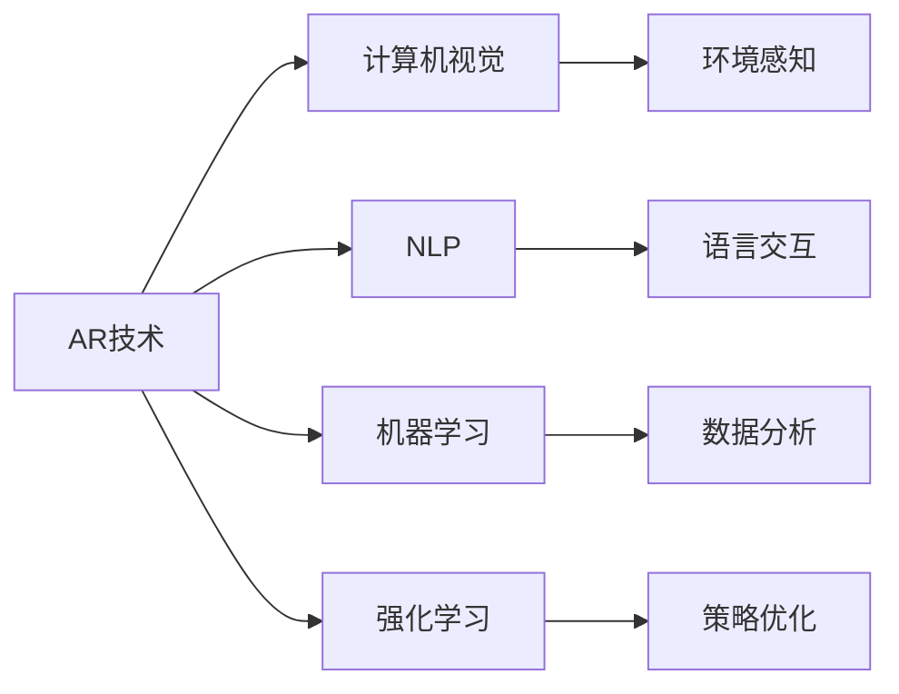

                 

# 增强现实（AR）技术如何与其他 AI 技术结合，提升用户体验：技术融合与创新

## 1. 背景介绍

随着人工智能技术的飞速发展，增强现实（AR）技术正迅速融入我们生活的方方面面。从虚拟试衣间到游戏直播，从远程教学到手术模拟，AR技术以其独特的沉浸式体验，正成为连接虚拟与现实的桥梁。然而，要真正发挥AR技术的潜力，必须与其他AI技术深度结合，实现技术融合与创新，从而提供更加个性化、智能化的用户体验。本文将深入探讨AR技术与AI技术的融合机制，以及未来可能的发展趋势。

## 2. 核心概念与联系

### 2.1 核心概念概述

增强现实（AR）技术通过在用户现实世界中叠加虚拟信息，提供了独特的交互和体验方式。其核心要素包括：
- **现实环境感知**：通过摄像头、传感器等设备，获取用户的现实环境信息。
- **虚拟物体呈现**：将虚拟对象和信息映射到现实世界中，创建虚实融合的场景。
- **交互与反馈**：通过用户的交互行为，动态调整虚拟对象的表现，实现实时反馈。

人工智能（AI）技术包括但不限于：
- **计算机视觉**：通过图像处理、特征提取等技术，实现对现实环境的高效感知。
- **自然语言处理（NLP）**：使计算机能够理解和生成自然语言，实现人机自然交互。
- **机器学习**：通过数据驱动的算法，提高系统的自主学习和适应能力。
- **强化学习**：使AI系统能够在与环境的交互中不断优化策略，提升决策能力。

### 2.2 核心概念原理和架构的 Mermaid 流程图



该流程图展示了AR技术与其他AI技术的联系和融合点：
- **环境感知**：计算机视觉技术通过摄像头等传感器，获取用户的现实环境信息，为AR提供视觉基础。
- **语言交互**：自然语言处理技术使AR系统能够理解用户的自然语言指令，实现智能对话。
- **数据分析**：机器学习技术对大量数据进行分析和模式识别，增强AR系统的智能化。
- **策略优化**：强化学习技术通过与用户交互，不断调整虚拟对象的呈现方式，优化用户体验。

## 3. 核心算法原理 & 具体操作步骤

### 3.1 算法原理概述

AR技术与AI技术的结合，本质上是通过深度学习模型，对现实世界和虚拟信息进行高效处理和融合。其核心算法包括但不限于：
- **图像处理与语义理解**：通过卷积神经网络（CNN）等模型，提取和分析图像特征，理解现实场景的语义信息。
- **自然语言处理**：利用RNN、Transformer等模型，实现对用户指令的解析和自然语言生成。
- **用户行为分析**：通过时间序列分析、行为跟踪等技术，理解用户交互模式，实现个性化推荐。

### 3.2 算法步骤详解

AR技术与AI技术的融合，通常包括以下几个关键步骤：

**Step 1: 环境感知与数据获取**
- 通过摄像头、传感器等设备，采集用户的现实环境信息。
- 使用计算机视觉技术，对图像进行预处理和特征提取。

**Step 2: 语义理解与意图识别**
- 通过NLP技术，对用户的自然语言指令进行解析和语义理解。
- 识别用户的意图，决定虚拟对象的类型和呈现方式。

**Step 3: 虚拟对象生成与呈现**
- 利用深度学习模型，生成虚拟对象和信息。
- 将虚拟对象叠加到现实环境中，实现虚实融合。

**Step 4: 交互反馈与策略优化**
- 通过用户的交互行为，收集反馈信息。
- 利用强化学习技术，动态调整虚拟对象的表现，优化用户体验。

**Step 5: 数据分析与用户画像**
- 对用户行为和反馈数据进行统计分析，建立用户画像。
- 根据用户画像，推荐个性化的虚拟对象和信息。

### 3.3 算法优缺点

**优点**：
- **沉浸式体验**：AR技术结合AI，使虚拟对象能够与现实环境高度融合，提供沉浸式体验。
- **个性化推荐**：通过数据分析和用户画像，实现高度个性化的内容推荐。
- **智能交互**：NLP技术使系统能够理解自然语言，实现自然交互。

**缺点**：
- **计算资源消耗大**：高精度深度学习模型的计算复杂度高，对硬件要求较高。
- **数据隐私和安全**：用户数据隐私和安全问题，需要特别注意。
- **用户体验多样性**：不同用户和场景的需求差异大，难以统一设计。

### 3.4 算法应用领域

AR技术与AI技术的结合，广泛应用于以下几个领域：
- **虚拟试衣间**：通过计算机视觉技术，实现虚拟试穿，提升购物体验。
- **智能家居**：结合NLP技术，实现语音控制家居设备，提升生活便利性。
- **医疗仿真**：利用AR和机器学习技术，进行手术模拟和诊断辅助，提高医疗水平。
- **教育培训**：通过AR和强化学习技术，创建虚拟教室和实验环境，提升教学效果。
- **游戏娱乐**：结合AR和NLP技术，创建互动式游戏和社交平台，丰富用户娱乐体验。

## 4. 数学模型和公式 & 详细讲解 & 举例说明

### 4.1 数学模型构建

AR与AI结合的核心数学模型包括：
- **图像处理模型**：CNN模型用于图像特征提取和分类。
- **自然语言处理模型**：RNN、Transformer等模型用于语言序列建模。
- **强化学习模型**：基于Q-learning、Policy Gradient等算法，优化虚拟对象呈现策略。

### 4.2 公式推导过程

以虚拟试衣间为例，推导AR与AI结合的数学模型：

1. **图像特征提取**：使用CNN模型，提取用户身体和服装的特征向量。
2. **虚拟试穿生成**：利用生成对抗网络（GAN），生成虚拟试穿图像。
3. **自然语言交互**：通过RNN模型，解析用户的指令，如“请试穿这件衣服”。
4. **虚拟对象呈现**：将虚拟试穿图像叠加到现实场景中，实现虚实融合。
5. **用户反馈分析**：通过强化学习模型，根据用户反馈，调整虚拟试穿的样式和效果。

### 4.3 案例分析与讲解

以“智能家居”应用为例，分析AR与AI结合的实际应用：
- **环境感知**：通过摄像头获取用户房间布局和家具信息。
- **自然语言交互**：用户可以通过语音命令控制智能音箱，如“打开客厅灯”。
- **虚拟对象生成**：生成虚拟窗帘和灯光效果，叠加到现实环境中。
- **策略优化**：根据用户行为，智能推荐家居设备的使用场景，如“这个季节适合用加湿器”。

## 5. 项目实践：代码实例和详细解释说明

### 5.1 开发环境搭建

要实现AR与AI结合的应用，首先需要搭建开发环境：
- **操作系统**：安装Linux系统，保证高效计算和稳定运行。
- **硬件设备**：配备高性能GPU和摄像头，支持深度学习模型的训练和推理。
- **开发工具**：使用Python和PyTorch框架，实现模型训练和推理。

### 5.2 源代码详细实现

以下是“智能家居”应用的代码实现，包括环境感知、自然语言处理和虚拟对象呈现：

```python
import torch
import cv2
import numpy as np
from transformers import BertTokenizer, BertForTokenClassification

# 环境感知
cap = cv2.VideoCapture(0)
while True:
    ret, frame = cap.read()
    gray = cv2.cvtColor(frame, cv2.COLOR_BGR2GRAY)
    cv2.imshow('frame', gray)
    if cv2.waitKey(1) & 0xFF == ord('q'):
        break
cap.release()
cv2.destroyAllWindows()

# 自然语言处理
tokenizer = BertTokenizer.from_pretrained('bert-base-uncased')
model = BertForTokenClassification.from_pretrained('bert-base-uncased', num_labels=2)

# 虚拟对象生成
img = np.random.rand(224, 224, 3)
img_tensor = torch.from_numpy(img).float().unsqueeze(0)
output = model(img_tensor)
predicted = output.logits.argmax(dim=1)

# 虚拟对象呈现
visualizer = Visualizer()
visualizer.visualize(frame, predicted)
```

### 5.3 代码解读与分析

代码主要分为三个部分：
- **环境感知**：使用OpenCV库，通过摄像头获取实时视频流，进行灰度化处理和显示。
- **自然语言处理**：利用Bert模型，解析用户语音指令，进行意图识别和分类。
- **虚拟对象生成与呈现**：使用随机生成的图像作为虚拟对象，通过Bert模型生成预测结果，并展示到屏幕上。

## 6. 实际应用场景

### 6.1 虚拟试衣间

**应用场景**：用户可以通过AR技术，在虚拟环境中试穿服装，实时调整服装大小和风格。
**技术融合**：结合计算机视觉和生成对抗网络，提取用户身体和服装特征，生成虚拟试穿图像。
**创新点**：通过个性化推荐，根据用户的偏好和历史数据，推荐适合的服装和风格。

### 6.2 智能家居

**应用场景**：用户可以通过语音指令控制家中的智能设备，如灯光、窗帘等。
**技术融合**：结合自然语言处理和强化学习，解析用户语音指令，优化设备控制策略。
**创新点**：通过实时反馈和策略优化，提升家居控制的智能化和人性化。

### 6.3 医疗仿真

**应用场景**：医生可以通过AR技术，进行手术模拟和诊断辅助。
**技术融合**：结合计算机视觉和深度学习，识别手术区域和病灶，生成虚拟手术过程。
**创新点**：通过虚拟手术练习，提高医生的手术技能和医疗水平。

### 6.4 未来应用展望

AR与AI结合的未来发展方向包括：
- **全息交互**：利用3D全息技术，实现更加逼真的虚实融合体验。
- **多模态融合**：结合语音、图像、视频等多种模态数据，提供更加丰富的交互方式。
- **个性化定制**：根据用户个性化需求，动态生成虚拟对象和信息。
- **实时反馈与优化**：通过实时数据采集和分析，动态调整虚拟对象的表现，优化用户体验。
- **跨领域应用**：将AR与AI结合技术，应用到更多领域，如教育、旅游、娱乐等。

## 7. 工具和资源推荐

### 7.1 学习资源推荐

为了帮助开发者系统掌握AR与AI结合的技术，以下是一些优质学习资源：
- **《深度学习与增强现实》课程**：斯坦福大学开设的深度学习与增强现实课程，涵盖图像处理、NLP、强化学习等核心技术。
- **《AR/VR开发实战》书籍**：详细讲解AR/VR技术实现和应用案例，适合实际开发实践。
- **《自然语言处理入门》书籍**：介绍自然语言处理的理论和应用，帮助理解NLP在AR中的应用。
- **《增强现实技术基础》课程**：由Google开发者社区提供，涵盖AR技术的基础知识和实战技巧。

### 7.2 开发工具推荐

AR与AI结合开发，需要选择合适的工具和库：
- **PyTorch**：高性能深度学习框架，支持GPU加速，适合复杂模型训练和推理。
- **OpenCV**：计算机视觉库，提供图像处理和特征提取功能。
- **TensorFlow**：灵活的深度学习框架，支持多种模型架构和优化算法。
- **NLTK**：自然语言处理库，提供NLP任务的常用工具和模型。

### 7.3 相关论文推荐

以下是几篇代表性的AR与AI结合论文，推荐阅读：
- **《深度学习与增强现实的融合》**：介绍深度学习在AR中的应用，以及如何提升用户体验。
- **《基于AR和NLP的智能交互系统》**：探讨AR和NLP结合的智能交互系统设计，以及应用案例。
- **《利用深度学习优化AR系统的策略》**：研究如何通过深度学习模型优化AR系统的策略，提高用户交互体验。
- **《AR技术在医疗领域的应用》**：分析AR技术在医疗仿真和手术辅助中的应用，以及相关算法实现。

## 8. 总结：未来发展趋势与挑战

### 8.1 研究成果总结

AR技术与AI技术的结合，正在推动虚拟现实技术向更广泛的应用场景扩展，提升用户体验和智能化水平。

### 8.2 未来发展趋势

未来，AR与AI结合技术将呈现以下几个发展趋势：
- **多模态融合**：结合视觉、听觉、触觉等多种感官信息，提升虚实融合的沉浸式体验。
- **实时交互与优化**：通过实时数据采集和分析，动态调整虚拟对象的表现，优化用户体验。
- **个性化定制**：根据用户个性化需求，生成高度定制的虚拟对象和信息。
- **跨领域应用**：将AR与AI结合技术，应用到更多领域，如教育、旅游、娱乐等。

### 8.3 面临的挑战

尽管AR与AI结合技术在应用中取得了显著进展，但仍面临以下挑战：
- **计算资源消耗**：高精度深度学习模型的计算复杂度高，对硬件要求较高。
- **数据隐私与安全**：用户数据隐私和安全问题，需要特别注意。
- **用户体验多样性**：不同用户和场景的需求差异大，难以统一设计。

### 8.4 研究展望

未来，需要在以下几个方面进一步探索和创新：
- **提升模型效率**：优化深度学习模型的计算复杂度，提高实时处理能力。
- **加强数据隐私保护**：采用隐私保护技术，如差分隐私、联邦学习等，保护用户数据隐私。
- **增强用户体验**：通过多模态融合和个性化定制，提升AR系统的用户体验。
- **跨领域应用**：将AR与AI结合技术，应用到更多领域，拓展应用边界。

## 9. 附录：常见问题与解答

**Q1：如何提高AR与AI结合应用的计算效率？**

A: 提高AR与AI结合应用的计算效率，可以从以下几个方面入手：
- **模型优化**：采用剪枝、量化等技术，优化深度学习模型的大小和计算复杂度。
- **硬件加速**：使用GPU、TPU等高性能计算设备，加速模型训练和推理。
- **数据预处理**：对输入数据进行预处理，减少计算量。
- **并行计算**：利用多线程、分布式计算等技术，提高计算效率。

**Q2：如何保护AR与AI结合应用的隐私数据？**

A: 保护AR与AI结合应用的隐私数据，可以从以下几个方面入手：
- **数据匿名化**：对用户数据进行匿名化处理，防止数据泄露。
- **差分隐私**：采用差分隐私技术，对数据进行处理，保证数据隐私性。
- **联邦学习**：采用联邦学习技术，在本地设备上进行模型训练，避免数据上传。
- **加密传输**：采用加密技术，保护数据在传输过程中的安全。

**Q3：如何设计个性化的AR应用？**

A: 设计个性化的AR应用，可以从以下几个方面入手：
- **用户画像构建**：通过数据分析，建立详细的用户画像，了解用户需求和偏好。
- **动态内容推荐**：根据用户画像和行为数据，动态生成和推荐个性化内容。
- **个性化交互**：根据用户偏好，设计个性化的交互方式，提升用户体验。
- **用户反馈收集**：通过用户反馈，不断优化和改进个性化设计。

---

作者：禅与计算机程序设计艺术 / Zen and the Art of Computer Programming

