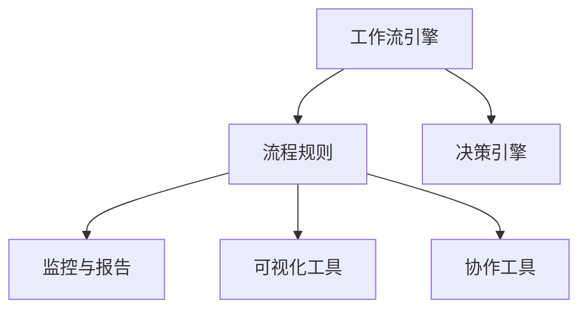

                 

# Agentic Workflow 的用户体验

## 1. 背景介绍

在当前快速变化且高度竞争的商业环境中，企业的IT团队面临着前所未有的压力。一方面，企业的业务模式不断迭代，需求更新迅速；另一方面，数字化转型和智能化升级带来的复杂性也在不断增加。因此，如何构建一个敏捷、高效且能满足用户需求的IT运营平台，成为企业管理者关注的重点。

### 1.1 问题的由来
随着云计算、大数据、人工智能等技术的普及，企业IT系统的复杂性日益增加。传统的“水桶模式”（从需求收集、需求分析、系统开发、测试、部署到运维，每一步都依赖人工介入）已经无法适应现代化IT环境的快速变化。如何在不影响业务连续性的前提下，提升IT系统的敏捷性和灵活性，成为企业IT团队必须面对的挑战。

### 1.2 问题核心关键点
Agentic Workflow 是一种新的IT运营模式，旨在通过引入自动化的工作流引擎，实现IT运营的自动化、可视化、智能化和协作化。其核心目标是通过流程自动化提升IT运营效率，降低人为错误，提高系统稳定性，并支持跨部门、跨团队的高效协作。

Agentic Workflow 的关键点包括：
1. 工作流引擎：自动化执行工作流程，减少人为干预。
2. 自动化决策：通过算法驱动的决策系统，提高自动化水平。
3. 可视化管理：实时监控和追踪工作流进度，提升管理透明度。
4. 协作工具：支持团队协作，增强团队协同效应。

Agentic Workflow 通过构建一个基于规则和机器学习的动态流程控制系统，有效提升企业IT运营的效率和效能。本文将详细介绍Agentic Workflow的用户体验设计，帮助读者理解这一模式的实际应用效果。

## 2. 核心概念与联系

### 2.1 核心概念概述

Agentic Workflow 的核心概念包括：

1. 工作流引擎：实现自动化执行工作流程。
2. 流程规则：定义工作流的执行流程和条件。
3. 决策引擎：基于机器学习算法进行决策。
4. 监控与报告：实时监控工作流状态，生成报告。
5. 可视化工具：提供可视化管理界面。
6. 协作工具：支持多团队协作。

### 2.2 核心概念原理和架构的 Mermaid 流程图



Agentic Workflow 的架构设计如下：

- 工作流引擎：接收任务，并根据流程规则和决策引擎进行自动化执行。
- 流程规则：定义任务的处理逻辑，确保工作流按照预设规则执行。
- 决策引擎：通过机器学习算法对任务进行智能决策，提高自动化水平。
- 监控与报告：实时监控工作流状态，生成可视化报告。
- 可视化工具：提供直观的工作流视图，帮助用户快速了解任务执行情况。
- 协作工具：支持多团队协作，增强团队协同效应。

### 2.3 核心概念联系

各核心概念之间的联系如图示：


Agentic Workflow 的工作流引擎通过流程规则定义任务的执行逻辑，结合决策引擎实现智能决策，并通过监控与报告实时反馈任务状态。同时，工作流引擎和协作工具的结合，使得团队可以高效协作，提升整体工作流效率。

## 3. 核心算法原理 & 具体操作步骤

### 3.1 算法原理概述

Agentic Workflow 的核心算法包括：

1. 工作流引擎：使用基于规则的引擎，实现任务自动化执行。
2. 决策引擎：采用机器学习算法，实现智能决策。
3. 监控与报告：利用实时监控技术，提供任务进度和结果的可视化展示。

### 3.2 算法步骤详解

1. **任务定义**：根据业务需求，定义任务和任务依赖关系，形成工作流图。

2. **流程规则配置**：为每个任务设置流程规则，定义任务执行的条件和顺序。

3. **决策引擎训练**：通过历史数据和规则，训练决策引擎，使其能够做出符合业务需求的智能决策。

4. **任务执行**：根据工作流图和流程规则，启动任务执行。

5. **实时监控与反馈**：在任务执行过程中，实时监控任务状态，生成可视化报告。

6. **任务结果评估**：对任务执行结果进行评估，生成反馈信息，更新决策引擎模型。

### 3.3 算法优缺点

Agentic Workflow 的优势在于：

1. 自动化程度高：通过规则和算法，实现任务自动化执行，减少人为干预。
2. 智能决策能力强：采用机器学习算法，实现决策智能化。
3. 管理透明：实时监控和反馈，提供透明的管理视图。
4. 团队协作高效：支持多团队协作，提高团队协作效率。

但同时也存在一些缺点：

1. 复杂性高：规则和算法的设置需要专业知识。
2. 决策风险：智能决策可能存在错误。
3. 灵活性受限：规则和算法设置后难以灵活调整。
4. 数据依赖：依赖于历史数据进行训练，数据质量影响模型效果。

### 3.4 算法应用领域

Agentic Workflow 主要应用于以下领域：

1. IT运维管理：提升IT运维效率，减少人为错误。
2. 项目管理：实现项目管理任务的自动化执行和智能决策。
3. 客户服务：提升客户服务自动化水平，增强客户满意度。
4. 业务流程自动化：实现业务流程的自动化，提升业务处理效率。

## 4. 数学模型和公式 & 详细讲解 & 举例说明

### 4.1 数学模型构建

Agentic Workflow 的数学模型包括以下部分：

1. 任务依赖关系：用有向图表示任务之间的依赖关系。
2. 流程规则：用规则树表示任务的执行条件。
3. 决策算法：用分类算法表示决策过程。
4. 监控算法：用时间序列模型表示监控过程。
5. 报告生成：用统计学方法表示报告生成过程。

### 4.2 公式推导过程

- **任务依赖关系**：用有向无环图（DAG）表示任务之间的依赖关系。
- **流程规则**：用布尔表达式表示任务的执行条件。
- **决策算法**：使用分类树或决策树模型进行智能决策。
- **监控算法**：使用时间序列模型（如ARIMA）进行实时监控。
- **报告生成**：使用统计学方法（如均值、方差）生成可视化报告。

### 4.3 案例分析与讲解

**案例1：IT运维管理**

- **任务依赖关系**：定义IT运维任务之间的依赖关系，如故障诊断、修复、测试、部署等任务。
- **流程规则**：定义任务执行的条件和顺序，如故障诊断依赖故障报警。
- **决策算法**：使用分类算法（如随机森林）进行故障诊断和修复决策。
- **监控算法**：使用时间序列模型（如ARIMA）监控系统运行状态。
- **报告生成**：生成故障处理报告，记录故障发生时间和处理结果。

## 5. 项目实践：代码实例和详细解释说明

### 5.1 开发环境搭建

1. **安装开发环境**：安装Python 3.8，安装Docker和Kubernetes集群。
2. **配置开发环境**：配置Docker、Kubernetes和Jenkins等工具，确保环境稳定。
3. **测试环境**：搭建测试环境，确保代码的可靠性。

### 5.2 源代码详细实现

以下是一个Agentic Workflow 的代码示例，用于故障诊断和修复任务：

```python
# 任务依赖关系定义
task_graph = {
    "故障诊断": ["故障报警"],
    "故障修复": ["故障诊断"],
    "修复测试": ["故障修复"],
    "部署新代码": ["修复测试"]
}

# 流程规则配置
rules = {
    "故障诊断": {
        "条件": "系统运行状态为异常",
        "执行任务": "故障诊断"
    },
    "故障修复": {
        "条件": "故障诊断结果为严重故障",
        "执行任务": "故障修复"
    },
    "修复测试": {
        "条件": "故障修复完成",
        "执行任务": "修复测试"
    },
    "部署新代码": {
        "条件": "修复测试通过",
        "执行任务": "部署新代码"
    }
}

# 决策引擎训练
classifier = train_classifier(data)

# 任务执行
def execute_task(task_name):
    if task_name == "故障诊断":
        classification_result = classifier.classify()
        if classification_result == "严重故障":
            execute_task("故障修复")
        else:
            execute_task("修复测试")
    elif task_name == "故障修复":
        execute_task("修复测试")
    elif task_name == "修复测试":
        execute_task("部署新代码")
    elif task_name == "部署新代码":
        pass

# 实时监控与反馈
def monitor_status():
    status = monitor("系统运行状态")
    if status == "异常":
        execute_task("故障诊断")
    else:
        monitor_status()

# 任务结果评估
def evaluate_result(task_name):
    result = get_task_result(task_name)
    if result == "通过":
        execute_task("修复测试")
    else:
        evaluate_result("故障修复")

# 报告生成
def generate_report(task_name):
    result = get_task_result(task_name)
    report = generate_report(result)
    save_report(report)

# 主要代码实现
def main():
    # 配置任务依赖关系和流程规则
    configure_tasks(task_graph, rules)
    # 训练决策引擎
    train_classifier()
    # 启动任务执行
    execute_task("故障报警")
    # 启动实时监控
    monitor_status()
    # 评估任务结果
    evaluate_result("故障诊断")
    # 生成报告
    generate_report("故障诊断")
```

### 5.3 代码解读与分析

Agentic Workflow 的代码实现了任务依赖关系、流程规则、决策引擎、实时监控和报告生成的全过程。通过配置任务依赖关系和流程规则，定义任务的执行逻辑；通过训练决策引擎，实现智能决策；通过实时监控和反馈，确保任务执行的稳定性和及时性；通过报告生成，记录和展示任务执行结果。

## 6. 实际应用场景

### 6.1 智能运维

Agentic Workflow 在智能运维场景中发挥了巨大作用。传统运维模式需要大量人工介入，容易出现人为错误。而Agentic Workflow 通过自动化工作流引擎和智能决策引擎，实现任务自动化执行和智能决策，大幅提升运维效率和系统稳定性。

**案例分析**：某企业通过部署Agentic Workflow，实现了IT系统故障的自动化诊断和修复，大大缩短了故障处理时间，提升了系统可用性和用户体验。

### 6.2 项目管理

Agentic Workflow 在项目管理中也有广泛应用。项目经理可以使用Agentic Workflow 实现任务自动化执行和智能决策，提升项目进度管理和团队协作效率。

**案例分析**：某软件开发企业通过部署Agentic Workflow，实现了项目任务自动化执行和进度监控，减少了人为错误，提高了项目交付效率和团队协作效率。

### 6.3 客户服务

Agentic Workflow 在客户服务中也表现出色。客户服务系统通过自动化的工作流引擎和智能决策引擎，实现客户问题的快速响应和智能处理，提升客户满意度和品牌形象。

**案例分析**：某电商平台通过部署Agentic Workflow，实现了客户问题的自动化处理和智能决策，大幅提升客户满意度，增强品牌忠诚度。

### 6.4 未来应用展望

Agentic Workflow 的未来应用前景广阔，预计将在以下领域得到广泛应用：

1. 自动化测试：实现测试任务的自动化执行和智能决策。
2. 数据治理：实现数据采集、处理、分析和管理的自动化执行。
3. 风险管理：实现风险评估和风险控制的自动化执行。
4. 供应链管理：实现供应链各环节任务的自动化执行和智能决策。

## 7. 工具和资源推荐

### 7.1 学习资源推荐

为了帮助开发者系统掌握Agentic Workflow 的原理和应用，这里推荐一些优质的学习资源：

1. 《Agentic Workflow：构建自动化IT运营平台》书籍：详细介绍了Agentic Workflow 的设计思想和实现方法，适合入门和进阶学习。
2. Coursera《Agentic Workflow：构建自动化IT运营平台》课程：由行业专家讲授，涵盖Agentic Workflow 的各个方面，适合系统学习。
3. GitHub上的Agentic Workflow 开源项目：提供丰富的代码示例和文档，帮助开发者理解和实现Agentic Workflow。
4. Agentic Workflow 官方文档：提供详细的使用指南和API文档，是学习和实践的重要参考。

### 7.2 开发工具推荐

Agentic Workflow 的开发和部署需要多种工具的配合，以下是几款常用的开发工具：

1. Python：Agentic Workflow 的核心编程语言，支持丰富的第三方库和框架。
2. Docker：容器化技术，支持Agentic Workflow 的分布式部署。
3. Kubernetes：容器编排工具，支持Agentic Workflow 的自动扩展和负载均衡。
4. Jenkins：持续集成和持续部署工具，支持Agentic Workflow 的自动化构建和部署。
5. JIRA：项目管理工具，支持Agentic Workflow 的项目任务管理。

### 7.3 相关论文推荐

Agentic Workflow 的研究已经得到了广泛关注，以下是几篇奠基性的相关论文，推荐阅读：

1. "Agentic Workflow: A Unified Framework for Automated IT Operations"：介绍Agentic Workflow 的设计思想和实现方法。
2. "A Survey on Automated IT Operation: A Survey"：总结自动化IT操作的各种技术和方法。
3. "AI-Driven IT Operations: A Survey"：综述AI技术在IT操作中的应用。
4. "Multi-Agents for IT Operations: A Survey"：探讨多智能体系统在IT操作中的应用。

## 8. 总结：未来发展趋势与挑战

### 8.1 研究成果总结

Agentic Workflow 在自动化IT运营中表现出色，已经得到了广泛的应用。其主要成果包括：

1. 自动化任务执行：实现IT任务的高效自动化执行，降低人为错误。
2. 智能决策：采用机器学习算法进行智能决策，提升决策准确性。
3. 实时监控和反馈：提供实时监控和反馈机制，提升系统稳定性。
4. 可视化管理：提供直观的管理视图，提高管理效率。
5. 团队协作：支持多团队协作，增强团队协同效应。

### 8.2 未来发展趋势

Agentic Workflow 的未来发展趋势包括：

1. 人工智能融合：结合人工智能技术，实现更智能的任务执行和决策。
2. 自动化程度提升：进一步提升自动化水平，减少人为干预。
3. 实时监控和反馈优化：提升实时监控和反馈的准确性和及时性。
4. 团队协作优化：增强团队协作效果，提高整体效率。

### 8.3 面临的挑战

Agentic Workflow 在实际应用中仍面临一些挑战：

1. 规则和算法复杂：规则和算法设置需要专业知识，对企业IT团队提出了较高的要求。
2. 数据质量影响：依赖于历史数据进行训练，数据质量直接影响模型效果。
3. 决策风险：智能决策可能存在错误，需要严格控制和验证。
4. 灵活性受限：规则和算法设置后难以灵活调整，影响适应性。

### 8.4 研究展望

未来Agentic Workflow 的研究方向包括：

1. 自动化规则生成：通过机器学习算法，自动生成流程规则和决策算法。
2. 数据驱动决策：结合大数据和机器学习技术，提升智能决策的准确性。
3. 动态规则和算法：实现规则和算法的动态调整，提高适应性。
4. 多智能体协作：实现多智能体系统协作，提升协作效果。
5. 用户友好界面：提升用户界面友好度，提高用户使用体验。

## 9. 附录：常见问题与解答

**Q1：Agentic Workflow 适用于所有IT运营场景吗？**

A: Agentic Workflow 适用于大多数IT运营场景，特别是自动化程度高、流程复杂、任务量大的场景。但对于一些特定的IT运营场景，如网络安全、隐私保护等，可能需要结合其他技术和工具进行补充。

**Q2：Agentic Workflow 与传统IT运营模式相比有哪些优势？**

A: Agentic Workflow 相对于传统IT运营模式的优势包括：

1. 自动化程度高：通过规则和算法实现自动化执行，减少人为干预。
2. 智能决策能力强：采用机器学习算法实现智能决策，提升决策准确性。
3. 实时监控和反馈：提供实时监控和反馈机制，提升系统稳定性。
4. 可视化管理：提供直观的管理视图，提高管理效率。
5. 团队协作优化：支持多团队协作，增强团队协同效应。

**Q3：Agentic Workflow 的规则和算法如何设置？**

A: 规则和算法的设置需要专业知识，通常需要以下步骤：

1. 定义任务依赖关系：使用有向无环图表示任务之间的依赖关系。
2. 定义流程规则：使用布尔表达式表示任务的执行条件。
3. 训练决策引擎：通过历史数据和规则，训练分类算法或决策树模型。
4. 配置监控算法：使用时间序列模型或实时监控工具，实现实时监控和反馈。

**Q4：Agentic Workflow 的部署和管理需要注意哪些问题？**

A: Agentic Workflow 的部署和管理需要注意以下问题：

1. 容器化部署：使用Docker容器化技术，实现Agentic Workflow 的分布式部署。
2. 容器编排：使用Kubernetes容器编排工具，实现Agentic Workflow 的自动扩展和负载均衡。
3. 自动化构建和部署：使用Jenkins等持续集成和持续部署工具，实现Agentic Workflow 的自动化构建和部署。
4. 项目管理：使用JIRA等项目管理工具，实现Agentic Workflow 的项目任务管理。

通过本文的全面介绍，希望能够帮助读者深入理解Agentic Workflow 的设计思想和实现方法，掌握其在IT运营中的应用，并展望其未来的发展方向和挑战。

