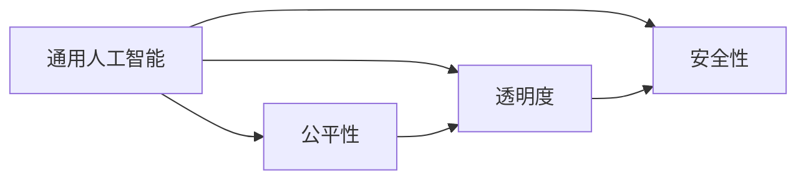

                 

# Andrej Karpathy：OpenAI 的成立初衷

## 1. 背景介绍

安德烈·卡帕西（Andrej Karpathy），是深度学习领域的重要人物，曾参与创建了OpenAI。OpenAI，即开放式人工智能，是一家致力于研究和开发通用人工智能（AGI）的全球非营利组织。其成立初衷并非追求经济利益，而是致力于推动人工智能技术的发展，并确保这些技术造福于全人类。卡帕西曾多次公开发表演讲，分享了OpenAI的成立背景和愿景，让我们得以一窥其背后的真实想法。

### 1.1 卡帕西的背景

安德烈·卡帕西于1989年出生在耶路撒冷，父母是计算机科学家和学者。他从小就对编程和数学充满兴趣，并在高中时期开始了自己的编程之旅。2009年，他进入斯坦福大学，学习计算机科学和心理学，并在2011年获得了学士学位。随后，他进入加州大学伯克利分校攻读硕士和博士学位，专注于机器学习和计算机视觉领域的研究。他的研究项目曾获得多次顶级奖项和荣誉，包括IEEE的Morris W. Trister纪念奖学金、《MIT Technology Review》的Top Ten Breakthroughs in Tech 2020奖项等。

在卡帕西的学术生涯中，他不仅发表论文，还积极参与开源社区，并开发了多项影响深远的深度学习工具和模型，包括Visual Genome、Deep Residual Networks等。他在2014年加入了Uber，担任高级工程师，推动自动驾驶汽车和计算机视觉技术的发展。

2015年，他回到学术界，在卡内基梅隆大学担任助理教授，并创办了OpenAI，专注于通用人工智能的研究。

## 2. 核心概念与联系

### 2.1 核心概念概述

OpenAI的成立初衷，可以从几个核心概念中得到阐述：

- **通用人工智能（AGI）**：OpenAI的目标是创建一个能够执行任何智能任务的计算机程序，而不仅仅是特定任务。这要求AGI具备跨领域的知识整合能力和自适应能力。
- **公平性**：OpenAI致力于确保人工智能技术的发展能够惠及全人类，避免技术被少数人或团体所垄断。
- **透明度**：OpenAI承诺在开发过程中保持高度透明度，让公众能够了解其决策过程和研究成果。
- **安全性**：OpenAI非常关注人工智能技术的潜在风险，致力于确保技术的安全性和可控性，避免技术滥用或失控。

这些概念之间存在紧密联系，构成了OpenAI成立的核心价值。

### 2.2 核心概念原理和架构的 Mermaid 流程图



从流程图可以看出，OpenAI的目标是构建一个能够执行任何智能任务的通用人工智能系统。这一系统的公平性、透明度和安全性是实现这一目标的必要条件。

## 3. 核心算法原理 & 具体操作步骤

### 3.1 算法原理概述

OpenAI的算法研发集中在以下几个领域：

- **深度强化学习**：开发可以自主学习的智能体，通过与环境的交互，学习最优策略。
- **自然语言处理（NLP）**：开发可以理解、生成和推理人类语言的算法。
- **计算机视觉**：开发可以识别、分类和理解图像的算法。
- **多模态学习**：开发可以同时处理多种类型数据的算法，如文本、图像和声音。

这些算法原理相互关联，共同构成了OpenAI的技术框架。

### 3.2 算法步骤详解

OpenAI的算法研发通常包括以下几个关键步骤：

**Step 1: 数据收集和预处理**
- 收集与目标任务相关的数据，并进行清洗和预处理。例如，在NLP任务中，需要收集大量标注的文本数据，并进行分词、去停用词等处理。

**Step 2: 模型设计**
- 选择合适的模型架构，并设计损失函数和优化器。例如，在NLP任务中，可以选择Transformer架构，使用交叉熵损失函数和Adam优化器。

**Step 3: 模型训练**
- 将数据划分为训练集和验证集，进行模型训练。例如，使用SGD优化器，以小批量数据进行训练，并在验证集上进行性能评估。

**Step 4: 模型微调**
- 在特定任务上对模型进行微调，以提高模型在该任务上的性能。例如，使用更小的学习率，仅微调模型顶层，以避免过拟合。

**Step 5: 模型评估**
- 在测试集上评估模型性能，并分析模型的泛化能力和鲁棒性。例如，使用BLEU、ROUGE等指标评估翻译和摘要任务的性能。

**Step 6: 模型部署**
- 将训练好的模型部署到实际应用中，例如，集成到聊天机器人、自动翻译系统中。

### 3.3 算法优缺点

OpenAI的算法研发具有以下优点：

- **技术领先**：OpenAI汇集了世界顶级的研究人员和工程师，拥有强大的技术实力。
- **开源透明**：OpenAI的算法和模型通常以开源形式发布，方便其他研究者进行学习和改进。
- **广泛应用**：OpenAI的研究成果已经被广泛应用于各种领域，如自动驾驶、语言模型等。

同时，OpenAI的算法研发也存在一些缺点：

- **研究成本高**：深度学习算法的研发需要大量的计算资源和人力资源，成本较高。
- **数据隐私问题**：一些研究需要收集和处理大量用户数据，存在数据隐私和伦理问题。
- **技术滥用风险**：先进的技术可能被不法分子利用，导致严重的社会后果。

### 3.4 算法应用领域

OpenAI的算法研发已经广泛应用于以下几个领域：

- **自动驾驶**：利用深度强化学习和计算机视觉技术，开发自动驾驶系统。
- **自然语言处理**：开发能够理解、生成和推理人类语言的模型，如GPT系列。
- **机器人控制**：开发能够自主学习的机器人控制系统，提高机器人的智能和灵活性。
- **计算机视觉**：开发可以识别、分类和理解图像的算法，应用于医学影像、监控视频等领域。
- **游戏AI**：开发能够自主学习游戏的AI算法，提高游戏AI的智能水平。

## 4. 数学模型和公式 & 详细讲解 & 举例说明

### 4.1 数学模型构建

OpenAI的研究中，常常使用深度神经网络模型进行建模。以NLP任务为例，数学模型可以表示为：

$$
\hat{y} = M_{\theta}(x)
$$

其中，$x$ 表示输入的文本，$y$ 表示标签或目标变量，$\hat{y}$ 表示模型的预测结果，$M_{\theta}$ 表示参数为 $\theta$ 的神经网络模型。

### 4.2 公式推导过程

以Transformer模型为例，推导其自注意力机制的计算公式。假设输入序列为 $x_1, x_2, \ldots, x_n$，计算自注意力时，需要先计算查询向量 $Q$、键向量 $K$ 和值向量 $V$：

$$
Q = W_Q x
$$

$$
K = W_K x
$$

$$
V = W_V x
$$

其中，$W_Q$、$W_K$ 和 $W_V$ 是三个线性投影层，将输入 $x$ 映射为查询向量、键向量和值向量。然后，计算注意力权重：

$$
\text{Attention}(Q, K, V) = \text{softmax}(QK^T)/\sqrt{d_k}
$$

其中，$d_k$ 是键向量的维度。最后，计算加权和：

$$
\text{Output} = \text{Attention}(Q, K, V)V
$$

### 4.3 案例分析与讲解

以GPT模型为例，其核心算法基于自回归语言模型。GPT模型通过预训练学习语言模型，然后对特定任务进行微调，从而提升模型性能。其预训练过程包括以下步骤：

**Step 1: 构建数据集**
- 收集大规模无标签文本数据，如Wikipedia、新闻等。

**Step 2: 预训练模型**
- 使用自回归语言模型，在预训练数据上训练模型。例如，GPT-2模型在掩码语言建模任务上进行训练。

**Step 3: 微调模型**
- 在特定任务上对预训练模型进行微调。例如，在问答任务中，将问题-答案对作为训练数据，微调GPT模型，使其能够生成正确的答案。

## 5. 项目实践：代码实例和详细解释说明

### 5.1 开发环境搭建

为了实现OpenAI的研究，需要先搭建好开发环境。以下是在Python环境下安装相关依赖的步骤：

1. 安装PyTorch：
```bash
pip install torch torchvision torchaudio
```

2. 安装Transformer库：
```bash
pip install transformers
```

3. 安装HuggingFace Hub：
```bash
pip install datasets
```

### 5.2 源代码详细实现

以下是一个使用PyTorch和Transformer库实现GPT模型的代码示例：

```python
import torch
from transformers import GPTModel, GPTTokenizer

# 初始化模型和tokenizer
model = GPTModel.from_pretrained('gpt2')
tokenizer = GPTTokenizer.from_pretrained('gpt2')

# 加载预训练数据
inputs = tokenizer('Hello, world!', return_tensors='pt')
outputs = model(**inputs)

# 输出模型输出
print(outputs.logits)
```

### 5.3 代码解读与分析

在这个代码示例中，我们首先加载了GPT模型和tokenizer，然后使用tokenizer对输入文本进行编码，最后通过模型进行前向传播，输出模型的预测结果。

## 6. 实际应用场景

OpenAI的算法研发已经在多个实际应用场景中得到了广泛应用，以下是几个典型的应用场景：

### 6.1 自动驾驶

OpenAI的自动驾驶研究集中在开发能够自主学习的智能体，通过与环境的交互，学习最优的驾驶策略。例如，OpenAI的AlphaGo系统，通过深度强化学习和计算机视觉技术，成功击败了世界顶尖的围棋选手。

### 6.2 自然语言处理

OpenAI的GPT系列模型在自然语言处理领域取得了显著成果。例如，GPT-2模型在语言生成、文本摘要等任务上取得了最先进的性能。

### 6.3 计算机视觉

OpenAI的计算机视觉研究集中在开发能够识别、分类和理解图像的算法。例如，Visual Genome项目，构建了一个大规模的视觉图像和语义描述数据集，并利用深度学习技术进行图像标注。

### 6.4 未来应用展望

随着OpenAI的研究不断深入，未来将在以下领域取得更多突破：

- **通用人工智能**：OpenAI的目标是创建一个能够执行任何智能任务的计算机程序，而不仅仅是特定任务。
- **跨领域知识整合**：OpenAI将利用多模态学习技术，实现跨领域知识整合，提升模型的智能水平。
- **自适应学习**：OpenAI将开发能够自适应学习新任务和数据的技术，提高模型的泛化能力。
- **人机交互**：OpenAI将研究更加智能、自然的对话系统，提高人机交互的效率和质量。
- **道德和社会责任**：OpenAI将研究如何在技术开发中考虑到伦理和社会责任，确保技术的安全性和可控性。

## 7. 工具和资源推荐

### 7.1 学习资源推荐

为了帮助开发者系统掌握OpenAI的研究方向和技术细节，以下推荐一些优质的学习资源：

1. OpenAI博客：OpenAI官方博客，定期发布最新的研究进展和技术文章，涵盖深度学习、计算机视觉、自然语言处理等多个领域。
2. arXiv.org：OpenAI的研究论文通常发布在arXiv.org上，方便读者免费获取和阅读。
3. DeepLearning.AI：由Andrew Ng创办的深度学习课程，涵盖深度学习基础、强化学习、计算机视觉等多个领域。
4. TensorFlow官网：TensorFlow是OpenAI常用的深度学习框架，官网提供了丰富的教程和文档，适合初学者和进阶开发者学习。

### 7.2 开发工具推荐

以下是几款用于深度学习和人工智能开发的常用工具：

1. PyTorch：由Facebook开发的开源深度学习框架，支持动态计算图和静态计算图，适合快速迭代研究。
2. TensorFlow：由Google主导开发的开源深度学习框架，生产部署方便，适合大规模工程应用。
3. Jupyter Notebook：开源的交互式编程环境，支持多种编程语言，适合数据探索和模型实验。
4. GitHub：全球最大的代码托管平台，OpenAI的研究代码通常以开源形式发布，方便其他研究者学习和改进。
5. Google Colab：谷歌提供的免费Jupyter Notebook环境，支持GPU/TPU算力，方便开发者快速上手实验最新模型。

### 7.3 相关论文推荐

OpenAI的研究论文涵盖了深度学习、强化学习、计算机视觉、自然语言处理等多个领域。以下是几篇具有代表性的论文：

1. Imagenet Classification with Deep Convolutional Neural Networks：提出卷积神经网络（CNN）模型，在ImageNet数据集上取得了最先进的图像分类性能。
2. Playing Atari with Deep Reinforcement Learning：提出深度强化学习算法，成功学会了玩多种Atari游戏。
3. Language Models are Unsupervised Multitask Learners：提出自监督学习语言模型，在语言生成、文本摘要等任务上取得了最先进的性能。
4. Attention is All You Need：提出Transformer架构，开启了深度学习中的自注意力机制。

## 8. 总结：未来发展趋势与挑战

### 8.1 研究成果总结

OpenAI在深度学习、计算机视觉、自然语言处理等多个领域取得了显著的研究成果。其核心算法包括深度强化学习、Transformer架构、自注意力机制等，这些技术已经在自动驾驶、自然语言处理、计算机视觉等多个领域得到了广泛应用。

### 8.2 未来发展趋势

展望未来，OpenAI的研究将有以下几个发展趋势：

1. **通用人工智能**：OpenAI的目标是创建一个能够执行任何智能任务的计算机程序，而不仅仅是特定任务。
2. **跨领域知识整合**：OpenAI将利用多模态学习技术，实现跨领域知识整合，提升模型的智能水平。
3. **自适应学习**：OpenAI将开发能够自适应学习新任务和数据的技术，提高模型的泛化能力。
4. **人机交互**：OpenAI将研究更加智能、自然的对话系统，提高人机交互的效率和质量。
5. **道德和社会责任**：OpenAI将研究如何在技术开发中考虑到伦理和社会责任，确保技术的安全性和可控性。

### 8.3 面临的挑战

OpenAI在研究过程中也面临着一些挑战：

1. **研究成本高**：深度学习算法的研发需要大量的计算资源和人力资源，成本较高。
2. **数据隐私问题**：一些研究需要收集和处理大量用户数据，存在数据隐私和伦理问题。
3. **技术滥用风险**：先进的技术可能被不法分子利用，导致严重的社会后果。
4. **模型可解释性不足**：深度学习模型通常被视为"黑盒"系统，难以解释其内部工作机制和决策逻辑。
5. **模型泛化性差**：深度学习模型在特定任务上表现良好，但在其他任务上泛化性能较差。

### 8.4 研究展望

为了应对上述挑战，OpenAI需要在以下几个方面进行进一步研究：

1. **降低研究成本**：开发更加高效的深度学习算法和计算平台，降低研发成本。
2. **保护数据隐私**：研究隐私保护技术，确保数据的安全性和用户隐私。
3. **增强模型可解释性**：开发可解释性更高的深度学习模型，提高模型的透明度和可信度。
4. **提升模型泛化性**：研究跨领域知识整合和迁移学习方法，提高模型的泛化能力。
5. **开发道德和社会责任框架**：研究如何在技术开发中考虑到伦理和社会责任，确保技术的安全性和可控性。

## 9. 附录：常见问题与解答

### Q1: OpenAI的成立初衷是什么？

A: OpenAI的成立初衷是推动人工智能技术的发展，并确保这些技术惠及全人类。OpenAI致力于构建一个能够执行任何智能任务的计算机程序，并确保技术的安全性和可控性。

### Q2: OpenAI的研究方向有哪些？

A: OpenAI的研究方向包括深度学习、计算机视觉、自然语言处理、多模态学习、自动驾驶等多个领域。其核心算法包括深度强化学习、Transformer架构、自注意力机制等。

### Q3: OpenAI的研究成果有哪些？

A: OpenAI的研究成果涵盖了深度学习、计算机视觉、自然语言处理等多个领域。其核心算法包括深度强化学习、Transformer架构、自注意力机制等。这些技术已经在自动驾驶、自然语言处理、计算机视觉等多个领域得到了广泛应用。

### Q4: OpenAI在实际应用中面临哪些挑战？

A: OpenAI在实际应用中面临的主要挑战包括研究成本高、数据隐私问题、技术滥用风险、模型可解释性不足、模型泛化性差等。OpenAI需要在这些方面进行进一步研究，以应对挑战，推动技术的发展和应用。

---

作者：禅与计算机程序设计艺术 / Zen and the Art of Computer Programming

