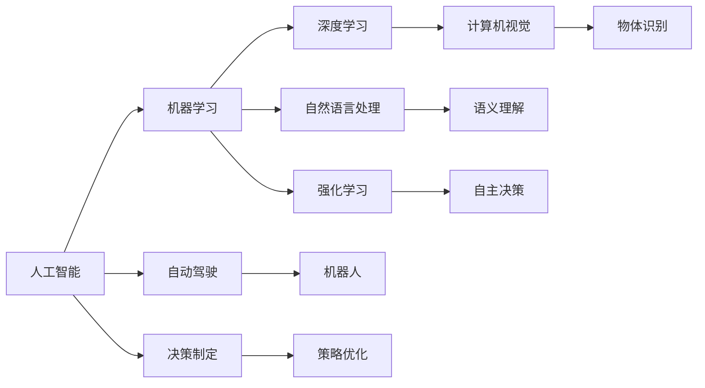

                 

# Andrej Karpathy：人工智能的未来发展挑战

> 关键词：Andrej Karpathy, 人工智能, 未来挑战, 机器学习, 深度学习, 自动驾驶, 计算机视觉, 自然语言处理, 强化学习, 技术趋势, 创新发展

## 1. 背景介绍

### 1.1 问题由来
Andrej Karpathy，作为斯坦福大学计算机科学系教授，同时也是特斯拉人工智能部门负责人，他经常对人工智能的未来趋势进行深度思考和讨论。在2019年，Karpathy于GitHub上发起了一个名为"Advancing AI and Robotics"的组织，旨在通过开源的方式，推动人工智能在自动驾驶、机器人等领域的发展。

作为人工智能领域的权威人士，Karpathy对人工智能的未来发展方向、当前面临的挑战以及潜在的创新方向有着独到的见解。本文将从背景介绍入手，详细解析Karpathy对未来人工智能发展的观点和看法。

## 2. 核心概念与联系

### 2.1 核心概念概述

Andrej Karpathy在他的研究中涉及的核心概念主要包括：

- **人工智能(Artificial Intelligence, AI)**：利用算法和计算机技术，模拟、延伸和扩展人类的智能，包括感知、理解、学习、推理和自我修正能力。
- **机器学习(Machine Learning, ML)**：通过数据驱动的方式，让机器从数据中学习规律和知识，自动改进算法。
- **深度学习(Deep Learning, DL)**：利用多层次神经网络结构，学习数据中抽象的特征和模式，处理复杂的数据结构。
- **计算机视觉(Computer Vision)**：研究如何让计算机通过算法理解图像和视频，识别物体、场景和动作。
- **自然语言处理(Natural Language Processing, NLP)**：使计算机能够理解和生成人类语言，进行语言分析和语义理解。
- **强化学习(Reinforcement Learning, RL)**：通过奖励和惩罚机制，让机器在试错中学习和优化策略。

这些核心概念构成了Karpathy研究的基石，涉及从感知、理解到学习和决策的各个层面。在实际应用中，这些技术往往是相互交织，共同作用的。

### 2.2 核心概念原理和架构的 Mermaid 流程图



这个图展示了Karpathy研究中核心概念之间的关系。其中，A到F分别表示不同的技术分支，从数据处理到决策制定的各个环节。G到M则代表这些技术在实际应用中的具体应用场景，如自动驾驶、机器人等。

## 3. 核心算法原理 & 具体操作步骤

### 3.1 算法原理概述

Karpathy的研究主要集中在以下几个算法原理上：

- **深度神经网络**：使用多层次的神经网络结构，能够自动学习数据中的复杂特征。
- **卷积神经网络(Convolutional Neural Networks, CNN)**：在计算机视觉领域，通过卷积操作提取局部特征，广泛用于图像分类、目标检测等任务。
- **循环神经网络(Recurrent Neural Networks, RNN)**：在自然语言处理领域，通过时间序列模型处理文本数据，广泛用于语言建模、机器翻译等任务。
- **变分自编码器(Variational Autoencoders, VAE)**：用于数据降维和生成建模，能够学习数据的潜在分布，生成与训练数据相似的新样本。
- **强化学习**：在自动驾驶、机器人等领域，通过奖励和惩罚机制，让模型自动优化策略。

### 3.2 算法步骤详解

在Karpathy的研究中，深度学习和强化学习的典型步骤如下：

1. **数据收集**：收集大量标注数据，构建训练集和验证集。
2. **模型训练**：在训练集上使用深度神经网络或强化学习模型进行训练，学习数据中的模式和规律。
3. **模型评估**：在验证集上评估模型性能，调整超参数和模型结构。
4. **模型应用**：将训练好的模型应用于实际问题中，进行推理、分类、检测等任务。

### 3.3 算法优缺点

Karpathy的深度学习和强化学习算法具有以下优点：

- **自动化**：能够自动从数据中学习规律，无需手动设计规则。
- **泛化能力强**：在大规模数据上训练的模型，可以适应不同的数据分布。
- **高效处理复杂数据**：能够处理高维度、非线性的复杂数据。

但同时，也存在一些缺点：

- **资源消耗大**：需要大量的计算资源和时间进行训练和推理。
- **过拟合风险**：在数据量不足或数据质量不高的情况下，容易出现过拟合。
- **可解释性差**：黑盒模型难以解释内部工作机制和决策逻辑。

### 3.4 算法应用领域

Karpathy的研究领域主要集中在以下几个方面：

- **自动驾驶**：使用计算机视觉和强化学习技术，让汽车能够自主驾驶。
- **机器人**：通过计算机视觉和自然语言处理技术，使机器人能够执行复杂任务。
- **自然语言处理**：利用深度学习技术，提升机器翻译、文本分类、情感分析等任务的效果。
- **计算机视觉**：开发更高效的图像识别、物体检测、图像生成等技术。

## 4. 数学模型和公式 & 详细讲解 & 举例说明

### 4.1 数学模型构建

Karpathy的研究涉及的数学模型主要包括：

- **神经网络模型**：
  $$
  y = \sigma(Wx + b)
  $$
  其中 $x$ 是输入向量，$y$ 是输出向量，$W$ 是权重矩阵，$b$ 是偏置向量，$\sigma$ 是非线性激活函数。

- **卷积神经网络**：
  $$
  y = \sigma(\mathcal{C}(x; \theta))
  $$
  其中 $\mathcal{C}(x; \theta)$ 是卷积操作，$\theta$ 是卷积核参数。

- **循环神经网络**：
  $$
  h_t = \sigma(W_hh_{t-1} + Wh_x + b)
  $$
  $$
  y_t = \sigma(W_{yh}h_t + b_y)
  $$
  其中 $h_t$ 是隐藏状态，$W_h, W_x, b$ 是参数，$y_t$ 是输出。

### 4.2 公式推导过程

以卷积神经网络为例，其核心公式为：

$$
y = \sigma(\mathcal{C}(x; \theta))
$$

其中 $\mathcal{C}(x; \theta)$ 表示卷积操作，包括卷积核的滑动、激活函数的非线性变换等。

卷积操作的公式为：

$$
\mathcal{C}(x; \theta) = \sum_{i,j} x_{i,j} \ast \theta_{i,j}
$$

其中 $x_{i,j}$ 是输入特征图上的像素值，$\theta_{i,j}$ 是卷积核上的权重值。

### 4.3 案例分析与讲解

以图像分类为例，使用卷积神经网络进行分类。首先对输入图像进行卷积操作，提取特征图，再通过池化操作降低特征图尺寸。最后使用全连接层进行分类，输出概率分布。

## 5. 项目实践：代码实例和详细解释说明

### 5.1 开发环境搭建

在进行深度学习实践前，需要搭建合适的开发环境。以下是基于Python的TensorFlow 2.0环境的搭建步骤：

1. 安装TensorFlow 2.0：
  ```bash
  pip install tensorflow==2.0
  ```

2. 安装必要的依赖库：
  ```bash
  pip install numpy matplotlib scikit-image
  ```

3. 创建虚拟环境：
  ```bash
  python3 -m venv venv
  source venv/bin/activate
  ```

### 5.2 源代码详细实现

以图像分类为例，使用卷积神经网络进行分类：

```python
import tensorflow as tf
from tensorflow.keras import layers, models

# 定义模型
model = models.Sequential()
model.add(layers.Conv2D(32, (3, 3), activation='relu', input_shape=(28, 28, 1)))
model.add(layers.MaxPooling2D((2, 2)))
model.add(layers.Conv2D(64, (3, 3), activation='relu'))
model.add(layers.MaxPooling2D((2, 2)))
model.add(layers.Conv2D(64, (3, 3), activation='relu'))
model.add(layers.Flatten())
model.add(layers.Dense(64, activation='relu'))
model.add(layers.Dense(10, activation='softmax'))

# 编译模型
model.compile(optimizer='adam',
              loss='sparse_categorical_crossentropy',
              metrics=['accuracy'])

# 加载数据集
mnist = tf.keras.datasets.mnist
(x_train, y_train), (x_test, y_test) = mnist.load_data()
x_train, x_test = x_train / 255.0, x_test / 255.0

# 训练模型
model.fit(x_train, y_train, epochs=5, validation_data=(x_test, y_test))
```

### 5.3 代码解读与分析

上述代码中，我们首先定义了一个包含卷积、池化和全连接层的卷积神经网络模型。然后通过`compile`方法编译模型，定义优化器、损失函数和评估指标。最后，我们使用`fit`方法对模型进行训练，并在测试集上评估性能。

## 6. 实际应用场景

### 6.1 自动驾驶

自动驾驶是Karpathy研究中的重要应用场景。使用深度学习技术，可以训练出能够处理复杂道路场景的计算机视觉模型，通过强化学习进行路径规划和决策。

Karpathy的自动驾驶模型主要包括两部分：

1. **感知模块**：使用卷积神经网络对摄像头采集的图像进行像素级语义分割，识别出道路、车辆、行人等物体。
2. **决策模块**：使用循环神经网络处理历史行驶数据，结合当前感知结果，预测下一步的驾驶行为。

### 6.2 机器人

机器人领域也是Karpathy研究的重要方向之一。通过计算机视觉和自然语言处理技术，机器人可以执行复杂的任务，如物体抓取、语音指令执行等。

Karpathy的机器人模型主要包括：

1. **视觉感知**：使用卷积神经网络对机器人周围环境进行图像采集和物体识别。
2. **任务执行**：使用循环神经网络处理自然语言指令，控制机器人手臂进行物体抓取和放置。
3. **路径规划**：使用强化学习技术，训练机器人自主导航和避开障碍物。

### 6.3 自然语言处理

在自然语言处理领域，Karpathy研究了机器翻译、文本分类、情感分析等任务。使用深度学习技术，可以训练出语言模型，进行文本生成和语义理解。

Karpathy的自然语言处理模型主要包括：

1. **编码器-解码器模型**：使用循环神经网络对输入文本进行编码，再通过解码器生成输出文本。
2. **注意力机制**：引入注意力机制，使模型能够对输入文本的不同部分进行加权处理。
3. **序列到序列模型**：使用长短期记忆网络(如LSTM)处理序列数据，实现文本生成和分类任务。

### 6.4 未来应用展望

未来，人工智能在自动驾驶、机器人、自然语言处理等领域的应用将更加广泛。随着技术的不断进步，这些技术将在更多领域得到应用，为人类社会带来新的变革。

在自动驾驶领域，自动驾驶技术将逐步普及，提升交通安全和效率。在机器人领域，机器人将广泛应用于医疗、家庭服务、工业制造等领域，提升生产力和生活质量。在自然语言处理领域，机器翻译、文本分类等技术将进一步提升，使信息获取更加便捷。

## 7. 工具和资源推荐

### 7.1 学习资源推荐

1. **Coursera课程**：斯坦福大学开设的"Convolutional Neural Networks for Visual Recognition"课程，介绍了卷积神经网络的原理和应用。
2. **深度学习框架文档**：TensorFlow、PyTorch等深度学习框架的官方文档，提供了丰富的学习资源和样例代码。
3. **博客和论文**：Karpathy在GitHub上的博客和研究论文，详细介绍了他的研究进展和心得。
4. **书籍**：《深度学习》（Ian Goodfellow等著）、《计算机视觉：模型、学习和推理》（Simon J.D. Prince著）等经典书籍，提供了深入的理论和实践指导。

### 7.2 开发工具推荐

1. **Jupyter Notebook**：Python的交互式开发环境，支持代码编写和数据可视化。
2. **TensorBoard**：TensorFlow配套的可视化工具，用于实时监测模型训练状态和性能。
3. **PyTorch**：Python深度学习框架，提供了丰富的模型和优化器。
4. **Keras**：高层次的深度学习API，易于使用，适用于快速原型开发。

### 7.3 相关论文推荐

1. **"Deep Learning for Self-Driving Cars"**：Karpathy和Andrej Feichtenhofer、Michael Maire、Jitendra Malik合著，介绍了深度学习在自动驾驶中的应用。
2. **"Learning to Drive: End-to-End Deep Reinforcement Learning for Self-Driving Cars"**：Karpathy和Ian Goodfellow合著，介绍了使用强化学习训练自动驾驶模型的技术。
3. **"Learning Phrase Representations using RNN Encoder-Decoder for Statistical Machine Translation"**：Karpathy和Ian Goodfellow合著，介绍了使用编码器-解码器模型进行机器翻译的方法。

## 8. 总结：未来发展趋势与挑战

### 8.1 研究成果总结

Karpathy在人工智能领域的研究成果丰富，涵盖了深度学习、计算机视觉、自然语言处理等多个方向。他的工作推动了自动驾驶、机器人、机器翻译等技术的进步，为人工智能的未来发展奠定了基础。

### 8.2 未来发展趋势

未来，人工智能将在自动驾驶、机器人、自然语言处理等领域继续快速发展。以下是几个主要趋势：

1. **自动化程度提高**：自动化技术将进一步提升，机器人在各个领域的应用将更加普及。
2. **智能化水平增强**：深度学习和强化学习技术将提升机器的感知、理解、推理和决策能力。
3. **跨领域融合**：不同领域的人工智能技术将互相借鉴和融合，形成更全面的应用。
4. **伦理和安全问题**：随着人工智能的普及，伦理和安全问题将引起更多关注，需要制定相应的规范和标准。

### 8.3 面临的挑战

人工智能发展过程中，仍然面临一些挑战：

1. **数据隐私和安全**：大规模数据采集和使用带来了隐私和安全问题。
2. **技术伦理和法律**：AI系统的决策过程可能缺乏透明度和可解释性，需要更多伦理和法律的监管。
3. **技术壁垒和人才短缺**：AI技术的复杂性和高要求，导致技术门槛和人才短缺。
4. **资源消耗和环境影响**：深度学习模型的高计算需求和能源消耗，对环境造成一定影响。

### 8.4 研究展望

未来，需要从以下几个方面进行深入研究：

1. **可解释性和透明性**：增强AI系统的可解释性和透明性，使决策过程更加可信和可控。
2. **跨领域融合**：推动不同领域技术的融合，形成更全面的AI系统。
3. **伦理和安全**：制定AI技术的伦理和安全标准，确保技术应用的公正性和安全性。
4. **资源优化**：优化AI模型的计算需求和能源消耗，减少对环境的影响。

## 9. 附录：常见问题与解答

**Q1：深度学习和强化学习有什么区别？**

A: 深度学习是一种基于数据的机器学习方法，通过构建神经网络模型，从数据中学习规律和特征。而强化学习是一种通过试错和奖励机制，让机器自主学习和优化策略的方法。深度学习主要处理有标注的数据，而强化学习主要处理无标注的数据。

**Q2：Karpathy的研究有哪些重要贡献？**

A: Karpathy在深度学习、计算机视觉和自然语言处理领域做出了重要贡献，包括：

1. 使用卷积神经网络处理计算机视觉任务。
2. 开发深度学习模型进行自动驾驶和机器人控制。
3. 提出编码器-解码器模型进行机器翻译。
4. 引入注意力机制提高模型性能。

**Q3：未来AI技术有哪些发展方向？**

A: 未来AI技术的发展方向包括：

1. 自动化和智能化提升。
2. 跨领域技术的融合和创新。
3. 伦理和安全问题解决。
4. 资源优化和环境影响减少。

**Q4：AI技术在实际应用中需要注意哪些问题？**

A: AI技术在实际应用中需要注意以下几个问题：

1. 数据隐私和安全。
2. 技术伦理和法律。
3. 技术壁垒和人才短缺。
4. 资源消耗和环境影响。

---

作者：禅与计算机程序设计艺术 / Zen and the Art of Computer Programming

