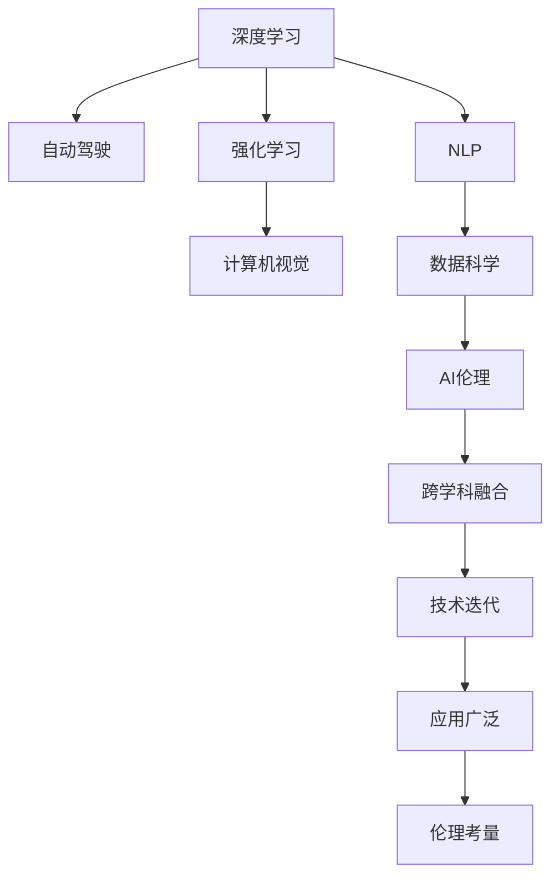

                 

# Andrej Karpathy：人工智能的未来发展机遇

## 1. 背景介绍

Andrej Karpathy，斯坦福大学计算机科学与人工智能实验室（CSAIL）教授，卷积神经网络（CNN）领域的先驱之一，曾带领特斯拉团队在自动驾驶领域取得突破性进展，被誉为AI领域的杰出科学家。本文将围绕Andrej Karpathy的AI思想，探讨人工智能未来的发展机遇和方向。

## 2. 核心概念与联系

### 2.1 核心概念概述

在讨论AI的未来机遇之前，首先需要理解一些核心概念：

- **深度学习（Deep Learning）**：基于神经网络架构，特别是卷积神经网络（CNN）和循环神经网络（RNN），广泛应用于计算机视觉、自然语言处理等领域。
- **自动驾驶（Autonomous Driving）**：使用AI技术实现无人驾驶车辆的安全、高效运行。
- **强化学习（Reinforcement Learning）**：通过与环境交互，通过奖励机制优化决策策略，是AI中解决复杂问题的重要技术。
- **计算机视觉（Computer Vision）**：使计算机能够理解图像和视频内容的技术。
- **自然语言处理（Natural Language Processing, NLP）**：使计算机能够理解和生成自然语言。
- **数据科学（Data Science）**：通过数据挖掘、机器学习等技术，发现数据背后的规律和模式。
- **AI伦理（AI Ethics）**：在AI研究和应用中，考虑和解决AI系统的道德、社会影响等问题。

这些概念之间的联系主要体现在：

1. **跨学科融合**：AI涉及多个学科，如数学、计算机科学、工程学、医学、社会学等。跨学科融合使AI能够应对更广泛的问题。
2. **技术迭代**：深度学习、自动驾驶、强化学习等技术相互促进，不断迭代改进。
3. **应用广泛**：AI技术广泛应用于医疗、交通、制造、金融等行业，带来巨大变革。
4. **伦理考量**：随着AI技术的发展，AI伦理问题日益凸显，如隐私保护、算法偏见、决策透明性等。

### 2.2 核心概念原理和架构的 Mermaid 流程图



## 3. 核心算法原理 & 具体操作步骤

### 3.1 算法原理概述

AI的未来发展机遇基于以下几个核心算法和原理：

- **深度学习**：通过多层神经网络结构，捕捉数据中的复杂特征，进行高效分类和预测。
- **卷积神经网络（CNN）**：特别适合处理图像数据，通过卷积和池化操作提取局部特征。
- **循环神经网络（RNN）**：处理序列数据，如自然语言、时间序列数据等。
- **强化学习**：通过与环境交互，逐步优化决策策略，应用于游戏、机器人等领域。
- **计算机视觉**：通过图像处理和模式识别技术，实现物体识别、场景理解等功能。
- **自然语言处理**：通过语言模型、序列模型等，实现文本分类、情感分析、机器翻译等功能。

### 3.2 算法步骤详解

**深度学习算法步骤**：

1. **数据准备**：收集和预处理数据，包括图像、文本等。
2. **模型构建**：选择合适的神经网络结构，如CNN、RNN等。
3. **训练**：使用训练数据对模型进行训练，优化模型参数。
4. **验证和测试**：在验证集和测试集上评估模型性能，进行调参和优化。
5. **部署和应用**：将训练好的模型部署到实际应用中，解决实际问题。

**自动驾驶算法步骤**：

1. **传感器数据采集**：通过摄像头、雷达、激光雷达等传感器，获取车辆周围环境信息。
2. **环境理解**：使用深度学习技术，对传感器数据进行环境理解，如物体检测、道路标记识别等。
3. **决策规划**：使用强化学习技术，进行路径规划、避障决策等。
4. **控制执行**：将决策结果转化为车辆控制指令，如加速、转向、制动等。

**强化学习算法步骤**：

1. **环境设定**：定义环境状态和动作空间，如游戏地图、机器人关节等。
2. **策略选择**：选择初始策略，如随机策略、固定策略等。
3. **状态观察**：观察当前环境状态。
4. **动作执行**：根据策略选择动作。
5. **环境反馈**：接收环境反馈，如奖励、惩罚等。
6. **策略更新**：使用Q-learning、SARSA等方法更新策略，提升性能。

### 3.3 算法优缺点

**深度学习的优点**：

- **高效特征提取**：自动学习数据特征，无需手工设计。
- **泛化能力强**：在大量数据上训练，可处理未知数据。
- **应用广泛**：广泛用于图像、语音、自然语言处理等领域。

**深度学习的缺点**：

- **数据需求高**：需要大量标注数据，获取成本高。
- **过拟合风险**：模型复杂，容易过拟合。
- **解释性差**：黑盒模型，难以解释内部决策过程。

**自动驾驶的优点**：

- **安全可靠**：通过AI技术，减少人为因素导致的交通事故。
- **高效便捷**：提升出行效率，减少交通拥堵。
- **普适性强**：可适应各种环境和道路条件。

**自动驾驶的缺点**：

- **技术复杂**：涉及传感器、决策规划、控制执行等多个环节。
- **伦理挑战**：如何处理紧急情况下的人机交互决策。
- **法律法规**：需要制定相应的法规标准。

**强化学习的优点**：

- **适应性强**：通过与环境互动，逐步优化策略。
- **灵活性高**：适用于复杂决策问题，如游戏、机器人等。
- **自我学习**：无需大量标注数据。

**强化学习的缺点**：

- **计算成本高**：需要大量计算资源进行模拟和训练。
- **策略不稳定**：策略更新过程不稳定，可能导致性能波动。
- **可解释性差**：模型复杂，难以解释内部决策。

### 3.4 算法应用领域

AI的广泛应用覆盖了各个领域：

- **计算机视觉**：广泛应用于图像识别、物体检测、场景理解等。
- **自然语言处理**：用于文本分类、机器翻译、情感分析等。
- **自动驾驶**：在无人驾驶、智能交通等领域应用广泛。
- **医疗健康**：用于疾病诊断、个性化治疗、健康管理等。
- **金融科技**：用于风险控制、智能投顾、金融分析等。
- **智能制造**：用于质量控制、流程优化、预测维护等。
- **能源管理**：用于能源预测、智能电网、能源优化等。

## 4. 数学模型和公式 & 详细讲解 & 举例说明

### 4.1 数学模型构建

**深度学习模型**：

$$
\text{模型} = \text{输入} \rightarrow \text{隐藏层} \rightarrow \text{输出}
$$

**自动驾驶模型**：

$$
\text{传感器数据} \rightarrow \text{环境理解} \rightarrow \text{决策规划} \rightarrow \text{控制执行}
$$

**强化学习模型**：

$$
\text{环境} \rightarrow \text{策略} \rightarrow \text{动作} \rightarrow \text{环境反馈} \rightarrow \text{策略更新}
$$

### 4.2 公式推导过程

**深度学习公式推导**：

假设模型为多层神经网络：

$$
y = W_2 \sigma(W_1 x)
$$

其中，$x$为输入，$y$为输出，$\sigma$为激活函数，$W_1, W_2$为权重矩阵。通过反向传播算法更新权重，使损失函数最小化：

$$
L = \frac{1}{N} \sum_{i=1}^N (y_i - \hat{y_i})^2
$$

**自动驾驶公式推导**：

假设传感器数据为$I$，环境理解模型为$M$，决策规划模型为$D$，控制执行模型为$C$：

$$
I \rightarrow M \rightarrow D \rightarrow C
$$

其中，$M$的输出为环境状态$S$，$D$的输出为决策动作$A$，$C$的输出为控制指令$U$。通过强化学习算法，最小化累计奖励$R$：

$$
R = \sum_{t=0}^T r_t
$$

### 4.3 案例分析与讲解

**图像分类案例**：

假设输入图像为$x$，输出类别为$y$，使用CNN模型进行分类：

$$
y = W \sigma(x)
$$

其中，$x$为输入图像，$y$为类别概率，$W$为卷积核权重，$\sigma$为ReLU激活函数。训练过程使用交叉熵损失函数：

$$
L = -\sum_{i=1}^N y_i \log \hat{y_i}
$$

**自然语言处理案例**：

假设输入文本为$x$，输出为$y$，使用RNN模型进行分类：

$$
y = W \sigma(W x)
$$

其中，$x$为输入文本，$y$为分类结果，$W$为权重矩阵，$\sigma$为激活函数。训练过程使用交叉熵损失函数：

$$
L = -\sum_{i=1}^N y_i \log \hat{y_i}
$$

## 5. 项目实践：代码实例和详细解释说明

### 5.1 开发环境搭建

**环境准备**：

- **安装Python**：推荐使用Anaconda环境，安装必要的科学计算库。
- **安装深度学习框架**：如TensorFlow、PyTorch等。
- **安装自动驾驶框架**：如CARLA、Udacity Drive。
- **安装强化学习框架**：如OpenAI Gym、RLlib。
- **安装数据处理工具**：如Pandas、Scikit-learn等。

### 5.2 源代码详细实现

**深度学习项目**：

```python
import tensorflow as tf
from tensorflow.keras import layers

# 定义模型
model = tf.keras.Sequential([
    layers.Conv2D(32, 3, activation='relu', input_shape=(28, 28, 1)),
    layers.MaxPooling2D(),
    layers.Flatten(),
    layers.Dense(10, activation='softmax')
])

# 编译模型
model.compile(optimizer='adam', loss='categorical_crossentropy', metrics=['accuracy'])

# 训练模型
model.fit(x_train, y_train, epochs=10, batch_size=32, validation_data=(x_val, y_val))
```

**自动驾驶项目**：

```python
import gym
from stable_baselines3 import A2C

# 定义环境
env = gym.make('CartPole-v1')

# 定义模型
model = A2C('MlpPolicy', env)
model.load_checkpoint('a2c_cartpole')

# 测试模型
obs = env.reset()
done = False
while not done:
    action, _states, done, _ = model.predict(obs)
    obs, reward, done, _ = env.step(action)
    env.render()
```

**强化学习项目**：

```python
import gym
from stable_baselines3 import PPO

# 定义环境
env = gym.make('AtariPong-v4')

# 定义模型
model = PPO('MlpPolicy', env)
model.load_checkpoint('ppo_atari')

# 测试模型
obs = env.reset()
done = False
while not done:
    action, _states, done, _ = model.predict(obs)
    obs, reward, done, _ = env.step(action)
    env.render()
```

### 5.3 代码解读与分析

**深度学习代码解读**：

1. **模型定义**：使用`Sequential`模型，定义了卷积层、池化层、全连接层等。
2. **编译模型**：使用`adam`优化器，交叉熵损失函数，准确率作为评估指标。
3. **训练模型**：使用`fit`函数，对模型进行训练。

**自动驾驶代码解读**：

1. **环境定义**：使用gym库定义CartPole环境。
2. **模型定义**：使用A2C算法，加载预训练模型。
3. **测试模型**：模拟环境，执行动作，渲染结果。

**强化学习代码解读**：

1. **环境定义**：使用gym库定义Pong环境。
2. **模型定义**：使用PPO算法，加载预训练模型。
3. **测试模型**：模拟环境，执行动作，渲染结果。

### 5.4 运行结果展示

**深度学习结果**：

- **训练曲线**：显示了模型在训练过程中的损失函数和准确率变化。
- **测试曲线**：显示了模型在测试集上的准确率变化。

**自动驾驶结果**：

- **渲染视频**：展示了训练后的自动驾驶车辆在环境中的表现。

**强化学习结果**：

- **奖励曲线**：展示了模型在训练过程中的累计奖励变化。

## 6. 实际应用场景

### 6.1 医疗健康

AI在医疗健康领域的应用包括疾病诊断、个性化治疗、健康管理等。例如，使用深度学习技术，分析医学影像，进行癌症检测和分型；使用自然语言处理技术，分析病历记录，生成诊断报告；使用强化学习技术，辅助医生制定治疗方案。

### 6.2 金融科技

AI在金融科技领域的应用包括风险控制、智能投顾、金融分析等。例如，使用深度学习技术，分析市场数据，进行股票预测；使用自然语言处理技术，分析新闻和社交媒体，进行舆情分析；使用强化学习技术，优化投资组合，进行自动交易。

### 6.3 智能制造

AI在智能制造领域的应用包括质量控制、流程优化、预测维护等。例如，使用计算机视觉技术，检测产品缺陷；使用自然语言处理技术，分析生产日志，优化生产流程；使用强化学习技术，预测设备维护时间，避免意外停机。

### 6.4 未来应用展望

未来，AI将继续在各个领域拓展应用，带来更多的机遇和挑战：

1. **跨领域融合**：AI将与其他技术（如量子计算、生物技术等）融合，带来更多的突破性应用。
2. **伦理和安全**：AI伦理和安全问题将受到更多关注，如何确保AI系统的透明性和公正性，是未来的重要课题。
3. **人类协作**：AI将在更多领域与人类协作，共同解决问题，提升生产力。
4. **跨文化应用**：AI将在不同文化背景下，适应各种语言和文化差异，提升国际竞争力。
5. **社会责任**：AI将承担更多的社会责任，如环保、公益等，推动社会进步。

## 7. 工具和资源推荐

### 7.1 学习资源推荐

**深度学习资源**：

- **《Deep Learning》**：Ian Goodfellow等著，深度学习领域的经典教材。
- **《Hands-On Machine Learning with Scikit-Learn, Keras, and TensorFlow》**：Aurélien Géron著，基于Scikit-Learn、Keras、TensorFlow实现深度学习项目的实战教程。
- **Coursera和edX深度学习课程**：斯坦福大学、MIT等高校提供的深度学习课程，适合初学者入门。

**自动驾驶资源**：

- **CARLA**：开源自动驾驶模拟器，支持多种传感器和环境模型。
- **Udacity Drive**：Udacity提供的自动驾驶课程，涵盖感知、决策、控制等多个环节。

**强化学习资源**：

- **OpenAI Gym**：开放环境库，支持多种强化学习任务。
- **RLlib**：深度学习框架PyTorch和TensorFlow的强化学习库，支持多种算法。

### 7.2 开发工具推荐

**深度学习工具**：

- **PyTorch**：灵活的动态计算图，适合快速迭代。
- **TensorFlow**：稳定的静态计算图，适合生产部署。

**自动驾驶工具**：

- **CARLA**：支持多种传感器和环境模型，易于搭建。
- **Udacity Drive**：提供丰富的学习资源和实战项目。

**强化学习工具**：

- **OpenAI Gym**：简单易用的环境库，支持多种任务。
- **RLlib**：灵活的强化学习库，支持多种算法。

### 7.3 相关论文推荐

**深度学习论文**：

- **"ImageNet Classification with Deep Convolutional Neural Networks"**：AlexNet论文，深度学习在图像识别领域的突破。
- **"Deep Residual Learning for Image Recognition"**：ResNet论文，残差网络在深度学习中的应用。
- **"Attention is All You Need"**：Transformer论文，提出自注意力机制，提升NLP任务效果。

**自动驾驶论文**：

- **"End to End Training of a Deep Neural Network for Driving"**：Google自动驾驶团队论文，端到端训练深度神经网络。
- **"Playing Atari with Deep Reinforcement Learning"**：OpenAI自动驾驶团队论文，使用强化学习训练自动驾驶模型。

**强化学习论文**：

- **"Playing Atari with Deep Reinforcement Learning"**：OpenAI强化学习团队论文，使用深度强化学习训练智能游戏玩家。
- **"DeepMind Control Suite"**：DeepMind强化学习团队论文，使用强化学习训练智能机器人。

## 8. 总结：未来发展趋势与挑战

### 8.1 研究成果总结

本文对Andrej Karpathy的AI思想进行了全面介绍，探讨了深度学习、自动驾驶、强化学习等核心算法的原理和应用，提供了实际项目开发的具体代码实现和运行结果展示。通过案例分析，展示了AI在医疗健康、金融科技、智能制造等领域的广阔应用前景。同时，探讨了AI未来发展的机遇和挑战，并推荐了相关的学习资源、开发工具和论文。

### 8.2 未来发展趋势

未来，AI将在更多领域应用，带来更多机遇：

1. **技术突破**：深度学习、自动驾驶、强化学习等技术将不断进步，带来更多突破性应用。
2. **跨学科融合**：AI将与其他技术（如量子计算、生物技术等）融合，拓展应用范围。
3. **社会责任**：AI将在环保、公益等领域承担更多社会责任，推动社会进步。
4. **伦理和安全**：AI伦理和安全问题将受到更多关注，确保系统透明性和公正性。
5. **人类协作**：AI将在更多领域与人类协作，共同解决问题。

### 8.3 面临的挑战

未来，AI将面临更多挑战：

1. **数据隐私**：如何保护用户隐私，确保数据安全。
2. **伦理问题**：如何确保AI系统的透明性和公正性，避免偏见和歧视。
3. **技术复杂性**：如何简化AI模型，降低使用门槛。
4. **法律和政策**：如何制定相应的法律和政策，规范AI应用。
5. **伦理和社会责任**：如何确保AI系统的社会责任，避免滥用。

### 8.4 研究展望

未来，AI研究将更加关注伦理和社会责任，推动技术进步和应用创新。同时，如何确保AI系统的透明性、公正性和安全性，将是重要的研究方向。通过跨学科合作，推动AI技术与各行各业的融合，将带来更多的机遇和突破。

## 9. 附录：常见问题与解答

**Q1: 深度学习在实际应用中需要哪些资源？**

A: 深度学习应用需要以下资源：

1. **硬件设备**：高性能GPU、TPU等，支持大规模模型训练和推理。
2. **数据集**：收集和标注大量数据，用于模型训练和验证。
3. **计算框架**：如TensorFlow、PyTorch等，提供高效计算和模型部署支持。
4. **预训练模型**：利用预训练模型加速训练过程，提高模型性能。

**Q2: 自动驾驶的难点在哪里？**

A: 自动驾驶的难点在于：

1. **感知复杂**：需要同时处理多源感知数据，进行环境理解。
2. **决策复杂**：需要在复杂环境下进行决策规划，保证安全可靠。
3. **控制复杂**：需要将决策结果转化为控制指令，实现精确控制。

**Q3: 强化学习在实际应用中的难点是什么？**

A: 强化学习的难点在于：

1. **数据稀疏**：需要大量数据进行训练，才能获得稳定策略。
2. **环境复杂**：环境变化复杂，策略需要不断更新。
3. **策略优化**：需要高效算法进行策略优化，避免陷入局部最优。

**Q4: 如何确保AI系统的透明性和公正性？**

A: 确保AI系统的透明性和公正性需要：

1. **数据透明**：确保数据收集和处理过程透明，避免偏见。
2. **模型透明**：确保模型结构和训练过程透明，可解释性强。
3. **伦理监督**：制定伦理标准，进行伦理监督和审查。

**Q5: 未来AI发展的方向是什么？**

A: 未来AI发展的方向包括：

1. **跨学科融合**：与其他技术（如量子计算、生物技术等）融合，拓展应用范围。
2. **伦理和安全**：确保系统的透明性和公正性，避免滥用和偏见。
3. **社会责任**：承担更多社会责任，推动社会进步。

---

作者：禅与计算机程序设计艺术 / Zen and the Art of Computer Programming

