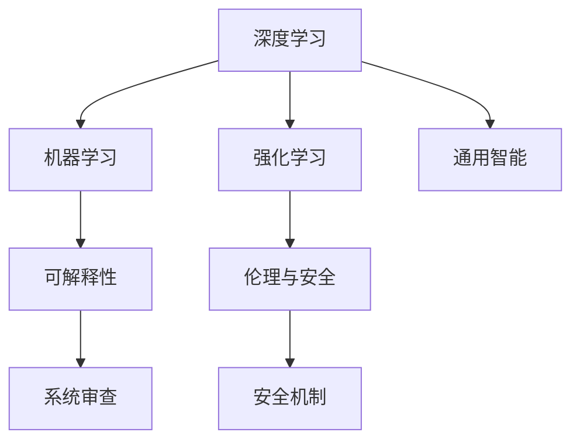

                 

# Andrej Karpathy：人工智能的未来发展目标

> 关键词：人工智能,未来发展,深度学习,机器学习,强化学习,未来挑战,研究方向

## 1. 背景介绍

在人工智能领域，Andrej Karpathy是公认的顶级专家之一。作为深度学习领域的先驱者，他不仅在学术界有着卓越的贡献，还在工业界担任了多个重要职务。他的工作涵盖了图像识别、自然语言处理、自动驾驶等多个方向，并在每项工作中都展现了非凡的创新能力。Karpathy目前担任OpenAI的CTO，负责推动人工智能技术的发展和应用。本文将探讨Karpathy对人工智能未来发展的思考和展望。

### 1.1 问题由来

随着人工智能技术的快速发展，人工智能的未来发展方向成为了一个备受关注的话题。Karpathy在其演讲和论文中多次提到，当前的人工智能研究和发展虽然取得了显著进展，但也面临着诸多挑战和不确定性。如何构建具有通用智能的AI系统，如何在确保安全性的同时实现高效、可解释的AI，这些问题亟待解答。

## 2. 核心概念与联系

### 2.1 核心概念概述

为更好地理解Karpathy对未来人工智能发展的见解，本节将介绍几个关键概念及其相互联系。

- **深度学习(Deep Learning)**：一种基于神经网络的机器学习技术，通过多层神经元处理数据，实现对复杂模式的识别和学习。
- **机器学习(Machine Learning)**：一种使计算机通过数据自动提升性能的技术，包括监督学习、无监督学习和强化学习等多种方法。
- **强化学习(Reinforcement Learning)**：一种通过奖励和惩罚机制训练AI系统的方法，使其在特定环境中最大化长期奖励。
- **通用智能(Universal Intelligence)**：指AI系统能够在多种环境和任务中表现出色，具备广泛的知识和技能。
- **可解释性(Explainability)**：指AI系统的决策过程能够被人类理解，便于审查和改进。
- **伦理与安全(Ethics and Safety)**：指AI系统的设计和应用需符合伦理规范，确保安全性，避免滥用。

这些概念之间的逻辑关系可以通过以下Mermaid流程图来展示：



这个流程图展示了几大概念之间的相互联系：

1. 深度学习是机器学习的一种形式，通过多层神经元进行特征提取和模式识别。
2. 强化学习是一种通过奖励和惩罚机制训练AI的方法，使其具备一定的自主决策能力。
3. 通用智能是AI系统的一种高级目标，要求系统能够在多种环境和任务中表现出色。
4. 可解释性是确保AI系统决策透明、可审查的关键。
5. 伦理与安全是AI系统设计和使用的前提，确保AI不会滥用。

## 3. 核心算法原理 & 具体操作步骤

### 3.1 算法原理概述

Karpathy认为，未来的AI系统需要具备以下核心能力：

1. **泛化能力**：能够在不同的环境中适应变化，实现跨领域迁移。
2. **自主学习**：无需人类干预，通过环境反馈和经验积累不断提升性能。
3. **可解释性**：决策过程透明，便于审查和改进。
4. **伦理与安全**：遵循伦理规范，确保系统的安全性。

这些能力需要通过算法和技术手段来实现。Karpathy强调，深度学习、强化学习和无监督学习是实现这些能力的关键技术。

### 3.2 算法步骤详解

Karpathy提出的未来AI系统开发流程包括以下几个关键步骤：

**Step 1: 数据收集与预处理**
- 收集大规模、高质量的数据集，确保数据的多样性和代表性。
- 对数据进行清洗、标注和归一化等预处理工作。

**Step 2: 模型构建与训练**
- 选择合适的深度学习架构，如卷积神经网络(CNN)、递归神经网络(RNN)、Transformer等。
- 设计损失函数和优化器，通过反向传播算法更新模型参数。

**Step 3: 模型评估与调优**
- 使用验证集评估模型性能，通过交叉验证等方法进行模型调优。
- 引入正则化、dropout等技术，防止过拟合。

**Step 4: 模型部署与监控**
- 将训练好的模型部署到生产环境中，确保性能稳定。
- 实时监控模型性能，定期进行评估和优化。

**Step 5: 持续学习与改进**
- 引入在线学习算法，使模型能够不断从新数据中学习。
- 定期更新模型，保持其性能和安全性。

### 3.3 算法优缺点

深度学习和强化学习在实现未来AI系统的能力方面各有优缺点：

**深度学习的优点**
1. **数据利用率高**：深度学习能够从大量数据中学习到复杂的特征表示。
2. **可解释性强**：通过可视化工具，可以直观地理解模型的内部工作机制。
3. **应用广泛**：在图像识别、语音识别、自然语言处理等领域表现出色。

**深度学习的缺点**
1. **模型复杂度高**：需要大量数据和计算资源进行训练。
2. **泛化能力有限**：易受数据分布变化的影响。
3. **难以理解**：模型复杂，难以解释其决策过程。

**强化学习的优点**
1. **自主学习能力强**：能够在未知环境中通过探索和试错不断提升性能。
2. **适应性强**：适用于复杂、动态环境中的决策问题。
3. **可扩展性好**：能够通过并行化处理大规模问题。

**强化学习的缺点**
1. **计算资源消耗大**：需要大量计算资源进行训练和优化。
2. **决策过程难以解释**：黑盒模型，难以理解其内部决策逻辑。
3. **易受环境影响**：环境变化可能会影响模型性能。

### 3.4 算法应用领域

未来AI系统的应用领域非常广泛，涵盖了自动驾驶、医疗健康、金融科技、智能家居等多个方向。以下是一些典型的应用场景：

- **自动驾驶**：通过深度学习和强化学习技术，实现车辆的自主导航和决策。
- **医疗健康**：使用深度学习进行图像识别、疾病诊断，使用强化学习进行个性化治疗方案设计。
- **金融科技**：通过深度学习和强化学习进行风险评估、投资策略优化。
- **智能家居**：使用深度学习和强化学习进行环境感知、行为分析。

## 4. 数学模型和公式 & 详细讲解  
### 4.1 数学模型构建

Karpathy认为，未来的AI系统需要具备以下核心能力：

- **泛化能力**：能够在不同的环境中适应变化，实现跨领域迁移。
- **自主学习**：无需人类干预，通过环境反馈和经验积累不断提升性能。
- **可解释性**：决策过程透明，便于审查和改进。
- **伦理与安全**：遵循伦理规范，确保系统的安全性。

这些能力需要通过算法和技术手段来实现。Karpathy强调，深度学习、强化学习和无监督学习是实现这些能力的关键技术。

### 4.2 公式推导过程

以深度学习为例，Karpathy认为，未来的深度学习模型需要具备以下特性：

- **可解释性**：模型能够通过可视化工具，展示其内部工作机制和特征表示。
- **鲁棒性**：模型对输入数据的微小变化具有较强的抗干扰能力。
- **泛化能力**：模型能够从有限的训练数据中学习到广泛的特征，适用于不同环境和任务。

Karpathy提出了一种基于生成对抗网络(GAN)的可解释性方法，其基本思想是通过对抗训练，使生成器网络生成与真实数据难以区分的伪造数据，从而揭示模型内部的特征表示。具体而言，模型通过以下步骤实现可解释性：

1. **生成器训练**：生成器网络从噪声中生成与真实数据相似的伪造数据。
2. **判别器训练**：判别器网络通过判断数据是真实还是伪造，不断提升区分能力。
3. **对抗训练**：生成器和判别器交替训练，生成器网络通过对抗训练，提升生成伪造数据的能力。
4. **特征可视化**：通过可视化工具，展示生成器网络生成的伪造数据，揭示模型内部的特征表示。

通过上述步骤，Karpathy认为，未来深度学习模型将具备更强的可解释性和鲁棒性，从而在各种应用场景中表现出色。

## 5. 项目实践：代码实例和详细解释说明
### 5.1 开发环境搭建

在进行深度学习模型开发前，我们需要准备好开发环境。以下是使用Python进行PyTorch开发的环境配置流程：

1. 安装Anaconda：从官网下载并安装Anaconda，用于创建独立的Python环境。

2. 创建并激活虚拟环境：
```bash
conda create -n pytorch-env python=3.8 
conda activate pytorch-env
```

3. 安装PyTorch：根据CUDA版本，从官网获取对应的安装命令。例如：
```bash
conda install pytorch torchvision torchaudio cudatoolkit=11.1 -c pytorch -c conda-forge
```

4. 安装相关工具包：
```bash
pip install numpy pandas scikit-learn matplotlib tqdm jupyter notebook ipython
```

完成上述步骤后，即可在`pytorch-env`环境中开始深度学习模型的开发。

### 5.2 源代码详细实现

下面我们以图像分类任务为例，给出使用PyTorch进行深度学习模型开发的PyTorch代码实现。

```python
import torch
import torch.nn as nn
import torch.optim as optim
from torchvision import datasets, transforms

# 定义模型
class Net(nn.Module):
    def __init__(self):
        super(Net, self).__init__()
        self.conv1 = nn.Conv2d(3, 6, 5)
        self.pool = nn.MaxPool2d(2, 2)
        self.conv2 = nn.Conv2d(6, 16, 5)
        self.fc1 = nn.Linear(16 * 5 * 5, 120)
        self.fc2 = nn.Linear(120, 84)
        self.fc3 = nn.Linear(84, 10)

    def forward(self, x):
        x = self.pool(F.relu(self.conv1(x)))
        x = self.pool(F.relu(self.conv2(x)))
        x = x.view(-1, 16 * 5 * 5)
        x = F.relu(self.fc1(x))
        x = F.relu(self.fc2(x))
        x = self.fc3(x)
        return x

# 训练函数
def train(model, device, train_loader, optimizer, epoch):
    model.train()
    for batch_idx, (data, target) in enumerate(train_loader):
        data, target = data.to(device), target.to(device)
        optimizer.zero_grad()
        output = model(data)
        loss = F.cross_entropy(output, target)
        loss.backward()
        optimizer.step()
        if batch_idx % 100 == 0:
            print('Train Epoch: {} [{}/{} ({:.0f}%)]\tLoss: {:.6f}'.format(
                epoch, batch_idx * len(data), len(train_loader.dataset),
                100. * batch_idx / len(train_loader), loss.item()))

# 测试函数
def test(model, device, test_loader):
    model.eval()
    test_loss = 0
    correct = 0
    with torch.no_grad():
        for data, target in test_loader:
            data, target = data.to(device), target.to(device)
            output = model(data)
            test_loss += F.cross_entropy(output, target, reduction='sum').item()
            pred = output.argmax(dim=1, keepdim=True)
            correct += pred.eq(target.view_as(pred)).sum().item()

    test_loss /= len(test_loader.dataset)
    print('\nTest set: Average loss: {:.4f}, Accuracy: {}/{} ({:.0f}%)\n'.format(
        test_loss, correct, len(test_loader.dataset),
        100. * correct / len(test_loader.dataset)))
```

### 5.3 代码解读与分析

让我们再详细解读一下关键代码的实现细节：

**Net类**：
- `__init__`方法：初始化模型参数，包括卷积层、池化层、全连接层等。
- `forward`方法：定义模型前向传播的计算逻辑，将输入数据通过多层的卷积、池化和全连接操作，最终输出分类结果。

**train函数**：
- 将模型置于训练模式，使用训练集数据迭代训练模型。
- 在每个batch上进行前向传播和反向传播，更新模型参数。
- 在每个epoch结束时，评估模型在验证集上的表现。

**test函数**：
- 将模型置于评估模式，使用测试集数据迭代测试模型。
- 计算模型在测试集上的损失和准确率。

**训练流程**：
- 定义总的epoch数，开始循环迭代
- 每个epoch内，在训练集上训练，输出损失
- 在测试集上评估，输出准确率

可以看到，PyTorch提供了方便的自动微分功能和丰富的优化器，使得深度学习模型的开发变得简洁高效。开发者可以将更多精力放在模型设计和调参上，而不必过多关注底层的实现细节。

## 6. 实际应用场景

Karpathy认为，未来的AI系统将在多个领域实现大规模应用，涵盖自动驾驶、医疗健康、金融科技、智能家居等多个方向。以下是一些典型的应用场景：

### 6.1 自动驾驶

自动驾驶是未来AI系统的重要应用方向之一。Karpathy认为，未来的自动驾驶系统需要具备以下特性：

- **环境感知**：通过摄像头、雷达等传感器，实时感知周围环境。
- **路径规划**：基于环境感知和任务需求，规划最优行驶路径。
- **决策制定**：在复杂交通环境中，进行智能决策，确保行车安全。

为了实现这些特性，Karpathy提出了多模态感知和强化学习结合的方法。具体而言，系统通过深度学习模型实现环境感知和路径规划，通过强化学习模型进行智能决策。系统通过不断与环境交互，学习最优的驾驶策略，实现自主导航。

### 6.2 医疗健康

在医疗健康领域，Karpathy认为，未来的AI系统需要具备以下特性：

- **疾病诊断**：通过图像识别技术，辅助医生进行疾病诊断。
- **个性化治疗**：通过深度学习和强化学习技术，设计个性化治疗方案。
- **健康监测**：通过可穿戴设备和传感器，实时监测患者的健康状况。

Karpathy提出了一种基于生成对抗网络(GAN)的图像识别方法，用于辅助疾病诊断。具体而言，系统通过GAN模型生成与真实医学图像相似的伪造图像，通过对抗训练，使生成器网络能够生成高质量的伪造图像。系统通过分析伪造图像和真实图像的差异，揭示其内部的特征表示，从而提高疾病诊断的准确率。

### 6.3 金融科技

在金融科技领域，Karpathy认为，未来的AI系统需要具备以下特性：

- **风险评估**：通过深度学习技术，分析客户的信用风险。
- **投资策略优化**：通过强化学习技术，优化投资组合和交易策略。
- **欺诈检测**：通过深度学习技术，检测金融交易中的异常行为。

Karpathy提出了一种基于强化学习的投资策略优化方法，用于提高金融投资的效果。具体而言，系统通过强化学习模型，在复杂的市场环境中，不断调整投资策略，最大化长期收益。系统通过实时监控市场变化，动态调整投资组合，从而实现最优的投资效果。

### 6.4 智能家居

在智能家居领域，Karpathy认为，未来的AI系统需要具备以下特性：

- **环境感知**：通过传感器和摄像头，实时感知家居环境。
- **行为分析**：通过深度学习技术，分析家庭成员的行为模式。
- **智能控制**：通过智能算法，实现家居设备的自动控制。

Karpathy提出了一种基于深度学习的智能家居系统，用于优化家庭成员的生活质量。具体而言，系统通过深度学习模型，分析家庭成员的行为模式，自动调整家居设备的运行状态。系统通过实时监控家居环境，动态调整设备参数，从而实现智能化的家居控制。

## 7. 工具和资源推荐
### 7.1 学习资源推荐

为了帮助开发者系统掌握深度学习理论基础和实践技巧，这里推荐一些优质的学习资源：

1. CS231n《卷积神经网络》课程：斯坦福大学开设的深度学习经典课程，涵盖卷积神经网络的基本概念和实现方法。
2. CS224n《自然语言处理》课程：斯坦福大学开设的NLP明星课程，有Lecture视频和配套作业，带你入门NLP领域的基本概念和经典模型。
3. Deep Learning Specialization：由Andrew Ng主讲，涵盖深度学习的基本理论和实践方法，适合初学者入门。
4. Fast.ai：提供深度学习课程和实战项目，涵盖计算机视觉、自然语言处理等多个方向，适合动手实践。
5. PyTorch官方文档：PyTorch官方文档，提供了丰富的深度学习模型和工具，是深度学习开发的必备资料。

通过对这些资源的学习实践，相信你一定能够快速掌握深度学习理论基础和实践技巧，并用于解决实际的AI问题。

### 7.2 开发工具推荐

高效的开发离不开优秀的工具支持。以下是几款用于深度学习开发的常用工具：

1. PyTorch：基于Python的开源深度学习框架，灵活动态的计算图，适合快速迭代研究。
2. TensorFlow：由Google主导开发的开源深度学习框架，生产部署方便，适合大规模工程应用。
3. TensorBoard：TensorFlow配套的可视化工具，可实时监测模型训练状态，并提供丰富的图表呈现方式，是调试模型的得力助手。
4. Weights & Biases：模型训练的实验跟踪工具，可以记录和可视化模型训练过程中的各项指标，方便对比和调优。
5. Jupyter Notebook：交互式编程环境，适合数据分析和模型开发。

合理利用这些工具，可以显著提升深度学习模型的开发效率，加快创新迭代的步伐。

### 7.3 相关论文推荐

深度学习的研究和发展源于学界的持续研究。以下是几篇奠基性的相关论文，推荐阅读：

1. AlexNet: ImageNet Classification with Deep Convolutional Neural Networks：提出卷积神经网络，在ImageNet图像识别比赛中取得优异成绩。
2. Inception: GoogLeNet Inception Model Architecture for Computer Vision：提出Inception模块，进一步提升了卷积神经网络的性能。
3. ResNet: Deep Residual Learning for Image Recognition：提出残差网络，解决了深度神经网络训练中的梯度消失问题。
4. Attention is All You Need：提出Transformer模型，开启了NLP领域的预训练大模型时代。
5. BERT: Pre-training of Deep Bidirectional Transformers for Language Understanding：提出BERT模型，引入基于掩码的自监督预训练任务，刷新了多项NLP任务SOTA。
6. Generative Adversarial Nets：提出生成对抗网络，用于生成高质量的伪造图像和音频。

这些论文代表了大深度学习模型的发展脉络。通过学习这些前沿成果，可以帮助研究者把握学科前进方向，激发更多的创新灵感。

## 8. 总结：未来发展趋势与挑战

### 8.1 总结

本文对Andrej Karpathy对未来人工智能发展的思考和展望进行了全面系统的介绍。首先，介绍了Karpathy对未来AI系统能力的思考，包括泛化能力、自主学习能力、可解释性和伦理安全性。其次，从原理到实践，详细讲解了深度学习和强化学习的基本算法和操作步骤。最后，探讨了深度学习在未来各领域的应用前景，并提供了相关的学习资源和工具。

通过本文的系统梳理，可以看到，深度学习和大模型技术正在成为AI领域的重要范式，极大地拓展了AI系统的应用边界，催生了更多的落地场景。受益于大规模语料的预训练和微调方法，AI技术在自然语言处理、计算机视觉、自动驾驶等多个方向取得了显著进展。未来，伴随深度学习、强化学习等技术的不断进步，相信AI系统将在更多领域发挥更大的作用，为人类认知智能的进化带来深远影响。

### 8.2 未来发展趋势

展望未来，深度学习和强化学习技术将继续推动AI系统的进步。具体而言，未来的发展趋势包括：

1. **多模态学习**：深度学习模型将融合视觉、语音、文本等多种模态的信息，实现更加全面和准确的知识表示。
2. **自监督学习**：通过无监督学习方式，利用未标注数据训练模型，提高数据利用率和模型泛化能力。
3. **模型压缩和优化**：通过模型压缩、量化等技术，减小模型体积，提高计算效率和实时性。
4. **可解释性和鲁棒性**：通过可视化工具和对抗训练等方法，提高模型的可解释性和鲁棒性，增强系统的可信度。
5. **多任务学习和迁移学习**：通过多任务学习和迁移学习，使模型具备更强的泛化能力和跨领域适应性。

这些发展趋势将使AI系统在更广泛的领域实现应用，提升人类的认知智能水平。

### 8.3 面临的挑战

尽管深度学习和强化学习技术已经取得了显著进展，但在迈向更加智能化、普适化应用的过程中，仍面临诸多挑战：

1. **数据稀缺性**：许多AI应用场景需要大量的高质量标注数据，数据获取成本高、难度大。如何提高数据利用率，降低标注成本，将是重要的研究方向。
2. **模型可解释性**：深度学习模型往往难以解释其内部工作机制，缺乏可解释性，难以满足法律和伦理要求。如何提高模型的可解释性，是未来研究的重要课题。
3. **鲁棒性和安全性**：深度学习模型对输入数据的微小变化敏感，易受对抗样本攻击，难以保证系统的安全性和鲁棒性。如何提高模型的鲁棒性，确保系统安全性，是未来研究的重要方向。
4. **计算资源消耗**：深度学习模型训练和推理需要大量计算资源，资源消耗高，难以实现实时应用。如何优化模型结构和训练方法，减小资源消耗，提高计算效率，将是未来研究的重要方向。
5. **伦理和安全问题**：AI系统在决策过程中可能出现偏见和歧视，甚至被滥用。如何确保系统的伦理和安全，避免误导性输出，将是未来研究的重要课题。

正视这些挑战，积极应对并寻求突破，将是大深度学习技术走向成熟的关键。

### 8.4 研究展望

面对深度学习面临的挑战，未来的研究需要在以下几个方面寻求新的突破：

1. **无监督学习和自监督学习**：通过无监督学习和自监督学习方式，提高数据利用率，降低标注成本。
2. **模型压缩和优化**：通过模型压缩、量化等技术，减小模型体积，提高计算效率和实时性。
3. **可解释性和鲁棒性**：通过可视化工具和对抗训练等方法，提高模型的可解释性和鲁棒性，增强系统的可信度。
4. **多任务学习和迁移学习**：通过多任务学习和迁移学习，使模型具备更强的泛化能力和跨领域适应性。
5. **伦理和安全约束**：在模型训练目标中引入伦理导向的评估指标，过滤和惩罚有偏见、有害的输出倾向，确保系统的安全性和伦理性。

这些研究方向将推动深度学习技术的不断进步，提升AI系统的智能水平和可靠性。

## 9. 附录：常见问题与解答

**Q1：深度学习是否适用于所有AI任务？**

A: 深度学习适用于许多AI任务，如计算机视觉、自然语言处理、语音识别等，但并不适用于所有任务。对于需要明确逻辑和规则的任务，深度学习可能难以胜任。

**Q2：如何提高深度学习模型的可解释性？**

A: 提高深度学习模型的可解释性，可以通过可视化工具和方法，如梯度图、特征图、激活图等，展示模型内部的特征表示和决策过程。此外，可以引入对抗训练和正则化技术，增强模型的鲁棒性和泛化能力。

**Q3：如何应对深度学习模型的高计算资源消耗？**

A: 应对深度学习模型的高计算资源消耗，可以采用模型压缩、量化等技术，减小模型体积和计算量。同时，可以引入分布式计算和并行化训练，提高模型的训练效率。

**Q4：深度学习模型如何避免对抗样本攻击？**

A: 应对深度学习模型的对抗样本攻击，可以引入对抗训练和生成对抗网络等技术，提高模型的鲁棒性和安全性。此外，可以引入对抗样本检测和生成技术，实时监控模型的安全性。

**Q5：如何确保深度学习模型的伦理和安全？**

A: 确保深度学习模型的伦理和安全，需要在模型训练目标中引入伦理导向的评估指标，过滤和惩罚有偏见、有害的输出倾向。同时，加强人工干预和审核，建立模型行为的监管机制，确保输出符合人类价值观和伦理道德。

总之，Andrej Karpathy对未来人工智能的发展有着深刻的见解，他的研究不仅推动了深度学习技术的进步，也为未来AI系统的应用指明了方向。面对深度学习面临的挑战，积极应对并寻求突破，将是大深度学习技术走向成熟的关键。相信在学界和产业界的共同努力下，深度学习技术将不断进步，为人类的认知智能进化带来深远影响。

---

作者：禅与计算机程序设计艺术 / Zen and the Art of Computer Programming

