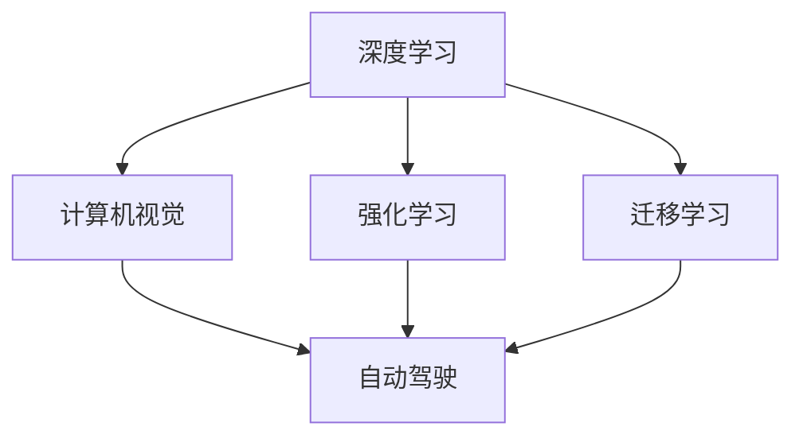

                 

# 《Andrej Karpathy：人工智能的未来发展目标》

## 1. 背景介绍

### 1.1 问题由来

Andrej Karpathy，作为斯坦福大学计算机视觉实验室的主任，同时也是OpenAI的特邀研究员，其研究工作涵盖了深度学习、计算机视觉、自动驾驶等多个前沿领域。他在计算机视觉与机器学习领域的贡献被誉为具有划时代意义，特别是在计算机视觉和自动驾驶技术方面，Karpathy提出的网络结构、优化方法等技术为学术界和工业界带来了重大的影响。

在此背景下，Karpathy关于人工智能未来发展目标的讨论，对于正在研究的科学家和应用人工智能技术的开发者而言，无疑具有深远的影响。他对于未来人工智能技术发展的预见和战略思考，将引领学术界和产业界在人工智能方向上的探索和实践。

## 2. 核心概念与联系

### 2.1 核心概念概述

为了更好地理解Karpathy对人工智能未来发展目标的讨论，首先需要了解一些核心概念：

- **深度学习**：一种模仿人类大脑神经网络结构与功能的机器学习技术。
- **计算机视觉**：使计算机能够“看”并理解图像或视频内容的学科。
- **自动驾驶**：通过计算机视觉和深度学习技术，使汽车能够自主驾驶的技术。
- **强化学习**：一种让计算机通过与环境的交互，自动学习和优化策略的机器学习方法。
- **迁移学习**：在某个领域学习到的知识迁移到另一个领域的技术。

这些概念之间的联系可以概括为：深度学习和计算机视觉是自动驾驶技术的基石，强化学习是提升自动驾驶系统智能化的重要手段，迁移学习则是实现跨领域技术应用的桥梁。

### 2.2 核心概念原理和架构的 Mermaid 流程图



该图表展示了深度学习、计算机视觉、自动驾驶、强化学习和迁移学习之间的关联。

## 3. 核心算法原理 & 具体操作步骤

### 3.1 算法原理概述

Karpathy对人工智能未来发展的目标集中在以下几个方向：

- **提升深度学习模型的性能**：通过创新算法、改进硬件和优化数据，进一步提升深度学习模型的性能。
- **扩展计算机视觉的应用范围**：在医疗、制造、教育等多个领域推广计算机视觉技术，提高人类生活质量。
- **实现自动驾驶技术的普及**：开发更智能、更安全、更可靠的自动驾驶系统，让自动驾驶技术成为主流。
- **推进强化学习的边界**：在自动驾驶、游戏AI等领域，利用强化学习训练出更智能的AI。
- **促进跨领域知识迁移**：利用迁移学习，将自然语言处理、计算机视觉等领域的知识应用于自动驾驶和游戏AI中。

### 3.2 算法步骤详解

Karpathy认为，为了实现上述目标，需要以下几个关键步骤：

1. **数据收集与预处理**：收集大量高质量的数据，并对数据进行预处理，保证数据集的质量。

2. **模型设计与训练**：设计适合特定任务的深度学习模型，并在大规模数据集上训练模型，提升模型的性能。

3. **迁移学习与知识迁移**：在已有模型和任务的基础上，通过迁移学习的方式，将知识迁移到新的任务和领域，提高新任务的性能。

4. **强化学习训练**：利用强化学习算法，训练模型在实际环境中的决策能力，不断优化模型的决策策略。

5. **模型评估与部署**：在实际应用环境中，对模型进行评估，并根据评估结果优化模型，最终部署到实际应用中。

### 3.3 算法优缺点

**优点**：

- **数据驱动**：通过大规模的数据驱动，提升模型的泛化能力和性能。
- **算法创新**：不断创新深度学习算法，提升模型的精确度和效率。
- **跨领域应用**：利用迁移学习和强化学习，促进跨领域的知识迁移和应用。

**缺点**：

- **数据依赖**：对数据质量和数量的依赖高，数据不足或质量低会限制模型的性能。
- **模型复杂**：深度学习模型结构复杂，训练和部署成本高。
- **泛化能力有限**：模型在特定数据集上表现优异，但在新数据集上的泛化能力有限。

### 3.4 算法应用领域

Karpathy认为，基于深度学习、计算机视觉、强化学习等技术的模型可以应用于以下几个领域：

- **医疗影像分析**：利用计算机视觉和深度学习技术，提高医学影像分析的准确性。
- **智能制造**：利用计算机视觉和强化学习技术，实现智能制造。
- **教育培训**：利用计算机视觉和自然语言处理技术，开发智能教育平台。
- **自动驾驶**：利用计算机视觉、深度学习和强化学习技术，实现自动驾驶。
- **游戏AI**：利用深度学习和强化学习技术，开发高智能的AI游戏玩家。

## 4. 数学模型和公式 & 详细讲解 & 举例说明

### 4.1 数学模型构建

在此部分，我们将介绍一些Karpathy在深度学习、计算机视觉和自动驾驶中常用的数学模型。

#### 4.1.1 卷积神经网络

卷积神经网络(CNN)是Karpathy在计算机视觉中广泛使用的模型，其基本结构如图：

$$
\text{CNN} = \underbrace{\text{卷积层} \rightarrow \text{激活函数} \rightarrow \text{池化层}}_{\text{特征提取}} \rightarrow \text{全连接层} \rightarrow \text{输出层}
$$

#### 4.1.2 循环神经网络

循环神经网络(RNN)是处理序列数据（如文本、音频）的经典模型。其结构如下：

$$
\text{RNN} = \underbrace{\text{循环层} \rightarrow \text{激活函数}}_{\text{循环结构}} \rightarrow \text{全连接层} \rightarrow \text{输出层}
$$

#### 4.1.3 卷积神经网络和循环神经网络结合

在自动驾驶中，Karpathy将CNN和RNN结合，设计出端到端的自动驾驶模型。其结构如图：

$$
\text{自动驾驶模型} = \underbrace{\text{卷积层} \rightarrow \text{池化层} \rightarrow \text{循环层} \rightarrow \text{全连接层}}_{\text{特征提取}} \rightarrow \text{输出层}
$$

### 4.2 公式推导过程

#### 4.2.1 CNN的推导

CNN的特征提取过程可以用以下公式表示：

$$
\text{Convolution} = \sum_{i=1}^{n} w_i * \text{Input} \rightarrow \text{Batch Normalization} \rightarrow \text{ReLU} \rightarrow \text{Pooling} \rightarrow \text{Full Connection}
$$

其中，$*$ 表示卷积操作，$n$ 为卷积核的个数，$w_i$ 为卷积核的权重。

#### 4.2.2 RNN的推导

RNN的循环结构可以用以下公式表示：

$$
\text{RNN} = \sum_{t=1}^{T} \text{hidden}_t \rightarrow \text{ReLU} \rightarrow \text{Full Connection} \rightarrow \text{Softmax}
$$

其中，$\text{hidden}_t$ 表示当前时刻的状态，$T$ 为序列的长度，$softmax$ 函数用于将输出转换为概率分布。

### 4.3 案例分析与讲解

以自动驾驶模型为例，Karpathy设计了端到端的自动驾驶系统，如图：

$$
\text{自动驾驶系统} = \underbrace{\text{LIDAR} \rightarrow \text{CNN} \rightarrow \text{RNN}}_{\text{特征提取}} \rightarrow \text{决策层} \rightarrow \text{控制层}
$$

其中，LIDAR是激光雷达，用于感知周围环境，CNN和RNN用于提取特征，决策层用于生成决策，控制层用于执行决策。

## 5. 项目实践：代码实例和详细解释说明

### 5.1 开发环境搭建

Karpathy推荐使用PyTorch和TensorFlow等深度学习框架进行模型开发。具体步骤包括：

1. 安装PyTorch或TensorFlow。
2. 配置开发环境。
3. 安装必要的第三方库。

### 5.2 源代码详细实现

以下是一个基于PyTorch的卷积神经网络模型的实现代码：

```python
import torch
import torch.nn as nn
import torch.optim as optim

# 定义卷积神经网络模型
class CNN(nn.Module):
    def __init__(self):
        super(CNN, self).__init__()
        self.conv1 = nn.Conv2d(3, 64, kernel_size=3, stride=1, padding=1)
        self.pool = nn.MaxPool2d(kernel_size=2, stride=2)
        self.fc1 = nn.Linear(64 * 28 * 28, 10)

    def forward(self, x):
        x = self.pool(torch.relu(self.conv1(x)))
        x = x.view(-1, 64 * 28 * 28)
        x = self.fc1(x)
        return x

# 训练模型
model = CNN()
optimizer = optim.SGD(model.parameters(), lr=0.01, momentum=0.9)
loss_fn = nn.CrossEntropyLoss()

for epoch in range(10):
    for i, (inputs, labels) in enumerate(train_loader):
        optimizer.zero_grad()
        outputs = model(inputs)
        loss = loss_fn(outputs, labels)
        loss.backward()
        optimizer.step()
```

### 5.3 代码解读与分析

以上代码实现了卷积神经网络模型，包含卷积层、池化层、全连接层等组件，并使用随机梯度下降法进行训练。

## 6. 实际应用场景

### 6.1 医疗影像分析

Karpathy认为，计算机视觉技术可以应用于医疗影像分析，如图：

$$
\text{医疗影像分析} = \underbrace{\text{图像采集} \rightarrow \text{数据增强} \rightarrow \text{卷积神经网络}}_{\text{特征提取}} \rightarrow \text{分类器}
$$

该模型可以用于肺癌、乳腺癌等疾病的早期诊断，提高了医疗诊断的准确性和效率。

### 6.2 智能制造

Karpathy提到，计算机视觉和深度学习技术可以应用于智能制造，如图：

$$
\text{智能制造} = \underbrace{\text{图像采集} \rightarrow \text{数据增强} \rightarrow \text{卷积神经网络}}_{\text{特征提取}} \rightarrow \text{质量检测器}
$$

该模型可以用于检测产品缺陷，提高生产效率和产品质量。

### 6.3 教育培训

Karpathy认为，计算机视觉和自然语言处理技术可以应用于教育培训，如图：

$$
\text{教育培训} = \underbrace{\text{视频采集} \rightarrow \text{数据增强} \rightarrow \text{循环神经网络}}_{\text{特征提取}} \rightarrow \text{知识推荐器}
$$

该模型可以用于推荐学习资源，提高学习效率和效果。

### 6.4 自动驾驶

Karpathy设计的自动驾驶模型如图：

$$
\text{自动驾驶} = \underbrace{\text{LIDAR} \rightarrow \text{卷积神经网络} \rightarrow \text{循环神经网络}}_{\text{特征提取}} \rightarrow \text{决策层} \rightarrow \text{控制层}
$$

该模型可以用于无人驾驶汽车，提升交通安全和效率。

### 6.5 游戏AI

Karpathy提到，深度学习和强化学习技术可以应用于游戏AI，如图：

$$
\text{游戏AI} = \underbrace{\text{游戏屏幕} \rightarrow \text{卷积神经网络} \rightarrow \text{循环神经网络}}_{\text{特征提取}} \rightarrow \text{强化学习}
$$

该模型可以用于开发高智能的AI游戏玩家。

## 7. 工具和资源推荐

### 7.1 学习资源推荐

1. Karpathy的公开课程和讲座。
2. 《深度学习》书籍。
3. PyTorch官方文档。
4. TensorFlow官方文档。
5. GitHub上的开源项目。

### 7.2 开发工具推荐

1. PyTorch。
2. TensorFlow。
3. OpenAI Gym。
4. PyTorch Lightning。
5. Jupyter Notebook。

### 7.3 相关论文推荐

1. "What Are the Best Practices for Developing Deep Learning Models?" by Andrej Karpathy.
2. "Deep Learning" by Ian Goodfellow, Yoshua Bengio, and Aaron Courville.
3. "Playing Atari with Deep Reinforcement Learning" by Volodymyr Mnih et al.
4. "Deep Residual Learning for Image Recognition" by Kaiming He et al.
5. "Deep RNN Models for Human Activity Recognition" by Jianfeng Gao et al.

## 8. 总结：未来发展趋势与挑战

### 8.1 研究成果总结

Karpathy在深度学习、计算机视觉、自动驾驶等领域的研究成果丰富，提出了许多具有创新性的方法和模型。

### 8.2 未来发展趋势

1. 提升深度学习模型的性能。
2. 扩展计算机视觉的应用范围。
3. 实现自动驾驶技术的普及。
4. 推进强化学习的边界。
5. 促进跨领域知识迁移。

### 8.3 面临的挑战

1. 数据依赖。
2. 模型复杂。
3. 泛化能力有限。

### 8.4 研究展望

1. 探索新算法和新模型结构。
2. 研究数据增强和迁移学习技术。
3. 开发新场景和应用的AI。

## 9. 附录：常见问题与解答

**Q1：如何提升深度学习模型的性能？**

A: 通过优化算法、改进模型结构、增加数据量等方法。

**Q2：计算机视觉在医疗影像分析中的应用有哪些？**

A: 用于早期诊断、病灶定位、手术辅助等。

**Q3：自动驾驶技术的难点有哪些？**

A: 感知、决策、控制等方面的挑战。

**Q4：游戏AI如何实现高智能？**

A: 通过深度学习和强化学习训练。

**Q5：如何实现跨领域知识迁移？**

A: 使用迁移学习技术。

---

作者：禅与计算机程序设计艺术 / Zen and the Art of Computer Programming

