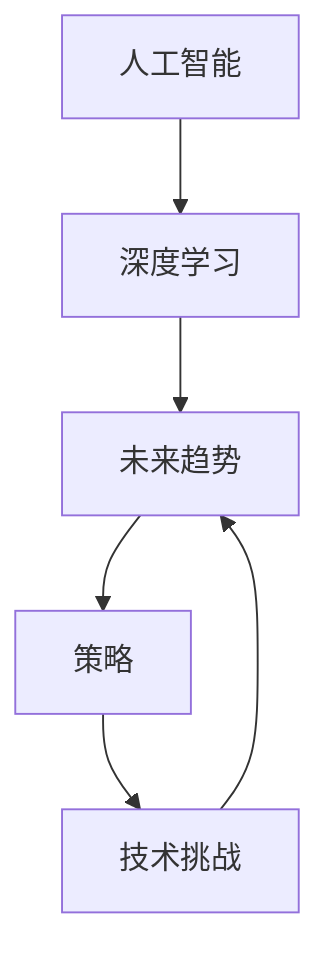

                 

# Andrej Karpathy：人工智能的未来发展策略

> 关键词：人工智能,深度学习,未来趋势,策略,技术挑战

## 1. 背景介绍

Andrej Karpathy 是人工智能领域的领军人物，斯坦福大学教授，特斯拉公司首席人工智能科学家。他在深度学习、计算机视觉、自动驾驶等领域有着卓越贡献，并且对人工智能的未来发展有着深入的思考。本文将围绕他的视角，探讨人工智能的未来发展策略。

## 2. 核心概念与联系

### 2.1 核心概念概述

为便于深入理解，我们首先梳理一些核心的概念：

- **人工智能(AI)**：使计算机系统执行通常需要人类智能的任务，包括感知、学习、推理、决策、语言理解等。
- **深度学习(Deep Learning)**：基于神经网络模型，通过大量数据训练，让计算机自动学习复杂特征，实现端到端的任务。
- **未来趋势**：指人工智能技术的发展方向，包括技术创新、应用拓展、社会影响等方面。
- **策略**：为实现未来目标所采取的计划和方法。
- **技术挑战**：在发展过程中遇到的难题和阻碍。

通过这些概念，我们可以更清晰地认识到，Andrej Karpathy的视角是从技术、应用和社会的交叉点，来探讨人工智能的未来发展策略。

### 2.2 核心概念原理和架构的 Mermaid 流程图



以上流程图展示了人工智能、深度学习、未来趋势、策略和技术挑战之间的联系。我们接下来将围绕这些概念，深入探讨AI的未来发展策略。

## 3. 核心算法原理 & 具体操作步骤

### 3.1 算法原理概述

Andrej Karpathy认为，人工智能的未来发展应当以深度学习为基础，结合多模态融合、跨领域迁移等技术手段，不断拓展应用场景，提升系统智能水平。

- **多模态融合**：将视觉、语音、文本等多种数据源整合，实现跨模态的智能交互和理解。
- **跨领域迁移**：让模型在不同领域和任务间实现知识迁移，提升泛化能力。

### 3.2 算法步骤详解

1. **数据收集和预处理**：
   - 收集多源数据，包括图像、文本、音频等。
   - 对数据进行清洗、标注和标准化处理。

2. **模型选择与设计**：
   - 选择适合任务的深度学习模型，如卷积神经网络、循环神经网络、Transformer等。
   - 设计多模态融合模块，实现跨模态特征提取和融合。

3. **模型训练与微调**：
   - 在大量标注数据上训练模型。
   - 根据不同任务特点进行模型微调，提升性能。

4. **模型评估与部署**：
   - 使用验证集评估模型性能，进行调参和优化。
   - 将模型部署到实际应用场景，进行测试和优化。

### 3.3 算法优缺点

**优点**：
- **广泛应用**：深度学习在图像识别、语音识别、自然语言处理等领域已取得显著成果。
- **高精度**：通过大量数据训练，模型具备较高的预测精度。

**缺点**：
- **数据依赖**：需要大量标注数据，数据获取成本高。
- **过拟合风险**：模型容易过拟合，泛化能力有限。
- **计算资源要求高**：模型训练和推理需要大量计算资源。

### 3.4 算法应用领域

深度学习在以下几个领域有着广泛的应用：

- **计算机视觉**：图像分类、目标检测、人脸识别等。
- **自然语言处理**：文本分类、机器翻译、情感分析等。
- **语音识别**：语音转文本、语音合成、语音命令等。
- **推荐系统**：个性化推荐、广告推荐等。
- **自动驾驶**：环境感知、路径规划、决策等。

## 4. 数学模型和公式 & 详细讲解 & 举例说明

### 4.1 数学模型构建

以图像分类为例，构建卷积神经网络模型：

- **输入层**：输入图像 $x$。
- **卷积层**：通过卷积操作提取特征 $h_1 = f_1(x)$。
- **池化层**：通过池化操作缩小特征图 $h_2 = f_2(h_1)$。
- **全连接层**：将特征图转换为类别概率 $y = f_3(h_2)$。

### 4.2 公式推导过程

**卷积操作**：

$$
f_1(x) = \sum_{i=1}^n w_i * x_i
$$

其中 $w_i$ 为卷积核，$x_i$ 为输入像素。

**池化操作**：

$$
f_2(h_1) = \frac{1}{k}\sum_{i=1}^k h_{1,i}
$$

其中 $h_{1,i}$ 为特征图中的第 $i$ 个像素值，$k$ 为池化窗口大小。

**全连接层**：

$$
y = softmax(W \cdot h_2 + b)
$$

其中 $W$ 为权重矩阵，$b$ 为偏置向量，$softmax$ 函数将输出映射到 $[0,1]$ 区间。

### 4.3 案例分析与讲解

以图像分类为例，使用 CIFAR-10 数据集训练一个卷积神经网络。步骤如下：

1. **数据准备**：收集 CIFAR-10 数据集，并进行预处理和增强。
2. **模型构建**：定义卷积层、池化层和全连接层。
3. **模型训练**：使用随机梯度下降法训练模型，并进行参数优化。
4. **模型评估**：在测试集上评估模型性能，并进行调参和优化。

## 5. 项目实践：代码实例和详细解释说明

### 5.1 开发环境搭建

使用 Python 和 TensorFlow 搭建开发环境，具体步骤如下：

1. **安装 Python 和 pip**：
   - 安装 Python 3.x，并配置环境变量。
   - 使用 pip 安装 TensorFlow。

2. **创建虚拟环境**：
   - 使用虚拟环境工具创建 Python 虚拟环境。

3. **安装依赖库**：
   - 使用 pip 安装所需的库，如 NumPy、Pillow、Matplotlib 等。

### 5.2 源代码详细实现

以下是一个简单的卷积神经网络模型的代码实现：

```python
import tensorflow as tf
from tensorflow.keras import layers, models

# 定义模型
model = models.Sequential([
    layers.Conv2D(32, (3, 3), activation='relu', input_shape=(32, 32, 3)),
    layers.MaxPooling2D((2, 2)),
    layers.Conv2D(64, (3, 3), activation='relu'),
    layers.MaxPooling2D((2, 2)),
    layers.Conv2D(64, (3, 3), activation='relu'),
    layers.Flatten(),
    layers.Dense(64, activation='relu'),
    layers.Dense(10, activation='softmax')
])

# 编译模型
model.compile(optimizer='adam',
              loss='sparse_categorical_crossentropy',
              metrics=['accuracy'])

# 训练模型
model.fit(train_images, train_labels, epochs=10, validation_data=(test_images, test_labels))
```

### 5.3 代码解读与分析

以上代码实现了一个简单的卷积神经网络模型，包含卷积层、池化层和全连接层。使用 TensorFlow 的 Keras 接口，可以方便地定义和训练模型。

- **Conv2D** 层：定义卷积操作。
- **MaxPooling2D** 层：定义池化操作。
- **Dense** 层：定义全连接层。
- **Model.compile**：编译模型，指定优化器、损失函数和评估指标。
- **Model.fit**：训练模型，指定训练数据和验证数据。

## 6. 实际应用场景

### 6.1 智能医疗

人工智能在医疗领域的应用前景广阔，深度学习可以用于疾病诊断、影像分析、药物研发等。以疾病诊断为例，通过多模态数据（如 CT 图像、MRI 图像、基因数据等），训练模型实现疾病诊断和预测。

### 6.2 智能制造

深度学习在制造业中的应用包括质量检测、故障预测、智能排程等。通过视觉检测、传感器数据等，训练模型实现自动化检测和预测。

### 6.3 自动驾驶

自动驾驶是深度学习的重要应用场景之一，用于环境感知、路径规划、决策等。通过多传感器数据融合，训练模型实现自动驾驶。

## 7. 工具和资源推荐

### 7.1 学习资源推荐

1. **Coursera**：提供深度学习、计算机视觉等课程，由斯坦福大学、密歇根大学等名校教授授课。
2. **Kaggle**：数据科学竞赛平台，可以参与深度学习竞赛，学习实战经验。
3. **Deep Learning Specialization**：Andrew Ng 的深度学习课程，包括多门深度学习相关课程。
4. **Fast.ai**：提供深度学习课程，包括计算机视觉、自然语言处理等方向。
5. **GitHub**：深度学习开源项目资源丰富，可以参考和学习。

### 7.2 开发工具推荐

1. **TensorFlow**：开源深度学习框架，支持多平台部署。
2. **PyTorch**：开源深度学习框架，灵活性和易用性高。
3. **Keras**：深度学习框架，提供了简单易用的 API。
4. **Jupyter Notebook**：交互式编程环境，便于实验和分享代码。
5. **Visual Studio Code**：开发工具，支持多种语言和插件。

### 7.3 相关论文推荐

1. **ImageNet Classification with Deep Convolutional Neural Networks**：AlexNet 论文，提出了卷积神经网络在图像分类中的应用。
2. **Efficient Object Localization Using Convolutional Networks**：R-CNN 论文，提出了区域卷积神经网络用于目标检测。
3. **Convolutional Neural Networks for Sentence Classification**：使用卷积神经网络进行文本分类。
4. **Attention is All You Need**：Transformer 论文，提出了自注意力机制，提升了语言模型性能。
5. **Learning Transferable Knowledge for General Visual Recognition**：提出迁移学习，提升模型的泛化能力。

## 8. 总结：未来发展趋势与挑战

### 8.1 研究成果总结

Andrej Karpathy认为，未来人工智能的发展将围绕以下几个方向：

1. **多模态融合**：将视觉、语音、文本等数据整合，实现跨模态的智能交互。
2. **跨领域迁移**：在多领域和任务间实现知识迁移，提升泛化能力。
3. **自监督学习**：利用无标注数据进行预训练，提升模型的泛化能力。
4. **对抗训练**：引入对抗样本，提高模型的鲁棒性。
5. **可解释性**：提升模型的可解释性，增强用户信任。

### 8.2 未来发展趋势

1. **多模态融合**：融合视觉、语音、文本等多模态数据，提升模型的智能水平。
2. **跨领域迁移**：在不同领域和任务间实现知识迁移，提升模型的泛化能力。
3. **自监督学习**：利用无标注数据进行预训练，提升模型的泛化能力。
4. **对抗训练**：引入对抗样本，提高模型的鲁棒性。
5. **可解释性**：提升模型的可解释性，增强用户信任。

### 8.3 面临的挑战

1. **数据依赖**：需要大量标注数据，数据获取成本高。
2. **过拟合风险**：模型容易过拟合，泛化能力有限。
3. **计算资源要求高**：模型训练和推理需要大量计算资源。
4. **可解释性不足**：深度学习模型通常是黑盒系统，难以解释其内部工作机制。
5. **安全性问题**：深度学习模型可能学习到有害信息，产生误导性输出。

### 8.4 研究展望

未来人工智能的发展需要从以下几个方面进行探索：

1. **自监督学习**：利用无标注数据进行预训练，提升模型的泛化能力。
2. **可解释性增强**：提升模型的可解释性，增强用户信任。
3. **对抗训练**：引入对抗样本，提高模型的鲁棒性。
4. **跨领域迁移**：在不同领域和任务间实现知识迁移，提升模型的泛化能力。
5. **多模态融合**：融合视觉、语音、文本等多模态数据，提升模型的智能水平。

## 9. 附录：常见问题与解答

### Q1: 什么是深度学习？

A: 深度学习是一种基于神经网络模型的机器学习方法，通过大量数据训练，让计算机自动学习复杂特征，实现端到端的任务。

### Q2: 深度学习的优点和缺点有哪些？

A: 深度学习的优点包括高精度、广泛的适用性等。缺点包括数据依赖、计算资源要求高、过拟合风险等。

### Q3: 深度学习的应用场景有哪些？

A: 深度学习在计算机视觉、自然语言处理、语音识别、自动驾驶等领域有着广泛的应用。

### Q4: 如何提高深度学习模型的泛化能力？

A: 提高深度学习模型的泛化能力，可以采用自监督学习、对抗训练、跨领域迁移等技术手段。

### Q5: 深度学习模型的可解释性不足，有哪些解决方案？

A: 提高深度学习模型的可解释性，可以采用模型可视化、特征解释、可解释性算法等技术手段。

---

作者：禅与计算机程序设计艺术 / Zen and the Art of Computer Programming

