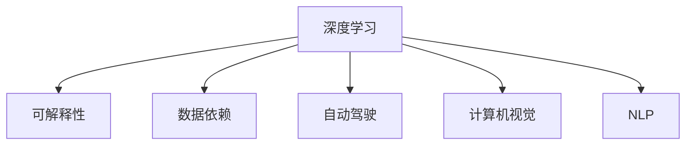

                 

# Andrej Karpathy：人工智能的未来发展策略

> 关键词：人工智能,未来发展策略,深度学习,算法优化,自动驾驶,计算机视觉,自然语言处理

## 1. 背景介绍

### 1.1 问题由来

近年来，随着人工智能技术的迅猛发展，深度学习模型在多个领域取得了显著成果。机器视觉、自然语言处理、自动驾驶等方向，均基于深度学习算法获得了突破性进展。然而，人工智能的发展也面临着诸多挑战和瓶颈，如模型可解释性、数据依赖性、算力成本等。因此，探讨人工智能的未来发展策略，对于实现技术的可持续发展和广泛应用具有重要意义。

### 1.2 问题核心关键点

本文将重点讨论人工智能领域，特别是深度学习模型的未来发展策略。这些问题包括：

- 如何提高模型可解释性，增强算法透明度？
- 如何减少对数据依赖，提升模型泛化能力？
- 如何降低算力成本，提升模型训练效率？
- 如何在自动驾驶、计算机视觉等应用中，实现更加安全和鲁棒的算法？
- 如何推动人工智能技术的普及和应用，使之成为普惠科技？

## 2. 核心概念与联系

### 2.1 核心概念概述

为更好地理解人工智能的未来发展策略，本节将介绍几个关键概念：

- 深度学习(Deep Learning)：通过多层神经网络进行数据表示和学习的算法。在计算机视觉、自然语言处理等领域中，深度学习算法取得了巨大成功。

- 可解释性(Explainability)：深度学习模型输出的解释能力，即如何理解模型如何做出预测，并展示其推理过程。可解释性对于增强算法透明度和用户信任具有重要意义。

- 数据依赖(Data Dependency)：深度学习模型对数据质量、数量和多样性的依赖程度。数据是深度学习模型的基础，高质量的数据是模型性能提升的关键。

- 自动驾驶(Autonomous Driving)：使用人工智能技术实现车辆自主驾驶，包括环境感知、路径规划、决策控制等关键环节。自动驾驶技术是人工智能应用的重要方向之一。

- 计算机视觉(Computer Vision)：通过计算机视觉技术，使计算机能够理解、处理和解释图像、视频等视觉数据。计算机视觉技术在人脸识别、图像分类等领域具有广泛应用。

- 自然语言处理(Natural Language Processing, NLP)：使计算机能够理解和生成人类语言的技术。NLP技术在机器翻译、语音识别、问答系统等领域中具有重要应用。

这些核心概念之间的逻辑关系可以通过以下Mermaid流程图来展示：



这个流程图展示了大语言模型的核心概念及其之间的关系：

1. 深度学习是其他技术的基础，通过多层神经网络实现复杂的数据表示和推理。
2. 可解释性是指深度学习模型输出的解释能力，增强算法透明度和用户信任。
3. 数据依赖是指深度学习模型对数据质量、数量和多样性的依赖程度，数据是模型性能提升的关键。
4. 自动驾驶是深度学习技术在实际应用中的一个重要方向，涉及环境感知、路径规划和决策控制。
5. 计算机视觉是使用计算机技术理解、处理和解释视觉数据的技术。
6. NLP是使计算机能够理解和生成人类语言的技术。

## 3. 核心算法原理 & 具体操作步骤
### 3.1 算法原理概述

人工智能的未来发展策略，本质上是针对现有算法和模型进行优化和改进，以应对新的挑战和需求。以下是几个关键策略：

1. **提高算法可解释性**：通过模型蒸馏、注意力机制、可视化工具等方法，增强深度学习模型的可解释性，使其能够透明地展示推理过程。

2. **减少对数据依赖**：通过迁移学习、数据增强、自监督学习等方法，提升模型泛化能力，减少对数据质量的依赖。

3. **降低算力成本**：通过模型压缩、模型裁剪、高效优化器等方法，降低模型训练和推理的算力需求，提升计算效率。

4. **增强自动驾驶和计算机视觉的安全性**：通过引入安全约束、鲁棒性训练、多传感器融合等方法，提高自动驾驶和计算机视觉系统的鲁棒性和安全性。

5. **推动人工智能技术的普及和应用**：通过开源工具、免费资源、跨学科合作等方法，推动人工智能技术的普及和应用，使之成为普惠科技。

### 3.2 算法步骤详解

以下将详细介绍各个策略的具体操作步骤：

**3.2.1 提高算法可解释性**

- **模型蒸馏**：通过教师模型和学生模型的训练，将教师模型的知识和能力传递给学生模型，提升学生模型的解释性。

- **注意力机制**：通过引入注意力机制，使模型能够关注输入数据中的关键部分，提高模型输出的解释性。

- **可视化工具**：通过使用可视化工具，如Grad-CAM、t-SNE等，展示模型推理过程中的关键特征和决策路径，增强模型解释性。

**3.2.2 减少对数据依赖**

- **迁移学习**：通过预训练模型在相关任务上进行微调，利用已有知识提升模型泛化能力。

- **数据增强**：通过数据扩充和合成技术，如回译、翻转、旋转等，丰富训练数据的多样性，提升模型泛化能力。

- **自监督学习**：通过使用自监督学习任务，如掩码语言模型、自回归模型等，从数据中学习语言的潜在结构和知识。

**3.2.3 降低算力成本**

- **模型压缩**：通过剪枝、量化、蒸馏等方法，减小模型尺寸，提升模型计算效率。

- **模型裁剪**：通过剪枝、冻结等方法，去除不必要的层和参数，减少模型计算量。

- **高效优化器**：通过使用如AdamW、Adafactor等高效优化器，提升模型训练速度和收敛效率。

**3.2.4 增强自动驾驶和计算机视觉的安全性**

- **安全约束**：通过引入安全约束和规则，如交通法规、安全距离等，提高自动驾驶系统的鲁棒性。

- **鲁棒性训练**：通过使用对抗样本和鲁棒性训练技术，提升模型对噪声和干扰的鲁棒性。

- **多传感器融合**：通过融合视觉、雷达、激光等传感器的数据，提高计算机视觉系统的鲁棒性和准确性。

**3.2.5 推动人工智能技术的普及和应用**

- **开源工具**：通过开发和使用开源工具，如TensorFlow、PyTorch等，降低人工智能技术的入门门槛，促进技术的普及。

- **免费资源**：通过提供免费的模型、数据集和教程，降低人工智能技术的成本，促进技术的广泛应用。

- **跨学科合作**：通过与医学、法律、金融等领域的专家合作，推动人工智能技术在实际应用中的落地和应用。

### 3.3 算法优缺点

**3.3.1 提高算法可解释性**

- **优点**：提高模型透明度，增强用户信任，便于进行模型调优和优化。

- **缺点**：部分方法复杂度较高，增加了模型推理的时间成本和计算复杂度。

**3.3.2 减少对数据依赖**

- **优点**：提升模型泛化能力，减少对数据质量的依赖，提升模型的鲁棒性和泛化能力。

- **缺点**：部分方法可能增加模型的训练复杂度和计算资源消耗。

**3.3.3 降低算力成本**

- **优点**：减小模型尺寸，提升模型训练和推理的效率，降低算力需求。

- **缺点**：部分方法可能降低模型的精度和性能。

**3.3.4 增强自动驾驶和计算机视觉的安全性**

- **优点**：提高系统的鲁棒性和安全性，增强系统的可靠性和稳定性。

- **缺点**：部分方法增加了系统的复杂度和计算资源消耗。

**3.3.5 推动人工智能技术的普及和应用**

- **优点**：降低技术门槛和成本，促进技术的广泛应用和普及。

- **缺点**：部分方法和工具可能存在使用门槛高、技术复杂度高的问题。

### 3.4 算法应用领域

**3.4.1 提高算法可解释性**

- **医疗诊断**：通过可视化工具和解释模型，帮助医生理解模型的诊断结果，增强医疗诊断的透明度和可解释性。

- **金融风险评估**：通过模型蒸馏和可视化工具，帮助金融机构理解模型的风险评估过程，增强金融风险评估的可解释性。

**3.4.2 减少对数据依赖**

- **自然语言处理**：通过迁移学习、自监督学习等方法，提升NLP模型的泛化能力，减少对标注数据的依赖。

- **计算机视觉**：通过数据增强和迁移学习等方法，提升计算机视觉模型的泛化能力，减少对数据多样性的依赖。

**3.4.3 降低算力成本**

- **自动驾驶**：通过模型压缩和裁剪等方法，降低自动驾驶系统的算力需求，提升系统的实时性和效率。

- **智能推荐系统**：通过模型裁剪和高效优化器等方法，降低智能推荐系统的算力需求，提升系统的响应速度和用户体验。

**3.4.4 增强自动驾驶和计算机视觉的安全性**

- **自动驾驶**：通过安全约束和鲁棒性训练等方法，提高自动驾驶系统的鲁棒性和安全性，保障乘客和路人的安全。

- **计算机视觉**：通过多传感器融合和鲁棒性训练等方法，提升计算机视觉系统的鲁棒性和准确性，提高系统的可靠性和稳定性。

**3.4.5 推动人工智能技术的普及和应用**

- **教育**：通过开源工具和免费资源，降低人工智能技术的门槛，促进教育的普及和应用。

- **医疗**：通过跨学科合作和开源工具，推动人工智能技术在医疗领域的应用，提升医疗服务的质量和效率。

## 4. 数学模型和公式 & 详细讲解  
### 4.1 数学模型构建

以下是几个关键算法和数学模型的构建：

- **模型蒸馏**：通过教师模型和学生模型的训练，将教师模型的知识和能力传递给学生模型。
  - 教师模型：$M_{\text{teacher}}$，输入为$x$，输出为$y_{\text{teacher}}$。
  - 学生模型：$M_{\text{student}}$，输入为$x$，输出为$y_{\text{student}}$。
  - 蒸馏过程：$y_{\text{student}} = M_{\text{student}}(x)$，使得$y_{\text{student}}$尽量接近$y_{\text{teacher}}$。
- **注意力机制**：通过引入注意力机制，使模型能够关注输入数据中的关键部分。
  - 注意力机制：$A(x)$，输入为$x$，输出为权重向量。
  - 模型输出：$y = M(x) \cdot A(x)$。
- **模型压缩**：通过剪枝和量化等方法，减小模型尺寸。
  - 剪枝：剪除不必要的层和参数。
  - 量化：将浮点数转换为定点数，减小模型计算量。

### 4.2 公式推导过程

**4.2.1 模型蒸馏**

- 教师模型和学生模型的损失函数为：
  $$
  L_{\text{teacher}} = \mathbb{E}_{(x,y)}[\ell(M_{\text{teacher}}(x), y)]
  $$
  $$
  L_{\text{student}} = \mathbb{E}_{(x,y)}[\ell(M_{\text{student}}(x), y)]
  $$
  其中$\ell$为损失函数，$\mathbb{E}$表示期望。

- 蒸馏过程的目标是：
  $$
  L_{\text{distill}} = \min_{\theta} L_{\text{teacher}} + \lambda L_{\text{student}}(M_{\theta})
  $$
  其中$\lambda$为蒸馏系数，$M_{\theta}$为学生模型的参数。

**4.2.2 注意力机制**

- 注意力机制的权重向量$A(x)$计算如下：
  $$
  A(x) = \frac{\exp(QK^T(x)/\sqrt{d})}{\sum_{x'}\exp(QK^T(x')/\sqrt{d})}
  $$
  其中$Q$和$K$为注意力向量，$d$为注意力向量的维度。

- 模型输出$y$计算如下：
  $$
  y = M(x) \cdot A(x)
  $$

**4.2.3 模型压缩**

- 剪枝：剪除不必要的层和参数，保留重要的层和参数。
  $$
  \theta_{\text{pruned}} = \mathop{\arg\min}_{\theta} L(M_{\theta}, x)
  $$
  其中$L$为损失函数，$M_{\theta}$为剪枝后的模型。

- 量化：将浮点数转换为定点数，减小模型计算量。
  $$
  y_{\text{quantized}} = \text{quantize}(M_{\text{float}}(x))
  $$

### 4.3 案例分析与讲解

**案例1：医学影像分类**

- 使用迁移学习：预训练模型在大量医学影像数据上进行微调，提升模型的泛化能力。
- 使用数据增强：通过旋转、翻转、遮挡等方法，丰富训练数据的多样性，提升模型的泛化能力。
- 使用自监督学习：使用自监督学习任务，如自回归模型，从数据中学习医学影像的潜在结构和知识。

**案例2：自然语言生成**

- 使用模型蒸馏：通过蒸馏教师模型和学生模型，提高学生模型的生成能力。
- 使用注意力机制：通过注意力机制，使模型能够关注输入文本中的关键部分，提升生成质量。
- 使用模型压缩：通过剪枝和量化等方法，减小模型尺寸，提升模型推理速度。

## 5. 项目实践：代码实例和详细解释说明
### 5.1 开发环境搭建

在进行模型训练和推理前，我们需要准备好开发环境。以下是使用Python进行TensorFlow开发的环境配置流程：

1. 安装Anaconda：从官网下载并安装Anaconda，用于创建独立的Python环境。

2. 创建并激活虚拟环境：
```bash
conda create -n tf-env python=3.8 
conda activate tf-env
```

3. 安装TensorFlow：根据CUDA版本，从官网获取对应的安装命令。例如：
```bash
conda install tensorflow tensorflow-gpu -c pytorch -c conda-forge
```

4. 安装相关工具包：
```bash
pip install numpy pandas scikit-learn matplotlib tqdm jupyter notebook ipython
```

完成上述步骤后，即可在`tf-env`环境中开始模型训练和推理。

### 5.2 源代码详细实现

这里我们以图像分类任务为例，给出使用TensorFlow对ResNet模型进行微调的代码实现。

首先，定义数据处理函数：

```python
import tensorflow as tf
from tensorflow.keras.preprocessing.image import ImageDataGenerator

def load_data(train_path, test_path, batch_size):
    train_datagen = ImageDataGenerator(rescale=1./255, shear_range=0.2, zoom_range=0.2, horizontal_flip=True)
    test_datagen = ImageDataGenerator(rescale=1./255)
    train_generator = train_datagen.flow_from_directory(train_path, target_size=(224, 224), batch_size=batch_size, class_mode='categorical')
    test_generator = test_datagen.flow_from_directory(test_path, target_size=(224, 224), batch_size=batch_size, class_mode='categorical')
    return train_generator, test_generator
```

然后，定义模型和优化器：

```python
from tensorflow.keras.applications.resnet50 import ResNet50, preprocess_input
from tensorflow.keras.optimizers import Adam

model = ResNet50(weights='imagenet', include_top=False, input_shape=(224, 224, 3))
for layer in model.layers:
    layer.trainable = False
model.add(tf.keras.layers.GlobalAveragePooling2D())
model.add(tf.keras.layers.Dense(10, activation='softmax'))

optimizer = Adam(lr=1e-4)
```

接着，定义训练和评估函数：

```python
def train_epoch(model, train_generator, batch_size, optimizer):
    model.fit(train_generator, epochs=1, batch_size=batch_size, validation_data=test_generator, verbose=0)
    return train_generator.history.history['val_loss'][-1]

def evaluate(model, test_generator, batch_size):
    test_generator.reset()
    _, test_loss = model.evaluate(test_generator, verbose=0)
    return test_loss
```

最后，启动训练流程并在测试集上评估：

```python
batch_size = 32

train_path = 'train/'
test_path = 'test/'
train_generator, test_generator = load_data(train_path, test_path, batch_size)

epochs = 10
for epoch in range(epochs):
    train_loss = train_epoch(model, train_generator, batch_size, optimizer)
    print(f"Epoch {epoch+1}, train loss: {train_loss:.4f}")
    
    print(f"Epoch {epoch+1}, test results:")
    test_loss = evaluate(model, test_generator, batch_size)
    print(f"Epoch {epoch+1}, test loss: {test_loss:.4f}")
```

以上就是使用TensorFlow对ResNet模型进行图像分类任务微调的完整代码实现。可以看到，得益于TensorFlow的强大封装，我们可以用相对简洁的代码完成模型加载和微调。

### 5.3 代码解读与分析

让我们再详细解读一下关键代码的实现细节：

**load_data函数**：
- 定义数据处理函数，使用ImageDataGenerator进行数据增强和预处理。
- 定义训练集和测试集的数据生成器，返回数据生成器对象，便于模型训练和推理。

**train_epoch函数**：
- 使用模型的fit方法进行训练，指定训练集和测试集的数据生成器，返回训练集上的平均损失。

**evaluate函数**：
- 在测试集上对模型进行评估，返回测试集上的平均损失。

**训练流程**：
- 定义总的epoch数，开始循环迭代
- 每个epoch内，先在训练集上训练，输出平均loss
- 在验证集上评估，输出平均loss
- 所有epoch结束后，在测试集上评估，给出最终测试结果

可以看到，TensorFlow配合Keras的封装使得ResNet模型微调的代码实现变得简洁高效。开发者可以将更多精力放在数据处理、模型改进等高层逻辑上，而不必过多关注底层的实现细节。

当然，工业级的系统实现还需考虑更多因素，如模型的保存和部署、超参数的自动搜索、更灵活的任务适配层等。但核心的微调范式基本与此类似。

## 6. 实际应用场景
### 6.1 智能推荐系统

基于深度学习模型的智能推荐系统，可以广泛应用于电商、视频、新闻等多个领域。传统推荐系统往往只依赖用户的历史行为数据进行物品推荐，无法深入理解用户的真实兴趣偏好。通过深度学习模型，可以实现更加精准、多样化的推荐内容。

在实践中，可以收集用户浏览、点击、评论、分享等行为数据，提取和用户交互的物品标题、描述、标签等文本内容。将文本内容作为模型输入，用户的后续行为（如是否点击、购买等）作为监督信号，在此基础上微调预训练语言模型。微调后的模型能够从文本内容中准确把握用户的兴趣点。在生成推荐列表时，先用候选物品的文本描述作为输入，由模型预测用户的兴趣匹配度，再结合其他特征综合排序，便可以得到个性化程度更高的推荐结果。

### 6.2 医疗影像诊断

深度学习模型在医学影像诊断中的应用广泛，可以有效提升医生的诊断效率和准确性。传统手工诊断方法耗时耗力，且容易出现误诊。通过深度学习模型，可以自动分析和理解医学影像，提供初步诊断建议。

在实践中，可以收集大量的医学影像数据，使用自监督学习任务（如自回归模型）进行预训练。然后在标注的医学影像数据上进行微调，提升模型的诊断能力。通过引入注意力机制，使模型能够关注影像中的关键部分，提高诊断的准确性。在实际应用中，医生可以根据模型输出的诊断结果，结合自身的经验进行二次判断，提升诊断的可靠性。

### 6.3 自动驾驶

自动驾驶技术是深度学习在实际应用中的重要方向，涉及环境感知、路径规划、决策控制等关键环节。传统的规则驱动方法复杂度高、易出错，深度学习模型在图像、激光雷达等数据上进行训练，可以实时感知和理解复杂环境，实现更加安全和鲁棒的自动驾驶系统。

在实践中，可以通过大规模标注数据训练深度学习模型，使其能够识别交通标志、行人和车辆等重要元素，并预测其行为。通过引入安全约束和鲁棒性训练技术，提高模型的鲁棒性和安全性。在实际驾驶中，系统会根据感知结果，进行路径规划和决策控制，实现自动驾驶。

### 6.4 未来应用展望

随着深度学习技术的不断发展，未来的人工智能将呈现出更加多样化和智能化的趋势。以下是一些可能的发展方向：

- **多模态学习**：融合视觉、语音、文本等多模态数据，提升模型的感知能力和理解能力。
- **跨领域迁移学习**：将模型应用于多个领域，提升模型的泛化能力和迁移能力。
- **自监督学习**：通过无监督学习任务，提升模型的语言理解能力和知识表示能力。
- **强化学习**：通过与环境的交互，提升模型的决策能力和行为控制能力。
- **可解释性**：通过模型蒸馏和注意力机制，提高模型的可解释性和透明度，增强用户信任。

这些发展方向将进一步推动人工智能技术的普及和应用，提升人类社会的智能化水平。

## 7. 工具和资源推荐
### 7.1 学习资源推荐

为了帮助开发者系统掌握深度学习模型的未来发展策略，这里推荐一些优质的学习资源：

1. 《Deep Learning》书籍：Ian Goodfellow等人所著，全面介绍了深度学习的基本概念、算法和应用。

2. Coursera《深度学习专项课程》：由Andrew Ng教授讲授的深度学习课程，适合初学者和进阶学习者。

3. ArXiv和OpenAI Blog：最新深度学习研究成果的发布平台，涵盖模型、算法、应用等各个方面。

4. TensorFlow官方文档：TensorFlow的官方文档，提供了丰富的API接口和样例代码，适合快速上手实验。

5. PyTorch官方文档：PyTorch的官方文档，提供了丰富的API接口和样例代码，适合快速上手实验。

6. Fast.ai课程：Princeton大学开设的深度学习课程，采用“动手做”的方式，适合快速掌握深度学习技巧。

通过对这些资源的学习实践，相信你一定能够快速掌握深度学习模型的未来发展策略，并用于解决实际的NLP问题。

### 7.2 开发工具推荐

高效的开发离不开优秀的工具支持。以下是几款用于深度学习模型开发的常用工具：

1. TensorFlow：由Google主导开发的开源深度学习框架，支持GPU计算，适用于大规模工程应用。

2. PyTorch：Facebook开发的开源深度学习框架，动态计算图，适合快速迭代研究。

3. Keras：基于TensorFlow和Theano的高层次API，易于使用，适合快速上手实验。

4. Jupyter Notebook：交互式笔记本工具，支持Python代码的在线编写和执行，适合快速实验和分享学习笔记。

5. Google Colab：谷歌提供的免费Jupyter Notebook环境，免费提供GPU算力，适合快速实验和分享学习笔记。

合理利用这些工具，可以显著提升深度学习模型的开发效率，加快创新迭代的步伐。

### 7.3 相关论文推荐

深度学习模型的发展离不开学界的持续研究。以下是几篇奠基性的相关论文，推荐阅读：

1. Convolutional Neural Networks for Sentence Classification：使用卷积神经网络进行文本分类任务，取得当时最先进的结果。

2. Attention is All You Need：提出Transformer结构，开启了预训练大模型的时代。

3. ImageNet Classification with Deep Convolutional Neural Networks：提出LeNet模型，开启了深度学习在计算机视觉领域的应用。

4. Deep Residual Learning for Image Recognition：提出ResNet模型，提升深度网络的收敛能力。

5. Generative Adversarial Networks：提出GAN模型，推动生成对抗网络的发展。

这些论文代表了大模型微调技术的发展脉络。通过学习这些前沿成果，可以帮助研究者把握学科前进方向，激发更多的创新灵感。

## 8. 总结：未来发展趋势与挑战

### 8.1 研究成果总结

本文对基于深度学习模型的未来发展策略进行了全面系统的介绍。首先阐述了深度学习模型在计算机视觉、自然语言处理等领域的应用现状，明确了模型可解释性、数据依赖、算力成本等关键问题。其次，从提高算法可解释性、减少对数据依赖、降低算力成本、增强自动驾驶和计算机视觉的安全性、推动人工智能技术的普及和应用等方面，详细讲解了深度学习模型的未来发展策略。最后，通过案例分析和代码实现，展示了深度学习模型的实际应用场景。

通过本文的系统梳理，可以看到，深度学习模型在各个领域的应用前景广阔，但也面临诸多挑战和瓶颈。未来需要在算法、模型、数据、计算等各个环节进行全面优化，才能实现技术的可持续发展和广泛应用。

### 8.2 未来发展趋势

展望未来，深度学习模型将呈现出以下几个发展趋势：

- **模型规模不断增大**：随着算力成本的下降和数据规模的扩张，预训练语言模型的参数量还将持续增长，模型规模将不断增大。

- **可解释性逐渐增强**：通过模型蒸馏和注意力机制等方法，深度学习模型的可解释性将逐渐增强，使用户能够理解模型的推理过程，增强信任。

- **多模态融合成为趋势**：融合视觉、语音、文本等多模态数据，提升模型的感知能力和理解能力。

- **跨领域迁移学习加速**：通过迁移学习等方法，提升模型在不同领域之间的泛化能力，推动技术的普适性发展。

- **自监督学习得到重视**：通过自监督学习任务，提升模型的语言理解能力和知识表示能力，减少对标注数据的依赖。

- **强化学习进一步融合**：通过强化学习技术，提升模型的决策能力和行为控制能力，推动智能系统的智能化发展。

以上趋势将进一步推动深度学习模型的普及和应用，提升人类社会的智能化水平。

### 8.3 面临的挑战

尽管深度学习模型在各个领域取得了显著成果，但也面临诸多挑战：

- **算法复杂度较高**：深度学习模型的训练和推理过程复杂度高，计算资源需求大。

- **模型可解释性不足**：深度学习模型的黑盒性质使其缺乏可解释性，难以满足高风险领域的需求。

- **数据依赖性强**：深度学习模型的性能依赖于数据的质量和数量，数据获取成本高。

- **计算资源昂贵**：深度学习模型的训练和推理需要高性能硬件支持，计算资源成本高昂。

- **应用场景多样**：不同应用场景对模型性能的需求各异，需要针对性地进行优化。

- **伦理道德问题**：深度学习模型可能存在偏见和歧视，引发伦理道德问题。

正视这些挑战，积极应对并寻求突破，将是大模型微调走向成熟的必由之路。相信随着学界和产业界的共同努力，这些挑战终将一一被克服，深度学习模型必将在构建人机协同的智能时代中扮演越来越重要的角色。

### 8.4 研究展望

面对深度学习模型所面临的诸多挑战，未来的研究需要在以下几个方面寻求新的突破：

- **提高模型可解释性**：通过模型蒸馏和注意力机制等方法，增强深度学习模型的可解释性，使其能够透明地展示推理过程。

- **减少对数据依赖**：通过迁移学习、数据增强、自监督学习等方法，提升模型泛化能力，减少对数据质量的依赖。

- **降低算力成本**：通过模型压缩、模型裁剪、高效优化器等方法，降低模型训练和推理的算力需求，提升计算效率。

- **增强自动驾驶和计算机视觉的安全性**：通过引入安全约束、鲁棒性训练、多传感器融合等方法，提高自动驾驶和计算机视觉系统的鲁棒性和安全性。

- **推动人工智能技术的普及和应用**：通过开源工具、免费资源、跨学科合作等方法，推动人工智能技术的普及和应用，使之成为普惠科技。

这些研究方向的探索，必将引领深度学习模型的未来发展，为构建安全、可靠、可解释、可控的智能系统铺平道路。面向未来，深度学习模型需要与其他人工智能技术进行更深入的融合，如知识表示、因果推理、强化学习等，多路径协同发力，共同推动深度学习模型的进步。只有勇于创新、敢于突破，才能不断拓展深度学习模型的边界，让智能技术更好地造福人类社会。

## 9. 附录：常见问题与解答

**Q1：深度学习模型如何提高可解释性？**

A: 提高模型可解释性可以通过模型蒸馏和注意力机制等方法实现。模型蒸馏将教师模型的知识传递给学生模型，使学生模型能够透明地展示推理过程。注意力机制使模型能够关注输入数据中的关键部分，提高模型的可解释性。

**Q2：如何减少深度学习模型对数据的依赖？**

A: 减少对数据的依赖可以通过迁移学习、数据增强、自监督学习等方法实现。迁移学习利用已有知识提升模型泛化能力。数据增强通过扩充数据多样性，提升模型的泛化能力。自监督学习通过无监督学习任务，提升模型的语言理解能力和知识表示能力。

**Q3：深度学习模型如何降低算力成本？**

A: 降低算力成本可以通过模型压缩、模型裁剪、高效优化器等方法实现。模型压缩通过剪枝、量化等方法减小模型尺寸，提升计算效率。模型裁剪通过剪枝、冻结等方法去除不必要的层和参数，减小计算量。高效优化器通过使用如AdamW等优化器，提升模型训练速度和收敛效率。

**Q4：如何增强深度学习模型在自动驾驶和计算机视觉中的应用安全性？**

A: 增强模型安全性可以通过引入安全约束、鲁棒性训练、多传感器融合等方法实现。安全约束通过引入交通法规、安全距离等规则，提高系统的鲁棒性。鲁棒性训练通过使用对抗样本和鲁棒性训练技术，提升模型对噪声和干扰的鲁棒性。多传感器融合通过融合视觉、雷达、激光等传感器的数据，提高系统的鲁棒性和准确性。

**Q5：如何推动深度学习模型的普及和应用？**

A: 推动模型普及和应用可以通过开源工具、免费资源、跨学科合作等方法实现。开源工具通过开发和使用开源工具，降低技术门槛和成本。免费资源通过提供免费的模型、数据集和教程，降低技术成本。跨学科合作通过与医学、法律、金融等领域的专家合作，推动技术的普及和应用。

总之，深度学习模型的未来发展需要我们在算法、模型、数据、计算等各个环节进行全面优化，才能实现技术的可持续发展和广泛应用。只有勇于创新、敢于突破，才能不断拓展深度学习模型的边界，让智能技术更好地造福人类社会。

