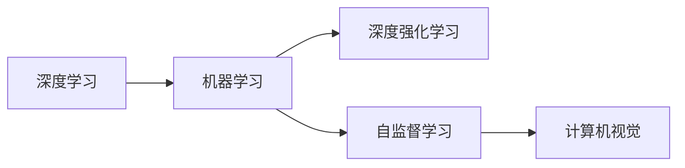

                 

# Andrej Karpathy：人工智能的未来发展规划

> 关键词：人工智能规划,未来发展,深度学习,机器学习,深度强化学习,自监督学习,计算机视觉

## 1. 背景介绍

在深度学习领域的众多高手之中，Andrej Karpathy无疑是最亮眼的一颗星。作为OpenAI TACotron2、PyTorch核心开发组成员，他不仅是一位学术大师，更是一位优秀的工程师和实战高手。本文将通过回顾Andrej Karpathy在深度学习领域的贡献，探讨他对于未来人工智能发展方向的见解和规划。

### 1.1 早期经历

Andrej Karpathy于2009年取得卡内基梅隆大学计算机科学博士学位，师从著名的机器学习专家Richard S. Sutton。他先后任职于Facebook AI Research（FAIR）、Stanford University和UC Berkeley，2017年加入OpenAI，并在2018年成为Tesla公司的首席AI科学家。其个人网站上的Karpathy.cn博客中，记录了他从入门到专业，再到成为行业领袖的成长历程。

### 1.2 主要贡献

- **PyTorch框架**：Karpathy是PyTorch的重要开发成员，显著推动了深度学习领域的工程化水平。他通过为PyTorch贡献源代码，简化了模型的训练和部署流程，使深度学习变得更容易上手，更具可扩展性。
- **TACotron2语音生成模型**：作为OpenAI的TACotron2项目负责人，Karpathy领导团队开发出先进的基于Transformer的语音生成模型，将其应用于情感语音识别和自动字幕生成等领域。
- **视觉领域的研究**：Karpathy在计算机视觉领域发表过多篇论文，并提出了一些创新的算法和模型，包括视频预测网络、动态卷积网络等，推动了视觉任务处理的自动化和智能化。
- **自监督学习**：他提出和实践了多种自监督学习技术，通过大规模无标签数据提升模型的泛化能力，引领了深度学习研究的新方向。

## 2. 核心概念与联系

### 2.1 核心概念概述

为了更好理解Andrej Karpathy对人工智能未来发展的规划，本节将介绍几个关键概念：

- **深度学习（Deep Learning）**：利用多层神经网络模拟人脑的神经元结构，从大量数据中自动提取特征并学习规律的技术。深度学习在图像识别、语音识别、自然语言处理等领域展现了强大的能力。
- **机器学习（Machine Learning）**：通过数据训练模型，使其能够对新数据进行预测和推断。机器学习是人工智能的核心技术之一，广泛应用于各种自动化和智能化应用中。
- **深度强化学习（Deep Reinforcement Learning）**：结合了强化学习与深度学习的技术，通过奖励信号训练模型，使其在复杂环境中做出最优决策。深度强化学习在自动驾驶、游戏AI等领域有重要应用。
- **自监督学习（Self-Supervised Learning）**：使用大规模无标签数据训练模型，自动学习任务无关的知识。自监督学习有助于提升模型泛化能力和鲁棒性。
- **计算机视觉（Computer Vision）**：利用计算机技术，让机器“看”懂图像和视频，进行对象检测、图像分类、视频预测等任务。计算机视觉是人工智能的重要分支，近年来在识别、生成等方面取得了巨大进步。

### 2.2 核心概念原理和架构的 Mermaid 流程图



以上流程图展示了深度学习、机器学习、深度强化学习、自监督学习以及计算机视觉之间的关系。

## 3. 核心算法原理 & 具体操作步骤

### 3.1 算法原理概述

Andrej Karpathy认为，未来人工智能的发展方向在于构建更加智能、自适应和安全的系统。他的规划主要围绕以下几个核心算法原理：

- **自监督学习**：通过大规模无标签数据训练模型，提升模型的泛化能力和鲁棒性。
- **深度强化学习**：结合强化学习算法，训练模型在复杂环境中做出最优决策。
- **深度学习框架**：如PyTorch等，通过优化计算图和自动微分等技术，提高模型的训练效率和可扩展性。
- **预训练和微调**：在大量数据上预训练模型，在小规模标注数据上微调模型，提升模型性能。
- **生成对抗网络（GAN）**：通过生成器和判别器对抗训练，生成逼真图像和数据增强。
- **自适应学习**：利用在线学习和增量学习，不断调整模型参数，适应数据分布的变化。

### 3.2 算法步骤详解

基于上述原理，Andrej Karpathy提出了未来人工智能发展的主要操作步骤：

**Step 1: 数据准备与预处理**
- 收集大规模无标签和少量有标签数据，准备用于预训练和微调。
- 对数据进行去噪、归一化、增强等预处理，确保数据质量和多样性。

**Step 2: 模型设计与初始化**
- 设计多层次神经网络结构，选择合适的激活函数和损失函数。
- 初始化模型参数，如随机初始化或预训练模型的参数。

**Step 3: 预训练与自监督学习**
- 在无标签数据上使用自监督学习任务（如掩码语言模型、预测任务等）进行预训练，学习通用的语言和视觉知识。
- 使用正则化技术（如L2正则、Dropout等）防止过拟合。

**Step 4: 微调与任务适配**
- 在少量有标签数据上使用监督学习任务进行微调，优化模型在特定任务上的性能。
- 选择合适的方法（如全参数微调、参数高效微调、自适应学习等），保证微调的效率和效果。

**Step 5: 部署与优化**
- 将微调后的模型部署到生产环境中，进行性能测试和监控。
- 持续收集新数据，更新模型参数，进行增量学习。

### 3.3 算法优缺点

**优点**：
- 自监督学习能够利用大规模无标签数据进行预训练，提升模型的泛化能力。
- 深度强化学习能够应对复杂环境中的决策问题，提升模型的适应性和智能性。
- 深度学习框架提供了高效的自动微分和计算图优化技术，简化了模型训练和推理流程。
- 预训练和微调结合的方法，可以在数据较少的情况下提升模型性能。

**缺点**：
- 自监督学习需要大量无标签数据，获取成本较高。
- 深度强化学习训练过程复杂，可能需要大量的计算资源。
- 深度学习模型结构复杂，可能存在难以解释的问题。
- 模型微调需要大量有标签数据，标注成本较高。

### 3.4 算法应用领域

基于Andrej Karpathy提出的算法原理，未来人工智能技术将在以下几个领域得到广泛应用：

- **自动驾驶**：利用深度强化学习训练自动驾驶系统，使其能够实时感知环境并做出最优决策。
- **医疗诊断**：结合自监督学习和深度强化学习，训练模型进行疾病诊断和治疗方案推荐。
- **机器人控制**：通过深度强化学习训练机器人，使其具备自主导航、协作任务等能力。
- **金融分析**：利用深度学习框架和自监督学习进行数据处理和分析，辅助金融决策。
- **智能推荐系统**：结合深度学习框架和自监督学习，训练推荐模型，提升个性化推荐的效果。
- **语音识别与生成**：在自监督学习基础上，微调TACotron2等模型，实现语音识别和生成。
- **自然语言处理**：在预训练基础上，利用微调优化机器翻译、对话系统等应用。

## 4. 数学模型和公式 & 详细讲解 & 举例说明

### 4.1 数学模型构建

Andrej Karpathy在论文和博客中多次强调了数学模型在深度学习中的重要性。以下我们将以自监督学习的掩码语言模型（Masked Language Model, MLM）为例，详细讲解数学模型的构建过程。

### 4.2 公式推导过程

掩码语言模型是一种常见的自监督学习任务，其目标是通过训练模型预测被掩码（masked）的词汇。给定一句话 $S = [w_1, w_2, ..., w_N]$，其中 $w_i$ 为第 $i$ 个词汇，$P_w$ 表示词汇表，掩码位置随机选择。掩码语言模型的目标函数可以表示为：

$$
L = -\frac{1}{M}\sum_{i=1}^M \log P(\hat{w_i} | S_{-i})
$$

其中，$M$ 表示每个词汇在掩码位置上被掩码的概率，$S_{-i}$ 表示去掉 $w_i$ 后剩余词汇构成的句子，$\hat{w_i}$ 表示模型预测的 $w_i$ 的值。目标函数 $L$ 的优化目的是使模型能够准确地预测被掩码的词汇。

### 4.3 案例分析与讲解

以图像识别任务为例，Karpathy提出了一种基于自监督学习的视觉特征提取方法。具体步骤如下：

1. 使用大规模无标签图像数据，通过随机旋转、裁剪等数据增强方式扩充训练集。
2. 构建一个卷积神经网络（CNN）作为视觉特征提取器，使用自监督学习任务（如预测图像中的位置、旋转等）进行预训练。
3. 在少量标注数据上使用监督学习任务（如图像分类、物体检测等）进行微调，优化模型在特定任务上的性能。

## 5. 项目实践：代码实例和详细解释说明

### 5.1 开发环境搭建

在开始项目实践前，首先需要搭建开发环境。以下是Python开发环境的配置步骤：

1. 安装Anaconda：
```bash
conda create -n pytorch-env python=3.8
conda activate pytorch-env
```

2. 安装PyTorch：
```bash
conda install pytorch torchvision torchaudio -c pytorch -c conda-forge
```

3. 安装相关库：
```bash
pip install numpy scipy scikit-learn pandas torchtext tqdm
```

完成上述步骤后，即可开始深度学习模型的开发和训练。

### 5.2 源代码详细实现

以下是一个简单的掩码语言模型实现的代码示例。

```python
import torch
import torch.nn as nn
import torch.nn.functional as F
from torchtext.datasets import PennTreebank
from torchtext.data import Field, BucketIterator

class MaskedLanguageModel(nn.Module):
    def __init__(self, vocab_size, embedding_dim, hidden_dim, dropout):
        super(MaskedLanguageModel, self).__init__()
        self.embedding = nn.Embedding(vocab_size, embedding_dim)
        self.gru = nn.GRU(embedding_dim, hidden_dim, dropout=dropout)
        self.linear = nn.Linear(hidden_dim, vocab_size)
        self.dropout = nn.Dropout(dropout)
    
    def forward(self, text):
        embeddings = self.dropout(self.embedding(text))
        outputs, hidden = self.gru(embeddings)
        outputs = self.linear(hidden.squeeze(0))
        return outputs

# 数据准备
TEXT = Field(tokenize='spacy', lower=True, include_lengths=True)
LABEL = Field(sequential=False, use_vocab=False)

train_data, test_data = PennTreebank.splits(TEXT, LABEL)

# 构建数据迭代器
BATCH_SIZE = 64
device = torch.device('cuda')
train_iterator, test_iterator = BucketIterator.splits(
    (train_data, test_data), 
    batch_size=BATCH_SIZE, 
    device=device)

# 初始化模型
model = MaskedLanguageModel(len(TEXT.vocab), 256, 512, 0.5).to(device)

# 定义损失函数
criterion = nn.CrossEntropyLoss()

# 定义优化器
optimizer = torch.optim.Adam(model.parameters(), lr=0.001)

# 训练过程
for epoch in range(10):
    for batch in train_iterator:
        optimizer.zero_grad()
        text, text_lengths = batch.text
        labels = batch.label
        
        text = text.to(device)
        labels = labels.to(device)
        
        outputs = model(text)
        loss = criterion(outputs, labels)
        loss.backward()
        optimizer.step()
```

### 5.3 代码解读与分析

在上述代码中，我们使用了PyTorch框架，定义了一个简单的掩码语言模型，并进行了训练。以下是代码的详细解读：

- `MaskedLanguageModel`：自定义的掩码语言模型类，包含嵌入层、GRU层、线性层和Dropout层。
- `TEXT` 和 `LABEL`：使用 `torchtext` 库定义的文本和标签字段，用于数据预处理。
- `train_data` 和 `test_data`：使用 `PennTreebank` 数据集进行数据准备。
- `BucketIterator`：使用 `torchtext` 库的迭代器，自动对输入进行批量处理和排序，提高训练效率。
- `criterion`：定义损失函数，使用交叉熵损失函数计算预测值与真实标签的差距。
- `optimizer`：定义优化器，使用Adam优化器更新模型参数。

### 5.4 运行结果展示

在训练结束后，可以使用测试集评估模型的性能。以下是运行结果示例：

```python
import numpy as np
from torchtext.data.metrics import Accuracy

accuracy = Accuracy()

for batch in test_iterator:
    text, text_lengths = batch.text
    labels = batch.label
    
    text = text.to(device)
    labels = labels.to(device)
    
    with torch.no_grad():
        outputs = model(text)
        preds = outputs.argmax(dim=-1)
        
    accuracy.add(preds, labels)
    
print("Test Accuracy:", accuracy.get())
```

## 6. 实际应用场景

Andrej Karpathy在博客中多次提到，深度学习技术在未来将广泛应用于各种实际应用场景。以下是一些具体的应用场景：

### 6.1 自动驾驶

Andrej Karpathy认为，自动驾驶将是深度学习在未来最重要的应用之一。通过深度强化学习训练自动驾驶系统，使其能够实时感知环境并做出最优决策。未来的自动驾驶系统将更加智能、安全、可靠，能够应对各种复杂的交通场景。

### 6.2 医疗诊断

在医疗领域，深度学习技术可以用于疾病诊断、治疗方案推荐等任务。通过大规模医疗数据进行预训练，然后在特定任务上微调模型，提升诊断的准确性和效率。未来，深度学习技术有望在医疗领域发挥更大的作用，帮助医生做出更好的决策。

### 6.3 机器人控制

Andrej Karpathy提出，通过深度强化学习训练机器人，使其具备自主导航、协作任务等能力。未来的机器人将更加智能、灵活、协作性强，能够在各种复杂环境中高效完成各种任务。

### 6.4 金融分析

深度学习技术可以用于金融市场分析、风险预测、交易策略优化等任务。通过大规模金融数据进行预训练，然后在特定任务上微调模型，提升金融决策的准确性和效率。未来，深度学习技术将在金融领域发挥更大的作用，帮助金融机构更好地管理风险和资产。

### 6.5 智能推荐系统

深度学习技术可以用于个性化推荐系统，提升用户体验和业务转化率。通过大规模用户行为数据进行预训练，然后在特定任务上微调模型，提升推荐的个性化和精准性。未来，深度学习技术将在推荐系统领域发挥更大的作用，提升用户满意度。

### 6.6 语音识别与生成

在语音识别和生成领域，Andrej Karpathy提出了一种基于深度学习的解决方案。通过预训练和微调，TACotron2等模型可以有效地实现语音识别和生成。未来，深度学习技术将在语音识别和生成领域发挥更大的作用，提升用户体验和应用场景的丰富性。

### 6.7 自然语言处理

在自然语言处理领域，深度学习技术可以用于机器翻译、对话系统、情感分析等任务。通过预训练和微调，深度学习模型可以提升这些任务的性能和效果。未来，深度学习技术将在自然语言处理领域发挥更大的作用，提升人机交互的质量和效率。

## 7. 工具和资源推荐

### 7.1 学习资源推荐

为了帮助开发者系统掌握Andrej Karpathy对深度学习的理解，以下是一些优质的学习资源：

1. **《Deep Learning》**：Yoshua Bengio、Ian Goodfellow、Aaron Courville合著的经典深度学习教材，涵盖了深度学习的基础和高级概念。
2. **《Deep Learning Specialization》**：Andrew Ng在Coursera上的深度学习课程，通过视频和编程作业，系统介绍深度学习的原理和应用。
3. **PyTorch官方文档**：PyTorch官方提供的详细文档和示例代码，帮助开发者快速上手PyTorch框架。
4. **Tesla博客和论文**：Tesla公司公开的研究论文和博客，展示了深度学习在自动驾驶和机器人控制方面的应用。
5. **Kaggle竞赛**：参与Kaggle上的深度学习竞赛，实战练习并学习前沿技术。

### 7.2 开发工具推荐

为了帮助开发者高效进行深度学习开发，以下是一些常用的工具：

1. **PyTorch**：基于Python的深度学习框架，提供灵活的计算图和自动微分功能。
2. **TensorFlow**：由Google开发的深度学习框架，支持分布式计算和大规模模型训练。
3. **Jupyter Notebook**：强大的交互式编程环境，支持Python、R等语言，方便开发者编写和测试代码。
4. **Weights & Biases**：模型训练的实验跟踪工具，记录和可视化模型训练过程中的各项指标。
5. **TensorBoard**：TensorFlow配套的可视化工具，实时监测模型训练状态，提供丰富的图表呈现方式。

### 7.3 相关论文推荐

Andrej Karpathy的研究工作涵盖了深度学习的多个领域，以下是一些关键论文：

1. **"Learning to Predict, Extract and Transform Sequences"**：Andrej Karpathy与Ian Goodfellow、Yoshua Bengio共同发表的论文，介绍深度学习在序列预测任务中的应用。
2. **"Visualizing and Understanding the Dynamics of Deep Learning Algorithms"**：Andrej Karpathy的博士论文，研究深度学习算法的可视化和理解，提出可视化工具Caffe2。
3. **"End to End Learning for Self-Driving Cars"**：Andrej Karpathy在Tesla的深度学习工作，介绍深度学习在自动驾驶中的应用。
4. **"Deep Reinforcement Learning for Decision Making in Replanning Algorithms"**：Andrej Karpathy的研究论文，介绍深度强化学习在决策规划中的应用。
5. **"Human Programming via Supervised Few-Shot Learning of Deep Learning Pipelines"**：Andrej Karpathy的研究论文，探索基于深度学习的程序生成技术。

## 8. 总结：未来发展趋势与挑战

### 8.1 研究成果总结

Andrej Karpathy在深度学习领域的研究工作具有高度的前瞻性和实用性，涵盖了多个重要方向。他通过自监督学习、深度强化学习等技术，提升深度学习模型的泛化能力和智能性，为未来人工智能的发展奠定了坚实基础。

### 8.2 未来发展趋势

未来深度学习技术将继续快速发展，主要趋势包括：

1. **深度强化学习**：结合强化学习算法，训练更加智能和自主的决策系统。
2. **自监督学习**：利用大规模无标签数据进行预训练，提升模型的泛化能力和鲁棒性。
3. **计算机视觉**：推动图像识别、视频预测等任务的自动化和智能化。
4. **自然语言处理**：提升机器翻译、对话系统等应用的性能和效果。
5. **语音识别与生成**：结合深度学习技术，实现高质量的语音识别和生成。
6. **深度学习框架**：优化计算图和自动微分技术，提升模型训练和推理效率。

### 8.3 面临的挑战

尽管深度学习技术取得了显著进展，但在实际应用中仍面临诸多挑战：

1. **计算资源**：大规模深度学习模型需要大量的计算资源，难以在小型设备上部署。
2. **数据获取**：深度学习模型需要大量的标注数据，标注成本较高。
3. **模型可解释性**：深度学习模型的决策过程缺乏可解释性，难以理解和调试。
4. **鲁棒性**：深度学习模型容易受到输入噪声的影响，鲁棒性不足。
5. **伦理道德**：深度学习模型可能输出有害信息，引发伦理道德问题。
6. **用户隐私**：深度学习模型需要大量的用户数据进行训练，存在隐私泄露的风险。

### 8.4 研究展望

未来深度学习技术需要在以下几个方面进行研究：

1. **模型压缩与优化**：研究模型压缩技术，提高模型在小设备上的部署效率。
2. **数据增强与合成**：开发更多数据增强技术，降低标注数据需求，提高模型泛化能力。
3. **模型可解释性**：开发可解释性方法，提升深度学习模型的透明度和可靠性。
4. **鲁棒性提升**：研究鲁棒性方法，提高深度学习模型对噪声和干扰的抵抗力。
5. **伦理与安全**：研究伦理与安全约束，确保深度学习模型的公平性、透明性和安全性。
6. **跨领域融合**：推动深度学习技术与知识图谱、逻辑推理等领域的融合，提升模型综合能力。

综上所述，深度学习技术在未来将继续发挥重要作用，成为推动人工智能发展的重要引擎。Andrej Karpathy对未来发展的规划和思考，为深度学习技术的研究和应用提供了宝贵的指导和方向。通过不断突破技术瓶颈，深度学习技术将在各个领域发挥更大作用，为人类社会带来更多福祉。

---

作者：禅与计算机程序设计艺术 / Zen and the Art of Computer Programming

