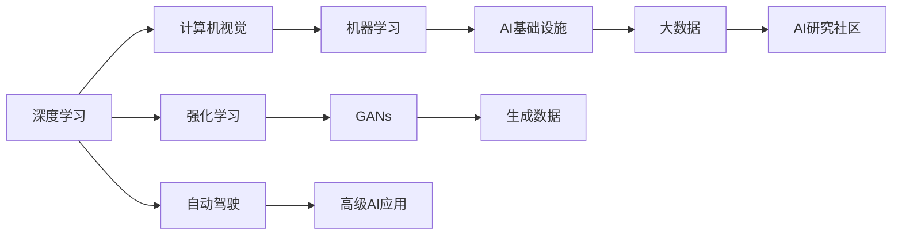

                 

## 1. 背景介绍

人工智能(AI)领域近年来的发展可谓日新月异，从深度学习、强化学习到无监督学习，AI技术正逐渐从专家研究向大众普及。在此过程中，Andrej Karpathy，斯坦福大学计算机科学教授、特斯拉高级人工智能科学家，始终站在AI前沿，其研究成果和洞见对AI发展有着深远影响。本文将通过Andrej Karpathy的视角，探讨人工智能未来的发展趋势，从机器学习、计算机视觉到自动驾驶，全方位透视AI未来前景。

## 2. 核心概念与联系

### 2.1 核心概念概述

Andrej Karpathy的研究涵盖了多个AI核心概念，包括但不限于：

- **深度学习(Deep Learning)**：一种通过神经网络模型进行特征提取和分类的机器学习方法。
- **计算机视觉(Computer Vision)**：使计算机能够理解、解释和处理图像和视频数据的AI分支。
- **自动驾驶(Autonomous Driving)**：通过AI技术实现车辆自动导航和驾驶的系统。
- **强化学习(Reinforcement Learning)**：通过智能体与环境互动，学习最优策略以最大化奖励的AI方法。
- **生成对抗网络(GANs)**：通过对抗训练过程生成高质量合成数据的神经网络模型。

这些概念之间相互关联，共同构成了现代AI技术的核心框架。

### 2.2 核心概念原理和架构的 Mermaid 流程图



这张流程图展示了各AI核心概念之间的逻辑联系：深度学习是AI的基础，通过计算机视觉和自动驾驶等高级应用体现其价值；强化学习和GANs等技术则进一步拓展了AI的边界，生成数据为AI研究提供了更丰富的资源。

## 3. 核心算法原理 & 具体操作步骤

### 3.1 算法原理概述

Andrej Karpathy的研究主要集中在深度学习、计算机视觉和强化学习等方面。以下分别介绍这些核心领域的算法原理。

#### 3.1.1 深度学习

深度学习通过构建多层神经网络，自动从数据中学习特征表示，从而进行分类、回归等任务。其核心算法包括前向传播、反向传播和优化算法（如梯度下降、Adam等）。

#### 3.1.2 计算机视觉

计算机视觉算法旨在使计算机“看懂”图像和视频。主要算法包括卷积神经网络(CNN)、循环神经网络(RNN)、注意力机制等，用于图像分类、目标检测、语义分割等任务。

#### 3.1.3 强化学习

强化学习通过智能体与环境交互，学习最优策略以最大化奖励。核心算法包括Q-learning、策略梯度等，广泛应用于游戏AI、机器人控制等领域。

### 3.2 算法步骤详解

#### 3.2.1 深度学习

- **数据准备**：收集、清洗、标注数据。
- **模型构建**：选择合适的网络结构，如卷积神经网络、循环神经网络等。
- **模型训练**：使用反向传播算法更新模型参数。
- **模型评估**：使用测试集评估模型性能。

#### 3.2.2 计算机视觉

- **数据预处理**：图像归一化、缩放、旋转等。
- **网络设计**：设计卷积层、池化层、全连接层等。
- **模型训练**：使用反向传播和优化算法训练模型。
- **模型应用**：进行图像分类、目标检测等任务。

#### 3.2.3 强化学习

- **环境设计**：定义环境状态、奖励函数等。
- **智能体设计**：选择Q-learning、策略梯度等算法。
- **模型训练**：通过与环境交互学习最优策略。
- **模型应用**：应用于游戏AI、机器人控制等。

### 3.3 算法优缺点

#### 3.3.1 深度学习

**优点**：
- 强大的特征提取能力。
- 适用于多种复杂任务。

**缺点**：
- 数据需求高。
- 模型易过拟合。

#### 3.3.2 计算机视觉

**优点**：
- 高度结构化。
- 精度高。

**缺点**：
- 计算量大。
- 数据标注复杂。

#### 3.3.3 强化学习

**优点**：
- 自适应性强。
- 适用于决策类任务。

**缺点**：
- 环境设计复杂。
- 奖励函数设计困难。

### 3.4 算法应用领域

#### 3.4.1 深度学习

深度学习广泛应用于图像分类、语音识别、自然语言处理等领域。

#### 3.4.2 计算机视觉

计算机视觉技术在自动驾驶、人脸识别、医疗影像分析等领域有广泛应用。

#### 3.4.3 强化学习

强化学习在自动驾驶、游戏AI、机器人控制等领域表现出色。

## 4. 数学模型和公式 & 详细讲解 & 举例说明

### 4.1 数学模型构建

以深度学习为例，其核心数学模型为神经网络。一个简单的神经网络由输入层、隐藏层和输出层构成。

$$
\text{输入层} \xrightarrow{\text{权重}} \text{隐藏层} \xrightarrow{\text{非线性激活函数}} \text{输出层}
$$

其中，隐藏层通过非线性激活函数引入非线性，增强网络的表达能力。

### 4.2 公式推导过程

以卷积神经网络(CNN)为例，其核心公式为卷积和池化操作：

- **卷积操作**：

$$
\text{卷积} = \sum_{i=0}^{n-1} \sum_{j=0}^{m-1} w_{ij} \cdot x_{ij} + b
$$

- **池化操作**：

$$
\text{池化} = \frac{\sum_{i=0}^{n-1} \sum_{j=0}^{m-1} w_{ij} \cdot x_{ij} + b}{k}
$$

### 4.3 案例分析与讲解

以ImageNet数据集为例，展示深度学习在图像分类任务中的应用：

- **数据准备**：收集并清洗ImageNet数据集。
- **模型构建**：使用LeNet、AlexNet、VGG等深度卷积神经网络。
- **模型训练**：在ImageNet数据集上进行训练。
- **模型评估**：在测试集上评估分类精度。

## 5. 项目实践：代码实例和详细解释说明

### 5.1 开发环境搭建

本节介绍使用Python和TensorFlow搭建深度学习开发环境的步骤：

1. 安装Anaconda：从官网下载并安装Anaconda。
2. 创建虚拟环境：
```bash
conda create -n tensorflow-env python=3.8
conda activate tensorflow-env
```

3. 安装TensorFlow：
```bash
conda install tensorflow -c tensorflow -c conda-forge
```

4. 安装PyTorch和其他工具包：
```bash
pip install torch torchvision torchaudio scikit-learn matplotlib tqdm jupyter notebook ipython
```

### 5.2 源代码详细实现

以下是一个简单的图像分类任务的深度学习模型实现：

```python
import tensorflow as tf
from tensorflow.keras import layers

# 定义模型
model = tf.keras.Sequential([
    layers.Conv2D(32, (3,3), activation='relu', input_shape=(28,28,1)),
    layers.MaxPooling2D((2,2)),
    layers.Conv2D(64, (3,3), activation='relu'),
    layers.MaxPooling2D((2,2)),
    layers.Flatten(),
    layers.Dense(64, activation='relu'),
    layers.Dense(10)
])

# 编译模型
model.compile(optimizer='adam', loss=tf.keras.losses.SparseCategoricalCrossentropy(from_logits=True), metrics=['accuracy'])

# 训练模型
model.fit(train_images, train_labels, epochs=10, validation_data=(test_images, test_labels))
```

### 5.3 代码解读与分析

**模型定义**：
- 使用Sequential模型定义卷积层、池化层、全连接层等。
- 在输入层使用Conv2D进行卷积操作，使用MaxPooling2D进行池化操作。
- 最后使用Dense层进行分类。

**模型编译**：
- 使用Adam优化器，交叉熵损失函数，并指定准确率作为评价指标。

**模型训练**：
- 使用训练集和测试集进行模型训练，并设置训练轮数为10。

### 5.4 运行结果展示

训练完毕后，使用测试集进行评估：

```python
test_loss, test_acc = model.evaluate(test_images, test_labels, verbose=2)
print('Test accuracy:', test_acc)
```

以上代码展示了从模型定义到训练的全过程，通过不断优化模型结构、调整超参数，可以获得较高的分类精度。

## 6. 实际应用场景

### 6.1 自动驾驶

自动驾驶是Andrej Karpathy的重要研究方向之一。通过深度学习和计算机视觉技术，可以训练出能够理解和感知环境并做出决策的模型，从而实现自动驾驶。

在自动驾驶中，使用摄像头、激光雷达等传感器获取周围环境信息，通过卷积神经网络提取特征，再通过循环神经网络进行路径规划和决策。Karpathy的研究团队开发了Autopilot系统，该系统已在特斯拉车辆中得到应用。

### 6.2 游戏AI

Karpathy还通过强化学习技术，使AI在电子游戏中表现出色。其研究团队开发的AlphaGo Zero和OpenAI Five，分别在围棋和Dota2等游戏中战胜了人类顶尖选手。这些成就展示了AI在策略游戏领域的巨大潜力。

在技术实现上，使用Q-learning等算法训练智能体，通过与环境（游戏环境）互动学习最优策略。智能体的决策过程可以通过策略梯度等方法进行解释和优化。

### 6.3 医学影像分析

计算机视觉技术在医学影像分析中也有广泛应用。通过深度学习，可以对医学影像进行自动诊断和分析，辅助医生诊断病情。

Karpathy团队的研究成果之一是使用卷积神经网络对皮肤癌图像进行分类，提升了皮肤癌诊断的准确性。其方法包括数据增强、迁移学习等技术，帮助模型更好地泛化到不同数据集。

## 7. 工具和资源推荐

### 7.1 学习资源推荐

为了系统学习Andrej Karpathy的研究成果，以下是一些推荐的学习资源：

1. **《Deep Learning》**：Ian Goodfellow等著，深入介绍深度学习理论和实践。
2. **《Computer Vision: Algorithms and Applications》**：Richard Szeliski著，全面覆盖计算机视觉的各个方面。
3. **《Reinforcement Learning: An Introduction》**：Richard Sutton和Andrew Barto著，介绍强化学习的基本理论和算法。
4. **Coursera课程**：包括Deep Learning Specialization、CS231n等，由Andrej Karpathy本人讲授，内容深入浅出，适合初学者和进阶者。

### 7.2 开发工具推荐

- **TensorFlow**：由Google开发的开源深度学习框架，生产部署方便。
- **PyTorch**：Facebook开发的深度学习框架，灵活动态的计算图，适合快速迭代研究。
- **OpenCV**：计算机视觉领域的主流开源库，提供丰富的图像处理和分析功能。

### 7.3 相关论文推荐

- **《Deep Learning》**：Ian Goodfellow等著，全面介绍深度学习的基础理论和应用。
- **《Playing Atari with Deep Reinforcement Learning》**：Volodymyr Mnih等著，展示深度强化学习在游戏AI中的突破。
- **《Deep Residual Learning for Image Recognition》**：Kaiming He等著，提出残差网络，在图像分类任务中取得SOTA。

## 8. 总结：未来发展趋势与挑战

### 8.1 研究成果总结

Andrej Karpathy的研究成果涵盖深度学习、计算机视觉和强化学习等多个领域，推动了AI技术的快速发展。其对AI未来的发展趋势具有深远影响，以下是其研究成果的总结：

1. **深度学习**：通过神经网络模型，实现复杂的特征提取和分类任务。
2. **计算机视觉**：在自动驾驶、医学影像分析等领域有广泛应用。
3. **强化学习**：在游戏AI、机器人控制等方面表现出色。

### 8.2 未来发展趋势

未来，AI技术将继续在多个领域得到广泛应用，以下是一些主要的发展趋势：

1. **AI基础设施**：随着AI技术的普及，AI基础设施将逐步完善，如云服务、数据平台等。
2. **大数据**：海量数据将为AI研究提供更多资源，促进技术的进一步发展。
3. **无监督学习和自监督学习**：通过无监督学习，AI将从数据中挖掘更多隐藏的知识。
4. **多模态学习**：将视觉、听觉、文本等多种模态数据结合起来，实现更加全面的认知智能。
5. **公平性和透明度**：AI技术的发展将越来越注重公平性和透明度，避免偏见和滥用。

### 8.3 面临的挑战

尽管AI技术取得显著进展，但仍面临诸多挑战：

1. **数据隐私和安全**：数据泄露和隐私保护问题将日益凸显。
2. **算法可解释性**：AI模型的决策过程难以解释，导致广泛应用受限。
3. **计算资源限制**：大规模模型训练和推理需要高性能计算资源。
4. **模型鲁棒性**：模型在面对复杂环境和数据噪声时，表现可能不稳定。
5. **伦理道德问题**：AI技术的发展需要考虑伦理和道德问题，避免滥用。

### 8.4 研究展望

未来，AI技术的发展将从多个方向进行：

1. **多模态融合**：结合视觉、听觉、文本等模态数据，实现更加全面和复杂的认知智能。
2. **自监督学习**：通过无监督学习，挖掘数据的潜在价值，提升模型泛化能力。
3. **公平性和透明性**：开发透明、可解释的AI模型，提升算法的公平性和可接受性。
4. **多任务学习**：将多个任务结合起来，通过共享参数提高模型效率。
5. **跨领域应用**：将AI技术应用于更多领域，如医疗、金融、教育等。

## 9. 附录：常见问题与解答

**Q1：深度学习和计算机视觉有什么区别？**

A: 深度学习是AI的一种方法，通过神经网络模型进行特征提取和分类；计算机视觉则是深度学习的一个应用领域，主要处理图像和视频数据。

**Q2：深度学习中常用的优化器有哪些？**

A: 常用的优化器包括SGD、Adam、Adagrad、RMSprop等。其中，Adam优化器是目前深度学习中最常用的优化器，具有收敛速度快、效果稳定的特点。

**Q3：强化学习中常用的算法有哪些？**

A: 常用的强化学习算法包括Q-learning、策略梯度、Actor-Critic等。这些算法通过与环境互动，学习最优决策策略。

**Q4：计算机视觉中的卷积神经网络(CNN)和循环神经网络(RNN)有何区别？**

A: CNN主要处理空间特征，如图像分类、目标检测等；RNN主要用于处理时间序列数据，如语音识别、自然语言处理等。

**Q5：如何提高模型的泛化能力？**

A: 提高模型的泛化能力可以通过数据增强、正则化、迁移学习等方法。其中，数据增强通过增加训练数据的多样性，提升模型的泛化能力；正则化通过限制模型复杂度，避免过拟合；迁移学习则通过迁移先验知识，加速模型收敛。

---

作者：禅与计算机程序设计艺术 / Zen and the Art of Computer Programming

