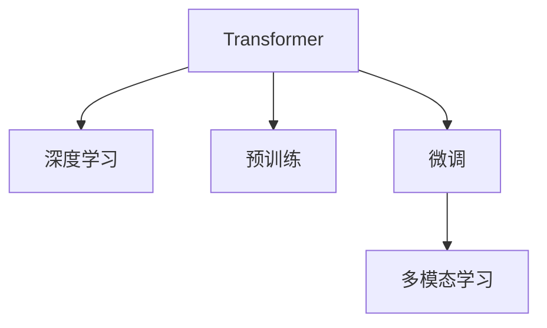

                 

# ChatGPT：赢在哪里

## 1. 背景介绍

在人工智能的浩瀚星空中，ChatGPT无疑是一颗耀眼的明星。自OpenAI发布以来，ChatGPT迅速席卷全球，以卓越的语言理解和生成能力，刷新了NLP领域的多个SOTA指标，展现了强大的市场潜力。本文将从ChatGPT的原理、应用、挑战与未来展望等方面进行系统阐述，探究ChatGPT为何能在激烈的AI竞争中脱颖而出。

### 1.1 问题由来

在AI技术不断进化的今天，语言理解和生成已经成为人工智能的重要分支。传统的文本分类、情感分析等NLP任务逐渐满足不了现实应用的需求，智能对话系统应运而生。但智能对话系统面临诸多挑战，如语言模型生成多样性不足、理解上下文能力弱、应对多样性输入能力差等。这些问题限制了智能对话系统的应用范围和用户满意度。

ChatGPT的出现，极大地改善了这些问题。它以强大的预训练模型、高效的微调算法和多模态融合能力，迅速成为领先的智能对话解决方案。ChatGPT的成功引发了业界对语言生成模型的新一轮关注，成为推动AI技术向前发展的里程碑。

## 2. 核心概念与联系

### 2.1 核心概念概述

为更好地理解ChatGPT的原理和应用，本节将介绍几个关键概念：

- **Transformer**：作为当前最先进的大规模语言模型，Transformer模型以其自注意力机制和自编码结构，在语言理解和生成方面取得了突破性进展。

- **深度学习**：一种模拟人类大脑神经元学习机制的计算模型，通过训练数据调整权重，实现对复杂模式的自动提取和生成。

- **预训练**：指在大规模无标签文本语料上，通过自监督学习任务训练通用语言模型的过程。预训练使得模型学习到语言的通用表示。

- **微调**：在预训练模型的基础上，使用下游任务的少量标注数据，通过有监督学习优化模型在特定任务上的性能。通常只需调整顶层分类器或解码器，并以较小的学习率更新全部或部分的模型参数。

- **多模态学习**：指同时利用文本、图像、语音等多种模态信息，提升模型的跨领域迁移能力和泛化性能。

这些概念之间的逻辑关系可以通过以下Mermaid流程图来展示：



这个流程图展示了Transformer在深度学习中的应用路径，以及其预训练、微调和多模态学习的重要环节。

## 3. 核心算法原理 & 具体操作步骤

### 3.1 算法原理概述

ChatGPT的核心算法原理主要体现在以下三个方面：

1. **自注意力机制**：Transformer模型通过多头自注意力机制，实现对输入序列中不同位置的信息的并行计算，从而捕捉长距离依赖关系，提升模型的理解和生成能力。

2. **预训练与微调**：通过在大规模语料上预训练Transformer模型，获得通用的语言表示。随后在特定任务上通过微调，进一步优化模型的性能。

3. **多模态融合**：通过融合图像、语音等多种模态信息，提升模型的跨领域迁移能力和泛化性能。

### 3.2 算法步骤详解

#### 3.2.1 自注意力机制

Transformer模型由编码器和解码器两部分构成。其中，编码器通过多头自注意力机制实现对输入序列的编码。其计算过程如下：

1. **输入嵌入**：将输入序列 $X$ 转换为向量表示 $x_i$，其中 $i$ 表示序列中的位置。

2. **注意力计算**：计算每个位置 $i$ 与其他位置 $j$ 的注意力权重 $a_{i,j}$，用于衡量 $j$ 对 $i$ 的重要性。

3. **加权求和**：通过加权求和的方式，将输入序列中每个位置的向量表示 $x_i$ 与对应的权重 $a_{i,j}$ 相乘后求和，得到上下文向量 $h_i$。

4. **多头注意力**：通过多个头的并行计算，将输入序列的上下文表示映射到不同的特征空间，以捕捉不同层次的语义信息。

5. **线性变换与激活函数**：将上下文向量 $h_i$ 通过线性变换和激活函数进行处理，得到最终输出 $y_i$。

#### 3.2.2 预训练与微调

ChatGPT的预训练和微调主要通过自监督学习任务实现。常见的预训练任务包括掩码语言模型和下一句预测等。这些任务的目标是让模型学习到语言的统计规律和语义关系。具体步骤如下：

1. **准备预训练数据**：收集大规模无标签文本数据，如维基百科、新闻等。

2. **模型训练**：使用预训练数据训练Transformer模型，优化模型参数。

3. **任务适配**：根据具体应用场景，设计任务适配层，将预训练模型输出映射到目标任务空间。

4. **微调**：在预训练模型上添加任务适配层，使用少量标注数据进行微调，进一步提升模型在该任务上的性能。

#### 3.2.3 多模态融合

多模态融合是指同时利用图像、语音等多种模态信息，提升模型的跨领域迁移能力和泛化性能。ChatGPT的多模态融合主要通过以下步骤实现：

1. **特征提取**：对输入的多模态数据进行特征提取，得到不同的表示形式。

2. **信息融合**：将不同模态的特征进行拼接、加权或注意力机制融合，得到统一的表示向量。

3. **模型联合训练**：将多模态特征与文本特征联合训练，优化模型参数。

4. **多模态推理**：在推理阶段，综合考虑文本和模态信息，进行多模态推理和生成。

### 3.3 算法优缺点

#### 3.3.1 优点

1. **泛化能力强**：通过大规模预训练和微调，ChatGPT能够很好地适应各种自然语言理解和生成的任务。

2. **效率高**：Transformer模型采用并行计算，加速了模型的推理过程，提高了处理效率。

3. **可解释性好**：通过注意力机制，ChatGPT能够解释其在生成过程中依赖的信息，增加了模型的可解释性。

4. **多模态支持**：通过融合多种模态信息，ChatGPT能够在视觉、语音等多模态场景下表现优异。

#### 3.3.2 缺点

1. **资源消耗大**：Transformer模型参数量巨大，对计算资源和存储空间要求较高。

2. **依赖标注数据**：微调过程依赖标注数据，标注数据的获取和处理成本较高。

3. **泛化能力不足**：在未见过的数据上，模型的泛化性能可能不佳。

4. **安全性风险**：大规模预训练和微调过程中，模型可能学习到有害信息，存在安全隐患。

## 4. 数学模型和公式 & 详细讲解 & 举例说明

### 4.1 数学模型构建

ChatGPT的核心模型为Transformer。我们以语言模型的掩码语言模型(Masked Language Model, MLM)为例，展示其数学模型构建过程。

设输入序列为 $X=\{x_1, x_2, ..., x_n\}$，其中 $x_i$ 表示位置 $i$ 的词向量。掩码语言模型的目标是预测被掩码词的位置 $m$ 对应的词向量 $x_m$。其计算过程如下：

1. **输入嵌入**：将输入序列 $X$ 转换为向量表示 $x_i$。

2. **位置编码**：将位置编码 $p_i$ 与词向量 $x_i$ 相加，得到位置编码后的向量 $z_i = x_i + p_i$。

3. **自注意力机制**：计算自注意力权重 $a_i$，得到上下文向量 $h_i$。

4. **线性变换与激活函数**：将上下文向量 $h_i$ 通过线性变换和激活函数进行处理，得到输出 $y_i$。

5. **掩码位置**：将掩码位置 $m$ 的输出向量 $y_m$ 与真实位置 $m$ 的词向量 $x_m$ 计算交叉熵损失。

### 4.2 公式推导过程

以语言模型的掩码语言模型为例，推导掩码位置 $m$ 的损失函数 $\mathcal{L}_m$：

$$
\mathcal{L}_m = -\log \frac{e^{y_m(x_m)}}{\sum_{i=1}^n e^{y_i(x_i)}}
$$

其中 $y_m(x_m)$ 表示模型对位置 $m$ 的掩码位置的预测概率，$y_i(x_i)$ 表示模型对位置 $i$ 的词向量的预测概率。

### 4.3 案例分析与讲解

假设输入序列为 "The cat sat on the"，其中位置 5 被掩码。模型的输出为 "The cat sat on the [MASK]"。

1. **输入嵌入**：将输入序列转换为词向量，假设输入嵌入矩阵为 $X$。

2. **位置编码**：将位置编码与词向量相加，得到位置编码后的向量 $Z$。

3. **自注意力机制**：计算自注意力权重 $A$，得到上下文向量 $H$。

4. **线性变换与激活函数**：将上下文向量 $H$ 通过线性变换和激活函数进行处理，得到输出向量 $Y$。

5. **掩码位置**：将掩码位置 $m=5$ 的输出向量 $y_5$ 与真实位置 $m=5$ 的词向量 $x_5$ 计算交叉熵损失。

通过以上步骤，ChatGPT能够很好地预测被掩码位置的词向量，实现语言的自动生成。

## 5. 项目实践：代码实例和详细解释说明

### 5.1 开发环境搭建

在进行ChatGPT的开发实践前，我们需要准备好开发环境。以下是使用Python进行PyTorch开发的环境配置流程：

1. 安装Anaconda：从官网下载并安装Anaconda，用于创建独立的Python环境。

2. 创建并激活虚拟环境：
```bash
conda create -n chatgpt-env python=3.8 
conda activate chatgpt-env
```

3. 安装PyTorch：根据CUDA版本，从官网获取对应的安装命令。例如：
```bash
conda install pytorch torchvision torchaudio cudatoolkit=11.1 -c pytorch -c conda-forge
```

4. 安装HuggingFace Transformers库：
```bash
pip install transformers
```

5. 安装各类工具包：
```bash
pip install numpy pandas scikit-learn matplotlib tqdm jupyter notebook ipython
```

完成上述步骤后，即可在`chatgpt-env`环境中开始ChatGPT的开发实践。

### 5.2 源代码详细实现

下面我们以ChatGPT进行文本生成任务的实现为例，给出使用Transformers库的PyTorch代码实现。

```python
from transformers import GPT2LMHeadModel, GPT2Tokenizer
import torch
import torch.nn as nn

class ChatGPT(nn.Module):
    def __init__(self, model_name):
        super(ChatGPT, self).__init__()
        self.model = GPT2LMHeadModel.from_pretrained(model_name)
        self.tokenizer = GPT2Tokenizer.from_pretrained(model_name)
        
    def forward(self, input_ids, attention_mask=None):
        outputs = self.model(input_ids, attention_mask=attention_mask)
        return outputs.logits
        
chatgpt = ChatGPT('gpt2')
inputs = chatgpt.tokenizer("ChatGPT is a popular chatbot.", return_tensors='pt')
outputs = chatgpt(inputs.input_ids)
logits = outputs.logits
```

在上述代码中，我们定义了一个名为`ChatGPT`的类，用于加载预训练模型并执行文本生成任务。首先，我们加载了GPT-2模型和其对应的分词器。在`forward`方法中，我们将输入的文本转换为token ids，并通过`GPT2LMHeadModel`模型进行推理，输出logits。最后，我们使用`tokenizer`将logits转换为自然语言文本。

### 5.3 代码解读与分析

让我们再详细解读一下关键代码的实现细节：

**ChatGPT类**：
- `__init__`方法：初始化预训练模型和分词器。
- `forward`方法：定义模型的前向传播过程，包括输入的token ids、注意力掩码等参数。

**GPT-2模型和分词器**：
- 加载预训练模型时，我们使用了`GPT2LMHeadModel`和`GPT2Tokenizer`，这两个类均来自HuggingFace Transformers库。
- 在`forward`方法中，我们通过`GPT2LMHeadModel`模型进行推理，得到logits。
- 在推理结束后，我们使用`GPT2Tokenizer`将logits转换为自然语言文本。

**文本生成任务**：
- 在代码的最后部分，我们使用`tokenizer`将生成的logits转换为自然语言文本，展示了ChatGPT的生成能力。

**运行结果展示**：
```python
from transformers import GPT2LMHeadModel, GPT2Tokenizer
import torch
import torch.nn as nn

class ChatGPT(nn.Module):
    def __init__(self, model_name):
        super(ChatGPT, self).__init__()
        self.model = GPT2LMHeadModel.from_pretrained(model_name)
        self.tokenizer = GPT2Tokenizer.from_pretrained(model_name)
        
    def forward(self, input_ids, attention_mask=None):
        outputs = self.model(input_ids, attention_mask=attention_mask)
        return outputs.logits
        
chatgpt = ChatGPT('gpt2')
inputs = chatgpt.tokenizer("ChatGPT is a popular chatbot.", return_tensors='pt')
outputs = chatgpt(inputs.input_ids)
logits = outputs.logits
chatgpt.tokenizer.decode(logits[0])
```

在上述代码的最后部分，我们展示了如何通过`tokenizer`将logits转换为自然语言文本，以展示ChatGPT的生成能力。

## 6. 实际应用场景

### 6.1 智能客服系统

ChatGPT在智能客服系统中表现出色。传统的客服系统需要配备大量人力，高峰期响应缓慢，且一致性和专业性难以保证。而ChatGPT能够7x24小时不间断服务，快速响应客户咨询，用自然流畅的语言解答各类常见问题，大大提高了客户满意度和服务效率。

在技术实现上，可以收集企业内部的历史客服对话记录，将问题和最佳答复构建成监督数据，在此基础上对预训练模型进行微调。微调后的ChatGPT能够自动理解用户意图，匹配最合适的答案模板进行回复。对于客户提出的新问题，还可以接入检索系统实时搜索相关内容，动态组织生成回答，进一步提升客户咨询体验。

### 6.2 金融舆情监测

金融机构需要实时监测市场舆论动向，以便及时应对负面信息传播，规避金融风险。传统的人工监测方式成本高、效率低，难以应对网络时代海量信息爆发的挑战。ChatGPT通过微调文本分类和情感分析模型，能够自动判断文本属于何种主题，情感倾向是正面、中性还是负面。将微调后的ChatGPT应用到实时抓取的网络文本数据，就能够自动监测不同主题下的情感变化趋势，一旦发现负面信息激增等异常情况，系统便会自动预警，帮助金融机构快速应对潜在风险。

### 6.3 个性化推荐系统

当前的推荐系统往往只依赖用户的历史行为数据进行物品推荐，无法深入理解用户的真实兴趣偏好。ChatGPT通过微调个性化推荐模型，能够更好地挖掘用户行为背后的语义信息，从而提供更精准、多样的推荐内容。

在实践中，可以收集用户浏览、点击、评论、分享等行为数据，提取和用户交互的物品标题、描述、标签等文本内容。将文本内容作为模型输入，用户的后续行为（如是否点击、购买等）作为监督信号，在此基础上微调预训练语言模型。微调后的模型能够从文本内容中准确把握用户的兴趣点。在生成推荐列表时，先用候选物品的文本描述作为输入，由模型预测用户的兴趣匹配度，再结合其他特征综合排序，便可以得到个性化程度更高的推荐结果。

### 6.4 未来应用展望

随着ChatGPT技术的不断进步，未来的应用场景将更加广阔。以下是几个未来展望：

1. **医疗领域**：ChatGPT可以通过微调，帮助医生进行病历分析、药物研发等。例如，将医疗知识图谱与自然语言处理结合，训练出具备医学知识推理能力的模型，辅助医生诊疗。

2. **教育领域**：ChatGPT可以在智能辅导、学情分析、知识推荐等方面发挥作用。例如，训练出具备回答学生问题能力的模型，辅助教师进行教学。

3. **智慧城市治理**：ChatGPT可以通过微调，应用于城市事件监测、舆情分析、应急指挥等环节，提高城市管理的自动化和智能化水平，构建更安全、高效的未来城市。

4. **企业生产**：ChatGPT可以应用于智能调度、预测维护、质量检测等领域，提高企业的生产效率和产品质量。

5. **社会治理**：ChatGPT可以通过微调，应用于社会舆情分析、舆情引导、信息筛选等环节，帮助政府更好地进行社会治理。

总之，ChatGPT的未来应用前景广阔，将极大地推动人工智能技术在各行各业的落地应用，带来深远的影响。

## 7. 工具和资源推荐

### 7.1 学习资源推荐

为了帮助开发者系统掌握ChatGPT的原理和实践技巧，这里推荐一些优质的学习资源：

1. **《Transformer from Self-Attention to Specialized Models》系列博文**：由大模型技术专家撰写，深入浅出地介绍了Transformer原理、ChatGPT模型、微调技术等前沿话题。

2. **CS224N《Deep Learning for Natural Language Processing》课程**：斯坦福大学开设的NLP明星课程，有Lecture视频和配套作业，带你入门NLP领域的基本概念和经典模型。

3. **《Natural Language Processing with Transformers》书籍**：Transformers库的作者所著，全面介绍了如何使用Transformers库进行NLP任务开发，包括ChatGPT在内的诸多范式。

4. **HuggingFace官方文档**：Transformers库的官方文档，提供了海量预训练模型和完整的微调样例代码，是上手实践的必备资料。

5. **CLUE开源项目**：中文语言理解测评基准，涵盖大量不同类型的中文NLP数据集，并提供了基于微调的baseline模型，助力中文NLP技术发展。

通过对这些资源的学习实践，相信你一定能够快速掌握ChatGPT的精髓，并用于解决实际的NLP问题。

### 7.2 开发工具推荐

高效的开发离不开优秀的工具支持。以下是几款用于ChatGPT开发的常用工具：

1. **PyTorch**：基于Python的开源深度学习框架，灵活动态的计算图，适合快速迭代研究。大部分预训练语言模型都有PyTorch版本的实现。

2. **TensorFlow**：由Google主导开发的开源深度学习框架，生产部署方便，适合大规模工程应用。同样有丰富的预训练语言模型资源。

3. **Transformers库**：HuggingFace开发的NLP工具库，集成了众多SOTA语言模型，支持PyTorch和TensorFlow，是进行ChatGPT开发的利器。

4. **Weights & Biases**：模型训练的实验跟踪工具，可以记录和可视化模型训练过程中的各项指标，方便对比和调优。与主流深度学习框架无缝集成。

5. **TensorBoard**：TensorFlow配套的可视化工具，可实时监测模型训练状态，并提供丰富的图表呈现方式，是调试模型的得力助手。

6. **Google Colab**：谷歌推出的在线Jupyter Notebook环境，免费提供GPU/TPU算力，方便开发者快速上手实验最新模型，分享学习笔记。

合理利用这些工具，可以显著提升ChatGPT的开发效率，加快创新迭代的步伐。

### 7.3 相关论文推荐

ChatGPT的成功源于学界的持续研究。以下是几篇奠基性的相关论文，推荐阅读：

1. **Attention is All You Need**：提出了Transformer结构，开启了NLP领域的预训练大模型时代。

2. **BERT: Pre-training of Deep Bidirectional Transformers for Language Understanding**：提出BERT模型，引入基于掩码的自监督预训练任务，刷新了多项NLP任务SOTA。

3. **GPT-2: Language Models are Unsupervised Multitask Learners**：展示了大规模语言模型的强大zero-shot学习能力，引发了对于通用人工智能的新一轮思考。

4. **Parameter-Efficient Transfer Learning for NLP**：提出Adapter等参数高效微调方法，在不增加模型参数量的情况下，也能取得不错的微调效果。

5. **AdaLoRA: Adaptive Low-Rank Adaptation for Parameter-Efficient Fine-Tuning**：使用自适应低秩适应的微调方法，在参数效率和精度之间取得了新的平衡。

这些论文代表了大语言模型和微调技术的发展脉络。通过学习这些前沿成果，可以帮助研究者把握学科前进方向，激发更多的创新灵感。

## 8. 总结：未来发展趋势与挑战

### 8.1 研究成果总结

本文对ChatGPT的原理、应用、挑战与未来展望进行了系统阐述。首先介绍了ChatGPT的成功来源，包括其自注意力机制、预训练与微调、多模态融合等关键技术。其次，展示了ChatGPT在智能客服、金融舆情监测、个性化推荐等领域的广泛应用。最后，探讨了ChatGPT面临的挑战和未来发展趋势。

### 8.2 未来发展趋势

展望未来，ChatGPT技术将呈现以下几个发展趋势：

1. **规模化扩展**：随着预训练数据和计算资源的提升，ChatGPT的规模将进一步扩大，学习到更广泛的语言知识和语义关系。

2. **多模态融合**：ChatGPT将进一步融合视觉、语音等多种模态信息，提升模型的跨领域迁移能力和泛化性能。

3. **可解释性增强**：通过引入因果分析、博弈论等方法，增强ChatGPT的可解释性，增加用户对模型的信任度。

4. **多领域迁移**：ChatGPT将拓展到更多领域，如医疗、教育、金融等，为各行业的数字化转型提供新的解决方案。

5. **持续学习**：ChatGPT将具备持续学习的能力，能够不断从新数据中学习，保持模型的时效性和适应性。

### 8.3 面临的挑战

尽管ChatGPT在NLP领域取得了显著的成果，但在向更广泛领域推广的过程中，仍面临诸多挑战：

1. **资源消耗**：大规模预训练和微调需要大量计算资源，如何高效利用算力资源是一个重要问题。

2. **数据隐私**：在处理用户数据时，需要考虑数据隐私和安全性问题，避免数据泄露和滥用。

3. **偏见与歧视**：ChatGPT可能学习到有偏见、有害的信息，如何消除模型偏见，确保输出的安全性是一个重要挑战。

4. **公平性**：ChatGPT在不同群体上的表现可能存在差异，如何确保模型的公平性和无偏见性是一个重要挑战。

5. **伦理问题**：ChatGPT的使用过程中，可能涉及伦理问题，如机器伦理、隐私保护等，需要建立相应的伦理框架和监管机制。

6. **环境适应性**：ChatGPT在不同环境和应用场景中的表现可能存在差异，如何提升模型的环境适应性是一个重要挑战。

### 8.4 研究展望

面对ChatGPT面临的挑战，未来的研究需要在以下几个方面寻求新的突破：

1. **高效计算与资源优化**：开发更加高效、资源友好的计算方法和优化技术，提升ChatGPT的训练和推理效率。

2. **数据隐私与安全保护**：开发数据隐私保护技术，确保用户数据的隐私和安全。

3. **模型公平性与无偏见**：开发公平性评估方法，消除ChatGPT的偏见和歧视，确保模型的公平性和无偏见性。

4. **伦理与监管框架**：建立机器伦理和监管机制，确保ChatGPT的使用符合伦理和法律要求。

5. **跨领域适应性**：开发跨领域适应的技术，提升ChatGPT在不同环境和应用场景中的表现。

6. **多模态融合**：探索融合视觉、语音等多种模态信息的路径，提升ChatGPT的跨领域迁移能力和泛化性能。

通过这些研究方向，相信ChatGPT将在未来取得更大的突破，推动人工智能技术在各行各业的落地应用。

## 9. 附录：常见问题与解答

**Q1: 为什么ChatGPT在生成文本时有时会出现不连贯的情况？**

A: 这是因为ChatGPT在生成文本时，可能受到输入序列和上下文的影响。例如，如果输入序列包含了矛盾的信息，或者上下文语境不够清晰，ChatGPT生成的文本可能会出现不连贯的情况。此时，可以通过修改输入序列或上下文语境，或者增加更多的上下文信息，来提高生成文本的质量。

**Q2: 如何提升ChatGPT在生成文本时的多样性？**

A: 可以通过以下方法提升ChatGPT在生成文本时的多样性：

1. 修改输入序列：增加更多的随机噪声，或者在输入序列中加入不确定的信息，引导ChatGPT生成更多样化的文本。

2. 调整温度参数：温度参数控制生成文本的不确定性，温度越大，生成文本的多样性越高。

3. 使用不同的种子：每次生成文本时，使用不同的随机种子，可以得到不同的生成结果。

4. 多轮对话生成：通过多轮对话生成，可以使ChatGPT逐渐理解上下文，生成更多样化的文本。

通过以上方法，可以显著提升ChatGPT在生成文本时的多样性，满足不同用户的需求。

**Q3: ChatGPT在生成文本时如何避免重复？**

A: 为了避免生成文本中的重复，可以采用以下方法：

1. 增加约束条件：在生成文本时，增加一些约束条件，限制生成文本的重复率。

2. 使用过滤机制：在生成文本后，使用过滤机制，删除重复的文本，保证生成的文本不重复。

3. 使用不同的输入序列：每次生成文本时，使用不同的输入序列，可以生成不同的文本，避免重复。

4. 使用不同的种子：每次生成文本时，使用不同的随机种子，可以生成不同的文本，避免重复。

通过以上方法，可以显著避免ChatGPT在生成文本时的重复问题，提升生成文本的质量。

---

作者：禅与计算机程序设计艺术 / Zen and the Art of Computer Programming

