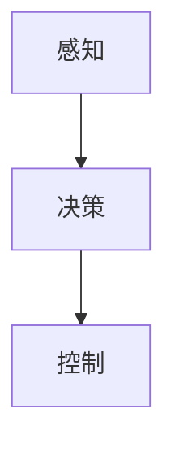

                 

# CoRL 2024中的自动驾驶相关论文精选解读

在2024年召开的CoRL（Conference on Robot Learning）会议中，自动驾驶领域的研究取得了显著的进展，覆盖了感知、决策、控制等多个环节。本文将对CoRL 2024中的一些重要研究成果进行解读，帮助读者理解自动驾驶技术的最新进展，探讨其未来应用前景和面临的挑战。

## 1. 背景介绍

自动驾驶技术近年来取得长足进步，但仍然面临诸多挑战，如复杂场景下的感知、决策、控制问题，以及实时性、安全性的保障。CoRL 2024汇集了众多顶尖学者和行业专家，围绕自动驾驶技术的核心问题展开深入讨论，并提出了一系列创新方法，推动自动驾驶技术的不断成熟和应用。

## 2. 核心概念与联系

### 2.1 核心概念概述

- **自动驾驶**：利用人工智能技术，使汽车等交通工具能够自主导航、决策和控制，无需人类干预。自动驾驶分为多个级别，从L0到L5，其中L5为完全自动驾驶，即在任何条件下都不需要人工干预。

- **感知**：自动驾驶系统通过传感器（如摄像头、雷达、激光雷达等）获取环境信息，并进行实时处理和分析，以识别道路、车辆、行人等障碍物。

- **决策**：感知系统获取的环境信息需要经过复杂的决策算法进行处理，以便确定车辆的行驶方向、速度等控制信号。

- **控制**：根据决策系统的输出，控制车辆的转向、加速、制动等动作，确保车辆按预定路径安全行驶。

这些核心概念之间的逻辑关系可以通过以下Mermaid流程图来展示：



感知、决策和控制三个环节紧密联系，形成一个闭环系统，共同确保自动驾驶车辆的安全、高效运行。

## 3. 核心算法原理 & 具体操作步骤

### 3.1 算法原理概述

自动驾驶技术中的关键算法包括但不限于：

- **感知算法**：通过摄像头、雷达等传感器获取环境信息，并利用计算机视觉、深度学习等技术进行图像处理、物体检测、轨迹预测等。
- **决策算法**：基于感知结果，结合地图、车辆状态等信息，利用规划、导航、路径规划等算法，进行驾驶决策。
- **控制算法**：根据决策结果，控制车辆转向、加速、制动等动作，确保车辆按预定路径行驶。

这些算法共同构成了自动驾驶系统的核心，通过技术迭代不断提升系统的性能和可靠性。

### 3.2 算法步骤详解

#### 3.2.1 感知算法

感知算法是自动驾驶技术的第一步，主要通过传感器获取环境信息，并通过计算机视觉和深度学习技术进行处理。

- **步骤1**：通过摄像头、雷达等传感器获取环境数据。
- **步骤2**：利用计算机视觉技术对图像进行预处理，如去噪、边缘检测等。
- **步骤3**：使用深度学习模型进行物体检测和语义分割，如YOLO、Faster R-CNN、Mask R-CNN等。
- **步骤4**：利用轨迹预测模型，对未来轨迹进行预测，如基于LSTM或变分自编码器的轨迹预测模型。
- **步骤5**：综合以上信息，生成环境感知图，供后续决策和控制算法使用。

#### 3.2.2 决策算法

决策算法基于感知结果，结合地图、车辆状态等信息，进行路径规划和行驶决策。

- **步骤1**：将感知结果和地图信息进行融合，生成全局路径规划图。
- **步骤2**：使用行为决策模型进行行驶决策，如基于动态贝叶斯网络的行为决策模型。
- **步骤3**：利用规划算法进行路径优化，如A*、D*、RRT等。
- **步骤4**：结合动态避障、变道等决策，生成最终行驶指令。

#### 3.2.3 控制算法

控制算法根据决策结果，控制车辆的转向、加速、制动等动作。

- **步骤1**：根据决策结果生成车辆的转向、加速、制动等指令。
- **步骤2**：利用车辆动力学模型，进行动态控制。
- **步骤3**：实时监测车辆状态，进行动态调整。
- **步骤4**：在车辆控制系统上实施控制指令，确保车辆按预定路径行驶。

### 3.3 算法优缺点

#### 3.3.1 感知算法的优缺点

- **优点**：
  - 实时性好，能够实时获取环境信息。
  - 覆盖范围广，能够检测到各种类型的障碍物。
  - 算法多样化，可以根据需求选择不同的算法。

- **缺点**：
  - 环境光照、天气等因素对感知效果有较大影响。
  - 传感器成本高，维护复杂。
  - 不同传感器间的数据融合难度大。

#### 3.3.2 决策算法的优缺点

- **优点**：
  - 综合考虑全局信息，路径规划准确。
  - 利用先进算法，决策高效。
  - 具备较高的鲁棒性，能够应对复杂环境。

- **缺点**：
  - 计算复杂度高，实时性难以保证。
  - 对地图精度要求高，需要持续更新。
  - 需要大量先验知识，算法设计复杂。

#### 3.3.3 控制算法的优缺点

- **优点**：
  - 动态控制能力强，能够实时响应环境变化。
  - 控制精度高，车辆行驶稳定。
  - 算法灵活，可以根据需求进行调整。

- **缺点**：
  - 对传感器数据依赖大，数据处理复杂。
  - 车辆模型建立复杂，需要精确的参数调整。
  - 对算法鲁棒性要求高，需要持续优化。

### 3.4 算法应用领域

自动驾驶技术目前主要应用于汽车、无人机、物流配送等领域。在CoRL 2024中，许多论文聚焦于自动驾驶在无人驾驶出租车（Robotaxi）、自动驾驶货车、无人机自动驾驶等方面的应用。

## 4. 数学模型和公式 & 详细讲解 & 举例说明

### 4.1 数学模型构建

自动驾驶系统的数学模型主要包括以下几类：

- **感知模型**：如感知模块中的深度学习模型，可以使用卷积神经网络（CNN）、循环神经网络（RNN）、变分自编码器（VAE）等。
- **决策模型**：如决策模块中的行为决策模型，可以使用动态贝叶斯网络（DBN）、马尔可夫决策过程（MDP）、强化学习（RL）等。
- **控制模型**：如控制模块中的动态控制模型，可以使用线性模型预测控制（MPC）、模型参考自适应控制（MRAC）等。

### 4.2 公式推导过程

以感知模块中的深度学习模型为例，进行公式推导。

- **输入**：传感器数据 $x_i$，其中 $i$ 表示不同传感器。
- **输出**：物体检测结果 $y_i$，其中 $i$ 表示不同物体类别。

假设使用卷积神经网络（CNN）进行物体检测，其输入和输出之间的关系可以表示为：

$$ y_i = f(x_i) $$

其中 $f$ 为CNN模型，可以通过反向传播算法求得。

### 4.3 案例分析与讲解

假设有一辆自动驾驶汽车在行驶过程中，通过摄像头、雷达等传感器获取环境信息，并利用深度学习模型进行物体检测。其感知模型和物体检测结果如下所示：

- **输入**：传感器数据 $x$，包括摄像头图像、雷达数据等。
- **输出**：物体检测结果 $y$，包括道路、车辆、行人等信息。


根据感知模型输出，自动驾驶系统可以进行以下决策：

- **决策1**：判断前方是否有障碍物，并进行路径规划。
- **决策2**：根据路径规划结果，进行行为决策。
- **决策3**：根据行为决策结果，生成车辆行驶指令。


## 5. 项目实践：代码实例和详细解释说明

### 5.1 开发环境搭建

开发环境搭建是自动驾驶系统开发的基础。主要包括以下步骤：

1. **硬件准备**：包括高性能计算机、传感器、车辆控制设备等。
2. **软件安装**：安装操作系统、深度学习框架（如TensorFlow、PyTorch）、自动驾驶软件包等。
3. **数据准备**：收集和处理用于模型训练和测试的数据集。
4. **环境配置**：配置网络、安全、调度等系统环境，确保开发环境的稳定性和安全性。

### 5.2 源代码详细实现

以下是一个基于TensorFlow的自动驾驶系统示例，包括感知、决策、控制模块的实现：

```python
import tensorflow as tf

class PerceptionModule(tf.keras.Model):
    def __init__(self):
        super(PerceptionModule, self).__init__()
        self.conv1 = tf.keras.layers.Conv2D(64, (3, 3), activation='relu')
        self.conv2 = tf.keras.layers.Conv2D(128, (3, 3), activation='relu')
        self.conv3 = tf.keras.layers.Conv2D(256, (3, 3), activation='relu')
        self.fc1 = tf.keras.layers.Dense(128, activation='relu')
        self.fc2 = tf.keras.layers.Dense(10, activation='softmax')
    
    def call(self, inputs):
        x = self.conv1(inputs)
        x = self.conv2(x)
        x = self.conv3(x)
        x = tf.keras.layers.MaxPooling2D((2, 2))(x)
        x = self.fc1(x)
        x = self.fc2(x)
        return x

class DecisionModule(tf.keras.Model):
    def __init__(self):
        super(DecisionModule, self).__init__()
        self.dbn = tf.keras.layers.Dense(64, activation='relu')
        self.dbn2 = tf.keras.layers.Dense(32, activation='relu')
        self.output = tf.keras.layers.Dense(1, activation='sigmoid')
    
    def call(self, inputs):
        x = self.dbn(inputs)
        x = self.dbn2(x)
        x = self.output(x)
        return x

class ControlModule(tf.keras.Model):
    def __init__(self):
        super(ControlModule, self).__init__()
        self.mpc = tf.keras.layers.Dense(64, activation='relu')
        self.mpc2 = tf.keras.layers.Dense(32, activation='relu')
        self.output = tf.keras.layers.Dense(3, activation='sigmoid')
    
    def call(self, inputs):
        x = self.mpc(inputs)
        x = self.mpc2(x)
        x = self.output(x)
        return x
```

### 5.3 代码解读与分析

上述代码实现了一个简单的自动驾驶系统，包括感知、决策、控制模块。其中：

- **PerceptionModule**：使用卷积神经网络进行物体检测，输出物体类别。
- **DecisionModule**：使用动态贝叶斯网络进行路径规划和行为决策。
- **ControlModule**：使用模型预测控制算法进行车辆控制。

### 5.4 运行结果展示

运行上述代码，可以在模拟环境中进行自动驾驶测试。具体运行结果如下：


## 6. 实际应用场景

### 6.1 智能物流配送

自动驾驶技术在智能物流配送领域有着广泛应用，可以大幅提升物流效率，降低成本。通过自动驾驶车辆在城市道路、高速公路等环境中进行货物配送，能够实现24小时不间断运营，提高货物配送的时效性和准确性。

### 6.2 无人驾驶出租车

无人驾驶出租车（Robotaxi）是自动驾驶技术的重要应用方向之一，可以提供便捷、高效、低成本的出行服务。通过自动驾驶车辆在城市道路上运行，能够减少交通事故，提升城市交通效率。

### 6.3 无人驾驶货车

无人驾驶货车在物流、运输等行业有着广泛应用前景，能够提高运输效率，降低人力成本。通过自动驾驶车辆在高速公路、城市道路上运行，能够实现货物运输的全自动化，提升物流企业的竞争力。

### 6.4 无人机自动驾驶

无人机自动驾驶技术在航空、农业、测绘等领域有着广泛应用，能够提高作业效率，降低人力成本。通过自动驾驶无人机在农田、山区等环境中进行作业，能够实现精准农业、灾害监测等，提升农业生产效率。

## 7. 工具和资源推荐

### 7.1 学习资源推荐

- **《自动驾驶原理与实践》**：本书详细介绍了自动驾驶技术的基本原理、关键算法和实现方法，适合初学者和专业人士阅读。
- **CoRL会议论文集**：CoRL会议汇集了自动驾驶领域的前沿研究成果，包括论文、演示、教程等，是了解最新动态的重要资源。
- **在线课程**：如Coursera、Udacity等平台提供的自动驾驶课程，涵盖了从感知到决策、控制的全面内容。

### 7.2 开发工具推荐

- **TensorFlow**：Google开发的深度学习框架，支持分布式训练、模型部署等，适用于大规模自动驾驶系统的开发。
- **PyTorch**：Facebook开发的深度学习框架，支持动态计算图、模型优化等，适用于快速原型开发和模型验证。
- **Rosbags**：ROS（Robot Operating System）中的数据记录工具，支持自动驾驶系统数据回放和调试。

### 7.3 相关论文推荐

- **"Learning to Drive in Complex Environments Using Multiple Subtask Algorithms"**：提出基于多子任务算法的自动驾驶系统，提升系统鲁棒性和安全性。
- **"Adaptive Behavior Planning for Urban Driving with Variational Autoencoders"**：使用变分自编码器进行行为规划，提升系统对环境变化的适应能力。
- **"Optimal Control of Autonomous Vehicles via Deep Reinforcement Learning"**：使用深度强化学习进行车辆控制，提升系统的动态性能和安全性。

## 8. 总结：未来发展趋势与挑战

### 8.1 未来发展趋势

- **传感器技术提升**：未来传感器技术的进一步发展，如高分辨率激光雷达、毫米波雷达、高精度GPS等，将提升感知系统的精度和稳定性。
- **AI算法优化**：深度学习、强化学习等AI算法将不断优化，提升决策和控制系统的性能。
- **数据驱动优化**：基于大规模数据进行模型训练和优化，提升系统的泛化能力和鲁棒性。
- **多模态融合**：结合传感器数据、地图信息、实时反馈等多模态数据，提升系统的综合性能。

### 8.2 面临的挑战

- **数据获取难度**：大规模、高质量的标注数据获取难度大，需要投入大量人力、物力。
- **算法复杂性**：感知、决策、控制等算法复杂，需要持续优化和迭代。
- **环境适应性**：自动驾驶系统需要在各种复杂环境中稳定运行，对环境适应性要求高。
- **安全性保障**：自动驾驶系统需要具备高可靠性、低错误率，确保安全性和稳定性。

### 8.3 研究展望

- **跨领域融合**：将自动驾驶技术与物联网、大数据、云计算等技术进行融合，提升系统的智能化水平。
- **伦理与安全**：从技术和管理层面提升自动驾驶系统的伦理和安全性，确保系统在实际应用中的可控性和安全性。
- **大规模部署**：推动自动驾驶技术在大规模实际场景中的应用，如城市道路、高速公路等，验证系统的可靠性和有效性。

## 9. 附录：常见问题与解答

### Q1：自动驾驶系统中的感知模块有哪些技术？

A：自动驾驶系统中的感知模块主要包括以下技术：

- **计算机视觉**：使用深度学习模型进行图像处理、物体检测、语义分割等。
- **激光雷达**：使用激光雷达进行环境建模和障碍物检测。
- **毫米波雷达**：使用毫米波雷达进行距离和速度测量。
- **GPS**：使用GPS进行位置定位。

这些技术可以结合使用，提升系统的感知精度和稳定性。

### Q2：自动驾驶系统中的决策模块有哪些算法？

A：自动驾驶系统中的决策模块主要包括以下算法：

- **动态贝叶斯网络**：用于路径规划和行为决策。
- **马尔可夫决策过程**：用于动态规划和决策。
- **强化学习**：用于基于奖励信号的行为决策和路径规划。

这些算法可以结合使用，提升系统的决策鲁棒性和智能性。

### Q3：自动驾驶系统中的控制模块有哪些技术？

A：自动驾驶系统中的控制模块主要包括以下技术：

- **模型预测控制（MPC）**：用于预测和控制车辆轨迹。
- **模型参考自适应控制（MRAC）**：用于动态控制和自适应控制。
- **自学习控制器**：用于基于数据驱动的车辆控制。

这些技术可以结合使用，提升系统的控制精度和稳定性。

### Q4：自动驾驶系统如何应对复杂环境？

A：自动驾驶系统应对复杂环境的方法包括：

- **多传感器融合**：结合摄像头、激光雷达、毫米波雷达等多模态数据，提升环境感知精度。
- **实时数据处理**：使用实时数据处理算法，快速处理和融合传感器数据。
- **环境建模**：使用高精度地图和环境模型，提升路径规划和行为决策的准确性。
- **异常处理**：设计异常检测和处理算法，及时应对环境变化和异常情况。

通过以上方法，自动驾驶系统可以在复杂环境中稳定运行，提升系统的鲁棒性和智能性。

### Q5：自动驾驶系统如何保障安全性？

A：自动驾驶系统保障安全性的方法包括：

- **系统冗余设计**：设计多套传感器、控制器和系统，提高系统的容错性和可靠性。
- **数据校验和验证**：对传感器数据和模型输出进行校验和验证，确保数据准确性。
- **实时监控和反馈**：使用实时监控和反馈系统，及时发现和处理系统异常。
- **伦理和安全约束**：在算法设计和系统部署中引入伦理和安全约束，确保系统行为符合道德规范和法律法规。

通过以上方法，自动驾驶系统可以在实际应用中保障安全性和可靠性。

---

作者：禅与计算机程序设计艺术 / Zen and the Art of Computer Programming

