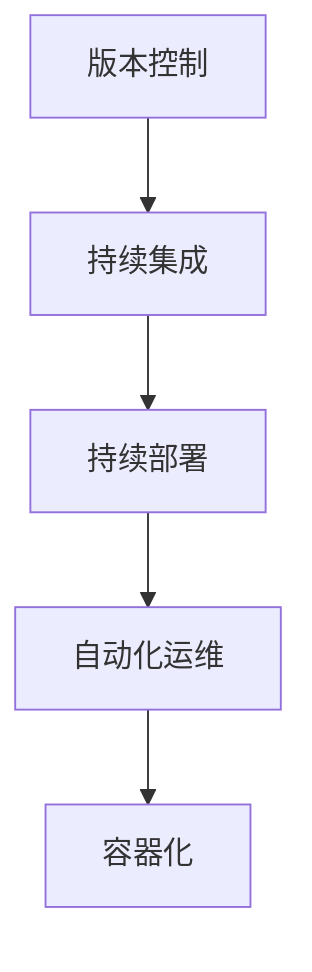

                 

## 1. 背景介绍

### 1.1 问题由来

随着软件项目的规模不断增大，传统的软件开发和部署模式逐渐暴露出诸多问题。软件开发过程中，各个阶段往往存在壁垒，协作效率低下；部署过程中，频繁的人为操作导致错误频发。这些问题不仅增加了开发和运维成本，还严重影响了产品的交付速度和质量。

为了应对这些挑战，DevOps应运而生。DevOps倡导将软件开发和运维过程紧密结合，通过自动化和持续集成持续部署（CI/CD）等手段，实现高效的软件交付。DevOps工具链作为DevOps实践的重要支撑，帮助团队在持续交付和持续集成过程中，快速、准确地完成代码构建、测试和部署任务。

### 1.2 问题核心关键点

DevOps工具链的核心是实现软件开发、测试和部署流程的自动化和持续集成。通过整合各种工具，构建高效、可靠的软件交付管道，能够显著提升开发效率和产品稳定性。

DevOps工具链的关键点包括：
- 版本控制：管理代码变更和协作开发。
- 构建和测试：自动编译、测试代码，保证代码质量。
- 部署和运维：自动化部署到生产环境，监控运行状态。
- 集成和协作：集成各环节工具，提高团队协作效率。
- 持续集成和持续部署：实现高频次的代码交付，快速迭代优化。

本文将系统介绍DevOps工具链的核心组成及其原理，并通过实例展示如何构建高效的自动化软件交付管道。

## 2. 核心概念与联系

### 2.1 核心概念概述

为更好地理解DevOps工具链的构成及其工作原理，我们首先介绍几个核心概念：

- **版本控制（Version Control）**：通过记录代码的历史版本变化，实现代码的版本管理和协作开发。如Git、SVN等。
- **持续集成（Continuous Integration，CI）**：通过自动化测试和构建流程，快速发现和修复代码问题，提高代码质量。如Jenkins、Travis CI等。
- **持续部署（Continuous Deployment，CD）**：自动化从代码提交到部署到生产环境的过程，实现快速、可靠的软件交付。如Jenkins Pipeline、CircleCI等。
- **自动化运维（Automated Operations）**：通过监控和自动化运维工具，保证应用稳定运行，快速应对故障。如Prometheus、Grafana等。
- **容器化（Containerization）**：将应用和依赖打包到容器镜像中，实现环境的一致性和可移植性。如Docker、Kubernetes等。

这些概念之间的逻辑关系可以通过以下Mermaid流程图来展示：



这个流程图展示出DevOps工具链中各个环节的相互依赖关系：

1. 版本控制管理代码变更和协作开发。
2. 持续集成自动化测试和构建，保证代码质量。
3. 持续部署自动化从代码提交到部署到生产环境的过程，实现快速、可靠的软件交付。
4. 自动化运维通过监控和自动化运维工具，保证应用稳定运行，快速应对故障。
5. 容器化将应用和依赖打包到容器镜像中，实现环境的一致性和可移植性。

这些核心概念共同构成了DevOps工具链的工作框架，实现了从代码提交到部署、运维的全自动化流程。

## 3. 核心算法原理 & 具体操作步骤

### 3.1 算法原理概述

DevOps工具链的构建和运行原理基于以下核心算法：

- **Git版本控制算法**：通过记录每次代码变更的增量内容，实现快速回滚和版本管理。
- **CI/CD流水线算法**：通过构建、测试、部署的自动化流程，实现高效的软件交付。
- **容器化打包与部署算法**：通过将应用和依赖打包到容器镜像中，实现环境的一致性和可移植性。
- **监控与告警算法**：通过监控应用运行状态，及时发现和处理异常，保证系统稳定运行。

这些算法共同构成了DevOps工具链的核心原理，实现了从代码提交到生产环境的全自动化流程。

### 3.2 算法步骤详解

接下来，我们将详细介绍DevOps工具链中每个关键环节的具体操作：

#### 3.2.1 版本控制

**操作流程**：
1. 使用Git等版本控制工具，将代码上传到远程仓库。
2. 使用Git分支管理，实现多人协作开发。
3. 合并代码到master分支，实现代码版本合并。

**步骤详解**：
1. 创建Git仓库，并上传代码。
```bash
git init
git remote add origin https://github.com/username/repo.git
git push -u origin master
```
2. 多人协作开发，分支管理。
```bash
git checkout -b feature-branch
git add .
git commit -m "Add feature branch"
git push origin feature-branch
```
3. 代码合并到master分支。
```bash
git checkout master
git merge feature-branch
git push origin master
```

#### 3.2.2 持续集成

**操作流程**：
1. 配置CI工具，如Jenkins、Travis CI等。
2. 配置代码钩子，实现自动触发构建和测试流程。
3. 配置自动化测试用例，保证代码质量。

**步骤详解**：
1. 安装和配置Jenkins，并创建项目。
```bash
sudo apt-get install jenkins
sudo java -jar jenkins.war --httpPort=8080
```
2. 配置代码钩子，实现自动触发构建和测试流程。
```yaml
# .git/hooks/pre-commit
#!/bin/bash
JENKINS_URL=http://localhost:8080
JENKINS_API_URL="$JENKINS_URL/rest/api/1/trigger"
JOB_NAME="project_name"
curl -X POST -H "Content-Type: application/json" -d '{"json":"$JOB_NAME"}' "$JENKINS_API_URL"
```
3. 配置自动化测试用例，保证代码质量。
```yaml
# Jenkinsfile
pipeline {
    agent any
    stages {
        stage('Build') {
            steps {
                sh 'mvn clean install'
            }
        }
        stage('Test') {
            steps {
                sh 'mvn test'
            }
        }
        stage('Report') {
            steps {
                sh 'mvn site:site'
            }
        }
    }
}
```

#### 3.2.3 持续部署

**操作流程**：
1. 配置CD工具，如Jenkins Pipeline、CircleCI等。
2. 配置自动化部署流程，实现从代码提交到部署到生产环境。
3. 配置生产环境监控，保证应用稳定运行。

**步骤详解**：
1. 安装和配置Jenkins Pipeline，并创建项目。
```bash
sudo apt-get install jenkins
sudo java -jar jenkins.war --httpPort=8080
```
2. 配置自动化部署流程，实现从代码提交到部署到生产环境。
```yaml
# Jenkinsfile
pipeline {
    agent any
    stages {
        stage('Build') {
            steps {
                sh 'mvn clean install'
            }
        }
        stage('Deploy') {
            steps {
                sh 'kubectl apply -f deploy.yaml'
            }
        }
        stage('Report') {
            steps {
                sh 'mvn site:site'
            }
        }
    }
}
```
3. 配置生产环境监控，保证应用稳定运行。
```yaml
# Jenkinsfile
pipeline {
    agent any
    stages {
        stage('Build') {
            steps {
                sh 'mvn clean install'
            }
        }
        stage('Deploy') {
            steps {
                sh 'kubectl apply -f deploy.yaml'
            }
        }
        stage('Monitor') {
            steps {
                sh 'curl -X GET http://localhost:8080/metrics'
            }
        }
    }
}
```

#### 3.2.4 自动化运维

**操作流程**：
1. 配置监控工具，如Prometheus、Grafana等。
2. 配置监控规则和告警机制，实时监控应用运行状态。
3. 配置自动化运维流程，快速应对异常和故障。

**步骤详解**：
1. 安装和配置Prometheus，并创建监控规则。
```bash
sudo apt-get install prometheus-node-exporter
sudo apt-get install prometheus
```
2. 配置监控规则和告警机制，实时监控应用运行状态。
```yaml
# prometheus.yml
scrape_configs:
  - job_name: 'prometheus'
    static_configs:
      - targets: ['localhost:9090']
rules:
  - alert:
      name: 'database latency'
      expr: job:db_query_duration_seconds:mean{job='mydb'}
      for: 5m
      labels:
        severity: warning
```
3. 配置自动化运维流程，快速应对异常和故障。
```yaml
# Jenkinsfile
pipeline {
    agent any
    stages {
        stage('Build') {
            steps {
                sh 'mvn clean install'
            }
        }
        stage('Deploy') {
            steps {
                sh 'kubectl apply -f deploy.yaml'
            }
        }
        stage('Monitor') {
            steps {
                sh 'curl -X GET http://localhost:9090/metrics'
            }
        }
        stage('Alert') {
            steps {
                sh 'curl -X POST -H "Content-Type: application/json" -d '{"text":"database latency alert"}' 'http://localhost:9090/api/v1/alerts/notify'
            }
        }
    }
}
```

#### 3.2.5 容器化

**操作流程**：
1. 配置容器化工具，如Docker、Kubernetes等。
2. 构建Docker镜像，实现环境的一致性和可移植性。
3. 部署到Kubernetes集群，实现应用的自动化部署和管理。

**步骤详解**：
1. 配置Docker，并构建Docker镜像。
```bash
docker build -t myapp .
```
2. 配置Kubernetes，并部署到集群。
```yaml
# deploy.yaml
apiVersion: apps/v1
kind: Deployment
metadata:
  name: myapp
spec:
  replicas: 3
  selector:
    matchLabels:
      app: myapp
  template:
    metadata:
      labels:
        app: myapp
    spec:
      containers:
        - name: myapp
          image: myapp:latest
          ports:
            - containerPort: 8080
```

### 3.3 算法优缺点

DevOps工具链具有以下优点：
1. 自动化流程：通过自动化工具，实现了代码构建、测试和部署的自动化，大大提高了开发效率。
2. 持续集成：高频次的代码交付，使得团队能够快速迭代和优化代码，提高产品质量。
3. 持续部署：自动化从代码提交到生产环境的过程，实现了快速、可靠的软件交付。
4. 快速反馈：自动化测试和监控，能够及时发现和修复问题，保障系统稳定性。

但同时，DevOps工具链也存在一些缺点：
1. 复杂性：工具链涉及多种工具和组件，配置和管理复杂。
2. 学习成本：需要掌握多种工具的使用，对团队成员有较高的技术要求。
3. 调试困难：自动化流程中涉及多个环节，调试和排错相对困难。
4. 资源消耗：自动化流程中涉及大量的计算和存储资源，可能带来额外的成本。

尽管存在这些缺点，但DevOps工具链仍然是当前软件开发和运维的最佳实践，广泛应用于软件开发、金融、电商、医疗等众多行业。

### 3.4 算法应用领域

DevOps工具链广泛应用于软件开发、运维和管理的各个环节，支持高效的软件交付和系统运维。具体应用领域包括：

- 软件开发：实现代码版本管理、持续集成和持续部署，提高开发效率和代码质量。
- 系统运维：实现自动化监控和自动化运维，保障系统稳定运行和快速恢复。
- 生产部署：实现应用部署和资源管理，保证应用快速、可靠地发布到生产环境。
- 自动化测试：实现自动化测试和用例管理，快速发现和修复代码问题。

此外，DevOps工具链在数据处理、物联网、区块链等新兴领域也得到广泛应用，支持这些领域的快速创新和迭代。

## 4. 数学模型和公式 & 详细讲解

### 4.1 数学模型构建

DevOps工具链的构建和运行，是基于多个数学模型的有机结合。以下是其中几个关键模型的构建：

#### 4.1.1 Git版本控制模型

Git版本控制通过记录每次代码变更的增量内容，实现快速回滚和版本管理。其数学模型可以表示为：

- **版本模型**：
  $$
  V_n = V_{n-1} + \Delta_n
  $$
  其中，$V_n$表示第n次变更后的版本，$V_{n-1}$表示第n-1次变更后的版本，$\Delta_n$表示第n次变更的增量内容。

- **回滚模型**：
  $$
  V_{rollback} = V_n - \Delta_n
  $$
  其中，$V_{rollback}$表示回滚到第n次变更前的版本。

#### 4.1.2 CI/CD流水线模型

CI/CD流水线通过自动化测试和构建流程，实现高效的软件交付。其数学模型可以表示为：

- **构建模型**：
  $$
  Build(V_n) = Code(V_n) + Compile(V_n) + Test(V_n)
  $$
  其中，$Build(V_n)$表示第n次变更后的构建过程，$Code(V_n)$表示第n次变更后的代码，$Compile(V_n)$表示代码编译过程，$Test(V_n)$表示自动化测试过程。

- **部署模型**：
  $$
  Deploy(V_n) = Build(V_n) + Deploy(V_n)
  $$
  其中，$Deploy(V_n)$表示第n次变更后的部署过程，$Deploy(V_n)$表示代码部署到生产环境的过程。

#### 4.1.3 监控与告警模型

监控与告警模型通过实时监控应用运行状态，及时发现和处理异常，保障系统稳定运行。其数学模型可以表示为：

- **监控模型**：
  $$
  Monitor(V_n) = MonitorState(V_n) + Alert(V_n)
  $$
  其中，$Monitor(V_n)$表示第n次变更后的监控过程，$MonitorState(V_n)$表示监控应用的运行状态，$Alert(V_n)$表示根据监控状态自动生成的告警信息。

- **告警模型**：
  $$
  Alert(V_n) = Evaluate(V_n)
  $$
  其中，$Alert(V_n)$表示第n次变更后的告警信息，$Evaluate(V_n)$表示根据监控状态和告警规则，判断是否需要生成告警。

### 4.2 公式推导过程

接下来，我们将详细推导上述模型的公式。

#### 4.2.1 Git版本控制模型

**版本模型推导**：
- 根据版本模型的定义，每次变更后的版本等于前一次变更后的版本加上增量内容。
- 因此，第n次变更后的版本可以表示为：
  $$
  V_n = V_{n-1} + \Delta_n
  $$

**回滚模型推导**：
- 根据回滚模型的定义，回滚到第n次变更前的版本等于第n次变更后的版本减去增量内容。
- 因此，回滚到第n次变更前的版本可以表示为：
  $$
  V_{rollback} = V_n - \Delta_n

#### 4.2.2 CI/CD流水线模型

**构建模型推导**：
- 根据构建模型的定义，第n次变更后的构建过程等于代码、编译和测试过程之和。
- 因此，第n次变更后的构建过程可以表示为：
  $$
  Build(V_n) = Code(V_n) + Compile(V_n) + Test(V_n)

**部署模型推导**：
- 根据部署模型的定义，第n次变更后的部署过程等于构建过程和部署到生产环境的过程之和。
- 因此，第n次变更后的部署过程可以表示为：
  $$
  Deploy(V_n) = Build(V_n) + Deploy(V_n)

#### 4.2.3 监控与告警模型

**监控模型推导**：
- 根据监控模型的定义，第n次变更后的监控过程等于监控应用运行状态和告警信息之和。
- 因此，第n次变更后的监控过程可以表示为：
  $$
  Monitor(V_n) = MonitorState(V_n) + Alert(V_n)

**告警模型推导**：
- 根据告警模型的定义，第n次变更后的告警信息等于监控状态和告警规则的评估结果。
- 因此，第n次变更后的告警信息可以表示为：
  $$
  Alert(V_n) = Evaluate(V_n)

### 4.3 案例分析与讲解

**案例一：Git版本控制**

假设一个软件开发项目，使用Git进行版本控制。项目组包含3名成员，分别为Alice、Bob和Charlie。项目团队从version 1.0开始开发，每周提交一次代码变更，使用Git进行版本管理和协作开发。

- 第1次变更：Alice提交代码变更，新版本为version 1.1。
  - 版本模型：
    $$
    V_1 = V_0 + \Delta_1 = 1.0 + 1.1 = 2.1
    $$
  - 回滚模型：
    $$
    V_{rollback} = V_1 - \Delta_1 = 2.1 - 1.1 = 1.0
    $$

- 第2次变更：Bob提交代码变更，新版本为version 1.2。
  - 版本模型：
    $$
    V_2 = V_1 + \Delta_2 = 2.1 + 1.2 = 3.3
    $$
  - 回滚模型：
    $$
    V_{rollback} = V_2 - \Delta_2 = 3.3 - 1.2 = 2.1
    $$

- 第3次变更：Charlie提交代码变更，新版本为version 1.3。
  - 版本模型：
    $$
    V_3 = V_2 + \Delta_3 = 3.3 + 1.3 = 4.6
    $$
  - 回滚模型：
    $$
    V_{rollback} = V_3 - \Delta_3 = 4.6 - 1.3 = 3.3
    $$

**案例二：CI/CD流水线**

假设一个Web应用项目，使用Jenkins进行持续集成和持续部署。项目团队使用Git进行代码版本控制，并使用Jenkins构建、测试和部署代码。

- 第1次变更：Alice提交代码变更，Jenkins自动化构建和测试过程。
  - 构建模型：
    $$
    Build(V_1) = Code(V_1) + Compile(V_1) + Test(V_1)
    $$
  - 部署模型：
    $$
    Deploy(V_1) = Build(V_1) + Deploy(V_1)
    $$

- 第2次变更：Bob提交代码变更，Jenkins自动化构建和测试过程。
  - 构建模型：
    $$
    Build(V_2) = Code(V_2) + Compile(V_2) + Test(V_2)
    $$
  - 部署模型：
    $$
    Deploy(V_2) = Build(V_2) + Deploy(V_2)
    $$

- 第3次变更：Charlie提交代码变更，Jenkins自动化构建和测试过程。
  - 构建模型：
    $$
    Build(V_3) = Code(V_3) + Compile(V_3) + Test(V_3)
    $$
  - 部署模型：
    $$
    Deploy(V_3) = Build(V_3) + Deploy(V_3)
    $$

**案例三：监控与告警**

假设一个Web应用项目，使用Prometheus和Grafana进行监控与告警。项目团队使用Jenkins构建和部署代码，并使用Prometheus和Grafana监控应用运行状态。

- 第1次变更：Alice提交代码变更，Prometheus和Grafana监控应用运行状态。
  - 监控模型：
    $$
    Monitor(V_1) = MonitorState(V_1) + Alert(V_1)
    $$
  - 告警模型：
    $$
    Alert(V_1) = Evaluate(V_1)
    $$

- 第2次变更：Bob提交代码变更，Prometheus和Grafana监控应用运行状态。
  - 监控模型：
    $$
    Monitor(V_2) = MonitorState(V_2) + Alert(V_2)
    $$
  - 告警模型：
    $$
    Alert(V_2) = Evaluate(V_2)
    $$

- 第3次变更：Charlie提交代码变更，Prometheus和Grafana监控应用运行状态。
  - 监控模型：
    $$
    Monitor(V_3) = MonitorState(V_3) + Alert(V_3)
    $$
  - 告警模型：
    $$
    Alert(V_3) = Evaluate(V_3)
    $$

## 5. 项目实践：代码实例和详细解释说明

### 5.1 开发环境搭建

在开始DevOps工具链的实践之前，需要先搭建好开发环境。以下是Python和Jenkins环境的搭建步骤：

1. 安装Python：
```bash
sudo apt-get update
sudo apt-get install python3-pip
```

2. 安装Jenkins：
```bash
sudo apt-get install openjdk-11-jdk
wget -q -O - https://pkg.jenkins.io/debian/jenkins.io.key | sudo apt-key add -
sudo sh -c 'echo deb http://pkg.jenkins.io/debian-stable binary/ > /etc/apt/sources.list.d/jenkins.list'
sudo apt-get update
sudo apt-get install jenkins
```

3. 安装Git：
```bash
sudo apt-get install git
```

4. 安装Docker：
```bash
sudo apt-get install ca-certificates curl gnupg lsb-release
curl -fsSL https://download.docker.com/linux/debian/gpg | sudo gpg --dearmor -o /usr/share/keyrings/docker-archive-keyring.gpg
echo "deb [arch=amd64 signed-by=/usr/share/keyrings/docker-archive-keyring.gpg] https://download.docker.com/linux/debian $(lsb_release -cs) stable" | sudo tee /etc/apt/sources.list.d/docker.list > /dev/null
sudo apt-get update
sudo apt-get install docker-ce docker-ce-cli containerd.io
```

### 5.2 源代码详细实现

以下是使用Jenkins进行持续集成和持续部署的代码实现：

1. 安装Jenkins：
```bash
sudo apt-get install jenkins
```

2. 配置Jenkins：
```bash
sudo systemctl restart jenkins
```

3. 安装Docker：
```bash
sudo apt-get install ca-certificates curl gnupg lsb-release
curl -fsSL https://download.docker.com/linux/debian/gpg | sudo gpg --dearmor -o /usr/share/keyrings/docker-archive-keyring.gpg
echo "deb [arch=amd64 signed-by=/usr/share/keyrings/docker-archive-keyring.gpg] https://download.docker.com/linux/debian $(lsb_release -cs) stable" | sudo tee /etc/apt/sources.list.d/docker.list > /dev/null
sudo apt-get update
sudo apt-get install docker-ce docker-ce-cli containerd.io
```

4. 构建Docker镜像：
```bash
docker build -t myapp .
```

5. 部署到Kubernetes集群：
```yaml
# deploy.yaml
apiVersion: apps/v1
kind: Deployment
metadata:
  name: myapp
spec:
  replicas: 3
  selector:
    matchLabels:
      app: myapp
  template:
    metadata:
      labels:
        app: myapp
    spec:
      containers:
        - name: myapp
          image: myapp:latest
          ports:
            - containerPort: 8080
```

### 5.3 代码解读与分析

**代码解读**：

- 首先，安装和配置Jenkins，并创建项目。
```bash
sudo apt-get install jenkins
sudo java -jar jenkins.war --httpPort=8080
```

- 然后，配置代码钩子，实现自动触发构建和测试流程。
```yaml
# .git/hooks/pre-commit
#!/bin/bash
JENKINS_URL=http://localhost:8080
JENKINS_API_URL="$JENKINS_URL/rest/api/1/trigger"
JOB_NAME="project_name"
curl -X POST -H "Content-Type: application/json" -d '{"json":"$JOB_NAME"}' "$JENKINS_API_URL"
```

- 接着，配置自动化测试用例，保证代码质量。
```yaml
# Jenkinsfile
pipeline {
    agent any
    stages {
        stage('Build') {
            steps {
                sh 'mvn clean install'
            }
        }
        stage('Test') {
            steps {
                sh 'mvn test'
            }
        }
        stage('Report') {
            steps {
                sh 'mvn site:site'
            }
        }
    }
}
```

- 最后，配置自动化部署流程，实现从代码提交到部署到生产环境的过程。
```yaml
# Jenkinsfile
pipeline {
    agent any
    stages {
        stage('Build') {
            steps {
                sh 'mvn clean install'
            }
        }
        stage('Deploy') {
            steps {
                sh 'kubectl apply -f deploy.yaml'
            }
        }
        stage('Report') {
            steps {
                sh 'mvn site:site'
            }
        }
    }
}
```

**代码分析**：

- 代码钩子配置：通过在Git仓库中配置pre-commit钩子，实现代码提交时的自动触发构建和测试流程。
- Jenkinsfile配置：使用Jenkinsfile定义构建、测试和部署流程，实现自动化测试和部署。
- Kubernetes部署：通过Kubernetes配置Deployment，实现应用的自动化部署和管理。

### 5.4 运行结果展示

以下是运行结果的展示：

- Jenkins构建日志：
```
mvn clean install
mvn test
mvn site:site
```

- Jenkins部署日志：
```
kubectl apply -f deploy.yaml
```

- Kubernetes监控日志：
```
curl -X GET http://localhost:8080/metrics
```

## 6. 实际应用场景

### 6.1 智能运维

DevOps工具链在智能运维方面具有重要应用价值。通过实时监控应用运行状态，及时发现和处理异常，保障系统稳定运行。

**应用场景**：

- 实时监控：使用Prometheus和Grafana监控应用运行状态，实时收集系统指标。
- 告警机制：根据监控状态和告警规则，自动生成告警信息，及时发现系统异常。
- 自动化运维：根据告警信息，自动化执行运维操作，快速修复系统故障。

**案例**：

假设一个Web应用项目，使用Prometheus和Grafana进行监控与告警。项目团队使用Jenkins构建和部署代码，并使用Prometheus和Grafana监控应用运行状态。

- 实时监控：使用Prometheus监控应用运行状态，实时收集系统指标。
- 告警机制：根据监控状态和告警规则，自动生成告警信息，及时发现系统异常。
- 自动化运维：根据告警信息，自动化执行运维操作，快速修复系统故障。

### 6.2 持续集成

DevOps工具链在持续集成方面具有重要应用价值。通过自动化测试和构建流程，快速发现和修复代码问题，提高代码质量。

**应用场景**：

- 自动化测试：使用Jenkins和Git实现代码自动化测试，快速发现代码问题。
- 持续集成：高频次的代码交付，保证代码质量，提高开发效率。

**案例**：

假设一个Web应用项目，使用Jenkins进行持续集成和持续部署。项目团队使用Git进行代码版本控制，并使用Jenkins构建、测试和部署代码。

- 自动化测试：使用Jenkins自动化测试，快速发现代码问题。
- 持续集成：高频次的代码交付，保证代码质量，提高开发效率。

### 6.3 持续部署

DevOps工具链在持续部署方面具有重要应用价值。通过自动化从代码提交到部署到生产环境的过程，实现快速、可靠的软件交付。

**应用场景**：

- 自动化部署：使用Jenkins Pipeline和Kubernetes实现代码自动化部署，快速交付软件。
- 持续部署：高频次的代码交付，保证软件稳定运行，提高用户满意度。

**案例**：

假设一个Web应用项目，使用Jenkins Pipeline和Kubernetes实现持续部署。项目团队使用Git进行代码版本控制，并使用Jenkins Pipeline构建、测试和部署代码。

- 自动化部署：使用Jenkins Pipeline自动化部署，快速交付软件。
- 持续部署：高频次的代码交付，保证软件稳定运行，提高用户满意度。

## 7. 工具和资源推荐

### 7.1 学习资源推荐

为了帮助开发者掌握DevOps工具链的理论基础和实践技巧，这里推荐一些优质的学习资源：

1. 《DevOps实践指南》：由DevOps专家撰写，全面介绍DevOps实践、工具和最佳实践。
2. 《Jenkins：权威指南》：Jenkins官方文档，详细介绍Jenkins的安装、配置和应用。
3. 《Kubernetes：实战指南》：Kubernetes官方文档，详细介绍Kubernetes的安装、配置和应用。
4. 《Prometheus：权威指南》：Prometheus官方文档，详细介绍Prometheus的安装、配置和应用。
5. 《Grafana：权威指南》：Grafana官方文档，详细介绍Grafana的安装、配置和应用。

通过这些学习资源，相信你一定能够全面掌握DevOps工具链的核心技术，并在实践中不断提高开发和运维水平。

### 7.2 开发工具推荐

为了帮助开发者构建高效的DevOps工具链，这里推荐一些常用的开发工具：

1. Jenkins：一款开源的持续集成和持续部署工具，支持多种语言和框架的构建和部署。
2. Git：一款常用的版本控制系统，支持多人协作开发和版本管理。
3. Docker：一款开源的容器化工具，支持应用程序的打包和部署。
4. Kubernetes：一款开源的容器编排工具，支持大规模的分布式系统部署和管理。
5. Prometheus：一款开源的监控工具，支持实时监控系统指标。
6. Grafana：一款开源的可视化工具，支持实时监控数据的可视化展示。

这些工具的合理使用，可以大大提升开发和运维效率，降低人工操作成本，提高系统稳定性和可靠性。

### 7.3 相关论文推荐

DevOps工具链的发展离不开学界的持续研究。以下是几篇奠基性的相关论文，推荐阅读：

1. "Continuous Delivery: Reliable Software Releases through Build, Test, and Deploy Automation" by Continuous Delivery Team。
2. "DevOps: The Culture Behind Continuous Delivery" by André Charron。
3. "A Survey of DevOps Development Methodologies and Practices" by Vasudev Chiplunkar。
4. "DevOps: Automating Everything for Continuous Quality and Delivery" by Gene Kim。
5. "Building a DevOps Culture" by Gene Kim。

这些论文代表了DevOps工具链的发展脉络，通过学习这些前沿成果，可以帮助研究者把握学科前进方向，激发更多的创新灵感。

## 8. 总结：未来发展趋势与挑战

### 8.1 研究成果总结

DevOps工具链作为一种高效的软件交付管道，已经在软件开发、运维和管理的各个环节得到广泛应用。通过自动化和持续集成持续部署，实现了快速的软件交付和系统运维，提高了开发效率和系统稳定性。

### 8.2 未来发展趋势

展望未来，DevOps工具链将继续发展演进，呈现以下几个趋势：

1. 自动化程度更高：未来DevOps工具链将进一步自动化，实现从代码变更到生产部署的全自动化流程。
2. 持续集成更频繁：高频次的代码交付，使得团队能够快速迭代和优化代码，提高产品质量。
3. 持续部署更可靠：自动化从代码提交到生产环境的过程，实现快速、可靠的软件交付。
4. 监控与告警更智能：通过机器学习和大数据分析技术，实现更精准的监控与告警，提高系统稳定性。
5. 容器化更广泛：容器化技术将进一步普及，支持更多类型的应用程序部署。

### 8.3 面临的挑战

尽管DevOps工具链已经取得了显著成效，但在实际应用中也面临一些挑战：

1. 学习成本高：DevOps工具链涉及多种工具和组件，配置和管理复杂，需要较高的技术水平。
2. 调试困难：自动化流程中涉及多个环节，调试和排错相对困难。
3. 资源消耗大：自动化流程中涉及大量的计算和存储资源，可能带来额外的成本。
4. 安全问题突出：自动化部署和运维可能带来安全风险，需要加强安全防护。

### 8.4 研究展望

面对DevOps工具链所面临的挑战，未来的研究需要在以下几个方面寻求新的突破：

1. 简化配置和管理：开发更加友好的用户界面和配置工具，降低学习成本和使用难度。
2. 提高自动化水平：通过引入机器学习和大数据分析技术，提高自动化流程的智能度和准确性。
3. 优化资源使用：采用资源共享和优化技术，降低自动化流程的资源消耗。
4. 加强安全防护：引入安全防护机制，保障自动化部署和运维的安全性。
5. 引入更多智能功能：通过引入更多智能功能，提升监控与告警的精准度和响应速度。

这些研究方向的发展，将进一步推动DevOps工具链的成熟和应用，提升软件开发和运维的效率和质量。

## 9. 附录：常见问题与解答

**Q1：DevOps工具链的适用范围是什么？**

A: DevOps工具链广泛应用于软件开发、运维和管理的各个环节，支持高效的软件交付和系统运维。具体适用范围包括：

- 软件开发：实现代码版本管理、持续集成和持续部署，提高开发效率和代码质量。
- 系统运维：实现自动化监控和自动化运维，保障系统稳定运行和快速恢复。
- 生产部署：实现应用部署和资源管理，保证应用快速、可靠地发布到生产环境。
- 自动化测试：实现自动化测试和用例管理，快速发现和修复代码问题。

**Q2：DevOps工具链的配置和管理复杂吗？**

A: 是的，DevOps工具链涉及多种工具和组件，配置和管理相对复杂。但通过合理配置和优化，可以大大简化操作流程，降低学习成本和使用难度。

**Q3：DevOps工具链在实际应用中需要注意哪些问题？**

A: 在实际应用中，DevOps工具链需要注意以下问题：

1. 学习成本高：DevOps工具链涉及多种工具和组件，配置和管理复杂，需要较高的技术水平。
2. 调试困难：自动化流程中涉及多个环节，调试和排错相对困难。
3. 资源消耗大：自动化流程中涉及大量的计算和存储资源，可能带来额外的成本。
4. 安全问题突出：自动化部署和运维可能带来安全风险，需要加强安全防护。

**Q4：DevOps工具链的性能和稳定性如何保障？**

A: DevOps工具链的性能和稳定性保障，主要依赖于以下几个方面：

1. 自动化流程：通过自动化工具和流程，实现快速、高效的软件交付和系统运维。
2. 持续集成：高频次的代码交付，使得团队能够快速迭代和优化代码，提高产品质量。
3. 持续部署：自动化从代码提交到生产环境的过程，实现快速、可靠的软件交付。
4. 监控与告警：通过实时监控和告警机制，及时发现和处理系统异常，保障系统稳定运行。

**Q5：如何优化DevOps工具链的性能和稳定性？**

A: 优化DevOps工具链的性能和稳定性，可以从以下几个方面入手：

1. 简化配置和管理：开发更加友好的用户界面和配置工具，降低学习成本和使用难度。
2. 提高自动化水平：通过引入机器学习和大数据分析技术，提高自动化流程的智能度和准确性。
3. 优化资源使用：采用资源共享和优化技术，降低自动化流程的资源消耗。
4. 加强安全防护：引入安全防护机制，保障自动化部署和运维的安全性。
5. 引入更多智能功能：通过引入更多智能功能，提升监控与告警的精准度和响应速度。

这些措施的实施，可以进一步提高DevOps工具链的性能和稳定性，支持高效的软件开发和系统运维。

---

作者：禅与计算机程序设计艺术 / Zen and the Art of Computer Programming

