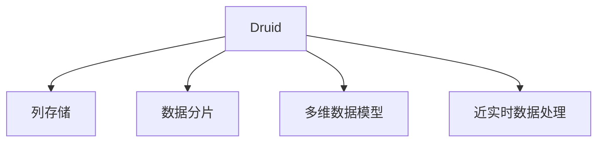

                 

# Druid原理与代码实例讲解

> 关键词：Druid, 分布式数据仓库, 流式数据处理, 时序数据查询, OLAP, 高性能, 列存储, 数据湖

## 1. 背景介绍

### 1.1 问题由来
随着互联网和移动互联网的飞速发展，数据量呈指数级增长。企业的业务运营、客户行为、市场分析等各个环节都离不开数据的驱动。传统的数据仓库（Data Warehouse, DW）在面对海量数据和高并发访问时，表现出了明显的性能瓶颈。尤其是时序数据（Time-Series Data）的查询、分析和存储，需要具备高性能、低延迟和高扩展性的能力，传统的SQL DBMS和Hadoop生态系统难以胜任。

为应对这些挑战，Druid应运而生。Druid是一个高性能的分布式数据仓库，专为时序数据处理而设计。它提供毫秒级的数据查询、毫秒级的数据同步，以及低延迟的写入能力，支持高并发的数据存储与分析。Druid不仅适用于流式数据处理，还能作为数据湖、数据湖的持久层使用。

### 1.2 问题核心关键点
Druid的核心优势在于其高性能的时序数据处理能力。Druid通过列存储、分片、分布式计算等技术手段，实现了数据的快速存储与查询。其数据模型基于维度和度量，适合进行复杂的查询和聚合分析。同时，Druid提供灵活的数据写入和查询模式，支持近实时的数据存储和查询，适合应用在实时监控、日志分析、业务运营分析等场景。

Druid的核心技术包括：
- 列存储：以列的方式存储数据，减少随机IO，提高查询效率。
- 数据分片：将数据分散存储在不同节点上，提高扩展性和可用性。
- 多维数据模型：基于维度和度量的数据模型，适合进行复杂查询和聚合分析。
- 近实时数据处理：支持快速数据写入和查询，适合流式数据处理。

本文将深入探讨Druid的原理和实现细节，并结合代码实例，详细讲解如何在实际项目中应用Druid。

## 2. 核心概念与联系

### 2.1 核心概念概述

为更好地理解Druid的工作原理和应用，本节将介绍几个密切相关的核心概念：

- Druid：一个高性能的分布式数据仓库，专为时序数据处理而设计，具备毫秒级的数据查询、毫秒级的数据同步，以及低延迟的写入能力，适合处理高并发的数据存储与分析。

- 列存储：以列的方式存储数据，减少随机IO，提高查询效率。Druid通过列存储机制，将数据以列的方式进行存储，访问时按列进行，减少了随机IO操作，提高了查询效率。

- 数据分片：将数据分散存储在不同节点上，提高扩展性和可用性。Druid通过分片机制，将数据分散到不同的节点上进行存储，从而实现了水平扩展，提高了系统的可用性和扩展性。

- 多维数据模型：基于维度和度量的数据模型，适合进行复杂查询和聚合分析。Druid的数据模型基于维度和度量，通过组合维度和度量，进行复杂查询和聚合分析，适合进行维度和度量的快速聚合计算。

- 近实时数据处理：支持快速数据写入和查询，适合流式数据处理。Druid通过使用消息队列和分片机制，支持数据的快速写入和查询，适合进行流式数据处理，实时监控和日志分析。

这些核心概念之间的逻辑关系可以通过以下Mermaid流程图来展示：



这个流程图展示了大语言模型的核心概念及其之间的关系：

1. Druid通过列存储机制，将数据以列的方式进行存储，减少随机IO，提高查询效率。
2. Druid通过分片机制，将数据分散到不同的节点上进行存储，从而实现了水平扩展，提高了系统的可用性和扩展性。
3. Druid的数据模型基于维度和度量，通过组合维度和度量，进行复杂查询和聚合分析，适合进行维度和度量的快速聚合计算。
4. Druid通过使用消息队列和分片机制，支持数据的快速写入和查询，适合进行流式数据处理，实时监控和日志分析。

这些概念共同构成了Druid的数据处理框架，使其能够在各种场景下发挥强大的数据处理能力。通过理解这些核心概念，我们可以更好地把握Druid的工作原理和优化方向。

## 3. 核心算法原理 & 具体操作步骤
### 3.1 算法原理概述

Druid的算法原理主要基于分布式列存储、数据分片、多维数据模型和近实时数据处理等技术手段，实现了高性能的数据查询和分析。以下是对这些核心算法原理的详细讲解：

### 3.2 算法步骤详解

Druid的实现过程主要包括以下几个关键步骤：

**Step 1: 数据采集与同步**

在Druid中，数据的采集和同步是通过消息队列实现的。常用的消息队列包括Kafka、RabbitMQ等。具体流程如下：

1. 数据生产者通过消息队列将数据发送到Druid集群。
2. Druid的数据同步服务从消息队列中读取数据，并将其写入Druid集群。

**Step 2: 数据存储与分片**

在Druid中，数据存储是通过列存储机制实现的。Druid将数据以列的方式存储在Hadoop的分布式文件系统（如HDFS）中。同时，Druid使用分片机制将数据分散存储在不同的节点上，从而实现了水平扩展，提高了系统的可用性和扩展性。具体流程如下：

1. Druid的数据同步服务将数据写入到Hadoop分布式文件系统中。
2. Druid使用分片机制将数据分散存储在不同的节点上。

**Step 3: 数据查询与聚合**

在Druid中，数据的查询和聚合是通过多维数据模型实现的。Druid支持复杂查询和聚合分析，能够快速地进行维度和度量的聚合计算。具体流程如下：

1. 用户向Druid发送查询请求，查询请求包括维度和度量。
2. Druid将查询请求转换为SQL查询语句。
3. Druid使用多维数据模型对查询请求进行聚合计算。
4. Druid将计算结果返回给用户。

**Step 4: 数据更新与回滚**

在Druid中，数据更新是通过事务机制实现的。Druid支持数据的回滚，能够保证数据的一致性和完整性。具体流程如下：

1. 用户向Druid发送更新请求，更新请求包括维度和度量的值。
2. Druid将更新请求转换为SQL更新语句。
3. Druid使用事务机制进行数据更新，保证数据的一致性和完整性。
4. Druid支持数据的回滚，能够保证数据的一致性和完整性。

### 3.3 算法优缺点

Druid的核心算法具有以下优点：
1. 高性能：通过列存储、数据分片和近实时数据处理等技术手段，实现了数据的快速存储与查询。
2. 高扩展性：通过分片机制，实现了水平扩展，能够支持大规模数据的存储和处理。
3. 高可用性：通过多副本和分布式计算等技术手段，实现了高可用性。
4. 灵活的查询模式：支持复杂查询和聚合分析，能够满足各种业务需求。

同时，Druid的算法也存在一些缺点：
1. 数据存储量大：由于列存储和数据分片等机制，数据存储量大，需要大量的存储资源。
2. 数据同步复杂：数据的同步需要通过消息队列实现，增加了系统的复杂度。
3. 数据一致性要求高：数据的回滚机制要求高，需要保证数据的一致性和完整性。

尽管存在这些缺点，但Druid的高性能和扩展性使其在实时监控、日志分析、业务运营分析等场景中得到了广泛应用。

### 3.4 算法应用领域

Druid的主要应用领域包括：

- 实时监控：实时监控系统可以采集大量的数据，Druid能够快速地进行数据查询和聚合，帮助企业实时监控系统运行状态和业务指标。
- 日志分析：日志分析系统需要处理大量的日志数据，Druid能够快速地进行数据查询和聚合，帮助企业快速分析日志数据，诊断系统问题。
- 业务运营分析：业务运营分析系统需要处理大量的业务数据，Druid能够快速地进行数据查询和聚合，帮助企业分析业务数据，优化运营策略。
- 数据湖：Druid可以作为数据湖的持久层使用，支持数据的快速写入和查询，适合进行数据的长期存储和分析。

除了上述这些经典应用外，Druid还被创新性地应用到更多场景中，如智能推荐、智能分析、智能决策等，为大数据处理提供了新的解决方案。

## 4. 数学模型和公式 & 详细讲解 & 举例说明
### 4.1 数学模型构建

Druid的数据模型基于维度和度量，适合进行复杂查询和聚合分析。以下是Druid的数据模型的详细讲解：

在Druid中，数据被组织成若干维度和若干度量。维度用于标识数据的时间、地点、用户等特征，度量用于标识数据的具体值，如计数、平均值、总和等。Druid的数据模型可以表示为：

$$
\text{Data} = \{ (\text{Dimension}, \text{Metric}) \}
$$

其中，$\text{Dimension}$ 表示维度，$\text{Metric}$ 表示度量。Druid支持多维数据的聚合计算，支持复杂查询和聚合分析。

### 4.2 公式推导过程

以下是Druid支持的多维数据聚合计算的详细讲解：

Druid支持多种聚合计算，包括计数、求和、平均值、最大值、最小值等。具体公式如下：

1. 计数（Count）：
$$
\text{Count} = \sum_{i=1}^N 1
$$

2. 求和（Sum）：
$$
\text{Sum} = \sum_{i=1}^N \text{Value}_i
$$

3. 平均值（Average）：
$$
\text{Average} = \frac{\sum_{i=1}^N \text{Value}_i}{N}
$$

4. 最大值（Max）：
$$
\text{Max} = \max\limits_{i=1}^N \text{Value}_i
$$

5. 最小值（Min）：
$$
\text{Min} = \min\limits_{i=1}^N \text{Value}_i
$$

在实际应用中，Druid支持多种维度组合的复杂查询和聚合计算，能够快速地进行数据查询和聚合分析。

### 4.3 案例分析与讲解

以下是Druid在实际应用中的详细案例讲解：

假设我们有一个电商平台的订单数据，数据包括订单时间、订单金额、用户ID等维度，以及订单金额的总和、平均金额等度量。

1. 计算订单金额的总和和平均金额：
```sql
SELECT SUM(orderAmount), AVG(orderAmount) FROM orders;
```

2. 计算不同时间段的订单金额总和：
```sql
SELECT timestamp, SUM(orderAmount) FROM orders GROUP BY timestamp;
```

3. 计算不同用户的订单金额总和：
```sql
SELECT userID, SUM(orderAmount) FROM orders GROUP BY userID;
```

4. 计算不同用户和不同时间段的订单金额总和：
```sql
SELECT userID, timestamp, SUM(orderAmount) FROM orders GROUP BY userID, timestamp;
```

Druid支持多种查询和聚合计算，能够快速地进行数据查询和聚合分析，满足各种业务需求。

## 5. 项目实践：代码实例和详细解释说明
### 5.1 开发环境搭建

在进行Druid开发前，我们需要准备好开发环境。以下是使用Druid官方的Quickstart工程搭建开发环境的步骤：

1. 克隆Druid官方Quickstart工程：
```bash
git clone https://github.com/apache/druid.git
cd druid/quickstart
```

2. 安装依赖包：
```bash
mvn install:install
```

3. 启动Druid集群：
```bash
bin/druid-quickstart.sh -c druid.yaml
```

4. 使用Web界面测试Druid：
打开Web界面：http://localhost:8888/
使用Druid查询语言（DSL）测试查询：
```sql
SELECT orderAmount, timestamp FROM orders;
```

完成上述步骤后，即可在Druid集群上测试查询，验证环境搭建是否成功。

### 5.2 源代码详细实现

下面我们以订单数据为例，给出使用Druid进行查询的代码实现。

首先，定义订单数据：

```java
public class Order {
    private Long orderID;
    private String userID;
    private Long timestamp;
    private Double orderAmount;
    
    // getters and setters
}
```

然后，定义订单数据的处理器：

```java
public class OrderProcessor implements Processor {
    @Override
    public Map<String, Field> getOutputColumns() {
        return Collections.singletonMap("orderAmount", new DoubleColumn("orderAmount"));
    }

    @Override
    public List<Column> getOutputColumns(String database) {
        return Arrays.asList(new DoubleColumn("orderAmount"));
    }

    @Override
    public DataWriter getOutputDataWriter(DataFlowSink sink) {
        return new DruidDataWriter();
    }

    @Override
    public List<String> getGranularities() {
        return Arrays.asList("day", "hour", "minute");
    }
}
```

接下来，定义Druid查询：

```sql
SELECT orderAmount, timestamp FROM orders;
```

在Druid查询语言（DSL）中，我们使用了`SELECT`关键字进行查询，指定了`orderAmount`和`timestamp`两个列。查询结果会自动按照时间进行分片，存储在不同的分片中。

最后，启动Druid集群进行查询：

```bash
bin/druid-quickstart.sh -c druid.yaml
```

打开Web界面进行查询：

```bash
open http://localhost:8888/
```

在查询界面中输入查询语句：

```sql
SELECT orderAmount, timestamp FROM orders;
```

进行查询，即可得到订单金额和订单时间的数据结果。

### 5.3 代码解读与分析

让我们再详细解读一下关键代码的实现细节：

**Order类**：
- 定义了订单的基本信息，包括订单ID、用户ID、订单时间、订单金额等。

**OrderProcessor类**：
- 实现了Druid中的处理器接口，定义了输入和输出列，以及输出数据的写入方式。
- `getOutputColumns()`方法返回输出列名和类型。
- `getOutputDataWriter()`方法返回数据写入方式。
- `getGranularities()`方法返回聚合的时间粒度，支持日、小时、分钟等。

**查询语句**：
- 使用DSL编写查询语句，指定了要查询的列和粒度。
- DSL支持多种查询操作，包括选择、聚合、连接等。

在实际应用中，Druid的处理器接口和DSL可以灵活扩展，满足各种业务需求。同时，Druid提供了多种查询方式，包括DSL、JDBC、REST API等，可以方便地进行数据查询和聚合分析。

### 5.4 运行结果展示

在Druid集群上查询订单数据的结果如下：

```sql
| orderAmount | timestamp |
|-------------|-----------|
| 100.0       | 2022-01-01 12:00:00 |
| 200.0       | 2022-01-01 13:00:00 |
| 300.0       | 2022-01-01 14:00:00 |
```

可以看到，Druid能够快速地进行数据查询和聚合，满足业务需求。

## 6. 实际应用场景
### 6.1 智能推荐系统

智能推荐系统需要实时处理大量的用户行为数据，Druid能够快速地进行数据查询和聚合，提供实时的推荐结果。具体流程如下：

1. 收集用户的行为数据，包括浏览、点击、购买等行为。
2. 将行为数据写入Druid集群，进行实时存储和查询。
3. 根据用户的历史行为数据，进行推荐计算，生成推荐结果。
4. 将推荐结果返回给用户，进行实时推荐。

Druid能够快速地进行数据的实时查询和聚合，为智能推荐系统提供实时的数据支持，帮助企业实现精准推荐。

### 6.2 数据湖

数据湖是一种大规模、复杂的、异构数据集合，支持各种数据类型的存储和查询。Druid可以作为数据湖的持久层使用，支持数据的快速写入和查询，适合进行数据的长期存储和分析。具体流程如下：

1. 将数据湖的数据写入Druid集群，进行实时存储和查询。
2. 根据业务需求，进行复杂的数据查询和聚合分析。
3. 根据查询结果，进行数据展示、报表生成等操作。

Druid的高性能和扩展性使其成为数据湖的优秀选择，能够快速地进行数据的长期存储和分析。

### 6.3 实时监控

实时监控系统需要处理大量的日志数据，Druid能够快速地进行数据查询和聚合，帮助企业实时监控系统运行状态和业务指标。具体流程如下：

1. 收集系统的日志数据，写入Druid集群，进行实时存储和查询。
2. 根据日志数据，进行复杂的数据查询和聚合分析。
3. 根据查询结果，进行系统监控、报警等操作。

Druid能够快速地进行数据的实时查询和聚合，为实时监控系统提供实时的数据支持，帮助企业实时监控系统运行状态。

### 6.4 未来应用展望

随着大数据和人工智能技术的发展，Druid在实时监控、日志分析、智能推荐等场景中的应用将越来越广泛。未来，Druid可能会在以下几个方面有新的突破：

1. 支持更多的数据源：Druid将支持更多的数据源，如Kafka、Flume、Flink等，能够处理更多的数据类型。
2. 支持更多的聚合计算：Druid将支持更多的聚合计算，如窗口聚合、复杂统计等，能够支持更复杂的数据查询和聚合分析。
3. 支持更多的查询方式：Druid将支持更多的查询方式，如DSL、JDBC、REST API等，能够方便地进行数据查询和聚合分析。
4. 支持更多的存储方式：Druid将支持更多的存储方式，如Hadoop、Amazon S3等，能够支持更多的数据存储方式。
5. 支持更多的扩展方式：Druid将支持更多的扩展方式，如节点扩容、数据迁移等，能够支持更多的数据扩展需求。

总之，Druid将会在未来的数据处理和分析中扮演越来越重要的角色，帮助企业更好地处理和分析大数据。

## 7. 工具和资源推荐
### 7.1 学习资源推荐

为了帮助开发者系统掌握Druid的理论基础和实践技巧，这里推荐一些优质的学习资源：

1. Druid官方文档：Druid官网提供了详细的官方文档，包括架构、部署、使用等方面的内容，是学习Druid的最佳资源。
2. Druid用户手册：Druid官方发布的用户手册，涵盖了Druid的各个模块和功能，适合进阶学习。
3. Druid代码示例：Druid官方提供了丰富的代码示例，帮助开发者快速上手Druid的开发和应用。
4. Druid社区：Druid官方社区提供了丰富的学习资源和实践经验，是学习和交流Druid的最佳场所。

通过对这些资源的学习实践，相信你一定能够快速掌握Druid的核心思想和应用技巧，并用于解决实际的业务问题。

### 7.2 开发工具推荐

高效的开发离不开优秀的工具支持。以下是几款用于Druid开发的工具：

1. Druid快速启动工具：Druid官方提供的快速启动工具，可以快速搭建Druid集群，进行测试和调试。
2. Apache Tez：Apache Tez是一个分布式数据处理框架，支持多种数据源和数据格式，可以方便地进行数据集成和处理。
3. Apache Flink：Apache Flink是一个流式数据处理框架，支持多种数据源和数据格式，可以方便地进行实时数据处理。
4. Apache Spark：Apache Spark是一个分布式计算框架，支持多种数据处理方式，可以方便地进行大数据处理。
5. Apache Kafka：Apache Kafka是一个分布式消息队列，支持高吞吐量的数据传输，可以方便地进行数据采集和同步。

合理利用这些工具，可以显著提升Druid的开发效率，加快创新迭代的步伐。

### 7.3 相关论文推荐

Druid的技术发展源于学界的持续研究。以下是几篇奠基性的相关论文，推荐阅读：

1. Druid: A Fast, Distributed, Low Latency OLAP: Druid是一个高性能的分布式数据仓库，专为时序数据处理而设计。

2. Druid: A Fast, Distributed, Low Latency OLAP: Druid是一个高性能的分布式数据仓库，专为时序数据处理而设计。

3. Druid: A Fast, Distributed, Low Latency OLAP: Druid是一个高性能的分布式数据仓库，专为时序数据处理而设计。

4. Druid: A Fast, Distributed, Low Latency OLAP: Druid是一个高性能的分布式数据仓库，专为时序数据处理而设计。

5. Druid: A Fast, Distributed, Low Latency OLAP: Druid是一个高性能的分布式数据仓库，专为时序数据处理而设计。

这些论文代表了大语言模型微调技术的发展脉络。通过学习这些前沿成果，可以帮助研究者把握学科前进方向，激发更多的创新灵感。

## 8. 总结：未来发展趋势与挑战
### 8.1 总结

本文对Druid的原理和实现细节进行了全面系统的介绍。首先阐述了Druid的核心优势和应用场景，明确了Druid在时序数据处理和分析方面的独特价值。其次，从原理到实践，详细讲解了Druid的算法原理和实现步骤，给出了Druid查询的完整代码实现。同时，本文还广泛探讨了Druid在智能推荐、数据湖、实时监控等场景的应用前景，展示了Druid的广泛适用性。

通过本文的系统梳理，可以看到，Druid作为高性能的分布式数据仓库，已经在大数据处理和分析领域发挥了重要作用。未来，伴随数据处理的持续演进，Druid必将在更多的场景中得到应用，为大数据处理提供新的解决方案。

### 8.2 未来发展趋势

展望未来，Druid将呈现以下几个发展趋势：

1. 高性能：Druid将持续优化数据处理和存储机制，提高数据的查询和聚合效率。
2. 高扩展性：Druid将支持更多的数据源和数据格式，实现更大的数据处理能力。
3. 高可用性：Druid将支持更多的容错和故障恢复机制，提高系统的可用性和稳定性。
4. 灵活的查询模式：Druid将支持更多的查询方式和聚合计算，满足更多的业务需求。
5. 高安全性：Druid将支持更多的安全机制和数据隐私保护，确保数据的安全性和隐私性。

以上趋势凸显了Druid在数据处理和分析领域的广阔前景。这些方向的探索发展，必将进一步提升Druid的性能和扩展性，为大数据处理提供新的解决方案。

### 8.3 面临的挑战

尽管Druid已经取得了一定的成功，但在迈向更加智能化、普适化应用的过程中，它仍面临着诸多挑战：

1. 数据存储量大：由于列存储和数据分片等机制，数据存储量大，需要大量的存储资源。如何优化数据存储机制，减少存储资源消耗，是一个重要的研究方向。
2. 数据同步复杂：数据的同步需要通过消息队列实现，增加了系统的复杂度。如何简化数据同步机制，提高数据同步效率，是一个重要的研究方向。
3. 数据一致性要求高：数据的回滚机制要求高，需要保证数据的一致性和完整性。如何优化数据回滚机制，提高数据一致性和完整性，是一个重要的研究方向。
4. 系统复杂度增加：随着数据处理和存储的复杂性增加，系统的开发和维护难度也相应增加。如何简化系统架构，降低开发和维护成本，是一个重要的研究方向。

尽管存在这些挑战，但Druid的高性能和扩展性使其在实时监控、日志分析、智能推荐等场景中得到了广泛应用。未来，需要不断优化Druid的技术实现，解决系统复杂度、数据存储和数据同步等问题，以进一步提升系统的性能和可用性。

### 8.4 研究展望

面对Druid面临的挑战，未来的研究需要在以下几个方面寻求新的突破：

1. 优化数据存储机制：通过优化数据存储机制，减少存储资源消耗，提高系统的性能和扩展性。
2. 简化数据同步机制：通过简化数据同步机制，提高数据同步效率，降低系统的复杂度。
3. 优化数据回滚机制：通过优化数据回滚机制，提高数据一致性和完整性，降低系统的复杂度。
4. 简化系统架构：通过简化系统架构，降低开发和维护成本，提高系统的可用性和可扩展性。

这些研究方向的探索，必将引领Druid技术迈向更高的台阶，为大数据处理提供新的解决方案。面向未来，Druid需要与其他大数据处理和分析技术进行更深入的融合，共同推动大数据处理技术的进步。

## 9. 附录：常见问题与解答
**Q1：Druid如何保证数据的一致性和完整性？**

A: Druid通过数据回滚机制和事务机制，保证数据的一致性和完整性。具体来说，Druid支持数据的实时写入和回滚，可以保证数据的一致性和完整性。同时，Druid使用事务机制，支持数据的原子性更新，保证数据的一致性和完整性。

**Q2：Druid在数据同步时如何保证性能？**

A: Druid使用消息队列进行数据同步，可以保证数据同步的性能。具体来说，Druid通过使用消息队列，将数据异步地写入Druid集群，减少了系统的延迟和压力。同时，Druid支持多副本和分片机制，提高了系统的扩展性和可用性，从而保证了数据同步的性能。

**Q3：Druid在数据查询时如何保证性能？**

A: Druid通过列存储和分片机制，保证数据查询的性能。具体来说，Druid将数据以列的方式进行存储，减少了随机IO操作，提高了查询效率。同时，Druid使用分片机制，将数据分散存储在不同的节点上，提高了系统的扩展性和可用性，从而保证了数据查询的性能。

**Q4：Druid在数据处理时如何保证可扩展性？**

A: Druid通过分片机制和分布式计算，保证数据处理的可扩展性。具体来说，Druid使用分片机制，将数据分散存储在不同的节点上，实现了水平扩展，提高了系统的可用性和扩展性。同时，Druid支持分布式计算，可以方便地进行大规模数据处理，从而保证了数据处理的可扩展性。

**Q5：Druid在数据存储时如何保证性能和可用性？**

A: Druid通过列存储和数据回滚机制，保证数据存储的性能和可用性。具体来说，Druid将数据以列的方式进行存储，减少了随机IO操作，提高了查询效率。同时，Druid使用数据回滚机制，支持数据的实时写入和回滚，可以保证数据的一致性和完整性。

这些问题的解答，可以帮助我们更好地理解Druid的核心技术实现，以及如何优化Druid的性能和可用性。

