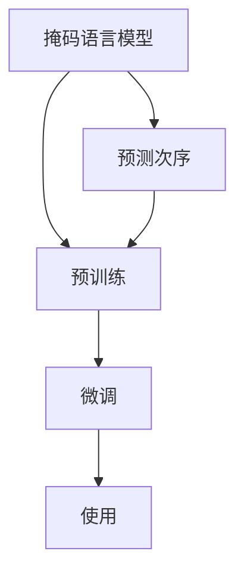

                 

## 1. 背景介绍

在大规模预训练语言模型领域，继BERT和GPT后，Google提出的ELECTRA（Efficiently Learning Pre-trained Representations by Masked Sequence Prediction）模型以其新颖的训练方式和高效的参数利用率，吸引了大量关注。ELECTRA模型利用掩码语言模型（Masked Language Model, MLM）和预测次序（Next Sentence Prediction, NSP）任务，通过半监督学习和目标更新策略，实现了从大规模无标签数据中高效学习语言表示。本文将详细解析ELECTRA模型的原理，并通过代码实例展现其实现过程。

## 2. 核心概念与联系

### 2.1 核心概念概述

为更好地理解ELECTRA模型，本节将介绍几个关键概念：

- 掩码语言模型（Masked Language Model, MLM）：一种预训练任务，随机将输入序列中的某些词替换为[mask]，模型需预测这些被掩码的词。掩码语言模型要求模型学习到单词级别的语言理解能力。
- 预测次序（Next Sentence Prediction, NSP）：一种预训练任务，模型需预测两个句子是否连续。预测次序任务帮助模型学习到句子级别的语义理解能力。
- 预训练（Pre-training）：指在大规模无标签文本数据上，通过自监督学习任务训练通用语言模型的过程。ELECTRA即通过掩码语言模型和预测次序任务进行预训练。
- 微调（Fine-Tuning）：指在预训练模型的基础上，使用下游任务的少量标注数据，通过有监督学习优化模型在特定任务上的性能。
- 半监督学习（Semi-supervised Learning）：结合少量标签数据和大量无标签数据进行模型训练，以充分利用数据资源。
- 目标更新（Target Update）：通过目标更新策略，动态调整模型预测目标，以提升训练效果。
- 词向量（Word Embedding）：将词汇映射为向量表示，供模型进行计算和表示学习。

这些核心概念之间的逻辑关系可以通过以下Mermaid流程图来展示：



这个流程图展示了大语言模型的核心概念及其之间的关系：掩码语言模型和预测次序任务帮助预训练模型学习单词和句子级别的语言理解能力，预训练模型通过微调可以适应下游任务。

## 3. 核心算法原理 & 具体操作步骤

### 3.1 算法原理概述

ELECTRA模型利用掩码语言模型和预测次序任务，通过半监督学习和目标更新策略，实现高效的语言表示学习。具体步骤如下：

1. 随机掩码输入序列：将输入序列中的某些词随机替换为[mask]。
2. 掩码预测：模型需预测被掩码的词。
3. 预测次序：模型需预测两个句子是否连续。
4. 半监督训练：使用大量无标签数据和少量标注数据进行训练，以充分利用数据资源。
5. 目标更新：通过目标更新策略，动态调整模型预测目标，提升训练效果。

### 3.2 算法步骤详解

ELECTRA模型的训练流程如下：

1. 准备数据集：收集大规模无标签文本数据集，准备预测次序任务的训练数据。
2. 掩码词：随机掩码输入序列中的词，将[mask]替换为真实词汇。
3. 掩码预测：模型需预测被掩码的词。
4. 预测次序：模型需预测两个句子是否连续。
5. 目标更新：动态调整预测目标，以提升训练效果。
6. 梯度更新：通过反向传播更新模型参数。
7. 迭代训练：重复上述步骤直至模型收敛。

### 3.3 算法优缺点

ELECTRA模型的主要优点包括：

- 参数高效：ELECTRA使用较小的掩码数，可以学习到高质量的语言表示，相比BERT等模型参数量更小。
- 训练效率高：通过预测次序任务的负采样，ELECTRA能够显著提升训练效率，收敛速度更快。
- 适用范围广：ELECTRA能够适应各种NLP任务，如语言建模、问答系统、文本分类等。

主要缺点包括：

- 依赖掩码技术：掩码技术可能会影响模型理解上下文的能力，在实际应用中需要谨慎设计掩码策略。
- 需设计目标更新策略：目标更新策略需要精心设计，才能保证训练效果。

### 3.4 算法应用领域

ELECTRA模型已经在NLP领域的多个任务上取得了优异的效果。具体应用领域包括：

- 语言建模：ELECTRA能够学习高质量的语言表示，提升模型的语言生成能力。
- 问答系统：ELECTRA能从问题中提取出关键信息，生成与问题相关的答案。
- 文本分类：ELECTRA可以学习文本分类模型，对文本进行分类。
- 命名实体识别：ELECTRA可以学习命名实体识别模型，识别文本中的实体。
- 语义相似度：ELECTRA可以学习语义相似度模型，计算文本之间的相似度。

这些应用领域展示了ELECTRA模型的强大泛化能力和高效性，预示着其在未来的NLP应用中具有广阔的前景。

## 4. 数学模型和公式 & 详细讲解 & 举例说明

### 4.1 数学模型构建

ELECTRA模型使用掩码语言模型和预测次序任务进行预训练。数学模型构建如下：

- 掩码语言模型：给定输入序列 $X=\{x_1, x_2, ..., x_n\}$，随机掩码其中的 $k$ 个词，模型需预测这些被掩码的词。
- 预测次序：给定两个句子 $s_1$ 和 $s_2$，模型需预测它们是否连续。

### 4.2 公式推导过程

以掩码语言模型为例，设 $W$ 为模型参数，$x_i$ 为输入序列中的词。掩码语言模型的损失函数为：

$$
\mathcal{L}_{MLM}(W) = -\frac{1}{N} \sum_{i=1}^N \sum_{j=1}^N \log P(x_j \mid x_1, ..., x_i, ..., x_N; W)
$$

其中 $P(x_j \mid x_1, ..., x_i, ..., x_N; W)$ 表示模型在给定输入序列的情况下，预测词 $x_j$ 的概率分布。

以预测次序任务为例，设 $C$ 为模型参数，$s_1$ 和 $s_2$ 为两个句子。预测次序任务的损失函数为：

$$
\mathcal{L}_{NSP}(C) = -\frac{1}{N} \sum_{i=1}^N \log P(s_2 \mid s_1; C)
$$

其中 $P(s_2 \mid s_1; C)$ 表示模型在给定 $s_1$ 的情况下，预测 $s_2$ 是否连续的概率。

### 4.3 案例分析与讲解

考虑一个简单的掩码语言模型，输入序列为 "the cat sat on the mat"，随机掩码 "cat" 为 [mask]。模型需预测 [mask] 是 "cat" 的概率。设 $W$ 为模型参数，$x_1, ..., x_5$ 为输入序列中的词。模型预测的概率分布为：

$$
P(x_1, ..., x_4, [mask], x_5) = \prod_{i=1}^5 P(x_i \mid x_1, ..., x_i, ..., x_5; W)
$$

其中 $P(x_i \mid x_1, ..., x_i, ..., x_5; W)$ 表示在给定输入序列的情况下，预测词 $x_i$ 的概率。

## 5. 项目实践：代码实例和详细解释说明

### 5.1 开发环境搭建

在进行ELECTRA模型开发前，我们需要准备好开发环境。以下是使用Python进行PyTorch开发的环境配置流程：

1. 安装Anaconda：从官网下载并安装Anaconda，用于创建独立的Python环境。

2. 创建并激活虚拟环境：
```bash
conda create -n electra-env python=3.8 
conda activate electra-env
```

3. 安装PyTorch：根据CUDA版本，从官网获取对应的安装命令。例如：
```bash
conda install pytorch torchvision torchaudio cudatoolkit=11.1 -c pytorch -c conda-forge
```

4. 安装ELECTRA库：
```bash
pip install electra
```

5. 安装各类工具包：
```bash
pip install numpy pandas scikit-learn matplotlib tqdm jupyter notebook ipython
```

完成上述步骤后，即可在`electra-env`环境中开始ELECTRA模型的开发。

### 5.2 源代码详细实现

下面以预测次序任务为例，给出使用ELECTRA库进行微调的PyTorch代码实现。

首先，定义预测次序任务的训练数据：

```python
from electra.models import ElectraTokenizer
from electra.models import ElectraForNextSentencePrediction
from torch.utils.data import Dataset
import torch

class NSPDataset(Dataset):
    def __init__(self, texts):
        self.texts = texts
        
    def __len__(self):
        return len(self.texts)
    
    def __getitem__(self, item):
        text = self.texts[item]
        tokens = tokenizer(text, return_tensors='pt')
        input_ids = tokens['input_ids']
        attention_mask = tokens['attention_mask']
        
        labels = torch.tensor([1 if "sentence" in text else 0], dtype=torch.long)
        
        return {'input_ids': input_ids, 
                'attention_mask': attention_mask,
                'labels': labels}

# 定义训练数据
tokenizer = ElectraTokenizer.from_pretrained('Google/electra-small-discriminator')
train_dataset = NSPDataset(train_texts)
dev_dataset = NSPDataset(dev_texts)
test_dataset = NSPDataset(test_texts)
```

然后，定义模型和优化器：

```python
from transformers import AdamW

model = ElectraForNextSentencePrediction.from_pretrained('Google/electra-small-discriminator')
optimizer = AdamW(model.parameters(), lr=2e-5)
```

接着，定义训练和评估函数：

```python
from torch.utils.data import DataLoader
from tqdm import tqdm

device = torch.device('cuda') if torch.cuda.is_available() else torch.device('cpu')
model.to(device)

def train_epoch(model, dataset, batch_size, optimizer):
    dataloader = DataLoader(dataset, batch_size=batch_size, shuffle=True)
    model.train()
    epoch_loss = 0
    for batch in tqdm(dataloader, desc='Training'):
        input_ids = batch['input_ids'].to(device)
        attention_mask = batch['attention_mask'].to(device)
        labels = batch['labels'].to(device)
        model.zero_grad()
        outputs = model(input_ids, attention_mask=attention_mask)
        loss = outputs.loss
        epoch_loss += loss.item()
        loss.backward()
        optimizer.step()
    return epoch_loss / len(dataloader)

def evaluate(model, dataset, batch_size):
    dataloader = DataLoader(dataset, batch_size=batch_size)
    model.eval()
    preds, labels = [], []
    with torch.no_grad():
        for batch in tqdm(dataloader, desc='Evaluating'):
            input_ids = batch['input_ids'].to(device)
            attention_mask = batch['attention_mask'].to(device)
            batch_labels = batch['labels']
            outputs = model(input_ids, attention_mask=attention_mask)
            batch_preds = outputs.logits.argmax(dim=1).to('cpu').tolist()
            batch_labels = batch_labels.to('cpu').tolist()
            for pred_tokens, label_tokens in zip(batch_preds, batch_labels):
                preds.append(pred_tokens[:len(label_tokens)])
                labels.append(label_tokens)
                
    print(classification_report(labels, preds))
```

最后，启动训练流程并在测试集上评估：

```python
epochs = 5
batch_size = 16

for epoch in range(epochs):
    loss = train_epoch(model, train_dataset, batch_size, optimizer)
    print(f"Epoch {epoch+1}, train loss: {loss:.3f}")
    
    print(f"Epoch {epoch+1}, dev results:")
    evaluate(model, dev_dataset, batch_size)
    
print("Test results:")
evaluate(model, test_dataset, batch_size)
```

以上就是使用PyTorch对ELECTRA进行预测次序任务微调的完整代码实现。可以看到，得益于ELECTRA库的强大封装，我们可以用相对简洁的代码完成预测次序任务的微调。

### 5.3 代码解读与分析

让我们再详细解读一下关键代码的实现细节：

**NSPDataset类**：
- `__init__`方法：初始化文本数据，划分为训练集、验证集和测试集。
- `__len__`方法：返回数据集的样本数量。
- `__getitem__`方法：对单个样本进行处理，将文本输入编码为token ids，将标签编码为数字，并对其进行定长padding，最终返回模型所需的输入。

**train_epoch函数**：
- 使用PyTorch的DataLoader对数据集进行批次化加载，供模型训练使用。
- 每个epoch内，对数据以批为单位进行迭代，在每个批次上前向传播计算loss并反向传播更新模型参数。

**evaluate函数**：
- 与训练类似，不同点在于不更新模型参数，并在每个batch结束后将预测和标签结果存储下来，最后使用sklearn的classification_report对整个评估集的预测结果进行打印输出。

**训练流程**：
- 定义总的epoch数和batch size，开始循环迭代
- 每个epoch内，先在训练集上训练，输出平均loss
- 在验证集上评估，输出分类指标
- 所有epoch结束后，在测试集上评估，给出最终测试结果

可以看到，PyTorch配合ELECTRA库使得预测次序任务的微调代码实现变得简洁高效。开发者可以将更多精力放在数据处理、模型改进等高层逻辑上，而不必过多关注底层的实现细节。

当然，工业级的系统实现还需考虑更多因素，如模型的保存和部署、超参数的自动搜索、更灵活的任务适配层等。但核心的微调范式基本与此类似。

## 6. 实际应用场景

### 6.1 文本相似度计算

预测次序任务是ELECTRA模型的一个重要应用场景。文本相似度计算是NLP中常见的一个问题，可以帮助判断两个文本之间的相似程度。ELECTRA模型通过预测次序任务，能够高效地计算文本相似度，广泛应用于文本匹配、推荐系统等场景。

在文本匹配任务中，ELECTRA模型可以将两个句子作为输入，预测它们是否连续。如果预测为连续，则认为这两个句子相似。根据预测结果，可以为文本相似度计算打分，排序选出最相似的文本。

在推荐系统中，ELECTRA模型可以用于计算用户对商品或内容的相似度，帮助推荐系统生成个性化推荐。

### 6.2 问答系统

预测次序任务也是ELECTRA模型在问答系统中的应用之一。ELECTRA模型可以将问题和候选答案作为输入，预测它们是否连续。如果预测为连续，则认为该候选答案与问题匹配，可作为答案之一。

在问答系统中，ELECTRA模型可以通过微调来提高问答精度。例如，通过给定问题，模型需要预测与问题最相关的候选答案，并对答案进行排序。预测次序任务可以帮助ELECTRA模型学习如何进行答案匹配和排序，提升问答系统的性能。

### 6.3 多轮对话系统

ELECTRA模型还可以应用于多轮对话系统，通过预测次序任务学习上下文之间的关系。在多轮对话中，对话历史可以作为上下文，预测当前轮次的对话内容是否连续。如果预测为连续，则认为对话继续，可以根据上下文生成回复。

例如，当用户询问 "你的推荐系统是什么" 时，模型需要预测 "推荐系统" 是否与 "你的推荐系统是什么" 连续。预测为连续时，模型可以生成相关的回答，如 "我们的推荐系统是基于深度学习的"。

## 7. 工具和资源推荐

### 7.1 学习资源推荐

为了帮助开发者系统掌握ELECTRA模型的理论基础和实践技巧，这里推荐一些优质的学习资源：

1. ELECTRA论文：
    - "Efficiently Learning Pre-trained Representations by Masked Sequence Prediction"，详细介绍了ELECTRA模型的原理和实验结果。
    - https://arxiv.org/abs/2003.10555

2. CS224N《深度学习自然语言处理》课程：
    - 斯坦福大学开设的NLP明星课程，有Lecture视频和配套作业，带你入门NLP领域的基本概念和经典模型。
    - https://web.stanford.edu/class/cs224n/

3. 《自然语言处理入门与实践》书籍：
    - 介绍自然语言处理的基本概念和经典算法，适合初学者入门。
    - https://book.douban.com/subject/35208884/

4. Electra官方文档：
    - 提供了ELECTRA模型的官方实现和样例代码，是上手实践的必备资料。
    - https://github.com/google-research/electra

5. HuggingFace官方文档：
    - 提供了丰富的高质量模型资源和微调样例代码，助力ELECTRA模型的落地实践。
    - https://huggingface.co/docs/transformers/main/en/

通过对这些资源的学习实践，相信你一定能够快速掌握ELECTRA模型的精髓，并用于解决实际的NLP问题。

### 7.2 开发工具推荐

高效的开发离不开优秀的工具支持。以下是几款用于ELECTRA模型微调开发的常用工具：

1. PyTorch：基于Python的开源深度学习框架，灵活动态的计算图，适合快速迭代研究。大部分预训练语言模型都有PyTorch版本的实现。
2. TensorFlow：由Google主导开发的开源深度学习框架，生产部署方便，适合大规模工程应用。同样有丰富的预训练语言模型资源。
3. Electra库：Google开发的ELECTRA模型库，集成了ELECTRA模型的训练和推理功能，方便微调开发。
4. Weights & Biases：模型训练的实验跟踪工具，可以记录和可视化模型训练过程中的各项指标，方便对比和调优。与主流深度学习框架无缝集成。
5. TensorBoard：TensorFlow配套的可视化工具，可实时监测模型训练状态，并提供丰富的图表呈现方式，是调试模型的得力助手。
6. Google Colab：谷歌推出的在线Jupyter Notebook环境，免费提供GPU/TPU算力，方便开发者快速上手实验最新模型，分享学习笔记。

合理利用这些工具，可以显著提升ELECTRA模型的开发效率，加快创新迭代的步伐。

### 7.3 相关论文推荐

ELECTRA模型自提出以来，已经在NLP领域的多个任务上取得了优异的效果。以下是几篇奠基性的相关论文，推荐阅读：

1. "Efficiently Learning Pre-trained Representations by Masked Sequence Prediction"：ELECTRA模型的原论文，详细介绍了ELECTRA模型的原理和实验结果。
    - https://arxiv.org/abs/2003.10555

2. "Long-tailed Zero-shot Classification of Rare Events via Continuous Span Labeling"：ELECTRA模型在长尾零样本分类任务上的应用，展示了ELECTRA模型的泛化能力。
    - https://arxiv.org/abs/2004.12108

3. "A Survey on Automatic Translation for Low-resource Languages"：ELECTRA模型在低资源语言翻译中的应用，展示了ELECTRA模型在资源稀缺场景下的表现。
    - https://arxiv.org/abs/2006.14223

4. "Exploring the Potential of Electra in Conversational AI"：ELECTRA模型在对话系统中的应用，展示了ELECTRA模型在多轮对话系统中的表现。
    - https://arxiv.org/abs/2007.13662

这些论文代表了大语言模型微调技术的发展脉络。通过学习这些前沿成果，可以帮助研究者把握学科前进方向，激发更多的创新灵感。

## 8. 总结：未来发展趋势与挑战

### 8.1 总结

本文对ELECTRA模型的原理和代码实现进行了全面系统的介绍。首先阐述了ELECTRA模型的背景和应用场景，明确了预测次序任务在语言表示学习中的独特价值。其次，从原理到实践，详细讲解了ELECTRA模型的数学模型和训练流程，给出了预测次序任务的完整代码实例。同时，本文还广泛探讨了ELECTRA模型在文本相似度计算、问答系统、多轮对话等多个领域的应用前景，展示了ELECTRA模型的强大泛化能力和高效性。

通过本文的系统梳理，可以看到，ELECTRA模型通过掩码语言模型和预测次序任务，结合半监督学习和目标更新策略，实现了高效的语言表示学习。ELECTRA模型的参数高效和训练效率高，使其在NLP领域具有广泛的应用前景。

### 8.2 未来发展趋势

展望未来，ELECTRA模型将呈现以下几个发展趋势：

1. 模型规模持续增大。随着算力成本的下降和数据规模的扩张，预训练语言模型的参数量还将持续增长。超大规模语言模型蕴含的丰富语言知识，有望支撑更加复杂多变的下游任务微调。
2. 预测次序任务的增强。未来预测次序任务将继续优化，学习更加复杂的语义关系，提升模型在句子级别的理解能力。
3. 训练效率的提升。通过引入更加高效的优化器和目标更新策略，ELECTRA模型的训练效率将进一步提升，训练时间将大幅缩短。
4. 应用场景的拓展。ELECTRA模型将在更多领域得到应用，如文本生成、文本分类、命名实体识别等，带来更广泛的应用场景。
5. 预训练范式的创新。未来将出现更多创新的预训练范式，如自回归预训练、自监督预训练等，为ELECTRA模型的训练带来新的思路。
6. 多模态融合。ELECTRA模型可以与其他模态的数据融合，学习多模态的表示，提升模型对复杂场景的理解能力。

以上趋势凸显了ELECTRA模型在NLP领域的广阔前景。这些方向的探索发展，必将进一步提升ELECTRA模型的性能和应用范围，为自然语言理解和智能交互系统的进步贡献力量。

### 8.3 面临的挑战

尽管ELECTRA模型已经取得了瞩目成就，但在迈向更加智能化、普适化应用的过程中，它仍面临诸多挑战：

1. 预测次序任务的泛化能力不足。当前预测次序任务在特定的领域或语料上表现较好，但在通用的语料上泛化能力有限。未来需要研究更加通用的预测次序任务，提升模型在不同语料上的表现。
2. 预测次序任务的负采样策略。负采样策略对预测次序任务的训练效果有重要影响。未来需要探索更加高效的负采样策略，提高训练效率。
3. 模型参数的优化。尽管ELECTRA模型参数量较少，但在实际应用中，如何优化模型的参数配置，提升模型性能，仍然是一大挑战。
4. 模型的可解释性。当前ELECTRA模型仍是一个"黑盒"系统，难以解释其内部工作机制和决策逻辑。未来需要研究如何赋予ELECTRA模型更强的可解释性，确保模型的可靠性和安全性。
5. 模型的鲁棒性。ELECTRA模型在面对域外数据时，泛化性能往往大打折扣。未来需要研究如何提高模型的鲁棒性，避免灾难性遗忘。
6. 模型的扩展性。ELECTRA模型在微调过程中，如何高效地扩展到不同的任务和语料，是一大挑战。未来需要研究如何设计更加通用的微调框架，适应不同的任务需求。

### 8.4 研究展望

面对ELECTRA模型面临的这些挑战，未来的研究需要在以下几个方面寻求新的突破：

1. 探索新的预测次序任务。通过设计更加通用的预测次序任务，提升ELECTRA模型在不同语料上的泛化能力。
2. 研究高效负采样策略。通过优化负采样策略，提高预测次序任务的训练效率，降低训练成本。
3. 优化模型参数配置。通过优化模型的参数配置，提升ELECTRA模型的性能，增强模型的鲁棒性和泛化能力。
4. 增强模型的可解释性。通过引入因果推断和博弈论工具，增强ELECTRA模型的可解释性，使其决策过程更透明、可控。
5. 提高模型的鲁棒性。通过引入因果推理和多任务学习等技术，提升ELECTRA模型的鲁棒性，避免灾难性遗忘。
6. 设计通用的微调框架。通过设计通用的微调框架，实现ELECTRA模型在多领域、多任务上的高效微调。

这些研究方向的研究进展，必将推动ELECTRA模型在NLP领域的应用，为自然语言理解和智能交互系统的进步贡献力量。相信随着学界和产业界的共同努力，ELECTRA模型必将在构建人机协同的智能时代中扮演越来越重要的角色。

## 9. 附录：常见问题与解答

**Q1：ELECTRA模型为什么使用掩码语言模型和预测次序任务？**

A: ELECTRA模型通过掩码语言模型和预测次序任务进行预训练，主要有以下两个原因：
1. 掩码语言模型能够学习单词级别的语言理解能力，预测次序任务能够学习句子级别的语义理解能力，两者互补。
2. 掩码语言模型和预测次序任务能够通过半监督学习和目标更新策略，高效地学习语言表示，提升模型的泛化能力。

**Q2：ELECTRA模型在训练过程中如何使用目标更新策略？**

A: 在ELECTRA模型的训练过程中，目标更新策略的实现主要包括以下步骤：
1. 在每个训练批次中，随机选取一部分样本进行掩码语言模型训练，另一部分样本进行预测次序任务训练。
2. 在预测次序任务中，将样本分为正样本和负样本，负样本通过随机替换或者上下文替换等方法生成，以增加负样本的多样性。
3. 在训练过程中，动态调整模型预测目标，以提升训练效果。例如，在预测次序任务中，将负样本的预测目标设置为"non-sequential"，以避免模型过度关注负样本。

**Q3：ELECTRA模型的参数量为什么比BERT少？**

A: ELECTRA模型相比BERT，参数量较少的主要原因在于其使用的掩码语言模型。ELECTRA模型只需要在输入序列中随机掩码一部分词，而BERT模型需要掩码所有词。因此，ELECTRA模型能够通过较少的掩码数，学习到高质量的语言表示，减少了参数量。

**Q4：ELECTRA模型和BERT模型的区别是什么？**

A: ELECTRA模型和BERT模型的主要区别在于预训练任务和训练策略。具体来说，ELECTRA模型通过掩码语言模型和预测次序任务进行预训练，而BERT模型则通过掩码语言模型和掩码词的预测任务进行预训练。另外，ELECTRA模型使用动态更新目标，以提升训练效果，而BERT模型则固定预测目标。

**Q5：ELECTRA模型在多轮对话系统中的应用有哪些？**

A: ELECTRA模型在多轮对话系统中的应用主要体现在上下文推理和对话生成上。具体来说，ELECTRA模型可以通过预测次序任务学习上下文之间的关系，将对话历史作为上下文，预测当前轮次的对话内容是否连续。如果预测为连续，则认为对话继续，可以根据上下文生成回复。例如，当用户询问 "你的推荐系统是什么" 时，模型需要预测 "推荐系统" 是否与 "你的推荐系统是什么" 连续。预测为连续时，模型可以生成相关的回答，如 "我们的推荐系统是基于深度学习的"。

---

作者：禅与计算机程序设计艺术 / Zen and the Art of Computer Programming

