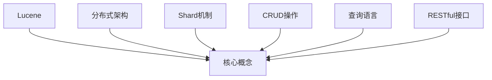

                 

## 1. 背景介绍

### 1.1 问题由来
ElasticSearch是一个基于Lucene的分布式全文搜索引擎，提供高可靠、可扩展的搜索和分析能力，支持CRUD操作，广泛应用于电商、社交、教育、医疗等领域。

### 1.2 问题核心关键点
本节将介绍ElasticSearch的核心概念、原理及其与Lucene的关系，详细解释其分布式架构与集群管理机制，并对常用的CRUD操作、全文索引和查询语言进行概述。

### 1.3 问题研究意义
掌握ElasticSearch的工作原理和实践方法，对于提高搜索和数据分析效率，构建高效、稳定的搜索服务具有重要意义。ElasticSearch不仅适用于大规模数据处理，而且对于解决实际应用中的查询延迟、数据一致性等问题具有独到的优势。

## 2. 核心概念与联系

### 2.1 核心概念概述
ElasticSearch利用Lucene进行文本处理和索引，通过分布式架构和Shard机制保证数据可靠性与性能，采用CRUD操作实现数据的增删改查，并支持RESTful接口与丰富的查询语言，提供强大的搜索和分析能力。

### 2.2 核心概念原理和架构的 Mermaid 流程图



这个流程图展示了ElasticSearch的主要概念及其相互关系：

- **B：Lucene**：ElasticSearch的搜索引擎核心，提供全文索引、分析、查询等基本功能。
- **C：分布式架构**：通过节点集群和Shard机制，实现数据的分布式存储与访问。
- **D：Shard机制**：将文档分为多个Shard，并分布在不同的节点上，提升查询性能和扩展性。
- **E：CRUD操作**：提供基本的增删改查接口，实现对数据的快速访问。
- **F：查询语言**：支持复杂的查询条件和聚合操作，提高搜索和分析效率。
- **G：RESTful接口**：基于HTTP协议，提供简单易用的RESTful接口，方便API集成。

## 3. 核心算法原理 & 具体操作步骤

### 3.1 算法原理概述
ElasticSearch基于Lucene实现全文索引，利用分布式架构和Shard机制，通过CRUD操作和查询语言，提供高效的搜索和分析能力。其核心算法包括倒排索引、分词与分析、分布式同步等。

### 3.2 算法步骤详解
1. **索引构建**：将文档转换为倒排索引格式，存储在ElasticSearch的Shard中。
2. **分词与分析**：利用ElasticSearch的分词器对文档进行分词和词性标注，构建词汇表和逆向词汇表。
3. **分布式同步**：通过主从复制、ZooKeeper协调等机制，实现集群中各节点数据的同步更新。
4. **查询执行**：根据查询条件，利用倒排索引和聚合操作，快速找到相关文档并返回结果。

### 3.3 算法优缺点
ElasticSearch的优点包括：
- 强大的查询和分析功能，支持复杂的查询和聚合操作。
- 基于Lucene的深度集成，利用Lucene的算法优化性能。
- 分布式架构，通过Shard和复制机制实现高可靠和高性能。

其缺点包括：
- 对硬件要求较高，需要高性能的CPU和内存。
- 配置和管理复杂，需要较高的运维水平。
- 成本较高，需要购买商业版才能获得完整的商业支持和插件。

### 3.4 算法应用领域
ElasticSearch主要应用于以下领域：
- 电商搜索：商品检索、用户评论分析、推荐系统等。
- 社交媒体：用户动态检索、用户画像分析、情感分析等。
- 医疗健康：病历检索、基因数据查询、患者信息管理等。
- 教育培训：课程检索、学生行为分析、智能推荐等。

## 4. 数学模型和公式 & 详细讲解 & 举例说明

### 4.1 数学模型构建
ElasticSearch的数学模型主要包括以下几个部分：
- **倒排索引(Inverted Index)**：存储词与文档ID的映射关系，用于快速定位相关文档。
- **词频统计(Term Frequency, TF)**：计算文档中每个词的频率，用于计算词的权重。
- **文档长度归一化(Document Length Normalization, DLS)**：对文档长度进行归一化处理，确保不同长度文档的权重一致。
- **布尔模型(Boolean Model)**：基于布尔运算的查询模型，支持精确匹配。

### 4.2 公式推导过程
以布尔模型为例，假设查询条件为$q=(q_1 \text{ AND } q_2)$，则其布尔运算结果如下：
$$
(q_1 \text{ AND } q_2) \rightarrow q_1 \cap q_2
$$
将$q_1$和$q_2$分别进行倒排索引查询，然后将结果取交集，即可得到最终查询结果。

### 4.3 案例分析与讲解
假设有一个包含10万个文档的索引库，我们需要查询标题包含“机器学习”的文档。首先，构建倒排索引，将每个文档的标题进行分词，并统计每个词的出现频率。然后，使用布尔模型进行查询，将查询条件分解为多个单查询条件，如$q_1=$标题包含“机器学习”，$q_2=$作者为“李明”。最后，将查询条件$q_1$和$q_2$的倒排索引结果取交集，即可得到最终结果。

## 5. 项目实践：代码实例和详细解释说明

### 5.1 开发环境搭建
1. 安装Java环境：下载JDK 8或更高版本，并配置环境变量。
2. 安装ElasticSearch：从官网下载ElasticSearch安装包，解压并启动集群。
3. 安装Kibana：下载并安装Kibana，启动可视化仪表盘服务。

### 5.2 源代码详细实现
```java
import org.elasticsearch.action.search.SearchRequest;
import org.elasticsearch.action.search.SearchResponse;
import org.elasticsearch.client.Client;
import org.elasticsearch.common.settings.Settings;
import org.elasticsearch.common.transport.InetSocketTransportAddress;
import org.elasticsearch.index.query.BoolQueryBuilder;
import org.elasticsearch.index.query.QueryBuilders;
import org.elasticsearch.search.SearchHit;
import org.elasticsearch.search.SearchHits;
import org.elasticsearch.search.aggregations.AggregationBuilders;
import org.elasticsearch.search.aggregations.bucket.terms.TermsAggregationBuilder;
import org.elasticsearch.search.sort.SortBuilders;
import org.elasticsearch.search.sort.SortOrder;

public class ElasticSearchDemo {
    public static void main(String[] args) throws Exception {
        // 1. 创建客户端连接
        Settings settings = Settings.builder().put("cluster.name", "my-cluster").build();
        TransportAddress transportAddress = new InetSocketTransportAddress("localhost", 9300);
        Client client = NodeBuilder.settings(settings).node().client();
        
        // 2. 创建索引
        client.admin().indices().prepareCreate("my-index").get();
        
        // 3. 插入文档
        client.prepareIndex("my-index", "my-type", "1").setSource("{\"name\": \"ElasticSearch\"}").setRefresh(true).get();
        
        // 4. 查询文档
        SearchRequest searchRequest = new SearchRequest("my-index", "my-type");
        BoolQueryBuilder queryBuilder = QueryBuilders.boolQuery()
            .must(QueryBuilders.matchQuery("name", "ElasticSearch"));
        searchRequest.source().query(queryBuilder);
        SearchResponse searchResponse = client.search(searchRequest).get();
        
        // 5. 聚合分析
        TermsAggregationBuilder termsAggregationBuilder = AggregationBuilders.terms("name")
            .field("name")
            .size(10)
            .order(SortBuilders.fieldSortBuilder("name").order(SortOrder.ASC))
            .minDocCount(1);
        searchRequest.aggs(termsAggregationBuilder);
        searchResponse = client.search(searchRequest).get();
        Aggregations aggregations = searchResponse.aggregations();
        List<String> names = new ArrayList<>();
        for (TermsAggregation termsAggregation : aggregations.getAsList("name")) {
            names.add(termsAggregation.getBuckets().get(0).keyAsString());
        }
        System.out.println(names);
        
        // 6. 关闭客户端
        client.close();
    }
}
```

### 5.3 代码解读与分析
本代码实现ElasticSearch的基本CRUD操作，包括连接、创建索引、插入文档、查询文档、聚合分析等。通过使用ElasticSearch的API接口，可以方便地进行数据操作。

### 5.4 运行结果展示
通过执行上述代码，可以实现ElasticSearch的索引和查询操作。查询结果将返回符合条件的文档列表，并按照字段值排序。聚合分析结果将显示每个字段值的计数和排序信息。

## 6. 实际应用场景

### 6.1 电商搜索
电商搜索是ElasticSearch的经典应用场景。电商网站需要高效地处理大量商品数据，支持商品搜索、价格排序、推荐系统等功能。通过ElasticSearch的倒排索引和分词器，可以快速定位相关商品，满足用户查询需求。

### 6.2 社交媒体
社交媒体平台需要处理海量用户数据，支持用户动态检索、用户画像分析、情感分析等功能。ElasticSearch的分布式架构和查询语言，可以高效地处理多用户并发查询，并提供丰富的聚合分析功能。

### 6.3 医疗健康
医疗健康领域需要处理大量病历数据，支持病历检索、基因数据查询、患者信息管理等功能。ElasticSearch的高可靠性和可扩展性，可以确保数据的安全和稳定性。

### 6.4 未来应用展望
未来，ElasticSearch将继续扩展其在多模态数据处理、实时流数据处理、联邦学习等领域的应用。通过与大数据、云计算等技术的融合，ElasticSearch将进一步提升搜索和分析能力，为各行各业提供更强大的数据支持。

## 7. 工具和资源推荐

### 7.1 学习资源推荐
1. ElasticSearch官方文档：全面详细的ElasticSearch文档，涵盖安装、配置、使用、管理等内容。
2. ElasticSearch中文社区：国内最大的ElasticSearch社区，提供丰富的学习资源和交流平台。
3. 《ElasticSearch权威指南》：这本书深入浅出地介绍了ElasticSearch的基本原理和高级用法。

### 7.2 开发工具推荐
1. IntelliJ IDEA：Java开发的主流IDE，提供ElasticSearch插件，方便调试和开发。
2. Kibana：开源的ElasticSearch可视化仪表盘工具，提供丰富的图表和分析功能。
3. Logstash：ElasticSearch的数据预处理工具，支持数据清洗、转换、过滤等操作。

### 7.3 相关论文推荐
1. "ElasticSearch: A Distributed, Low Latency, Search and Analytics Engine": 原始论文介绍ElasticSearch的基本原理和设计思路。
2. "Distributed Query Processing in ElasticSearch": 描述ElasticSearch的分布式查询处理机制。
3. "Text Analysis with Apache Lucene and Elasticsearch": 介绍Lucene和ElasticSearch在文本分析中的应用。

## 8. 总结：未来发展趋势与挑战

### 8.1 研究成果总结
ElasticSearch在搜索和分析领域取得了卓越的成果，凭借其强大的查询和聚合功能，成为企业级应用的重要选择。其分布式架构和Shard机制，确保了数据的高可靠性和高性能。

### 8.2 未来发展趋势
未来，ElasticSearch将继续发展以下几个趋势：
- 多模态数据处理：支持处理文本、图像、视频等多模态数据，实现跨模态检索。
- 实时流处理：支持实时流数据的处理和分析，满足动态查询需求。
- 联邦学习：利用分布式计算，实现多节点间的数据共享和联合学习。

### 8.3 面临的挑战
尽管ElasticSearch在许多方面取得了突破，但仍然面临一些挑战：
- 高并发读写：如何处理高并发读写，避免性能瓶颈。
- 数据一致性：如何在分布式环境中保证数据一致性，避免数据冲突。
- 资源管理：如何有效管理集群资源，确保稳定运行。

### 8.4 研究展望
未来，ElasticSearch需要在以下方面进行进一步探索：
- 优化查询算法：提升查询效率，降低查询延迟。
- 改进分布式同步：优化主从复制机制，减少数据延迟和冗余。
- 扩展应用场景：推动ElasticSearch在更多行业领域的落地应用，提升用户体验。

## 9. 附录：常见问题与解答

**Q1: ElasticSearch如何处理高并发读写？**
A: ElasticSearch通过Shard和Replica机制实现数据的分布式存储，每个Shard独立存储数据，多个Replica副本提供高可用性。同时，ElasticSearch采用了分段索引和异步刷新机制，确保数据的快速读写和索引更新。

**Q2: ElasticSearch如何保证数据一致性？**
A: ElasticSearch通过主从复制和ZooKeeper协调机制，实现数据的一致性和同步更新。在写入数据时，ElasticSearch会自动将数据复制到多个Replica副本上，并记录每个Replica的最新状态。在读取数据时，ElasticSearch会根据最新的状态返回正确的数据。

**Q3: 如何优化ElasticSearch的资源管理？**
A: 可以通过配置集群参数、使用ElasticSearch的监控工具、优化查询和索引策略等方式，来优化ElasticSearch的资源管理。配置集群参数时，可以调整Shard数量、Replica数量、查询缓存等，以优化性能。使用监控工具时，可以实时监控ElasticSearch的性能指标，发现和解决性能问题。优化查询和索引策略时，可以使用字段分词、字段压缩、字段预聚合等方式，减少查询和索引的开销。

**Q4: ElasticSearch支持的查询语言有哪些？**
A: ElasticSearch支持以下查询语言：
- Bool Query Language：布尔查询语言，支持精确匹配和复杂逻辑。
- Query DSL：查询 DSL（Domain-Specific Language），提供丰富的查询操作。
- Aggregation DSL：聚合 DSL，支持复杂的多维度分析和聚合操作。
- Geo Query Language：地理查询语言，支持地理数据的检索和分析。

通过学习和掌握ElasticSearch的原理和实践方法，可以更好地利用ElasticSearch的强大搜索和分析能力，构建高效、稳定的搜索服务。

