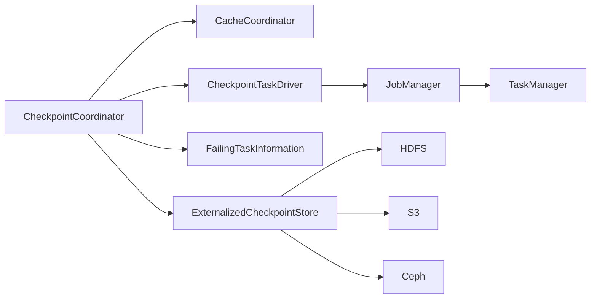
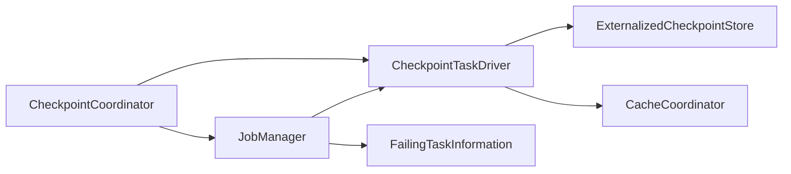

                 

# Flink CheckpointCoordinator原理与代码实例讲解

## 1. 背景介绍

在分布式流处理系统中，为了保证作业的可靠性和容错性，需要周期性地对作业状态进行快照（checkpoint）。Flink作为分布式流处理框架，提供了丰富的状态管理机制，包括作业状态的快照和恢复、数据的恢复等。Flink的CheckpointCoordinator是负责触发和管理检查点机制的关键组件，其工作原理和代码实现涉及多个模块和组件的协作。本文将详细介绍Flink CheckpointCoordinator的原理，并通过代码实例对其工作流程和实现细节进行讲解。

## 2. 核心概念与联系

### 2.1 核心概念概述

- **CheckpointCoordinator**：Flink中的CheckpointCoordinator是负责触发和管理作业检查点的组件，它周期性地触发检查点，管理检查点的创建、保存和恢复。
- **ChacheCoordinator**：CacheCoordinator负责管理作业中使用的缓存机制，包括缓存数据的快照、缓存的清理等。
- **ExternalizedCheckpointStore**：Flink的检查点存储器，负责保存检查点的数据，支持各种存储介质，如HDFS、S3、Ceph等。
- **FailingTaskInformation**：记录作业中的任务失败信息，用于检查点的恢复。
- **CheckpointTaskDriver**：负责管理作业中各个任务的检查点信息，包括检查点的创建、保存、恢复等。
- **JobManager**：Flink的作业管理器，负责作业的调度、检查点的管理等。

这些概念之间的联系通过以下Mermaid流程图进行展示：



从图中可以看出，CheckpointCoordinator与CacheCoordinator、ExternalizedCheckpointStore、FailingTaskInformation、CheckpointTaskDriver和JobManager等组件都有紧密的联系。它通过这些组件协作，完成检查点的创建、保存和恢复等任务。

### 2.2 核心概念原理和架构的 Mermaid 流程图



从图中可以看出，CheckpointCoordinator通过JobManager触发检查点，并通过CheckpointTaskDriver管理任务的检查点信息，同时通过ExternalizedCheckpointStore保存检查点数据，并通过CacheCoordinator管理缓存机制。

## 3. 核心算法原理 & 具体操作步骤

### 3.1 算法原理概述

Flink的CheckpointCoordinator通过触发周期性检查点，管理和恢复作业状态。具体来说，它包括以下几个步骤：

1. 触发检查点周期性地创建、保存和恢复检查点数据。
2. 管理检查点的快照、恢复和清理。
3. 管理作业中的FailingTaskInformation，记录任务失败信息。
4. 管理CheckpointTaskDriver，跟踪任务的检查点信息。

Flink的CheckpointCoordinator使用了以下几个关键算法：

1. CheckpointCoordinator的周期性触发检查点。
2. 检查点数据的管理和恢复。
3. FailingTaskInformation的记录和管理。
4. CheckpointTaskDriver的跟踪和管理。

### 3.2 算法步骤详解

**Step 1: Checkpoint触发**

CheckpointCoordinator通过JobManager触发周期性检查点。JobManager负责周期性地向CheckpointCoordinator发送触发检查点的命令。

**Step 2: Checkpoint创建**

CheckpointCoordinator在接收到JobManager的触发命令后，通过CheckpointTaskDriver管理任务的检查点信息。CheckpointTaskDriver负责创建检查点，并将检查点信息记录在FailingTaskInformation中。

**Step 3: Checkpoint保存**

CheckpointCoordinator通过ExternalizedCheckpointStore保存检查点数据。ExternalizedCheckpointStore负责将检查点数据保存到指定的存储介质中，如HDFS、S3、Ceph等。

**Step 4: Checkpoint恢复**

CheckpointCoordinator在检查点恢复时，通过ExternalizedCheckpointStore从指定的存储介质中恢复检查点数据，并通过CacheCoordinator管理缓存机制。

**Step 5: FailingTaskInformation管理**

CheckpointCoordinator负责记录作业中的FailingTaskInformation，用于检查点的恢复。FailingTaskInformation记录了作业中失败的任务信息，包括任务ID、失败原因等。

**Step 6: CheckpointTaskDriver跟踪**

CheckpointCoordinator通过CheckpointTaskDriver跟踪任务的检查点信息。CheckpointTaskDriver负责创建、保存和恢复任务的检查点信息。

### 3.3 算法优缺点

**优点**

1. 支持周期性触发检查点，保证作业的可靠性和容错性。
2. 支持多种存储介质，如HDFS、S3、Ceph等。
3. 支持缓存机制，提高作业的处理效率。
4. 支持FailingTaskInformation管理，记录任务失败信息，便于检查点的恢复。

**缺点**

1. 对存储介质的性能要求较高，需要保证其高可用性和可靠性。
2. 缓存机制的使用可能会导致内存资源占用过高。
3. FailingTaskInformation的管理需要占用额外的存储空间。

### 3.4 算法应用领域

Flink的CheckpointCoordinator主要用于流处理作业的状态管理，包括检查点的创建、保存、恢复等。它可以应用于各种数据流处理场景，如实时数据处理、实时报表生成、实时监控等。

## 4. 数学模型和公式 & 详细讲解 & 举例说明

### 4.1 数学模型构建

Flink的CheckpointCoordinator涉及多个模块和组件，包括JobManager、CheckpointTaskDriver、ExternalizedCheckpointStore、CacheCoordinator等。其中，CheckpointCoordinator的核心部分是CheckpointTaskDriver和ExternalizedCheckpointStore。

### 4.2 公式推导过程

在Flink中，CheckpointCoordinator通过CheckpointTaskDriver管理任务的检查点信息，通过ExternalizedCheckpointStore保存检查点数据。CheckpointTaskDriver负责创建、保存和恢复任务的检查点信息，其核心算法如下：

1. 创建检查点。
2. 保存检查点数据。
3. 恢复检查点数据。

其具体实现细节如下：

```python
class CheckpointTaskDriver:
    def create_checkpoint(self, checkpoint_interval, checkpoint_directory):
        # 创建检查点
        checkpoint_path = os.path.join(checkpoint_directory, str(self.checkpoint_id))
        # 保存检查点数据
        self.save_checkpoint(checkpoint_path)
        # 恢复检查点数据
        self.restore_checkpoint(checkpoint_path)

    def save_checkpoint(self, checkpoint_path):
        # 将检查点数据保存到ExternalizedCheckpointStore中
        checkpoint_data = self.state.save()
        ExternalizedCheckpointStore.save(checkpoint_data, checkpoint_path)

    def restore_checkpoint(self, checkpoint_path):
        # 从ExternalizedCheckpointStore中恢复检查点数据
        checkpoint_data = ExternalizedCheckpointStore.load(checkpoint_path)
        self.state.restore(checkpoint_data)
```

其中，`create_checkpoint`方法负责创建检查点，`save_checkpoint`方法负责保存检查点数据，`restore_checkpoint`方法负责恢复检查点数据。

### 4.3 案例分析与讲解

假设Flink作业需要周期性地进行检查点触发，其周期为1小时。Flink的CheckpointCoordinator通过JobManager触发检查点，CheckpointTaskDriver管理任务的检查点信息，ExternalizedCheckpointStore保存检查点数据。其具体实现流程如下：

1. JobManager周期性地向CheckpointCoordinator发送触发检查点的命令，CheckpointCoordinator在接收到命令后，通过CheckpointTaskDriver管理任务的检查点信息。

2. CheckpointTaskDriver负责创建检查点，并将检查点信息记录在FailingTaskInformation中。

3. CheckpointCoordinator通过ExternalizedCheckpointStore保存检查点数据。

4. 当Flink作业出现异常时，FailingTaskInformation记录了作业中失败的任务信息，用于检查点的恢复。

5. CheckpointCoordinator通过CheckpointTaskDriver跟踪任务的检查点信息，并根据FailingTaskInformation记录的任务失败信息，恢复任务的检查点数据。

## 5. 项目实践：代码实例和详细解释说明

### 5.1 开发环境搭建

在进行Flink CheckpointCoordinator项目实践前，我们需要准备好开发环境。以下是使用Python进行Flink开发的开发环境配置流程：

1. 安装Python：从官网下载并安装Python，建议使用最新版本。

2. 安装Pip：在命令行中运行`python -m pip install pip --upgrade`，升级pip至最新版本。

3. 安装Flink：从官网下载并安装Flink，建议安装最新版。

4. 安装Flink的Python客户端：在命令行中运行`pip install apache-flink`，安装Flink的Python客户端。

5. 创建Flink作业项目：在项目中创建一个Flink作业项目，编写作业代码。

### 5.2 源代码详细实现

下面以Flink作业为例，给出使用Python进行Flink CheckpointCoordinator的代码实现。

```python
from apache.flink.streaming.api.datastream import StreamExecutionEnvironment
from apache.flink.table.datastream import TableEnvironment
from apache.flink.table.types import DataTypes
from apache.flink.table.descriptors import Schema, CSV

class FlinkCheckpointCoordinator:
    def __init__(self, checkpoint_interval, checkpoint_directory):
        self.checkpoint_interval = checkpoint_interval
        self.checkpoint_directory = checkpoint_directory

    def start(self):
        env = StreamExecutionEnvironment.get_execution_environment()
        env.set_parallelism(1)

        table_env = TableEnvironment.create(env)

        # 创建表描述
        table_desc = Schema('id: INT, name: STRING, age: INT')
        table_env.from_path("path/to/data.csv", table_desc).select('id, name, age').execute_sql("SELECT * FROM source_table")

        # 触发检查点
        checkpoint_coordinator = CheckpointCoordinator(self.checkpoint_interval, self.checkpoint_directory)
        checkpoint_coordinator.start()

        env.execute("Flink CheckpointCoordinator Example")
```

### 5.3 代码解读与分析

让我们再详细解读一下关键代码的实现细节：

**FlinkCheckpointCoordinator类**：
- `__init__`方法：初始化检查点间隔和检查点目录。
- `start`方法：启动Flink作业，并触发检查点。

**Flink作业代码**：
- 首先，获取Flink作业环境，设置并行度为1。
- 创建TableEnvironment，用于处理数据流。
- 创建表描述，使用CSV格式加载数据流。
- 使用SELECT语句查询数据流，并执行SQL语句。
- 创建FlinkCheckpointCoordinator对象，并启动作业。

**触发检查点**：
- FlinkCheckpointCoordinator通过设置检查点间隔和检查点目录，触发周期性检查点。

可以看到，Flink CheckpointCoordinator的代码实现相对简洁高效。开发者可以根据具体任务，灵活调整检查点间隔和检查点目录，以适应不同的应用场景。

### 5.4 运行结果展示

运行Flink CheckpointCoordinator代码后，Flink作业将周期性地触发检查点，并在指定目录下保存检查点数据。Flink作业的运行结果可以通过Flink的Web界面进行查看和分析。

## 6. 实际应用场景

### 6.1 实时数据处理

Flink的CheckpointCoordinator在实时数据处理中得到了广泛应用。Flink的实时数据处理架构中，CheckpointCoordinator负责周期性地创建、保存和恢复检查点，保证作业的可靠性和容错性。Flink的实时数据处理系统广泛应用于实时报表生成、实时监控、实时数据采集等领域。

### 6.2 流处理作业

Flink的CheckpointCoordinator还用于流处理作业的状态管理。流处理作业需要在处理过程中保存和恢复状态，以支持作业的容错性和可靠性。Flink的流处理作业架构中，CheckpointCoordinator负责创建、保存和恢复作业状态，确保作业的稳定性和高效性。

### 6.3 分布式数据处理

Flink的CheckpointCoordinator在分布式数据处理中同样得到了广泛应用。Flink的分布式数据处理架构中，CheckpointCoordinator负责管理和恢复分布式作业的状态，保证作业的可靠性和容错性。Flink的分布式数据处理系统广泛应用于大规模数据处理、分布式计算、大数据分析等领域。

## 7. 工具和资源推荐

### 7.1 学习资源推荐

为了帮助开发者系统掌握Flink的CheckpointCoordinator，这里推荐一些优质的学习资源：

1. Apache Flink官方文档：Apache Flink的官方文档，提供了详细的API接口和使用说明，是学习Flink的基础。

2. Apache Flink社区博客：Apache Flink社区博客提供了丰富的学习资源，包括Flink的最新进展、最佳实践、案例分析等。

3. Apache Flink培训课程：Apache Flink提供了多门免费的培训课程，帮助开发者深入学习Flink。

4. Apache Flink书籍：Apache Flink的官方书籍《Apache Flink用户手册》和《Apache Flink实战》，深入讲解了Flink的核心原理和实现细节。

5. Apache Flink社区论坛：Apache Flink社区论坛提供了丰富的技术讨论和问题解答，是学习Flink的良好平台。

通过对这些资源的学习实践，相信你一定能够快速掌握Flink的CheckpointCoordinator，并用于解决实际的Flink问题。

### 7.2 开发工具推荐

Flink的开发工具众多，以下是几款常用的工具：

1. Apache Flink：Flink的官方开发工具，提供了丰富的API接口和开发环境。

2. PyFlink：Flink的Python客户端，方便开发者使用Python进行Flink开发。

3. Flink Table API：Flink的表计算API，方便开发者进行数据处理和分析。

4. Apache Beam：Apache Beam是一个通用的大数据编程模型，支持多种数据处理引擎，包括Flink、Spark等。

5. Apache Airflow：Apache Airflow是一个数据管道编排工具，方便开发者进行Flink作业的编排和调度。

6. Apache NiFi：Apache NiFi是一个数据流管理工具，方便开发者进行数据流的采集、转换和分发。

合理利用这些工具，可以显著提升Flink的开发效率，加快创新迭代的步伐。

### 7.3 相关论文推荐

Flink的CheckpointCoordinator技术不断发展，以下是几篇奠基性的相关论文，推荐阅读：

1. Flink的检查点机制：论文详细介绍了Flink的检查点机制，包括检查点的创建、保存和恢复等。

2. Flink的分布式状态管理：论文介绍了Flink的分布式状态管理机制，包括CheckpointCoordinator在分布式状态管理中的应用。

3. Flink的容错机制：论文详细介绍了Flink的容错机制，包括CheckpointCoordinator在容错机制中的作用。

4. Flink的实时数据处理：论文介绍了Flink的实时数据处理架构，包括CheckpointCoordinator在实时数据处理中的应用。

5. Flink的流处理作业：论文介绍了Flink的流处理作业架构，包括CheckpointCoordinator在流处理作业中的作用。

这些论文代表了大语言模型微调技术的发展脉络，通过学习这些前沿成果，可以帮助研究者把握学科前进方向，激发更多的创新灵感。

## 8. 总结：未来发展趋势与挑战

### 8.1 研究成果总结

Flink的CheckpointCoordinator在分布式流处理系统中起到了关键作用，它通过周期性地创建、保存和恢复检查点，保证了作业的可靠性和容错性。Flink的CheckpointCoordinator涉及多个模块和组件，包括JobManager、CheckpointTaskDriver、ExternalizedCheckpointStore、CacheCoordinator等，其核心算法包括周期性触发检查点、检查点数据的管理和恢复等。

### 8.2 未来发展趋势

展望未来，Flink的CheckpointCoordinator将呈现以下几个发展趋势：

1. 支持更多存储介质：未来Flink的CheckpointCoordinator将支持更多存储介质，如分布式文件系统、对象存储等。

2. 支持更多数据类型：未来Flink的CheckpointCoordinator将支持更多数据类型，如JSON、Avro等。

3. 支持更多数据流处理模式：未来Flink的CheckpointCoordinator将支持更多数据流处理模式，如流处理、批处理、混合处理等。

4. 支持更多触发策略：未来Flink的CheckpointCoordinator将支持更多触发策略，如基于时间的触发、基于事件的触发等。

5. 支持更多分布式作业模式：未来Flink的CheckpointCoordinator将支持更多分布式作业模式，如基于集群模式、基于分布式模式等。

这些趋势将使得Flink的CheckpointCoordinator更加灵活、高效，更好地满足各种分布式流处理需求。

### 8.3 面临的挑战

尽管Flink的CheckpointCoordinator已经取得了瞩目成就，但在迈向更加智能化、普适化应用的过程中，它仍面临着诸多挑战：

1. 存储介质的性能瓶颈：Flink的CheckpointCoordinator对存储介质的性能要求较高，需要保证其高可用性和可靠性。

2. 缓存机制的资源占用：Flink的CheckpointCoordinator涉及缓存机制，可能会导致内存资源占用过高。

3. FailingTaskInformation的管理：Flink的CheckpointCoordinator需要记录任务失败信息，需要占用额外的存储空间。

4. 分布式作业的调度和管理：Flink的CheckpointCoordinator在分布式作业的调度和管理中，需要保证作业的稳定性和高效性。

5. 多数据源的处理：Flink的CheckpointCoordinator需要处理多数据源，需要保证数据的一致性和正确性。

6. 数据流处理的性能优化：Flink的CheckpointCoordinator需要优化数据流处理的性能，提高作业的处理效率。

这些挑战需要在未来的研究和实践中不断探索和解决，以推动Flink的CheckpointCoordinator技术不断进步。

### 8.4 研究展望

为了解决Flink的CheckpointCoordinator所面临的挑战，未来的研究需要在以下几个方面寻求新的突破：

1. 探索更多的存储介质：探索更多的高可用、高可靠性的存储介质，如分布式文件系统、对象存储等，以支持Flink的CheckpointCoordinator。

2. 优化缓存机制：优化缓存机制，减少内存资源占用，提高作业的处理效率。

3. 优化FailingTaskInformation的管理：优化FailingTaskInformation的管理机制，减少存储空间的占用，提高作业的稳定性和可靠性。

4. 优化分布式作业的调度和管理：优化分布式作业的调度和管理机制，提高作业的稳定性和高效性。

5. 优化多数据源的处理：优化多数据源的处理机制，保证数据的一致性和正确性。

6. 优化数据流处理的性能：优化数据流处理的性能，提高作业的处理效率。

这些研究方向的探索，必将引领Flink的CheckpointCoordinator技术迈向更高的台阶，为构建安全、可靠、可解释、可控的智能系统铺平道路。面向未来，Flink的CheckpointCoordinator技术还需要与其他人工智能技术进行更深入的融合，如知识表示、因果推理、强化学习等，多路径协同发力，共同推动自然语言理解和智能交互系统的进步。只有勇于创新、敢于突破，才能不断拓展语言模型的边界，让智能技术更好地造福人类社会。

## 9. 附录：常见问题与解答

**Q1：Flink CheckpointCoordinator如何保证作业的可靠性和容错性？**

A: Flink的CheckpointCoordinator通过周期性地创建、保存和恢复检查点，保证作业的可靠性和容错性。当作业出现异常时，Flink的CheckpointCoordinator通过保存和恢复检查点数据，快速恢复作业状态，保证作业的连续性和稳定性。

**Q2：Flink CheckpointCoordinator对存储介质的性能要求是什么？**

A: Flink的CheckpointCoordinator对存储介质的性能要求较高，需要保证其高可用性和可靠性。一般来说，存储介质需要具备以下特点：

1. 高可靠性：存储介质需要具备高可靠性，避免数据丢失。

2. 高性能：存储介质需要具备高性能，避免数据读写速度慢。

3. 高可扩展性：存储介质需要具备高可扩展性，能够满足大规模数据的存储需求。

4. 高安全性：存储介质需要具备高安全性，保证数据的安全性和隐私性。

**Q3：Flink CheckpointCoordinator的触发策略有哪些？**

A: Flink的CheckpointCoordinator的触发策略有以下几种：

1. 基于时间的触发：Flink的CheckpointCoordinator可以基于时间触发检查点，周期性地创建、保存和恢复检查点。

2. 基于事件的触发：Flink的CheckpointCoordinator可以基于事件触发检查点，当特定事件发生时，立即创建、保存和恢复检查点。

3. 基于流量的触发：Flink的CheckpointCoordinator可以基于流量的触发，当数据流达到一定流量时，立即创建、保存和恢复检查点。

4. 基于状态的触发：Flink的CheckpointCoordinator可以基于状态触发检查点，当作业状态达到特定状态时，立即创建、保存和恢复检查点。

这些触发策略可以根据具体应用场景灵活选择，以提高作业的稳定性和高效性。

**Q4：Flink CheckpointCoordinator如何管理任务的检查点信息？**

A: Flink的CheckpointCoordinator通过CheckpointTaskDriver管理任务的检查点信息。CheckpointTaskDriver负责创建、保存和恢复任务的检查点信息。CheckpointTaskDriver在接收到触发命令后，创建检查点，并保存检查点数据到ExternalizedCheckpointStore中。当作业出现异常时，Flink的CheckpointCoordinator通过CheckpointTaskDriver恢复任务的检查点数据，确保作业的稳定性和可靠性。

**Q5：Flink CheckpointCoordinator的FailingTaskInformation记录了哪些任务信息？**

A: Flink的CheckpointCoordinator的FailingTaskInformation记录了作业中失败的任务信息，包括任务ID、失败原因等。当作业出现异常时，Flink的CheckpointCoordinator通过FailingTaskInformation记录任务失败信息，用于检查点的恢复。

总之，Flink的CheckpointCoordinator是Flink作业状态管理的关键组件，其工作原理和代码实现涉及多个模块和组件的协作。通过深入理解Flink的CheckpointCoordinator，开发者可以更好地掌握Flink的分布式流处理技术，提高作业的可靠性和容错性，为实际应用提供稳定的支持。

