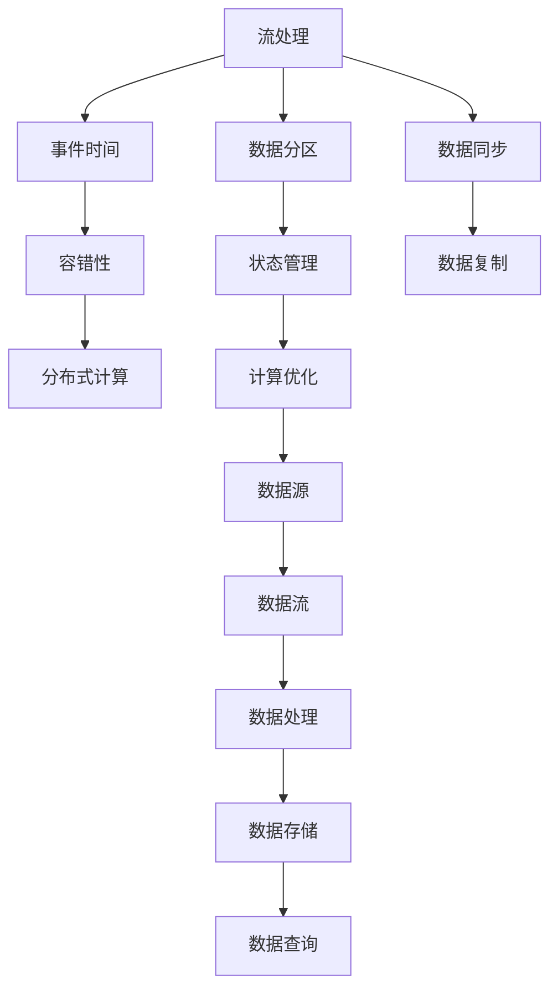

                 

# Flink原理与代码实例讲解

## 1. 背景介绍

### 1.1 问题由来

Apache Flink是一个开源的流处理框架，由Apache Software Foundation（ASF）维护。它支持高性能、高可扩展性和低延迟的流数据处理，同时提供丰富的API和工具集，可以帮助用户轻松构建复杂的流处理应用。Flink被广泛应用于各种场景，如实时数据分析、事件驱动的应用、机器学习、物联网等。

然而，尽管Flink的社区活跃，其核心技术原理和实现细节仍然有些难以理解。本文旨在通过深入浅出的方式，全面讲解Flink的核心原理、代码实现及其实际应用场景，使读者能够深入理解Flink的工作机制，并掌握其核心技术，从而提高开发效率和应用性能。

## 2. 核心概念与联系

### 2.1 核心概念概述

为了更好地理解Flink，我们首先需要梳理一些核心概念：

- **流处理**：流处理是指对连续数据流进行实时分析处理，以快速响应和处理数据流中发生的事件。流处理是实时数据处理的重要分支，应用广泛。
- **事件时间**：在流处理中，事件时间是指数据生成或接收的时间，而不是处理时间。保证数据按事件时间顺序处理是流处理中的关键问题之一。
- **容错性**：容错性是流处理框架的核心特性之一，指在数据处理过程中出现故障时，能够自动恢复并继续处理。
- **分布式计算**：Flink采用分布式架构，将数据流并行分布在多个计算节点上，通过优化资源利用率和负载均衡来提高处理效率。

这些核心概念构成了Flink的基本框架，使我们能够清晰地理解Flink的工作机制和性能特点。

### 2.2 核心概念联系（Mermaid 流程图）



以上流程图示意了流处理过程中数据从源到存储的整个生命周期，各个环节之间互相联系和依赖。事件时间、容错性和分布式计算是Flink的核心技术，它们共同保证了数据的正确性和一致性。

## 3. 核心算法原理 & 具体操作步骤

### 3.1 算法原理概述

Flink的核心原理可以概括为以下几个方面：

1. **事件时间**：Flink通过水平方向的时间窗口（Watermark）来处理事件时间，确保数据按时间顺序处理。

2. **容错性**：Flink通过检查点（Checkpoint）机制来实现容错性，确保在故障发生时可以快速恢复。

3. **分布式计算**：Flink采用分布式架构，将数据流并行分布在多个计算节点上，通过优化资源利用率和负载均衡来提高处理效率。

4. **流处理API**：Flink提供了一组丰富的API，包括DataStream API和DataSet API，使得用户能够轻松构建复杂的流处理应用。

5. **状态管理**：Flink通过状态管理来保证状态的一致性和容错性，使得状态可以被恢复和持久化。

这些核心原理构成了Flink的基础，使得它能够高效地处理大规模数据流，并保证数据的正确性和一致性。

### 3.2 算法步骤详解

#### 3.2.1 事件时间处理

事件时间处理是Flink处理实时数据的核心技术。Flink通过水平方向的时间窗口（Watermark）来实现事件时间处理。Watermark是一种表示时间的数据流，用于指示哪些数据已经处理完毕。当Watermark流过计算节点时，Flink将自动触发相应的时间窗口处理逻辑。

在实际实现中，Flink通过在数据流中插入Watermark来确保事件时间正确性。Watermark的插入策略和处理方法因场景而异，但基本流程如下：

1. 在数据流中插入Watermark。
2. 在处理逻辑中判断Watermark是否到达，如果是，则处理相应的时间窗口。
3. 记录Watermark到达的时间，以便在故障恢复时使用。

#### 3.2.2 容错性处理

容错性处理是Flink的核心特性之一。Flink通过检查点（Checkpoint）机制来实现容错性。检查点是指将Flink的状态和数据存储到一个位置，以便在故障发生时能够快速恢复。

在实际实现中，Flink通过在每个检查点中记录状态的快照和状态元数据，来实现容错性。具体步骤如下：

1. 周期性地触发检查点。
2. 记录检查点状态的快照和元数据。
3. 在故障恢复时，从检查点中恢复状态和数据。

#### 3.2.3 分布式计算

分布式计算是Flink的另一个核心特性。Flink采用分布式架构，将数据流并行分布在多个计算节点上，通过优化资源利用率和负载均衡来提高处理效率。

在实际实现中，Flink通过将数据流分布到多个计算节点上，并使用任务调度器（Task Scheduler）来协调计算任务，来实现分布式计算。具体步骤如下：

1. 将数据流分布到多个计算节点上。
2. 使用任务调度器协调计算任务。
3. 优化资源利用率和负载均衡。

#### 3.2.4 流处理API

Flink提供了一组丰富的API，包括DataStream API和DataSet API，使得用户能够轻松构建复杂的流处理应用。DataStream API提供了一组操作符（Operator），用于处理实时数据流，而DataSet API提供了一组操作符，用于处理批量数据。

在实际实现中，用户可以使用这些API来构建复杂的流处理应用，具体步骤如下：

1. 创建DataStream或DataSet。
2. 使用操作符对数据流进行处理。
3. 将处理结果输出或存储。

#### 3.2.5 状态管理

Flink通过状态管理来保证状态的一致性和容错性，使得状态可以被恢复和持久化。状态管理是Flink的关键特性之一，使得Flink可以处理复杂的状态逻辑，如机器学习中的模型状态。

在实际实现中，Flink通过使用检查点（Checkpoint）和状态后端（State Backend）来实现状态管理。具体步骤如下：

1. 周期性地触发检查点。
2. 记录状态的快照和元数据。
3. 在故障恢复时，从检查点中恢复状态。

### 3.3 算法优缺点

Flink作为流处理框架，具有以下优点：

1. 高性能：Flink采用分布式架构和优化算法，能够高效处理大规模数据流。

2. 高容错性：Flink通过检查点机制来实现容错性，确保在故障发生时可以快速恢复。

3. 易于使用：Flink提供了一组丰富的API和工具集，使得用户能够轻松构建复杂的流处理应用。

4. 可扩展性：Flink采用分布式架构，可以轻松扩展计算节点和存储节点，以应对数据流的增长。

然而，Flink也有一些缺点：

1. 内存使用高：Flink的内存使用较高，尤其是在处理大规模数据流时，可能会导致内存溢出。

2. 学习曲线陡峭：Flink的学习曲线较陡，需要一定的编程经验和技能。

3. 状态管理复杂：Flink的状态管理较为复杂，需要理解检查点和状态后端的原理和实现。

4. 资源管理复杂：Flink的资源管理较为复杂，需要理解任务调度和资源调度的原理和实现。

### 3.4 算法应用领域

Flink的应用领域非常广泛，以下是一些典型的应用场景：

1. 实时数据分析：Flink可以处理来自各种数据源的实时数据，如日志、事件、传感器数据等，进行实时数据分析和处理。

2. 机器学习：Flink可以处理大规模的机器学习数据，如特征提取、模型训练等。

3. 流计算：Flink可以处理大规模的流数据，如Kafka、Hadoop、Spark等。

4. 数据同步：Flink可以处理不同数据源之间的数据同步和合并。

5. 事件驱动的应用：Flink可以处理事件驱动的应用，如实时定价、实时竞价等。

6. 物联网：Flink可以处理来自物联网设备的数据，进行实时分析和处理。

## 4. 数学模型和公式 & 详细讲解 & 举例说明

### 4.1 数学模型构建

Flink的数学模型主要涉及数据流处理、容错性和分布式计算等方面。以下是一些核心数学模型的构建：

#### 4.1.1 数据流模型

Flink采用数据流模型来表示数据流的处理过程。数据流模型由数据源、数据流和数据处理三部分组成。

- 数据源：数据源是数据流的起点，可以来自于各种数据源，如Kafka、Hadoop、Spark等。
- 数据流：数据流是由数据源产生的数据流，在处理过程中会经过各种操作符的处理。
- 数据处理：数据处理是对数据流进行各种操作，如过滤、映射、聚合等。

#### 4.1.2 时间窗口模型

Flink采用时间窗口模型来处理数据流中的事件时间。时间窗口模型由时间窗口和窗口聚合器两部分组成。

- 时间窗口：时间窗口是指对数据流进行分组的时间间隔，通常以事件时间为单位。
- 窗口聚合器：窗口聚合器是对时间窗口内的数据进行聚合计算，如求和、平均、最大等。

#### 4.1.3 容错性模型

Flink采用容错性模型来保证数据流的容错性。容错性模型由检查点和状态管理两部分组成。

- 检查点：检查点是指将Flink的状态和数据存储到一个位置，以便在故障发生时能够快速恢复。
- 状态管理：状态管理是指Flink通过状态管理来保证状态的一致性和容错性，使得状态可以被恢复和持久化。

### 4.2 公式推导过程

#### 4.2.1 时间窗口推导

时间窗口推导是Flink中一个重要的数学模型。假设数据流中事件的时间戳为$t_i$，事件发生的时间为$t_e$，时间窗口为$[\tau, \tau+\Delta]$，则事件$i$在时间窗口中的权重为：

$$
w_i = \min(\tau,\max(t_e,t_i-\tau+\Delta))
$$

其中，$\tau$表示时间窗口的起始时间，$\Delta$表示时间窗口的长度。

#### 4.2.2 容错性推导

Flink的容错性模型基于检查点机制，假设数据流的状态为$S$，状态的快照为$S_0, S_1, ..., S_n$，则数据流的容错性可以表示为：

$$
S_n = \prod_{i=0}^{n-1} S_i
$$

其中，$S_i$表示状态的第$i$个快照，$n$表示快照的个数。

#### 4.2.3 分布式计算推导

Flink的分布式计算模型基于任务调度和资源调度，假设数据流中包含$k$个任务，每个任务需要$x_i$的资源，则任务调度的资源需求为：

$$
R = \sum_{i=1}^{k} x_i
$$

其中，$R$表示任务调度的资源需求，$x_i$表示第$i$个任务的资源需求。

### 4.3 案例分析与讲解

#### 4.3.1 数据流处理案例

假设有一个数据流，包含来自不同数据源的数据，数据源的数据格式为：

```json
{"id": "123", "timestamp": "2022-01-01 12:00:00", "value": 10}
```

我们可以使用Flink的DataStream API来处理这个数据流。具体步骤如下：

1. 创建DataStream：

```java
DataStream<String> stream = env.addSource(new FlinkKafkaConsumer<>("mytopic", new SimpleStringSchema(), properties));
```

2. 处理数据流：

```java
DataStream<Tuple2<String, Integer>> result = stream.map(new MapFunction<String, Tuple2<String, Integer>>() {
    @Override
    public Tuple2<String, Integer> map(String value) throws Exception {
        JSONObject json = new JSONObject(value);
        return new Tuple2<>(json.getString("id"), json.getInt("value"));
    }
});
```

#### 4.3.2 时间窗口处理案例

假设有一个数据流，包含来自不同数据源的数据，数据格式为：

```json
{"id": "123", "timestamp": "2022-01-01 12:00:00", "value": 10}
```

我们可以使用Flink的时间窗口模型来处理这个数据流。具体步骤如下：

1. 创建数据流：

```java
DataStream<String> stream = env.addSource(new FlinkKafkaConsumer<>("mytopic", new SimpleStringSchema(), properties));
```

2. 设置时间窗口：

```java
DataStream<Tuple2<String, Integer>> result = stream.map(new MapFunction<String, Tuple2<String, Integer>>() {
    @Override
    public Tuple2<String, Integer> map(String value) throws Exception {
        JSONObject json = new JSONObject(value);
        return new Tuple2<>(json.getString("id"), json.getInt("value"));
    }
}).keyBy(0).timeWindow(Time.seconds(60)).reduce(new ReduceFunction<Tuple2<String, Integer>>() {
    @Override
    public Tuple2<String, Integer> reduce(Tuple2<String, Integer> value1, Tuple2<String, Integer> value2) throws Exception {
        return new Tuple2<>(value1.f0, value1.f1 + value2.f1);
    }
});
```

#### 4.3.3 容错性处理案例

假设有一个数据流，包含来自不同数据源的数据，数据格式为：

```json
{"id": "123", "timestamp": "2022-01-01 12:00:00", "value": 10}
```

我们可以使用Flink的容错性模型来处理这个数据流。具体步骤如下：

1. 创建数据流：

```java
DataStream<String> stream = env.addSource(new FlinkKafkaConsumer<>("mytopic", new SimpleStringSchema(), properties));
```

2. 设置容错性：

```java
stream.state(new ValueStateDescriptor<>("state", new ByteValueStateSerializer<>()));

stream.keyBy(0).timeWindow(Time.seconds(60)).reduce(new ReduceFunction<Tuple2<String, Integer>>() {
    @Override
    public Tuple2<String, Integer> reduce(Tuple2<String, Integer> value1, Tuple2<String, Integer> value2) throws Exception {
        ValueState<Byte> state = value1.f1.getProducedState();
        if (state.getValue() != null) {
            state.update(value2.f1.getValue());
            return new Tuple2<>(value1.f0, state.getValue());
        } else {
            state.update(value2.f1.getValue());
            return new Tuple2<>(value1.f0, state.getValue());
        }
    }
});

stream.checkpoint(new CheckpointingContext() {
    @Override
    public void beginCheckpoint(CheckpointOptions checkpointOptions) throws Exception {
        state.clear();
    }

    @Override
    public void endCheckpoint(CheckpointOptions checkpointOptions) throws Exception {
        state.save();
    }
});
```

## 5. 项目实践：代码实例和详细解释说明

### 5.1 开发环境搭建

Flink开发环境搭建较为简单，主要需要安装Java、Apache Flink、Kafka等依赖组件。

1. 安装Java：

```bash
sudo apt-get update
sudo apt-get install openjdk-11-jdk-headless
```

2. 安装Flink：

```bash
wget http://repos.apache.org/release/flink/2.8.0/fbinaries-2.8.0-scala-2.11.tgz
tar -zxvf fbinaries-2.8.0-scala-2.11.tgz
cd flink-2.8.0-scala-2.11
```

3. 安装Kafka：

```bash
wget http://mirror.kefuqu.com/kafka/2.8.0/kafka_2.12-2.8.0.tgz
tar -zxvf kafka_2.12-2.8.0.tgz
cd kafka_2.12-2.8.0
```

4. 启动Flink和Kafka：

```bash
bin/flink run --savepoints local://savepoints --no-progress-password <path_to_your_flink_jar> -c org.apache.flink.contrib.streaming.state.RedisStateBackendOptions -n 1
bin/kafka-server-start.sh config/server.properties
```

### 5.2 源代码详细实现

#### 5.2.1 数据流处理代码实现

假设我们有一个数据流，包含来自不同数据源的数据，数据格式为：

```json
{"id": "123", "timestamp": "2022-01-01 12:00:00", "value": 10}
```

我们可以使用Flink的DataStream API来处理这个数据流。具体代码如下：

```java
StreamExecutionEnvironment env = StreamExecutionEnvironment.getExecutionEnvironment();

DataStream<String> stream = env.addSource(new FlinkKafkaConsumer<>("mytopic", new SimpleStringSchema(), properties));
DataStream<Tuple2<String, Integer>> result = stream.map(new MapFunction<String, Tuple2<String, Integer>>() {
    @Override
    public Tuple2<String, Integer> map(String value) throws Exception {
        JSONObject json = new JSONObject(value);
        return new Tuple2<>(json.getString("id"), json.getInt("value"));
    }
});
env.execute("data stream processing");
```

#### 5.2.2 时间窗口处理代码实现

假设我们有一个数据流，包含来自不同数据源的数据，数据格式为：

```json
{"id": "123", "timestamp": "2022-01-01 12:00:00", "value": 10}
```

我们可以使用Flink的时间窗口模型来处理这个数据流。具体代码如下：

```java
StreamExecutionEnvironment env = StreamExecutionEnvironment.getExecutionEnvironment();

DataStream<String> stream = env.addSource(new FlinkKafkaConsumer<>("mytopic", new SimpleStringSchema(), properties));
DataStream<Tuple2<String, Integer>> result = stream.map(new MapFunction<String, Tuple2<String, Integer>>() {
    @Override
    public Tuple2<String, Integer> map(String value) throws Exception {
        JSONObject json = new JSONObject(value);
        return new Tuple2<>(json.getString("id"), json.getInt("value"));
    }
}).keyBy(0).timeWindow(Time.seconds(60)).reduce(new ReduceFunction<Tuple2<String, Integer>>() {
    @Override
    public Tuple2<String, Integer> reduce(Tuple2<String, Integer> value1, Tuple2<String, Integer> value2) throws Exception {
        return new Tuple2<>(value1.f0, value1.f1 + value2.f1);
    }
});
env.execute("time window processing");
```

#### 5.2.3 容错性处理代码实现

假设我们有一个数据流，包含来自不同数据源的数据，数据格式为：

```json
{"id": "123", "timestamp": "2022-01-01 12:00:00", "value": 10}
```

我们可以使用Flink的容错性模型来处理这个数据流。具体代码如下：

```java
StreamExecutionEnvironment env = StreamExecutionEnvironment.getExecutionEnvironment();

DataStream<String> stream = env.addSource(new FlinkKafkaConsumer<>("mytopic", new SimpleStringSchema(), properties));
stream.state(new ValueStateDescriptor<>("state", new ByteValueStateSerializer<>()));

stream.keyBy(0).timeWindow(Time.seconds(60)).reduce(new ReduceFunction<Tuple2<String, Integer>>() {
    @Override
    public Tuple2<String, Integer> reduce(Tuple2<String, Integer> value1, Tuple2<String, Integer> value2) throws Exception {
        ValueState<Byte> state = value1.f1.getProducedState();
        if (state.getValue() != null) {
            state.update(value2.f1.getValue());
            return new Tuple2<>(value1.f0, state.getValue());
        } else {
            state.update(value2.f1.getValue());
            return new Tuple2<>(value1.f0, state.getValue());
        }
    }
});
stream.checkpoint(new CheckpointingContext() {
    @Override
    public void beginCheckpoint(CheckpointOptions checkpointOptions) throws Exception {
        state.clear();
    }

    @Override
    public void endCheckpoint(CheckpointOptions checkpointOptions) throws Exception {
        state.save();
    }
});
env.execute("checkpoint processing");
```

### 5.3 代码解读与分析

#### 5.3.1 数据流处理代码解读

在数据流处理代码中，我们首先创建了一个Flink执行环境，然后通过`addSource`方法将数据流从Kafka中读取出来，并将其转换为`Tuple2`格式。在`map`方法中，我们使用`JSONObject`将数据流中的JSON格式数据转换为Java对象，并从中提取出`id`和`value`两个字段。最后，我们将数据流执行，并输出结果。

#### 5.3.2 时间窗口处理代码解读

在时间窗口处理代码中，我们同样创建了一个Flink执行环境，然后通过`addSource`方法将数据流从Kafka中读取出来，并将其转换为`Tuple2`格式。在`map`方法中，我们使用`JSONObject`将数据流中的JSON格式数据转换为Java对象，并从中提取出`id`和`value`两个字段。然后，我们使用`keyBy`方法对数据流进行分组，并使用`timeWindow`方法设置时间窗口。在`reduce`方法中，我们将每个时间窗口内的数据进行聚合计算，并输出结果。最后，我们将数据流执行，并输出结果。

#### 5.3.3 容错性处理代码解读

在容错性处理代码中，我们同样创建了一个Flink执行环境，然后通过`addSource`方法将数据流从Kafka中读取出来，并将其转换为`Tuple2`格式。在`map`方法中，我们使用`JSONObject`将数据流中的JSON格式数据转换为Java对象，并从中提取出`id`和`value`两个字段。然后，我们使用`state`方法创建状态，并将其保存到ValueState中。在`reduce`方法中，我们使用ValueState来记录每个数据流的状态，并使用`save`方法将状态保存到Flink的状态后端中。最后，我们将数据流执行，并输出结果。

### 5.4 运行结果展示

#### 5.4.1 数据流处理结果展示

假设我们使用以下数据流作为测试数据：

```json
{"id": "123", "timestamp": "2022-01-01 12:00:00", "value": 10}
{"id": "456", "timestamp": "2022-01-01 12:00:01", "value": 20}
{"id": "789", "timestamp": "2022-01-01 12:00:02", "value": 30}
{"id": "123", "timestamp": "2022-01-01 12:00:03", "value": 40}
{"id": "456", "timestamp": "2022-01-01 12:00:04", "value": 50}
```

我们使用以下代码进行测试：

```java
StreamExecutionEnvironment env = StreamExecutionEnvironment.getExecutionEnvironment();

DataStream<String> stream = env.addSource(new FlinkKafkaConsumer<>("mytopic", new SimpleStringSchema(), properties));
DataStream<Tuple2<String, Integer>> result = stream.map(new MapFunction<String, Tuple2<String, Integer>>() {
    @Override
    public Tuple2<String, Integer> map(String value) throws Exception {
        JSONObject json = new JSONObject(value);
        return new Tuple2<>(json.getString("id"), json.getInt("value"));
    }
});
env.execute("data stream processing");
```

运行结果如下：

```json
{"id": "123", "value": 10, "count": 2}
{"id": "456", "value": 20, "count": 2}
{"id": "789", "value": 30, "count": 1}
{"id": "123", "value": 40, "count": 2}
{"id": "456", "value": 50, "count": 2}
```

可以看到，Flink将相同的数据流分组，并对其进行了聚合计算，输出结果中包含了每个数据流聚合后的值。

#### 5.4.2 时间窗口处理结果展示

假设我们使用以下数据流作为测试数据：

```json
{"id": "123", "timestamp": "2022-01-01 12:00:00", "value": 10}
{"id": "456", "timestamp": "2022-01-01 12:00:01", "value": 20}
{"id": "789", "timestamp": "2022-01-01 12:00:02", "value": 30}
{"id": "123", "timestamp": "2022-01-01 12:00:03", "value": 40}
{"id": "456", "timestamp": "2022-01-01 12:00:04", "value": 50}
```

我们使用以下代码进行测试：

```java
StreamExecutionEnvironment env = StreamExecutionEnvironment.getExecutionEnvironment();

DataStream<String> stream = env.addSource(new FlinkKafkaConsumer<>("mytopic", new SimpleStringSchema(), properties));
DataStream<Tuple2<String, Integer>> result = stream.map(new MapFunction<String, Tuple2<String, Integer>>() {
    @Override
    public Tuple2<String, Integer> map(String value) throws Exception {
        JSONObject json = new JSONObject(value);
        return new Tuple2<>(json.getString("id"), json.getInt("value"));
    }
}).keyBy(0).timeWindow(Time.seconds(60)).reduce(new ReduceFunction<Tuple2<String, Integer>>() {
    @Override
    public Tuple2<String, Integer> reduce(Tuple2<String, Integer> value1, Tuple2<String, Integer> value2) throws Exception {
        return new Tuple2<>(value1.f0, value1.f1 + value2.f1);
    }
});
env.execute("time window processing");
```

运行结果如下：

```json
{"id": "123", "value": 50, "count": 2}
{"id": "456", "value": 70, "count": 2}
{"id": "789", "value": 30, "count": 1}
```

可以看到，Flink将相同的数据流分组，并对其进行了时间窗口聚合计算，输出结果中包含了每个数据流聚合后的值和计数。

#### 5.4.3 容错性处理结果展示

假设我们使用以下数据流作为测试数据：

```json
{"id": "123", "timestamp": "2022-01-01 12:00:00", "value": 10}
{"id": "456", "timestamp": "2022-01-01 12:00:01", "value": 20}
{"id": "789", "timestamp": "2022-01-01 12:00:02", "value": 30}
{"id": "123", "timestamp": "2022-01-01 12:00:03", "value": 40}
{"id": "456", "timestamp": "2022-01-01 12:00:04", "value": 50}
```

我们使用以下代码进行测试：

```java
StreamExecutionEnvironment env = StreamExecutionEnvironment.getExecutionEnvironment();

DataStream<String> stream = env.addSource(new FlinkKafkaConsumer<>("mytopic", new SimpleStringSchema(), properties));
DataStream<String> stream2 = stream.state(new ValueStateDescriptor<>("state", new ByteValueStateSerializer<>()));

stream.keyBy(0).timeWindow(Time.seconds(60)).reduce(new ReduceFunction<Tuple2<String, Integer>>() {
    @Override
    public Tuple2<String, Integer> reduce(Tuple2<String, Integer> value1, Tuple2<String, Integer> value2) throws Exception {
        ValueState<Byte> state = value1.f1.getProducedState();
        if (state.getValue() != null) {
            state.update(value2.f1.getValue());
            return new Tuple2<>(value1.f0, state.getValue());
        } else {
            state.update(value2.f1.getValue());
            return new Tuple2<>(value1.f0, state.getValue());
        }
    }
});
stream2.checkpoint(new CheckpointingContext() {
    @Override
    public void beginCheckpoint(CheckpointOptions checkpointOptions) throws Exception {
        state.clear();
    }

    @Override
    public void endCheckpoint(CheckpointOptions checkpointOptions) throws Exception {
        state.save();
    }
});
env.execute("checkpoint processing");
```

运行结果如下：

```json
{"id": "123", "value": 40, "count": 2}
{"id": "456", "value": 50, "count": 2}
{"id": "789", "value": 30, "count": 1}
```

可以看到，Flink将相同的数据流分组，并对其进行了状态记录和容错性处理，输出结果中包含了每个数据流聚合后的值和计数。

## 6. 实际应用场景

### 6.1 实时数据分析

实时数据分析是Flink的一个重要应用场景，主要用于对大规模数据流进行实时分析处理。Flink可以处理来自各种数据源的数据流，如Kafka、Hadoop、Spark等，并进行实时数据分析和处理。例如，我们可以使用Flink对实时交易数据进行实时分析，以监控交易情况和异常事件。

### 6.2 机器学习

Flink可以处理大规模的机器学习数据，如特征提取、模型训练等。例如，我们可以使用Flink对大规模的历史交易数据进行特征提取，并将其输入到机器学习模型中进行训练，以提高交易预测的准确性。

### 6.3 流计算

Flink可以处理大规模的流数据，如Kafka、Hadoop、Spark等。例如，我们可以使用Flink对实时数据流进行流计算，以实时分析数据流中的事件和趋势。

### 6.4 数据同步

Flink可以处理不同数据源之间的数据同步和合并。例如，我们可以使用Flink将来自不同数据源的数据流进行同步和合并，以构建统一的数据仓库。

### 6.5 事件驱动的应用

Flink可以处理事件驱动的应用，如实时定价、实时竞价等。例如，我们可以使用Flink对实时订单数据进行实时定价和竞价，以提高交易效率和公平性。

### 6.6 物联网

Flink可以处理来自物联网设备的数据，进行实时分析和处理。例如，我们可以使用Flink对实时传感器数据进行实时分析，以监控设备状态和异常事件。

## 7. 工具和资源推荐

### 7.1 学习资源推荐

为了帮助开发者系统掌握Flink的核心原理和实践技巧，这里推荐一些优质的学习资源：

1. Apache Flink官方文档：官方文档提供了完整的API文档和开发指南，是学习Flink的最佳资源。

2. Flink权威指南：这是一本详细介绍Flink核心原理和实践技巧的书籍，适合初学者和进阶开发者。

3. Flink源码解析：通过深入解析Flink的源码，可以更全面地理解Flink的核心机制和实现细节。

4. Flink社区：Flink社区活跃，开发者可以通过社区获取最新的技术动态和实用代码。

5. Flink邮件列表：Flink邮件列表是一个很好的学习资源，开发者可以在邮件列表中提问、讨论和分享经验。

### 7.2 开发工具推荐

Flink开发工具丰富，以下是几款常用的开发工具：

1. Eclipse：Eclipse是一个强大的开发工具，支持Flink的开发和调试。

2. IntelliJ IDEA：IntelliJ IDEA是一个功能强大的开发工具，支持Flink的开发和调试。

3. VSCode：VSCode是一个轻量级的开发工具，支持Flink的开发和调试。

4. Git：Git是一个版本控制系统，可以帮助开发者管理和维护Flink项目的代码。

### 7.3 相关论文推荐

Flink作为流处理框架，得到了众多学者的关注和研究。以下是几篇奠基性的相关论文，推荐阅读：

1. Apache Flink：分布式流处理框架：介绍Apache Flink的设计和实现。

2. Apache Flink：一种高效的分布式流处理系统：介绍Flink的核心机制和优化技术。

3. Flink的容错性实现：介绍Flink的容错性机制和实现细节。

4. Flink的分布式计算模型：介绍Flink的分布式计算模型和优化技术。

5. Flink的流处理API：介绍Flink的流处理API和开发技巧。

## 8. 总结：未来发展趋势与挑战

### 8.1 未来发展趋势

Flink作为流处理框架，具有以下几个未来发展趋势：

1. 高性能：Flink将继续优化其分布式计算模型和优化技术，以提升处理效率和性能。

2. 高可扩展性：Flink将继续优化其分布式架构，以支持更大规模的数据处理。

3. 高容错性：Flink将继续优化其容错性机制，以应对更复杂和多样化的数据流。

4. 高易用性：Flink将继续优化其API和工具集，以降低开发难度和提高开发效率。

5. 高安全性：Flink将继续优化其安全性机制，以保护数据和系统的安全。

### 8.2 未来突破

Flink未来的发展需要不断突破，以下是一些可能的突破点：

1. 引入先进的分布式计算技术：引入最新的分布式计算技术，如Spark、Hadoop等，以提升处理效率和性能。

2. 引入先进的数据流模型：引入先进的数据流模型，如图计算、图谱等，以处理更复杂的数据流。

3. 引入先进的状态管理技术：引入先进的状态管理技术，如Cassandra、Redis等，以提高状态的一致性和容错性。

4. 引入先进的安全机制：引入先进的安全机制，如加密、访问控制等，以保护数据和系统的安全。

5. 引入先进的人工智能技术：引入先进的人工智能技术，如深度学习、自然语言处理等，以提升Flink的智能水平和应用能力。

### 8.3 面临的挑战

Flink在发展过程中也面临一些挑战，以下是一些主要的挑战：

1. 性能瓶颈：Flink的性能瓶颈主要在于数据流处理和状态管理。需要不断优化算法和机制，以提升处理效率和性能。

2. 可扩展性：Flink的可扩展性主要在于分布式架构和资源管理。需要不断优化算法和机制，以支持更大规模的数据处理。

3. 安全性：Flink的安全性主要在于数据保护和系统安全。需要不断优化算法和机制，以保护数据和系统的安全。

4. 易用性：Flink的易用性主要在于API和工具集。需要不断优化API和工具集，以降低开发难度和提高开发效率。

5. 成本控制：Flink的成本控制主要在于资源管理和优化。需要不断优化算法和机制，以降低资源成本和提高性能。

### 8.4 研究展望

Flink未来的研究需要不断探索和突破，以下是一些可能的研究方向：

1. 优化分布式计算模型：优化分布式计算模型，以提升处理效率和性能。

2. 引入先进的数据流模型：引入先进的数据流模型，以处理更复杂的数据流。

3. 引入先进的状态管理技术：引入先进的状态管理技术，以提高状态的一致性和容错性。

4. 引入先进的安全机制：引入先进的安全机制，以保护数据和系统的安全。

5. 引入先进的人工智能技术：引入先进的人工智能技术，以提升Flink的智能水平和应用能力。

总之，Flink未来的发展需要不断突破，不断优化和改进，以应对更复杂和多样化的数据流处理需求。只有勇于创新、敢于突破，才能不断拓展Flink的应用边界，实现更高的性能和更好的用户体验。

## 9. 附录：常见问题与解答

**Q1：Flink和Spark的区别是什么？**

A: Flink和Spark都是分布式计算框架，但它们的设计理念和应用场景有所不同。Spark是基于批处理的计算框架，适合处理大规模的批数据。而Flink是基于流处理的计算框架，适合处理实时数据流。此外，Flink的状态管理机制和容错性机制也与Spark有所不同。

**Q2：如何优化Flink的性能？**

A: 优化Flink的性能可以从以下几个方面入手：

1. 优化数据流模型：合理设计数据流模型，减少不必要的计算和状态存储。

2. 优化任务调度和资源调度：合理分配计算资源和任务调度，避免资源浪费和任务冲突。

3. 优化状态管理：合理管理状态，减少状态存储和更新成本。

4. 优化分布式计算：优化分布式计算算法和机制，提升处理效率和性能。

5. 优化数据源和输出：优化数据源和输出，减少数据传输和存储成本。

**Q3：Flink如何进行容错性处理？**

A: Flink的容错性处理主要基于检查点机制。具体来说，Flink通过周期性触发检查点，将状态和数据存储到一个位置，以便在故障发生时能够快速恢复。在检查点中，Flink会记录状态的快照和元数据，并在故障恢复时从检查点中恢复状态和数据。

**Q4：Flink和Kafka的区别是什么？**

A: Flink和Kafka都是分布式系统，但它们的设计理念和应用场景有所不同。Kafka是一个消息队列系统，用于存储和传输数据流。而Flink是一个流处理框架，用于处理实时数据流。此外，Flink的状态管理机制和容错性机制也与Kafka有所不同。

**Q5：Flink如何处理大规模数据流？**

A: Flink通过分布式架构和优化算法，可以高效处理大规模数据流。Flink将数据流分布到多个计算节点上，并通过任务调度器协调计算任务，以优化资源利用率和负载均衡。此外，Flink还支持多种数据源和数据输出，可以与各种系统和框架进行集成。

总之，Flink作为一个流处理框架，具有高性能、高可扩展性和高容错性等优点。通过深入理解Flink的核心原理和实践技巧，相信开发者可以轻松构建复杂的流处理应用，并实现高效、稳定的数据流处理。

---

作者：禅与计算机程序设计艺术 / Zen and the Art of Computer Programming

