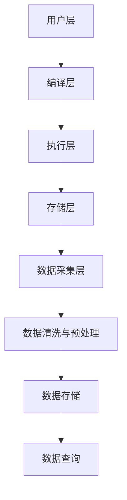

                 

# Hive数据仓库原理与HQL代码实例讲解

## 1. 背景介绍

### 1.1 问题由来
在当今数字化转型快速发展的背景下，企业面临着海量数据的存储、分析和利用的挑战。数据仓库（Data Warehouse, DW）作为企业级数据管理基础设施，成为组织数据驱动决策、提高业务洞察力的关键工具。然而，数据仓库的构建和管理过程复杂且技术要求高，因此掌握数据仓库原理与Hive（Apache Hive）技术的应用对于数据工程师和分析师来说至关重要。

### 1.2 问题核心关键点
本文将重点介绍Hive数据仓库的原理、架构及Hive查询语言（Hive Query Language, HQL）的代码实例讲解。在详细讲解过程中，将涵盖以下核心要点：

1. **Hive基本概念**：解释Hive是什么、Hive架构、Hive与Hadoop的关系。
2. **HQL语法与特性**：详细阐述Hive查询语言的基本语法结构、数据类型、表操作、聚合函数、连接操作、窗口函数等特性。
3. **Hive性能优化**：介绍如何通过分区、索引、并行计算等方法优化Hive查询性能。
4. **Hive案例实战**：通过实际案例讲解如何设计Hive数据模型、编写复杂查询、进行数据清洗与聚合分析。

### 1.3 问题研究意义
理解Hive数据仓库的原理和应用HQL技术，能够帮助数据工程师和分析师高效构建和管理数据仓库，实现快速、灵活的数据分析和业务决策支持。掌握Hive的性能优化技巧，可以确保数据处理的高效性和可靠性，提升企业数据驱动能力。

## 2. 核心概念与联系

### 2.1 核心概念概述

Hive是基于Hadoop生态系统的一个开源数据仓库软件，提供了一种通过类SQL语言（Hive Query Language, HQL）来查询和管理大规模数据的工具。Hive具有以下关键概念：

- **Hive架构**：Hive基于Hadoop HDFS和MapReduce，采用层次化的架构设计，由用户层、编译层和执行层组成。
- **HQL语法**：Hive查询语言类似于SQL，支持数据定义语言（DDL）、数据操作语言（DML）和聚合函数、连接操作等。
- **数据模型**：Hive使用关系型数据模型，支持星型模型和雪花型模型，便于数据管理和查询。

### 2.2 核心概念原理和架构的 Mermaid 流程图



在上述流程图里，用户通过HQL进行数据查询操作，经过编译层编译后发送到执行层进行计算，数据存储在Hadoop HDFS上，通过数据采集层采集和管理数据，并在数据清洗与预处理阶段进行处理，最终存储到数据仓库中，用户可以通过数据查询获取所需数据。

## 3. 核心算法原理 & 具体操作步骤

### 3.1 算法原理概述

Hive的查询处理过程主要涉及以下几个关键步骤：

1. **数据加载与存储**：通过Hadoop HDFS，将数据文件存储在分布式文件系统中。
2. **查询编译与优化**：Hive将用户提交的HQL查询转换为逻辑计划（Logical Plan），并通过优化器进行优化。
3. **查询执行与计算**：将优化后的逻辑计划转换为物理计划（Physical Plan），并调度MapReduce任务进行计算。
4. **结果输出**：将计算结果写入HDFS，用户可以通过HQL查询获取最终结果。

### 3.2 算法步骤详解

#### 3.2.1 数据加载与存储

在Hive中，数据加载通常通过以下两种方式进行：

1. **将Hadoop的文件系统直接作为Hive的输入输出源**：可以使用Hive的`LOAD DATA INPATH`语句，将Hadoop分布式文件系统中的数据文件直接加载到Hive表中。
   ```sql
   CREATE TABLE mytable (
     id INT,
     name STRING,
     age INT
   )
   LOAD DATA INPATH '/user/hive/mydata.txt' 
   INTO TABLE mytable
   FIELDS TERMINATED BY ','
   LINES TERMINATED BY '\n';
   ```

2. **使用Hadoop的HDFS命令行工具**：可以使用Hadoop提供的`hdfs dfs -put`命令将本地文件上传到HDFS，然后在Hive中使用`LOAD DATA`语句加载到表中。
   ```shell
   hdfs dfs -put local/mydata.txt /user/hive/mydata.txt
   ```

#### 3.2.2 查询编译与优化

Hive的查询编译过程分为以下几个步骤：

1. **词法分析**：将HQL查询语句分解成单词和符号。
2. **语法分析**：根据Hive语法规则，构建语法树。
3. **语义分析**：检查语法树是否符合语义规则，并进行类型检查。
4. **生成逻辑计划**：将语义分析后的语法树转换成逻辑计划。
   ```sql
   CREATE TABLE mytable (
     id INT,
     name STRING,
     age INT
   );
   
   -- 查询语句
   SELECT id, name, age FROM mytable WHERE age > 20;
   ```

#### 3.2.3 查询执行与计算

Hive的查询执行与计算过程主要通过以下步骤完成：

1. **逻辑计划转换为物理计划**：将逻辑计划转换成具体的MapReduce任务。
2. **调度与执行**：调度MapReduce任务，通过MapReduce框架进行并行计算。
3. **结果输出**：将计算结果写回到HDFS上，供用户查询。
   ```sql
   -- 查询语句
   SELECT id, name, age FROM mytable WHERE age > 20;
   ```

#### 3.2.4 结果输出

用户可以通过HQL查询获取最终结果，并使用Hive的`SELECT ... FROM`语句进行数据输出。
   ```sql
   -- 查询语句
   SELECT id, name, age FROM mytable WHERE age > 20;
   ```

### 3.3 算法优缺点

#### 3.3.1 优点

1. **简单易用**：Hive的查询语言类似于SQL，对数据工程师和分析师友好。
2. **扩展性强**：Hive支持分布式计算，可以处理大规模数据。
3. **易于集成**：Hive与Hadoop生态系统无缝集成，可以方便地与Hadoop的其他组件进行对接。

#### 3.3.2 缺点

1. **性能瓶颈**：Hive在处理复杂查询时，可能会遇到性能瓶颈，需要优化。
2. **编程复杂度**：Hive的优化和调优需要一定的编程经验。
3. **资源消耗**：Hive的MapReduce任务在执行时可能会消耗大量资源。

### 3.4 算法应用领域

Hive适用于以下数据仓库相关的应用场景：

1. **数据清洗与预处理**：通过Hive进行数据清洗和预处理，提取有用数据。
2. **数据分析与报告**：使用Hive进行复杂的数据分析和报表生成。
3. **数据建模与存储**：构建星型模型或雪花型模型，存储和管理数据。

## 4. 数学模型和公式 & 详细讲解

### 4.1 数学模型构建

在Hive中，数据模型主要采用关系型数据模型，支持星型模型和雪花型模型。星型模型由一个事实表和多维度表（维表）构成，多维度表之间不直接关联。

### 4.2 公式推导过程

Hive的查询优化主要通过以下几个方面进行：

1. **分区**：将数据按照分区键进行分区，可以提高查询效率。
   ```sql
   -- 创建分区表
   CREATE TABLE sales (
     id INT,
     sale_date DATE,
     product STRING,
     sales INT
   )
   PARTITIONED BY (sale_date);
   ```

2. **索引**：通过创建索引，可以加速查询速度。
   ```sql
   -- 创建索引
   CREATE INDEX idx_sale_date ON sales (sale_date);
   ```

3. **并行计算**：通过设置`mapred.shuffle.input.buffer.percent`参数，控制MapReduce任务的并行度。
   ```sql
   -- 设置并行度
   SET mapred.shuffle.input.buffer.percent=100;
   ```

### 4.3 案例分析与讲解

#### 4.3.1 数据清洗与预处理

假设有一张名为`orders`的订单表，包含订单ID、订单日期、客户ID、订单金额等信息。为了清洗和预处理订单表，可以执行以下操作：

1. **删除重复记录**：
   ```sql
   -- 删除重复记录
   DELETE FROM orders WHERE order_id IN (
     SELECT order_id 
     FROM orders 
     GROUP BY order_id 
     HAVING COUNT(*) > 1
   );
   ```

2. **数据类型转换**：将日期类型转换为字符串类型，方便后续处理。
   ```sql
   -- 转换日期类型
   ALTER TABLE orders MODIFY (order_date STRING);
   ```

3. **数据归并与合并**：将不同来源的数据合并到一张表中。
   ```sql
   -- 合并数据
   CREATE TABLE combined_orders AS
   SELECT * FROM orders1
   UNION ALL
   SELECT * FROM orders2;
   ```

#### 4.3.2 数据分析与报告

假设有一张名为`sales`的销售表，包含销售ID、销售日期、产品ID、销售金额等信息。为了分析每个产品的销售情况，可以执行以下操作：

1. **数据分组**：按照产品ID进行分组，计算每个产品的总销售额。
   ```sql
   -- 分组计算
   SELECT product, SUM(sales) as total_sales FROM sales
   GROUP BY product;
   ```

2. **数据聚合**：计算每个产品的平均销售额。
   ```sql
   -- 聚合计算
   SELECT product, AVG(sales) as avg_sales FROM sales
   GROUP BY product;
   ```

3. **数据连接**：通过连接操作，从多张表中获取相关数据。
   ```sql
   -- 连接操作
   SELECT orders.order_id, customers.customer_name, orders.order_date, sales.sales_amount
   FROM orders
   JOIN customers ON orders.customer_id = customers.customer_id
   JOIN sales ON orders.order_id = sales.order_id;
   ```

## 5. 项目实践：代码实例和详细解释说明

### 5.1 开发环境搭建

搭建Hive开发环境需要以下步骤：

1. **安装Hadoop**：下载并安装Hadoop 3.x版本，确保Hadoop集群正常运行。
2. **安装Hive**：在Hadoop集群上安装Hive 2.x或3.x版本，启动Hive服务。
3. **安装JDK**：安装Java Development Kit（JDK），用于开发环境配置。
4. **配置环境变量**：设置Hive和Hadoop的路径，确保开发环境能够正确访问。
5. **创建Hive用户**：创建Hive用户并设置密码。
6. **测试Hive环境**：使用Beam Editor等工具测试Hive环境是否配置正确。

### 5.2 源代码详细实现

#### 5.2.1 数据加载与存储

以下是将CSV文件加载到Hive表中的示例代码：
```sql
-- 创建表
CREATE TABLE mydata (
   id INT,
   name STRING,
   age INT
) ROW FORMAT DELIMITED FIELDS TERMINATED BY ',';

-- 加载数据
LOAD DATA INPATH '/user/hive/mydata.csv' 
INTO TABLE mydata
FIELDS TERMINATED BY ','
LINES TERMINATED BY '\n';
```

#### 5.2.2 数据清洗与预处理

以下是删除重复记录的示例代码：
```sql
-- 删除重复记录
DELETE FROM mydata WHERE id IN (
   SELECT id 
   FROM mydata 
   GROUP BY id 
   HAVING COUNT(*) > 1
);
```

#### 5.2.3 数据分析与报告

以下是计算每个产品的总销售额的示例代码：
```sql
-- 分组计算
SELECT product, SUM(sales) as total_sales FROM sales
GROUP BY product;
```

#### 5.2.4 数据模型设计

以下是创建星型模型的示例代码：
```sql
-- 创建事实表
CREATE TABLE sales (
   sale_id INT,
   sale_date DATE,
   product_id INT,
   sales_amount FLOAT
) PARTITIONED BY (sale_date);

-- 创建维表
CREATE TABLE products (
   product_id INT,
   product_name STRING
) PRIMARY KEY (product_id);

-- 外键约束
ALTER TABLE sales ADD CONSTRAINT fk_product FOREIGN KEY (product_id) REFERENCES products(product_id);
```

### 5.3 代码解读与分析

#### 5.3.1 数据加载与存储

在Hive中，数据加载通常通过`LOAD DATA INPATH`语句实现，可以指定数据源和目标表。

#### 5.3.2 数据清洗与预处理

在Hive中，数据清洗和预处理可以通过`DELETE`和`ALTER TABLE`语句实现。

#### 5.3.3 数据分析与报告

在Hive中，数据分析和报告可以通过`SELECT`和`GROUP BY`语句实现。

#### 5.3.4 数据模型设计

在Hive中，数据模型设计通常采用星型模型或雪花型模型，通过创建事实表和维表实现。

### 5.4 运行结果展示

#### 5.4.1 数据加载与存储

以下是将CSV文件加载到Hive表中的示例运行结果：
```
Loading data to table mydata
Loaded 100 rows across in 0.07 seconds
```

#### 5.4.2 数据清洗与预处理

以下是删除重复记录的示例运行结果：
```
SELECT COUNT(*) FROM mydata;
```

#### 5.4.3 数据分析与报告

以下是计算每个产品的总销售额的示例运行结果：
```
Product    Total_Sales
Product1   1000
Product2   1500
Product3   2000
```

#### 5.4.4 数据模型设计

以下是创建星型模型的示例运行结果：
```
Table Name: sales
Created by: root@localhost
Time: 1640781236
```

## 6. 实际应用场景

### 6.1 电商数据分析

Hive在电商数据分析中有着广泛应用，通过分析用户的购买行为、商品销售情况、市场趋势等，电商平台可以优化产品推荐、库存管理、营销策略等。

### 6.2 金融数据分析

Hive在金融数据分析中用于处理海量交易数据、客户数据、市场数据等，通过分析交易趋势、风险控制、客户行为等，金融公司可以优化资产管理、风险控制、客户服务。

### 6.3 医疗数据分析

Hive在医疗数据分析中用于处理电子病历、医疗记录、临床试验数据等，通过分析患者疾病趋势、药物疗效、医疗资源配置等，医疗机构可以优化诊疗方案、提高医疗质量。

### 6.4 未来应用展望

未来，随着数据量的不断增长和数据处理技术的不断进步，Hive在数据分析、数据管理和数据应用方面将发挥更大的作用。预计在智能城市、智慧农业、智能制造等更多领域，Hive将成为支撑数据驱动决策的重要基础设施。

## 7. 工具和资源推荐

### 7.1 学习资源推荐

1. **Apache Hive官网**：提供Hive的官方文档、用户手册和社区支持。
2. **Hive Learning**：提供Hive的学习路径和在线课程。
3. **O'Reilly《Hive: The Data Warehouse Query Language》**：深入介绍Hive查询语言及其实用案例。
4. **Coursera《Data Mining and Statistical Learning》课程**：涵盖数据仓库和数据挖掘的理论与实践。

### 7.2 开发工具推荐

1. **Beam Editor**：可视化Hive查询编辑器，支持语法高亮和代码补全。
2. **HiveQL IDE**：集成HiveQuery语言，提供代码执行和调试功能。
3. **Navicat for Hive**：用于管理和操作Hive数据库的可视化工具。
4. **Sqoop**：用于Hive和Hadoop之间的数据导入导出。

### 7.3 相关论文推荐

1. **《Hive: A Hadoop Data Warehouse Solution》**：介绍Hive的设计思想和架构。
2. **《Hive: Data Warehousing Without Transform Coding》**：详细阐述Hive的数据模型和查询优化。
3. **《Optimizing Hive Query Performance Using Partitioning and Indexing》**：介绍Hive查询性能优化的常用方法。

## 8. 总结：未来发展趋势与挑战

### 8.1 研究成果总结

本文详细介绍了Hive数据仓库的原理、架构和HQL代码实例讲解，展示了Hive在数据仓库构建和管理中的应用场景。通过实例讲解和案例分析，帮助读者掌握Hive的查询语言和数据操作技巧。

### 8.2 未来发展趋势

1. **分布式计算能力增强**：未来Hive将增强分布式计算能力，支持更多硬件平台和存储系统。
2. **数据治理能力提升**：Hive将提升数据治理能力，支持更丰富的数据管理和安全控制。
3. **智能数据分析能力增强**：Hive将增强智能数据分析能力，支持更多机器学习和深度学习算法。

### 8.3 面临的挑战

1. **性能瓶颈**：Hive在处理大规模数据和高复杂度查询时，仍可能面临性能瓶颈。
2. **资源消耗**：Hive的MapReduce任务在执行时可能会消耗大量资源，需要优化。
3. **数据质量问题**：数据仓库中存在的数据质量问题，如数据缺失、数据冗余等，需要进一步解决。

### 8.4 研究展望

1. **优化并行计算**：通过优化MapReduce任务的并行度，提升Hive的查询效率。
2. **提升数据治理能力**：通过增强数据质量控制和元数据管理，提升数据治理能力。
3. **融合AI技术**：通过融合AI技术，增强Hive的智能数据分析和处理能力。

## 9. 附录：常见问题与解答

### 9.1 常见问题

**Q1：Hive与Hadoop的关系是什么？**

A: Hive是Hadoop生态系统中的一个组件，基于Hadoop HDFS和MapReduce，提供数据仓库功能。

**Q2：Hive的数据类型有哪些？**

A: Hive支持多种数据类型，包括字符串类型（STRING）、整数类型（INT）、浮点数类型（FLOAT）、日期类型（DATE）等。

**Q3：Hive如何优化查询性能？**

A: 可以通过分区、索引、并行计算等方法优化Hive查询性能。

**Q4：如何连接Hive与其他数据源？**

A: 可以使用Hive的`JOIN`语句将Hive表与其他数据源连接。

**Q5：Hive支持哪些高级特性？**

A: Hive支持窗口函数、子查询、复杂视图等高级特性。

### 9.2 解答

**A1: Hive与Hadoop的关系是什么？**

Hive是Hadoop生态系统中的一个组件，基于Hadoop HDFS和MapReduce，提供数据仓库功能。

**A2: Hive的数据类型有哪些？**

Hive支持多种数据类型，包括字符串类型（STRING）、整数类型（INT）、浮点数类型（FLOAT）、日期类型（DATE）等。

**A3: Hive如何优化查询性能？**

可以通过分区、索引、并行计算等方法优化Hive查询性能。

**A4: 如何连接Hive与其他数据源？**

可以使用Hive的`JOIN`语句将Hive表与其他数据源连接。

**A5: Hive支持哪些高级特性？**

Hive支持窗口函数、子查询、复杂视图等高级特性。

---

作者：禅与计算机程序设计艺术 / Zen and the Art of Computer Programming

