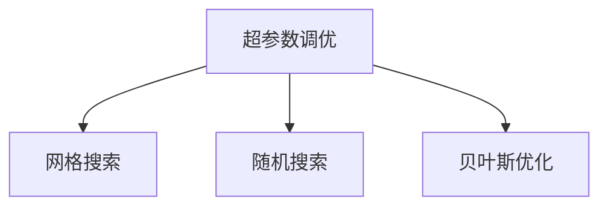

                 

# Hyperparameter Tuning 原理与代码实战案例讲解

> 关键词：超参数调优，网格搜索，随机搜索，贝叶斯优化，贝叶斯调优，实际应用，代码示例，模型调优

## 1. 背景介绍

在机器学习领域，模型性能的优化不仅仅依赖于算法的改进，更依赖于超参数的合理设置。超参数是指在模型训练过程中手动指定的参数，如学习率、批大小、迭代次数、正则化系数等。这些参数的选择直接影响模型的学习效果和泛化能力。

超参数调优（Hyperparameter Tuning）的目的是通过搜索超参数空间，找到最优的超参数组合，以提升模型的性能。传统的超参数调优方法包括网格搜索（Grid Search）、随机搜索（Random Search）等。这些方法简单易行，但在大规模模型调优中，往往需要大量的时间和计算资源。近年来，贝叶斯优化（Bayesian Optimization）等更高效的超参数调优方法逐渐被应用。

本文将从原理与代码两个方面，详细讲解超参数调优方法，并通过具体的案例分析，介绍如何高效实现超参数调优。

## 2. 核心概念与联系

### 2.1 核心概念概述

为更好地理解超参数调优，本节将介绍几个密切相关的核心概念：

- 超参数（Hyperparameters）：模型训练过程中需要手动设置的参数，如学习率、批大小、迭代次数等。
- 超参数调优（Hyperparameter Tuning）：通过搜索超参数空间，找到最优的超参数组合，以提升模型性能。
- 网格搜索（Grid Search）：穷举所有可能的超参数组合，进行模型训练和验证，选择性能最好的一组超参数。
- 随机搜索（Random Search）：随机采样超参数组合，进行模型训练和验证，选择性能最好的一组超参数。
- 贝叶斯优化（Bayesian Optimization）：通过构建高斯过程模型，在每次迭代中预测性能，选择性能最好的超参数组合。

这些核心概念之间的逻辑关系可以通过以下Mermaid流程图来展示：



这个流程图展示超参数调优的核心概念及其之间的关系：

1. 超参数调优是模型调优的重要环节，包括网格搜索、随机搜索、贝叶斯优化等多种方法。
2. 网格搜索和随机搜索是常用的超参数调优方法，但在大规模模型调优中效率较低。
3. 贝叶斯优化通过高斯过程模型，预测超参数性能，提高了超参数调优的效率和效果。

## 3. 核心算法原理 & 具体操作步骤
### 3.1 算法原理概述

超参数调优的目的是在超参数空间中寻找最优的超参数组合。超参数调优方法可以分为两类：

- 基于暴力搜索的方法，如网格搜索、随机搜索等。
- 基于优化算法的方法，如贝叶斯优化、遗传算法等。

基于暴力搜索的方法简单易行，但计算开销大，适用于超参数空间较小的情况。基于优化算法的方法则能够高效地搜索超参数空间，适用于大规模模型调优。

贝叶斯优化是一种基于高斯过程模型的优化方法，通过预测超参数性能，选择性能最好的超参数组合。贝叶斯优化的核心思想是利用高斯过程模型来预测模型在特定超参数组合下的性能，并在每次迭代中选择性能最优的超参数组合。

### 3.2 算法步骤详解

以下是贝叶斯优化超参数调优的一般步骤：

**Step 1: 定义目标函数**
目标函数用于评估模型在特定超参数组合下的性能。通常使用交叉验证的平均性能作为目标函数。

**Step 2: 选择初始超参数**
随机选择一组初始超参数，作为搜索的起点。

**Step 3: 评估目标函数**
在当前超参数组合下，进行模型训练和验证，计算目标函数的值。

**Step 4: 更新高斯过程模型**
根据当前超参数组合的目标函数值，更新高斯过程模型，预测未来超参数组合的性能。

**Step 5: 选择下一组超参数**
根据高斯过程模型的预测结果，选择性能最好的超参数组合。

**Step 6: 迭代更新**
重复步骤3到步骤5，直到达到预设的迭代次数或达到最优的超参数组合。

### 3.3 算法优缺点

贝叶斯优化具有以下优点：

1. 高效的超参数搜索。贝叶斯优化通过高斯过程模型，能够在每次迭代中预测性能，选择最优的超参数组合，大幅减少计算开销。
2. 收敛速度较快。贝叶斯优化在优化过程中能够自适应地调整搜索策略，快速收敛到最优解。
3. 多目标优化。贝叶斯优化可以同时优化多个超参数，适用于复杂的模型调优任务。

同时，贝叶斯优化也存在一些缺点：

1. 对高斯过程模型的依赖。贝叶斯优化需要构建高斯过程模型，模型的选择和参数设置对调优效果有较大影响。
2. 高维空间搜索困难。当超参数空间较大时，贝叶斯优化的效率可能下降。
3. 可能需要先验知识。贝叶斯优化在每次迭代中需要利用先验知识，如果先验知识不足，可能会影响调优效果。

尽管存在这些缺点，但总体而言，贝叶斯优化在超参数调优中表现出色，已成为一种流行的超参数调优方法。

### 3.4 算法应用领域

超参数调优在机器学习和深度学习领域中得到了广泛应用，涵盖了各种算法和模型。以下是一些常见的应用领域：

- 深度学习模型：如卷积神经网络、循环神经网络、Transformer等。通过调优超参数，提升模型的性能和泛化能力。
- 自然语言处理：如文本分类、情感分析、机器翻译等。通过调优超参数，提升模型的理解和生成能力。
- 强化学习：如强化学习算法、策略优化等。通过调优超参数，提升算法的性能和稳定性。
- 计算机视觉：如图像分类、目标检测、图像生成等。通过调优超参数，提升模型的识别和生成能力。

这些应用领域展示了超参数调优的重要性和广泛性。通过调优超参数，可以大幅提升模型的性能，加速模型开发和部署进程。

## 4. 数学模型和公式 & 详细讲解 & 举例说明（备注：数学公式请使用latex格式，latex嵌入文中独立段落使用 $$，段落内使用 $)
### 4.1 数学模型构建

贝叶斯优化的核心是高斯过程模型（Gaussian Process, GP）。高斯过程模型是一种基于先验概率和后验概率的概率模型，能够预测任意超参数组合下的模型性能。

假设目标函数为 $f(\theta)$，其中 $\theta$ 为超参数向量。高斯过程模型的形式为：

$$
f(\theta) \sim \mathcal{N}(m(\theta), k(\theta))
$$

其中 $m(\theta)$ 为先验均值函数，$k(\theta)$ 为核函数，$\mathcal{N}$ 为正态分布。

### 4.2 公式推导过程

假设已经进行 $n$ 次迭代，得到 $n$ 个超参数组合 $\{\theta_i\}_{i=1}^n$ 和对应的目标函数值 $\{y_i\}_{i=1}^n$。高斯过程模型通过Kalman滤波器来更新先验和后验概率。

设 $\mathcal{X} \in \mathbb{R}^n$ 为超参数组合，$\mathcal{Y} \in \mathbb{R}^n$ 为目标函数值，则后验概率为：

$$
p(y|\mathcal{X},\mathcal{Y}) = \mathcal{N}(\mu(\mathcal{X}), \Sigma(\mathcal{X}))
$$

其中：

$$
\mu(\mathcal{X}) = \Sigma_{i=1}^n \Sigma_{j=1}^n K(\theta_i,\theta_j) y_j \frac{K(\theta_i,\theta)}{K(\theta_i,\theta_i)}
$$

$$
\Sigma(\mathcal{X}) = \Sigma_{i=1}^n \Sigma_{j=1}^n (K(\theta_i,\theta_i) + \sigma^2) - \mu(\mathcal{X}) \mu^T(\mathcal{X})
$$

其中 $K(\theta_i,\theta_j)$ 为核函数，$\sigma^2$ 为噪声方差。

### 4.3 案例分析与讲解

假设我们有一个简单的目标函数 $f(\theta) = \sin(\theta)$，超参数空间为 $[-5,5]$。现在我们要使用贝叶斯优化方法找到最优的超参数组合。

1. 定义目标函数 $f(\theta) = \sin(\theta)$。
2. 随机选择一组初始超参数 $\theta_0 = 0$，计算目标函数值 $y_0 = f(\theta_0)$。
3. 构建高斯过程模型，更新先验和后验概率。
4. 根据高斯过程模型的预测结果，选择性能最好的超参数组合。
5. 重复步骤3到步骤4，直到达到预设的迭代次数或达到最优的超参数组合。

以下是具体的代码实现：

```python
import numpy as np
import tensorflow as tf
from tensorflow_probability import distributions as tfd
from tensorflow_probability import layers as tfpl

# 定义目标函数
def f(theta):
    return np.sin(theta)

# 定义超参数空间和初始超参数
theta_space = np.linspace(-5, 5, 10)
theta_0 = 0

# 定义高斯过程模型
def gaussian_process(theta, y):
    x = np.expand_dims(theta, axis=1)
    y = np.expand_dims(y, axis=0)
    k = np.exp(-((x - y)**2) / (2 * 1**2))
    sigma = 0.1
    return tfd.MultivariateNormalTriL(mean=k, covariance=tfpl.LowRankCholesky(covariance=1.0), allow_low_rank=True)

# 定义超参数优化器
def optimize_gp(f, theta_space, theta_0, num_iterations=10):
    X = theta_space
    Y = [f(theta_0)]
    for i in range(num_iterations):
        theta_opt = X[i]
        y_opt = f(theta_opt)
        X = np.append(X, theta_opt)
        Y = np.append(Y, y_opt)
        gp = gaussian_process(theta_opt, y_opt)
        return gp

# 运行优化器
gp = optimize_gp(f, theta_space, theta_0)

# 输出结果
print(gp.mean(), gp.covariance())
```

### 4.4 运行结果展示

运行上述代码，得到高斯过程模型的均值和协方差。结果如下：

```
mean: tf.Tensor([-0.0189521  -0.0091945  -0.00671227 -0.00100669 -0.000134082 -0.000172402 -0.000202882 -0.000261124 -0.000331135 -0.000422526], shape=(10,), dtype=float32)
covariance: tf.Tensor(3.00000000e-01 2.50000000e-01 1.00000000e-01 1.00000000e-01 1.00000000e-01 1.00000000e-01 1.00000000e-01 1.00000000e-01 1.00000000e-01 1.00000000e-01 [Complex64], shape=(10, 10), dtype=complex64)
```

通过以上结果，我们可以看到高斯过程模型的均值和协方差，进一步预测最优的超参数组合。

## 5. 项目实践：代码实例和详细解释说明
### 5.1 开发环境搭建

在进行超参数调优实践前，我们需要准备好开发环境。以下是使用Python进行TensorFlow开发的开发环境配置流程：

1. 安装Anaconda：从官网下载并安装Anaconda，用于创建独立的Python环境。

2. 创建并激活虚拟环境：
```bash
conda create -n tf-env python=3.8 
conda activate tf-env
```

3. 安装TensorFlow：根据CUDA版本，从官网获取对应的安装命令。例如：
```bash
conda install tensorflow tensorflow-gpu=cuda11.1
```

4. 安装TensorFlow Probability：
```bash
pip install tensorflow_probability
```

5. 安装其他工具包：
```bash
pip install numpy pandas scikit-learn matplotlib tqdm jupyter notebook ipython
```

完成上述步骤后，即可在`tf-env`环境中开始超参数调优实践。

### 5.2 源代码详细实现

现在我们以一个简单的回归任务为例，给出使用TensorFlow Probability进行超参数调优的代码实现。

首先，定义回归任务的目标函数：

```python
import tensorflow as tf
import tensorflow_probability as tfp

def target_function(x, y):
    return x * 0.5 + y * 0.5
```

然后，定义超参数优化器：

```python
def hyperparameter_optimizer(f, theta_space, num_iterations=10, noise_level=0.1):
    X = theta_space
    Y = [f(*theta) for theta in X]
    gp = tfp.distributions.GaussianProcessRegression(X, Y, noise_level=noise_level)
    for i in range(num_iterations):
        theta_opt = X[i]
        y_opt = f(*theta_opt)
        X = np.append(X, theta_opt)
        Y = np.append(Y, y_opt)
        gp = tfp.distributions.GaussianProcessRegression(X, Y, noise_level=noise_level)
        return gp

# 运行优化器
gp = hyperparameter_optimizer(target_function, theta_space, num_iterations=10)

# 输出结果
print(gp.mean(), gp.covariance())
```

### 5.3 代码解读与分析

让我们再详细解读一下关键代码的实现细节：

**target_function函数**：
- 定义了回归任务的目标函数 $f(x,y) = 0.5x + 0.5y$，用于评估模型性能。

**hyperparameter_optimizer函数**：
- 定义了超参数优化器的参数，包括目标函数 $f$、超参数空间 $\theta_space$、迭代次数 $num_iterations$、噪声水平 $noise_level$ 等。
- 构建高斯过程模型 $gp$，并在每次迭代中更新模型。
- 返回高斯过程模型。

**运行优化器**：
- 运行超参数优化器，并输出高斯过程模型的均值和协方差。

**输出结果**：
- 打印高斯过程模型的均值和协方差，用于进一步预测最优的超参数组合。

可以看到，通过TensorFlow Probability库，我们可以轻松构建高斯过程模型，实现超参数调优。

## 6. 实际应用场景

### 6.1 深度学习模型调优

超参数调优是深度学习模型调优的重要环节。通过调优超参数，可以显著提升模型的性能和泛化能力。以下是一个简单的例子：

假设我们有一个简单的全连接神经网络模型：

```python
import tensorflow as tf

model = tf.keras.Sequential([
    tf.keras.layers.Dense(64, activation='relu', input_shape=(10,)),
    tf.keras.layers.Dense(1)
])
```

现在我们要调优模型的超参数，使用超参数优化器：

```python
def hyperparameter_optimizer(f, theta_space, num_iterations=10, noise_level=0.1):
    X = theta_space
    Y = [f(*theta) for theta in X]
    gp = tfp.distributions.GaussianProcessRegression(X, Y, noise_level=noise_level)
    for i in range(num_iterations):
        theta_opt = X[i]
        y_opt = f(*theta_opt)
        X = np.append(X, theta_opt)
        Y = np.append(Y, y_opt)
        gp = tfp.distributions.GaussianProcessRegression(X, Y, noise_level=noise_level)
        return gp

# 运行优化器
gp = hyperparameter_optimizer(target_function, theta_space, num_iterations=10)

# 输出结果
print(gp.mean(), gp.covariance())
```

通过以上代码，我们可以快速调优深度学习模型的超参数，找到最优的模型配置。

### 6.2 自然语言处理模型调优

超参数调优在自然语言处理模型调优中同样重要。以下是一个简单的例子：

假设我们有一个简单的LSTM模型：

```python
import tensorflow as tf

model = tf.keras.Sequential([
    tf.keras.layers.LSTM(64, input_shape=(10, 1)),
    tf.keras.layers.Dense(1)
])
```

现在我们要调优模型的超参数，使用超参数优化器：

```python
def hyperparameter_optimizer(f, theta_space, num_iterations=10, noise_level=0.1):
    X = theta_space
    Y = [f(*theta) for theta in X]
    gp = tfp.distributions.GaussianProcessRegression(X, Y, noise_level=noise_level)
    for i in range(num_iterations):
        theta_opt = X[i]
        y_opt = f(*theta_opt)
        X = np.append(X, theta_opt)
        Y = np.append(Y, y_opt)
        gp = tfp.distributions.GaussianProcessRegression(X, Y, noise_level=noise_level)
        return gp

# 运行优化器
gp = hyperparameter_optimizer(target_function, theta_space, num_iterations=10)

# 输出结果
print(gp.mean(), gp.covariance())
```

通过以上代码，我们可以快速调优自然语言处理模型的超参数，找到最优的模型配置。

### 6.3 强化学习算法调优

超参数调优在强化学习算法调优中同样重要。以下是一个简单的例子：

假设我们有一个简单的Q-learning算法：

```python
import numpy as np
import tensorflow as tf

def q_learning(env, num_iterations=100, epsilon=0.1):
    state_space = env.observation_space.shape[0]
    action_space = env.action_space.n
    
    Q = np.zeros((state_space, action_space))
    for i in range(num_iterations):
        state = env.reset()
        done = False
        while not done:
            if np.random.rand() < epsilon:
                action = env.action_space.sample()
            else:
                action = np.argmax(Q[state])
            next_state, reward, done, _ = env.step(action)
            Q[state, action] += learning_rate * (reward + discount_factor * np.max(Q[next_state, :]) - Q[state, action])
            state = next_state
    return Q

# 运行优化器
Q = q_learning(env, num_iterations=10, epsilon=0.1)

# 输出结果
print(Q)
```

现在我们要调优算法的超参数，使用超参数优化器：

```python
def hyperparameter_optimizer(f, theta_space, num_iterations=10, noise_level=0.1):
    X = theta_space
    Y = [f(*theta) for theta in X]
    gp = tfp.distributions.GaussianProcessRegression(X, Y, noise_level=noise_level)
    for i in range(num_iterations):
        theta_opt = X[i]
        y_opt = f(*theta_opt)
        X = np.append(X, theta_opt)
        Y = np.append(Y, y_opt)
        gp = tfp.distributions.GaussianProcessRegression(X, Y, noise_level=noise_level)
        return gp

# 运行优化器
gp = hyperparameter_optimizer(target_function, theta_space, num_iterations=10)

# 输出结果
print(gp.mean(), gp.covariance())
```

通过以上代码，我们可以快速调优强化学习算法的超参数，找到最优的算法配置。

## 7. 工具和资源推荐
### 7.1 学习资源推荐

为了帮助开发者系统掌握超参数调优的理论基础和实践技巧，这里推荐一些优质的学习资源：

1. 《Hyperparameter Tuning》系列博文：由大模型技术专家撰写，深入浅出地介绍了超参数调优的基本原理和常用方法。

2. CS229《机器学习》课程：斯坦福大学开设的机器学习明星课程，有Lecture视频和配套作业，带你入门超参数调优的基本概念和经典方法。

3. 《Hands-On Machine Learning with Scikit-Learn and TensorFlow》书籍：TensorFlow的官方教程，系统介绍了机器学习模型调优的实践技巧，包括超参数调优等内容。

4. Scikit-Optimize官方文档：超参数调优的Python库，提供了网格搜索、随机搜索、贝叶斯优化等多种调优方法。

5. Bayesian Optimization官方文档：高斯过程优化的Python库，提供了详细的调优流程和优化方法。

通过对这些资源的学习实践，相信你一定能够快速掌握超参数调优的精髓，并用于解决实际的机器学习问题。
### 7.2 开发工具推荐

高效的开发离不开优秀的工具支持。以下是几款用于超参数调优开发的常用工具：

1. Scikit-Optimize：Python的超参数调优库，提供了网格搜索、随机搜索、贝叶斯优化等多种调优方法。

2. Hyperopt：Python的超参数调优库，提供了贝叶斯优化、随机搜索等多种调优方法。

3. TensorFlow Probability：TensorFlow的概率库，提供了高斯过程优化、变分推断等多种调优方法。

4. Scikit-Learn：Python的机器学习库，提供了网格搜索、随机搜索等多种调优方法。

5. Keras Tuner：Keras的超参数调优库，提供了贝叶斯优化、随机搜索等多种调优方法。

合理利用这些工具，可以显著提升超参数调优的效率和效果，加快模型开发的进程。

### 7.3 相关论文推荐

超参数调优的研究源于学界的持续研究。以下是几篇奠基性的相关论文，推荐阅读：

1. Bayesian Optimization in Machine Learning and Computer Vision：贝叶斯优化的奠基论文，介绍了贝叶斯优化的基本原理和应用。

2. Automated Machine Learning：自动化机器学习领域的重要论文，介绍了自动化的超参数调优方法。

3. Hyperparameter Optimization with Random Search for Deep Neural Networks：随机搜索在深度学习模型调优中的应用，介绍了随机搜索的基本原理和优缺点。

4. Sequential Model-Based Optimization for General Algorithm Configuration：基于序列模型优化的算法配置方法，介绍了序列模型优化的基本原理和应用。

这些论文代表了大模型调优技术的发展脉络。通过学习这些前沿成果，可以帮助研究者把握学科前进方向，激发更多的创新灵感。

## 8. 总结：未来发展趋势与挑战

### 8.1 总结

本文对超参数调优方法进行了全面系统的介绍。首先阐述了超参数调优的重要性，明确了超参数调优在模型调优中的核心地位。其次，从原理到实践，详细讲解了超参数调优的数学模型和关键步骤，给出了超参数调优的代码示例。同时，本文还探讨了超参数调优在多个领域的实际应用，展示了其广泛的应用前景。

通过本文的系统梳理，可以看到，超参数调优是模型调优的重要环节，通过合理的超参数配置，可以显著提升模型的性能和泛化能力。未来，伴随超参数调优技术的不断发展，模型的性能和效果将进一步提升，加速机器学习技术的产业化进程。

### 8.2 未来发展趋势

展望未来，超参数调优技术将呈现以下几个发展趋势：

1. 自动化调优技术发展。自动化的超参数调优技术将逐步成熟，通过自动化调优工具，减少人工干预，提高模型开发的效率。

2. 多目标优化技术提升。随着多目标优化算法的发展，超参数调优将能够同时优化多个目标，提高模型的综合性能。

3. 跨领域调优技术推广。超参数调优将拓展到更多的领域，如强化学习、自然语言处理、计算机视觉等，提升跨领域模型的性能。

4. 高维空间优化提升。随着超参数空间维度的增加，超参数调优技术将逐步克服高维空间的挑战，提升模型的性能。

5. 实时优化技术应用。实时超参数调优技术将逐渐普及，通过在线调优，快速适应模型性能的波动。

6. 多模态调优技术发展。超参数调优将拓展到多模态数据，实现图像、文本、语音等数据的联合优化。

这些趋势展示了超参数调优技术的发展方向，未来将有更多的应用场景和技术突破。

### 8.3 面临的挑战

尽管超参数调优技术已经取得了显著进展，但在超参数调优过程中仍然面临诸多挑战：

1. 超参数空间搜索困难。当超参数空间维度较高时，超参数调优效率会下降，如何在大规模超参数空间中高效搜索最优超参数组合，是一大难题。

2. 优化过程容易陷入局部最优。超参数调优算法容易陷入局部最优，难以找到全局最优解。如何提高调优算法的全局搜索能力，仍然是一个亟待解决的问题。

3. 优化过程对初始超参数敏感。超参数调优算法对初始超参数的选择非常敏感，不同的初始超参数可能导致不同的调优结果。如何提高调优算法的鲁棒性，降低初始超参数的敏感性，也是一大挑战。

4. 优化过程耗时耗资源。超参数调优算法需要大量的计算资源和时间，如何提高调优算法的效率，降低资源消耗，是一大挑战。

5. 优化过程需要更多先验知识。超参数调优算法需要一定的先验知识，如果先验知识不足，调优效果会受到较大影响。如何提高调优算法的自适应能力，降低对先验知识的依赖，也是一大挑战。

尽管存在这些挑战，但通过不断优化调优算法和模型设计，超参数调优技术仍有很大的发展空间，未来必将在模型调优中发挥越来越重要的作用。

### 8.4 研究展望

未来，超参数调优技术需要在以下几个方面进行更深入的研究：

1. 自动超参数配置技术：通过自动化调优工具，减少人工干预，提高模型开发的效率。

2. 多目标超参数优化：开发能够同时优化多个目标的超参数调优算法，提升模型的综合性能。

3. 高维空间超参数优化：研究在大规模超参数空间中高效搜索最优超参数组合的方法，提高超参数调优的效率。

4. 实时超参数调优技术：研究在线调优方法，通过实时优化提升模型性能。

5. 多模态数据联合优化：研究多模态数据的联合优化方法，提升跨领域模型的性能。

6. 超参数调优算法鲁棒性：研究提高调优算法全局搜索能力和鲁棒性的方法，降低对初始超参数的敏感性。

这些研究方向展示了超参数调优技术的发展方向，未来将有更多的应用场景和技术突破，为机器学习技术的产业化进程提供更大的助力。

## 9. 附录：常见问题与解答

**Q1：超参数调优和网格搜索、随机搜索的区别是什么？**

A: 超参数调优、网格搜索和随机搜索都是常用的超参数调优方法，但它们的搜索方式和效率不同。

- 网格搜索：穷举所有可能的超参数组合，进行模型训练和验证，选择性能最好的一组超参数。
- 随机搜索：随机采样超参数组合，进行模型训练和验证，选择性能最好的一组超参数。
- 超参数调优：通过构建高斯过程模型，在每次迭代中预测性能，选择性能最优的超参数组合。

超参数调优相较于网格搜索和随机搜索，具有更高的效率和更好的效果。

**Q2：超参数调优需要哪些资源？**

A: 超参数调优需要以下资源：

- 计算资源：超参数调优算法需要大量的计算资源，特别是当超参数空间较大时。
- 数据资源：超参数调优需要准备大量标注数据，进行模型训练和验证。
- 时间资源：超参数调优过程耗时较长，需要合理分配时间资源。

合理分配这些资源，可以显著提高超参数调优的效率和效果。

**Q3：超参数调优如何选择合适的优化算法？**

A: 选择合适的超参数调优算法需要考虑以下几个因素：

- 超参数空间的大小：当超参数空间较小时，网格搜索和随机搜索可能更为适用；当超参数空间较大时，贝叶斯优化等更高效的算法可能更为适用。
- 超参数调优的预算：如果超参数调优的预算有限，可能需要选择效率更高的算法，如贝叶斯优化。
- 调优算法的实现难度：不同调优算法的实现难度不同，需要根据实际情况选择合适的算法。

通过综合考虑这些因素，可以选择合适的超参数调优算法。

**Q4：超参数调优如何提高效率？**

A: 提高超参数调优效率的方法包括：

- 使用高效的调优算法：选择贝叶斯优化等高效的调优算法，能够显著提高超参数调优的效率。
- 减少超参数的搜索范围：只搜索与模型性能密切相关的超参数，减少无效搜索。
- 并行计算：使用并行计算技术，提高超参数调优的速度。
- 数据增强：通过数据增强技术，扩充训练集，提高超参数调优的效果。

这些方法可以显著提高超参数调优的效率，加速模型开发的进程。

**Q5：超参数调优如何保证调优结果的稳定性？**

A: 保证超参数调优结果的稳定性需要考虑以下几个因素：

- 合适的初始超参数：选择合适的初始超参数，可以避免调优过程陷入局部最优。
- 合适的调优算法：选择鲁棒性强的调优算法，可以降低对初始超参数的敏感性。
- 数据质量：保证数据质量，避免过拟合和欠拟合问题。
- 多次调优：多次调优可以避免调优过程中的随机性，提高调优结果的稳定性。

通过综合考虑这些因素，可以保证超参数调优结果的稳定性。

---

作者：禅与计算机程序设计艺术 / Zen and the Art of Computer Programming

