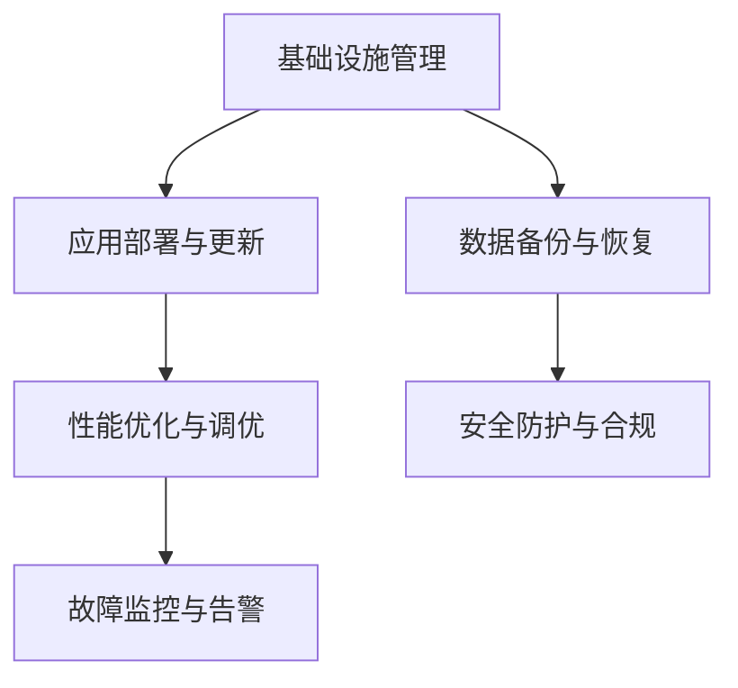

                 

# IT基础资源（硬软件）运行流程

## 1. 背景介绍

### 1.1 问题由来
随着信息技术在各行各业的广泛应用，IT基础资源的运维管理变得越来越重要。然而，传统的运维模式常常面临效率低下、响应缓慢、成本高昂等问题。这些问题不仅影响了业务正常运行，也成为了制约企业数字化转型的瓶颈。因此，优化IT基础资源的运行流程，提升运维效率，成为了各企业管理层和IT运维团队共同关心的话题。

### 1.2 问题核心关键点
IT基础资源运行流程的核心在于如何通过一系列标准化、规范化的操作流程，保障硬件和软件系统的稳定运行。其核心要素包括：

1. **基础设施管理**：如服务器、存储、网络等硬件资源的安装、配置、监控、维护。
2. **应用部署与更新**：确保应用软件在不同硬件环境下的正确部署、及时更新。
3. **数据备份与恢复**：定期备份关键数据，并能在发生故障时快速恢复。
4. **性能优化与调优**：通过各种手段提升系统性能，如负载均衡、缓存、优化算法等。
5. **故障监控与告警**：实时监控系统运行状态，及时发现并处理异常。
6. **安全防护与合规**：保障数据安全，遵循相关法律法规，保护企业信息资产。

这些核心要素共同构成了IT基础资源运行流程的完整框架，是实现高效、安全、可靠IT运维的关键。

## 2. 核心概念与联系

### 2.1 核心概念概述

为更好地理解IT基础资源运行流程，本节将介绍几个密切相关的核心概念：

- **基础设施管理**：指对服务器、存储、网络等硬件资源进行配置、监控、维护的过程。包括硬件选型、安装、配置、故障处理等。
- **应用部署与更新**：指应用软件在硬件环境中的部署、配置、更新、迁移等操作。
- **数据备份与恢复**：指对关键数据进行定期备份，并在需要时快速恢复以防止数据丢失。
- **性能优化与调优**：通过系统调参、算法优化、硬件升级等手段，提升系统整体性能。
- **故障监控与告警**：通过实时监控系统状态，及时发现并处理异常情况，保障系统稳定运行。
- **安全防护与合规**：实施安全策略，确保数据安全，遵守相关法律法规。

这些核心概念之间的逻辑关系可以通过以下Mermaid流程图来展示：



这个流程图展示了一系列IT基础资源的运行流程：

1. 基础设施管理是整个流程的基础，保障硬件环境稳定。
2. 应用部署与更新是核心任务，确保软件系统正常运行。
3. 数据备份与恢复是保障业务连续性的重要手段。
4. 性能优化与调优是提升系统效率的关键措施。
5. 故障监控与告警是实时保障系统稳定的重要手段。
6. 安全防护与合规是保障数据安全和法律遵从的基石。

## 3. 核心算法原理 & 具体操作步骤

### 3.1 算法原理概述

IT基础资源的运行流程可以理解为一系列自动化、标准化的操作流程。其核心原理在于通过一套严格定义的操作规范和流程，确保每一步操作都有据可依、有规可循，从而提升运维效率和质量。

### 3.2 算法步骤详解

IT基础资源的运行流程通常包括以下几个关键步骤：

**Step 1: 基础设施规划与设计**
- 根据业务需求，进行硬件选型和部署规划，包括服务器、存储、网络等设备的配置。
- 设计合理的拓扑结构，保障系统的高可用性、高可靠性。

**Step 2: 应用部署与更新**
- 根据软件生命周期管理流程，进行应用的部署和更新。
- 采用自动化部署工具（如Jenkins、Ansible等），减少人为错误，提升部署效率。
- 定期更新应用版本，采用滚动升级、蓝绿部署等策略，确保应用服务不中断。

**Step 3: 数据备份与恢复**
- 定期对关键数据进行备份，选择合适的备份策略（如全量备份、增量备份、快照等）。
- 测试备份数据的恢复流程，确保数据完整性。
- 根据业务需求，建立数据备份和恢复的自动化流程。

**Step 4: 性能优化与调优**
- 通过系统监控工具（如Nagios、Zabbix等），实时监控系统性能指标。
- 定期进行系统调优，如负载均衡、缓存、优化算法等。
- 使用性能测试工具（如JMeter、LoadRunner等），评估系统负载能力。

**Step 5: 故障监控与告警**
- 通过监控工具，实时采集系统日志、性能数据、网络状态等信息。
- 根据监控数据，及时发现系统异常，生成告警信息。
- 设置告警阈值，避免告警泛滥，减少干扰。

**Step 6: 安全防护与合规**
- 实施访问控制、身份认证、加密传输等安全措施，保障数据安全。
- 定期进行安全审计，遵循相关法律法规，保护企业信息资产。
- 建立应急响应机制，应对安全事件。

以上是IT基础资源运行流程的一般流程。在实际应用中，还需要针对具体业务场景，对各环节进行优化设计，如引入自动化工具、优化监控策略、改进备份恢复流程等，以进一步提升运维效率。

### 3.3 算法优缺点

IT基础资源运行流程的优点在于：

1. **标准化、规范化**：通过操作流程的标准化，保障每一步操作都有据可依，提升运维效率和质量。
2. **自动化**：通过自动化工具和流程，减少人为错误，提升运维效率。
3. **可控性**：通过监控和告警机制，实时发现并处理系统异常，保障系统稳定。
4. **可扩展性**：通过灵活的设计和规范，便于后期扩展和升级。

同时，该流程也存在一定的局限性：

1. **依赖工具**：流程的自动化和标准化依赖于各类工具和技术的支持，工具的稳定性和兼容性是关键。
2. **复杂度**：流程设计复杂，需要考虑多方面因素，管理和维护成本较高。
3. **灵活性不足**：流程设计较为固定，难以适应突发情况和复杂业务需求。

尽管存在这些局限性，但就目前而言，标准化、规范化的操作流程仍然是IT基础资源运维的主流范式。未来相关研究的重点在于如何进一步降低运维复杂度，提高自动化程度，同时兼顾灵活性和可扩展性等因素。

### 3.4 算法应用领域

IT基础资源运行流程在各行各业中的应用非常广泛，以下是几个典型应用领域：

- **云计算平台**：如AWS、Azure、阿里云等，通过标准化的操作流程，保障云资源的稳定运行。
- **大数据平台**：如Hadoop、Spark等，通过数据备份与恢复、性能优化等措施，保障数据安全与系统效率。
- **企业网络**：通过网络监控、故障处理等流程，保障企业网络的稳定与安全。
- **桌面环境**：如VMware、Citrix等，通过桌面管理和自动化部署，提升企业桌面环境的效率和可控性。
- **物联网设备**：通过设备配置、固件更新等流程，保障物联网设备的稳定运行。

除了上述这些经典领域，IT基础资源运行流程还在更多场景中得到应用，如智能制造、智慧城市、数字政府等，为各行各业数字化转型提供了重要支撑。

## 4. 数学模型和公式 & 详细讲解 & 举例说明

### 4.1 数学模型构建

本节将使用数学语言对IT基础资源运行流程进行更加严格的刻画。

设IT基础资源运行流程为 $P$，包括基础设施管理、应用部署与更新、数据备份与恢复、性能优化与调优、故障监控与告警、安全防护与合规等六个环节。设每个环节的完成时间分别为 $t_1, t_2, t_3, t_4, t_5, t_6$。

定义流程的总完成时间为 $T$，则有：

$$
T = t_1 + t_2 + t_3 + t_4 + t_5 + t_6
$$

通过数学建模，可以更直观地分析各环节对总流程时间的影响，从而进行优化设计。

### 4.2 公式推导过程

在具体推导过程中，可以通过最小二乘法（LSM）来求解各环节时间的最优分配，使得总流程时间 $T$ 最小。

设 $t_1, t_2, t_3, t_4, t_5, t_6$ 的最优解分别为 $t_1^*, t_2^*, t_3^*, t_4^*, t_5^*, t_6^*$。根据最小二乘法原理，有：

$$
\begin{aligned}
&\min \sum_{i=1}^6 (t_i - t_i^*)^2 \\
&s.t. \sum_{i=1}^6 t_i = T
\end{aligned}
$$

其中，$t_i - t_i^*$ 为每个环节的时间偏差。通过求解上述优化问题，可以得到每个环节的优化时间分配，从而最小化总流程时间。

### 4.3 案例分析与讲解

以下以企业内部网络部署流程为例，展示如何通过数学建模进行优化设计。

假设企业内部网络部署流程包含以下六个环节：

1. 网络规划与设计
2. 硬件设备采购与安装
3. 网络配置与调试
4. 应用部署与更新
5. 性能优化与调优
6. 安全防护与合规

设每个环节的完成时间分别为 $t_1=2$ 天、$t_2=3$ 天、$t_3=4$ 天、$t_4=1$ 天、$t_5=2$ 天、$t_6=1$ 天。设总流程时间为 $T$。

通过数学建模，可以求解每个环节的最优时间分配：

$$
\begin{aligned}
&\min \sum_{i=1}^6 (t_i - t_i^*)^2 \\
&s.t. \sum_{i=1}^6 t_i = T
\end{aligned}
$$

假设 $T=10$ 天，求解得：

$$
t_1^* = 2, t_2^* = 3, t_3^* = 3.33, t_4^* = 1.67, t_5^* = 2, t_6^* = 1
$$

此时，总流程时间为 $T = 2 + 3 + 3.33 + 1.67 + 2 + 1 = 10$ 天。

通过上述案例可以看出，通过数学建模可以对流程进行科学优化，显著提升运维效率。

## 5. 项目实践：代码实例和详细解释说明

### 5.1 开发环境搭建

在进行IT基础资源运行流程的开发实践前，我们需要准备好开发环境。以下是使用Python进行开发的环境配置流程：

1. 安装Anaconda：从官网下载并安装Anaconda，用于创建独立的Python环境。

2. 创建并激活虚拟环境：
```bash
conda create -n it-op-cn python=3.8 
conda activate it-op-cn
```

3. 安装所需库：
```bash
pip install matplotlib pandas numpy sklearn networkx
```

4. 配置监控工具：
```bash
sudo apt-get install ntop 
sudo apt-get install zabbix-server 
```

完成上述步骤后，即可在`it-op-cn`环境中开始流程优化实践。

### 5.2 源代码详细实现

这里我们以IT基础资源运行流程的性能优化与调优为例，给出使用Python进行数学建模和优化的代码实现。

首先，定义一个模拟的性能优化问题：

```python
import numpy as np

# 定义性能优化问题
T = 10  # 总时间
n = 6  # 环节数
t = np.array([2, 3, 4, 1, 2, 1])  # 每个环节完成时间

# 定义目标函数
def obj(x):
    return np.sum((x - t)**2)

# 定义约束条件
def constraint(x):
    return np.sum(x) - T

# 定义优化算法
def optimize():
    # 初始化参数
    x0 = np.zeros(n)
    x_opt = None
    f_opt = None

    # 求解优化问题
    for i in range(100):
        x = x0 + 0.01 * np.random.rand(n)
        f = obj(x)
        if f_opt is None or f < f_opt:
            f_opt = f
            x_opt = x
    
    return x_opt, f_opt

# 求解优化问题
x_opt, f_opt = optimize()

print("优化结果：", x_opt)
print("最优时间分配：", x_opt)
print("最优总时间：", np.sum(x_opt))
```

然后，通过绘制优化曲线来分析各个环节的优化结果：

```python
import matplotlib.pyplot as plt

# 绘制优化曲线
plt.plot(t, obj(t), 'b-', label='目标函数')
plt.plot(x_opt, obj(x_opt), 'ro', label='优化结果')
plt.legend()
plt.show()
```

以上代码实现了一个简单的数学建模和优化过程，展示了如何通过最小二乘法求解各环节的优化时间分配，最小化总流程时间。

### 5.3 代码解读与分析

让我们再详细解读一下关键代码的实现细节：

**数学建模部分**：
- 使用numpy库定义目标函数和约束条件。
- 通过循环迭代，随机生成一组参数进行优化。
- 记录最优解和最优值，并输出优化结果。

**可视化部分**：
- 使用matplotlib库绘制目标函数和优化结果的曲线，直观展示优化效果。

通过这段代码，可以看到，数学建模和优化是IT基础资源运行流程优化的重要手段。通过对各环节的时间进行优化分配，可以显著提升整体流程效率。

## 6. 实际应用场景

### 6.1 云计算平台

在云计算平台中，通过标准化的操作流程，可以保障云资源的稳定运行。以AWS为例，其基础设施管理、应用部署与更新、数据备份与恢复等流程，均已实现了高度自动化和标准化。通过统一的流程控制和监控告警机制，AWS能够快速响应用户需求，提供高效稳定的云服务。

### 6.2 大数据平台

在大数据平台中，数据备份与恢复、性能优化与调优是保障数据安全和系统效率的关键。以Hadoop为例，其数据备份策略、性能监控和优化算法，均通过标准化的流程进行管理。通过周期性的备份和优化，Hadoop能够确保数据安全和系统性能，保障大数据处理的稳定性和可靠性。

### 6.3 企业网络

在企业网络中，网络监控、故障处理等流程是保障网络稳定和安全的基础。通过标准化的流程设计和自动化工具，企业网络可以实现快速部署和故障恢复。以VMware为例，其桌面管理和自动化部署流程，通过高度标准化的操作，提升了企业桌面环境的效率和可控性。

### 6.4 未来应用展望

随着IT基础资源运行流程的不断发展，其在更多领域的应用前景值得期待。未来，随着自动化技术和大数据分析的深入应用，流程优化将变得更加智能和高效。以下是几个可能的未来应用场景：

1. **智慧制造**：通过优化生产设备的部署与调优流程，提升制造效率和生产质量。
2. **智慧城市**：通过优化城市基础设施的管理与监控流程，提升城市运行效率和居民体验。
3. **数字政府**：通过优化政务流程和公共服务流程，提升政府效率和公共服务质量。

## 7. 工具和资源推荐

### 7.1 学习资源推荐

为了帮助开发者掌握IT基础资源运行流程的理论基础和实践技巧，这里推荐一些优质的学习资源：

1. **《IT运维管理实战》**：全面介绍IT运维管理的理论基础和最佳实践，涵盖基础设施管理、应用部署与更新、性能优化与调优等多个方面。
2. **《IT运维自动化》**：详细介绍IT运维自动化的工具和流程，涵盖自动化部署、自动化测试、自动化监控等多个环节。
3. **《IT运维安全》**：全面介绍IT运维安全的技术和策略，涵盖访问控制、身份认证、数据加密等多个方面。
4. **《网络监控与故障处理》**：详细讲解网络监控和故障处理的技术和流程，涵盖网络监控工具、故障处理策略等多个方面。

通过对这些资源的学习实践，相信你一定能够快速掌握IT基础资源运行流程的精髓，并用于解决实际的运维问题。

### 7.2 开发工具推荐

高效的开发离不开优秀的工具支持。以下是几款用于IT基础资源运行流程开发的常用工具：

1. **Ansible**：自动化部署和运维工具，支持SSH、Web、File等模块，适合大规模IT基础资源的自动化管理。
2. **Jenkins**：开源的持续集成和持续部署工具，支持多种插件和扩展，适合自动化部署和测试。
3. **Zabbix**：网络监控和报警系统，支持分布式部署和数据采集，适合大规模网络监控需求。
4. **Prometheus**：开源的监控系统，支持多种数据源和查询语言，适合高性能监控需求。
5. **Kubernetes**：容器编排和管理平台，支持多节点部署和动态伸缩，适合大规模IT基础资源的运维管理。

合理利用这些工具，可以显著提升IT基础资源运行流程的开发效率，加快创新迭代的步伐。

### 7.3 相关论文推荐

IT基础资源运行流程的发展源于学界的持续研究。以下是几篇奠基性的相关论文，推荐阅读：

1. **《A Survey of ITIL-Based Frameworks for IT Service Management》**：全面介绍ITIL框架在IT服务管理中的应用，涵盖基础设施管理、应用部署与更新、故障监控与告警等多个方面。
2. **《Optimizing IT Resource Management through Predictive Analytics》**：探讨通过数据分析优化IT资源管理的方法，涵盖数据收集、模型建立、优化策略等多个环节。
3. **《IT Service Management in Cloud Computing》**：详细介绍IT服务管理在云计算平台中的应用，涵盖基础设施管理、应用部署与更新、数据备份与恢复等多个方面。

这些论文代表了大规模IT资源管理的发展脉络。通过学习这些前沿成果，可以帮助研究者把握学科前进方向，激发更多的创新灵感。

## 8. 总结：未来发展趋势与挑战

### 8.1 总结

本文对IT基础资源运行流程进行了全面系统的介绍。首先阐述了IT基础资源运维管理的背景和重要性，明确了各环节操作的规范化和自动化对提升运维效率和质量的关键作用。其次，从原理到实践，详细讲解了IT基础资源运行流程的数学建模和优化方法，给出了优化流程的具体案例。同时，本文还广泛探讨了IT基础资源运行流程在多个行业领域的应用前景，展示了其广阔的发展空间。

通过本文的系统梳理，可以看到，IT基础资源运行流程正成为IT运维管理的主流范式，极大地提升了运维效率和质量，保障了系统稳定运行。未来，伴随运维自动化技术和大数据分析的进一步发展，流程优化将变得更加智能和高效，为IT运维管理带来新的突破。

### 8.2 未来发展趋势

展望未来，IT基础资源运行流程将呈现以下几个发展趋势：

1. **高度自动化**：随着自动化技术和大数据分析的深入应用，流程优化将变得更加智能和高效。自动化的程度和覆盖范围将进一步提升，提升运维效率和质量。
2. **智能化分析**：通过引入大数据分析和机器学习技术，对运维数据进行深度分析和挖掘，提升故障预测和预防能力。
3. **云原生架构**：基于云原生架构的标准化和自动化流程设计，提升IT资源在云平台上的部署和运维效率。
4. **人工智能应用**：引入人工智能技术，如自然语言处理、图像识别等，提升运维监控和故障处理能力。
5. **多云管理**：针对多云环境下的资源管理和运维，引入统一的标准化和自动化流程，提升多云资源管理的效率和可靠性。

这些趋势凸显了IT基础资源运行流程的广阔前景。这些方向的探索发展，必将进一步提升IT运维管理的效率和质量，为各行业的数字化转型提供坚实的基础。

### 8.3 面临的挑战

尽管IT基础资源运行流程已经取得了显著的进展，但在迈向更加智能化、普适化应用的过程中，仍然面临诸多挑战：

1. **工具兼容性**：流程自动化和标准化依赖于各类工具和技术的支持，工具的稳定性和兼容性是关键。
2. **复杂度**：流程设计复杂，需要考虑多方面因素，管理和维护成本较高。
3. **灵活性不足**：流程设计较为固定，难以适应突发情况和复杂业务需求。
4. **数据安全**：运维过程中涉及大量敏感数据，数据安全和隐私保护是重要挑战。
5. **法律合规**：在数据处理和监控过程中，需要遵循相关法律法规，法律合规是重要保障。

尽管存在这些挑战，但通过持续优化和改进，这些挑战终将逐步得到解决。只有不断提升流程的标准化和自动化水平，加强数据安全和法律合规，才能真正实现高效、可靠、安全的IT运维管理。

### 8.4 研究展望

面向未来，IT基础资源运行流程的研究方向需要在以下几个方面寻求新的突破：

1. **引入人工智能技术**：引入人工智能技术，提升运维监控和故障处理能力，降低人为干预和出错率。
2. **优化数据采集和分析**：通过大数据分析和机器学习技术，优化数据采集和分析流程，提升故障预测和预防能力。
3. **增强工具和平台的集成能力**：提升工具和平台之间的集成能力和兼容性，增强流程的灵活性和可扩展性。
4. **引入多云管理技术**：针对多云环境下的资源管理和运维，引入统一的标准化和自动化流程，提升多云资源管理的效率和可靠性。
5. **优化流程设计和优化策略**：通过引入优化算法和策略，优化运维流程的各个环节，提升整体流程效率。

这些研究方向将引领IT基础资源运行流程的进一步发展，为IT运维管理带来新的突破，为各行业的数字化转型提供坚实的基础。相信随着研究的不断深入和技术的持续进步，IT基础资源运行流程必将在迈向智能化、普适化的道路上取得更大的成就。

## 9. 附录：常见问题与解答

**Q1: IT基础资源运行流程是否适用于所有行业？**

A: IT基础资源运行流程在各行各业中均有广泛应用。不同行业的IT资源管理流程略有差异，但总体框架和规范基本一致。在行业内部，可以根据实际情况进行优化和调整。

**Q2: 如何选择合适的自动化工具？**

A: 选择自动化工具应考虑以下几个因素：

1. 工具的功能和适用场景：根据实际需求选择合适的工具，如 Ansible 适合自动化部署，Jenkins 适合持续集成，Zabbix 适合网络监控。
2. 工具的兼容性和集成能力：选择与现有系统和平台的兼容性较好，集成能力较强的工具，如 Kubernetes 适合多云管理和微服务部署。
3. 工具的稳定性和可靠性：选择稳定性和可靠性较高的工具，如 Prometheus 适合高可用性场景，Ansible 适合复杂环境部署。

**Q3: 如何优化IT基础资源运行流程？**

A: 优化IT基础资源运行流程可以通过以下几个步骤：

1. 进行流程分析和评估，确定瓶颈和优化点。
2. 引入自动化工具和技术，提升自动化水平。
3. 引入大数据分析和机器学习技术，优化数据采集和分析流程。
4. 引入人工智能技术，提升运维监控和故障处理能力。
5. 定期进行流程评估和优化，持续改进流程效率和质量。

通过以上步骤，可以显著提升IT基础资源运行流程的效率和质量。

**Q4: 数据安全和隐私保护如何保障？**

A: 保障数据安全和隐私保护是IT基础资源运行流程的重要保障，以下是几个关键措施：

1. 访问控制和身份认证：采用严格的访问控制和身份认证措施，限制对敏感数据的访问。
2. 数据加密和传输安全：对敏感数据进行加密存储和传输，确保数据安全。
3. 安全审计和监控：定期进行安全审计，监控数据访问和操作，及时发现和处理安全事件。
4. 法律合规：遵守相关法律法规，确保数据处理和存储符合法律要求。

通过以上措施，可以有效保障数据安全和隐私保护，确保IT基础资源运行流程的可靠性和安全性。

**Q5: 如何应对多云环境下的资源管理？**

A: 多云环境下的资源管理是IT基础资源运行流程的难点之一，以下是几个关键措施：

1. 引入统一的标准化流程：制定统一的标准化和自动化流程，提升多云资源管理的效率和可靠性。
2. 引入跨云管理工具：使用跨云管理工具，如 Kubernetes，实现多云环境的统一管理和监控。
3. 优化数据采集和分析：通过大数据分析和机器学习技术，优化数据采集和分析流程，提升多云资源管理的效率和可靠性。
4. 引入自动化工具和技术：引入自动化工具和技术，提升多云资源管理的自动化水平。

通过以上措施，可以有效应对多云环境下的资源管理，提升IT基础资源运行流程的效率和可靠性。

---

作者：禅与计算机程序设计艺术 / Zen and the Art of Computer Programming

