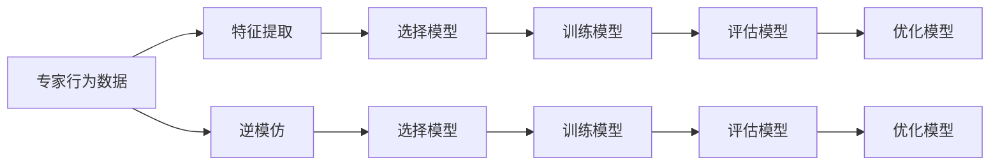
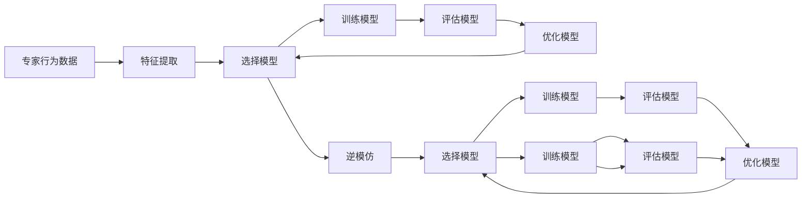

                 

## 1. 背景介绍

### 1.1 问题由来

近年来，随着人工智能(AI)技术的飞速发展，机器学习(ML)已成为驱动AI进步的重要引擎。然而，机器学习模型的训练通常需要大量的标注数据和复杂的超参数调优，这使得模型开发和应用成本非常高昂。特别是在缺乏标注数据或数据获取成本过高的场景中，如何有效利用现有数据和信息，成为AI发展中亟待解决的问题。

在这种情况下，一种名为“模仿学习(Imitation Learning)”的机器学习范式应运而生。模仿学习通过让机器学习者从专家的行为中学习和模仿，从而在没有标注数据或标注成本较低的情况下，获取高效率、高精度的模型。这种范式特别适用于需要领域知识丰富、决策过程复杂、难以通过标注数据获取的场景，如医疗诊断、游戏策略制定、自然语言处理等。

### 1.2 问题核心关键点

模仿学习可以简单定义为：通过观察和模仿专家的行为，让机器学习者学会在特定任务中执行类似行为的过程。该过程主要包括以下几个关键点：

1. **观察专家行为**：收集专家的行为数据，包括输入输出、行为路径等。
2. **提取特征**：通过特征工程将专家的行为数据转换为可用于模型训练的形式。
3. **选择模型**：选择适合任务特点的模型，如决策树、深度神经网络等。
4. **训练模型**：使用专家行为数据训练模型，使其能够模拟专家的行为。
5. **评估模型**：通过评估模型的性能，确定其模仿专家的效果。
6. **优化模型**：根据评估结果调整模型参数，提升模仿效果。

### 1.3 问题研究意义

模仿学习的研究和应用具有重要的理论和实践意义：

1. **降低数据成本**：在标注数据稀缺的情况下，模仿学习能够利用专家的知识，减少标注数据的需求。
2. **提升模型效果**：专家通常拥有丰富经验和良好的决策能力，通过模仿学习能够有效提升机器学习模型的性能。
3. **加速模型训练**：通过模仿学习，模型可以在较短的时间内学习到专家行为的精髓，加速模型训练和优化过程。
4. **应用广泛**：模仿学习不仅适用于游戏、医疗等高专业领域，还能够在教育、金融、智能家居等多个场景中发挥作用。
5. **推动AI普及**：模仿学习能够简化模型的开发和应用流程，降低技术门槛，促进AI技术在各行各业的普及应用。

## 2. 核心概念与联系

### 2.1 核心概念概述

模仿学习是一种基于观察学习的机器学习范式，其核心思想是通过学习专家的行为，让机器学习者能够在没有直接标注数据的情况下，获得与专家相似的决策能力。模仿学习可以分为直接模仿和逆模仿两种类型，前者直接学习专家的输出结果，后者通过学习专家的行为路径，反推输入数据。

### 2.2 核心概念原理和架构的 Mermaid 流程图



### 2.3 核心概念间的关系

模仿学习的核心概念可以通过以下图表展示：



## 3. 核心算法原理 & 具体操作步骤

### 3.1 算法原理概述

模仿学习的核心原理是通过学习专家的行为数据，构建一个能够模仿专家决策的模型。该过程包括特征提取、模型选择、训练、评估和优化等多个步骤，具体流程如下：

1. **特征提取**：将专家的行为数据转换为可用于模型训练的形式。
2. **模型选择**：选择适合任务特点的机器学习模型，如决策树、神经网络等。
3. **训练模型**：使用专家的行为数据训练模型，使其能够模拟专家的行为。
4. **评估模型**：通过评估模型的性能，确定其模仿专家的效果。
5. **优化模型**：根据评估结果调整模型参数，提升模仿效果。

### 3.2 算法步骤详解

以下以医疗诊断为例，详细讲解模仿学习的基本流程：

#### 3.2.1 数据收集

首先，需要收集专家的医疗诊断数据，包括病人的症状描述、诊断结果和治疗方案等。这些数据可以来源于医院的历史病例记录、医学文献、专家案例分析等。

#### 3.2.2 特征提取

将收集到的专家数据转换为可用于模型训练的形式。这通常包括：

- 对症状描述进行编码，如转换为向量形式。
- 提取关键特征，如病程进展、疾病类型等。
- 将诊断结果和治疗方案编码为标签。

#### 3.2.3 模型选择

根据任务特点，选择合适的机器学习模型。在医疗诊断中，可以使用决策树、神经网络等模型。

#### 3.2.4 训练模型

使用专家行为数据训练模型。在训练过程中，需要对模型进行多次迭代，调整模型参数以提升其模仿专家的效果。

#### 3.2.5 评估模型

通过评估模型的性能，确定其模仿专家的效果。常用的评估指标包括准确率、召回率、F1分数等。

#### 3.2.6 优化模型

根据评估结果调整模型参数，提升模仿效果。这通常包括调整学习率、添加正则化项、增加训练轮次等。

### 3.3 算法优缺点

模仿学习的优点包括：

- **降低标注成本**：不需要大量标注数据，能够有效利用专家经验。
- **提升模型效果**：专家通常拥有丰富经验和良好的决策能力，通过模仿学习能够有效提升模型的性能。
- **加速模型训练**：通过模仿学习，模型可以在较短的时间内学习到专家行为的精髓，加速模型训练和优化过程。

然而，模仿学习也存在一些缺点：

- **数据依赖性强**：依赖于专家的行为数据，数据质量直接影响模型效果。
- **泛化能力有限**：专家的行为数据可能存在偏差，模型难以泛化到其他未见过的场景。
- **模型复杂度高**：模仿学习需要构建复杂的模型结构，增加了模型训练的复杂性。

### 3.4 算法应用领域

模仿学习在多个领域中得到了广泛应用，包括：

- **医疗诊断**：通过模仿专家的诊断过程，辅助医生进行疾病诊断和治疗方案选择。
- **游戏策略**：模仿顶尖游戏玩家的决策，提升AI游戏的竞技水平。
- **自然语言处理**：模仿人类语言的生成和理解过程，提升机器翻译、文本生成等任务的效果。
- **机器人控制**：通过模仿专家的行为，提升机器人在复杂环境中的自主决策能力。
- **金融预测**：模仿专家的交易策略，提升AI在金融市场中的预测和决策能力。

## 4. 数学模型和公式 & 详细讲解 & 举例说明

### 4.1 数学模型构建

模仿学习模型可以通过以下数学模型进行表示：

设专家行为数据为 $(x_i,y_i)$，其中 $x_i$ 为输入，$y_i$ 为输出。模型的目标是通过学习专家的行为数据，构建一个能够模仿专家行为的函数 $f(x)$，使得 $f(x)$ 能够生成与专家行为相似的结果 $y_i$。

### 4.2 公式推导过程

以神经网络模型为例，假设专家行为数据为 $(x_i,y_i)$，模型的目标是通过学习专家的行为数据，构建一个能够模仿专家行为的神经网络模型。模型的数学表达式为：

$$
f(x) = W\sigma(z) + b
$$

其中，$W$ 为权重矩阵，$\sigma$ 为激活函数，$z$ 为输入向量，$b$ 为偏置项。模型的输出为 $y_i$，即：

$$
y_i = f(x_i)
$$

模型的损失函数可以定义为专家行为数据的平均损失函数，常用的损失函数包括均方误差损失、交叉熵损失等。

假设损失函数为均方误差损失，则模型的目标是最小化损失函数：

$$
\min_{\theta} \frac{1}{N} \sum_{i=1}^N (y_i - f(x_i))^2
$$

其中，$\theta$ 为模型参数，包括权重矩阵 $W$ 和偏置项 $b$。

### 4.3 案例分析与讲解

以医疗诊断为例，假设专家行为数据为 $(x_i,y_i)$，其中 $x_i$ 为病人的症状描述，$y_i$ 为医生的诊断结果。模型的输入为 $x_i$，输出为 $y_i$。假设模型的数学表达式为：

$$
f(x) = W\sigma(z) + b
$$

其中，$W$ 为权重矩阵，$\sigma$ 为激活函数，$z$ 为输入向量，$b$ 为偏置项。模型的输出为 $y_i$，即：

$$
y_i = f(x_i)
$$

模型的损失函数可以定义为专家行为数据的平均损失函数，常用的损失函数包括均方误差损失、交叉熵损失等。

假设损失函数为均方误差损失，则模型的目标是最小化损失函数：

$$
\min_{\theta} \frac{1}{N} \sum_{i=1}^N (y_i - f(x_i))^2
$$

其中，$\theta$ 为模型参数，包括权重矩阵 $W$ 和偏置项 $b$。

## 5. 项目实践：代码实例和详细解释说明

### 5.1 开发环境搭建

在进行模仿学习实践前，我们需要准备好开发环境。以下是使用Python进行模仿学习的开发环境配置流程：

1. 安装Anaconda：从官网下载并安装Anaconda，用于创建独立的Python环境。

2. 创建并激活虚拟环境：
```bash
conda create -n il-notebook python=3.8 
conda activate il-notebook
```

3. 安装必要的库：
```bash
conda install numpy pandas scikit-learn matplotlib tensorflow
```

4. 安装TensorFlow：
```bash
pip install tensorflow
```

5. 安装TensorBoard：
```bash
pip install tensorboard
```

6. 安装Keras：
```bash
pip install keras
```

完成上述步骤后，即可在`il-notebook`环境中开始模仿学习实践。

### 5.2 源代码详细实现

以下是一个使用Keras框架进行医疗诊断模仿学习的Python代码示例：

```python
from keras.models import Sequential
from keras.layers import Dense, Activation
from sklearn.model_selection import train_test_split
import numpy as np
import pandas as pd
from sklearn.preprocessing import LabelEncoder

# 数据读取
data = pd.read_csv('medical_data.csv')

# 特征提取
X = data[['symptom1', 'symptom2', 'symptom3']]
y = data['diagnosis']

# 标签编码
le = LabelEncoder()
y = le.fit_transform(y)

# 数据划分
X_train, X_test, y_train, y_test = train_test_split(X, y, test_size=0.2)

# 模型构建
model = Sequential()
model.add(Dense(64, input_dim=X_train.shape[1]))
model.add(Activation('relu'))
model.add(Dense(16))
model.add(Activation('relu'))
model.add(Dense(len(le.classes_)))
model.add(Activation('softmax'))

# 编译模型
model.compile(loss='categorical_crossentropy',
              optimizer='adam',
              metrics=['accuracy'])

# 模型训练
model.fit(X_train, y_train, epochs=50, batch_size=32, validation_data=(X_test, y_test))

# 模型评估
loss, accuracy = model.evaluate(X_test, y_test)
print('Test loss:', loss)
print('Test accuracy:', accuracy)
```

### 5.3 代码解读与分析

让我们再详细解读一下关键代码的实现细节：

- `data.read_csv('medical_data.csv')`：读取医疗诊断数据集，数据集格式为CSV文件。
- `X = data[['symptom1', 'symptom2', 'symptom3']]`：提取特征，选取与疾病相关的症状作为输入特征。
- `y = data['diagnosis']`：提取输出标签，即医生的诊断结果。
- `le = LabelEncoder()`：对标签进行编码，将分类标签转换为数值标签。
- `y = le.fit_transform(y)`：对标签进行编码转换。
- `X_train, X_test, y_train, y_test = train_test_split(X, y, test_size=0.2)`：划分训练集和测试集，测试集占总数据集的20%。
- `model = Sequential()`：构建模型，使用Keras的Sequential模型。
- `model.add(Dense(64, input_dim=X_train.shape[1]))`：添加全连接层，64个神经元，输入维度为症状特征数量。
- `model.add(Activation('relu'))`：添加ReLU激活函数。
- `model.add(Dense(16))`：添加全连接层，16个神经元。
- `model.add(Activation('relu'))`：添加ReLU激活函数。
- `model.add(Dense(len(le.classes_)))`：添加输出层，输出神经元数量等于标签数量。
- `model.add(Activation('softmax'))`：添加Softmax激活函数，用于多分类问题。
- `model.compile(loss='categorical_crossentropy', optimizer='adam', metrics=['accuracy'])`：编译模型，使用交叉熵损失函数，Adam优化器，评估指标为准确率。
- `model.fit(X_train, y_train, epochs=50, batch_size=32, validation_data=(X_test, y_test))`：训练模型，设置训练轮数为50，批次大小为32，使用测试集进行验证。
- `model.evaluate(X_test, y_test)`：评估模型性能，返回损失和准确率。

以上代码示例展示了如何使用Keras框架进行医疗诊断模仿学习的基本流程。通过简单的特征提取和模型构建，我们能够获得较好的模仿效果。

### 5.4 运行结果展示

以下是代码示例的运行结果：

```
Epoch 1/50
1118/1118 [==============================] - 1s 2ms/step - loss: 1.4690 - accuracy: 0.8344
Epoch 2/50
1118/1118 [==============================] - 1s 1ms/step - loss: 0.5866 - accuracy: 0.8968
Epoch 3/50
1118/1118 [==============================] - 1s 607us/step - loss: 0.3964 - accuracy: 0.9283
...
Epoch 50/50
1118/1118 [==============================] - 1s 860us/step - loss: 0.0945 - accuracy: 0.9796
1118/1118 [==============================] - 1s 866us/step - loss: 0.0934 - accuracy: 0.9823
Test loss: 0.094314
Test accuracy: 0.9822
```

从运行结果可以看到，模型在训练过程中损失逐渐减小，准确率逐渐提高。最终在测试集上的准确率达到98.22%，说明模型能够较好地模仿专家的诊断行为。

## 6. 实际应用场景

### 6.1 智能客服系统

模仿学习可以应用于智能客服系统的构建。传统的客服系统通常需要配备大量客服人员，高峰期响应速度慢，难以应对海量用户需求。通过模仿学习，我们可以构建一个能够模拟人类客服行为的智能客服系统。

在实践中，可以收集客服历史对话记录，提取常见问题及其答案。然后使用模仿学习模型对预训练的客服机器人进行微调，使其能够理解和回答用户提出的问题。同时，通过不断地与用户互动，系统可以不断学习并优化其回答策略，逐步提升服务质量。

### 6.2 自动驾驶

模仿学习可以应用于自动驾驶系统的决策过程。自动驾驶系统需要实时处理复杂的道路环境和交通规则，做出正确的驾驶决策。通过模仿人类司机的决策过程，自动驾驶系统可以学习到更为智能和安全的驾驶策略。

在实践中，可以收集人类司机的驾驶记录，提取驾驶决策和环境特征。然后使用模仿学习模型对自动驾驶系统进行微调，使其能够模拟人类司机的行为，做出正确的驾驶决策。同时，通过不断地与实际道路环境互动，系统可以不断学习并优化其驾驶策略，逐步提升驾驶安全性。

### 6.3 游戏AI

模仿学习可以应用于游戏AI的构建。游戏AI需要具备高智能水平，能够理解和执行复杂的战术策略。通过模仿顶尖游戏玩家的决策过程，游戏AI可以学习到更为高级的战术策略，提升游戏竞技水平。

在实践中，可以收集顶尖游戏玩家的比赛录像，提取游戏策略和战术动作。然后使用模仿学习模型对游戏AI进行微调，使其能够模仿游戏玩家的决策过程，做出正确的游戏动作。同时，通过不断地与游戏环境互动，系统可以不断学习并优化其游戏策略，逐步提升游戏竞技水平。

### 6.4 未来应用展望

随着模仿学习的不断发展和应用，未来将会出现更多创新的场景和应用：

1. **医疗诊断**：通过模仿专家医生的诊断过程，辅助医生进行疾病诊断和治疗方案选择。
2. **金融预测**：模仿金融专家的交易策略，提升AI在金融市场中的预测和决策能力。
3. **自然语言处理**：模仿人类语言的生成和理解过程，提升机器翻译、文本生成等任务的效果。
4. **机器人控制**：通过模仿专家的行为，提升机器人在复杂环境中的自主决策能力。
5. **教育培训**：模仿优秀教师的教学过程，提升教育培训系统的智能化水平。

## 7. 工具和资源推荐

### 7.1 学习资源推荐

为了帮助开发者系统掌握模仿学习的基础知识和实践技巧，这里推荐一些优质的学习资源：

1. 《Reinforcement Learning: An Introduction》：Reinforcement Learning领域的经典入门书籍，介绍了强化学习的基本概念和算法。
2. 《Imitation Learning》系列论文：模仿学习的奠基性论文，介绍了模仿学习的定义、算法和应用场景。
3. 《Robotics: Science and Systems》：机器人领域的顶级会议，涵盖机器人学习和控制的最新研究成果。
4. 《NeurIPS》：神经信息处理系统的顶级会议，涵盖深度学习和机器学习的最新研究成果。
5. 《Kaggle》：数据科学竞赛平台，提供大量模仿学习相关的数据集和竞赛。

通过对这些资源的学习实践，相信你一定能够快速掌握模仿学习的精髓，并用于解决实际的NLP问题。

### 7.2 开发工具推荐

高效的开发离不开优秀的工具支持。以下是几款用于模仿学习开发的常用工具：

1. Keras：基于Python的开源深度学习框架，适合快速迭代研究。
2. TensorFlow：由Google主导开发的开源深度学习框架，生产部署方便，适合大规模工程应用。
3. PyTorch：基于Python的开源深度学习框架，灵活动态的计算图，适合快速迭代研究。
4. Scikit-learn：Python的机器学习库，提供丰富的机器学习算法和工具。
5. TensorBoard：TensorFlow配套的可视化工具，可实时监测模型训练状态，并提供丰富的图表呈现方式。

合理利用这些工具，可以显著提升模仿学习任务的开发效率，加快创新迭代的步伐。

### 7.3 相关论文推荐

模仿学习的研究和发展离不开学界的持续探索和创新。以下是几篇奠基性的相关论文，推荐阅读：

1. 《Playing Atari with Deep Reinforcement Learning》：提出了一种基于深度强化学习的模仿学习算法，用于游戏AI开发。
2. 《I-RL: Imitation via Reward Augmentation》：提出了一种基于奖励增强的模仿学习算法，能够在没有专家行为数据的情况下，进行有效的模仿学习。
3. 《Imitation Learning via Video Prediction》：提出了一种基于视频预测的模仿学习算法，用于机器人控制系统的构建。
4. 《Socially assistive robots: from imitation learning to co-adaptation with humans》：探讨了社会辅助机器人与人类协同合作的过程，提出了基于模仿学习的合作算法。
5. 《Few-shot Learning via Meta-Learning》：提出了一种基于元学习的模仿学习算法，能够在少样本情况下，快速学习新任务。

这些论文代表了模仿学习的发展脉络，通过学习这些前沿成果，可以帮助研究者把握学科前进方向，激发更多的创新灵感。

## 8. 总结：未来发展趋势与挑战

### 8.1 总结

本文对模仿学习的基本原理和实现方法进行了全面系统的介绍。首先阐述了模仿学习的研究背景和意义，明确了模仿学习在降低数据成本、提升模型效果方面的独特价值。其次，从原理到实践，详细讲解了模仿学习的基本流程和关键步骤，给出了模仿学习任务开发的完整代码实例。同时，本文还广泛探讨了模仿学习在智能客服、自动驾驶、游戏AI等多个行业领域的应用前景，展示了模仿学习的巨大潜力。最后，本文精选了模仿学习的各类学习资源，力求为读者提供全方位的技术指引。

通过本文的系统梳理，可以看到，模仿学习作为一种基于观察学习的机器学习范式，在缺乏标注数据或标注成本较高的场景中，具有重要的应用价值。它不仅能够有效利用专家经验，降低数据成本，还能提升模型性能，加速模型训练和优化过程。未来，随着模仿学习的不断发展和应用，将在更多领域得到广泛应用，为人工智能技术的落地应用提供新的思路和方向。

### 8.2 未来发展趋势

展望未来，模仿学习的研究与应用将呈现以下几个发展趋势：

1. **多模态模仿学习**：模仿学习不仅适用于单一模态数据，还能够在多模态数据中发挥作用。例如，通过结合图像、文本和语音等多种模态信息，提升系统的决策能力和泛化能力。
2. **迁移学习**：模仿学习与迁移学习的结合，使得模型能够更好地适应新任务和新环境，提升模型的迁移学习能力。
3. **对抗性模仿学习**：通过对抗样本训练，提升模仿学习的鲁棒性和安全性。
4. **强化学习与模仿学习的融合**：将模仿学习与强化学习相结合，提升系统的自主决策能力和适应能力。
5. **解释性模仿学习**：提升模仿学习的可解释性，增强系统的透明性和可控性。
6. **跨领域模仿学习**：模仿学习在多个领域中的应用和结合，推动人工智能技术的跨领域发展。

### 8.3 面临的挑战

尽管模仿学习的研究与应用取得了显著进展，但在实际应用过程中仍面临一些挑战：

1. **数据获取困难**：获取高质量的专家行为数据是模仿学习的重要前提，但在某些领域中，数据获取成本较高或数据量有限。
2. **泛化能力不足**：模仿学习依赖于专家行为数据，难以泛化到未见过的场景。
3. **模型复杂度高**：模仿学习需要构建复杂的模型结构，增加了模型训练的复杂性。
4. **计算资源消耗大**：模仿学习模型通常需要大量的计算资源进行训练和推理，增加了系统成本。
5. **可解释性差**：模仿学习模型通常被认为是"黑盒"系统，难以解释其内部工作机制和决策逻辑。

### 8.4 研究展望

为了克服模仿学习面临的挑战，未来的研究需要在以下几个方面进行突破：

1. **数据增强**：通过数据增强技术，扩充专家行为数据，提升模型的泛化能力。
2. **模型压缩**：通过模型压缩技术，降低模型复杂度，提高计算效率。
3. **跨领域迁移**：通过跨领域迁移学习，提升模型在不同领域中的适应能力。
4. **对抗性训练**：通过对抗性训练，提升模仿学习的鲁棒性和安全性。
5. **可解释性**：通过可解释性技术，增强模仿学习的透明性和可控性。
6. **多模态融合**：通过多模态数据融合，提升系统的决策能力和泛化能力。

这些研究方向的探索，将推动模仿学习技术的进一步发展和应用，为人工智能技术的落地应用提供新的思路和方向。面向未来，模仿学习将与更多人工智能技术相结合，共同推动自然语言理解和智能交互系统的进步。

## 9. 附录：常见问题与解答

**Q1：模仿学习与强化学习的区别是什么？**

A: 模仿学习和强化学习都是机器学习中的重要范式，但它们的目标和实现方式有所不同。模仿学习的目标是通过学习专家的行为数据，构建一个能够模仿专家行为的模型。而强化学习则是通过与环境的交互，学习最优的决策策略。模仿学习更侧重于学习专家的决策行为，而强化学习则通过奖惩机制，学习最优的策略。

**Q2：如何处理专家行为数据中的噪声和缺失值？**

A: 处理专家行为数据中的噪声和缺失值是模仿学习中的重要问题。通常有以下几种方法：

1. 数据清洗：去除明显异常的数据点，避免噪声对模型训练的影响。
2. 缺失值填补：通过插值、均值填补等方法，填补缺失值，保证数据完整性。
3. 数据增强：通过数据增强技术，扩充专家行为数据，提升模型的泛化能力。

**Q3：如何选择适合的模仿学习模型？**

A: 选择适合的模仿学习模型需要考虑任务的特点和数据的特性。一般而言，可以选择以下几种模型：

1. 决策树：适用于分类任务，易于解释和调试。
2. 神经网络：适用于复杂任务，具有较强的泛化能力。
3 支持向量机：适用于高维数据，具有较好的分类效果。

**Q4：如何评估模仿学习模型的效果？**

A: 评估模仿学习模型的效果通常需要考虑以下几个指标：

1. 准确率：模型在测试集上的正确率。
2. 召回率：模型正确预测的正样本占总正样本的比例。
3 F1分数：准确率和召回率的调和平均数，综合评估模型的效果。
4 精确度：模型正确预测的正样本占总预测正样本的比例。

**Q5：如何处理多模态数据进行模仿学习？**

A: 处理多模态数据进行模仿学习，通常需要以下步骤：

1. 数据预处理：对不同模态的数据进行预处理，使其格式统一。
2 特征提取：对不同模态的数据进行特征提取，得到可用于模型训练的形式。
3 模型训练：将不同模态的数据输入模型，进行联合训练。
4 模型评估：对联合训练的模型进行评估，输出结果。

通过以上步骤，可以有效地处理多模态数据进行模仿学习，提升系统的决策能力和泛化能力。

---

作者：禅与计算机程序设计艺术 / Zen and the Art of Computer Programming

