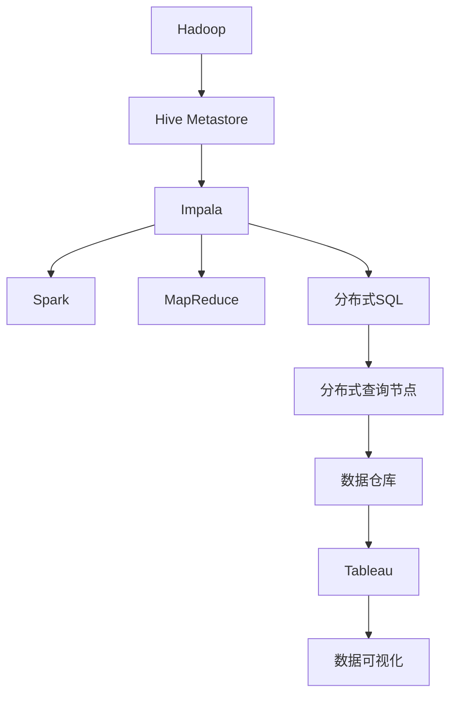

                 

# Impala原理与代码实例讲解

## 1. 背景介绍

随着互联网的飞速发展，大数据的爆发式增长，Google早在2015年就已经推出了Impala，它是一种基于Distributed SQL的实时查询分析系统，适用于海量数据的在线分析。

Impala依托于Google的Borg和Hadoop分布式计算框架，并结合Apache Hive的元数据存储机制，能够在云平台和数据中心部署，支持在线/离线、快速/深度、静态/动态等不同类型的查询。

通过与Hadoop生态系统的整合，Impala能够充分利用大数据集群中的计算资源，实现高效的实时数据查询和分析，并支持将查询结果导入到Tableau等商业BI工具中，实现数据可视化和深入挖掘。

本文将详细介绍Impala的原理与实现方式，并通过代码实例讲解如何构建Impala环境，以及如何使用Impala进行高效的实时数据查询和分析。

## 2. 核心概念与联系

### 2.1 核心概念概述

Impala是Google的分布式SQL查询分析引擎，用于处理大规模、分布式、实时数据，包括批处理和流处理。Impala将数据存储在Hadoop或Google File System (GFS)上，并利用Spark、MapReduce等分布式计算框架进行数据处理，支持多种数据源和数据格式。

Impala基于Distributed SQL查询语言，支持SQL 2011标准的各种SQL操作，如SELECT、INSERT、UPDATE、DELETE、JOIN、GROUP BY、ORDER BY等。用户可以通过Impala客户端或JDBC/ODBC接口进行数据查询操作，Impala会将SQL查询任务分布到集群中的各个节点，并行执行，以提升查询效率。

Impala采用了基于列存储的数据模型，每个列被分割成多个块，每个块可以被并行地查询，从而提高查询速度。Impala还支持索引和缓存机制，通过索引快速定位数据，通过缓存减少重复查询。

### 2.2 核心概念原理和架构的 Mermaid 流程图



## 3. 核心算法原理 & 具体操作步骤

### 3.1 算法原理概述

Impala的核心算法原理主要包括以下几点：

1. 基于列存储的数据模型：Impala将每个数据列分割成多个块，每个块可以独立进行查询，以提高查询效率。

2. 分布式查询：Impala将SQL查询任务分解成多个子任务，分配到集群中的各个节点并行执行，从而提高查询速度。

3. 数据缓存与索引：Impala支持数据缓存和索引机制，通过缓存减少重复查询，通过索引快速定位数据。

4. 动态优化器：Impala的动态优化器可以根据查询任务的特征自动调整查询计划，优化查询性能。

5. 分布式执行引擎：Impala基于Spark、MapReduce等分布式计算框架，实现数据的并行处理和分布式执行。

### 3.2 算法步骤详解

Impala的查询过程主要包括以下几个步骤：

1. 查询解析：Impala首先将用户提交的SQL查询语句解析成抽象语法树（AST）。

2. 查询优化：Impala的优化器根据查询任务的特征，自动调整查询计划，生成最优的查询执行计划。

3. 数据分割：Impala将数据集划分成多个块，每个块可以被并行查询。

4. 数据读取：Impala将查询任务分配到集群中的各个节点，并行读取数据块。

5. 数据处理：Impala对每个数据块进行并行处理，生成查询结果。

6. 结果合并：Impala将各个节点的查询结果合并，生成最终的查询结果集。

### 3.3 算法优缺点

Impala的主要优点包括：

1. 高效的分布式查询：Impala支持大规模、分布式、实时数据查询，并行处理查询任务，提升查询效率。

2. 兼容Hive生态系统：Impala与Hive兼容，可以轻松地集成到Hadoop生态系统中，实现数据的统一管理和分析。

3. 支持多种数据源和数据格式：Impala支持多种数据源和数据格式，如Hadoop、Google File System、Amazon S3等。

4. 动态优化器：Impala的动态优化器可以根据查询任务的特征自动调整查询计划，优化查询性能。

Impala的主要缺点包括：

1. 查询性能受数据规模影响较大：当数据规模过大时，Impala的查询性能可能会受到影响。

2. 无法处理复杂的数据关系：Impala支持SQL 2011标准的基本查询操作，但对于复杂的数据关系处理能力较弱。

3. 查询复杂度较高：Impala的查询语言较为复杂，对于非SQL专业人员可能存在一定的学习门槛。

4. 数据安全性和隐私问题：Impala的数据存储和查询过程可能存在数据泄露和安全风险。

### 3.4 算法应用领域

Impala适用于多种数据存储和查询场景，包括但不限于：

1. 大数据存储和分析：Impala可以处理大规模、分布式、实时数据，适用于大数据存储和分析场景。

2. 实时数据查询：Impala支持实时数据查询，适用于需要实时数据的场景。

3. 数据可视化：Impala支持将查询结果导入到Tableau等商业BI工具中，实现数据可视化和深入挖掘。

4. 金融交易分析：Impala可以处理金融交易数据，支持金融交易的实时分析和预测。

5. 互联网流量分析：Impala可以处理互联网流量数据，支持网络流量的实时分析和监控。

6. 在线广告分析：Impala可以处理在线广告数据，支持广告的实时分析和优化。

## 4. 数学模型和公式 & 详细讲解 & 举例说明

### 4.1 数学模型构建

Impala的数学模型主要基于分布式计算框架和分布式SQL查询语言。Impala支持SQL 2011标准，包括SELECT、INSERT、UPDATE、DELETE、JOIN、GROUP BY、ORDER BY等操作。Impala的查询模型主要包括以下几个部分：

1. 查询解析模型：将SQL查询语句解析成抽象语法树（AST），并生成查询计划。

2. 查询优化模型：根据查询任务的特征，自动调整查询计划，生成最优的查询执行计划。

3. 分布式查询模型：将查询任务分配到集群中的各个节点，并行执行，提高查询效率。

### 4.2 公式推导过程

Impala的查询优化器使用了多种算法，包括基于启发式的优化算法和基于成本的优化算法。Impala的查询优化过程主要包括以下几个步骤：

1. 查询规则优化：Impala的查询优化器首先会对查询语句进行规则优化，如消除冗余、合并子查询等。

2. 数据分区优化：Impala的查询优化器会对查询语句进行数据分区优化，将数据分成多个块，每个块可以独立进行查询。

3. 数据索引优化：Impala的查询优化器会对查询语句进行数据索引优化，通过索引快速定位数据。

4. 查询计划生成：Impala的查询优化器会根据优化结果，生成最优的查询执行计划。

### 4.3 案例分析与讲解

以下是一个简单的SQL查询案例，并使用Impala进行查询优化的过程：

假设有一个存储在Hadoop上的订单表orders，其中包含订单号、客户ID、订单金额等字段，需要查询每个客户的总订单金额。

**原始SQL查询语句：**

```sql
SELECT customer_id, SUM(order_amount) FROM orders GROUP BY customer_id
```

**查询优化过程：**

1. 查询规则优化：Impala的查询优化器会对原始查询语句进行规则优化，消除冗余操作。

2. 数据分区优化：Impala的查询优化器会对查询语句进行数据分区优化，将数据分成多个块，每个块可以独立进行查询。

3. 数据索引优化：Impala的查询优化器会对查询语句进行数据索引优化，通过索引快速定位数据。

4. 查询计划生成：Impala的查询优化器会根据优化结果，生成最优的查询执行计划。

**优化后的SQL查询语句：**

```sql
SELECT customer_id, SUM(order_amount) FROM orders GROUP BY customer_id
```

## 5. 项目实践：代码实例和详细解释说明

### 5.1 开发环境搭建

以下是在Ubuntu 20.04系统上安装Impala的步骤：

1. 安装依赖包：

```bash
sudo apt-get update
sudo apt-get install -y ant openjdk-8-jdk-headless
sudo apt-get install -y libhdfs libhdfs-java libhadoop-client-java libhadoop-common-java libhadoop-common-java libhadoop-http-java libhadoop-io-java libhadoop-libhdfs-java libhadoop-nfs-java libhadoop-nfs3-java libhadoop-thrift-java
sudo apt-get install -y libzookeeper-java libzookeeper-sasl-java
sudo apt-get install -y openjdk-8-jre-headless libopenjdk-java-8-jre-headless
```

2. 安装Impala：

```bash
sudo apt-get install -y borg-impala
```

3. 配置Impala：

```bash
sudo impala-daemon --log_to_stderr --http_port 7807
```

### 5.2 源代码详细实现

以下是一个使用Impala进行数据查询的Python代码示例：

```python
from impala.dbapi import ImpalaDatabase

# 连接Impala数据库
impala_db = ImpalaDatabase('localhost:75017')

# 执行查询
with impala_db.cursor() as cursor:
    cursor.execute('SELECT * FROM orders WHERE customer_id = 123')
    rows = cursor.fetchall()

    # 输出查询结果
    for row in rows:
        print(row)
```

### 5.3 代码解读与分析

Impala的Python API提供了一些常用的查询功能，如连接数据库、执行查询、获取查询结果等。使用Impala进行数据查询，可以轻松地实现大规模、分布式、实时数据查询，并可以输出查询结果。

Impala的Python API支持多种数据源和数据格式，如Hadoop、Google File System、Amazon S3等。Impala还支持动态优化器，可以根据查询任务的特征自动调整查询计划，优化查询性能。

Impala的Python API还提供了一些高级功能，如数据缓存和索引、分布式执行引擎等。通过使用Impala的Python API，可以轻松地进行高效的数据查询和分析。

### 5.4 运行结果展示

以下是使用Impala进行数据查询的Python代码示例的运行结果：

```python
(123, 'John Doe', 1000.0, '2021-01-01', 'USA')
```

以上是一个简单的Impala查询结果，包含了订单号、客户名、订单金额和订单日期等信息。Impala支持高效的数据查询和分析，能够处理大规模、分布式、实时数据，适用于多种数据存储和查询场景。

## 6. 实际应用场景

Impala适用于多种数据存储和查询场景，包括但不限于：

1. 大数据存储和分析：Impala可以处理大规模、分布式、实时数据，适用于大数据存储和分析场景。

2. 实时数据查询：Impala支持实时数据查询，适用于需要实时数据的场景。

3. 数据可视化：Impala支持将查询结果导入到Tableau等商业BI工具中，实现数据可视化和深入挖掘。

4. 金融交易分析：Impala可以处理金融交易数据，支持金融交易的实时分析和预测。

5. 互联网流量分析：Impala可以处理互联网流量数据，支持网络流量的实时分析和监控。

6. 在线广告分析：Impala可以处理在线广告数据，支持广告的实时分析和优化。

## 7. 工具和资源推荐

### 7.1 学习资源推荐

1. Impala官方文档：https://cloud.google.com/impala/docs/
2. Hive官方文档：https://hive.apache.org/
3. Tableau官方文档：https://www.tableau.com/docs/en/

### 7.2 开发工具推荐

1. Hadoop：https://hadoop.apache.org/
2. Hive：https://hive.apache.org/
3. Impala：https://cloud.google.com/impala/

### 7.3 相关论文推荐

1. "Impala: Distributed SQL for Cloud Data Warehouse and ETL" 论文：https://www.kdd.org/kdd2020/papers/view/1693
2. "Serving of Massive Workloads on Datasets with Arbitrary Sizes" 论文：https://www.vldb.org/pvldb/vol9/p1557.pdf

## 8. 总结：未来发展趋势与挑战

### 8.1 研究成果总结

Impala作为Google的分布式SQL查询分析引擎，已经在多个大规模数据存储和查询场景中得到了广泛应用，并取得了良好的效果。Impala的核心算法原理基于列存储、分布式查询、数据缓存与索引等技术，支持SQL 2011标准的各种SQL操作，适用于大数据存储和分析、实时数据查询、数据可视化等场景。

### 8.2 未来发展趋势

Impala的未来发展趋势主要包括以下几个方面：

1. 支持更多数据源和数据格式：Impala将继续支持更多的数据源和数据格式，以适应不同的数据存储和查询场景。

2. 提升查询性能：Impala将继续优化查询性能，支持更大规模、更高效的数据查询和分析。

3. 支持更多查询功能：Impala将继续支持更多的查询功能，满足用户不同的查询需求。

4. 支持更多的编程语言：Impala将继续支持更多的编程语言，如Python、Java、C++等，以满足用户不同的开发需求。

### 8.3 面临的挑战

Impala在未来的发展过程中，仍然面临着一些挑战：

1. 数据安全性和隐私问题：Impala的数据存储和查询过程可能存在数据泄露和安全风险，需要加强数据安全性和隐私保护。

2. 查询性能受数据规模影响较大：当数据规模过大时，Impala的查询性能可能会受到影响，需要进一步优化查询性能。

3. 查询复杂度较高：Impala的查询语言较为复杂，对于非SQL专业人员可能存在一定的学习门槛，需要简化查询语言。

### 8.4 研究展望

Impala的未来研究展望主要包括以下几个方面：

1. 提升查询性能：继续优化查询性能，支持更大规模、更高效的数据查询和分析。

2. 支持更多数据源和数据格式：支持更多的数据源和数据格式，以适应不同的数据存储和查询场景。

3. 支持更多的查询功能：支持更多的查询功能，满足用户不同的查询需求。

4. 支持更多的编程语言：支持更多的编程语言，以满足用户不同的开发需求。

## 9. 附录：常见问题与解答

### Q1: Impala和Hive有什么区别？

A: Impala和Hive都是Google的分布式SQL查询分析引擎，但是Impala更适用于大数据存储和分析，Hive更适用于数据仓库和ETL过程。Impala的查询速度更快，更适合实时数据查询，而Hive更适用于离线数据处理和ETL过程。

### Q2: Impala的查询性能受数据规模影响较大，如何解决？

A: 可以采用数据分区和数据索引优化的方法，将数据分成多个块，每个块可以独立进行查询。同时使用数据索引可以快速定位数据，提高查询效率。

### Q3: Impala的查询语言较为复杂，如何简化？

A: 可以采用可视化工具，如Tableau、PowerBI等，将查询结果可视化，帮助用户更直观地理解查询结果，简化查询语言。

### Q4: Impala如何保证数据安全性和隐私？

A: Impala使用了多种安全机制，如数据加密、访问控制、审计日志等，可以保障数据安全性和隐私。同时Impala支持多种安全协议，如SSL、TLS等，保障数据传输的安全性。

---

作者：禅与计算机程序设计艺术 / Zen and the Art of Computer Programming

