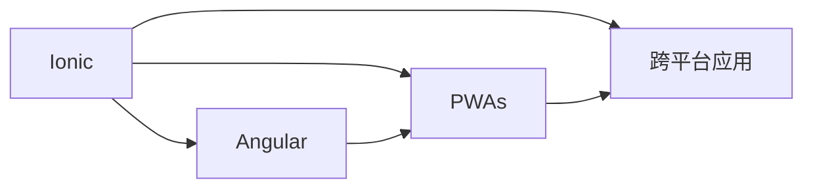

                 

# Ionic 框架优势：基于 Angular 的移动应用开发

> 关键词：Ionic, Angular, 移动应用, 跨平台, 渐进式 Web 应用(PWA), Web 前端框架

## 1. 背景介绍

随着移动互联网的迅猛发展，移动应用开发成为了各行各业技术创新的重要方向。传统的原生应用开发，如iOS和Android应用，开发周期长、成本高、维护难度大。与此同时，Web技术的快速发展，特别是 progressive web apps (PWAs) 的兴起，为跨平台的移动应用开发提供了新的解决方案。基于 Angular 的 Ionic 框架，正是这样一种先进的跨平台移动应用开发工具，以其强大的功能和高效的性能，受到开发者的广泛关注和喜爱。本文将系统地介绍 Ionic 框架的优势、特点、使用方法，并结合具体案例，探讨其在实际应用中的潜力。

## 2. 核心概念与联系

### 2.1 核心概念概述

在深入了解 Ionic 框架的优势之前，首先需要明确一些核心概念：

- **Ionic Framework**：一个基于 Angular 的渐进式 Web 应用框架，用于构建跨平台移动应用。
- **Angular**：谷歌推出的前端 MVC 框架，支持构建复杂的单页面应用 (SPA)。
- **Progressive Web Apps (PWAs)**：一种利用现代 Web 技术实现的原生移动应用体验，支持离线访问、推送通知等功能。
- **跨平台应用**：可以在多个平台（如 iOS、Android、Web）上运行的应用程序。
- **渐进式 Web 应用 (PWAs)**：将 Web 技术应用到移动应用中，支持离线访问、缓存、推送通知等原生应用特性。
- **Web 前端框架**：用于开发 Web 应用的框架，如 React、Vue、Angular 等。

这些概念之间存在密切联系，共同构成了 Ionic 框架的基础架构。以下通过 Mermaid 流程图来展示 Ionic 框架与这些核心概念之间的联系：



### 2.2 核心算法原理 & 具体操作步骤

#### 3.1 算法原理概述

Ionic 框架基于 Angular，利用 Web 技术的特性（如 Webpack、TypeScript、HTML、CSS、JavaScript 等），提供了一套完整的开发工具和组件库，用于构建跨平台移动应用。其核心算法原理包括：

1. **组件化开发**：将应用程序分解为多个独立的组件，每个组件独立开发、独立测试、独立部署。
2. **依赖注入**：使用 Angular 的依赖注入机制，通过模块和组件来管理应用依赖。
3. **响应式编程**：利用 RxJS 等响应式编程库，实现实时数据绑定和数据流管理。
4. **模块化结构**：采用模块化结构，便于应用组织和管理。
5. **跨平台兼容**：通过使用 Cordova 等工具，将应用打包成原生应用，实现跨平台兼容。

#### 3.2 算法步骤详解

Ionic 框架的开发流程主要包括：

1. **环境搭建**：安装 Node.js 和 npm，配置 Webpack 和 TypeScript。
2. **项目初始化**：使用 Ionic CLI 初始化项目，创建应用的基本结构。
3. **组件开发**：根据应用需求，开发相应的组件。
4. **路由配置**：配置应用路由，实现组件间的导航。
5. **样式和模板**：编写组件的样式和模板，实现组件的外观和交互逻辑。
6. **依赖注入**：使用 Angular 的依赖注入机制，管理应用依赖。
7. **服务封装**：封装业务逻辑和服务，以便组件复用。
8. **测试和部署**：编写单元测试和集成测试，部署应用到多个平台。

#### 3.3 算法优缺点

Ionic 框架具有以下优点：

1. **跨平台性能**：支持 iOS 和 Android 平台，减少原生开发的工作量。
2. **开发效率高**：使用 Web 技术开发，代码复用率高，开发效率高。
3. **社区支持好**：有庞大的开发者社区，丰富的组件和插件。
4. **热更新**：支持热更新，无需重新安装应用即可更新。
5. **响应式设计**：支持响应式设计，适应不同屏幕和设备。

同时，Ionic 框架也存在一些缺点：

1. **学习曲线陡峭**：由于使用了 Angular 和 Web 技术，学习成本较高。
2. **性能问题**：在性能方面可能不如原生应用，特别是在复杂应用场景下。
3. **兼容性问题**：不同平台之间的兼容性问题，可能需要进行额外的调试和适配。

#### 3.4 算法应用领域

Ionic 框架在以下几个领域有着广泛的应用：

1. **企业内部应用**：如企业移动应用、内部管理系统、CRM 系统等。
2. **电商应用**：如移动电商、在线购物、社交媒体等。
3. **医疗应用**：如移动医疗、电子病历、健康管理等。
4. **教育应用**：如在线教育、虚拟课堂、学习管理系统等。
5. **金融应用**：如移动支付、理财应用、金融资讯等。
6. **游戏应用**：如移动游戏、互动应用等。

Ionic 框架以其强大的功能和高效的性能，能够满足不同场景下企业对移动应用的需求。

## 4. 数学模型和公式 & 详细讲解 & 举例说明

### 4.1 数学模型构建

Ionic 框架的数学模型构建主要基于 Angular 框架的依赖注入和组件化机制。以下是一个简单的数学模型构建过程：

1. **组件定义**：
```typescript
@Component({
  selector: 'home',
  template: `
    <h1>Hello Ionic!</h1>
  `
})
export class HomeComponent {
  constructor() {}
}
```

2. **依赖注入**：
```typescript
@Component({
  selector: 'app-root',
  template: `
    <app-home></app-home>
  `
})
export class AppComponent {
  constructor() {}
}
```

3. **路由配置**：
```typescript
import { NgModule } from '@angular/core';
import { IonicModule } from '@ionic/angular';
import { HomeComponent } from './home/home.component';

@NgModule({
  imports: [IonicModule.forRoot([])],
  declarations: [HomeComponent],
  bootstrap: [AppComponent]
})
export class AppModule {}
```

### 4.2 公式推导过程

Ionic 框架的公式推导主要涉及 Angular 的依赖注入和组件化机制。以下是一个简单的公式推导过程：

1. **组件依赖注入**：
```typescript
@Component({
  selector: 'home',
  template: `
    <h1>Hello Ionic!</h1>
  `
})
export class HomeComponent {
  constructor(private service: MyService) {}
}
```

2. **服务定义**：
```typescript
@Injectable()
export class MyService {
  constructor() {}
}
```

3. **模块定义**：
```typescript
import { NgModule } from '@angular/core';
import { IonicModule } from '@ionic/angular';
import { HomeComponent } from './home/home.component';
import { MyService } from './my.service';

@NgModule({
  imports: [IonicModule.forRoot([])],
  declarations: [HomeComponent],
  providers: [MyService],
  bootstrap: [AppComponent]
})
export class AppModule {}
```

### 4.3 案例分析与讲解

以下是一个简单的 Ionic 框架案例，用于展示如何构建一个基本的跨平台移动应用：

```typescript
// home.component.ts
import { Component, OnInit } from '@angular/core';

@Component({
  selector: 'app-home',
  template: `
    <h1>Hello Ionic!</h1>
  `
})
export class HomeComponent implements OnInit {
  constructor() {}

  ngOnInit(): void {}
}
```

```typescript
// home.component.spec.ts
import { TestBed } from '@angular/core/testing';
import { HomeComponent } from './home.component';

describe('HomeComponent', () => {
  beforeEach(async () => {
    await TestBed.configureTestingModule({
      declarations: [HomeComponent]
    }).compileComponents();
  });

  it('should create', () => {
    const fixture = TestBed.createComponent(HomeComponent);
    fixture.detectChanges();
    const component = fixture.componentInstance;
    expect(component).toBeTruthy();
  });
});
```

```typescript
// app.module.ts
import { NgModule } from '@angular/core';
import { IonicModule } from '@ionic/angular';
import { HomeComponent } from './home/home.component';

@NgModule({
  imports: [IonicModule.forRoot([])],
  declarations: [HomeComponent],
  bootstrap: [AppComponent]
})
export class AppModule {}
```

这个简单的案例展示了如何使用 Ionic 框架构建一个基本的移动应用。开发者可以按照类似的方式，进一步开发和构建更复杂的跨平台移动应用。

## 5. 项目实践：代码实例和详细解释说明

### 5.1 开发环境搭建

在开始开发之前，需要确保开发环境已经搭建好，具体步骤如下：

1. **安装 Node.js 和 npm**：
```bash
curl -sL https://nvm.sh | bash
source /usr/local/nvm/nvm.sh
```

2. **安装 Ionic CLI**：
```bash
npm install -g @ionic/cli
```

3. **创建 Ionic 项目**：
```bash
ionic start my-app ionic --type tab
```

4. **安装 Cordova**：
```bash
npm install -g cordova
```

5. **配置 Ionic 应用**：
```bash
cd my-app
```

6. **构建应用**：
```bash
ionic cordova platform add ios
ionic cordova platform add android
```

### 5.2 源代码详细实现

以下是一个简单的 Ionic 应用，用于展示如何使用 Ionic 框架开发移动应用：

```typescript
// home.component.ts
import { Component } from '@angular/core';

@Component({
  selector: 'app-home',
  template: `
    <ion-content>
      <ion-card>
        <ion-card-header>
          <ion-card-title>Home Page</ion-card-title>
        </ion-card-header>
        <ion-card-content>
          <h1>Hello Ionic!</h1>
        </ion-card-content>
      </ion-card>
    </ion-content>
  `
})
export class HomeComponent {
  constructor() {}
}
```

```typescript
// home.component.spec.ts
import { TestBed } from '@angular/core/testing';
import { HomeComponent } from './home.component';

describe('HomeComponent', () => {
  beforeEach(async () => {
    await TestBed.configureTestingModule({
      declarations: [HomeComponent]
    }).compileComponents();
  });

  it('should create', () => {
    const fixture = TestBed.createComponent(HomeComponent);
    fixture.detectChanges();
    const component = fixture.componentInstance;
    expect(component).toBeTruthy();
  });
});
```

```typescript
// app.module.ts
import { NgModule } from '@angular/core';
import { IonicModule } from '@ionic/angular';
import { HomeComponent } from './home/home.component';

@NgModule({
  imports: [IonicModule.forRoot([])],
  declarations: [HomeComponent],
  bootstrap: [AppComponent]
})
export class AppModule {}
```

### 5.3 代码解读与分析

这个简单的 Ionic 应用展示了如何使用 Ionic 框架构建基本的移动应用。其中，`HomeComponent` 是一个简单的组件，包含一个带有标题和内容卡片的布局。`HomeComponent` 使用 Ionic 的模板语法来定义组件的样式和内容，并使用 Angular 的依赖注入机制来管理组件依赖。

开发者可以通过编写更多的组件和模板，以及使用 Ionic 提供的各种工具和组件，构建更加复杂的跨平台移动应用。

### 5.4 运行结果展示

完成应用开发后，可以使用以下命令打包应用并运行：

```bash
ionic build
ionic serve
```

开发者可以在浏览器中访问 `http://localhost:8100`，查看应用的效果。

## 6. 实际应用场景

### 6.1 企业内部应用

Ionic 框架适用于企业内部的各种移动应用，如企业移动应用、内部管理系统、CRM 系统等。这些应用通常具有较高的定制需求，需要使用多种工具和组件进行开发。Ionic 框架提供了丰富的组件和插件，能够快速实现各种功能，满足企业需求。

### 6.2 电商应用

Ionic 框架适用于电商应用的开发，如移动电商、在线购物、社交媒体等。这些应用通常具有高并发、高流量的特点，需要支持大规模用户访问。Ionic 框架具有良好的性能和扩展性，能够快速构建高可扩展的电商应用。

### 6.3 医疗应用

Ionic 框架适用于医疗应用的开发，如移动医疗、电子病历、健康管理等。这些应用通常具有较高的安全性和隐私保护要求，需要使用加密和安全措施。Ionic 框架支持使用 WebView 组件进行加密和安全控制，确保应用数据安全。

### 6.4 教育应用

Ionic 框架适用于教育应用的开发，如在线教育、虚拟课堂、学习管理系统等。这些应用通常具有高度的互动性和个性化需求，需要使用多种技术和组件进行开发。Ionic 框架提供了丰富的交互式组件和插件，能够快速实现各种教育功能。

### 6.5 金融应用

Ionic 框架适用于金融应用的开发，如移动支付、理财应用、金融资讯等。这些应用通常具有高可靠性和安全性要求，需要使用多种技术和组件进行开发。Ionic 框架支持使用 WebView 组件进行加密和安全控制，确保应用数据安全。

### 6.6 游戏应用

Ionic 框架适用于游戏应用的开发，如移动游戏、互动应用等。这些应用通常具有高性能和高互动性的特点，需要使用多种技术和组件进行开发。Ionic 框架提供了丰富的动画和交互式组件，能够快速实现各种游戏功能。

## 7. 工具和资源推荐

### 7.1 学习资源推荐

以下是一些推荐的 Ionic 框架学习资源：

1. **Ionic 官方文档**：
```
https://ionicframework.com/docs
```

2. **Angular 官方文档**：
```
https://angular.io/docs
```

3. **Progressive Web Apps (PWAs) 文档**：
```
https://web.dev/progressive-web-apps/
```

4. **Ionic 官方教程**：
```
https://ionicframework.com/tutorials
```

5. **Coursera 的 Angular 课程**：
```
https://www.coursera.org/learn/angular-2
```

6. **Udemy 的 Ionic 框架课程**：
```
https://www.udemy.com/course/ionic-4-ng-backend-development-restful-api/
```

通过学习这些资源，可以深入了解 Ionic 框架的原理和使用方法，掌握 Ionic 框架的开发技巧和最佳实践。

### 7.2 开发工具推荐

以下是一些推荐的 Ionic 框架开发工具：

1. **Visual Studio Code**：
```
https://code.visualstudio.com/
```

2. **WebStorm**：
```
https://www.jetbrains.com/webstorm/
```

3. **Android Studio**：
```
https://developer.android.com/studio
```

4. **Xcode**：
```
https://developer.apple.com/xcode/
```

5. **Visual Studio**：
```
https://visualstudio.microsoft.com/
```

这些工具提供了强大的开发和调试功能，可以帮助开发者快速构建和调试 Ionic 应用。

### 7.3 相关论文推荐

以下是一些推荐的 Ionic 框架相关论文：

1. **Ionic Framework 论文**：
```
https://www.ionicframework.com/blog/ionic-framework
```

2. **Progressive Web Apps (PWAs) 论文**：
```
https://www.igalia.com/blog/web-platforms/web-apps
```

3. **Angular 论文**：
```
https://www.angular-project.org/docs/ts/latest/guide/component-based/overview
```

通过阅读这些论文，可以深入了解 Ionic 框架的原理和应用，掌握 Ionic 框架的最新研究和进展。

## 8. 总结：未来发展趋势与挑战

### 8.1 研究成果总结

Ionic 框架基于 Angular，利用 Web 技术的特性，提供了一套完整的开发工具和组件库，用于构建跨平台移动应用。其核心算法原理包括组件化开发、依赖注入、响应式编程、模块化结构和跨平台兼容等。

### 8.2 未来发展趋势

Ionic 框架的未来发展趋势包括：

1. **Web 技术升级**：随着 Web 技术的发展，Ionic 框架将不断更新和升级，支持最新的 Web 标准和 API。
2. **组件和插件丰富化**：Ionic 框架将不断丰富和优化其组件和插件，支持更多的功能和场景。
3. **性能优化**：Ionic 框架将不断优化其性能，支持更高效的数据流和渲染。
4. **跨平台兼容**：Ionic 框架将不断优化其跨平台兼容，支持更多平台和设备。
5. **生态系统完善**：Ionic 框架将不断完善其生态系统，支持更多的开发工具和插件。

### 8.3 面临的挑战

Ionic 框架在发展过程中也面临一些挑战：

1. **学习曲线陡峭**：Ionic 框架基于 Angular 和 Web 技术，学习成本较高。
2. **性能问题**：在性能方面可能不如原生应用，特别是在复杂应用场景下。
3. **兼容性问题**：不同平台之间的兼容性问题，可能需要进行额外的调试和适配。

### 8.4 研究展望

Ionic 框架未来的研究展望包括：

1. **Web 技术融合**：进一步融合 Web 技术，提升应用性能和用户体验。
2. **组件和插件创新**：开发更多创新和高效的组件和插件，满足更多需求。
3. **性能优化**：优化 Web 渲染和数据流，提升应用性能。
4. **跨平台优化**：优化跨平台兼容性和适配，提升应用兼容性。
5. **生态系统建设**：完善生态系统，支持更多的开发工具和插件。

总之，Ionic 框架在跨平台移动应用开发中具有强大的功能和高效的性能，为开发者提供了便捷的开发工具和组件库。未来，随着 Web 技术的不断发展，Ionic 框架也将不断进步，提供更加丰富和高效的应用开发解决方案。

## 9. 附录：常见问题与解答

**Q1：Ionic 框架的优缺点是什么？**

A: Ionic 框架的优点包括：
- **跨平台性能**：支持 iOS 和 Android 平台，减少原生开发的工作量。
- **开发效率高**：使用 Web 技术开发，代码复用率高，开发效率高。
- **社区支持好**：有庞大的开发者社区，丰富的组件和插件。
- **热更新**：支持热更新，无需重新安装应用即可更新。
- **响应式设计**：支持响应式设计，适应不同屏幕和设备。

Ionic 框架的缺点包括：
- **学习曲线陡峭**：由于使用了 Angular 和 Web 技术，学习成本较高。
- **性能问题**：在性能方面可能不如原生应用，特别是在复杂应用场景下。
- **兼容性问题**：不同平台之间的兼容性问题，可能需要进行额外的调试和适配。

**Q2：如何使用 Ionic 框架构建跨平台移动应用？**

A: 使用 Ionic 框架构建跨平台移动应用，需要按照以下步骤：
1. 安装 Node.js 和 npm。
2. 安装 Ionic CLI。
3. 创建 Ionic 项目。
4. 安装 Cordova。
5. 配置 Ionic 应用。
6. 构建应用。

具体步骤可以参考 Ionic 官方文档和教程。

**Q3：Ionic 框架的性能问题如何解决？**

A: 为了解决性能问题，可以使用以下方法：
1. 使用 WebView 组件进行加密和安全控制，确保应用数据安全。
2. 使用 HTTP 代理和缓存，减少网络请求。
3. 使用懒加载和组件生命周期管理，减少资源加载和渲染。
4. 使用性能优化工具，如 Webpack 和 React Native。
5. 使用原生模块和插件，提升应用性能。

这些方法可以有效地提升 Ionic 应用的性能，满足用户需求。

**Q4：Ionic 框架的组件和插件如何使用？**

A: Ionic 框架提供了丰富的组件和插件，开发者可以使用以下方法：
1. 在组件中引入需要的模块和插件。
2. 在组件模板中使用组件和插件。
3. 使用 Ionic CLI 安装和配置组件和插件。
4. 在组件中定义和实现组件和插件的逻辑。
5. 使用 Angular 的依赖注入机制，管理组件和插件的依赖。

开发者可以通过编写更多的组件和插件，以及使用 Ionic 提供的各种工具和组件，构建更加复杂的跨平台移动应用。

**Q5：Ionic 框架的生态系统如何完善？**

A: 为了完善 Ionic 框架的生态系统，可以使用以下方法：
1. 开发和贡献更多的组件和插件。
2. 参与 Ionic 社区的开发和讨论。
3. 使用 Ionic 框架的官方文档和教程。
4. 使用第三方工具和插件，丰富生态系统。
5. 与开发者社区和其他框架保持紧密合作，推动技术进步。

这些方法可以有效地完善 Ionic 框架的生态系统，为开发者提供更多的开发工具和组件库，提升应用开发效率和质量。

---

作者：禅与计算机程序设计艺术 / Zen and the Art of Computer Programming

