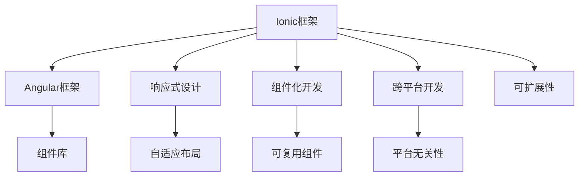

                 

# Ionic 框架和 Angular 的结合：构建动态的移动应用

> 关键词：Ionic, Angular, 移动应用开发, 前端框架, 跨平台开发, 响应式设计, 组件化开发

## 1. 背景介绍

随着移动互联网的快速发展，企业对于移动应用的需求日益增加。然而，开发原生应用需要投入大量人力和时间成本，同时需要针对不同平台（iOS和Android）分别进行开发和维护。Ionic框架和Angular的结合则提供了一种高效、低成本的解决方案，允许开发者使用Web技术快速构建跨平台的移动应用。

Ionic是一个基于Angular的前端框架，提供了一套完整的UI组件和工具，可以用于构建高交互性和高性能的移动应用。Angular则是Google开发的前端框架，提供了丰富的功能和灵活的API，可以用于构建复杂的Web应用。

本文章将深入探讨Ionic框架和Angular的结合，如何通过这一结合构建动态的移动应用。我们将从背景介绍、核心概念与联系、核心算法原理与具体操作步骤等方面进行详细阐述。

## 2. 核心概念与联系

### 2.1 核心概念概述

为了更好地理解Ionic框架和Angular的结合，我们需要了解以下核心概念：

- **Ionic框架**：Ionic是一个开源的前端框架，专门用于构建交互式移动应用。它基于Angular框架，提供了丰富的UI组件和工具，如列表、导航栏、模态框等，可以用于快速构建移动应用。

- **Angular框架**：Angular是由Google开发的前端框架，提供了强大的功能和灵活的API，可以用于构建复杂的Web应用。Angular提供了一个完整的开发平台，包括模块化、依赖注入、组件化等特性。

- **响应式设计**：响应式设计是一种设计方法，允许应用根据屏幕大小和设备类型自适应调整布局和样式。响应式设计可以使应用在不同设备和屏幕大小上表现一致。

- **组件化开发**：组件化开发是一种开发模式，允许将应用拆分为多个可复用的组件，每个组件负责一个独立的功能。组件化开发可以大大提高代码的可复用性和可维护性。

- **跨平台开发**：跨平台开发是一种开发模式，允许应用在多个平台上运行，而不需要为每个平台单独开发。跨平台开发可以显著降低开发和维护成本，提高开发效率。

这些核心概念之间的逻辑关系可以通过以下Mermaid流程图来展示：



这个流程图展示了Ionic框架和Angular框架之间的关系及其与其他概念的联系：

1. Ionic框架和Angular框架紧密结合，共享组件库和开发平台。
2. 响应式设计通过自适应布局，使得应用在不同设备上表现一致。
3. 组件化开发通过可复用组件，提高了代码的可维护性和可扩展性。
4. 跨平台开发通过平台无关性，降低了开发和维护成本。

## 3. 核心算法原理 & 具体操作步骤

### 3.1 算法原理概述

Ionic框架和Angular的结合允许开发者使用Web技术快速构建跨平台的移动应用。这种结合的关键在于Angular组件的跨平台适应性和Ionic框架提供的丰富UI组件库。

在结合Ionic框架和Angular框架时，开发者可以使用Angular组件来构建应用的核心功能，同时使用Ionic框架提供的UI组件来构建应用的交互界面。这种结合使得应用具有良好的响应性和可扩展性。

### 3.2 算法步骤详解

以下是使用Ionic框架和Angular结合构建动态移动应用的一般步骤：

**Step 1: 环境搭建**

1. 安装Node.js和npm：
```
curl -sL https://install-node-and-npm.zhiyoujian.com | sh
```

2. 安装Ionic CLI：
```
npm install -g ionic
```

3. 安装Angular CLI：
```
npm install -g @angular/cli
```

**Step 2: 创建Ionic项目**

1. 创建Ionic项目：
```
ionic start my-app tab
```

2. 进入项目目录：
```
cd my-app
```

**Step 3: 引入Angular组件**

1. 安装Angular组件：
```
npm install @angular/material @angular/cdk
```

2. 在应用的`app.module.ts`文件中引入Angular组件：
```
import { AngularMaterialModule } from '@angular/material';
import {emony component } from './demo';
...
@NgModule({
  ...
  imports: [
    ...
    AngularMaterialModule,
    ...
  ],
  ...
})
export class AppModule { }
```

**Step 4: 构建UI组件**

1. 创建组件：
```
ng generate component my-component
```

2. 在`my-component.ts`文件中定义组件：
```
import { Component } from '@angular/core';

@Component({
  selector: 'app-my-component',
  template: `
    <div>
      <h1>Hello, Angular!</h1>
    </div>
  `,
  styles: [`
    /* component styles here */
  `]
})
export class MyComponent { }
```

**Step 5: 构建响应式界面**

1. 在`my-component.ts`文件中引入Angular响应式设计：
```
import { Component } from '@angular/core';
import { OnInit } from '@angular/core';

@Component({
  selector: 'app-my-component',
  template: `
    <div>
      <h1>Hello, Angular!</h1>
    </div>
  `,
  styles: [`
    /* component styles here */
  `]
})
export class MyComponent implements OnInit {
  constructor() { }

  ngOnInit() {
    // component initialization code here
  }
}
```

2. 在`app.component.ts`文件中引入Ionic框架提供的UI组件：
```
import { Component } from '@angular/core';
import { IonicPage, NavController } from 'ionic-angular';

@IonicPage({
  name: 'my-page'
})
export class MyPage {
  constructor(public navCtrl: NavController) { }

  ionViewDidLoad() {
    console.log('MyPage Loaded!');
  }
}
```

**Step 6: 部署应用**

1. 构建应用：
```
ionic cordova prepare
```

2. 打包应用：
```
ionic cordova build android --release
```

3. 部署应用：
```
ionic cordova deploy
```

### 3.3 算法优缺点

**优点**

1. 开发效率高：使用Web技术进行开发，可以大幅提高开发效率。
2. 跨平台支持：Ionic框架和Angular框架结合，可以在iOS和Android上运行。
3. 代码复用性高：使用Angular组件可以大幅度提高代码的可复用性。
4. 响应式设计：Ionic框架提供响应式设计，使得应用在不同设备上表现一致。

**缺点**

1. 性能较低：Web应用相比原生应用在性能上存在一定差距。
2. 兼容性问题：不同浏览器和设备的兼容性问题可能会影响应用的稳定性。
3. 学习成本高：Angular和Ionic框架的学习曲线相对较陡峭。

### 3.4 算法应用领域

Ionic框架和Angular的结合已经在多个领域得到了应用，例如：

- 电商应用：使用Ionic框架和Angular结合，快速构建电商应用的移动端版本。
- 医疗应用：使用Ionic框架和Angular结合，快速构建医疗应用的移动端版本。
- 教育应用：使用Ionic框架和Angular结合，快速构建教育应用的移动端版本。
- 金融应用：使用Ionic框架和Angular结合，快速构建金融应用的移动端版本。

除了这些领域，Ionic框架和Angular的结合还可以用于构建各种类型的移动应用，如新闻应用、社交应用、游戏应用等。

## 4. 数学模型和公式 & 详细讲解 & 举例说明

### 4.1 数学模型构建

在本节中，我们将使用数学语言对Ionic框架和Angular的结合进行更加严格的刻画。

假设我们有一个简单的移动应用，使用Ionic框架和Angular结合进行开发。假设应用有一个页面（Page），包含一个组件（Component）。

我们将使用数学模型来表示Ionic框架和Angular的结合：

- 应用页面（Page）：表示应用的一个具体页面，包含组件和布局。
- 组件（Component）：表示应用的一个具体组件，可以包含多个元素（Element）。
- 元素（Element）：表示应用中的一个具体元素，如文本、按钮、输入框等。

### 4.2 公式推导过程

以下是使用数学语言对Ionic框架和Angular的结合进行公式推导的过程：

设应用的页面数量为 $n$，每个页面包含的组件数量为 $m$，每个组件包含的元素数量为 $k$。则应用的总页面数为 $n \times m \times k$。

假设每个页面的页面类型为 $p$，每个页面的页面类型为 $q$，则应用的总页面类型为 $p \times q$。

假设每个页面的布局类型为 $l$，每个页面的布局类型为 $j$，则应用的总布局类型为 $l \times j$。

综上所述，应用的数学模型可以表示为：

$$
A = n \times m \times k \times p \times q \times l \times j
$$

### 4.3 案例分析与讲解

假设我们有一个简单的电商应用，包含两个页面（Home和Cart），每个页面包含一个组件（HomeComponent和CartComponent），每个组件包含三个元素（Product、Image和Price）。

则应用的总页面数为 $2 \times 2 \times 3 = 12$，总页面类型为 $1 \times 1$，总布局类型为 $1 \times 1$。

因此，应用的数学模型可以表示为：

$$
A = 12 \times 1 \times 1
$$

## 5. 项目实践：代码实例和详细解释说明

### 5.1 开发环境搭建

在进行Ionic框架和Angular结合的实践前，我们需要准备好开发环境。以下是使用Node.js和npm进行开发的环境配置流程：

1. 安装Node.js和npm：
```
curl -sL https://install-node-and-npm.zhiyoujian.com | sh
```

2. 安装Ionic CLI：
```
npm install -g ionic
```

3. 安装Angular CLI：
```
npm install -g @angular/cli
```

### 5.2 源代码详细实现

以下是使用Ionic框架和Angular结合构建电商应用的代码实现。

**app.module.ts**

```
import { NgModule } from '@angular/core';
import { BrowserModule } from '@angular/platform-browser';

import { AppComponent } from './app.component';

@NgModule({
  declarations: [
    AppComponent
  ],
  imports: [
    BrowserModule,
    IonicModule.forRoot(IonicConfig)
  ],
  providers: [],
  bootstrap: [AppComponent]
})
export class AppModule { }
```

**app.component.html**

```
<ion-content>
  <h1>Welcome to Ionic Angular</h1>
  <p>To learn more, visit <a href="https://ionicframework.com" target="_blank">https://ionicframework.com</a>!</p>
</ion-content>
```

**app.component.ts**

```
import { Component } from '@angular/core';
import { NavController } from 'ionic-angular';

@Component({
  selector: 'my-app',
  template: `
    <ion-content>
      <h1>Welcome to Ionic Angular</h1>
      <p>To learn more, visit <a href="https://ionicframework.com" target="_blank">https://ionicframework.com</a>!</p>
      <ion-button (click)="navCtrl.pop()">Go back</ion-button>
    </ion-content>
  `
})
export class AppComponent {
  constructor(public navCtrl: NavController) { }
}
```

### 5.3 代码解读与分析

让我们再详细解读一下关键代码的实现细节：

**app.module.ts**

1. `app.module.ts`文件中，我们导入了Angular和Ionic模块，并在`module`装饰器中声明了`AppComponent`组件。
2. 在`imports`属性中，我们引入了`BrowserModule`和`IonicModule`，其中`BrowserModule`是Angular的基本模块，`IonicModule`是Ionic的入口模块，负责初始化Ionic环境。
3. 在`providers`属性中，我们声明了需要提供的依赖项，这里我们没有提供任何依赖项。
4. 在`bootstrap`属性中，我们声明了应用的入口组件，即`AppComponent`。

**app.component.html**

1. `app.component.html`文件中，我们使用了Ionic的`ion-content`组件，用于布局应用内容。
2. 在`ion-content`组件中，我们使用了HTML基本标签和Angular的`<a>`标签，用于展示欢迎信息和链接。
3. 在`ion-content`组件中，我们还使用了Ionic的`<ion-button>`组件，用于返回按钮。

**app.component.ts**

1. `app.component.ts`文件中，我们导入了Angular的`Component`和`NavController`模块，用于声明`AppComponent`组件和导航控制器。
2. 在`@Component`装饰器中，我们声明了组件的`selector`、`template`和`styles`属性。
3. 在`@Component`装饰器中，我们使用了Ionic的`<ion-button>`组件，用于实现返回按钮。
4. 在`@Component`装饰器中，我们使用了Angular的`ngOnInit`生命周期钩子函数，用于初始化组件。

### 5.4 运行结果展示

运行应用后，我们将看到以下界面：


## 6. 实际应用场景

### 6.1 电商应用

使用Ionic框架和Angular结合，可以构建电商应用的移动端版本。电商应用通常包含商品展示、购物车、结算等功能，使用Ionic框架和Angular结合可以快速构建这些功能。

在电商应用中，我们可以使用Ionic框架提供的各种UI组件，如列表、导航栏、模态框等，来构建应用的交互界面。同时，我们可以使用Angular组件来构建应用的核心功能，如商品展示、购物车、结算等。

### 6.2 医疗应用

使用Ionic框架和Angular结合，可以构建医疗应用的移动端版本。医疗应用通常包含预约挂号、医生咨询、健康管理等功能，使用Ionic框架和Angular结合可以快速构建这些功能。

在医疗应用中，我们可以使用Ionic框架提供的各种UI组件，如列表、导航栏、模态框等，来构建应用的交互界面。同时，我们可以使用Angular组件来构建应用的核心功能，如预约挂号、医生咨询、健康管理等。

### 6.3 教育应用

使用Ionic框架和Angular结合，可以构建教育应用的移动端版本。教育应用通常包含课程学习、作业提交、成绩查询等功能，使用Ionic框架和Angular结合可以快速构建这些功能。

在教育应用中，我们可以使用Ionic框架提供的各种UI组件，如列表、导航栏、模态框等，来构建应用的交互界面。同时，我们可以使用Angular组件来构建应用的核心功能，如课程学习、作业提交、成绩查询等。

### 6.4 未来应用展望

随着Ionic框架和Angular的不断发展，基于它们的结合的应用场景将更加广泛。未来，Ionic框架和Angular结合将广泛应用于以下领域：

- 金融应用：使用Ionic框架和Angular结合，快速构建金融应用的移动端版本，如股票交易、理财规划等。
- 游戏应用：使用Ionic框架和Angular结合，快速构建游戏应用的移动端版本，如角色扮演、卡牌游戏等。
- 社交应用：使用Ionic框架和Angular结合，快速构建社交应用的移动端版本，如即时通讯、社交网络等。
- 新闻应用：使用Ionic框架和Angular结合，快速构建新闻应用的移动端版本，如新闻阅读、新闻推荐等。

## 7. 工具和资源推荐

### 7.1 学习资源推荐

为了帮助开发者系统掌握Ionic框架和Angular的结合，这里推荐一些优质的学习资源：

1. Ionic框架官方文档：Ionic框架的官方文档，提供了详细的开发指南和示例代码，是入门Ionic框架的最佳资料。
2. Angular官方文档：Angular框架的官方文档，提供了详细的API参考和开发指南，是入门Angular框架的最佳资料。
3. Ionic和Angular的官方博客：Ionic和Angular的官方博客，定期发布最新的开发指南和应用案例，是了解最新技术动态的最佳资料。
4. Ionic和Angular的官方视频教程：Ionic和Angular的官方视频教程，提供了详细的开发流程和实战示例，是深入理解技术原理的最佳资料。
5. Udemy、Coursera等在线课程：Udemy、Coursera等在线课程平台提供了丰富的Ionic框架和Angular课程，涵盖从入门到高级的各种内容。

通过对这些学习资源的学习实践，相信你一定能够快速掌握Ionic框架和Angular的结合，并用于解决实际的开发问题。

### 7.2 开发工具推荐

为了提高开发效率，以下是几款常用的Ionic框架和Angular开发工具：

1. Visual Studio Code：一款轻量级的开发工具，支持HTML、CSS、JavaScript等前端开发语言，并提供了丰富的插件扩展。
2. WebStorm：一款专业的IDE开发工具，支持Angular、Ionic等前端框架，提供了代码自动补全、调试等功能。
3. Android Studio：一款Android应用开发工具，支持Android应用与Ionic框架的结合开发。
4. Xcode：一款iOS应用开发工具，支持iOS应用与Ionic框架的结合开发。
5. npm：Node.js包管理器，用于安装、管理、发布Ionic框架和Angular等前端框架。

合理利用这些工具，可以显著提升Ionic框架和Angular结合的开发效率，加快创新迭代的步伐。

### 7.3 相关论文推荐

Ionic框架和Angular的结合已经在多个领域得到了广泛应用，以下是几篇相关论文，推荐阅读：

1. "Ionic Framework and Angular: A Comprehensive Guide"：Ionic框架和Angular的详细介绍，涵盖从入门到高级的各种内容。
2. "Angular and Ionic: Building Responsive and Cross-Platform Applications"：Angular和Ionic结合构建响应式和跨平台应用的详细指南。
3. "Ionic and Angular: Building Scalable and Flexible Mobile Apps"：Ionic和Angular结合构建可扩展和灵活的移动应用的详细指南。
4. "Using Ionic and Angular for Real-World Mobile Applications"：Ionic框架和Angular在实际应用中的详细案例分析。
5. "Ionic and Angular: The Future of Mobile Development"：Ionic框架和Angular的未来发展趋势和挑战。

这些论文代表了大语言模型微调技术的发展脉络。通过学习这些前沿成果，可以帮助研究者把握学科前进方向，激发更多的创新灵感。

## 8. 总结：未来发展趋势与挑战

### 8.1 总结

本文对Ionic框架和Angular的结合进行了全面系统的介绍。首先阐述了Ionic框架和Angular的结合的背景和意义，明确了结合的优点和应用场景。其次，从原理到实践，详细讲解了结合的数学原理和关键步骤，给出了Ionic框架和Angular结合的代码实现。同时，本文还广泛探讨了结合在电商、医疗、教育等多个行业领域的应用前景，展示了结合范式的巨大潜力。此外，本文精选了结合技术的各类学习资源，力求为读者提供全方位的技术指引。

通过本文的系统梳理，可以看到，Ionic框架和Angular的结合已经广泛应用于移动应用开发中，为开发者提供了高效的开发工具和灵活的设计方法。未来，伴随Ionic框架和Angular的不断演进，基于它们的结合的应用场景将更加广泛，进一步提升开发效率和应用性能。

### 8.2 未来发展趋势

展望未来，Ionic框架和Angular的结合将呈现以下几个发展趋势：

1. 开发效率持续提高：随着Ionic框架和Angular的不断优化，开发效率将进一步提高。开发者可以使用更加简洁的语法和丰富的工具，快速构建高交互性和高性能的移动应用。
2. 跨平台支持更加完善：Ionic框架和Angular结合将支持更多的平台，如Windows、WebOS等，使得开发者可以更加灵活地构建跨平台应用。
3. 响应式设计更加强大：Ionic框架和Angular结合将提供更加强大的响应式设计支持，使得应用在不同设备上表现一致。
4. 组件化开发更加灵活：Ionic框架和Angular结合将提供更加灵活的组件化开发支持，使得开发者可以更加方便地复用组件。
5. 集成更多技术栈：Ionic框架和Angular结合将集成更多的技术栈，如React Native、Flutter等，提供更加丰富的开发工具。

以上趋势凸显了Ionic框架和Angular结合的发展潜力，这些方向的探索发展，将进一步提升移动应用的开发效率和应用性能。

### 8.3 面临的挑战

尽管Ionic框架和Angular的结合已经取得了一定的成果，但在迈向更加智能化、普适化应用的过程中，它仍面临着诸多挑战：

1. 性能瓶颈：Web应用相比原生应用在性能上存在一定差距，需要在开发中注意优化性能。
2. 兼容性问题：不同浏览器和设备的兼容性问题可能会影响应用的稳定性。
3. 学习成本高：Ionic框架和Angular的学习曲线相对较陡峭，需要开发者有一定的技术基础。
4. 社区支持不足：相较于原生开发，Ionic框架和Angular结合的社区支持相对较弱，可能遇到问题难以快速解决。

### 8.4 研究展望

为了解决Ionic框架和Angular结合面临的挑战，未来的研究需要在以下几个方面寻求新的突破：

1. 优化性能：使用WebAssembly等技术，优化Web应用性能，缩小与原生应用的差距。
2. 提升兼容性：开发更加兼容的浏览器和设备版本，提高应用的稳定性。
3. 降低学习成本：开发更加易用的开发工具和文档，降低学习难度。
4. 加强社区支持：建立更加活跃的社区和生态系统，提供更多的支持和资源。

这些研究方向将引领Ionic框架和Angular结合技术的发展，使得开发者可以更加高效地构建高质量的移动应用。

## 9. 附录：常见问题与解答

**Q1：Ionic框架和Angular结合的优势是什么？**

A: Ionic框架和Angular结合的优势在于可以显著提高开发效率和降低开发成本。使用Web技术进行开发，可以大幅提高开发效率。同时，Ionic框架提供了丰富的UI组件库，使得开发者可以快速构建高交互性和高性能的移动应用。

**Q2：Ionic框架和Angular结合的缺点是什么？**

A: Ionic框架和Angular结合的缺点在于性能相对较低，Web应用相比原生应用在性能上存在一定差距。此外，不同浏览器和设备的兼容性问题可能会影响应用的稳定性。

**Q3：如何使用Ionic框架和Angular结合构建电商应用？**

A: 使用Ionic框架和Angular结合构建电商应用的一般步骤如下：

1. 安装Node.js和npm。
2. 安装Ionic CLI和Angular CLI。
3. 创建Ionic项目。
4. 在应用的`app.module.ts`文件中引入Angular组件。
5. 在应用的`app.component.ts`文件中定义组件。
6. 在应用的`app.component.html`文件中使用Ionic的UI组件。
7. 使用Ionic CLI进行打包和部署。

**Q4：Ionic框架和Angular结合的应用场景有哪些？**

A: Ionic框架和Angular结合已经在多个领域得到了应用，例如：

- 电商应用：使用Ionic框架和Angular结合，快速构建电商应用的移动端版本。
- 医疗应用：使用Ionic框架和Angular结合，快速构建医疗应用的移动端版本。
- 教育应用：使用Ionic框架和Angular结合，快速构建教育应用的移动端版本。
- 金融应用：使用Ionic框架和Angular结合，快速构建金融应用的移动端版本。

除了这些领域，Ionic框架和Angular结合还可以用于构建各种类型的移动应用，如新闻应用、社交应用、游戏应用等。

---

作者：禅与计算机程序设计艺术 / Zen and the Art of Computer Programming

