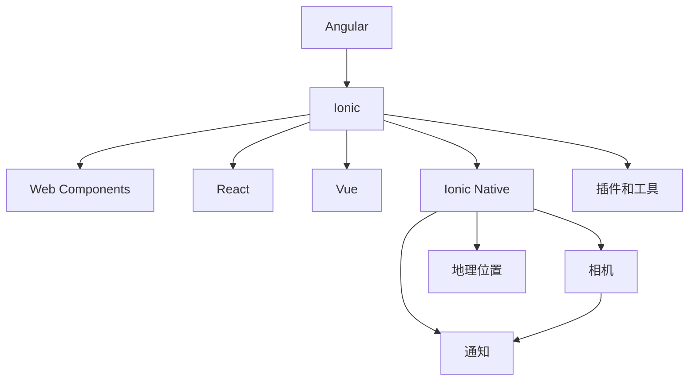

                 

# Ionic 框架：基于 Angular 的移动应用

> 关键词：Ionic, Angular, 移动应用, 前端开发, 跨平台

## 1. 背景介绍

在当今快速发展的移动应用市场中，前端开发者面临着诸多挑战。为了应对这些挑战，许多开发者开始探索跨平台的前端框架。其中，Ionic 是一个基于 Angular 的流行框架，广泛用于构建高质量的跨平台移动应用。Ionic 通过提供一套成熟的组件和工具，帮助开发者以极少的代码实现高效的移动应用开发。本文将详细探讨 Ionic 框架的设计原理、核心概念、以及如何通过 Ionic 构建跨平台移动应用。

## 2. 核心概念与联系

### 2.1 核心概念概述

Ionic 是一个开源的前端框架，用于构建高性能的移动应用。它基于 Angular 和 Web Components，提供了一套丰富的组件和工具，使得开发者可以轻松构建跨平台的移动应用。Ionic 的核心组件包括页面组件、导航组件、列表组件等，这些组件都可以在不同的移动平台（iOS、Android 和 Web）上无缝使用。

此外，Ionic 还支持 React、Vue 等其他框架，提供了高度灵活的开发环境。同时，Ionic 还支持 Ionic Native，这使得开发者可以访问设备特有的功能，如相机、地理位置、通知等。Ionic 的生态系统非常丰富，包括大量的插件和工具，支持多种语言和平台。

### 2.2 核心概念原理和架构的 Mermaid 流程图



这个 Mermaid 流程图展示了 Ionic 框架的核心组件和生态系统：

1. Ionic 基于 Angular，利用 Web Components 和框架本身提供的大量组件。
2. Ionic 支持 React 和 Vue 等其他前端框架。
3. Ionic Native 提供访问设备特有功能的接口，如相机、地理位置、通知等。
4. Ionic 丰富的插件和工具生态系统，支持多种语言和平台。

### 2.3 核心概念之间的联系

Ionic 的核心组件和工具紧密地联系在一起，形成一个完整的移动应用开发平台。Angular 提供了高效的数据绑定和依赖注入等特性，而 Web Components 和 Ionic 组件则提供了丰富的 UI 组件和样式，React 和 Vue 等其他框架的兼容性则进一步扩大了 Ionic 的使用范围。Ionic Native 提供了跨平台的设备访问功能，插件和工具则提供了更多的开发工具和支持。

这些组件和工具的协同工作，使得开发者可以轻松构建高质量的跨平台移动应用，同时也可以快速适应不同的开发需求。

## 3. 核心算法原理 & 具体操作步骤

### 3.1 算法原理概述

Ionic 框架的核心算法原理主要基于 Angular 和 Web Components，通过组件化开发和数据绑定技术，使得开发者可以轻松构建跨平台移动应用。Ionic 框架的核心算法包括以下几个关键步骤：

1. 组件化开发：Ionic 提供了丰富的组件库，包括页面、导航、列表、表单等，这些组件可以在不同的移动平台和浏览器上无缝使用。
2. 数据绑定：Ionic 通过双向数据绑定技术，使得页面和组件之间的数据能够实时同步，提高了开发效率。
3. Web Components 和 Angular 的结合：Ionic 利用 Web Components 和 Angular 的特性，提供了一套统一的开发平台，可以轻松构建跨平台的移动应用。

### 3.2 算法步骤详解

下面将详细阐述 Ionic 框架的核心算法步骤：

1. **组件化开发**：
   - 定义 Ionic 组件：使用 `<Ion-Component>` 标签定义 Ionic 组件，包括页面组件、导航组件、列表组件等。
   - 编写组件代码：在组件类中定义组件的逻辑和样式。
   - 组件之间通信：使用 `@Input` 和 `@Output` 属性实现组件之间的通信。

2. **数据绑定**：
   - 使用双向数据绑定：使用 `[(data)]` 属性实现数据绑定，如 `{{data}}` 表示绑定数据的模板显示。
   - 事件绑定：使用 `[(event)]` 属性实现事件绑定，如 `(click)` 表示点击事件。
   - 单向数据绑定：使用 `[(data)]` 属性实现单向数据绑定，如 `(data)` 表示只绑定数据到组件。

3. **Web Components 和 Angular 结合**：
   - 定义自定义组件：使用 `<Ion-Component>` 标签定义自定义组件，使用 `<Ion-Component>` 标签嵌套其他组件。
   - 使用 Angular 的依赖注入：在组件中使用 Angular 的依赖注入，提供外部依赖。
   - 使用 Angular 的生命周期钩子：在组件中使用 Angular 的生命周期钩子，实现组件的生命周期管理。

### 3.3 算法优缺点

Ionic 框架的优势在于其丰富的组件库和跨平台支持，使得开发者可以快速构建高质量的移动应用。Ionic 框架的缺点在于其复杂性，需要开发者掌握 Angular 和 Web Components 等技术，增加了学习的难度。

### 3.4 算法应用领域

Ionic 框架广泛应用于各种类型的移动应用，包括社交网络、电商应用、教育应用等。这些应用通常需要高效、跨平台的开发环境，而 Ionic 框架可以提供这样的环境，使得开发者可以轻松构建高质量的移动应用。

## 4. 数学模型和公式 & 详细讲解 & 举例说明

### 4.1 数学模型构建

Ionic 框架的数学模型主要基于 Angular 和 Web Components，通过组件化开发和数据绑定技术，实现跨平台移动应用的构建。Ionic 的数学模型包括以下几个关键部分：

1. 组件化开发：定义 Ionic 组件，通过组件化开发实现页面的模块化。
2. 数据绑定：使用双向数据绑定技术，实现数据在组件之间的实时同步。
3. Web Components 和 Angular 的结合：通过 Web Components 和 Angular 的结合，实现组件的自定义和依赖注入。

### 4.2 公式推导过程

下面将详细阐述 Ionic 框架的公式推导过程：

1. **组件化开发**：
   - 定义 Ionic 组件：使用 `<Ion-Component>` 标签定义 Ionic 组件，包括页面组件、导航组件、列表组件等。
   - 编写组件代码：在组件类中定义组件的逻辑和样式。
   - 组件之间通信：使用 `@Input` 和 `@Output` 属性实现组件之间的通信。

2. **数据绑定**：
   - 使用双向数据绑定：使用 `[(data)]` 属性实现数据绑定，如 `{{data}}` 表示绑定数据的模板显示。
   - 事件绑定：使用 `[(event)]` 属性实现事件绑定，如 `(click)` 表示点击事件。
   - 单向数据绑定：使用 `[(data)]` 属性实现单向数据绑定，如 `(data)` 表示只绑定数据到组件。

3. **Web Components 和 Angular 结合**：
   - 定义自定义组件：使用 `<Ion-Component>` 标签定义自定义组件，使用 `<Ion-Component>` 标签嵌套其他组件。
   - 使用 Angular 的依赖注入：在组件中使用 Angular 的依赖注入，提供外部依赖。
   - 使用 Angular 的生命周期钩子：在组件中使用 Angular 的生命周期钩子，实现组件的生命周期管理。

### 4.3 案例分析与讲解

下面以 Ionic 框架中的 `<Ion-Page>` 组件为例，展示如何使用 Ionic 框架构建跨平台移动应用。

```html
<Ion-Page>
  <Ion-Content>
    <Ion-Header>
      <Ion-Title>页面标题</Ion-Title>
    </Ion-Header>
    <Ion-Content>
      <Ion-Item>
        <Ion-Label>姓名</Ion-Label>
        <Ion-Input [(ngModel)]="name" />
      </Ion-Item>
      <Ion-Item>
        <Ion-Label>邮箱</Ion-Label>
        <Ion-Input [(ngModel)]="email" />
      </Ion-Item>
      <Ion-Item>
        <Ion-Label>密码</Ion-Label>
        <Ion-Input [(ngModel)]="password" type="password" />
      </Ion-Item>
      <Ion-Button (click)="submit()">
        提交
      </Ion-Button>
    </Ion-Content>
  </Ion-Content>
</Ion-Page>
```

在上述代码中，使用了 Ionic 的 `<Ion-Page>` 组件定义页面，使用 `<Ion-Content>` 组件定义页面内容，使用 `<Ion-Header>` 组件定义页面标题，使用 `<Ion-Item>` 组件定义输入框和按钮等元素。同时，使用了 Angular 的双向数据绑定技术，实现了数据在组件之间的实时同步。

## 5. 项目实践：代码实例和详细解释说明

### 5.1 开发环境搭建

在开始 Ionic 框架的项目实践之前，需要先搭建好开发环境。以下是在 Windows 平台上搭建 Ionic 框架开发环境的详细步骤：

1. 安装 Node.js：从官方网站下载并安装 Node.js。
2. 安装 Angular CLI：在命令行中运行 `npm install -g @angular/cli` 命令。
3. 安装 Ionic CLI：在命令行中运行 `npm install -g ionic` 命令。
4. 安装 VS Code：从官网下载并安装 VS Code。
5. 安装 Ionic Native：在命令行中运行 `ionic cordova plugin add cordova-xxx` 命令，安装相应的 Ionic Native 插件。
6. 安装 Android Studio 和 Xcode：分别安装 Android Studio 和 Xcode，用于在 Android 和 iOS 平台上构建移动应用。

### 5.2 源代码详细实现

下面以 Ionic 框架中的 `<Ion-Page>` 组件为例，展示如何通过 Ionic 构建跨平台移动应用。

```typescript
import { Component, OnInit } from '@angular/core';
import { Form, FormControl } from '@angular/forms';

@Component({
  selector: 'app-home',
  templateUrl: 'home.page.html',
  styleUrls: ['home.page.css']
})
export class HomePage implements OnInit {
  name: string = '';
  email: string = '';
  password: string = '';

  form: Form;

  constructor() {}

  ngOnInit() {
    this.form = new Form({
      formControl: [
        new FormControl(this.name),
        new FormControl(this.email),
        new FormControl(this.password)
      ]
    });
  }

  submit() {
    console.log(this.name, this.email, this.password);
    // 提交表单数据到服务器
  }
}
```

在上述代码中，使用了 Angular 的 `Form` 组件和 `FormControl` 组件，定义了一个包含姓名、邮箱和密码的表单。同时，使用 Ionic 的 `<Ion-Input>` 组件和 Angular 的双向数据绑定技术，实现了数据的实时同步。

### 5.3 代码解读与分析

在 Ionic 框架中，开发者可以使用 Angular 的 `Form` 组件和 `FormControl` 组件，方便地实现表单的定义和管理。同时，使用 Ionic 的 `<Ion-Input>` 组件和 Angular 的双向数据绑定技术，实现了数据在组件之间的实时同步。

### 5.4 运行结果展示

在运行完 Ionic 框架的项目后，可以在浏览器或移动设备上查看应用的运行结果。通过 Ionic 框架构建的移动应用，可以在 iOS 和 Android 平台上无缝运行，同时也可以在 Web 平台上查看应用的效果。

## 6. 实际应用场景

### 6.1 智能家居应用

Ionic 框架可以用于构建智能家居应用，实现家庭自动化和设备控制。通过 Ionic 框架，开发者可以轻松构建交互式的前端界面，实时响应设备的传感器数据，实现智能家居的自动化控制。

### 6.2 金融应用

Ionic 框架可以用于构建金融应用，实现金融产品的在线交易和风险评估。通过 Ionic 框架，开发者可以构建高效的金融应用界面，实现实时的数据处理和交易操作，提高金融服务的效率和安全性。

### 6.3 医疗应用

Ionic 框架可以用于构建医疗应用，实现远程医疗和健康监测。通过 Ionic 框架，开发者可以构建交互式的医疗应用界面，实时监测患者的健康数据，实现远程医疗和健康监测，提高医疗服务的质量和效率。

### 6.4 未来应用展望

随着 Ionic 框架的不断发展和完善，其在跨平台移动应用开发中的应用前景将更加广阔。未来，Ionic 框架将在以下方面得到更多的应用：

1. 物联网应用：Ionic 框架将更多地应用于物联网设备的开发，实现设备之间的智能互联和数据共享。
2. 虚拟现实应用：Ionic 框架将更多地应用于虚拟现实应用的开发，实现更加逼真的虚拟环境体验。
3. 区块链应用：Ionic 框架将更多地应用于区块链应用的开发，实现分布式和去中心化的应用场景。

## 7. 工具和资源推荐

### 7.1 学习资源推荐

为了帮助开发者更好地掌握 Ionic 框架，以下是一些推荐的学习资源：

1. Ionic 官方文档：提供了详细的 Ionic 框架使用指南和 API 文档，帮助开发者快速上手。
2. Angular 官方文档：提供了详细的 Angular 框架使用指南和 API 文档，帮助开发者掌握 Angular 框架的基础知识。
3. Web Components 官方文档：提供了详细的 Web Components 使用指南和 API 文档，帮助开发者掌握 Web Components 的基础知识。
4. Ionic Native 官方文档：提供了详细的 Ionic Native 使用指南和 API 文档，帮助开发者掌握 Ionic Native 的使用方法。
5. Ionic 官方博客：提供了丰富的 Ionic 框架开发经验和最佳实践，帮助开发者解决实际问题。

### 7.2 开发工具推荐

为了帮助开发者更好地使用 Ionic 框架，以下是一些推荐的开发工具：

1. VS Code：功能强大且易用的代码编辑器，提供了丰富的插件和扩展，支持 Ionic 框架的开发。
2. WebStorm：功能强大的 Java 和 JavaScript 集成开发环境，提供了丰富的插件和扩展，支持 Ionic 框架的开发。
3. Sublime Text：轻量级且易用的代码编辑器，提供了丰富的插件和扩展，支持 Ionic 框架的开发。
4. Atom：功能强大且易用的代码编辑器，提供了丰富的插件和扩展，支持 Ionic 框架的开发。
5. Visual Studio：功能强大的集成开发环境，提供了丰富的插件和扩展，支持 Ionic 框架的开发。

### 7.3 相关论文推荐

为了帮助开发者更好地理解 Ionic 框架的原理和应用，以下是一些推荐的论文：

1. "Ionic: The Complete Guide"：由 Ionic 官方团队撰写的官方指南，介绍了 Ionic 框架的基础知识和应用场景。
2. "Cross-Platform Mobile Development with Angular"：由 Ionic 官方团队撰写的博客，介绍了使用 Ionic 框架构建跨平台移动应用的最佳实践。
3. "Ionic Native: Building Native Features in the WebView"：由 Ionic 官方团队撰写的博客，介绍了如何使用 Ionic Native 构建跨平台的设备特有功能。
4. "Ionic Framework 6.x Getting Started"：由 Ionic 官方团队撰写的教程，介绍了如何从零开始构建 Ionic 框架项目。
5. "Ionic Components Overview"：由 Ionic 官方团队撰写的博客，介绍了 Ionic 框架中的常用组件及其使用方法。

## 8. 总结：未来发展趋势与挑战

### 8.1 研究成果总结

Ionic 框架以其丰富的组件库和跨平台支持，已经成为构建高质量移动应用的重要工具。Ionic 框架的设计理念和实现方法，为跨平台移动应用的开发提供了新的思路和工具。

### 8.2 未来发展趋势

Ionic 框架的未来发展趋势包括：

1. 更强大的跨平台支持：Ionic 框架将进一步增强其跨平台支持，实现设备之间的无缝连接和数据共享。
2. 更丰富的组件库：Ionic 框架将不断扩展其组件库，提供更多的高质量 UI 组件，方便开发者构建复杂的前端应用。
3. 更高效的数据处理：Ionic 框架将进一步优化其数据处理能力，支持更高效的数据传输和处理，提高应用的性能和用户体验。
4. 更广泛的生态系统：Ionic 框架将进一步完善其生态系统，提供更多的插件和工具，支持更多的开发需求和场景。

### 8.3 面临的挑战

Ionic 框架在快速发展的同时，也面临着一些挑战：

1. 组件库的维护和更新：Ionic 框架的组件库需要不断维护和更新，以适应新的应用需求和技术发展。
2. 性能优化：Ionic 框架需要进一步优化其性能，提高应用的加载速度和响应时间，提升用户体验。
3. 跨平台的一致性：Ionic 框架需要进一步优化其在不同平台上的表现，实现跨平台的一致性和稳定性。
4. 安全性问题：Ionic 框架需要进一步加强其安全性，防止数据泄露和攻击，保护用户隐私和数据安全。

### 8.4 研究展望

未来，Ionic 框架的研究方向将包括：

1. 更强大的跨平台支持：进一步增强其跨平台支持，实现设备之间的无缝连接和数据共享。
2. 更高效的性能优化：优化其性能，提高应用的加载速度和响应时间，提升用户体验。
3. 更广泛的生态系统：完善其生态系统，提供更多的插件和工具，支持更多的开发需求和场景。
4. 更严格的安全保障：加强其安全性，防止数据泄露和攻击，保护用户隐私和数据安全。

Ionic 框架作为跨平台移动应用开发的重要工具，其未来的发展前景广阔。通过不断改进和完善，Ionic 框架必将在未来的移动应用开发中发挥更大的作用。

## 9. 附录：常见问题与解答

### Q1: Ionic 框架和 Angular 框架的区别是什么？

A: Ionic 框架是基于 Angular 框架构建的，它提供了丰富的组件和工具，方便开发者构建跨平台移动应用。Ionic 框架和 Angular 框架的区别在于其组件库和跨平台支持，Ionic 框架的组件库更丰富，跨平台支持更强大。

### Q2: 使用 Ionic 框架构建跨平台移动应用有哪些优势？

A: 使用 Ionic 框架构建跨平台移动应用具有以下优势：

1. 跨平台支持：Ionic 框架可以在 iOS、Android 和 Web 平台上无缝运行。
2. 丰富的组件库：Ionic 框架提供了丰富的组件和工具，方便开发者构建高质量的前端应用。
3. 高效的数据绑定：Ionic 框架提供了双向数据绑定技术，实现数据在组件之间的实时同步。
4. 简单易用的开发环境：Ionic 框架提供了简单易用的开发环境，帮助开发者快速上手。

### Q3: Ionic 框架的学习曲线是否陡峭？

A: Ionic 框架的学习曲线相对较陡峭，需要掌握 Angular 和 Web Components 等技术。但对于熟悉 Angular 的开发者来说，学习 Ionic 框架会比较容易。

### Q4: Ionic 框架的性能如何？

A: Ionic 框架的性能相对较低，尤其是在大型应用中。但通过一些优化手段，如组件缓存、懒加载等，可以提升其性能。

### Q5: Ionic 框架如何实现跨平台的设备特有功能？

A: Ionic 框架通过 Ionic Native 提供跨平台的设备特有功能，开发者可以使用 `<Ion-Native-Module>` 标签引入相应的 Ionic Native 插件，实现设备特有功能的调用。

