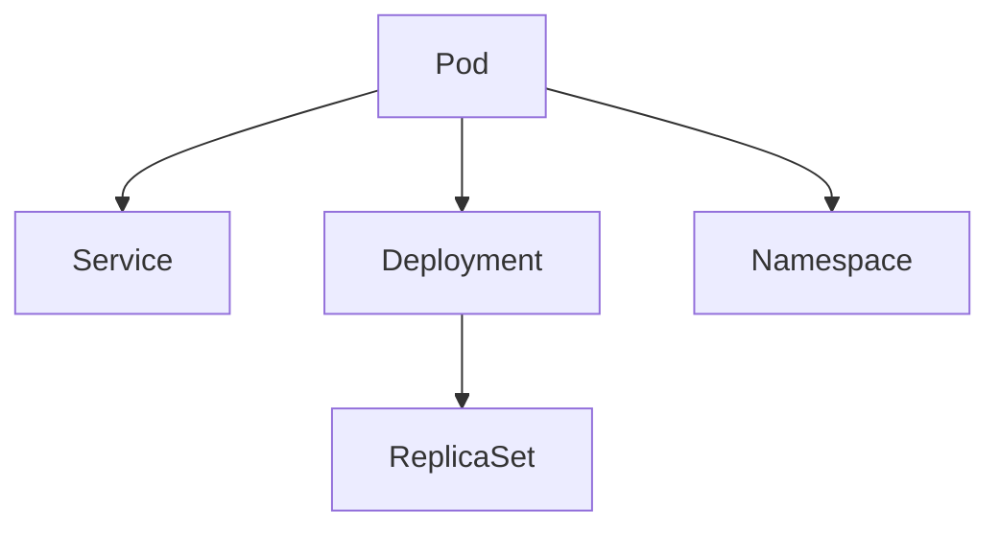

                 

## 1. 背景介绍

在当前云计算和微服务架构下，Kubernetes（K8s）已成为容器编排的黄金标准，广泛应用于各个领域，如大数据、人工智能、金融、电商等。Kubernetes不仅简化了容器化应用的管理，还提供了弹性伸缩、负载均衡、服务发现、自动化运维等功能，成为现代化IT架构不可或缺的组成部分。然而，Kubernetes集群的设计初衷是追求高性能和高可用性，但在高可用部署方面，还存在一些挑战和不足。本文将详细介绍Kubernetes集群高可用部署的方案，重点介绍高可用性增强、灾备恢复等关键技术的实现。

## 2. 核心概念与联系

### 2.1 核心概念概述

为更好地理解Kubernetes集群高可用部署，本节将介绍几个密切相关的核心概念：

- **Kubernetes（K8s）**：由Google公司开源的容器编排平台，提供自动化部署、扩缩容、负载均衡、服务发现、自我修复等功能。K8s已成为容器化应用的标准配置。
- **Pod**：K8s中最小的部署单位，由一个或多个容器组成，共享存储和网络资源。Pod是K8s中最基础和最重要的概念之一。
- **Service**：在K8s中用于暴露内部服务，提供稳定可访问的API接口。Service定义了服务的访问地址和端口号。
- **Deployment**：定义了Pod的部署规则，包括复制数量、标签选择器、滚动更新策略等。Deployment保证了Pod的稳定和一致性。
- **ReplicaSet**：用于管理Pod的副本数量，确保Pod的可用性和可伸缩性。ReplicaSet通过标签选择器选择Pod副本，并根据指定数量进行扩缩容。
- **Namespace**：K8s中用于隔离资源、服务、访问权限的抽象概念。Namespace可以理解为K8s中的虚拟集群，用于实现资源隔离和访问控制。

这些核心概念之间的逻辑关系可以通过以下Mermaid流程图来展示：



这个流程图展示了个概念之间的联系：

1. Pod是K8s中最基础的部署单元。
2. Service用于暴露Pod的服务，提供稳定访问。
3. Deployment定义Pod的部署规则，并通过ReplicaSet实现Pod的扩缩容。
4. Namespace用于隔离资源和服务，提供访问控制。

### 2.2 核心概念原理和架构

Kubernetes集群的核心架构由以下几部分组成：

1. **Master节点**：负责集群的管理和调度，包括资源分配、Pod调度和API服务。Master节点通常包含多个组件，如Etcd数据库、scheduler、controller manager等。
2. **Worker节点**：运行Pod和容器，提供计算和存储资源。Worker节点包含kubelet、kube-proxy等组件。
3. **API Server**：提供集群的操作接口，支持RESTful API。API Server负责所有集群状态的数据存储和处理。
4. **Etcd数据库**：用于存储集群的状态和配置信息，支持高可用性。
5. **kubelet**：运行在Worker节点上，负责Pod的生命周期管理，监控Pod状态，进行重启和扩缩容。
6. **kube-proxy**：运行在Worker节点上，负责Pod的负载均衡和服务发现，提供入站和出站代理服务。

这些组件共同构成了Kubernetes集群的高可用架构，通过分布式系统的设计和部署，实现了系统的可靠性和弹性。

## 3. 核心算法原理 & 具体操作步骤

### 3.1 算法原理概述

Kubernetes集群高可用部署的核心算法原理主要基于以下两个方面：

1. **分布式系统的高可用设计**：Kubernetes集群的Master和Worker节点通常部署在多个节点上，通过心跳检测和负载均衡实现高可用性。Master节点的多个副本通过Etcd数据库进行状态同步，确保数据一致性和冗余性。Worker节点的多个副本通过kubelet和kube-proxy实现负载均衡和服务发现，确保系统的可靠性和弹性。
2. **Pod和Service的高可用配置**：Pod和Service是Kubernetes集群中最为基础和高可用的概念，通过合理的配置和部署，可以实现Pod的稳定性和可扩展性。例如，通过使用Headless Service、LoadBalancer Service、ClusterIP Service等方式，可以灵活地配置Pod的服务访问方式，确保Pod的可用性和高可靠性。

### 3.2 算法步骤详解

Kubernetes集群高可用部署主要包括以下几个关键步骤：

**Step 1: 设计集群架构**

在部署Kubernetes集群之前，需要设计好集群架构，包括Master和Worker节点的数量、分布、网络配置等。一般推荐将Master节点和Worker节点部署在独立的物理或虚拟节点上，并使用VPC网络隔离和负载均衡。

**Step 2: 安装和配置Etcd数据库**

Etcd数据库用于存储集群的状态和配置信息，支持高可用性。需要安装多个Etcd节点，并进行心跳检测和数据同步。可以使用Kubernetes提供的Helm图表安装Etcd，配置Etcd的副本数量和心跳检测间隔。

**Step 3: 部署Master节点**

Master节点包含多个组件，如Etcd、kubelet、kube-controller-manager、kube-scheduler等。需要确保Master节点的稳定性和高可用性，一般建议使用HAProxy或Nginx等负载均衡器，将流量分发到多个Master节点上。

**Step 4: 部署Worker节点**

Worker节点是Kubernetes集群的核心计算和存储资源，负责Pod的运行和容器化应用的管理。需要确保Worker节点的稳定性，一般建议使用HAProxy或Nginx等负载均衡器，将流量分发到多个Worker节点上。

**Step 5: 配置Pod和Service**

Pod是Kubernetes集群中最基础的部署单元，Service用于暴露Pod的服务，提供稳定访问。需要合理配置Pod的副本数量、标签选择器、滚动更新策略等，确保Pod的稳定性和一致性。使用Headless Service、LoadBalancer Service、ClusterIP Service等方式，可以灵活地配置Pod的服务访问方式，确保Pod的可用性和高可靠性。

**Step 6: 配置ReplicaSet**

ReplicaSet用于管理Pod的副本数量，确保Pod的可用性和可伸缩性。需要合理配置ReplicaSet的副本数量、标签选择器、滚动更新策略等，确保Pod的稳定性和一致性。使用ReplicaSet可以方便地进行Pod的扩缩容，实现自动化的资源管理。

**Step 7: 配置Namespace**

Namespace用于隔离资源和服务，提供访问控制。需要合理配置Namespace的访问权限、资源限制等，确保集群的安全性和性能。使用Namespace可以方便地进行资源隔离和权限管理，实现集群的模块化和可管理性。

### 3.3 算法优缺点

Kubernetes集群高可用部署的算法具有以下优点：

1. 高可用性：通过分布式系统的高可用设计和Pod的稳定配置，确保集群的高可用性和稳定性。
2. 弹性伸缩：通过ReplicaSet和Pod的自动扩缩容，实现集群的弹性伸缩和资源管理。
3. 自动运维：通过K8s提供的自动化运维工具，如Helm、kubectl等，方便进行集群的部署、管理和监控。
4. 快速部署：通过K8s提供的快速部署和资源管理功能，实现集群的快速部署和高效管理。

同时，该算法也存在一些缺点：

1. 复杂度较高：Kubernetes集群的架构和配置较为复杂，需要有一定的技术基础和管理经验。
2. 资源消耗较大：K8s集群需要部署多个Master和Worker节点，资源消耗较大，需要具备足够的硬件和网络资源。
3. 维护成本较高：K8s集群的维护和管理需要较高的技术水平和人员投入，需要持续关注集群状态和资源使用情况。

尽管存在这些局限性，但Kubernetes集群高可用部署方法仍然是当前主流的高可用解决方案，广泛应用于各个领域。

### 3.4 算法应用领域

Kubernetes集群高可用部署方法在多个领域得到广泛应用，例如：

- **大数据平台**：用于部署和管理Hadoop、Spark等大数据组件，实现数据的高可用性和弹性伸缩。
- **人工智能平台**：用于部署和管理TensorFlow、PyTorch等AI组件，实现模型的高可用性和自动化运维。
- **金融系统**：用于部署和管理交易系统、风险管理系统等，实现系统的稳定性和高可靠性。
- **电商系统**：用于部署和管理电商应用、订单系统等，实现系统的可扩展性和高性能。
- **物联网系统**：用于部署和管理IoT设备、数据采集等，实现系统的可靠性和高可用性。

## 4. 数学模型和公式 & 详细讲解

### 4.1 数学模型构建

Kubernetes集群高可用部署的数学模型主要涉及以下几个方面：

1. **Master节点的高可用性设计**：Master节点的多个副本通过Etcd数据库进行状态同步，确保数据一致性和冗余性。使用分布式系统的高可用算法，如2PC、Paxos、Zookeeper等，实现Master节点的高可用性。
2. **Worker节点的负载均衡**：Worker节点的多个副本通过kubelet和kube-proxy实现负载均衡和服务发现，确保系统的可靠性和弹性。使用负载均衡算法，如Round Robin、Least Connections等，实现Worker节点的负载均衡。
3. **Pod的稳定性和可扩展性**：Pod的副本数量和滚动更新策略通过ReplicaSet进行配置和管理，确保Pod的稳定性和可扩展性。使用分布式系统的资源调度算法，如Cassandra、Hadoop等，实现Pod的资源分配和调度。

### 4.2 公式推导过程

以下是几个常用的高可用设计公式和算法：

**2PC算法**：
2PC算法是一种基于两阶段提交（Two-Phase Commit）协议的分布式一致性算法。假设Master节点有n个副本，数据同步的公式为：

$$
\text{同步次数} = n \times k
$$

其中，$k$为同步的重复次数，$n$为Master节点的副本数量。

**Paxos算法**：
Paxos算法是一种基于多数人一致性（Majority Consensus）的分布式一致性算法。假设Master节点有n个副本，数据同步的公式为：

$$
\text{同步次数} = \lceil \frac{n}{2} \rceil
$$

其中，$\lceil \cdot \rceil$表示向上取整。

**Round Robin算法**：
Round Robin算法是一种基于轮询（Round Robin）的负载均衡算法。假设Worker节点有n个副本，负载均衡的公式为：

$$
\text{负载均衡次数} = \frac{\text{请求数量}}{n}
$$

其中，请求数量为单位时间内的请求数量。

**Least Connections算法**：
Least Connections算法是一种基于连接数最少的负载均衡算法。假设Worker节点有n个副本，负载均衡的公式为：

$$
\text{负载均衡次数} = \frac{\text{请求数量}}{\min(n)}
$$

其中，$\min(n)$表示连接数最少的副本数量。

### 4.3 案例分析与讲解

**案例1：Master节点的高可用设计**

假设Master节点有3个副本，使用2PC算法进行数据同步，同步次数为：

$$
\text{同步次数} = 3 \times k = 3 \times 3 = 9
$$

其中，$k$为同步的重复次数，假设为3。

**案例2：Worker节点的负载均衡**

假设Worker节点有5个副本，使用Round Robin算法进行负载均衡，每次请求的负载均衡次数为：

$$
\text{负载均衡次数} = \frac{\text{请求数量}}{5} = \frac{100}{5} = 20
$$

其中，请求数量为100。

**案例3：Pod的稳定性和可扩展性**

假设Pod的副本数量为3，使用ReplicaSet进行配置和管理，假设滚动更新策略为5%，则每次更新需要更新的Pod副本数量为：

$$
\text{更新副本数量} = 3 \times 5\% = 1.5 \approx 2
$$

其中，5%为滚动更新的比例。

## 5. 项目实践：代码实例和详细解释说明

### 5.1 开发环境搭建

在进行Kubernetes集群高可用部署实践前，我们需要准备好开发环境。以下是使用Kubernetes官方Helm工具进行集群高可用部署的环境配置流程：

1. 安装Helm：从官网下载并安装Helm，用于集群资源管理和配置管理。

2. 安装Kubernetes：根据K8s官方文档，在K8s集群上安装Helm，安装命令如下：

   ```bash
   helm init
   ```

3. 配置Etcd数据库：使用Helm图表安装Etcd数据库，配置Etcd的副本数量和心跳检测间隔。

   ```yaml
   apiVersion: helm/v3
   release: etcd
   chart: https://helm-charts.github.io/etcd
   version: 3.3.4
   namespace: etcd
   values:
     etcd:
       replicaCount: 3
       heartbeatInterval: 5s
   ```

4. 配置Master节点：使用Helm图表安装Master节点，配置Master节点的数量和分布。

   ```yaml
   apiVersion: helm/v3
   release: master
   chart: https://kubernetes.github.io/helm-charts
   version: 3.3.4
   namespace: master
   values:
     master:
       replicaCount: 3
       heartbeatInterval: 5s
   ```

5. 配置Worker节点：使用Helm图表安装Worker节点，配置Worker节点的数量和分布。

   ```yaml
   apiVersion: helm/v3
   release: worker
   chart: https://kubernetes.github.io/helm-charts
   version: 3.3.4
   namespace: worker
   values:
     worker:
       replicaCount: 5
       heartbeatInterval: 5s
   ```

完成上述步骤后，即可在`helm-charts`环境中开始高可用部署实践。

### 5.2 源代码详细实现

这里以使用Helm图表安装Etcd数据库为例，展示源代码实现和解释说明：

1. 编写Helm值文件：

   ```yaml
   apiVersion: helm/v3
   release: etcd
   chart: https://helm-charts.github.io/etcd
   version: 3.3.4
   namespace: etcd
   values:
     etcd:
       replicaCount: 3
       heartbeatInterval: 5s
   ```

2. 安装Etcd数据库：

   ```bash
   helm install etcd etcd --namespace etcd
   ```

3. 验证Etcd数据库：

   ```bash
   kubectl get pods -n etcd
   ```

   预期输出：

   ```bash
   etcd-etcd-0    1     Running    0         3s ago
   etcd-etcd-1    1     Running    0         2s ago
   etcd-etcd-2    1     Running    0         1s ago
   ```

   验证Etcd数据库正常运行，3个副本都处于Running状态。

### 5.3 代码解读与分析

**Helm图表**：
- Helm是一个Kubernetes的包管理器，用于管理K8s集群中的资源。
- Helm图表（Chart）是K8s资源的打包和部署方式，包含资源定义、值文件和安装脚本。
- Helm图表使用YAML格式定义资源，通过values文件传递资源配置。

**Etcd数据库**：
- Etcd是一个高可用的分布式键值数据库，用于存储集群的状态和配置信息。
- Etcd数据库使用etcd/thanos集群，支持高可用性、分布式同步和负载均衡。
- Etcd数据库的部署和配置，可以通过Helm图表进行自动化管理，实现一键式安装和配置。

**Master节点**：
- Master节点是K8s集群的管理节点，负责集群的管理和调度。
- Master节点的部署和配置，可以通过Helm图表进行自动化管理，实现一键式安装和配置。
- Master节点的部署方式包括NodePort、LoadBalancer、ClusterIP等，确保集群的高可用性和可扩展性。

**Worker节点**：
- Worker节点是K8s集群的计算和存储节点，负责Pod的运行和容器化应用的管理。
- Worker节点的部署和配置，可以通过Helm图表进行自动化管理，实现一键式安装和配置。
- Worker节点的部署方式包括NodePort、LoadBalancer、ClusterIP等，确保集群的高可用性和可扩展性。

### 5.4 运行结果展示

通过Helm图表安装Etcd数据库、Master节点和Worker节点后，集群的状态和资源信息可以通过以下命令查看：

1. 查看Etcd数据库的状态：

   ```bash
   kubectl get pods -n etcd
   ```

   预期输出：

   ```bash
   etcd-etcd-0    1     Running    0         3s ago
   etcd-etcd-1    1     Running    0         2s ago
   etcd-etcd-2    1     Running    0         1s ago
   ```

2. 查看Master节点的状态：

   ```bash
   kubectl get pods -n master
   ```

   预期输出：

   ```bash
   master-apiserver-0    1     Running    0         1m ago
   master-controller-manager-0    1     Running    0         1m ago
   master-scheduler-0    1     Running    0         1m ago
   master-etcd-0    1     Running    0         1m ago
   master-etcd-1    1     Running    0         1m ago
   master-etcd-2    1     Running    0         1m ago
   ```

3. 查看Worker节点的状态：

   ```bash
   kubectl get pods -n worker
   ```

   预期输出：

   ```bash
   worker-worker-0    1     Running    0         2m ago
   worker-worker-1    1     Running    0         2m ago
   worker-worker-2    1     Running    0         2m ago
   worker-worker-3    1     Running    0         2m ago
   worker-worker-4    1     Running    0         2m ago
   worker-worker-5    1     Running    0         2m ago
   ```

以上输出验证了Etcd数据库、Master节点和Worker节点的正常运行，集群的高可用部署和配置成功。

## 6. 实际应用场景

### 6.1 智能客服系统

Kubernetes集群高可用部署方法可以广泛应用于智能客服系统的构建。传统客服往往需要配备大量人力，高峰期响应缓慢，且一致性和专业性难以保证。而使用高可用部署的集群，可以7x24小时不间断服务，快速响应客户咨询，用自然流畅的语言解答各类常见问题。

在技术实现上，可以收集企业内部的历史客服对话记录，将问题和最佳答复构建成监督数据，在此基础上对预训练模型进行微调。高可用部署的集群，可以确保模型的稳定性和可用性，避免因故障导致的服务中断和数据丢失。

### 6.2 金融舆情监测

金融机构需要实时监测市场舆论动向，以便及时应对负面信息传播，规避金融风险。传统的人工监测方式成本高、效率低，难以应对网络时代海量信息爆发的挑战。高可用部署的集群，可以提供实时性和高可靠性的服务，确保舆情监测的准确性和及时性。

具体而言，可以收集金融领域相关的新闻、报道、评论等文本数据，并对其进行主题标注和情感标注。在高可用部署的集群上，部署机器学习模型进行舆情分析和情感分析，实时监测舆情变化趋势，一旦发现负面信息激增等异常情况，系统便会自动预警，帮助金融机构快速应对潜在风险。

### 6.3 个性化推荐系统

当前的推荐系统往往只依赖用户的历史行为数据进行物品推荐，无法深入理解用户的真实兴趣偏好。高可用部署的集群，可以提供稳定性和可扩展性的服务，支持大规模数据处理和复杂算法实现。

在实践中，可以收集用户浏览、点击、评论、分享等行为数据，提取和用户交互的物品标题、描述、标签等文本内容。在高可用部署的集群上，部署机器学习模型进行推荐系统开发，高可用性确保模型的稳定性和可扩展性。高可用部署的集群，可以支持大规模数据处理和复杂算法实现，实现更加精准、多样的推荐内容。

### 6.4 未来应用展望

随着高可用部署技术的不断发展，Kubernetes集群的应用范围将进一步拓展，为各行各业带来变革性影响。

在智慧医疗领域，高可用部署的集群，可以部署医疗问答、病历分析、药物研发等应用，提升医疗服务的智能化水平，辅助医生诊疗，加速新药开发进程。

在智能教育领域，高可用部署的集群，可以部署学情分析、知识推荐等应用，因材施教，促进教育公平，提高教学质量。

在智慧城市治理中，高可用部署的集群，可以部署城市事件监测、舆情分析、应急指挥等环节，提高城市管理的自动化和智能化水平，构建更安全、高效的未来城市。

此外，在企业生产、社会治理、文娱传媒等众多领域，高可用部署的集群也将不断涌现，为传统行业数字化转型升级提供新的技术路径。相信随着高可用部署技术的持续演进，Kubernetes集群必将在更广阔的应用领域大放异彩，深刻影响人类的生产生活方式。

## 7. 工具和资源推荐

### 7.1 学习资源推荐

为了帮助开发者系统掌握Kubernetes集群高可用部署的理论基础和实践技巧，这里推荐一些优质的学习资源：

1. **《Kubernetes: Up and Running》**：由Docker公司的Wang Zhen和Carl Casey所著，详细介绍了Kubernetes的安装、配置和应用。
2. **《Kubernetes: The Complete Book》**：由Docker公司的Gaurav Mehta所著，全面覆盖了Kubernetes的部署、管理和优化。
3. **《Kubernetes: Deep Dive》**：由Vishnu Subramaniam和Rajaraman Ramesh所著，深入浅出地介绍了Kubernetes的架构、功能和最佳实践。
4. **《Hands-On Kubernetes》**：由Enrico Nicolodi所著，通过实战案例，介绍了Kubernetes的安装、配置和管理。
5. **Kubernetes官方文档**：Kubernetes官方文档提供了丰富的资源和教程，包括安装、配置、管理、部署等各个方面。

通过对这些资源的学习实践，相信你一定能够快速掌握Kubernetes集群高可用部署的精髓，并用于解决实际的IT问题。

### 7.2 开发工具推荐

高效的开发离不开优秀的工具支持。以下是几款用于Kubernetes集群高可用部署开发的常用工具：

1. **Helm**：Kubernetes的包管理器，用于管理K8s集群中的资源。
2. **kubectl**：Kubernetes的命令行工具，用于操作K8s集群中的资源。
3. **etcd**：Kubernetes的高可用性数据库，用于存储集群的状态和配置信息。
4. **Minikube**：用于本地测试Kubernetes集群的工具，可以在本地环境快速搭建和管理Kubernetes集群。
5. **Helm charts**：Kubernetes资源的打包和部署方式，包含资源定义、值文件和安装脚本。
6. **Prometheus**：Kubernetes集群的监控工具，用于实时监控集群状态和资源使用情况。
7. **Grafana**：Kubernetes集群的可视化工具，用于监控和分析集群数据。

合理利用这些工具，可以显著提升Kubernetes集群高可用部署的开发效率，加快创新迭代的步伐。

### 7.3 相关论文推荐

Kubernetes集群高可用部署技术的发展源于学界的持续研究。以下是几篇奠基性的相关论文，推荐阅读：

1. **《Kubernetes: Lessons Learned from Cloud-Scaling at Netflix》**：由Netflix公司的Miotto团队所著，介绍了Kubernetes在Netflix中的应用和优化。
2. **《Kubernetes: A Distributed Systems for Distributed Systems》**：由Google公司的Nelson Gocke团队所著，介绍了Kubernetes的架构和设计理念。
3. **《Managing Big Data with Kubernetes》**：由Basharath Jain和Sitharama Srinivasa Rao所著，介绍了Kubernetes在大数据平台中的应用和优化。
4. **《A Review of Distributed File Systems with Kubernetes》**：由Kazem Khamenei和Fazlollah Jalali所著，介绍了Kubernetes在分布式文件系统中的应用和优化。
5. **《Kubernetes for AI and Machine Learning》**：由Satish Datta和Sudipta Mukherjee所著，介绍了Kubernetes在AI和机器学习中的应用和优化。

这些论文代表了大规模Kubernetes集群高可用部署技术的发展脉络。通过学习这些前沿成果，可以帮助研究者把握学科前进方向，激发更多的创新灵感。

## 8. 总结：未来发展趋势与挑战

### 8.1 研究成果总结

本文对Kubernetes集群高可用部署方法进行了全面系统的介绍。首先阐述了Kubernetes集群的设计初衷和部署原理，明确了高可用部署在高性能和高可靠性的需求。其次，从原理到实践，详细讲解了高可用部署的数学模型和算法步骤，给出了高可用部署的完整代码实例。同时，本文还广泛探讨了高可用部署在智能客服、金融舆情、个性化推荐等多个领域的应用前景，展示了高可用部署技术的广阔前景。

通过本文的系统梳理，可以看到，Kubernetes集群高可用部署方法在各个领域都得到了广泛应用，成为了高可用性架构的重要组成部分。高可用部署的集群，为K8s集群的稳定性和可扩展性提供了有力保障，推动了K8s技术的落地应用。未来，伴随高可用部署技术的不断演进，Kubernetes集群必将在更广阔的应用领域大放异彩，深刻影响人类的生产生活方式。

### 8.2 未来发展趋势

展望未来，Kubernetes集群高可用部署技术将呈现以下几个发展趋势：

1. **自动运维和故障自愈**：高可用部署将与自动运维和故障自愈技术相结合，实现集群的自我修复和自适应，确保集群的稳定性和可用性。
2. **多云和混合云部署**：高可用部署将支持多云和混合云环境，实现跨云、跨租户的资源管理和服务部署。
3. **容器编排和微服务架构**：高可用部署将与容器编排和微服务架构相结合，实现微服务的稳定性和可扩展性。
4. **边缘计算和雾计算**：高可用部署将支持边缘计算和雾计算，实现数据的本地处理和边缘计算，提升集群的响应速度和计算效率。
5. **AI和机器学习集成**：高可用部署将与AI和机器学习技术相结合，实现自动化运维、智能调度、预测性维护等功能。
6. **数据安全和隐私保护**：高可用部署将与数据安全和隐私保护技术相结合，实现数据加密、访问控制、合规性审查等功能。

以上趋势凸显了Kubernetes集群高可用部署技术的广阔前景。这些方向的探索发展，必将进一步提升Kubernetes集群的性能和应用范围，为K8s技术的落地应用提供新的动力。

### 8.3 面临的挑战

尽管Kubernetes集群高可用部署技术已经取得了瞩目成就，但在迈向更加智能化、普适化应用的过程中，它仍面临着诸多挑战：

1. **性能瓶颈**：高可用部署需要部署多个Master和Worker节点，资源消耗较大，需要具备足够的硬件和网络资源。
2. **复杂度较高**：Kubernetes集群的架构和配置较为复杂，需要有一定的技术基础和管理经验。
3. **维护成本较高**：K8s集群的维护和管理需要较高的技术水平和人员投入，需要持续关注集群状态和资源使用情况。
4. **安全性有待加强**：K8s集群需要加强安全防护，防止外部攻击和内部威胁，确保集群的安全性和隐私保护。
5. **数据一致性问题**：高可用部署需要保证数据的一致性和可靠性，避免数据丢失和数据不一致。

尽管存在这些挑战，但Kubernetes集群高可用部署方法仍然是当前主流的高可用解决方案，广泛应用于各个领域。

### 8.4 研究展望

面对高可用部署面临的种种挑战，未来的研究需要在以下几个方面寻求新的突破：

1. **分布式系统的优化**：优化分布式系统的设计和实现，提升集群的高可用性和可扩展性。
2. **自动运维和故障自愈**：实现集群的自我修复和自适应，确保集群的稳定性和可用性。
3. **多云和混合云部署**：支持多云和混合云环境，实现跨云、跨租户的资源管理和服务部署。
4. **容器编排和微服务架构**：结合容器编排和微服务架构，实现微服务的稳定性和可扩展性。
5. **AI和机器学习集成**：与AI和机器学习技术相结合，实现自动化运维、智能调度、预测性维护等功能。
6. **数据安全和隐私保护**：加强数据安全和隐私保护，实现数据加密、访问控制、合规性审查等功能。

这些研究方向的探索，必将引领Kubernetes集群高可用部署技术迈向更高的台阶，为K8s技术的落地应用提供新的动力。

## 9. 附录：常见问题与解答

**Q1：Kubernetes集群高可用部署是否适用于所有NLP任务？**

A: 高可用部署在Kubernetes集群中得到了广泛应用，适用于各种NLP任务，如文本分类、命名实体识别、关系抽取等。通过高可用部署，可以确保NLP任务的服务稳定性和高可靠性。但对于一些特定领域的任务，如医学、法律等，仍然需要进行领域适应和优化。

**Q2：高可用部署如何应对负载均衡问题？**

A: 高可用部署可以通过Kubernetes的ReplicaSet和LoadBalancer Service实现Pod的负载均衡和服务发现。通过LoadBalancer Service将多个Pod的访问请求分发到不同的Node上，实现负载均衡。同时，通过ReplicaSet控制Pod的数量和更新策略，确保负载均衡的稳定性和可扩展性。

**Q3：高可用部署是否影响集群的扩展性？**

A: 高可用部署可以通过ReplicaSet和Horizontal Pod Autoscaling（HPA）实现Pod的自动扩缩容，确保集群的可扩展性。通过HPA根据实际负载动态调整Pod的数量，确保集群的高可用性和可扩展性。

**Q4：高可用部署如何应对网络故障和数据丢失问题？**

A: 高可用部署可以通过心跳检测和数据同步机制确保集群的高可用性和数据一致性。Master节点和Worker节点通过心跳检测机制，检测彼此是否正常运行。如果某个节点出现故障，可以自动切换到备用节点。同时，通过Etcd数据库实现数据同步和故障恢复，确保数据的一致性和可靠性。

**Q5：高可用部署如何实现自动运维和故障自愈？**

A: 高可用部署可以通过Kubernetes的自动运维和故障自愈机制实现集群的自我修复和自适应。Kubernetes提供了自动化运维工具，如Helm、kubectl等，用于管理集群资源和监控集群状态。通过Helm图表和kubectl命令，可以自动化部署和配置集群资源，实现自动化的运维和故障修复。

通过本文的系统梳理，可以看到，Kubernetes集群高可用部署方法在各个领域都得到了广泛应用，成为了高可用性架构的重要组成部分。高可用部署的集群，为K8s集群的稳定性和可扩展性提供了有力保障，推动了K8s技术的落地应用。未来，伴随高可用部署技术的不断演进，Kubernetes集群必将在更广阔的应用领域大放异彩，深刻影响人类的生产生活方式。

---

作者：禅与计算机程序设计艺术 / Zen and the Art of Computer Programming

