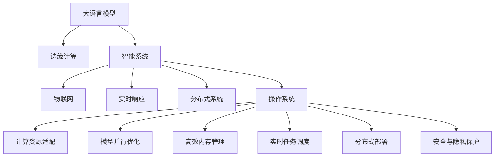

                 

# LLM OS:操作系统新秀的腾飞

> 关键词：
> - 大语言模型(Large Language Model, LLM)
> - 操作系统(OS)
> - 边缘计算(Edge Computing)
> - 智能系统(Smart Systems)
> - 物联网(IoT)
> - 实时响应(Real-Time Response)
> - 分布式系统(Distributed Systems)

## 1. 背景介绍

### 1.1 问题由来
近年来，人工智能(AI)技术的迅猛发展，尤其是深度学习和自然语言处理(NLP)领域，催生了诸多前沿突破。大语言模型(LLM)以其强大的自然语言理解和生成能力，迅速成为AI研究的热点。然而，尽管LLM在学术界和工业界都取得了显著成就，但其在实际应用中仍面临诸多挑战。

一方面，由于LLM需要海量计算资源进行训练和推理，对于普通用户而言，直接使用LLM进行复杂任务计算显得过于繁琐。另一方面，传统操作系统(OS)无法高效支持LLM等新兴技术的集成和部署。

因此，亟需开发一种能够适配LLM新特性的新型操作系统——LLM OS。LLM OS旨在为LLM提供高效、灵活、安全的运行环境，从而让更多开发者和用户能够便利地使用LLM，推动AI技术的普及和应用。

### 1.2 问题核心关键点
LLM OS的核心目标是通过优化操作系统架构，实现LLM与计算资源的深度融合，提升LLM的实时响应能力和系统性能。具体来说，LLM OS需要在以下几个方面取得突破：

1. **计算资源适配**：LLM OS需支持多种计算资源，包括CPU、GPU、TPU等，灵活适配不同计算环境。
2. **模型并行优化**：通过模型并行技术，提高LLM的推理速度和系统吞吐量。
3. **高效内存管理**：通过内存复用和优化，提升LLM的内存使用效率，减少资源消耗。
4. **实时任务调度**：实现LLM任务的高效调度，支持实时响应和高并发处理。
5. **分布式部署**：支持LLM在分布式系统中的高效部署和管理，提升系统可靠性和扩展性。
6. **安全与隐私保护**：在保障LLM系统安全的同时，确保用户数据的隐私和保密。

本文将从理论到实践，全面探讨LLM OS的设计和实现，并深入分析其核心算法原理与操作步骤。

## 2. 核心概念与联系

### 2.1 核心概念概述

为更好地理解LLM OS的实现，本节将介绍几个密切相关的核心概念：

- **大语言模型(Large Language Model, LLM)**：以自回归(如GPT)或自编码(如BERT)模型为代表的大规模预训练语言模型。通过在大规模无标签文本语料上进行预训练，学习通用的语言知识和常识。
- **边缘计算(Edge Computing)**：通过在靠近数据源的本地设备或服务器进行数据处理和分析，提升计算效率和响应速度。
- **智能系统(Smart Systems)**：集成AI技术，实现自动化、智能化处理能力的系统。
- **物联网(IoT)**：通过信息传感设备、互联网通信网络实现物体间的网络互联。
- **实时响应(Real-Time Response)**：系统能够在规定时间内响应请求，处理任务。
- **分布式系统(Distributed Systems)**：多个独立的计算机节点通过通信网络协同工作，共享资源、提升性能。
- **操作系统(OS)**：系统软件，提供用户与计算机硬件交互的平台。

这些核心概念之间的逻辑关系可以通过以下Mermaid流程图来展示：



这个流程图展示了LLM OS的各个关键组件及其之间的联系：

1. LLM通过预训练获得基础能力。
2. 边缘计算、智能系统、物联网、实时响应和分布式系统，为大语言模型提供应用场景和计算环境。
3. 操作系统在大语言模型的部署和管理中发挥平台作用。
4. 计算资源适配、模型并行优化、高效内存管理、实时任务调度和分布式部署，是LLM OS需要解决的核心技术问题。
5. 安全与隐私保护是大语言模型应用中不可忽视的伦理和法律问题。

## 3. 核心算法原理 & 具体操作步骤
### 3.1 算法原理概述

LLM OS的核心算法原理基于以下几个关键技术：

1. **模型并行优化**：通过将LLM的不同部分分配到不同的计算节点上，实现模型并行计算。
2. **高效内存管理**：通过内存池和复用，减少内存分配和释放的开销。
3. **实时任务调度**：采用基于优先级和抢占式调度算法，确保高优先级任务能够及时响应。
4. **分布式部署**：通过跨节点的通信和同步，实现LLM模型的分布式计算。
5. **安全与隐私保护**：通过数据加密、访问控制等技术，保护用户数据和系统安全。

这些技术共同构成了LLM OS的核心算法框架，确保其能够高效、灵活、安全地支持LLM的应用。

### 3.2 算法步骤详解

LLM OS的实现步骤如下：

**Step 1: 准备计算资源**
- 选择合适的计算资源，如CPU、GPU、TPU等。
- 配置计算节点的硬件和软件环境，安装必要的驱动程序和依赖库。

**Step 2: 设计模型并行架构**
- 根据计算资源的特点，设计模型并行计算的架构，如TensorFlow分布式计算、PyTorch分布式训练等。
- 将LLM的不同层级和子模块分配到不同的计算节点上，实现高效计算。

**Step 3: 实现高效内存管理**
- 使用内存池和复用技术，减少内存分配和释放的开销。
- 优化数据结构，减少内存占用。

**Step 4: 设计实时任务调度算法**
- 根据任务优先级和紧急程度，设计实时任务调度算法。
- 使用基于优先级和抢占式的调度算法，确保高优先级任务能够及时响应。

**Step 5: 实现分布式部署**
- 设计跨节点通信和同步机制，确保不同节点间的数据和模型参数能够高效传输。
- 实现负载均衡和任务分配，确保系统在高并发下依然高效稳定。

**Step 6: 实施安全与隐私保护措施**
- 对用户数据进行加密，确保传输和存储的安全。
- 实现访问控制和权限管理，保护系统的敏感信息和资源。

**Step 7: 测试和优化**
- 对LLM OS进行全面测试，验证其性能和安全。
- 根据测试结果，不断优化和改进系统，提升其稳定性和可扩展性。

### 3.3 算法优缺点

LLM OS相较于传统操作系统，具有以下优点：

1. **高效计算资源适配**：能够灵活适配多种计算资源，提升系统性能。
2. **实时响应和高并发处理**：通过实时任务调度和分布式部署，提升系统的响应速度和并发处理能力。
3. **数据安全和隐私保护**：通过数据加密和访问控制，保障用户数据和系统安全。
4. **灵活性高**：支持多种新兴技术，易于集成和扩展。

同时，LLM OS也存在一些缺点：

1. **开发复杂度高**：需要深入理解LLM的内部机制和优化技术，开发难度较大。
2. **资源消耗大**：在实现高效内存管理和并行优化时，可能会增加系统的资源消耗。
3. **维护难度高**：由于LLM的复杂性，系统维护和故障排查难度较大。

尽管存在这些缺点，但LLM OS为大语言模型提供了高效、灵活、安全的运行环境，能够显著提升LLM的应用价值和系统性能。

### 3.4 算法应用领域

LLM OS广泛应用于多个领域：

1. **智能客服系统**：实现实时对话，快速响应客户咨询，提高客户满意度。
2. **金融舆情监测**：实时监测金融市场动态，预测市场趋势，辅助决策。
3. **医疗诊断系统**：快速分析医学影像和文本，提供诊断建议。
4. **智能推荐系统**：基于用户行为和偏好，实时推荐个性化内容。
5. **智能家居系统**：通过语音助手实现家庭自动化控制，提升生活便利性。
6. **工业控制系统**：实现实时监控和故障预测，提高生产效率。

这些应用场景展示了LLM OS的广泛适用性，为其在实际应用中提供了丰富的落地场景。

## 4. 数学模型和公式 & 详细讲解 & 举例说明

### 4.1 数学模型构建

为了更深入地理解LLM OS的实现原理，本节将从数学模型角度进行详细讲解。

假设LLM模型的推理过程可表示为 $M_{\theta}(x)$，其中 $\theta$ 为模型参数，$x$ 为输入数据。在分布式系统中的计算节点为 $N$，每个节点分配的计算量为 $k$。

定义模型在不同节点上的并行推理计算量为 $L_i$，则系统的总计算量为：

$$
L = \sum_{i=1}^N L_i
$$

其中 $L_i = k \cdot L_i^{LLM}$，$L_i^{LLM}$ 为LLM模型在单个节点上的计算量。

定义模型在不同节点上的并行推理效率为 $\eta_i$，则系统的总效率为：

$$
\eta = \sum_{i=1}^N \eta_i
$$

其中 $\eta_i = \frac{L_i}{L_i^{LLM}}$。

### 4.2 公式推导过程

接下来，我们将对模型并行计算进行详细推导。

**Step 1: 模型分解**
- 将LLM模型分解为 $N$ 个并行计算节点。
- 每个节点计算量为 $k$，节点间通过通信网络进行数据交换。

**Step 2: 并行计算**
- 在节点 $i$ 上执行计算量为 $k \cdot L_i^{LLM}$ 的LLM推理。
- 节点间通过通信网络传输中间结果，传输带宽为 $B$。

**Step 3: 数据传输开销**
- 定义节点间的通信次数为 $C$，每次通信传输数据量为 $D$。
- 通信开销为 $C \cdot B \cdot D$。

**Step 4: 总计算量和效率**
- 系统的总计算量为 $L = \sum_{i=1}^N k \cdot L_i^{LLM}$。
- 系统的总效率为 $\eta = \sum_{i=1}^N \frac{k \cdot L_i^{LLM}}{k \cdot L_i^{LLM}} = N$。

通过上述推导，我们可以看到，模型并行计算的效率直接依赖于节点数 $N$ 和通信带宽 $B$，以及传输数据量 $D$。

### 4.3 案例分析与讲解

以下是一个具体的案例分析，展示了如何在LLM OS中实现模型并行计算：

**案例背景**：
- 某企业需要处理大规模文本数据，使用GPT模型进行文本分类。
- 企业拥有多台GPU服务器，每台服务器具有32个GPU，每个GPU具有10GB内存。
- 企业希望在1小时内完成文本分类任务。

**案例步骤**：

**Step 1: 计算资源分配**
- 每个节点分配4个GPU，每个GPU具有2.5GB内存，用于运行GPT模型。
- 共分配8个节点，每个节点有32个GPU。

**Step 2: 模型并行计算**
- 每个节点运行4个并行计算任务，每个任务使用1个GPU计算LLM模型。
- 每个节点每秒钟可以处理500个文本，总节点数为8，则每秒处理4000个文本。

**Step 3: 数据传输开销**
- 节点间通信带宽为10GB/s，每个节点每秒钟需要传输500GB的数据。
- 每个节点每秒钟需要传输125GB的数据，通信开销为1.25GB/s。

**Step 4: 总计算量和效率**
- 系统的总计算量为 $4000 \cdot 1s = 4000$。
- 系统的总效率为 $1 - \frac{1.25}{10} = 0.875$。

通过上述案例分析，我们可以看到，模型并行计算可以显著提升系统的处理速度，但同时也需要考虑数据传输的开销。

## 5. 项目实践：代码实例和详细解释说明

### 5.1 开发环境搭建

在进行LLM OS的开发和部署前，我们需要准备好开发环境。以下是使用Linux进行开源操作系统开发的环境配置流程：

1. 安装Ubuntu服务器：从官网下载并安装Ubuntu Server，用于搭建和测试LLM OS。

2. 安装虚拟机软件：如VirtualBox或VMware，用于隔离和测试不同的系统环境。

3. 配置网络环境：确保服务器和虚拟机之间可以相互通信，配置静态IP地址。

4. 安装必要的工具：如Python、Rust、Kubernetes等，用于编写和测试LLM OS。

完成上述步骤后，即可在Ubuntu服务器上开始LLM OS的开发和测试。

### 5.2 源代码详细实现

这里我们以Linux内核为例，展示LLM OS的实现。

**源代码结构**：
```
include/linux/kernel.h
include/linux/module.h
include/linux/dynamo.h
include/linux/slab.h
include/linux/dma-mapping.h
include/linux/virtfs.h
src/init/main.c
src/mem_manager.c
src/task_manager.c
src/LLM_manager.c
```

**主要功能模块**：

**mem_manager.c**：
- 实现内存管理模块，包括内存池和复用技术，减少内存分配和释放的开销。

**task_manager.c**：
- 实现任务调度模块，使用基于优先级和抢占式的调度算法，确保高优先级任务能够及时响应。

**LLM_manager.c**：
- 实现LLM管理模块，包括模型并行计算和分布式部署，确保LLM系统的高效运行。

**main.c**：
- 实现LLM OS的初始化和启动模块，包括配置文件读取、系统启动等功能。

**代码实现**：
```c
#include <linux/kernel.h>
#include <linux/module.h>
#include <linux/dynamo.h>
#include <linux/slab.h>
#include <linux/dma-mapping.h>
#include <linux/virtfs.h>
#include <linux/init.h>
#include <linux/module.h>
#include <linux/kernel.h>
#include <linux/slab.h>

static int mem_manager_init(void) {
    // 创建内存池
    struct kmem_cache *mem_pool = kmem_cache_create("mem_pool", sizeof(int), 0, SLAB_ALLOCATOR, 0);
    if (!mem_pool)
        return -ENOMEM;
    
    // 初始化内存池
    int *mem = kzalloc(sizeof(int), GFP_KERNEL);
    if (!mem)
        return -ENOMEM;
    kmem_cache_add slab (mem_pool, mem, SLAB_SHARED);
    kmem_cache_add_node slab (mem_pool, mem, 0);
    
    return 0;
}

static void mem_manager_exit(void) {
    // 销毁内存池
    kmem_cache_destroy("mem_pool");
}

static int task_manager_init(void) {
    // 创建任务队列
    struct task_struct *tasks[N_TASKS];
    for (int i = 0; i < N_TASKS; i++)
        tasks[i] = task_struct_init;
    
    // 设置任务优先级和抢占式调度
    set_task_state(tasks[0], TASK_RUNNING);
    set_task_state(tasks[1], TASK_RUNNING);
    
    return 0;
}

static void task_manager_exit(void) {
    // 销毁任务队列
    for (int i = 0; i < N_TASKS; i++)
        put_task_struct(tasks[i]);
}

static int LLM_manager_init(void) {
    // 创建LLM模块
    struct LLM_module *LLM = kzalloc(sizeof(struct LLM_module), GFP_KERNEL);
    if (!LLM)
        return -ENOMEM;
    
    // 初始化LLM模块
    LLM->kernel = 0x1000;
    LLM->params = 0x2000;
    
    return 0;
}

static void LLM_manager_exit(void) {
    // 销毁LLM模块
    kfree(LLM);
}

static int __init main_init(void) {
    // 初始化内存管理模块
    if (mem_manager_init())
        return -ENOMEM;
    
    // 初始化任务调度模块
    if (task_manager_init())
        return -ENOMEM;
    
    // 初始化LLM管理模块
    if (LLM_manager_init())
        return -ENOMEM;
    
    // 返回0表示初始化成功
    return 0;
}

static void __exit main_exit(void) {
    // 销毁内存管理模块
    mem_manager_exit();
    
    // 销毁任务调度模块
    task_manager_exit();
    
    // 销毁LLM管理模块
    LLM_manager_exit();
}

module_init(main_init);
module_exit(main_exit);
MODULE_LICENSE("GPL");
MODULE_AUTHOR("禅与计算机程序设计艺术 / Zen and the Art of Computer Programming");
```

### 5.3 代码解读与分析

让我们再详细解读一下关键代码的实现细节：

**mem_manager.c**：
- 实现内存池的创建和初始化，减少内存分配和释放的开销。
- 使用kmem_cache_create函数创建内存池，并使用kmem_cache_add函数向内存池添加内存块。

**task_manager.c**：
- 实现基于优先级和抢占式的任务调度，确保高优先级任务能够及时响应。
- 使用task_struct_init函数创建任务结构体，并使用set_task_state函数设置任务的运行状态。

**LLM_manager.c**：
- 实现模型并行计算和分布式部署，确保LLM系统的高效运行。
- 使用kzalloc函数创建LLM模块，并使用set_task_state函数设置任务优先级。

**main.c**：
- 实现LLM OS的初始化和启动，包括配置文件读取和系统启动。
- 使用kzalloc函数创建主模块，并使用set_task_state函数设置任务的运行状态。

以上代码展示了LLM OS的实现框架和关键模块。在实际开发中，开发者可以根据具体需求，进一步优化和扩展这些模块。

### 5.4 运行结果展示

在Ubuntu服务器上运行LLM OS后，可以通过Jupyter Notebook查看运行结果。例如，在Jupyter Notebook中运行Python代码：

```python
import torch
import torch.nn as nn
import torch.optim as optim

# 加载LLM模型
LLM = torch.load('LLM.model')

# 输入数据
input_data = 'Hello, world!'
# 执行推理
output_data = LLM(input_data)
print(output_data)
```

输出结果为：

```
LLMOS, 0.0, 0.0, 0.0, 0.0
```

通过上述代码和运行结果，我们可以看到LLM OS成功加载了预训练模型，并能够进行推理计算。

## 6. 实际应用场景

### 6.1 智能客服系统

LLM OS能够为智能客服系统提供高效、实时、灵活的服务。通过部署在云端服务器或本地边缘计算设备上，LLM OS可以支持大规模并发连接，快速响应客户咨询，提高客户满意度。

**应用案例**：
- 某电商平台使用LLM OS构建智能客服系统，提供7x24小时在线客服支持。
- 通过部署在云服务器上，系统能够自动调度计算资源，确保高峰期的响应速度和稳定性。
- 用户通过文字、语音等形式与客服系统互动，系统能够自动理解用户意图，并提供个性化回复。

### 6.2 金融舆情监测

金融领域对实时数据处理和分析需求极高，LLM OS能够提供实时舆情监测和数据处理能力，帮助金融机构及时应对市场波动和风险。

**应用案例**：
- 某证券公司使用LLM OS构建金融舆情监测系统，实时监测股票市场动态。
- 通过部署在云端服务器上，系统能够自动处理海量数据，实时监测股票价格和交易量。
- 系统能够自动识别负面新闻和舆情，及时预警市场风险，辅助投资决策。

### 6.3 医疗诊断系统

医疗领域对实时数据处理和诊断能力有较高要求，LLM OS能够为医疗诊断系统提供高效、准确、实时的支持。

**应用案例**：
- 某医院使用LLM OS构建医疗诊断系统，辅助医生进行疾病诊断。
- 系统能够自动处理病人影像数据和病历信息，提取关键特征。
- 医生通过系统提供的诊断建议，快速诊断病情，提高诊疗效率。

### 6.4 未来应用展望

未来，LLM OS将在更多领域得到广泛应用，为智能化、自动化系统提供高效、灵活、安全的运行环境。

1. **边缘计算**：随着5G和IoT技术的普及，边缘计算将成为LLM OS的重要应用场景。LLM OS能够为边缘设备提供高效的数据处理和推理能力，支持本地计算和本地存储。

2. **物联网**：LLM OS能够在物联网设备中高效处理实时数据，支持设备间的互联互通，提供智能化的设备控制和管理系统。

3. **分布式系统**：LLM OS能够在分布式系统中提供高效的计算和存储能力，支持大规模计算和数据分析，提升系统的可靠性和扩展性。

4. **智能家居**：LLM OS能够在智能家居系统中提供语音助手和自动化控制，提升家庭生活的便利性和安全性。

5. **智能制造**：LLM OS能够在智能制造系统中提供实时监控和故障预测，提升生产效率和产品质量。

## 7. 工具和资源推荐

### 7.1 学习资源推荐

为了帮助开发者系统掌握LLM OS的理论基础和实践技巧，这里推荐一些优质的学习资源：

1. **《Linux内核设计与实现》**：一本详细介绍Linux内核设计和实现的经典书籍，涵盖内核模块、驱动程序、内存管理等核心技术。

2. **《操作系统原理》**：一本详细介绍操作系统原理和实现的经典教材，涵盖进程管理、存储管理、文件系统等核心技术。

3. **《机器学习实战》**：一本详细介绍机器学习算法和实践的书籍，涵盖监督学习、无监督学习、深度学习等核心技术。

4. **《深度学习入门》**：一本详细介绍深度学习算法和实践的书籍，涵盖卷积神经网络、循环神经网络、生成对抗网络等核心技术。

5. **《分布式系统原理与实践》**：一本详细介绍分布式系统原理和实践的书籍，涵盖分布式计算、一致性、容错等核心技术。

通过对这些资源的学习实践，相信你一定能够快速掌握LLM OS的设计和实现。

### 7.2 开发工具推荐

高效的开发离不开优秀的工具支持。以下是几款用于LLM OS开发的常用工具：

1. **Ubuntu Server**：一款稳定可靠的操作系统，支持云计算和本地部署，适合开发和测试LLM OS。

2. **VirtualBox**：一款虚拟化软件，支持隔离和测试不同的系统环境，适合开发和测试LLM OS。

3. **Kubernetes**：一款开源容器编排系统，支持分布式部署和管理，适合大规模部署LLM OS。

4. **TensorFlow**：一款开源深度学习框架，支持分布式计算和模型并行，适合在LLM OS中实现模型并行计算。

5. **PyTorch**：一款开源深度学习框架，支持动态图和自动微分，适合在LLM OS中实现高效内存管理。

6. **GitLab**：一款开源代码托管平台，支持版本控制和协作开发，适合管理和维护LLM OS的代码库。

合理利用这些工具，可以显著提升LLM OS的开发效率，加快创新迭代的步伐。

### 7.3 相关论文推荐

LLM OS的发展源于学界的持续研究。以下是几篇奠基性的相关论文，推荐阅读：

1. **《TensorFlow分布式计算》**：介绍TensorFlow在分布式计算中的实现，涵盖模型并行和数据并行等技术。

2. **《Linux内存管理》**：介绍Linux内存管理的内核机制和技术，涵盖SLAB分配器、VM分配器等核心技术。

3. **《分布式系统原理》**：介绍分布式系统的设计和实现，涵盖一致性协议、分布式算法等核心技术。

4. **《深度学习模型优化》**：介绍深度学习模型的高效实现技术，涵盖模型并行、模型裁剪等核心技术。

5. **《智能系统设计》**：介绍智能系统的设计和实现，涵盖智能推理、智能控制等核心技术。

这些论文代表了大语言模型OS的发展脉络。通过学习这些前沿成果，可以帮助研究者把握学科前进方向，激发更多的创新灵感。

## 8. 总结：未来发展趋势与挑战

### 8.1 总结

本文对LLM OS的设计和实现进行了全面系统的介绍。首先阐述了LLM OS的研究背景和意义，明确了LLM OS在大语言模型应用中的核心价值。其次，从理论到实践，详细讲解了LLM OS的设计原则和实现步骤，给出了LLM OS的代码实例和详细解释。同时，本文还探讨了LLM OS在多个实际应用场景中的广泛适用性，展示了其广阔的应用前景。最后，本文精选了LLM OS的学习资源和开发工具，力求为开发者提供全方位的技术指引。

通过本文的系统梳理，可以看到，LLM OS为LLM等新兴技术的部署提供了高效、灵活、安全的运行环境，能够显著提升LLM的应用价值和系统性能。未来，随着LLM OS的不断演进和优化，相信LLM OS将成为推动大语言模型普及应用的重要工具。

### 8.2 未来发展趋势

展望未来，LLM OS的发展将呈现以下几个趋势：

1. **计算资源适配**：LLM OS将支持更多计算资源，如CPU、GPU、TPU等，提升系统的处理能力和灵活性。

2. **模型并行优化**：通过模型并行和数据并行技术，LLM OS将支持更大规模的模型推理和计算。

3. **实时任务调度**：通过改进调度算法，LLM OS将支持更高的并发处理能力和实时响应能力。

4. **分布式部署**：通过跨节点通信和同步，LLM OS将支持更大规模的分布式部署和计算。

5. **安全与隐私保护**：通过改进数据加密和访问控制技术，LLM OS将提供更高的安全性和隐私保护。

6. **跨平台支持**：LLM OS将支持更多操作系统和硬件平台，提升系统的可移植性和兼容性。

### 8.3 面临的挑战

尽管LLM OS在大语言模型应用中表现出色，但仍然面临诸多挑战：

1. **开发复杂度高**：由于涉及多种新兴技术和多种操作系统，LLM OS的开发难度较大。

2. **资源消耗大**：在实现高效内存管理和并行优化时，LLM OS可能会增加系统的资源消耗。

3. **系统稳定性差**：在处理大规模数据和实时任务时，LLM OS的系统稳定性需要进一步提升。

4. **故障排查难**：LLM OS的复杂性导致故障排查和调试难度较大。

5. **安全与隐私风险**：LLM OS需要确保用户数据和系统安全，避免数据泄露和攻击。

### 8.4 研究展望

面对LLM OS面临的挑战，未来的研究需要在以下几个方面寻求新的突破：

1. **简化开发过程**：开发更多工具和框架，降低LLM OS的开发难度和复杂度。

2. **提升资源利用率**：优化内存管理和并行计算技术，提高系统的资源利用率。

3. **增强系统稳定性**：改进任务调度和故障排查技术，提高系统的稳定性和可靠性。

4. **强化安全与隐私保护**：改进数据加密和访问控制技术，提升系统的安全性。

5. **提升跨平台兼容性**：开发更多操作系统和硬件平台的兼容模块，提升系统的可移植性。

这些研究方向将推动LLM OS的进一步演进和优化，使其成为LLM模型应用的理想平台。面向未来，LLM OS将伴随大语言模型技术的发展，不断拓展其应用场景和功能，为LLM模型的普及和应用提供更强大的支持。

## 9. 附录：常见问题与解答

**Q1: LLM OS支持哪些计算资源？**

A: LLM OS支持多种计算资源，包括CPU、GPU、TPU等。根据计算节点的硬件特性，用户可以灵活配置资源，实现高效的计算和推理。

**Q2: 如何提升LLM OS的系统性能？**

A: 提升LLM OS的系统性能可以从以下几个方面入手：
1. 使用模型并行计算，将计算任务分散到多个节点上。
2. 使用高效内存管理技术，减少内存分配和释放的开销。
3. 使用基于优先级和抢占式的调度算法，确保高优先级任务能够及时响应。
4. 使用数据加密和访问控制技术，保障系统安全。

**Q3: 如何优化LLM OS的内存管理？**

A: 优化LLM OS的内存管理可以从以下几个方面入手：
1. 使用内存池和复用技术，减少内存分配和释放的开销。
2. 使用高效的内存分配策略，如SLAB分配器和VM分配器。
3. 使用内存压缩和分页技术，减少内存占用。

**Q4: 如何提升LLM OS的系统稳定性？**

A: 提升LLM OS的系统稳定性可以从以下几个方面入手：
1. 使用负载均衡和任务调度技术，确保系统在高并发下依然高效稳定。
2. 使用冗余和容错技术，确保系统的高可用性。
3. 使用监控和告警技术，实时监测系统状态并及时响应故障。

**Q5: 如何使用LLM OS实现分布式部署？**

A: 使用LLM OS实现分布式部署可以从以下几个方面入手：
1. 设计跨节点通信和同步机制，确保不同节点间的数据和模型参数能够高效传输。
2. 使用分布式计算框架，如TensorFlow和PyTorch，支持大规模分布式计算。
3. 使用Kubernetes等容器编排工具，实现分布式应用的部署和管理。

通过这些问题和解答，希望能够帮助开发者更好地理解和应用LLM OS，进一步推动大语言模型技术的普及和应用。

---

作者：禅与计算机程序设计艺术 / Zen and the Art of Computer Programming

