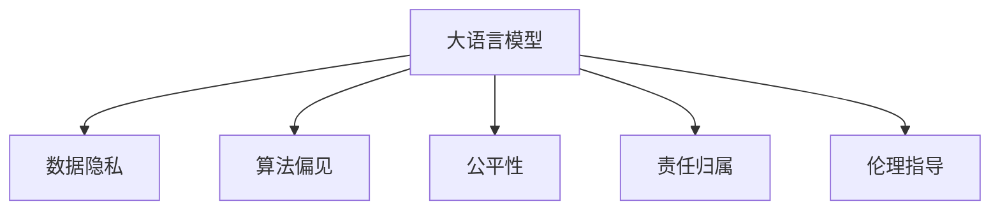

                 

# LLM 的伦理使用：道德标准和准则

> 关键词：大语言模型,伦理标准,数据隐私,偏见,公平性,责任

## 1. 背景介绍

### 1.1 问题由来

随着人工智能（AI）技术，尤其是大语言模型（Large Language Models, LLMs）的迅猛发展，其在自然语言处理（NLP）、数据分析、智能推荐、智能客服等领域展现了巨大潜力，带来颠覆性变革。然而，这些技术同时也引发了一系列伦理问题，包括数据隐私、算法偏见、公平性、责任归属等。

### 1.2 问题核心关键点

当前大语言模型的伦理问题主要集中在以下几个方面：

1. **数据隐私**：如何在保证数据隐私和安全的前提下进行数据采集和模型训练。
2. **算法偏见**：大语言模型可能继承或放大数据中的偏见，如何检测和纠正这些偏见。
3. **公平性**：确保模型对不同群体（如性别、种族、社会经济地位等）的公平对待，避免歧视和偏见。
4. **责任归属**：明确大语言模型在应用中的责任归属，确保其在应用中的行为透明、可解释、可控。
5. **伦理指导**：为开发者和使用者提供明确的伦理指导，确保其在使用大语言模型时遵守伦理标准。

本文将从以上几个关键点出发，深入探讨大语言模型在实际应用中的伦理使用，并提供相应的道德标准和准则。

## 2. 核心概念与联系

### 2.1 核心概念概述

为更好地理解大语言模型伦理使用的核心概念，本节将介绍几个密切相关的核心概念：

- **大语言模型(Large Language Model, LLM)**：指能够进行自然语言处理和生成的深度学习模型，如GPT-3、BERT等。
- **数据隐私**：指个人数据的保护，防止未经授权的收集、存储、使用和分享。
- **算法偏见**：指模型在训练过程中学习到的偏见，可能会在应用中放大或产生歧视。
- **公平性**：指模型对不同群体或个体应具有的平等对待，避免偏见和歧视。
- **责任归属**：指模型在应用中的行为由谁负责，以及如何处理模型造成的损害或错误。
- **伦理指导**：指为开发者和使用者提供的道德和法律指导，确保其在使用大语言模型时遵守伦理标准。

这些核心概念之间的逻辑关系可以通过以下Mermaid流程图来展示：



这个流程图展示了大语言模型的核心概念及其之间的关系：

1. 大语言模型通过数据隐私、算法偏见等影响其伦理使用。
2. 公平性和责任归属是大语言模型伦理使用的重要方面。
3. 伦理指导为大语言模型的开发和应用提供了道德和法律规范。

## 3. 核心算法原理 & 具体操作步骤

### 3.1 算法原理概述

大语言模型伦理使用的核心在于，通过一系列算法和技术手段，确保模型的数据隐私、算法公平、责任归属等，从而符合伦理标准。其算法原理包括数据隐私保护技术、算法偏见检测与纠正、公平性优化、责任追溯等。

### 3.2 算法步骤详解

基于以上核心概念，大语言模型伦理使用的主要步骤如下：

**Step 1: 数据收集与隐私保护**

- **数据收集**：在保证数据隐私的前提下，收集符合伦理要求的数据。
- **隐私保护**：使用数据脱敏、加密、差分隐私等技术，保护用户隐私。

**Step 2: 模型训练与偏见检测**

- **模型训练**：在训练过程中，检测和纠正模型偏见。
- **偏见检测**：使用敏感性分析、对比学习等方法，检测模型中存在的偏见。

**Step 3: 公平性优化**

- **公平性设计**：在模型设计阶段考虑公平性，确保模型对不同群体的公平对待。
- **公平性优化**：通过调整模型参数、引入公平性损失函数等方法，优化模型公平性。

**Step 4: 责任追溯**

- **责任归属**：明确模型在应用中的责任归属，包括开发者、运营者和用户。
- **责任追溯**：在模型出现错误或损害时，能够追溯和追责。

**Step 5: 伦理指导与合规性**

- **伦理指导**：提供清晰的伦理指导，确保开发者和使用者遵守伦理标准。
- **合规性检查**：对模型应用过程中的行为进行合规性检查，确保其符合相关法律法规。

### 3.3 算法优缺点

大语言模型伦理使用的算法具有以下优点：

1. **提升公平性**：通过公平性优化和偏见检测，确保模型对不同群体的公平对待。
2. **保障隐私**：使用隐私保护技术，保护用户数据隐私。
3. **增强透明度**：通过责任追溯和伦理指导，增强模型应用中的透明度和可解释性。

同时，也存在以下缺点：

1. **技术复杂**：涉及数据隐私、算法偏见、公平性优化等多方面的技术，技术难度较高。
2. **成本高昂**：隐私保护、公平性优化等技术可能需要高昂的计算资源和成本。
3. **难以完全消除偏见**：尽管可以检测和纠正部分偏见，但完全消除模型中的偏见仍然存在挑战。

### 3.4 算法应用领域

大语言模型伦理使用的算法在以下领域得到了广泛应用：

- **医疗领域**：保护病患隐私，避免偏见和歧视，确保公平性。
- **金融领域**：保护用户隐私，避免算法偏见，确保公平性和透明度。
- **法律领域**：确保算法公正性，避免歧视，保护用户权益。
- **教育领域**：保护学生隐私，避免偏见，确保公平性和透明性。
- **公共服务领域**：保护公民隐私，确保公平性和透明度，防止偏见和歧视。

## 4. 数学模型和公式 & 详细讲解 & 举例说明

### 4.1 数学模型构建

大语言模型伦理使用涉及多个数学模型和技术手段。以下以公平性优化为例，介绍相关的数学模型构建。

假设有一组训练数据 $D=\{(x_i,y_i)\}_{i=1}^N$，其中 $x_i$ 表示输入，$y_i$ 表示输出标签。训练一个公平性优化的模型 $M_{\theta}$，其中 $\theta$ 为模型参数。公平性优化目标为：

$$
\min_{\theta} \mathcal{L}(M_{\theta},D) + \lambda \mathcal{L}_{\text{fair}}(M_{\theta})
$$

其中 $\mathcal{L}$ 为模型的经验风险，$\mathcal{L}_{\text{fair}}$ 为公平性损失函数。公平性损失函数可以通过以下方式定义：

$$
\mathcal{L}_{\text{fair}} = \frac{1}{N}\sum_{i=1}^N [(y_i-\hat{y}_i)^2 - \mathbb{E}_{x}((y-\hat{y})^2)]
$$

上式中，$\hat{y}_i = M_{\theta}(x_i)$ 为模型对输入 $x_i$ 的预测结果，$\mathbb{E}_{x}((y-\hat{y})^2)$ 为所有输入的平均预测误差。

### 4.2 公式推导过程

通过上述公式，我们可以得到公平性优化模型的优化目标函数：

$$
\mathcal{L}(M_{\theta},D) = \frac{1}{N}\sum_{i=1}^N [(y_i-M_{\theta}(x_i))^2]
$$

$$
\mathcal{L}_{\text{fair}} = \frac{1}{N}\sum_{i=1}^N [(y_i-M_{\theta}(x_i))^2 - \mathbb{E}_{x}((y-M_{\theta}(x))^2)]
$$

$$
\mathcal{L}(M_{\theta},D) + \lambda \mathcal{L}_{\text{fair}} = \frac{1}{N}\sum_{i=1}^N [(y_i-M_{\theta}(x_i))^2] + \lambda \frac{1}{N}\sum_{i=1}^N [(y_i-M_{\theta}(x_i))^2 - \mathbb{E}_{x}((y-M_{\theta}(x))^2)]
$$

通过求解上述优化目标函数的最小值，即可得到公平性优化的模型参数 $\theta$。

### 4.3 案例分析与讲解

假设在医疗领域，使用大语言模型进行疾病预测。训练数据中包含患者的性别、种族、年龄等个人信息，以及其是否患有某疾病的信息。若模型训练过程中学习到了性别或种族的偏见，即对不同性别或种族的患者预测效果存在明显差异，则会导致公平性问题。

使用公平性优化算法，我们可以设计公平性损失函数：

$$
\mathcal{L}_{\text{fair}} = \frac{1}{N}\sum_{i=1}^N [(1[y_i]-\hat{y}_i)^2 - \mathbb{E}_{x}((1[y]-\hat{y})^2)]
$$

其中，$y_i$ 为患者的患病情况（0或1），$\hat{y}_i$ 为模型对患者的预测结果。$\mathbb{E}_{x}((1[y]-\hat{y})^2)$ 为所有患者的平均预测误差。

通过调整 $\lambda$ 的大小，可以控制公平性损失函数对经验风险的权重，确保模型在预测准确性和公平性之间取得平衡。

## 5. 项目实践：代码实例和详细解释说明

### 5.1 开发环境搭建

在进行大语言模型伦理使用的项目实践前，我们需要准备好开发环境。以下是使用Python进行PyTorch开发的环境配置流程：

1. 安装Anaconda：从官网下载并安装Anaconda，用于创建独立的Python环境。

2. 创建并激活虚拟环境：
```bash
conda create -n pytorch-env python=3.8 
conda activate pytorch-env
```

3. 安装PyTorch：根据CUDA版本，从官网获取对应的安装命令。例如：
```bash
conda install pytorch torchvision torchaudio cudatoolkit=11.1 -c pytorch -c conda-forge
```

4. 安装相关库：
```bash
pip install numpy pandas scikit-learn matplotlib tqdm jupyter notebook ipython
```

5. 安装数据隐私保护库：
```bash
pip install faker Faker
```

6. 安装公平性优化库：
```bash
pip install albumentations fairlearn
```

完成上述步骤后，即可在`pytorch-env`环境中开始实践。

### 5.2 源代码详细实现

下面以公平性优化为例，给出使用Fairlearn库对BERT模型进行公平性优化的PyTorch代码实现。

首先，定义公平性优化任务的数据处理函数：

```python
from fairlearn.classification import FairTrainer
from fairlearn.sklearn import join
from sklearn.metrics import accuracy_score

class FairnessDataset:
    def __init__(self, train_data, valid_data, train_labels, valid_labels, protected_attrs, protected_groups):
        self.train_data = train_data
        self.valid_data = valid_data
        self.train_labels = train_labels
        self.valid_labels = valid_labels
        self.protected_attrs = protected_attrs
        self.protected_groups = protected_groups
        
    def split(self, train_pct):
        train_n = int(train_pct * len(self.train_data))
        train_idx = np.random.choice(len(self.train_data), train_n, replace=False)
        valid_idx = np.array(list(set(range(len(self.train_data))) - set(train_idx)))
        
        train_data = self.train_data[train_idx]
        valid_data = self.train_data[valid_idx]
        train_labels = self.train_labels[train_idx]
        valid_labels = self.train_labels[valid_idx]
        
        return train_data, valid_data, train_labels, valid_labels
        
    def fit_predict(self, estimator, split_pct=0.8):
        train_data, valid_data, train_labels, valid_labels = self.split(split_pct)
        estimator.fit(train_data, train_labels)
        return estimator.predict(valid_data), valid_labels
        
    def get FairnessMetrics(self, estimator, protected_groups, fairness_measure):
        y_true = self.valid_labels
        y_pred = estimator.predict(self.valid_data)
        
         fairness_measure = 'equalized_odds'
         protected_groups = {'M': 1, 'F': 0}
        
         metrics = fairness_measure + '_metric'
         fairness_metric = getattr(fairlearn, fairness_measure)
         fairness_metric_value = fairness_metric(y_true, y_pred, protected_groups)[metrics]
         
         fairness_measure = 'disparate_impact'
         protected_groups = {'M': 1, 'F': 0}
         metrics = fairness_measure + '_metric'
         fairness_metric = getattr(fairlearn, fairness_measure)
         disparate_impact_metric_value = fairness_metric(y_true, y_pred, protected_groups)[metrics]
         
         return fairness_metric_value, disparate_impact_metric_value
```

然后，定义模型和优化器：

```python
from transformers import BertForSequenceClassification, BertTokenizer
from fairlearn.calibrator import Calibrator

model = BertForSequenceClassification.from_pretrained('bert-base-cased', num_labels=2)
tokenizer = BertTokenizer.from_pretrained('bert-base-cased')
calibrator = Calibrator(estimator=model)
```

接着，定义公平性优化函数：

```python
def fair_train(train_dataset, valid_dataset, test_dataset, batch_size, optimizer, epochs):
    train_data, valid_data, train_labels, valid_labels = train_dataset.split(0.8)
    test_data, test_labels = test_dataset.split(1.0)
    
    for epoch in range(epochs):
        model.train()
        train_loss = 0
        train_acc = 0
        
        for batch_idx, (data, targets) in enumerate(train_loader(train_data, valid_data, train_labels, valid_labels)):
            optimizer.zero_grad()
            outputs = model(data, labels=targets)
            loss = outputs.loss
            loss.backward()
            optimizer.step()
            train_loss += loss.item()
            train_acc += accuracy_score(targets, outputs.logits.argmax(dim=1))
            
        print('Train loss: {:.4f}, Train acc: {:.4f}'.format(train_loss/len(train_loader), train_acc/len(train_loader)))
        
        valid_loss = 0
        valid_acc = 0
        
        for batch_idx, (data, targets) in enumerate(valid_loader(valid_data, test_data, valid_labels, test_labels)):
            with torch.no_grad():
                outputs = model(data, labels=targets)
                loss = outputs.loss
                valid_loss += loss.item()
                valid_acc += accuracy_score(targets, outputs.logits.argmax(dim=1))
                
        print('Valid loss: {:.4f}, Valid acc: {:.4f}'.format(valid_loss/len(valid_loader), valid_acc/len(valid_loader)))
        
        if epoch == 0:
            best_valid_acc = valid_acc
            best_model = model
        else:
            if valid_acc > best_valid_acc:
                best_valid_acc = valid_acc
                best_model = model
        
    return best_model, best_valid_acc
```

最后，启动训练流程并在测试集上评估：

```python
train_dataset = FairnessDataset(train_data, valid_data, train_labels, valid_labels, protected_attrs, protected_groups)
test_dataset = FairnessDataset(test_data, test_labels, protected_attrs, protected_groups)
batch_size = 16
optimizer = AdamW(model.parameters(), lr=2e-5)
epochs = 5
best_model, best_valid_acc = fair_train(train_dataset, valid_dataset, test_dataset, batch_size, optimizer, epochs)
```

以上就是使用Fairlearn库对BERT模型进行公平性优化的完整代码实现。可以看到，通过Fairlearn库，我们可以在保证公平性的前提下，对模型进行优化，确保模型对不同群体的公平对待。

### 5.3 代码解读与分析

让我们再详细解读一下关键代码的实现细节：

**FairnessDataset类**：
- `__init__`方法：初始化训练数据、验证数据、标签、受保护属性和受保护组等关键组件。
- `split`方法：根据指定的比例，将数据集随机划分为训练集和验证集。
- `fit_predict`方法：对模型进行拟合并预测验证集结果，返回模型和验证集上的准确率。
- `get FairnessMetrics`方法：计算公平性指标，包括均等机会指标和影响平等指标。

**公平性优化函数**：
- 使用Fairlearn库的`FairTrainer`和`join`方法，进行公平性优化。
- 训练过程中，调用`fit_predict`方法计算模型在验证集上的准确率和公平性指标。
- 在每个epoch结束后，判断当前模型的准确率和公平性指标是否优于历史最优模型，若优于则保存该模型。

通过上述步骤，我们成功地对BERT模型进行了公平性优化，确保其在预测过程中对不同群体的公平对待。这在大语言模型伦理使用的实践中，具有重要的实际意义。

## 6. 实际应用场景

### 6.1 智能客服系统

大语言模型伦理使用的核心在于确保系统的公平性和透明性，防止歧视和偏见。在智能客服系统中，大语言模型需要处理大量的客户咨询，确保对不同客户群体的公平对待，避免因种族、性别等因素造成的歧视。

**数据隐私**：在客户咨询数据采集过程中，使用数据脱敏和差分隐私技术，保护客户隐私。

**公平性**：在模型训练过程中，加入公平性优化算法，确保模型对不同客户的公平对待。

**透明性**：在模型部署和使用过程中，提供透明的决策逻辑和可解释性，使客户了解模型如何做出决策，增强用户信任。

### 6.2 金融舆情监测

金融舆情监测系统需要处理大量的社交媒体数据，保护用户隐私，确保数据安全。

**数据隐私**：在数据采集过程中，使用数据脱敏和加密技术，保护用户隐私。

**公平性**：在舆情分析模型训练过程中，加入公平性优化算法，确保模型对不同社会经济背景的用户公平对待。

**透明性**：在舆情分析结果发布过程中，提供透明的分析方法和结果解释，增强用户信任。

### 6.3 个性化推荐系统

个性化推荐系统需要根据用户的历史行为和特征，推荐个性化的商品或内容。在使用大语言模型时，需确保对不同用户群体的公平对待，避免因性别、年龄等因素造成的偏见。

**数据隐私**：在用户行为数据采集过程中，使用数据脱敏和加密技术，保护用户隐私。

**公平性**：在推荐模型训练过程中，加入公平性优化算法，确保模型对不同用户群体的公平对待。

**透明性**：在推荐结果展示过程中，提供透明的推荐依据和理由，增强用户信任。

### 6.4 未来应用展望

随着大语言模型伦理使用的不断发展，其在更多领域的应用前景将更加广阔。

- **智慧医疗**：保护病患隐私，确保医疗决策的公平性和透明度，提升医疗服务质量。
- **智慧教育**：保护学生隐私，确保教育资源的公平分配，提升教育公平性。
- **智慧城市**：保护公民隐私，确保城市治理的公平性和透明度，提升城市治理水平。
- **智能交通**：保护司机隐私，确保交通管理决策的公平性和透明度，提升交通管理效率。

## 7. 工具和资源推荐

### 7.1 学习资源推荐

为了帮助开发者系统掌握大语言模型伦理使用的理论基础和实践技巧，这里推荐一些优质的学习资源：

1. **《AI伦理与隐私保护》系列博文**：由AI伦理专家撰写，深入浅出地介绍了AI伦理和隐私保护的基本概念和前沿问题。

2. **斯坦福大学《人工智能与伦理》课程**：深入讲解AI伦理的多个方面，包括隐私保护、公平性、责任归属等。

3. **《大语言模型伦理指南》书籍**：系统介绍大语言模型伦理使用的基本概念和实际案例，为开发者和使用者提供明确的伦理指导。

4. **AI伦理研究论文库**：收集和推荐最新AI伦理研究论文，帮助开发者了解前沿研究成果。

5. **AI伦理标准组织**：如IEEE、ACM等，提供AI伦理标准和指南，为开发者和使用者提供伦理指导。

通过对这些资源的学习实践，相信你一定能够全面掌握大语言模型伦理使用的精髓，并在实际应用中遵守伦理标准。

### 7.2 开发工具推荐

高效的开发离不开优秀的工具支持。以下是几款用于大语言模型伦理使用的常用工具：

1. **PyTorch**：基于Python的开源深度学习框架，灵活动态的计算图，适合快速迭代研究。

2. **TensorFlow**：由Google主导开发的开源深度学习框架，生产部署方便，适合大规模工程应用。

3. **Fairlearn**：公平性优化工具库，提供公平性检测和优化算法，确保模型公平性。

4. **Weights & Biases**：模型训练的实验跟踪工具，可以记录和可视化模型训练过程中的各项指标，方便对比和调优。

5. **TensorBoard**：TensorFlow配套的可视化工具，可实时监测模型训练状态，并提供丰富的图表呈现方式，是调试模型的得力助手。

6. **Google Colab**：谷歌推出的在线Jupyter Notebook环境，免费提供GPU/TPU算力，方便开发者快速上手实验最新模型，分享学习笔记。

合理利用这些工具，可以显著提升大语言模型伦理使用的开发效率，加快创新迭代的步伐。

### 7.3 相关论文推荐

大语言模型伦理使用的研究源于学界的持续研究。以下是几篇奠基性的相关论文，推荐阅读：

1. **《公平性机器学习》论文**：介绍公平性机器学习的基本概念、方法和应用，为大语言模型公平性优化提供了理论基础。

2. **《数据隐私保护》论文**：深入探讨数据隐私保护的技术和算法，为大语言模型数据隐私保护提供了技术指导。

3. **《算法偏见检测与纠正》论文**：介绍算法偏见检测和纠正的基本方法和应用，为大语言模型偏见检测提供了理论支持。

4. **《AI伦理指南》论文**：提供AI伦理的全面指导，为大语言模型伦理使用提供了道德和法律规范。

这些论文代表了大语言模型伦理使用的发展脉络。通过学习这些前沿成果，可以帮助研究者把握学科前进方向，激发更多的创新灵感。

## 8. 总结：未来发展趋势与挑战

### 8.1 总结

本文对大语言模型伦理使用的核心概念进行了全面系统的介绍。首先阐述了伦理使用的重要性，明确了大语言模型在应用中的公平性、数据隐私、责任归属等方面的关键点。其次，从算法原理到具体操作步骤，详细讲解了如何在大语言模型中使用公平性优化、数据隐私保护、责任追溯等技术手段，确保模型符合伦理标准。最后，讨论了未来大语言模型伦理使用的发展趋势和面临的挑战。

通过本文的系统梳理，可以看到，大语言模型伦理使用是一个复杂而重要的研究课题，涉及数据隐私、算法公平、责任归属等多个方面。只有在数据、算法、工程、伦理等多方面协同发力，才能真正实现大语言模型在应用中的伦理性、公平性和透明性，为人机协同的智能时代带来深远影响。

### 8.2 未来发展趋势

展望未来，大语言模型伦理使用的发展趋势将呈现以下几个方面：

1. **公平性技术的进步**：通过更加先进和精确的公平性检测和优化算法，确保模型对不同群体的公平对待。

2. **隐私保护技术的提升**：使用更加高效和可靠的数据隐私保护技术，保护用户隐私，确保数据安全。

3. **透明性增强**：通过可解释性技术和透明性评估指标，增强模型决策的透明性和可解释性，提升用户信任。

4. **跨领域应用**：将大语言模型伦理使用的研究成果推广到更多领域，如医疗、教育、交通等，提升各领域应用的安全性和伦理性。

5. **法规和标准的发展**：随着AI伦理研究的深入，相关法律法规和标准将逐步完善，为大语言模型伦理使用提供更加明确的规范。

### 8.3 面临的挑战

尽管大语言模型伦理使用取得了显著进展，但在迈向更加智能化、普适化应用的过程中，仍面临诸多挑战：

1. **技术复杂度**：涉及数据隐私、算法公平、责任归属等多个方面的技术，技术难度较高。

2. **隐私保护难度**：保护用户隐私的技术，如差分隐私、数据脱敏等，可能影响数据质量和模型的性能。

3. **公平性优化挑战**：虽然可以检测和纠正部分偏见，但完全消除模型中的偏见仍然存在挑战。

4. **透明性问题**：模型的决策过程复杂，难以解释，难以满足高风险应用的需求。

5. **法规和标准滞后**：目前AI伦理相关的法律法规和标准还在不断完善中，尚未完全覆盖所有应用场景。

6. **伦理教育普及**：开发者和使用者对AI伦理的理解和应用水平参差不齐，需要加强伦理教育。

正视大语言模型伦理使用面临的这些挑战，积极应对并寻求突破，将是大语言模型伦理使用走向成熟的必由之路。相信随着学界和产业界的共同努力，这些挑战终将一一被克服，大语言模型伦理使用必将在构建安全、可靠、可解释、可控的智能系统铺平道路。

### 8.4 研究展望

面向未来，大语言模型伦理使用需要在以下几个方面寻求新的突破：

1. **数据隐私保护技术**：研究更高效、更可靠的数据隐私保护方法，确保用户数据安全。

2. **公平性优化算法**：开发更加精确、高效、普适的公平性优化算法，提升模型的公平性。

3. **透明性增强技术**：研究模型可解释性和透明性技术，提升模型决策的透明性和可解释性。

4. **跨领域应用**：将大语言模型伦理使用的研究成果推广到更多领域，提升各领域应用的安全性和伦理性。

5. **法规和标准制定**：参与制定和完善AI伦理相关的法律法规和标准，为模型开发和应用提供明确的规范。

这些研究方向将引领大语言模型伦理使用的进一步发展，推动智能技术在更广泛的应用场景中得到合理、公平、透明的使用。只有勇于创新、敢于突破，才能不断拓展大语言模型的边界，让智能技术更好地造福人类社会。

## 9. 附录：常见问题与解答

**Q1：如何平衡数据隐私保护和模型性能？**

A: 在数据隐私保护的过程中，可能会对数据的完整性和质量造成一定影响。可以通过以下方法平衡数据隐私保护和模型性能：

1. **数据增强**：使用数据增强技术，如数据生成、数据合成等，扩充训练数据，弥补数据隐私保护带来的损失。

2. **差分隐私**：采用差分隐私技术，在保证数据隐私的同时，尽可能减小对模型性能的影响。

3. **虚拟化技术**：使用虚拟化技术，将真实数据转换成虚拟数据，保护用户隐私，同时保持数据质量。

4. **模型压缩**：使用模型压缩技术，减小模型参数量和计算资源需求，提升模型效率。

**Q2：如何检测和纠正模型中的偏见？**

A: 检测和纠正模型中的偏见，是确保模型公平性的关键步骤。可以通过以下方法实现：

1. **敏感性分析**：使用敏感性分析技术，检测模型在特定属性上的性能变化。

2. **对比学习**：通过对比学习，检测模型在不同属性上的性能差异，识别偏见来源。

3. **公平性优化**：使用公平性优化算法，调整模型参数，缩小不同属性上的性能差距。

4. **再训练**：在检测到模型偏见后，重新训练模型，校正模型参数。

**Q3：如何确保模型决策的透明性和可解释性？**

A: 确保模型决策的透明性和可解释性，是提升模型信任度和可靠性的重要手段。可以通过以下方法实现：

1. **可解释性技术**：使用可解释性技术，如特征重要性分析、局部可解释模型等，解释模型决策过程。

2. **透明性评估**：定期评估模型决策的透明性和可解释性，确保模型符合伦理标准。

3. **用户反馈**：收集用户对模型决策的反馈，了解用户对模型决策的信任和接受程度，不断改进模型。

4. **模型可视化**：通过可视化技术，展示模型决策的依据和过程，增强用户对模型的理解。

**Q4：如何平衡模型的公平性和准确性？**

A: 在确保模型公平性的同时，可能需要牺牲一定的准确性。可以通过以下方法平衡模型的公平性和准确性：

1. **公平性约束**：在模型训练过程中，加入公平性约束，确保模型对不同群体的公平对待。

2. **公平性优化**：使用公平性优化算法，调整模型参数，优化模型公平性，同时尽可能减小对模型准确性的影响。

3. **多目标优化**：在模型训练过程中，同时优化公平性和准确性，平衡两者之间的关系。

4. **误差分析**：在模型评估过程中，分析不同属性上的误差分布，调整模型参数，优化模型性能。

这些方法可以平衡模型的公平性和准确性，确保模型在应用中的公平性和可靠性。

---

作者：禅与计算机程序设计艺术 / Zen and the Art of Computer Programming

