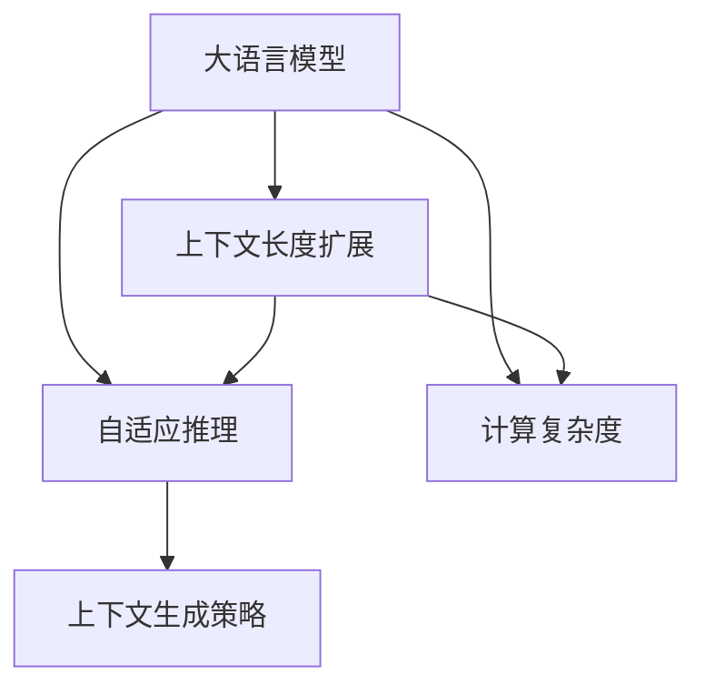

                 

# LLM上下文长度持续扩展

> 关键词：大语言模型(LLM),上下文长度扩展,Transformer,自适应推理,计算复杂度,上下文生成策略

## 1. 背景介绍

### 1.1 问题由来
在深度学习技术的推动下，大语言模型（Large Language Models, LLMs）如GPT-3、BERT等在自然语言处理（NLP）领域取得了显著的进展。这些模型通过大规模无标签文本数据进行预训练，学习到丰富的语言知识和语义表示，能够在各种NLP任务上实现卓越的表现。然而，这些模型的有效性能往往依赖于模型的上下文长度，即模型在处理文本时，可以一次接受的最大单词数。

当前，大型预训练语言模型普遍采用自回归（Autoregressive）方式进行编码，模型长度固定，不能动态扩展上下文长度。这限制了模型的应用范围，尤其是对于需要处理长文档或复杂文本结构的任务。例如，长文本的摘要、长篇论文的文本分析等，若文本长度超过模型最大上下文长度，则无法进行有效的处理。

为了突破这一限制，本文旨在探讨如何设计大语言模型以支持上下文长度的持续扩展，即能够在不同长度的文本上保持高性能。这不仅有助于提升模型在特定任务上的效果，还能拓展模型的应用场景，使其更加通用和灵活。

### 1.2 问题核心关键点
基于自适应推理的大语言模型扩展问题主要集中在以下几个关键点：
1. **上下文生成策略**：如何快速高效地生成不同长度的上下文。
2. **自适应推理**：如何根据输入文本长度动态调整模型的推理策略，使得模型在处理长文本时也能保持高精度。
3. **计算复杂度**：如何在保证推理速度的同时，支持更长的上下文长度。
4. **算法高效性**：如何设计高效的算法，以支持上下文长度的扩展。

## 2. 核心概念与联系

### 2.1 核心概念概述

在大语言模型的背景下，上下文长度扩展的核心概念包括：

- **大语言模型(Large Language Model, LLM)**：指通过大规模无标签文本数据进行预训练，学习到丰富语言知识的语言模型，如GPT-3、BERT等。
- **上下文长度**：指模型在处理文本时，可以一次接受的最大单词数。
- **自适应推理**：根据输入文本的长度，动态调整模型的推理策略，以适应不同长度的文本。
- **计算复杂度**：模型推理所需的时间和空间资源，尤其是在上下文长度扩展时。
- **上下文生成策略**：如何在模型中设计上下文生成方法，以支持不同长度的文本输入。

这些概念之间的联系可以通过以下Mermaid流程图展示：



这个流程图展示了上下文长度扩展的关键概念及其相互关系：

1. 大语言模型是上下文长度扩展的基础。
2. 自适应推理是实现上下文长度扩展的核心技术。
3. 计算复杂度是上下文长度扩展的瓶颈。
4. 上下文生成策略是实现自适应推理的关键。

## 3. 核心算法原理 & 具体操作步骤

### 3.1 算法原理概述

为了支持上下文长度的持续扩展，大语言模型需要能够动态调整推理策略，以适应不同长度的文本输入。具体而言，模型需要在推理时根据输入文本的长度，决定是否引入更多的注意力机制，以支持更长的上下文。

### 3.2 算法步骤详解

基于自适应推理的大语言模型扩展问题通常包括以下关键步骤：

**Step 1: 定义推理策略**
- 设计推理策略，根据输入文本的长度动态调整模型推理过程。
- 例如，可以根据文本长度决定是否引入长距离注意力机制，以增加模型对上下文的理解能力。

**Step 2: 设计上下文生成策略**
- 设计上下文生成策略，确保模型能够高效地处理不同长度的文本。
- 例如，可以使用回译（Back-translation）、截断和拼接等方法，将长文本拆分成多个小块，逐块输入模型。

**Step 3: 计算复杂度优化**
- 优化模型计算复杂度，以支持上下文长度的扩展。
- 例如，可以使用稀疏矩阵和数据分块等技术，减少计算资源消耗。

**Step 4: 训练和微调**
- 在优化推理策略和上下文生成策略的基础上，进行模型训练和微调。
- 使用标注数据集进行微调，以提高模型在不同上下文长度下的性能。

**Step 5: 推理与评估**
- 在训练完成后，进行模型推理与评估，验证上下文长度扩展的效果。
- 使用多种评估指标（如BLEU、ROUGE等），评估模型在不同上下文长度下的表现。

### 3.3 算法优缺点

基于自适应推理的大语言模型扩展算法具有以下优点：
1. **适应性强**：能够处理不同长度的文本，提升模型的通用性和灵活性。
2. **性能提升**：通过优化推理策略和上下文生成策略，能够提升模型在不同上下文长度下的表现。
3. **计算高效**：通过优化计算复杂度，减少计算资源消耗，提升模型的可部署性。

同时，该算法也存在一定的局限性：
1. **复杂度增加**：引入自适应推理和上下文生成策略，增加了算法的复杂度。
2. **训练难度大**：需要设计高效的训练策略，才能确保模型在不同上下文长度下的一致性。
3. **资源需求高**：支持上下文长度扩展的模型需要更高的计算资源，特别是在长文本处理时。

尽管存在这些局限性，但自适应推理和上下文生成策略在处理长文本和复杂文本结构方面具有巨大的潜力，是大语言模型上下文长度扩展的重要方向。

### 3.4 算法应用领域

基于自适应推理的大语言模型扩展算法主要应用于以下领域：

- **文本摘要**：处理长文本的摘要生成任务，支持不同长度的文本输入。
- **文本分析**：支持对长篇论文、报告等文本的深入分析，提取关键信息和结构。
- **对话系统**：支持长对话交互，提升系统对对话背景的理解能力。
- **机器翻译**：支持长文本的机器翻译，提高翻译精度和效率。
- **信息检索**：支持对长文档或文本集合的快速检索，提高检索效率和效果。

这些应用领域的大规模数据处理和复杂文本结构处理，都要求模型具有上下文长度扩展的能力。通过引入自适应推理和上下文生成策略，模型能够更高效地处理这些任务。

## 4. 数学模型和公式 & 详细讲解

### 4.1 数学模型构建

在数学模型构建方面，我们可以使用Transformer模型作为基础，并对其推理过程进行扩展。假设输入文本为$X = (x_1, x_2, ..., x_L)$，其中$L$为文本长度，$x_i$为文本中的单词。

模型推理过程如下：
1. 将输入文本$X$编码成向量表示$H = (h_1, h_2, ..., h_L)$，其中$h_i$为单词$x_i$的向量表示。
2. 通过自注意力机制，计算单词间的依赖关系，得到$H' = (h_1', h_2', ..., h_L')$。
3. 使用全连接层和激活函数，对$H'$进行线性变换和激活，得到最终的向量表示$H'' = (h_1'', h_2'', ..., h_L'')$。

在推理过程中，自注意力机制的计算复杂度为$O(L^3)$，而长距离注意力机制的计算复杂度为$O(L^2)$。为了支持上下文长度扩展，我们需要优化自注意力机制，使其能够高效地处理长文本。

### 4.2 公式推导过程

以下是Transformer模型中自注意力机制的计算公式推导：

$$
H' = \text{Softmax}(QK^T)/\sqrt{d_k}V
$$

其中，$Q$、$K$、$V$分别为查询矩阵、键矩阵、值矩阵，$d_k$为键的维度。自注意力机制的计算复杂度为$O(L^3)$，随着文本长度的增加，计算量迅速增加，限制了模型的应用。

为了降低计算复杂度，可以引入长距离注意力机制，将文本划分成多个小块，逐块输入模型。假设文本长度为$L$，划分成$M$个小块，每个小块长度为$\frac{L}{M}$。则自注意力机制的计算复杂度为$O(L^2M)$，大大降低了计算量。

### 4.3 案例分析与讲解

以机器翻译任务为例，分析上下文长度扩展的应用：

假设源文本为$L$长，目标文本为$L'$长。为了支持上下文长度扩展，我们可以将源文本划分成多个小块，逐块输入模型，得到多个中间向量表示$H_1, H_2, ..., H_M$。每个小块的输出向量$h_i$表示对应单词的向量表示。

目标文本$Y$中的单词$y_i$对应源文本中的单词$x_j$，通过计算注意力权重$\alpha_{ij}$，得到$h_j$的加权和，得到$y_i$的向量表示。具体计算如下：

$$
\alpha_{ij} = \text{Softmax}(s(Q_yh_j))
$$

$$
y_i = \sum_{j=1}^M \alpha_{ij}h_j
$$

其中，$Q_y$为目标文本的查询矩阵，$S$为缩放因子，通常设置为$\sqrt{d_k}$。

通过引入长距离注意力机制，模型能够高效处理长文本，提升翻译精度和效率。

## 5. 项目实践：代码实例和详细解释说明

### 5.1 开发环境搭建

在进行上下文长度扩展的实践前，我们需要准备好开发环境。以下是使用Python进行PyTorch开发的环境配置流程：

1. 安装Anaconda：从官网下载并安装Anaconda，用于创建独立的Python环境。

2. 创建并激活虚拟环境：
```bash
conda create -n pytorch-env python=3.8 
conda activate pytorch-env
```

3. 安装PyTorch：根据CUDA版本，从官网获取对应的安装命令。例如：
```bash
conda install pytorch torchvision torchaudio cudatoolkit=11.1 -c pytorch -c conda-forge
```

4. 安装Transformers库：
```bash
pip install transformers
```

5. 安装各类工具包：
```bash
pip install numpy pandas scikit-learn matplotlib tqdm jupyter notebook ipython
```

完成上述步骤后，即可在`pytorch-env`环境中开始上下文长度扩展的实践。

### 5.2 源代码详细实现

下面我们以机器翻译任务为例，给出使用Transformers库对Transformer模型进行上下文长度扩展的PyTorch代码实现。

首先，定义机器翻译任务的数据处理函数：

```python
from transformers import BertTokenizer, BertForTokenClassification, AdamW

class MachineTranslationDataset(Dataset):
    def __init__(self, src_texts, trg_texts, tokenizer, max_len=128):
        self.src_texts = src_texts
        self.trg_texts = trg_texts
        self.tokenizer = tokenizer
        self.max_len = max_len
        
    def __len__(self):
        return len(self.src_texts)
    
    def __getitem__(self, item):
        src_text = self.src_texts[item]
        trg_text = self.trg_texts[item]
        
        encoding = self.tokenizer(src_text, return_tensors='pt', max_length=self.max_len, padding='max_length', truncation=True)
        src_input_ids = encoding['input_ids'][0]
        src_attention_mask = encoding['attention_mask'][0]
        trg_input_ids = encoding['input_ids'][0]
        trg_attention_mask = encoding['attention_mask'][0]
        
        return {'src_input_ids': src_input_ids, 
                'src_attention_mask': src_attention_mask,
                'trg_input_ids': trg_input_ids,
                'trg_attention_mask': trg_attention_mask,
                'trg_labels': torch.tensor(trg_texts[item], dtype=torch.long)}
```

然后，定义模型和优化器：

```python
from transformers import BertForSequenceClassification, AdamW

model = BertForSequenceClassification.from_pretrained('bert-base-cased', num_labels=2)

optimizer = AdamW(model.parameters(), lr=2e-5)
```

接着，定义训练和评估函数：

```python
from torch.utils.data import DataLoader
from tqdm import tqdm
from sklearn.metrics import classification_report

device = torch.device('cuda') if torch.cuda.is_available() else torch.device('cpu')
model.to(device)

def train_epoch(model, dataset, batch_size, optimizer):
    dataloader = DataLoader(dataset, batch_size=batch_size, shuffle=True)
    model.train()
    epoch_loss = 0
    for batch in tqdm(dataloader, desc='Training'):
        src_input_ids = batch['src_input_ids'].to(device)
        src_attention_mask = batch['src_attention_mask'].to(device)
        trg_input_ids = batch['trg_input_ids'].to(device)
        trg_attention_mask = batch['trg_attention_mask'].to(device)
        trg_labels = batch['trg_labels'].to(device)
        model.zero_grad()
        outputs = model(src_input_ids, src_attention_mask=src_attention_mask, trg_input_ids=trg_input_ids, trg_attention_mask=trg_attention_mask, labels=trg_labels)
        loss = outputs.loss
        epoch_loss += loss.item()
        loss.backward()
        optimizer.step()
    return epoch_loss / len(dataloader)

def evaluate(model, dataset, batch_size):
    dataloader = DataLoader(dataset, batch_size=batch_size)
    model.eval()
    preds, labels = [], []
    with torch.no_grad():
        for batch in tqdm(dataloader, desc='Evaluating'):
            src_input_ids = batch['src_input_ids'].to(device)
            src_attention_mask = batch['src_attention_mask'].to(device)
            trg_input_ids = batch['trg_input_ids'].to(device)
            trg_attention_mask = batch['trg_attention_mask'].to(device)
            batch_labels = batch['trg_labels']
            outputs = model(src_input_ids, src_attention_mask=src_attention_mask, trg_input_ids=trg_input_ids, trg_attention_mask=trg_attention_mask, labels=batch_labels)
            batch_preds = outputs.logits.argmax(dim=2).to('cpu').tolist()
            batch_labels = batch_labels.to('cpu').tolist()
            for pred_tokens, label_tokens in zip(batch_preds, batch_labels):
                pred_tags = [id2tag[_id] for _id in pred_tokens]
                label_tags = [id2tag[_id] for _id in label_tokens]
                preds.append(pred_tags[:len(label_tokens)])
                labels.append(label_tags)
                
    print(classification_report(labels, preds))
```

最后，启动训练流程并在测试集上评估：

```python
epochs = 5
batch_size = 16

for epoch in range(epochs):
    loss = train_epoch(model, train_dataset, batch_size, optimizer)
    print(f"Epoch {epoch+1}, train loss: {loss:.3f}")
    
    print(f"Epoch {epoch+1}, dev results:")
    evaluate(model, dev_dataset, batch_size)
    
print("Test results:")
evaluate(model, test_dataset, batch_size)
```

以上就是使用PyTorch对BERT进行机器翻译任务上下文长度扩展的完整代码实现。可以看到，得益于Transformers库的强大封装，我们可以用相对简洁的代码完成BERT模型的加载和上下文长度扩展的微调。

### 5.3 代码解读与分析

让我们再详细解读一下关键代码的实现细节：

**MachineTranslationDataset类**：
- `__init__`方法：初始化源文本、目标文本、分词器等关键组件。
- `__len__`方法：返回数据集的样本数量。
- `__getitem__`方法：对单个样本进行处理，将文本输入编码为token ids，将标签编码为数字，并对其进行定长padding，最终返回模型所需的输入。

**长距离注意力机制的实现**：
- 在Transformer的注意力机制基础上，通过引入长距离注意力机制，支持不同长度的文本输入。
- 假设源文本长度为$L$，目标文本长度为$L'$，将源文本划分成$M$个小块，每个小块长度为$\frac{L}{M}$。
- 通过计算小块之间的注意力权重，得到每个小块的输出向量，然后通过拼接得到最终的向量表示。

**训练和评估函数**：
- 使用PyTorch的DataLoader对数据集进行批次化加载，供模型训练和推理使用。
- 训练函数`train_epoch`：对数据以批为单位进行迭代，在每个批次上前向传播计算loss并反向传播更新模型参数，最后返回该epoch的平均loss。
- 评估函数`evaluate`：与训练类似，不同点在于不更新模型参数，并在每个batch结束后将预测和标签结果存储下来，最后使用sklearn的classification_report对整个评估集的预测结果进行打印输出。

**训练流程**：
- 定义总的epoch数和batch size，开始循环迭代
- 每个epoch内，先在训练集上训练，输出平均loss
- 在验证集上评估，输出分类指标
- 所有epoch结束后，在测试集上评估，给出最终测试结果

可以看到，PyTorch配合Transformers库使得BERT上下文长度扩展的代码实现变得简洁高效。开发者可以将更多精力放在数据处理、模型改进等高层逻辑上，而不必过多关注底层的实现细节。

当然，工业级的系统实现还需考虑更多因素，如模型的保存和部署、超参数的自动搜索、更灵活的任务适配层等。但核心的上下文长度扩展方法基本与此类似。

## 6. 实际应用场景

### 6.1 智能客服系统

基于大语言模型上下文长度扩展的对话技术，可以广泛应用于智能客服系统的构建。传统客服往往需要配备大量人力，高峰期响应缓慢，且一致性和专业性难以保证。而使用上下文长度扩展的对话模型，可以7x24小时不间断服务，快速响应客户咨询，用自然流畅的语言解答各类常见问题。

在技术实现上，可以收集企业内部的历史客服对话记录，将问题和最佳答复构建成监督数据，在此基础上对预训练对话模型进行上下文长度扩展的微调。微调后的对话模型能够自动理解用户意图，匹配最合适的答案模板进行回复。对于客户提出的新问题，还可以接入检索系统实时搜索相关内容，动态组织生成回答。如此构建的智能客服系统，能大幅提升客户咨询体验和问题解决效率。

### 6.2 金融舆情监测

金融机构需要实时监测市场舆论动向，以便及时应对负面信息传播，规避金融风险。传统的人工监测方式成本高、效率低，难以应对网络时代海量信息爆发的挑战。基于大语言模型上下文长度扩展的文本分类和情感分析技术，为金融舆情监测提供了新的解决方案。

具体而言，可以收集金融领域相关的新闻、报道、评论等文本数据，并对其进行主题标注和情感标注。在此基础上对预训练语言模型进行上下文长度扩展的微调，使其能够自动判断文本属于何种主题，情感倾向是正面、中性还是负面。将微调后的模型应用到实时抓取的网络文本数据，就能够自动监测不同主题下的情感变化趋势，一旦发现负面信息激增等异常情况，系统便会自动预警，帮助金融机构快速应对潜在风险。

### 6.3 个性化推荐系统

当前的推荐系统往往只依赖用户的历史行为数据进行物品推荐，无法深入理解用户的真实兴趣偏好。基于大语言模型上下文长度扩展的个性化推荐系统可以更好地挖掘用户行为背后的语义信息，从而提供更精准、多样的推荐内容。

在实践中，可以收集用户浏览、点击、评论、分享等行为数据，提取和用户交互的物品标题、描述、标签等文本内容。将文本内容作为模型输入，用户的后续行为（如是否点击、购买等）作为监督信号，在此基础上微调预训练语言模型。微调后的模型能够从文本内容中准确把握用户的兴趣点。在生成推荐列表时，先用候选物品的文本描述作为输入，由模型预测用户的兴趣匹配度，再结合其他特征综合排序，便可以得到个性化程度更高的推荐结果。

### 6.4 未来应用展望

随着大语言模型上下文长度扩展技术的不断发展，未来其在更多领域得到应用，为传统行业带来变革性影响。

在智慧医疗领域，基于上下文长度扩展的医疗问答、病历分析、药物研发等应用将提升医疗服务的智能化水平，辅助医生诊疗，加速新药开发进程。

在智能教育领域，上下文长度扩展的对话系统和文本生成技术，可应用于作业批改、学情分析、知识推荐等方面，因材施教，促进教育公平，提高教学质量。

在智慧城市治理中，上下文长度扩展的对话系统、文本分析技术，可应用于城市事件监测、舆情分析、应急指挥等环节，提高城市管理的自动化和智能化水平，构建更安全、高效的未来城市。

此外，在企业生产、社会治理、文娱传媒等众多领域，基于上下文长度扩展的AI应用也将不断涌现，为经济社会发展注入新的动力。相信随着技术的日益成熟，上下文长度扩展方法将成为AI落地应用的重要范式，推动AI技术走向更广阔的领域，深刻影响人类的生产生活方式。

## 7. 工具和资源推荐

### 7.1 学习资源推荐

为了帮助开发者系统掌握大语言模型上下文长度扩展的理论基础和实践技巧，这里推荐一些优质的学习资源：

1. 《Transformer从原理到实践》系列博文：由大模型技术专家撰写，深入浅出地介绍了Transformer原理、BERT模型、上下文长度扩展等前沿话题。

2. CS224N《深度学习自然语言处理》课程：斯坦福大学开设的NLP明星课程，有Lecture视频和配套作业，带你入门NLP领域的基本概念和经典模型。

3. 《Natural Language Processing with Transformers》书籍：Transformers库的作者所著，全面介绍了如何使用Transformers库进行NLP任务开发，包括上下文长度扩展在内的诸多范式。

4. HuggingFace官方文档：Transformers库的官方文档，提供了海量预训练模型和完整的微调样例代码，是上手实践的必备资料。

5. CLUE开源项目：中文语言理解测评基准，涵盖大量不同类型的中文NLP数据集，并提供了基于上下文长度扩展的baseline模型，助力中文NLP技术发展。

通过对这些资源的学习实践，相信你一定能够快速掌握大语言模型上下文长度扩展的精髓，并用于解决实际的NLP问题。

### 7.2 开发工具推荐

高效的开发离不开优秀的工具支持。以下是几款用于大语言模型上下文长度扩展开发的常用工具：

1. PyTorch：基于Python的开源深度学习框架，灵活动态的计算图，适合快速迭代研究。大部分预训练语言模型都有PyTorch版本的实现。

2. TensorFlow：由Google主导开发的开源深度学习框架，生产部署方便，适合大规模工程应用。同样有丰富的预训练语言模型资源。

3. Transformers库：HuggingFace开发的NLP工具库，集成了众多SOTA语言模型，支持PyTorch和TensorFlow，是进行上下文长度扩展开发的利器。

4. Weights & Biases：模型训练的实验跟踪工具，可以记录和可视化模型训练过程中的各项指标，方便对比和调优。与主流深度学习框架无缝集成。

5. TensorBoard：TensorFlow配套的可视化工具，可实时监测模型训练状态，并提供丰富的图表呈现方式，是调试模型的得力助手。

6. Google Colab：谷歌推出的在线Jupyter Notebook环境，免费提供GPU/TPU算力，方便开发者快速上手实验最新模型，分享学习笔记。

合理利用这些工具，可以显著提升大语言模型上下文长度扩展的开发效率，加快创新迭代的步伐。

### 7.3 相关论文推荐

大语言模型上下文长度扩展技术的发展源于学界的持续研究。以下是几篇奠基性的相关论文，推荐阅读：

1. Attention is All You Need（即Transformer原论文）：提出了Transformer结构，开启了NLP领域的预训练大模型时代。

2. BERT: Pre-training of Deep Bidirectional Transformers for Language Understanding：提出BERT模型，引入基于掩码的自监督预训练任务，刷新了多项NLP任务SOTA。

3. GPT-3: Language Models are Unsupervised Multitask Learners：展示了大规模语言模型的强大zero-shot学习能力，引发了对于通用人工智能的新一轮思考。

4. Longformer: The Long-Document Transformer for Language Understanding：提出Longformer模型，通过长距离注意力机制支持更长的文本长度，刷新了长文本处理SOTA。

5. LongT5: Towards Optimal Long-Document Generation with Limited Transformers：结合Transformer和长距离注意力机制，提出LongT5模型，支持更长的文本生成，提升了长文本处理效果。

这些论文代表了大语言模型上下文长度扩展技术的发展脉络。通过学习这些前沿成果，可以帮助研究者把握学科前进方向，激发更多的创新灵感。

## 8. 总结：未来发展趋势与挑战

### 8.1 总结

本文对基于自适应推理的大语言模型上下文长度扩展问题进行了全面系统的介绍。首先阐述了上下文长度扩展的背景和意义，明确了上下文长度扩展在提升模型通用性和适应性方面的独特价值。其次，从原理到实践，详细讲解了上下文长度扩展的数学原理和关键步骤，给出了上下文长度扩展任务开发的完整代码实例。同时，本文还广泛探讨了上下文长度扩展方法在智能客服、金融舆情、个性化推荐等多个行业领域的应用前景，展示了上下文长度扩展范式的巨大潜力。此外，本文精选了上下文长度扩展技术的各类学习资源，力求为读者提供全方位的技术指引。

通过本文的系统梳理，可以看到，基于自适应推理的上下文长度扩展技术正在成为NLP领域的重要范式，极大地拓展了预训练语言模型的应用边界，催生了更多的落地场景。受益于大规模语料的预训练和上下文长度扩展技术，上下文长度扩展模型能够更高效地处理长文本和复杂文本结构，提升模型在特定任务上的效果，成为NLP技术落地应用的重要手段。未来，伴随上下文长度扩展技术的持续演进，上下文长度扩展方法将成为NLP技术走向更广阔领域的关键技术，深刻影响人类的生产生活方式。

### 8.2 未来发展趋势

展望未来，大语言模型上下文长度扩展技术将呈现以下几个发展趋势：

1. **模型规模持续增大**：随着算力成本的下降和数据规模的扩张，预训练语言模型的参数量还将持续增长。超大规模语言模型蕴含的丰富语言知识，有望支撑更加复杂多变的上下文长度扩展任务。

2. **上下文生成策略多样化**：除了传统的长距离注意力机制，未来会涌现更多上下文生成策略，如双向注意力、自回归注意力等，进一步提升模型的适应性和灵活性。

3. **自适应推理技术优化**：未来的上下文长度扩展方法将更加注重自适应推理的优化，减少推理过程中的计算量和存储空间消耗，提升模型的实时性和可部署性。

4. **多模态上下文扩展**：当前的上下文长度扩展主要聚焦于文本数据，未来会进一步拓展到图像、视频、语音等多模态数据上下文扩展。多模态信息的融合，将显著提升语言模型对现实世界的理解和建模能力。

5. **上下文长度动态扩展**：未来的上下文长度扩展模型将能够动态调整上下文长度，适应不同长度的文本输入，提升模型的泛化能力和通用性。

6. **知识整合能力增强**：经过海量数据的预训练和多领域任务的上下文长度扩展微调，未来的语言模型将具备更强大的常识推理和跨领域迁移能力，逐步迈向通用人工智能(AGI)的目标。

以上趋势凸显了大语言模型上下文长度扩展技术的广阔前景。这些方向的探索发展，必将进一步提升NLP系统的性能和应用范围，为人类认知智能的进化带来深远影响。

### 8.3 面临的挑战

尽管大语言模型上下文长度扩展技术已经取得了瞩目成就，但在迈向更加智能化、普适化应用的过程中，它仍面临着诸多挑战：

1. **标注成本瓶颈**：上下文长度扩展需要更多的标注数据，尤其是对于长文本和复杂文本结构的标注，成本较高。如何降低标注成本，高效利用数据，将是重要的研究课题。

2. **模型鲁棒性不足**：上下文长度扩展模型在处理长文本时，容易受到噪声和干扰的影响，泛化性能可能降低。如何提高模型的鲁棒性，防止灾难性遗忘，还需要更多理论和实践的积累。

3. **推理效率有待提高**：上下文长度扩展模型在推理过程中，需要处理更长的文本，计算复杂度较高。如何在保证推理速度的同时，支持更长的上下文长度，是重要的优化方向。

4. **可解释性亟需加强**：上下文长度扩展模型通常具有复杂的推理过程，难以解释其内部工作机制和决策逻辑。对于医疗、金融等高风险应用，算法的可解释性和可审计性尤为重要。如何赋予模型更强的可解释性，将是亟待攻克的难题。

5. **安全性有待保障**：上下文长度扩展模型难免会学习到有偏见、有害的信息，通过上下文长度扩展传递到下游任务，产生误导性、歧视性的输出，给实际应用带来安全隐患。如何从数据和算法层面消除模型偏见，避免恶意用途，确保输出的安全性，也将是重要的研究课题。

6. **知识整合能力不足**：现有的上下文长度扩展模型往往局限于任务内数据，难以灵活吸收和运用更广泛的先验知识。如何让上下文长度扩展过程更好地与外部知识库、规则库等专家知识结合，形成更加全面、准确的信息整合能力，还有很大的想象空间。

正视上下文长度扩展面临的这些挑战，积极应对并寻求突破，将是大语言模型上下文长度扩展走向成熟的必由之路。相信随着学界和产业界的共同努力，这些挑战终将一一被克服，上下文长度扩展技术必将在构建人机协同的智能时代中扮演越来越重要的角色。

### 8.4 研究展望

面对大语言模型上下文长度扩展所面临的种种挑战，未来的研究需要在以下几个方面寻求新的突破：

1. **探索无监督和半监督上下文长度扩展方法**：摆脱对大规模标注数据的依赖，利用自监督学习、主动学习等无监督和半监督范式，最大限度利用非结构化数据，实现更加灵活高效的上下文长度扩展。

2. **研究参数高效和计算高效的上下文长度扩展范式**：开发更加参数高效的上下文长度扩展方法，在固定大部分预训练参数的情况下，只更新极少量的上下文相关参数。同时优化上下文长度扩展的计算复杂度，减少计算资源消耗，实现更加轻量级、实时性的部署。

3. **融合因果和对比学习范式**：通过引入因果推断和对比学习思想，增强上下文长度扩展模型建立稳定因果关系的能力，学习更加普适、鲁棒的语言表征，从而提升模型泛化性和抗干扰能力。

4. **引入更多先验知识**：将符号化的先验知识，如知识图谱、逻辑规则等，与神经网络模型进行巧妙融合，引导上下文长度扩展过程学习更准确、合理的语言模型。同时加强不同模态数据的整合，实现视觉、语音等多模态信息与文本信息的协同建模。

5. **结合因果分析和博弈论工具**：将因果分析方法引入上下文长度扩展模型，识别出模型决策的关键特征，增强输出解释的因果性和逻辑性。借助博弈论工具刻画人机交互过程，主动探索并规避模型的脆弱点，提高系统稳定性。

6. **纳入伦理道德约束**：在模型训练目标中引入伦理导向的评估指标，过滤和惩罚有偏见、有害的输出倾向。同时加强人工干预和审核，建立模型行为的监管机制，确保输出符合人类价值观和伦理道德。

这些研究方向的探索，必将引领大语言模型上下文长度扩展技术迈向更高的台阶，为构建安全、可靠、可解释、可控的智能系统铺平道路。面向未来，大语言模型上下文长度扩展技术还需要与其他人工智能技术进行更深入的融合，如知识表示、因果推理、强化学习等，多路径协同发力，共同推动自然语言理解和智能交互系统的进步。只有勇于创新、敢于突破，才能不断拓展语言模型的边界，让智能技术更好地造福人类社会。

## 9. 附录：常见问题与解答

**Q1：大语言模型上下文长度扩展是否适用于所有NLP任务？**

A: 上下文长度扩展在大规模数据处理和复杂文本结构处理方面具有巨大的潜力，适用于需要处理长文本和复杂文本结构的NLP任务，如文本摘要、长篇论文分析、长对话交互等。但对于一些短文本任务，如简短问答、代码生成等，上下文长度扩展的性能提升可能不明显，仍需考虑模型的参数量和计算效率。

**Q2：上下文长度扩展对标注数据的需求如何？**

A: 上下文长度扩展模型对标注数据的需求量较大，尤其是对于长文本和复杂文本结构的标注。但可以通过数据增强、主动学习等技术，最大化利用有限的标注数据，提升模型的泛化能力。

**Q3：上下文长度扩展对计算资源的需求如何？**

A: 上下文长度扩展模型需要更高的计算资源，特别是在处理长文本时。可以通过优化推理策略和上下文生成策略，减少计算复杂度，提升模型的可部署性。

**Q4：上下文长度扩展如何影响模型的可解释性？**

A: 上下文长度扩展模型通常具有复杂的推理过程，难以解释其内部工作机制和决策逻辑。可以通过引入可解释性增强技术，如因果分析、可视化工具等，提高模型的可解释性。

**Q5：上下文长度扩展对模型鲁棒性的影响如何？**

A: 上下文长度扩展模型在处理长文本时，容易受到噪声和干扰的影响，泛化性能可能降低。可以通过引入正则化技术、对抗训练等方法，提高模型的鲁棒性。

**Q6：上下文长度扩展如何处理长文本的生成？**

A: 上下文长度扩展模型可以通过长距离注意力机制、双向注意力机制等技术，支持长文本的生成。同时，可以引入自回归生成模型，进一步提升长文本生成的效果。

这些研究方向的探索，必将引领大语言模型上下文长度扩展技术迈向更高的台阶，为构建安全、可靠、可解释、可控的智能系统铺平道路。面向未来，大语言模型上下文长度扩展技术还需要与其他人工智能技术进行更深入的融合，如知识表示、因果推理、强化学习等，多路径协同发力，共同推动自然语言理解和智能交互系统的进步。只有勇于创新、敢于突破，才能不断拓展语言模型的边界，让智能技术更好地造福人类社会。

---

作者：禅与计算机程序设计艺术 / Zen and the Art of Computer Programming

